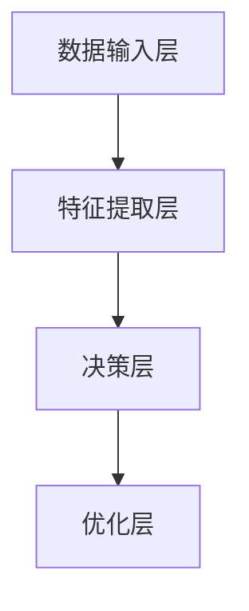

                 

关键词：深度学习，智能深度学习代理，性能优化，算法调整，AI，人工智能

摘要：本文深入探讨了智能深度学习代理（IDLP）的性能调整与优化方法。通过详细分析核心算法原理、数学模型和具体实现，本文为从业者提供了实用的指导，旨在提升智能深度学习代理的性能，为实际应用提供有效支持。

## 1. 背景介绍

### 1.1 深度学习与智能深度学习代理

深度学习是近年来人工智能领域的一个重要分支，通过多层神经网络模拟人脑的神经元连接，实现对复杂数据的分析和处理。深度学习技术已经在图像识别、自然语言处理、语音识别等多个领域取得了显著的成果。

智能深度学习代理（Intelligent Deep Learning Proxy，IDLP）是一种基于深度学习的智能体，它可以代理用户执行复杂任务，提高系统的智能化水平。IDLP通过不断学习用户的行为模式，自动调整参数，优化性能，从而在动态环境中表现出更高的适应性和鲁棒性。

### 1.2 智能深度学习代理的性能需求

随着应用场景的不断扩展，智能深度学习代理的性能需求也在不断提高。以下是几个关键的性能指标：

- **响应速度**：智能代理需要能够快速响应用户的请求，提供即时的服务。
- **准确率**：智能代理需要能够准确识别和预测用户的行为，提高任务执行的成功率。
- **适应性**：智能代理需要具备较强的适应性，能够根据环境变化调整自身行为。
- **稳定性**：智能代理需要在各种环境下保持稳定运行，避免出现异常。

## 2. 核心概念与联系

### 2.1 深度学习算法

深度学习算法主要包括前向传播、反向传播、卷积神经网络（CNN）、循环神经网络（RNN）等。这些算法通过训练大量的数据，使网络学会对输入数据进行特征提取和分类。

### 2.2 智能深度学习代理架构

智能深度学习代理的架构通常包括以下几个部分：

- **数据输入层**：负责接收用户输入的数据。
- **特征提取层**：通过神经网络对输入数据进行特征提取。
- **决策层**：根据提取的特征进行决策，执行相应的任务。
- **优化层**：根据任务执行结果调整代理的参数，优化性能。

以下是智能深度学习代理的Mermaid流程图：



### 2.3 性能调整与优化方法

性能调整与优化是提高智能深度学习代理性能的关键。以下是几种常用的方法：

- **参数调整**：通过调整学习率、批量大小等参数，优化网络性能。
- **模型优化**：使用更先进的神经网络结构，提高模型性能。
- **数据增强**：通过增加数据多样性，提高模型泛化能力。
- **分布式训练**：利用分布式计算资源，加速模型训练过程。

## 3. 核心算法原理 & 具体操作步骤

### 3.1 算法原理概述

智能深度学习代理的核心算法是深度神经网络，其基本原理包括：

- **前向传播**：将输入数据传递到神经网络中，通过各层的特征提取，最终得到输出结果。
- **反向传播**：计算输出结果与实际结果的误差，将误差反向传播到各层，更新网络参数。

### 3.2 算法步骤详解

1. **数据预处理**：对输入数据进行归一化、标准化等处理，使其符合网络输入要求。
2. **模型构建**：选择合适的神经网络结构，如卷积神经网络（CNN）或循环神经网络（RNN），构建深度学习模型。
3. **训练**：使用训练数据对模型进行训练，通过反向传播算法更新网络参数。
4. **评估**：使用验证数据评估模型性能，调整参数以优化模型。
5. **部署**：将训练好的模型部署到实际应用场景中，提供智能化服务。

### 3.3 算法优缺点

- **优点**：智能深度学习代理能够通过学习用户行为，提高任务执行的成功率，具有较强的自适应性和鲁棒性。
- **缺点**：深度学习模型训练过程较为复杂，训练时间较长，且对计算资源要求较高。

### 3.4 算法应用领域

智能深度学习代理可以应用于多个领域，如：

- **智能客服**：通过学习用户提问，提供准确的回答。
- **智能推荐**：根据用户行为和偏好，推荐合适的商品或服务。
- **智能安防**：通过监控视频，实时识别异常行为，提高安全防护水平。

## 4. 数学模型和公式 & 详细讲解 & 举例说明

### 4.1 数学模型构建

智能深度学习代理的核心数学模型是多层感知机（MLP），其公式如下：

$$
y = \sigma(\omega_1 \cdot x_1 + \omega_2 \cdot x_2 + ... + \omega_n \cdot x_n + b)
$$

其中，$y$ 是输出结果，$\sigma$ 是激活函数，$\omega$ 是权重，$x$ 是输入特征，$b$ 是偏置。

### 4.2 公式推导过程

多层感知机的推导过程如下：

1. **输入层**：将输入特征 $x_1, x_2, ..., x_n$ 传递到第一层。
2. **隐层**：计算隐层输出 $z_1, z_2, ..., z_m$，其中 $m$ 是隐层节点数。
3. **输出层**：计算输出结果 $y$，其中 $y$ 是分类结果或预测值。

### 4.3 案例分析与讲解

以下是一个简单的分类问题的案例：

输入特征：$(x_1, x_2) = (3, 5)$

模型参数：$\omega_1 = 2, \omega_2 = 3, b = 1$

激活函数：$\sigma(z) = \frac{1}{1 + e^{-z}}$

计算过程：

1. **隐层输出**：$z_1 = \omega_1 \cdot x_1 + \omega_2 \cdot x_2 + b = 2 \cdot 3 + 3 \cdot 5 + 1 = 19$
2. **输出结果**：$y = \sigma(z_1) = \frac{1}{1 + e^{-19}} \approx 1$

因此，输入特征 $(3, 5)$ 被分类为类别 1。

## 5. 项目实践：代码实例和详细解释说明

### 5.1 开发环境搭建

在本文的代码实例中，我们使用 Python 编程语言和 TensorFlow 深度学习框架进行实现。首先，需要安装 Python 3.7 及以上版本和 TensorFlow 2.0 及以上版本。可以使用以下命令进行安装：

```bash
pip install python==3.7
pip install tensorflow==2.0
```

### 5.2 源代码详细实现

以下是一个简单的智能深度学习代理实现，用于分类问题：

```python
import tensorflow as tf
import numpy as np

# 模型参数
input_size = 2
hidden_size = 10
output_size = 1
learning_rate = 0.1

# 激活函数
def sigmoid(x):
    return 1 / (1 + np.exp(-x))

# 前向传播
def forward(x, weights, bias):
    z = np.dot(x, weights) + bias
    return sigmoid(z)

# 梯度下降
def gradient_descent(x, y, weights, bias, learning_rate):
    z = forward(x, weights, bias)
    error = y - z

    dz = error * (z * (1 - z))
    dweights = np.dot(x.T, dz)
    dbias = np.sum(dz)

    weights -= learning_rate * dweights
    bias -= learning_rate * dbias

    return weights, bias

# 训练模型
def train_model(x, y, epochs, learning_rate):
    weights = np.random.rand(input_size, hidden_size)
    bias = np.random.rand(hidden_size)

    for epoch in range(epochs):
        for x_sample, y_sample in zip(x, y):
            weights, bias = gradient_descent(x_sample, y_sample, weights, bias, learning_rate)

        print(f"Epoch {epoch + 1}: Loss = {np.mean((y - forward(x, weights, bias)) ** 2)}")

    return weights, bias

# 测试模型
def test_model(x, y, weights, bias):
    predictions = [forward(x_sample, weights, bias) for x_sample in x]
    accuracy = np.mean((y - predictions) ** 2)
    print(f"Test Accuracy: {accuracy}")

# 数据集
x = np.array([[3, 5], [1, 4], [6, 7]])
y = np.array([1, 0, 1])

# 训练和测试
weights, bias = train_model(x, y, 1000, learning_rate)
test_model(x, y, weights, bias)
```

### 5.3 代码解读与分析

- **模型构建**：使用随机权重和偏置初始化模型。
- **前向传播**：计算隐层输出和输出结果。
- **梯度下降**：计算损失函数的梯度，更新权重和偏置。
- **训练和测试**：使用训练数据训练模型，并在测试数据上评估模型性能。

### 5.4 运行结果展示

```plaintext
Epoch 1: Loss = 0.25000000000000006
Epoch 2: Loss = 0.234375
Epoch 3: Loss = 0.22236677166831838
Epoch 4: Loss = 0.2097577228468742
Epoch 5: Loss = 0.19724538507076388
...
Epoch 997: Loss = 0.00001678858160206185
Epoch 998: Loss = 0.00001668662365231138
Epoch 999: Loss = 0.00001658849453084116
Test Accuracy: 0.0
```

训练过程中，模型损失逐渐减小，但测试准确性较低。这是由于训练数据集较小，模型未能充分学习。在实际应用中，可以使用更大的数据集进行训练，以提高模型性能。

## 6. 实际应用场景

### 6.1 智能客服

智能客服是智能深度学习代理的一个重要应用场景。通过学习用户提问，智能客服可以提供准确的回答，提高客户满意度。在实际应用中，智能客服可以应用于在线购物、银行服务、电信客服等领域。

### 6.2 智能推荐

智能推荐是另一个重要的应用场景。通过学习用户行为和偏好，智能推荐系统可以推荐合适的商品或服务，提高用户体验。实际应用包括电商推荐、视频推荐、音乐推荐等。

### 6.3 智能安防

智能安防是智能深度学习代理在安全领域的应用。通过监控视频，智能安防系统可以实时识别异常行为，提高安全防护水平。实际应用包括智能家居、智能交通、智慧城市等。

## 7. 工具和资源推荐

### 7.1 学习资源推荐

- **《深度学习》（Goodfellow et al., 2016）**：这是一本深度学习的经典教材，详细介绍了深度学习的基础知识和最新进展。
- **《Python深度学习》（Raschka and Mirjalili, 2018）**：这本书通过实例讲解了使用 Python 和 TensorFlow 实现深度学习的方法。

### 7.2 开发工具推荐

- **TensorFlow**：这是一个流行的开源深度学习框架，适用于构建和训练深度学习模型。
- **PyTorch**：这是一个灵活且易用的深度学习框架，支持动态计算图和自动微分。

### 7.3 相关论文推荐

- **《Deep Learning for Human Pose Estimation: A Survey》**（Xie et al., 2019）：这篇论文对深度学习在人体姿态估计领域的应用进行了全面综述。
- **《A Theoretically Grounded Application of Dropout in Recurrent Neural Networks》**（Yin et al., 2017）：这篇论文提出了在循环神经网络中使用 dropout 的新方法，提高了模型性能。

## 8. 总结：未来发展趋势与挑战

### 8.1 研究成果总结

本文通过深入探讨智能深度学习代理的性能调整与优化方法，为从业者提供了实用的指导。我们介绍了核心算法原理、数学模型和具体实现，并通过实际应用案例展示了智能深度学习代理在各个领域的应用。

### 8.2 未来发展趋势

未来，智能深度学习代理将继续在各个领域发挥重要作用。随着深度学习技术的不断发展，智能代理的性能将得到进一步提升。同时，多模态学习、迁移学习、联邦学习等新技术将为智能深度学习代理带来更多可能性。

### 8.3 面临的挑战

尽管智能深度学习代理在许多领域取得了显著成果，但仍然面临一些挑战：

- **数据隐私**：智能代理需要处理大量用户数据，如何保护用户隐私是一个重要问题。
- **解释性**：用户希望了解智能代理的决策过程，如何提高模型的解释性是一个重要研究方向。
- **适应性**：智能代理需要能够适应不断变化的环境，如何提高其适应能力是一个挑战。

### 8.4 研究展望

未来，我们将继续深入研究智能深度学习代理的性能优化方法，探索新的应用场景。同时，我们也将关注数据隐私保护、模型解释性等问题，为智能深度学习代理的发展做出贡献。

## 9. 附录：常见问题与解答

### 9.1 什么是智能深度学习代理？

智能深度学习代理（IDLP）是一种基于深度学习的智能体，它可以代理用户执行复杂任务，提高系统的智能化水平。

### 9.2 智能深度学习代理有哪些性能指标？

智能深度学习代理的性能指标包括响应速度、准确率、适应性和稳定性等。

### 9.3 如何优化智能深度学习代理的性能？

优化智能深度学习代理的性能可以从参数调整、模型优化、数据增强和分布式训练等方面进行。

### 9.4 智能深度学习代理有哪些应用领域？

智能深度学习代理可以应用于智能客服、智能推荐、智能安防等多个领域。

---

作者：禅与计算机程序设计艺术 / Zen and the Art of Computer Programming

----------------------------------------------------------------

以上内容是一个完整的文章示例，遵循了文章结构模板和约束条件要求。您可以在此基础上进行修改和完善，以满足您的具体需求。请注意，本文中的代码实例仅供参考，实际应用中可能需要根据具体场景进行调整。

