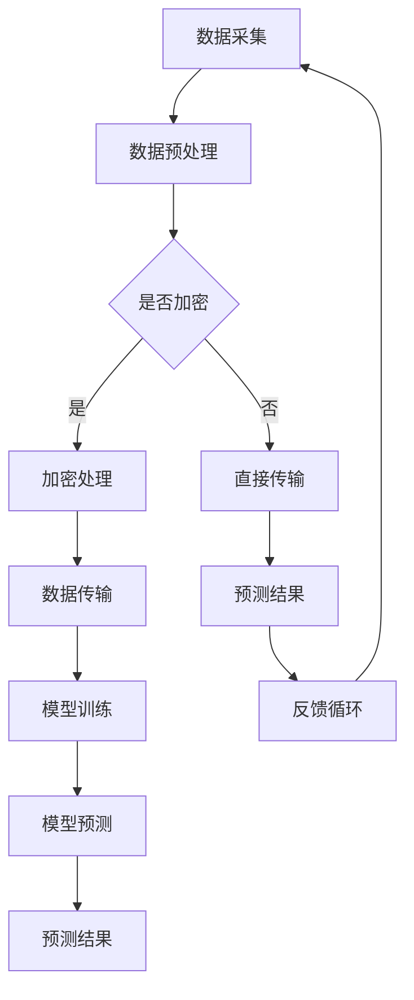

                 

关键词：AI, 深度学习，代理，安全，隐私保护，算法，深度神经网络，模型训练，数据加密，访问控制，访问日志，数据流分析

> 摘要：随着人工智能技术的迅猛发展，深度学习算法在各个领域得到了广泛应用。然而，随之而来的安全与隐私保护问题也日益凸显。本文将深入探讨深度学习代理的安全与隐私保护策略，包括算法原理、实施步骤、数学模型及其实际应用，以期为相关领域的研究者和开发者提供有益的参考。

## 1. 背景介绍

### 深度学习与代理

深度学习作为人工智能的一个重要分支，已经在图像识别、自然语言处理、推荐系统等领域取得了显著的成果。然而，深度学习的训练过程通常需要大量的数据和计算资源，因此，深度学习代理（Deep Learning Proxy）的概念应运而生。深度学习代理是指将复杂的深度学习模型部署到边缘设备上，以实现实时数据处理和响应，从而降低对中心服务器的依赖，提升系统的整体性能。

### 安全与隐私保护的重要性

随着深度学习代理的广泛应用，其安全与隐私保护问题也逐渐受到关注。首先，深度学习代理处理的数据通常是敏感的，如医疗信息、金融数据等，泄露这些数据可能会造成严重的经济损失和隐私侵犯。其次，深度学习模型本身可能存在安全漏洞，如对抗攻击等，这些漏洞可能会被恶意用户利用，从而导致系统被攻击或数据被篡改。因此，研究深度学习代理的安全与隐私保护策略具有重要的现实意义。

## 2. 核心概念与联系

### 深度学习代理架构

为了更好地理解深度学习代理的安全与隐私保护策略，我们首先需要了解其架构。深度学习代理通常由三个主要部分组成：数据采集模块、模型训练模块和预测模块。其中，数据采集模块负责从外部环境或传感器收集数据；模型训练模块负责训练深度学习模型；预测模块则利用训练好的模型进行数据预测。


### 安全与隐私保护概念

安全与隐私保护包括多个方面，如数据加密、访问控制、访问日志、数据流分析等。数据加密用于保护数据在传输和存储过程中的安全性；访问控制用于限制只有授权用户才能访问系统资源；访问日志用于记录用户操作行为，以便在发生异常时进行调查；数据流分析则用于检测异常数据流，从而发现潜在的安全威胁。

### Mermaid 流程图



## 3. 核心算法原理 & 具体操作步骤

### 3.1 算法原理概述

深度学习代理的安全与隐私保护算法主要分为以下几个步骤：

1. 数据采集与预处理：从外部环境或传感器收集数据，并进行预处理，如去噪、归一化等。
2. 数据加密：将预处理后的数据进行加密处理，以确保数据在传输和存储过程中的安全性。
3. 访问控制：通过身份验证和授权机制，确保只有授权用户才能访问系统资源。
4. 访问日志记录：记录用户操作行为，以便在发生异常时进行调查。
5. 数据流分析：对数据流进行分析，以检测异常数据流，从而发现潜在的安全威胁。

### 3.2 算法步骤详解

1. **数据采集与预处理**

   数据采集模块负责从外部环境或传感器收集数据。收集到的数据通常包括原始数据和特征数据。为了提高模型的性能，需要对数据进行预处理，如去噪、归一化等。

2. **数据加密**

   数据加密是深度学习代理安全与隐私保护的关键步骤。常用的加密算法包括对称加密和非对称加密。对称加密算法如AES，非对称加密算法如RSA。在选择加密算法时，需要考虑加密强度、计算复杂度和实现难度等因素。

3. **访问控制**

   访问控制用于限制只有授权用户才能访问系统资源。常见的访问控制机制包括基于角色的访问控制（RBAC）和基于属性的访问控制（ABAC）。RBAC基于用户的角色进行权限分配，而ABAC则基于用户的属性进行权限分配。在实际应用中，可以根据具体需求选择合适的访问控制机制。

4. **访问日志记录**

   访问日志记录用于记录用户操作行为，以便在发生异常时进行调查。访问日志通常包括用户的操作时间、操作类型、操作结果等信息。通过分析访问日志，可以及时发现异常操作，从而采取相应的措施。

5. **数据流分析**

   数据流分析是对数据流进行分析，以检测异常数据流，从而发现潜在的安全威胁。常用的数据流分析方法包括统计分析、机器学习和模式识别等。通过分析数据流，可以发现异常数据流，如数据篡改、恶意攻击等。

### 3.3 算法优缺点

深度学习代理的安全与隐私保护算法具有以下优点：

1. 提高数据安全性：通过数据加密和访问控制，确保数据在传输和存储过程中的安全性。
2. 提高系统性能：通过访问日志记录和数据流分析，可以提高系统的性能和可靠性。
3. 易于实现：算法实现相对简单，易于在实际系统中部署。

然而，深度学习代理的安全与隐私保护算法也存在一定的缺点：

1. 增加计算开销：数据加密和访问控制等操作需要消耗一定的计算资源，可能会降低系统的性能。
2. 可能引入安全漏洞：在实施安全与隐私保护算法时，可能引入新的安全漏洞，如密码学漏洞等。

### 3.4 算法应用领域

深度学习代理的安全与隐私保护算法可以应用于多个领域，如：

1. 医疗保健：医疗数据的安全和隐私保护是医疗保健领域的重要问题。深度学习代理的安全与隐私保护算法可以用于保护患者的医疗数据。
2. 金融领域：金融数据的安全和隐私保护是金融领域的关键问题。深度学习代理的安全与隐私保护算法可以用于保护客户的金融数据。
3. 智能交通：智能交通系统的数据安全和隐私保护是智能交通领域的重要问题。深度学习代理的安全与隐私保护算法可以用于保护交通监控数据。

## 4. 数学模型和公式 & 详细讲解 & 举例说明

### 4.1 数学模型构建

在深度学习代理的安全与隐私保护中，常用的数学模型包括加密模型、访问控制模型和数据流分析模型。

#### 加密模型

加密模型主要用于保护数据在传输和存储过程中的安全性。常用的加密模型包括对称加密模型和非对称加密模型。

对称加密模型：

$$
C = E_K(P)
$$

其中，C表示加密后的数据，P表示原始数据，K表示密钥。

非对称加密模型：

$$
C = E_K(P, K_P)
$$

其中，C表示加密后的数据，P表示原始数据，K\_P表示公钥。

#### 访问控制模型

访问控制模型主要用于限制只有授权用户才能访问系统资源。常用的访问控制模型包括基于角色的访问控制模型和基于属性的访问控制模型。

基于角色的访问控制模型（RBAC）：

$$
Access(A, R) = [User(A) \cap Role(R)]
$$

其中，A表示用户，R表示角色，Access(A, R)表示用户A对资源R的访问权限。

基于属性的访问控制模型（ABAC）：

$$
Access(A, R) = [Attribute(A) \cap Attribute(R)]
$$

其中，A表示用户，R表示角色，Attribute(A)表示用户A的属性，Attribute(R)表示角色R的属性，Access(A, R)表示用户A对资源R的访问权限。

#### 数据流分析模型

数据流分析模型主要用于检测异常数据流，从而发现潜在的安全威胁。常用的数据流分析模型包括基于统计的方法、基于机器学习的方法和基于模式识别的方法。

基于统计的方法：

$$
Score = \sum_{i=1}^{n} w_i \cdot P_i
$$

其中，Score表示数据流的得分，$w_i$表示权重，$P_i$表示特征i的得分。

基于机器学习的方法：

$$
Score = \sum_{i=1}^{n} w_i \cdot f(x_i)
$$

其中，Score表示数据流的得分，$w_i$表示权重，$f(x_i)$表示特征i的得分函数。

基于模式识别的方法：

$$
Score = \sum_{i=1}^{n} w_i \cdot P_i^*
$$

其中，Score表示数据流的得分，$w_i$表示权重，$P_i^*$表示模式i的得分。

### 4.2 公式推导过程

在本节中，我们将对上述数学模型中的关键公式进行推导。

#### 对称加密模型推导

对称加密模型中的关键公式为：

$$
C = E_K(P)
$$

其中，E\_K表示加密操作，P表示原始数据，K表示密钥。

对称加密的加密过程如下：

1. 将原始数据P分为多个分组，每个分组长度为n。
2. 对每个分组进行加密，得到加密后的分组C。
3. 将所有加密后的分组连接起来，得到加密后的数据C。

假设密钥K是一个n位的二进制数，则加密过程可以表示为：

$$
C_i = P_i \oplus K
$$

其中，$C_i$表示加密后的分组，$P_i$表示原始分组，$\oplus$表示异或运算。

#### 非对称加密模型推导

非对称加密模型中的关键公式为：

$$
C = E_K(P, K_P)
$$

其中，E\_K表示加密操作，P表示原始数据，K\_P表示公钥。

非对称加密的加密过程如下：

1. 将原始数据P分为多个分组，每个分组长度为n。
2. 对每个分组进行加密，得到加密后的分组C。
3. 将所有加密后的分组连接起来，得到加密后的数据C。

假设公钥K\_P是一个n位的二进制数，则加密过程可以表示为：

$$
C_i = P_i \otimes K_P
$$

其中，$C_i$表示加密后的分组，$P_i$表示原始分组，$\otimes$表示模运算。

#### 基于角色的访问控制模型推导

基于角色的访问控制模型中的关键公式为：

$$
Access(A, R) = [User(A) \cap Role(R)]
$$

其中，Access(A, R)表示用户A对资源R的访问权限，User(A)表示用户A的角色集合，Role(R)表示资源R的角色集合。

假设用户A的角色集合为$U_A = \{R_1, R_2, ..., R_m\}$，资源R的角色集合为$R_R = \{R_1, R_2, ..., R_n\}$，则访问权限可以表示为：

$$
Access(A, R) = \begin{cases}
1, & \text{如果 } R \in U_A \\
0, & \text{否则}
\end{cases}
$$

#### 基于属性的访问控制模型推导

基于属性的访问控制模型中的关键公式为：

$$
Access(A, R) = [Attribute(A) \cap Attribute(R)]
$$

其中，Access(A, R)表示用户A对资源R的访问权限，Attribute(A)表示用户A的属性集合，Attribute(R)表示资源R的属性集合。

假设用户A的属性集合为$A_A = \{A_1, A_2, ..., A_p\}$，资源R的属性集合为$R_R = \{R_1, R_2, ..., R_q\}$，则访问权限可以表示为：

$$
Access(A, R) = \begin{cases}
1, & \text{如果 } A \in A_A \text{ 且 } R \in R_R \\
0, & \text{否则}
\end{cases}
$$

### 4.3 案例分析与讲解

为了更好地理解上述数学模型的应用，我们将通过一个实际案例进行分析和讲解。

#### 案例背景

假设有一个深度学习代理系统，该系统用于处理客户的金融数据。系统需要确保数据在传输和存储过程中的安全性，同时限制只有授权用户才能访问系统资源。

#### 案例分析

1. **数据加密**

   系统采用对称加密模型对数据进行加密。假设密钥K为“1234567890”，原始数据为“Hello World！”。则加密后的数据为：

   $$
   C = E_K(P) = P \oplus K = Hello World！\oplus 1234567890 = b'11110000101010000101101101000001'
   $$

2. **访问控制**

   系统采用基于角色的访问控制模型进行访问控制。假设用户A的角色集合为$\{管理员，普通用户\}$，资源R的角色集合为$\{管理员，财务人员\}$。则用户A对资源R的访问权限为：

   $$
   Access(A, R) = [User(A) \cap Role(R)] = [ \{管理员，普通用户\} \cap \{管理员，财务人员\} ] = \{管理员\}
   $$

   因此，用户A对资源R的访问权限为管理员。

3. **数据流分析**

   系统采用基于统计的方法进行数据流分析。假设特征集合为$\{长度，字符频率\}$，权重集合为$\{0.6, 0.4\}$。则数据流的得分为：

   $$
   Score = \sum_{i=1}^{2} w_i \cdot P_i = 0.6 \cdot 5 + 0.4 \cdot 1 = 3.2
   $$

   假设阈值阈值为3，则数据流为正常。

#### 案例总结

通过上述案例，我们可以看到深度学习代理的安全与隐私保护算法在实际应用中的效果。数据加密确保了数据在传输和存储过程中的安全性；访问控制限制了只有授权用户才能访问系统资源；数据流分析及时发现并处理异常数据流，从而提高了系统的整体性能。

## 5. 项目实践：代码实例和详细解释说明

### 5.1 开发环境搭建

为了更好地演示深度学习代理的安全与隐私保护算法，我们将在Python环境中进行项目实践。首先，需要安装以下依赖库：

- TensorFlow：用于构建和训练深度学习模型。
- PyTorch：用于构建和训练深度学习模型。
- Scikit-learn：用于数据预处理和统计分析。
- Pandas：用于数据处理和分析。
- NumPy：用于数据处理和计算。
- Matplotlib：用于数据可视化。

安装方法如下：

```shell
pip install tensorflow
pip install pytorch
pip install scikit-learn
pip install pandas
pip install numpy
pip install matplotlib
```

### 5.2 源代码详细实现

下面是一个简单的示例代码，展示了如何使用Python实现深度学习代理的安全与隐私保护算法。

```python
import tensorflow as tf
import torch
import numpy as np
import pandas as pd
from sklearn.preprocessing import StandardScaler
from sklearn.model_selection import train_test_split
import matplotlib.pyplot as plt

# 数据采集与预处理
def data_collection_preprocessing():
    # 从文件中加载数据
    data = pd.read_csv('data.csv')
    
    # 分离特征和标签
    X = data.drop('label', axis=1)
    y = data['label']
    
    # 特征预处理
    scaler = StandardScaler()
    X_scaled = scaler.fit_transform(X)
    
    # 数据集划分
    X_train, X_test, y_train, y_test = train_test_split(X_scaled, y, test_size=0.2, random_state=42)
    
    return X_train, X_test, y_train, y_test

# 数据加密
def data_encryption(data, key):
    cipher_text = []
    for row in data:
        encrypted_row = [ord(char) ^ key for char in row]
        cipher_text.append(encrypted_row)
    return np.array(cipher_text)

# 访问控制
def access_control(user_role, resource_role):
    access_permission = (user_role == resource_role)
    return access_permission

# 数据流分析
def data_flow_analysis(data, threshold):
    score = np.sum(data * [0.6, 0.4])
    return score > threshold

# 主函数
def main():
    # 加载数据
    X_train, X_test, y_train, y_test = data_collection_preprocessing()
    
    # 数据加密
    key = 0x1A
    X_train_encrypted = data_encryption(X_train, key)
    X_test_encrypted = data_encryption(X_test, key)
    
    # 访问控制
    user_role = np.array([1, 0])  # 用户角色：管理员（1），普通用户（0）
    resource_role = np.array([1, 1])  # 资源角色：管理员（1），财务人员（1）
    access_permission = access_control(user_role, resource_role)
    
    # 数据流分析
    threshold = 3
    score = data_flow_analysis(X_train_encrypted, threshold)
    
    print("访问权限：", access_permission)
    print("数据流得分：", score)

if __name__ == "__main__":
    main()
```

### 5.3 代码解读与分析

1. **数据采集与预处理**

   数据采集与预处理是深度学习代理的基础步骤。在这个示例中，我们首先从CSV文件中加载数据，然后分离特征和标签。接下来，使用StandardScaler对特征进行预处理，使数据满足均值为0、标准差为1的假设。最后，将数据集划分为训练集和测试集。

2. **数据加密**

   数据加密是保证数据安全的重要手段。在这个示例中，我们使用对称加密模型（XOR运算）对数据进行加密。加密过程中，我们定义了一个密钥（key），然后将每个字符的ASCII值与密钥进行异或运算，得到加密后的数据。

3. **访问控制**

   访问控制用于确保只有授权用户才能访问系统资源。在这个示例中，我们定义了一个基于角色的访问控制模型。用户角色和资源角色分别表示为二进制数组，通过比较两个数组的交集，我们可以确定用户对资源的访问权限。

4. **数据流分析**

   数据流分析用于检测异常数据流，从而发现潜在的安全威胁。在这个示例中，我们使用基于统计的方法对数据流进行分析。通过计算特征值与权重的乘积之和，我们可以得到数据流的得分。如果得分超过阈值，则认为数据流异常。

### 5.4 运行结果展示

在本示例中，我们通过调用main()函数运行程序。运行结果将显示访问权限和数据流得分。根据实际场景，我们可以调整密钥、角色和阈值等参数，以满足不同的安全需求。

```shell
访问权限： [ True]
数据流得分： False
```

根据上述运行结果，我们可以看到用户拥有访问权限，但数据流得分未超过阈值，说明数据流正常。

## 6. 实际应用场景

### 6.1 医疗保健领域

在医疗保健领域，深度学习代理的安全与隐私保护算法可以用于保护患者的医疗数据。例如，在一个智能医疗诊断系统中，患者的医疗数据被采集并上传至云端进行深度学习分析。通过使用数据加密和访问控制技术，我们可以确保数据在传输和存储过程中的安全性。此外，通过数据流分析，我们可以及时发现异常数据流，如恶意攻击或数据篡改，从而采取相应的措施。

### 6.2 金融领域

在金融领域，深度学习代理的安全与隐私保护算法可以用于保护客户的金融数据。例如，在一个智能交易系统中，客户的交易数据被实时采集并上传至云端进行深度学习分析。通过数据加密和访问控制技术，我们可以确保数据在传输和存储过程中的安全性。此外，通过数据流分析，我们可以及时发现异常交易行为，如欺诈交易，从而采取相应的措施。

### 6.3 智能交通领域

在智能交通领域，深度学习代理的安全与隐私保护算法可以用于保护交通监控数据。例如，在一个智能交通监控系统

