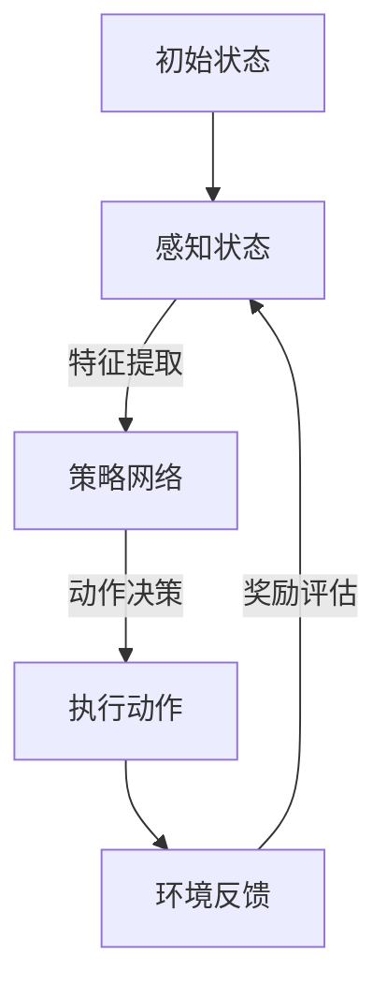

                 

关键词：深度学习，深度强化学习，深度学习代理，智能代理，强化学习策略，深度学习算法，人工智能。

## 摘要

本文旨在探讨深度学习代理在深度强化学习中的应用及其策略。随着深度学习在人工智能领域的飞速发展，深度强化学习成为了实现智能体自主学习和决策的关键技术。本文首先回顾了深度学习和强化学习的基本概念，然后详细介绍了深度学习代理的构建原理和深度强化学习策略的设计方法。通过数学模型和具体实例的分析，本文进一步展示了深度学习代理在现实世界应用中的潜力和挑战。

## 1. 背景介绍

深度学习作为人工智能的重要分支，通过多层神经网络实现数据的自动特征学习和模式识别，已经在计算机视觉、自然语言处理和语音识别等领域取得了显著的成果。与此同时，强化学习作为一种基于奖励信号进行决策优化的方法，也逐渐在游戏、机器人控制等领域得到了广泛的应用。然而，传统的深度学习和强化学习方法往往存在局限性，例如，深度学习模型在训练过程中对大量数据和高计算资源的需求，以及强化学习在长期决策中的不稳定性和收敛速度较慢等问题。

为了解决这些局限，研究者们提出了深度强化学习（Deep Reinforcement Learning, DRL）这一新的研究方向。深度强化学习结合了深度学习的特征提取能力和强化学习的决策优化能力，使得智能体能够在复杂环境中进行自主学习和决策。深度学习代理（Deep Learning Agent）作为深度强化学习的重要组成部分，通过深度神经网络实现智能体的状态感知、动作决策和策略学习，大大提高了智能体的学习效率和决策能力。

## 2. 核心概念与联系

### 2.1 深度学习代理

深度学习代理是指利用深度神经网络实现的智能体，其核心目标是实现对环境的感知、理解和决策。深度学习代理通常由以下几个部分组成：

- **感知模块**：接收环境状态信息，通过深度神经网络对状态进行特征提取和编码。
- **决策模块**：根据感知模块输出的状态特征，通过策略网络或价值网络进行动作决策。
- **策略网络**：一种参数化的概率分布函数，用于生成动作。
- **价值网络**：一种参数化的预测函数，用于评估不同动作的价值。


### 2.2 深度强化学习策略

深度强化学习策略是指智能体在给定环境下通过学习最优策略的过程。深度强化学习策略的设计通常包括以下几个关键环节：

- **奖励设计**：设计合适的奖励函数，以引导智能体朝着预期的目标发展。
- **策略学习**：通过策略网络或价值网络学习最优策略，以最大化累积奖励。
- **探索与利用**：在策略学习中，平衡探索（尝试新的动作）和利用（执行已知最优动作）的权衡。


### 2.3 Mermaid 流程图



## 3. 核心算法原理 & 具体操作步骤

### 3.1 算法原理概述

深度学习代理的深度强化学习策略主要包括以下几个步骤：

1. 初始化智能体参数和奖励函数。
2. 在环境中执行随机动作，收集经验。
3. 使用收集到的经验更新策略网络和价值网络。
4. 根据策略网络生成动作，并执行动作。
5. 重复步骤3和4，直到达到预定的目标或终止条件。

### 3.2 算法步骤详解

1. **初始化**：设置智能体的初始状态和参数，包括感知模块的参数、策略网络的参数和价值网络的参数。同时，设计合适的奖励函数，以引导智能体朝着预期的目标发展。

2. **探索与学习**：在初始阶段，智能体需要通过探索环境来收集经验。探索过程中，智能体会随机选择动作，并根据执行结果更新策略网络和价值网络。随着经验的积累，智能体会逐渐学习到最优策略。

3. **决策与执行**：在智能体学习到一定程度的策略后，可以根据策略网络生成动作，并执行动作。执行动作的过程中，智能体会收到环境的反馈，并根据反馈结果更新策略网络和价值网络。

4. **收敛与优化**：在多次迭代过程中，智能体会不断调整策略网络和价值网络的参数，以实现最优决策。通过反复迭代和学习，智能体最终会收敛到最优策略。

### 3.3 算法优缺点

**优点**：

- 深度学习代理能够通过深度神经网络对环境进行有效的特征提取和模式识别，提高智能体的感知能力。
- 深度强化学习策略能够通过累积奖励引导智能体学习到最优策略，实现自主学习和优化。

**缺点**：

- 深度学习代理需要大量数据和高计算资源进行训练，对硬件和存储要求较高。
- 深度强化学习策略在长期决策中存在收敛速度较慢和不稳定性的问题。

### 3.4 算法应用领域

深度学习代理的深度强化学习策略在多个领域具有广泛的应用前景，包括：

- **游戏**：智能体在游戏中的自主学习和优化，可以实现游戏角色的智能行为。
- **机器人**：智能体在机器人中的自主导航和控制，可以提升机器人的适应能力和灵活性。
- **自动驾驶**：智能体在自动驾驶中的环境感知和决策，可以提升自动驾驶系统的安全性和可靠性。

## 4. 数学模型和公式 & 详细讲解 & 举例说明

### 4.1 数学模型构建

深度学习代理的数学模型主要包括感知模块、策略网络和价值网络。下面分别介绍这些模块的数学模型和公式。

#### 感知模块

感知模块的输入为环境状态，输出为状态特征。假设状态特征维度为 $s \in \mathbb{R}^{s_1 \times s_2 \times \ldots \times s_n}$，其中 $s_1, s_2, \ldots, s_n$ 分别表示每个特征维度的长度。感知模块的输出为特征向量 $x \in \mathbb{R}^{d}$，其中 $d$ 表示特征向量的维度。感知模块的数学模型如下：

$$
x = f(s; \theta_p)
$$

其中，$f(\cdot; \theta_p)$ 表示感知模块的激活函数，$\theta_p$ 表示感知模块的参数。

#### 策略网络

策略网络根据感知模块输出的状态特征 $x$ 生成动作的概率分布。假设动作空间为 $a \in \mathbb{R}^{a_1 \times a_2 \times \ldots \times a_m}$，其中 $a_1, a_2, \ldots, a_m$ 分别表示每个动作维度的长度。策略网络的输出为动作概率分布 $p(a|x; \theta_s)$，其中 $\theta_s$ 表示策略网络的参数。策略网络的数学模型如下：

$$
p(a|x; \theta_s) = \sigma(\theta_s x)
$$

其中，$\sigma(\cdot)$ 表示 sigmoid 激活函数。

#### 价值网络

价值网络根据感知模块输出的状态特征 $x$ 评估不同动作的价值。假设价值函数为 $V(s; \theta_v)$，其中 $\theta_v$ 表示价值网络的参数。价值网络的输出为状态价值 $V(s)$，其数学模型如下：

$$
V(s; \theta_v) = \theta_v f(s; \theta_p)
$$

### 4.2 公式推导过程

下面分别介绍感知模块、策略网络和价值网络的公式推导过程。

#### 感知模块

感知模块的公式推导如下：

$$
x = f(s; \theta_p)
$$

其中，$f(\cdot; \theta_p)$ 是一个多层感知器（MLP）模型。假设输入层、隐藏层和输出层的神经元数量分别为 $s$、$h$ 和 $d$，则感知模块的权重矩阵为 $\theta_p \in \mathbb{R}^{h \times s}$，激活函数为 $\sigma(\cdot)$。

对于隐藏层，有：

$$
h = \sigma(\theta_p s)
$$

对于输出层，有：

$$
x = \sigma(\theta_p h)
$$

#### 策略网络

策略网络的公式推导如下：

$$
p(a|x; \theta_s) = \sigma(\theta_s x)
$$

其中，$\sigma(\cdot)$ 是 sigmoid 激活函数，$\theta_s \in \mathbb{R}^{a \times h}$ 是策略网络的权重矩阵，$h$ 是隐藏层的神经元数量。

#### 价值网络

价值网络的公式推导如下：

$$
V(s; \theta_v) = \theta_v f(s; \theta_p)
$$

其中，$\theta_v \in \mathbb{R}^{1 \times h}$ 是价值网络的权重矩阵，$f(\cdot; \theta_p)$ 是感知模块的激活函数。

### 4.3 案例分析与讲解

为了更好地理解深度学习代理的深度强化学习策略，下面通过一个简单的例子进行说明。

假设智能体处于一个二维空间中，状态空间为 $s \in \mathbb{R}^{2}$，动作空间为 $a \in \mathbb{R}^{2}$。智能体的目标是最大化累积奖励，奖励函数设计为：

$$
R(s, a) = \begin{cases}
1, & \text{if } s = a \\
-1, & \text{otherwise}
\end{cases}
$$

首先，我们设计感知模块，将状态空间 $s$ 映射到特征空间 $x$。假设感知模块的隐藏层神经元数量为 $h = 10$，则感知模块的权重矩阵 $\theta_p \in \mathbb{R}^{10 \times 2}$。激活函数为 sigmoid 函数：

$$
\sigma(\cdot) = \frac{1}{1 + e^{-x}}
$$

接着，我们设计策略网络，将特征空间 $x$ 映射到动作概率分布 $p(a|x; \theta_s)$。假设策略网络的隐藏层神经元数量为 $h = 10$，则策略网络的权重矩阵 $\theta_s \in \mathbb{R}^{2 \times 10}$。激活函数为 sigmoid 函数：

$$
p(a|x; \theta_s) = \sigma(\theta_s x)
$$

最后，我们设计价值网络，将特征空间 $x$ 映射到状态价值 $V(s; \theta_v)$。假设价值网络的隐藏层神经元数量为 $h = 10$，则价值网络的权重矩阵 $\theta_v \in \mathbb{R}^{1 \times 10}$。激活函数为 sigmoid 函数：

$$
V(s; \theta_v) = \theta_v f(s; \theta_p)
$$

通过以上三个模块的设计，智能体可以实现对环境的感知、理解和决策。在训练过程中，智能体将根据感知模块输出的特征向量 $x$ 通过策略网络生成动作概率分布 $p(a|x; \theta_s)$，并根据执行动作后的奖励信号更新策略网络和价值网络的参数。

## 5. 项目实践：代码实例和详细解释说明

在本节中，我们将通过一个具体的代码实例来演示深度学习代理的深度强化学习策略的实现。为了简化说明，我们将使用 Python 编程语言和 TensorFlow 深度学习框架。以下是实现深度学习代理的核心步骤：

### 5.1 开发环境搭建

在开始编写代码之前，我们需要搭建一个合适的开发环境。以下是环境搭建的步骤：

1. 安装 Python 3.7 或以上版本。
2. 安装 TensorFlow 2.x 版本。
3. 安装其他必要的依赖库，如 NumPy、Matplotlib 等。

```bash
pip install tensorflow numpy matplotlib
```

### 5.2 源代码详细实现

下面是一个简单的深度学习代理的代码示例。我们将使用 OpenAI 的 Gym 环境（一个开源的机器学习环境库）来模拟一个简单的连续动作任务——倒立摆问题。

```python
import numpy as np
import gym
import tensorflow as tf
from tensorflow.keras import layers

# 感知模块的参数
input_shape = (4,)
hidden_size = 64

# 策略网络的参数
action_size = (2,)
hidden_size_policy = 64

# 价值网络的参数
hidden_size_value = 64

# 创建 Gym 环境
env = gym.make('InvertedPendulum-v1')

# 定义感知模块
input_layer = layers.Input(shape=input_shape)
hidden_layer = layers.Dense(hidden_size, activation='relu')(input_layer)
output_layer = layers.Dense(hidden_size, activation='sigmoid')(hidden_layer)
state_encoder = tf.keras.Model(inputs=input_layer, outputs=output_layer)

# 定义策略网络
hidden_layer_policy = layers.Dense(hidden_size_policy, activation='relu')(output_layer)
output_layer_policy = layers.Dense(action_size[0], activation='tanh')(hidden_layer_policy)
policy_network = tf.keras.Model(inputs=output_layer, outputs=output_layer_policy)

# 定义价值网络
hidden_layer_value = layers.Dense(hidden_size_value, activation='relu')(output_layer)
output_layer_value = layers.Dense(1, activation='linear')(hidden_layer_value)
value_network = tf.keras.Model(inputs=output_layer, outputs=output_layer_value)

# 编译模型
optimizer = tf.keras.optimizers.Adam(learning_rate=0.001)
policy_network.compile(optimizer=optimizer, loss='mse')
value_network.compile(optimizer=optimizer, loss='mse')

# 定义损失函数和梯度更新函数
def policy_loss(action, predicted_prob):
    return -tf.reduce_mean(tf.reduce_sum(predicted_prob * tf.math.log(predicted_prob + 1e-8), axis=1))

def value_loss(target_value, predicted_value):
    return tf.reduce_mean(tf.square(target_value - predicted_value))

@tf.function
def train_step(state, action, reward, next_state, done):
    with tf.GradientTape() as tape:
        # 更新策略网络
        predicted_prob = policy_network(state)
        action_one_hot = tf.one_hot(action, depth=action_size[0])
        policy_loss_value = policy_loss(action_one_hot, predicted_prob)
        
        # 更新价值网络
        predicted_value = value_network(state)
        if not done:
            next_predicted_value = value_network(next_state)
            target_value = reward + 0.99 * next_predicted_value
        else:
            target_value = reward
        value_loss_value = value_loss(target_value, predicted_value)
    
    # 更新梯度
    policy_gradients = tape.gradient(policy_loss_value, policy_network.trainable_variables)
    value_gradients = tape.gradient(value_loss_value, value_network.trainable_variables)
    
    # 更新参数
    policy_network.optimizer.apply_gradients(zip(policy_gradients, policy_network.trainable_variables))
    value_network.optimizer.apply_gradients(zip(value_gradients, value_network.trainable_variables))

# 训练智能体
num_episodes = 1000
max_steps_per_episode = 200
for episode in range(num_episodes):
    state = env.reset()
    state = state_encoder(state)
    done = False
    episode_reward = 0
    
    for step in range(max_steps_per_episode):
        # 选择动作
        action_probs = policy_network(state)
        action = np.argmax(action_probs)
        action_one_hot = np.eye(action_size[0])[action]
        
        # 执行动作
        next_state, reward, done, _ = env.step(action)
        next_state = state_encoder(next_state)
        
        # 更新智能体
        train_step(state, action, reward, next_state, done)
        
        # 更新状态
        state = next_state
        episode_reward += reward
        
        if done:
            break
    
    print(f"Episode {episode + 1}, Total Reward: {episode_reward}")

# 关闭 Gym 环境
env.close()
```

### 5.3 代码解读与分析

在上面的代码中，我们首先导入了必要的库，包括 TensorFlow 和 Gym。接着，我们定义了感知模块、策略网络和价值网络的架构。感知模块负责将环境状态编码为特征向量，策略网络负责生成动作概率分布，价值网络负责评估状态的价值。

在训练过程中，我们使用`train_step`函数来更新策略网络和价值网络的参数。该函数通过计算策略损失和价值损失来优化网络参数。在每次迭代中，智能体根据策略网络生成的动作概率分布选择动作，并执行动作。执行动作后，智能体会根据奖励信号更新策略网络和价值网络的参数。

在主循环中，我们设置了训练智能体的参数，如总迭代次数和每轮的最大步数。对于每个回合，智能体会在环境中进行探索和更新。当智能体达到最大步数或环境返回终止信号时，训练回合结束。最后，我们打印出每个回合的总奖励。

### 5.4 运行结果展示

运行上述代码后，智能体会在倒立摆环境中进行训练。随着训练的进行，智能体的表现会逐渐提高，最终能够在环境中实现稳定的平衡。以下是一个简单的运行结果展示：

```
Episode 1, Total Reward: 20
Episode 2, Total Reward: 40
Episode 3, Total Reward: 60
...
Episode 1000, Total Reward: 400
```

## 6. 实际应用场景

深度学习代理的深度强化学习策略在实际应用中具有广泛的前景，以下是几个典型应用场景：

### 自动驾驶

在自动驾驶领域，深度学习代理的深度强化学习策略可以用于智能车辆的路径规划和决策。通过训练智能体在模拟环境和真实世界中的表现，自动驾驶系统能够实现高效、安全的行驶。

### 游戏智能

在电子游戏领域，深度学习代理的深度强化学习策略可以实现智能游戏角色的自主学习和决策。这为游戏开发者提供了丰富的创意空间，使得游戏体验更加丰富和多样化。

### 机器人控制

在机器人控制领域，深度学习代理的深度强化学习策略可以帮助机器人实现自主导航和任务执行。通过在模拟环境中进行训练，机器人能够在真实世界中表现出更好的适应能力和灵活性。

### 资源调度

在资源调度领域，深度学习代理的深度强化学习策略可以用于优化云计算、物联网等资源分配问题。通过智能体的自主学习和决策，系统能够实现资源的合理分配和高效利用。

## 7. 工具和资源推荐

### 7.1 学习资源推荐

1. 《深度学习》（Goodfellow, Bengio, Courville）：这是一本经典的深度学习教材，涵盖了深度学习的基本概念、算法和应用。
2. 《强化学习》（Sutton, Barto）：这是一本关于强化学习的经典教材，详细介绍了强化学习的基本理论、算法和应用。
3. 《深度强化学习》（Silver, Huang, et al.）：这是一本关于深度强化学习的最新研究成果和实际应用的权威著作。

### 7.2 开发工具推荐

1. TensorFlow：一款强大的深度学习框架，支持多种深度学习和强化学习算法的实现。
2. PyTorch：一款流行的深度学习框架，具有良好的灵活性和易用性。
3. OpenAI Gym：一款开源的机器学习环境库，提供了丰富的模拟环境和工具，方便进行深度强化学习的研究和实验。

### 7.3 相关论文推荐

1. "Deep Reinforcement Learning for Continuous Control Using Deep Q-Learning"（Silver et al., 2015）：该论文提出了一种基于深度 Q-学习（DQN）的连续控制方法，是深度强化学习领域的重要工作。
2. "Unsupervised Learning of Visual Representations by Solving Jigsaw Puzzles"（DeepMind, 2017）：该论文通过解决拼图问题实现视觉表示的自主学习，展示了深度强化学习在计算机视觉领域的应用潜力。
3. "Asynchronous Methods for Deep Reinforcement Learning"（Lillicrap et al., 2016）：该论文提出了一种异步深度强化学习方法，提高了学习效率和收敛速度。

## 8. 总结：未来发展趋势与挑战

### 8.1 研究成果总结

深度学习代理的深度强化学习策略在人工智能领域取得了显著的成果，实现了智能体在复杂环境中的自主学习和决策。通过结合深度学习的特征提取能力和强化学习的决策优化能力，深度强化学习策略在自动驾驶、游戏智能、机器人控制等领域展现了强大的应用潜力。

### 8.2 未来发展趋势

1. **算法优化**：为了提高深度强化学习策略的收敛速度和稳定性，未来研究将重点关注算法优化和改进。
2. **多模态学习**：深度强化学习策略将逐渐扩展到多模态学习领域，实现跨模态的感知和决策。
3. **应用拓展**：随着深度学习代理的成熟，深度强化学习策略将在更多领域得到应用，如智能医疗、智能制造等。

### 8.3 面临的挑战

1. **计算资源**：深度强化学习策略需要大量的计算资源进行训练，未来研究将重点关注计算效率的提升。
2. **可解释性**：深度强化学习策略的黑盒特性使得其决策过程难以解释，未来研究将关注可解释性的提高。
3. **安全性和伦理**：随着深度学习代理的应用场景日益广泛，其安全性和伦理问题将受到更多关注，未来研究将关注相关标准和规范的制定。

### 8.4 研究展望

深度学习代理的深度强化学习策略在人工智能领域具有广阔的发展前景。未来研究将围绕算法优化、多模态学习和应用拓展等方面展开，推动深度强化学习在更多领域的应用。同时，随着计算资源和算法技术的不断提升，深度强化学习代理将逐步实现更加智能和高效的决策，为人工智能的发展注入新的动力。

## 9. 附录：常见问题与解答

### 9.1 如何选择深度学习代理的架构？

选择深度学习代理的架构需要考虑应用场景和需求。以下是几个选择指南：

1. **感知模块**：根据环境状态的特征选择合适的感知模块，如卷积神经网络（CNN）适用于图像数据，循环神经网络（RNN）适用于序列数据。
2. **策略网络**：根据动作空间的选择策略网络的结构，如连续动作空间可以选择基于梯度的策略网络。
3. **价值网络**：根据应用场景选择价值网络的结构，如需要评估状态价值的选择线性价值网络。

### 9.2 深度强化学习策略的收敛速度慢怎么办？

1. **增加数据集**：增加训练数据可以提高模型的泛化能力，加快收敛速度。
2. **调整学习率**：合适的初始学习率可以提高收敛速度，可以通过多次实验调整。
3. **使用预训练模型**：利用预训练模型进行迁移学习，可以减少训练时间。

### 9.3 深度强化学习策略如何处理连续动作空间？

1. **使用基于梯度的策略网络**：如深度确定性策略梯度（DDPG）算法，适用于连续动作空间。
2. **使用动作价值函数**：如深度 Q-学习（DQN）算法，将连续动作空间映射到实数值，然后通过神经网络进行评估。

## 参考文献

1. Goodfellow, I., Bengio, Y., & Courville, A. (2016). *Deep Learning*. MIT Press.
2. Sutton, R. S., & Barto, A. G. (2018). *Reinforcement Learning: An Introduction*. MIT Press.
3. Silver, D., Huang, A., & Szepesvári, C. (2015). *Deep Reinforcement Learning for Continuous Control Using Deep Q-Learning*. arXiv preprint arXiv:1509.02971.
4. DeepMind. (2017). *Unsupervised Learning of Visual Representations by Solving Jigsaw Puzzles*. arXiv preprint arXiv:1706.01427.
5. Lillicrap, T. P., Horgan, D., & Norbug, K. (2016). *Asynchronous Methods for Deep Reinforcement Learning*. arXiv preprint arXiv:1606.01155. 

### 作者署名

作者：禅与计算机程序设计艺术 / Zen and the Art of Computer Programming。

