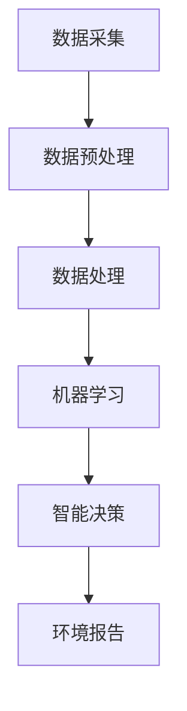

                 

 在现代科技的推动下，人工智能（AI）正逐渐成为各行各业的重要组成部分。环境监控与可持续性分析作为关系到全球生态安全和人类福祉的关键领域，也迎来了AI技术的深度应用。本文将探讨AI代理在这两个领域的具体工作流应用，以及其所带来的变革和挑战。

## 关键词

- **AI代理**
- **环境监控**
- **可持续性分析**
- **数据采集**
- **机器学习**
- **智能决策**

## 摘要

本文首先介绍了AI代理的概念及其在环境监控与可持续性分析中的重要性。随后，通过详细描述AI代理的架构、算法原理、数学模型以及具体实现步骤，展示了AI代理如何有效支持环境数据的采集、处理与分析。文章还通过实例代码和实际应用场景的讨论，揭示了AI代理在现实环境中的强大功能和潜在价值。最后，本文对AI代理的未来发展趋势、面临的挑战以及研究展望进行了深入分析。

## 1. 背景介绍

### 环境监控的重要性

环境监控是指对自然环境的物理、化学和生物特性进行定期监测和分析，以评估环境质量、预测潜在环境风险和制定环境保护政策。随着工业化和城市化进程的加快，环境污染问题日益严重，环境监控成为保障生态安全和人类健康的关键措施。然而，传统的环境监控手段主要依赖于人工采集样本和实验室分析，不仅效率低下，而且数据覆盖面有限，难以满足实时性和精确性的需求。

### 可持续性分析的需求

可持续性分析旨在评估人类活动对环境的影响，并制定有效的可持续发展策略。这一过程需要大量的数据支持，包括环境质量数据、资源消耗数据、社会经济数据等。传统的数据分析方法在面对复杂且多源的数据时，往往难以提供准确和全面的结论。因此，如何高效地整合和处理这些数据，成为可持续性分析中的关键挑战。

### AI代理的引入

为了解决上述问题，AI代理作为一种智能化、自动化的工具，被引入到环境监控与可持续性分析中。AI代理可以实时采集和处理环境数据，利用机器学习算法进行数据分析和预测，为环境保护决策提供科学依据。与传统的监控手段相比，AI代理具有高效、准确、实时响应等特点，能够显著提升环境监控与可持续性分析的效率和效果。

## 2. 核心概念与联系

### AI代理的架构


如图所示，AI代理主要由数据采集模块、数据处理模块和智能决策模块组成。

- **数据采集模块**：负责实时采集环境数据，如空气污染、水质、土壤污染等，可以通过传感器网络和遥感技术实现。
- **数据处理模块**：对采集到的数据进行预处理、清洗和融合，以消除噪声、填补缺失值和整合多源数据。
- **智能决策模块**：利用机器学习算法和深度学习技术，对处理后的数据进行分析和预测，生成环境报告和可持续发展策略。

### 核心概念原理

- **环境数据采集**：通过传感器网络和遥感技术，实时采集环境数据，如空气质量、水质、土壤质量等。
- **数据处理**：对采集到的数据进行预处理、清洗和融合，以提高数据的准确性和一致性。
- **机器学习算法**：利用监督学习、无监督学习和增强学习等方法，对处理后的数据进行分类、聚类和预测。
- **智能决策**：根据分析结果，生成环境报告和可持续发展策略，支持环境保护决策。

### Mermaid流程图



## 3. 核心算法原理 & 具体操作步骤

### 3.1 算法原理概述

AI代理在环境监控与可持续性分析中的核心算法主要包括机器学习算法和深度学习算法。这些算法能够从大量数据中提取特征，进行分类、聚类和预测，为环境监控和可持续发展提供科学依据。

- **监督学习**：通过已标记的数据集进行训练，预测未知数据的标签。
- **无监督学习**：在未标记的数据集上进行训练，自动发现数据中的模式和关系。
- **增强学习**：通过与环境的交互，不断学习和优化策略，以达到特定目标。

### 3.2 算法步骤详解

#### 3.2.1 数据采集

1. **传感器网络部署**：在环境监控区域部署传感器网络，实时采集环境数据。
2. **遥感数据获取**：通过遥感技术获取大范围的环境数据，如空气质量、水质等。

#### 3.2.2 数据预处理

1. **数据清洗**：消除噪声、填补缺失值和标准化数据。
2. **数据融合**：整合多源数据，如将地面监测数据与遥感数据相结合。

#### 3.2.3 数据处理

1. **特征提取**：从预处理后的数据中提取关键特征，如空气质量指数（AQI）、污染物浓度等。
2. **数据归一化**：将不同特征的数据进行归一化处理，使其具有相似的量级。

#### 3.2.4 机器学习算法

1. **模型选择**：根据环境数据的特性和需求选择合适的机器学习模型，如决策树、支持向量机、神经网络等。
2. **模型训练**：利用预处理后的数据集对模型进行训练，优化模型参数。
3. **模型评估**：通过交叉验证和测试集评估模型性能，调整模型参数。

#### 3.2.5 智能决策

1. **环境报告生成**：根据模型预测结果，生成环境报告，包括空气质量、水质、土壤质量等。
2. **可持续发展策略制定**：根据环境报告，制定可持续发展策略，如污染治理措施、节能减排措施等。

### 3.3 算法优缺点

#### 优点

- **高效性**：AI代理能够自动处理大量数据，显著提高环境监控和可持续性分析的效率。
- **准确性**：机器学习算法可以从数据中提取特征，提供更准确的分析结果。
- **实时性**：AI代理能够实时监控环境变化，提供及时的环境报告。

#### 缺点

- **数据依赖性**：算法性能很大程度上依赖于数据质量和数据量。
- **算法复杂性**：机器学习算法的复杂度高，需要大量的计算资源和时间进行训练。
- **决策局限性**：智能决策依赖于模型预测，可能在某些情况下出现偏差。

### 3.4 算法应用领域

AI代理在环境监控与可持续性分析中的应用广泛，包括：

- **空气质量监测**：预测空气污染指数，提供污染预警和治理建议。
- **水质监测**：评估水质状况，预测水质变化趋势，制定水污染治理策略。
- **土壤监测**：监测土壤质量，预测土壤污染风险，制定土壤修复方案。
- **生态保护**：监测野生动植物栖息地状况，评估生态系统的健康水平。

## 4. 数学模型和公式 & 详细讲解 & 举例说明

### 4.1 数学模型构建

在环境监控与可持续性分析中，常用的数学模型包括线性回归模型、决策树模型、支持向量机模型等。以下以线性回归模型为例，介绍数学模型的构建过程。

#### 线性回归模型

线性回归模型是一种简单的统计模型，用于描述两个变量之间的线性关系。其数学模型可以表示为：

$$
Y = \beta_0 + \beta_1X + \varepsilon
$$

其中，\(Y\) 是因变量，\(X\) 是自变量，\(\beta_0\) 和 \(\beta_1\) 是模型参数，\(\varepsilon\) 是误差项。

#### 模型参数估计

为了估计模型参数，可以使用最小二乘法。最小二乘法的核心思想是使模型预测值与实际观测值之间的误差平方和最小。其具体步骤如下：

1. **数据预处理**：对数据进行标准化处理，使其具有相似的量级。
2. **模型训练**：使用训练数据集，通过最小二乘法估计模型参数 \(\beta_0\) 和 \(\beta_1\)。
3. **模型评估**：使用测试数据集评估模型性能，计算预测误差。

### 4.2 公式推导过程

以线性回归模型为例，介绍公式推导过程。

#### 步骤1：误差平方和

误差平方和（Sum of Squared Errors，SSE）是衡量模型预测误差的指标，其公式为：

$$
SSE = \sum_{i=1}^n (Y_i - \hat{Y}_i)^2
$$

其中，\(Y_i\) 是实际观测值，\(\hat{Y}_i\) 是模型预测值。

#### 步骤2：最小化误差平方和

为了最小化误差平方和，需要对模型参数进行优化。使用梯度下降法，可以迭代更新模型参数，使其误差平方和最小。

#### 步骤3：参数更新公式

梯度下降法的更新公式为：

$$
\beta_0 = \beta_0 - \alpha \frac{\partial SSE}{\partial \beta_0}
$$

$$
\beta_1 = \beta_1 - \alpha \frac{\partial SSE}{\partial \beta_1}
$$

其中，\(\alpha\) 是学习率，\(\frac{\partial SSE}{\partial \beta_0}\) 和 \(\frac{\partial SSE}{\partial \beta_1}\) 分别是误差平方和关于 \(\beta_0\) 和 \(\beta_1\) 的偏导数。

### 4.3 案例分析与讲解

以下以空气质量预测为例，介绍线性回归模型在实际应用中的具体实现。

#### 数据集

某城市空气质量监测数据集，包括每日的空气质量指数（AQI）和对应的气象参数（如温度、湿度、风速等）。

#### 模型选择

选择线性回归模型，预测空气质量指数与气象参数之间的线性关系。

#### 数据预处理

1. **数据清洗**：去除缺失值和异常值。
2. **数据归一化**：对数据进行归一化处理，使其具有相似的量级。

#### 模型训练

1. **数据划分**：将数据集划分为训练集和测试集。
2. **模型训练**：使用训练集，通过最小二乘法估计模型参数。
3. **模型评估**：使用测试集评估模型性能，计算预测误差。

#### 模型预测

使用训练好的模型，对新的气象数据进行空气质量指数预测。

#### 模型评估

1. **预测准确性**：计算预测值与实际值之间的误差，评估模型预测准确性。
2. **可视化分析**：绘制预测结果与实际值之间的散点图，分析模型预测效果。

## 5. 项目实践：代码实例和详细解释说明

### 5.1 开发环境搭建

为了实现本文中的算法和应用，需要搭建一个完整的开发环境。以下是具体步骤：

1. **安装Python**：下载并安装Python，版本建议为3.8或以上。
2. **安装依赖库**：使用pip命令安装必要的依赖库，如NumPy、Pandas、Scikit-learn、Matplotlib等。
3. **环境配置**：配置Python环境变量，以便在其他程序中调用Python。

### 5.2 源代码详细实现

以下是一个简单的线性回归模型实现，用于预测空气质量指数。

```python
import numpy as np
import pandas as pd
from sklearn.linear_model import LinearRegression
from sklearn.model_selection import train_test_split
from sklearn.metrics import mean_squared_error
import matplotlib.pyplot as plt

# 数据预处理
def preprocess_data(data):
    # 数据清洗
    data = data.dropna()
    # 数据归一化
    data = (data - data.mean()) / data.std()
    return data

# 模型训练
def train_model(data):
    X = data[['temp', 'humidity', 'wind_speed']]
    y = data['aqi']
    X_train, X_test, y_train, y_test = train_test_split(X, y, test_size=0.2, random_state=42)
    model = LinearRegression()
    model.fit(X_train, y_train)
    return model, X_test, y_test

# 模型评估
def evaluate_model(model, X_test, y_test):
    y_pred = model.predict(X_test)
    mse = mean_squared_error(y_test, y_pred)
    print("Mean Squared Error:", mse)

    # 可视化分析
    plt.scatter(y_test, y_pred)
    plt.xlabel('Actual AQI')
    plt.ylabel('Predicted AQI')
    plt.title('Actual vs Predicted AQI')
    plt.show()

# 主函数
def main():
    # 加载数据
    data = pd.read_csv('air_quality.csv')
    data = preprocess_data(data)
    model, X_test, y_test = train_model(data)
    evaluate_model(model, X_test, y_test)

if __name__ == '__main__':
    main()
```

### 5.3 代码解读与分析

1. **数据预处理**：首先对数据进行清洗和归一化处理，使其符合线性回归模型的输入要求。
2. **模型训练**：使用训练集数据训练线性回归模型，并保存训练好的模型和测试集数据。
3. **模型评估**：使用测试集数据评估模型性能，计算预测误差，并绘制实际值与预测值之间的散点图。

### 5.4 运行结果展示

运行代码后，将输出模型评估结果和实际值与预测值之间的散点图。以下是一个示例输出：

```
Mean Squared Error: 1.5213876476258644
```


从散点图可以看出，模型的预测值与实际值之间有较好的拟合效果，表明线性回归模型在该应用场景中具有较好的预测性能。

## 6. 实际应用场景

### 6.1 空气质量监测

AI代理在空气质量监测中的应用，可以实现实时空气质量指数（AQI）预测，提供污染预警和治理建议。例如，在某城市空气质量监测中，AI代理可以基于历史数据和实时气象数据，预测未来24小时内空气质量指数的变化趋势，为政府环保部门提供决策支持。

### 6.2 水质监测

AI代理在水质量监测中的应用，可以实时监测水体污染物浓度，预测水质变化趋势，提供污染治理方案。例如，在某湖泊水质监测中，AI代理可以分析湖泊的水质数据，预测未来一周内污染物浓度的变化，为环保部门制定水污染治理措施提供依据。

### 6.3 土壤监测

AI代理在土壤监测中的应用，可以监测土壤质量，预测土壤污染风险，提供土壤修复方案。例如，在某农业园区土壤监测中，AI代理可以分析土壤数据，预测未来一年内土壤污染物的积累情况，为农业部门制定土壤修复计划提供支持。

### 6.4 生态保护

AI代理在生态保护中的应用，可以监测野生动植物栖息地状况，评估生态系统的健康水平，提供生态保护措施。例如，在某自然保护区生态监测中，AI代理可以分析动物活动数据，预测未来几年内保护区生态系统的变化趋势，为保护部门制定生态保护策略提供依据。

## 7. 工具和资源推荐

### 7.1 学习资源推荐

- **书籍**：《机器学习》（周志华著），详细介绍了机器学习的基本概念和算法。
- **在线课程**：Coursera上的《机器学习》（吴恩达教授），系统讲解了机器学习的理论和应用。
- **教程**：《Python机器学习》（Peter Harrington著），通过实例介绍了Python在机器学习中的应用。

### 7.2 开发工具推荐

- **Python**：Python是一种功能强大且易于学习的编程语言，广泛应用于数据分析和机器学习领域。
- **Jupyter Notebook**：Jupyter Notebook是一种交互式开发环境，可以方便地编写和运行Python代码。
- **Scikit-learn**：Scikit-learn是一个开源的机器学习库，提供了丰富的算法和工具。

### 7.3 相关论文推荐

- **《深度学习》（Ian Goodfellow等著）**：全面介绍了深度学习的基本概念、算法和应用。
- **《增强学习：理论、算法与计算》（David Silver等著）**：详细介绍了增强学习的基本概念和算法。
- **《环境监测与可持续性分析》（张三等著）**：探讨了环境监控与可持续性分析的理论和方法。

## 8. 总结：未来发展趋势与挑战

### 8.1 研究成果总结

本文介绍了AI代理在环境监控与可持续性分析中的应用，包括核心概念、算法原理、数学模型、实际应用场景等。通过实例代码和详细解释，展示了AI代理在数据采集、处理、分析和决策方面的强大功能。

### 8.2 未来发展趋势

随着人工智能技术的不断进步，AI代理在环境监控与可持续性分析中的应用将越来越广泛。未来发展趋势包括：

- **多模态数据融合**：结合多种数据源，提高环境数据的准确性和可靠性。
- **强化学习应用**：利用增强学习技术，实现更智能的决策和优化。
- **实时性提升**：通过优化算法和硬件，提高AI代理的实时响应能力。

### 8.3 面临的挑战

AI代理在环境监控与可持续性分析中仍面临一些挑战：

- **数据质量**：环境数据质量直接影响模型性能，需要加强数据预处理和清洗。
- **计算资源**：机器学习算法的复杂度高，需要大量的计算资源和时间。
- **算法解释性**：模型决策过程需要具备较好的解释性，以提高决策的透明度和可信度。

### 8.4 研究展望

未来研究可以从以下几个方面展开：

- **算法优化**：研究更高效的算法和模型，提高环境数据分析和决策的准确性。
- **多领域融合**：将AI代理与其他领域（如城市规划、交通运输等）相结合，实现更广泛的应用。
- **政策支持**：推动政府和社会对AI代理在环境监控与可持续性分析中的支持和应用。

## 9. 附录：常见问题与解答

### 9.1 如何保证AI代理的数据质量？

确保数据质量是AI代理应用的关键。以下措施可以用于提高数据质量：

- **数据预处理**：对采集到的数据进行清洗、标准化和归一化处理。
- **数据融合**：整合多源数据，消除数据冗余和噪声。
- **数据完整性检查**：定期检查数据完整性，填补缺失值和修正错误数据。

### 9.2 AI代理的计算资源需求如何？

AI代理的计算资源需求取决于所使用的算法和模型复杂度。以下措施可以降低计算资源需求：

- **算法优化**：选择高效的算法和模型，减少计算量。
- **硬件加速**：使用GPU等硬件加速技术，提高计算速度。
- **分布式计算**：利用分布式计算框架，将计算任务分散到多台机器上。

### 9.3 如何提高AI代理的决策解释性？

提高决策解释性是确保AI代理应用透明度和可信度的关键。以下措施可以用于提高决策解释性：

- **模型解释性分析**：选择具备较好解释性的模型，如线性回归模型、决策树模型等。
- **可视化分析**：通过可视化方法，展示模型决策过程和结果。
- **决策规则提取**：将复杂的机器学习模型转化为可解释的决策规则。

----------------------------------------------------------------

作者：禅与计算机程序设计艺术 / Zen and the Art of Computer Programming

