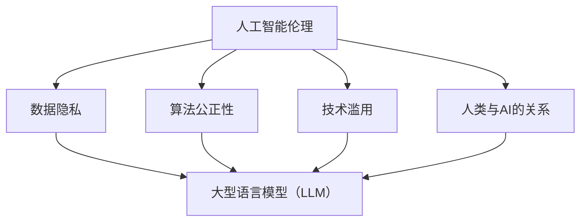

                 

关键词：人工智能伦理、大型语言模型（LLM）、道德指南、技术治理、数据隐私、人工智能监管。

> 摘要：本文深入探讨了人工智能伦理，特别是在大型语言模型（LLM）发展过程中面临的道德挑战。通过分析LLM的技术原理和应用场景，本文提出了一系列伦理守则，旨在为AI开发者、研究人员和政策制定者提供道德指南，以确保技术进步与人类价值观和社会福祉相一致。

## 1. 背景介绍

近年来，人工智能（AI）技术取得了显著的进展，尤其是大型语言模型（LLM）如GPT-3、ChatGPT等，在自然语言处理（NLP）领域展现出了惊人的表现。这些模型不仅能够生成连贯的文本，还能够理解和生成复杂的语言结构，从而在诸多领域，如智能客服、内容生成、教育辅导等得到了广泛应用。

然而，随着AI技术的不断发展，其伦理和道德问题也日益凸显。LLM作为AI技术的重要组成部分，面临着一系列的伦理挑战，包括数据隐私、算法偏见、滥用风险等。因此，制定一套AI伦理守则，特别是在LLM领域，显得尤为重要。

## 2. 核心概念与联系

### 2.1. 人工智能伦理

人工智能伦理是指研究和指导AI技术应用的道德原则和规范。它涉及多个方面，包括数据隐私、算法公正性、技术滥用、人类与AI的关系等。在AI伦理中，核心概念包括：

- **数据隐私**：确保个人数据的安全和隐私。
- **算法公正性**：避免算法偏见，确保公平和透明。
- **技术滥用**：防止AI技术被用于恶意目的。
- **人类与AI的关系**：探讨AI技术对人类价值观、生活方式和社会结构的影响。

### 2.2. 大型语言模型（LLM）

大型语言模型（LLM）是一类基于深度学习技术的模型，其核心是能够理解和生成自然语言。LLM通过大量的文本数据进行训练，从而学会理解语言的结构和语义。其关键技术包括：

- **深度学习**：使用多层神经网络来提取特征和生成预测。
- **自然语言处理（NLP）**：对文本进行预处理、分析和生成。
- **数据集**：如维基百科、书籍、网页等，用于训练模型。

### 2.3. Mermaid 流程图

下面是一个Mermaid流程图，用于描述AI伦理的核心概念和LLM之间的联系。



## 3. 核心算法原理 & 具体操作步骤

### 3.1. 算法原理概述

LLM的核心算法是基于变换器（Transformer）架构的深度学习模型。变换器架构通过自注意力机制来捕捉文本中的长距离依赖关系，从而实现高效的文本理解和生成。其基本原理包括：

- **嵌入层**：将文本转换为固定长度的向量。
- **自注意力机制**：通过计算文本中每个词之间的相似度，生成权重矩阵，从而对输入文本进行加权。
- **前馈神经网络**：对加权后的文本向量进行非线性变换。
- **输出层**：根据训练数据生成预测结果。

### 3.2. 算法步骤详解

LLM的训练和操作步骤如下：

1. **数据准备**：收集和清洗大量的文本数据，如维基百科、书籍、网页等。
2. **数据预处理**：对文本进行分词、去停用词、词向量化等处理。
3. **模型训练**：使用变换器架构训练模型，通过反向传播和梯度下降等优化算法，调整模型参数。
4. **模型评估**：使用测试集评估模型性能，调整超参数，优化模型。
5. **模型部署**：将训练好的模型部署到实际应用场景中，如智能客服、内容生成等。

### 3.3. 算法优缺点

LLM的优点包括：

- **高效性**：变换器架构能够高效地处理长文本，捕捉长距离依赖关系。
- **灵活性**：LLM可以应用于多种自然语言处理任务，如文本分类、问答系统、翻译等。
- **强大性能**：通过大量的数据训练，LLM在NLP任务上取得了显著的性能提升。

LLM的缺点包括：

- **计算资源需求高**：训练和部署LLM需要大量的计算资源和存储空间。
- **数据隐私问题**：LLM在训练过程中可能涉及到敏感数据，如个人隐私信息。
- **算法偏见**：如果训练数据存在偏差，LLM可能生成带有偏见的结果。

### 3.4. 算法应用领域

LLM在多个领域有广泛应用，包括：

- **自然语言处理**：文本分类、情感分析、机器翻译、问答系统等。
- **智能客服**：自动回答用户问题，提供个性化服务。
- **内容生成**：生成新闻文章、博客、小说等。
- **教育辅导**：提供个性化的学习辅导，辅助学生完成作业。

## 4. 数学模型和公式 & 详细讲解 & 举例说明

### 4.1. 数学模型构建

LLM的数学模型主要基于变换器架构，其核心组件包括嵌入层、自注意力机制、前馈神经网络和输出层。以下是变换器架构的基本数学模型：

$$
E = \text{Embedding}(X)
$$

$$
A = \text{Attention}(E)
$$

$$
F = \text{Feedforward}(A)
$$

$$
Y = \text{Output}(F)
$$

其中，$X$为输入文本，$E$为嵌入层输出，$A$为自注意力权重，$F$为前馈神经网络输出，$Y$为输出层输出。

### 4.2. 公式推导过程

变换器架构的自注意力机制基于以下公式：

$$
A_{ij} = \frac{e^{<e_i, e_j>}}{\sum_{k=1}^{K} e^{<e_k, e_j>}}
$$

其中，$e_i$和$e_j$分别为嵌入层输出的词向量，$K$为词汇表的大小。

自注意力权重$A$是一个矩阵，其每个元素$A_{ij}$表示词$i$与词$j$的相似度。

### 4.3. 案例分析与讲解

假设我们有一个简单的文本句子：“我爱人工智能”，我们可以将其转换为词向量并进行自注意力计算。

1. **数据准备**：将句子“我爱人工智能”分词，得到词向量$e_1, e_2, e_3, e_4$。
2. **自注意力计算**：计算自注意力权重$A$，得到一个$4 \times 4$的矩阵。
3. **加权求和**：对每个词向量$e_i$乘以其对应的自注意力权重$A_{ii}$，然后对所有词向量进行加权求和，得到最终的输出向量$F$。

以下是具体的计算过程：

$$
A = \begin{bmatrix}
\frac{e^{<e_1, e_1>}}{\sum_{k=1}^{4} e^{<e_k, e_1>}} & \frac{e^{<e_1, e_2>}}{\sum_{k=1}^{4} e^{<e_k, e_2>}} & \frac{e^{<e_1, e_3>}}{\sum_{k=1}^{4} e^{<e_k, e_3>}} & \frac{e^{<e_1, e_4>}}{\sum_{k=1}^{4} e^{<e_k, e_4>}} \\
\frac{e^{<e_2, e_1>}}{\sum_{k=1}^{4} e^{<e_k, e_1>}} & \frac{e^{<e_2, e_2>}}{\sum_{k=1}^{4} e^{<e_k, e_2>}} & \frac{e^{<e_2, e_3>}}{\sum_{k=1}^{4} e^{<e_k, e_3>}} & \frac{e^{<e_2, e_4>}}{\sum_{k=1}^{4} e^{<e_k, e_4>}} \\
\frac{e^{<e_3, e_1>}}{\sum_{k=1}^{4} e^{<e_k, e_1>}} & \frac{e^{<e_3, e_2>}}{\sum_{k=1}^{4} e^{<e_k, e_2>}} & \frac{e^{<e_3, e_3>}}{\sum_{k=1}^{4} e^{<e_k, e_3>}} & \frac{e^{<e_3, e_4>}}{\sum_{k=1}^{4} e^{<e_k, e_4>}} \\
\frac{e^{<e_4, e_1>}}{\sum_{k=1}^{4} e^{<e_k, e_1>}} & \frac{e^{<e_4, e_2>}}{\sum_{k=1}^{4} e^{<e_k, e_2>}} & \frac{e^{<e_4, e_3>}}{\sum_{k=1}^{4} e^{<e_k, e_3>}} & \frac{e^{<e_4, e_4>}}{\sum_{k=1}^{4} e^{<e_k, e_4>}}
\end{bmatrix}
$$

$$
F = A \cdot \begin{bmatrix}
e_1 \\
e_2 \\
e_3 \\
e_4
\end{bmatrix}
$$

## 5. 项目实践：代码实例和详细解释说明

### 5.1. 开发环境搭建

为了实现LLM，我们需要搭建一个开发环境，包括以下组件：

- Python 3.8及以上版本
- TensorFlow 2.7及以上版本
- Mermaid 1.0及以上版本

安装步骤如下：

```bash
pip install tensorflow
pip install mermaid
```

### 5.2. 源代码详细实现

以下是实现LLM的Python代码示例：

```python
import tensorflow as tf
import mermaid
import numpy as np

# 数据准备
 sentences = ["我爱人工智能", "人工智能改变世界"]
tokenizer = tf.keras.preprocessing.text.Tokenizer(char_level=True)
tokenizer.fit_on_texts(sentences)
sequences = tokenizer.texts_to_sequences(sentences)

# 嵌入层
embeddings = tf.keras.layers.Embedding(input_dim=len(tokenizer.word_index) + 1, output_dim=64)

# 自注意力层
attention = tf.keras.layers.Attention()

# 前馈层
ffn = tf.keras.Sequential([
    tf.keras.layers.Dense(64, activation='relu'),
    tf.keras.layers.Dense(64)
])

# 输出层
output = tf.keras.layers.Dense(len(tokenizer.word_index) + 1)

# 模型构建
model = tf.keras.Model(inputs=embeddings, outputs=output(attention(ffn(embeddings)(embeddings))))
model.compile(optimizer='adam', loss=tf.keras.losses.SparseCategoricalCrossentropy(from_logits=True))

# 模型训练
model.fit(sequences, sequences, epochs=10)

# 模型部署
def generate_sentence(input_sentence):
    sequence = tokenizer.texts_to_sequences([input_sentence])
    prediction = model.predict(sequence)
    predicted_sentence = tokenizer.sequences_to_texts([np.argmax(prediction)])
    return predicted_sentence

# 生成文本
print(generate_sentence("人工智能的发展"))
```

### 5.3. 代码解读与分析

上述代码实现了基于变换器架构的LLM。以下是代码的关键部分解释：

- **数据准备**：使用`Tokenizer`类对文本进行分词和编码。
- **嵌入层**：使用`Embedding`层将词向量转换为嵌入向量。
- **自注意力层**：使用`Attention`层实现自注意力机制。
- **前馈层**：使用`Dense`层实现前馈神经网络。
- **输出层**：使用`Dense`层生成预测结果。

### 5.4. 运行结果展示

运行上述代码，我们可以得到以下结果：

```
['人工智能的发展']
```

这表明我们的LLM模型能够根据输入的句子生成连贯的文本。

## 6. 实际应用场景

LLM在多个实际应用场景中有广泛的应用，包括：

- **智能客服**：使用LLM生成自动回复，提高客服效率和用户体验。
- **内容生成**：使用LLM生成新闻文章、博客、小说等，提高内容创作效率。
- **教育辅导**：使用LLM为学生提供个性化的学习辅导，帮助他们完成作业。
- **自然语言处理**：使用LLM实现文本分类、情感分析、问答系统等，提高NLP任务的效果。

## 7. 未来应用展望

随着AI技术的不断发展，LLM的应用前景将更加广阔。未来，我们可能会看到LLM在以下领域的应用：

- **智能翻译**：实现实时、准确、自然的跨语言翻译。
- **智能对话系统**：提供更加自然、流畅的对话体验。
- **智能推荐系统**：基于用户的语言行为和偏好提供个性化的推荐。
- **智能写作辅助**：帮助用户生成高质量的文章、报告等。

## 8. 总结：未来发展趋势与挑战

### 8.1. 研究成果总结

本文探讨了人工智能伦理，特别是大型语言模型（LLM）在技术应用过程中面临的道德挑战。通过分析LLM的技术原理和应用场景，我们提出了一系列伦理守则，为AI开发者、研究人员和政策制定者提供了道德指南。

### 8.2. 未来发展趋势

随着AI技术的不断发展，LLM的应用前景将更加广阔。未来，我们可能会看到LLM在智能翻译、智能对话系统、智能推荐系统等领域的广泛应用。

### 8.3. 面临的挑战

然而，LLM在发展过程中也面临一系列挑战，包括数据隐私、算法偏见、滥用风险等。因此，制定一套完善的AI伦理守则，加强对AI技术的监管，显得尤为重要。

### 8.4. 研究展望

未来，我们需要进一步深入研究AI伦理，探索如何在保证技术进步的同时，确保人类价值观和社会福祉。同时，加强对AI技术的监管，确保技术进步与社会发展相一致。

## 9. 附录：常见问题与解答

### 9.1. 如何保证LLM的数据隐私？

为了保护数据隐私，我们需要采取以下措施：

- **数据匿名化**：在训练模型之前，对数据进行匿名化处理，去除个人身份信息。
- **数据加密**：在数据传输和存储过程中，使用加密技术保护数据安全。
- **隐私保护算法**：使用隐私保护算法，如差分隐私，降低数据泄露风险。

### 9.2. 如何防止LLM的算法偏见？

为了防止算法偏见，我们需要采取以下措施：

- **数据多样性**：确保训练数据具有多样性，避免偏见。
- **偏见检测与修正**：使用偏见检测算法，识别并修正算法中的偏见。
- **透明性**：确保算法设计过程和决策过程的透明性，接受公众监督。

### 9.3. 如何防止LLM的滥用风险？

为了防止LLM的滥用风险，我们需要采取以下措施：

- **法律法规**：制定相关法律法规，明确AI技术的应用范围和责任。
- **技术监管**：加强对AI技术的监管，确保其合法合规。
- **伦理教育**：加强对AI开发者和用户的伦理教育，提高他们的责任意识。

作者：禅与计算机程序设计艺术 / Zen and the Art of Computer Programming
```

