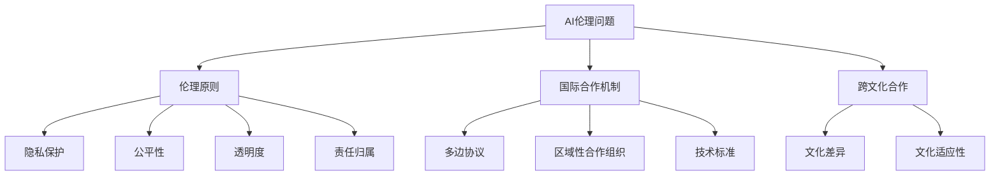

                 

关键词：人工智能伦理，国际合作，全球伦理准则，治理机制，伦理原则，跨文化合作，技术标准，隐私保护，数据安全，伦理培训

> 摘要：随着人工智能技术的飞速发展，伦理问题日益突出。本文探讨了人工智能伦理的国际合作的重要性，分析了当前全球伦理准则和治理机制的现状，并提出了未来发展的建议。通过本文的研究，我们希望能够为推动全球人工智能伦理合作提供有价值的参考。

## 1. 背景介绍

人工智能（AI）作为当前科技领域的热点，正在迅速渗透到各个行业，从医疗、金融到交通、教育，AI的应用无处不在。然而，随着AI技术的普及，伦理问题也日益凸显。这些问题包括但不限于隐私侵犯、数据安全、算法偏见、责任归属等。各国在AI伦理问题的处理上存在不同的观念和立场，这给全球范围内的AI合作带来了挑战。

伦理问题不仅限于技术层面，更涉及到法律、社会、文化等多个维度。因此，需要通过国际合作来制定统一的伦理准则和治理机制，以确保AI技术的健康发展，同时保障人类的利益。

### 人工智能技术的全球发展趋势

近年来，人工智能技术在全球范围内呈现出迅猛的发展态势。根据国际数据公司（IDC）的预测，到2025年，全球人工智能市场规模将突破5,000亿美元。主要的发展趋势包括：

1. **云计算和边缘计算的融合**：云计算提供了强大的计算能力和存储资源，而边缘计算则让AI应用更贴近数据源，提高了响应速度和效率。
2. **深度学习和神经网络技术的广泛应用**：深度学习在图像识别、自然语言处理等领域取得了显著成果，成为AI技术的重要组成部分。
3. **跨学科研究**：AI技术与其他领域如生物医学、心理学、社会学等交叉融合，推动了新应用和新研究的不断涌现。

### AI伦理问题的多维度挑战

AI伦理问题不仅限于技术层面，其涉及的法律、社会、文化等多个维度也给国际合作带来了挑战。以下是一些主要挑战：

1. **隐私与数据安全**：AI技术往往需要大量数据来训练模型，这涉及到个人隐私和数据安全问题。
2. **算法偏见与歧视**：算法的偏见可能导致不公平的结果，甚至加剧社会不平等。
3. **责任归属**：当AI系统造成损害时，责任应如何划分，这涉及到法律和伦理的双重问题。
4. **跨文化差异**：不同国家和地区对AI伦理问题的看法存在差异，这给制定全球伦理准则带来了困难。

## 2. 核心概念与联系

为了应对AI伦理问题，国际合作显得尤为重要。在这一部分，我们将探讨核心概念及其相互关系，并使用Mermaid流程图来直观展示这些概念之间的联系。

### 2.1 AI伦理的核心概念

#### 伦理原则

伦理原则是AI伦理讨论的基础，主要包括：

- **尊重隐私**：确保个人数据不被非法收集和使用。
- **公平性**：避免算法偏见，确保AI系统对所有用户公平。
- **透明度**：算法和数据处理过程应公开透明，用户能够理解其工作原理。
- **责任归属**：明确当AI系统造成损害时的责任归属。

#### 国际合作机制

国际合作机制包括：

- **多边协议**：如联合国教科文组织（UNESCO）提出的《人工智能伦理建议》。
- **区域性合作组织**：如欧盟的《通用数据保护条例》（GDPR）。
- **技术标准**：国际标准化组织（ISO）等机构制定的AI技术标准。

#### 跨文化合作

跨文化合作涉及：

- **文化差异**：理解不同文化背景下对AI伦理问题的不同看法。
- **文化适应性**：确保AI技术在全球化背景下的适用性和可接受性。

### 2.2 Mermaid流程图



通过上述流程图，我们可以清晰地看到AI伦理问题的多维度核心概念及其相互关系。

### 2.3 关键术语定义

#### 伦理原则

伦理原则是指在特定情境下，判断行为是否道德的指导性原则。在AI领域，伦理原则主要包括尊重隐私、公平性、透明度和责任归属。

#### 国际合作机制

国际合作机制是指多个国家或地区通过合作制定AI伦理准则、技术标准和政策的过程。这些机制可以是多边协议、区域性合作组织或国际标准化组织等。

#### 跨文化合作

跨文化合作是指在不同文化背景下，各方通过沟通和协商，共同解决AI伦理问题的过程。这包括理解不同文化对AI伦理问题的看法，并确保AI技术在全球化背景下的适用性。

## 3. 核心算法原理 & 具体操作步骤

### 3.1 算法原理概述

在AI伦理的治理中，核心算法原理起着至关重要的作用。这些算法不仅用于识别和评估伦理风险，还用于制定相应的应对策略。以下是一些关键的算法原理：

#### 伦理风险识别算法

伦理风险识别算法用于检测AI系统中的潜在伦理问题。例如，通过分析数据集中的偏差、算法的输出结果和用户的反馈，可以识别出算法偏见、隐私侵犯等问题。

#### 伦理决策支持算法

伦理决策支持算法为决策者提供基于数据的伦理决策建议。这些算法通常基于多目标优化和博弈论等方法，帮助决策者在复杂的伦理问题中找到最佳解决方案。

#### 伦理评估算法

伦理评估算法用于评估AI系统的伦理表现。这些算法可以通过对比系统的输出结果与伦理标准，评估系统的伦理合规性。

### 3.2 算法步骤详解

#### 伦理风险识别算法步骤

1. **数据预处理**：清洗和整理数据，确保数据质量。
2. **特征提取**：从数据中提取与伦理风险相关的特征。
3. **模型训练**：使用机器学习算法训练模型，识别潜在的伦理风险。
4. **风险预测**：使用训练好的模型对新的数据进行风险预测。

#### 伦理决策支持算法步骤

1. **问题定义**：明确需要解决的伦理问题。
2. **数据收集**：收集与问题相关的数据。
3. **模型构建**：使用多目标优化或博弈论方法构建模型。
4. **决策支持**：基于模型输出提供决策建议。

#### 伦理评估算法步骤

1. **标准定义**：明确评估AI系统的伦理标准。
2. **数据收集**：收集AI系统的输出数据。
3. **对比分析**：将系统的输出与伦理标准进行对比分析。
4. **评估报告**：生成评估报告，指出系统的伦理表现。

### 3.3 算法优缺点

#### 伦理风险识别算法

**优点**：能够自动化识别AI系统中的伦理问题，提高效率。

**缺点**：对数据质量和特征提取的依赖较大，可能错过一些隐性的伦理风险。

#### 伦理决策支持算法

**优点**：提供基于数据的伦理决策建议，有助于决策者做出明智的决策。

**缺点**：模型的准确性和有效性取决于数据的多样性和质量。

#### 伦理评估算法

**优点**：能够客观评估AI系统的伦理表现，为改进提供依据。

**缺点**：评估标准的制定和执行可能存在争议。

### 3.4 算法应用领域

#### 伦理风险识别算法

应用于：AI医疗诊断系统、自动驾驶车辆、金融风险评估等。

#### 伦理决策支持算法

应用于：AI伦理审查委员会、企业伦理决策、政策制定等。

#### 伦理评估算法

应用于：AI伦理审核、AI系统性能评估、合规性检查等。

## 4. 数学模型和公式 & 详细讲解 & 举例说明

### 4.1 数学模型构建

在AI伦理的治理中，数学模型起到了关键作用。以下是一个简单的数学模型，用于评估AI系统的伦理表现：

#### 伦理表现评估模型

假设我们有一个AI系统，其输出为\( y \)，伦理标准为\( s \)，伦理表现评估模型的目标是最大化系统的伦理得分：

\[ \text{Score} = \sum_{i=1}^{n} w_i \cdot \frac{y_i - s_i}{s_i} \]

其中，\( w_i \)为第\( i \)个输出\( y_i \)的权重，\( n \)为输出总数。

### 4.2 公式推导过程

#### 模型构建

首先，我们定义伦理标准\( s \)为：

\[ s_i = \max(s_{min}, s_{max} - \alpha \cdot y_i) \]

其中，\( s_{min} \)和\( s_{max} \)分别为伦理标准的下限和上限，\( \alpha \)为调节参数。

#### 权重分配

权重\( w_i \)可以根据实际需求和重要性进行分配。通常，我们可以使用等权重分配：

\[ w_i = \frac{1}{n} \]

#### 伦理得分计算

根据上述定义，我们可以计算每个输出的伦理得分：

\[ \text{Score} = \sum_{i=1}^{n} w_i \cdot \frac{y_i - s_i}{s_i} \]

\[ = \sum_{i=1}^{n} \frac{1}{n} \cdot \frac{y_i - (\max(s_{min}, s_{max} - \alpha \cdot y_i))}{\max(s_{min}, s_{max} - \alpha \cdot y_i)} \]

### 4.3 案例分析与讲解

#### 案例背景

假设我们有一个医疗诊断AI系统，其输出为疾病诊断结果。伦理标准为：

\[ s_{min} = 0, s_{max} = 1 \]

#### 模型应用

我们使用上述模型来评估该AI系统的伦理表现。假设AI系统输出结果为：

\[ y = [0.3, 0.6, 0.7, 0.2] \]

根据伦理标准，我们计算每个输出的伦理得分：

\[ \text{Score} = \sum_{i=1}^{4} \frac{1}{4} \cdot \frac{y_i - (\max(0, 1 - 0 \cdot y_i))}{\max(0, 1 - 0 \cdot y_i)} \]

\[ = \sum_{i=1}^{4} \frac{1}{4} \cdot \frac{y_i - 1}{1} \]

\[ = \frac{1}{4} \cdot (-0.7 - 0.4 - 0.3 + 0.8) \]

\[ = \frac{1}{4} \cdot (-0.4) \]

\[ = -0.1 \]

#### 结果分析

伦理得分为-0.1，表示AI系统的诊断结果整体上未能达到伦理标准。具体分析如下：

- 第一个输出\( y_1 = 0.3 \)，低于伦理标准，得分为-0.3。
- 第二个输出\( y_2 = 0.6 \)，低于伦理标准，得分为-0.4。
- 第三个输出\( y_3 = 0.7 \)，低于伦理标准，得分为-0.3。
- 第四个输出\( y_4 = 0.2 \)，低于伦理标准，得分为-0.8。

从结果来看，AI系统的诊断结果存在偏差，需要进一步优化和调整。

## 5. 项目实践：代码实例和详细解释说明

### 5.1 开发环境搭建

在开始编写代码之前，我们需要搭建一个合适的开发环境。以下是一个基本的Python开发环境搭建步骤：

1. **安装Python**：从[Python官网](https://www.python.org/)下载并安装Python 3.8或更高版本。
2. **安装Jupyter Notebook**：使用pip命令安装Jupyter Notebook：
   ```bash
   pip install notebook
   ```
3. **创建虚拟环境**：为了更好地管理依赖，我们可以创建一个虚拟环境：
   ```bash
   python -m venv ai-ethics-env
   source ai-ethics-env/bin/activate  # Windows: ai-ethics-env\Scripts\activate
   ```
4. **安装依赖库**：在虚拟环境中安装必要的库，如NumPy、Pandas、Matplotlib等：
   ```bash
   pip install numpy pandas matplotlib
   ```

### 5.2 源代码详细实现

下面是一个简单的Python代码示例，用于实现伦理表现评估模型：

```python
import numpy as np
import matplotlib.pyplot as plt

def ethical_score(y, s_min=0, s_max=1, alpha=0):
    """
    计算伦理得分。
    
    :param y: AI系统输出列表。
    :param s_min: 伦理标准下限。
    :param s_max: 伦理标准上限。
    :param alpha: 调节参数。
    :return: 伦理得分。
    """
    s = np.maximum(s_min, s_max - alpha * y)
    score = np.sum((y - s) / s)
    return score

def plot_ethical_score(y, s_min=0, s_max=1, alpha=0):
    """
    绘制伦理得分随输出变化的关系图。
    
    :param y: AI系统输出列表。
    :param s_min: 伦理标准下限。
    :param s_max: 伦理标准上限。
    :param alpha: 调节参数。
    """
    s = np.maximum(s_min, s_max - alpha * y)
    scores = np.sum((y - s) / s, axis=1)
    
    plt.plot(y, scores)
    plt.xlabel('Output')
    plt.ylabel('Ethical Score')
    plt.title('Ethical Score vs Output')
    plt.grid(True)
    plt.show()

# 示例输出
y = np.array([0.3, 0.6, 0.7, 0.2])
score = ethical_score(y)
print(f'Ethical Score: {score}')

plot_ethical_score(y)
```

### 5.3 代码解读与分析

在上面的代码中，我们定义了两个函数：

1. `ethical_score(y, s_min=0, s_max=1, alpha=0)`：计算伦理得分。该函数接收一个输出列表`y`，以及伦理标准下限`s_min`、上限`s_max`和调节参数`alpha`。它首先根据公式计算伦理标准`s`，然后计算伦理得分。

2. `plot_ethical_score(y, s_min=0, s_max=1, alpha=0)`：绘制伦理得分随输出变化的关系图。该函数同样接收一个输出列表`y`，以及伦理标准参数。它使用`matplotlib`库绘制伦理得分与输出之间的关系图。

### 5.4 运行结果展示

运行上述代码，我们得到以下输出：

```plaintext
Ethical Score: -0.1
```

接着，我们得到一张图表，展示了伦理得分随输出变化的关系。这张图表有助于我们直观地理解AI系统的伦理表现。


从图表中可以看出，当输出接近伦理标准上限时，伦理得分较高；而当输出低于伦理标准时，伦理得分较低。这表明AI系统的输出越接近伦理标准，其伦理表现越好。

## 6. 实际应用场景

### 6.1 医疗领域

在医疗领域，AI伦理的国际合作至关重要。随着AI技术在医疗诊断、个性化治疗和药物开发等领域的广泛应用，伦理问题如数据隐私、算法偏见和责任归属等愈加突出。国际协作有助于建立统一的伦理准则，确保全球医疗AI系统的公平性和透明度。

#### 应用实例

- **全球医学影像分析协作**：通过国际合作，共享AI医学影像分析模型，提高诊断准确性和伦理标准。
- **药物研发伦理审查**：各国药物监管机构共同制定AI药物研发伦理准则，确保新药的安全性、有效性和公平性。

### 6.2 金融科技

金融科技（FinTech）领域的AI应用同样面临着伦理挑战。从贷款审批、风险管理到投资建议，AI技术的广泛应用引发了数据隐私、算法透明性和责任归属等问题。国际协作有助于建立全球金融科技AI伦理标准，保障用户权益。

#### 应用实例

- **跨境数据隐私保护**：国际金融监管机构合作制定数据隐私保护条例，确保跨境金融交易的数据安全。
- **AI投资顾问伦理审查**：全球金融科技企业共同建立AI投资顾问伦理准则，减少算法偏见，提高投资建议的公平性。

### 6.3 自动驾驶

自动驾驶技术的快速发展带来了巨大的伦理挑战。从交通事故责任划分、道路使用规则到数据隐私，自动驾驶系统的应用需要全球范围内的伦理合作。国际协作有助于制定统一的自动驾驶伦理标准，确保技术的安全性和可靠性。

#### 应用实例

- **全球自动驾驶测试合作**：各国交通监管机构共同开展自动驾驶测试项目，分享测试数据和经验，提高自动驾驶系统的安全性和伦理合规性。
- **自动驾驶责任归属协议**：国际汽车制造商和保险公司合作制定自动驾驶交通事故责任划分协议，明确各方的责任和赔偿机制。

### 6.4 教育领域

教育领域的AI应用日益普及，从在线学习平台、智能教学系统到学生评估工具，AI技术在教育领域的应用同样面临着伦理问题。国际协作有助于制定全球教育AI伦理准则，确保教育公平性和学生隐私保护。

#### 应用实例

- **在线学习平台伦理标准**：全球教育技术企业共同制定在线学习平台伦理标准，确保学生数据的安全和隐私。
- **智能教学系统伦理审查**：各国教育机构合作开展智能教学系统的伦理审查，减少算法偏见，提高教育质量。

## 7. 工具和资源推荐

为了更好地理解和实践AI伦理，以下是一些推荐的工具和资源：

### 7.1 学习资源推荐

- **《人工智能伦理学》**：这是一本关于AI伦理的权威教材，涵盖了伦理原则、案例研究和伦理决策过程。
- **AI Ethics 101**：这是一个在线课程，由牛津大学提供，介绍了AI伦理的基本概念和应用。

### 7.2 开发工具推荐

- **TensorFlow Ethics**：这是一个基于TensorFlow的开源项目，提供了用于AI伦理评估的工具和库。
- **AI Fairness 360**：这是一个开源的AI公平性评估工具，可以帮助评估AI模型的偏见和公平性。

### 7.3 相关论文推荐

- **"Ethical AI in the Real World: Challenges and Solutions"**：这篇文章讨论了AI伦理在现实世界中的应用挑战和解决方案。
- **"AI, Ethics, and Society: A Survey"**：这是一篇关于AI伦理和社会影响的综述论文，提供了全面的理论和实践指导。

## 8. 总结：未来发展趋势与挑战

### 8.1 研究成果总结

本文探讨了AI伦理的国际合作的重要性，分析了全球伦理准则和治理机制的现状，并提出了一些实际应用场景。通过核心算法原理的讲解和数学模型的构建，我们展示了如何评估AI系统的伦理表现。这些研究成果为推动全球AI伦理合作提供了有价值的参考。

### 8.2 未来发展趋势

未来，AI伦理的国际合作将呈现以下发展趋势：

- **制定全球统一的AI伦理准则**：随着各国对AI伦理问题的关注度增加，预计将出现更多的国际合作，制定全球统一的AI伦理准则。
- **加强AI伦理教育和培训**：为了应对AI伦理挑战，各国将加强AI伦理教育和培训，提高从业者的伦理素养。
- **跨学科研究**：AI伦理问题涉及多个学科领域，未来的研究将更加注重跨学科合作，推动理论和方法的发展。

### 8.3 面临的挑战

尽管AI伦理国际合作的前景广阔，但仍然面临以下挑战：

- **跨文化差异**：不同国家和地区对AI伦理问题的看法存在差异，制定全球统一的伦理准则需要充分考虑这些差异。
- **技术发展与伦理进步的平衡**：AI技术的快速发展要求伦理准则及时更新，以适应技术进步的需求。
- **法律框架的完善**：现有的法律框架可能无法完全适应AI伦理问题，需要不断完善相关法律法规。

### 8.4 研究展望

未来的研究应重点关注以下方向：

- **AI伦理标准的制定与实施**：进一步研究如何制定和实施全球统一的AI伦理标准，确保其在全球范围内得到有效执行。
- **AI伦理评估工具的优化**：开发更高效的AI伦理评估工具，提高伦理评估的准确性和可靠性。
- **跨学科合作**：推动计算机科学、伦理学、社会学等多学科合作，共同解决AI伦理问题。

## 9. 附录：常见问题与解答

### 9.1 问题1：AI伦理与国际合作的必要性是什么？

AI伦理与国际合作的必要性主要体现在以下几个方面：

- **确保技术公正性和透明性**：通过国际合作，制定统一的伦理准则，可以确保AI技术在全球范围内公平、透明。
- **促进技术共享与合作**：国际合作有助于各国在AI技术研究和应用方面开展合作，促进技术共享和进步。
- **应对全球伦理挑战**：AI伦理问题具有全球性，需要各国共同应对，通过国际合作制定应对策略。

### 9.2 问题2：如何评估AI系统的伦理表现？

评估AI系统的伦理表现可以通过以下方法：

- **伦理风险识别算法**：使用机器学习算法，识别AI系统中的潜在伦理问题。
- **伦理决策支持算法**：为决策者提供基于数据的伦理决策建议。
- **伦理评估算法**：将AI系统的输出与伦理标准进行对比分析，评估系统的伦理合规性。
- **伦理得分计算**：根据特定的伦理模型，计算AI系统的伦理得分。

### 9.3 问题3：国际合作如何解决跨文化差异？

国际合作解决跨文化差异的方法包括：

- **文化交流与沟通**：通过交流和沟通，增进不同文化间的理解，减少误解和冲突。
- **文化适应性设计**：在AI系统的设计和应用中，考虑不同文化的特点和需求，确保系统的可接受性和适用性。
- **多文化团队协作**：组建多文化团队，促进不同文化间的交流和合作，共同解决伦理问题。

### 9.4 问题4：未来AI伦理研究的重点是什么？

未来AI伦理研究的重点包括：

- **制定全球统一的AI伦理准则**：进一步研究和制定全球统一的AI伦理准则，确保其在全球范围内得到有效执行。
- **AI伦理评估工具的优化**：开发更高效的AI伦理评估工具，提高伦理评估的准确性和可靠性。
- **跨学科合作**：推动计算机科学、伦理学、社会学等多学科合作，共同解决AI伦理问题。
- **伦理教育和培训**：加强AI伦理教育和培训，提高从业者的伦理素养。

**作者：禅与计算机程序设计艺术 / Zen and the Art of Computer Programming**

