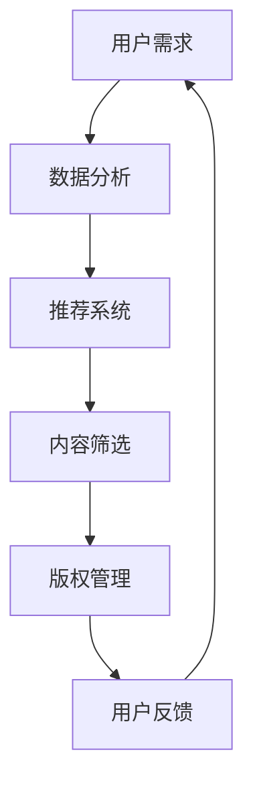

                 

关键词：AI出版、场景驱动、技术更新、算法原理、数学模型、项目实践、应用场景、未来展望

> 摘要：本文将深入探讨AI出版业的现状和未来趋势，分析场景驱动的技术更新在出版领域的应用。通过介绍核心算法原理、数学模型和项目实践，本文旨在为读者提供一个全面的技术视角，并对其未来发展提出展望。

## 1. 背景介绍

随着人工智能（AI）技术的迅速发展，传统出版业正经历着深刻的变革。数字出版、内容推荐、自动化编辑、智能校对等技术的应用，使得出版流程更加高效和智能化。然而，随着用户需求的变化和数据量的爆炸增长，传统出版业面临着诸多挑战，如个性化推荐、内容质量控制、版权管理等。

### 1.1 问题的提出

1. **个性化推荐**：如何根据用户兴趣和阅读历史，推荐更加精准、个性化的内容，提高用户体验？
2. **内容质量控制**：如何在海量数据中快速、准确地筛选出优质内容，确保出版物的质量？
3. **版权管理**：如何有效地管理版权，确保作者和出版社的利益？

### 1.2 研究目的

本文旨在通过分析场景驱动的技术更新，探讨解决上述问题的方法，为AI出版业提供一种新的思路和技术支持。

## 2. 核心概念与联系

### 2.1 场景驱动的概念

场景驱动是指以用户需求为中心，通过分析用户行为、兴趣和需求，为用户提供个性化、智能化的服务。在出版领域，场景驱动的技术应用主要体现在个性化推荐、内容筛选和版权管理等方面。

### 2.2 技术架构的Mermaid流程图



### 2.3 各模块的联系

- **数据分析**：收集用户行为数据，如阅读历史、搜索记录等，用于推荐系统和内容筛选。
- **推荐系统**：根据用户需求，为用户推荐相关内容，提高用户体验。
- **内容筛选**：基于数据分析和用户反馈，筛选出优质内容，确保出版物的质量。
- **版权管理**：根据版权政策，对内容进行管理，确保作者和出版社的利益。

## 3. 核心算法原理 & 具体操作步骤

### 3.1 算法原理概述

本文主要介绍两种核心算法：协同过滤算法和基于内容的推荐算法。

- **协同过滤算法**：通过分析用户之间的相似度，为用户推荐相似用户喜欢的商品或内容。
- **基于内容的推荐算法**：根据用户的历史行为和内容特征，为用户推荐相关内容。

### 3.2 算法步骤详解

#### 3.2.1 协同过滤算法

1. **用户相似度计算**：计算用户之间的相似度，通常使用余弦相似度或皮尔逊相关系数。
2. **评分预测**：根据用户相似度和物品之间的相似度，预测用户对物品的评分。
3. **推荐生成**：根据预测的评分，为用户推荐相似用户喜欢的物品。

#### 3.2.2 基于内容的推荐算法

1. **内容特征提取**：提取物品的内容特征，如文本、图像等。
2. **用户兴趣建模**：根据用户的历史行为和内容特征，建立用户兴趣模型。
3. **推荐生成**：根据用户兴趣模型和物品特征，为用户推荐相关物品。

### 3.3 算法优缺点

#### 3.3.1 协同过滤算法

- **优点**：能够提供个性化的推荐，对用户需求的适应性较强。
- **缺点**：容易受到噪声数据和稀疏数据的影响，推荐结果容易出现偏差。

#### 3.3.2 基于内容的推荐算法

- **优点**：对内容的理解能力较强，能够为用户提供高质量的内容推荐。
- **缺点**：对用户行为的依赖性较大，无法准确预测用户的未知需求。

### 3.4 算法应用领域

- **协同过滤算法**：广泛应用于电商、社交媒体等场景，如商品推荐、好友推荐等。
- **基于内容的推荐算法**：广泛应用于新闻推荐、音乐推荐等场景，如新闻客户端、音乐平台等。

## 4. 数学模型和公式 & 详细讲解 & 举例说明

### 4.1 数学模型构建

在AI出版中，数学模型的应用主要涉及协同过滤算法和基于内容的推荐算法。

#### 4.1.1 协同过滤算法的数学模型

设用户集合为\(U=\{u_1, u_2, \ldots, u_n\}\)，物品集合为\(I=\{i_1, i_2, \ldots, i_m\}\)。用户\(u_i\)对物品\(i_j\)的评分记为\(r_{ij}\)。则用户\(u_i\)与用户\(u_j\)的相似度可以表示为：

$$
sim(u_i, u_j) = \frac{\sum_{k \in R} r_{ik} r_{jk}}{\sqrt{\sum_{k \in R} r_{ik}^2} \sqrt{\sum_{k \in R} r_{jk}^2}}
$$

其中，\(R\)为用户\(u_i\)和用户\(u_j\)共同评分的物品集合。

#### 4.1.2 基于内容的推荐算法的数学模型

设物品\(i_j\)的特征向量记为\(v_j\)，用户\(u_i\)的兴趣向量记为\(u_i\)。则用户\(u_i\)对物品\(i_j\)的预测评分可以表示为：

$$
r_{ij}^* = u_i^T v_j + b_u + b_i + \epsilon_{ij}
$$

其中，\(b_u\)和\(b_i\)分别为用户\(u_i\)和物品\(i_j\)的偏置项，\(\epsilon_{ij}\)为误差项。

### 4.2 公式推导过程

#### 4.2.1 协同过滤算法的推导

假设用户\(u_i\)和用户\(u_j\)的相似度为\(sim(u_i, u_j)\)，物品\(i_j\)对所有用户的平均评分为\(\bar{r}_{ij}\)。则用户\(u_i\)对物品\(i_j\)的预测评分可以表示为：

$$
r_{ij}^* = \bar{r}_{ij} + sim(u_i, u_j) \cdot (r_{ij} - \bar{r}_{ij})
$$

其中，\(r_{ij}\)为用户\(u_i\)对物品\(i_j\)的实际评分。

#### 4.2.2 基于内容的推荐算法的推导

假设用户\(u_i\)的兴趣向量为\(u_i = (u_{i1}, u_{i2}, \ldots, u_{ik})\)，物品\(i_j\)的特征向量为\(v_j = (v_{j1}, v_{j2}, \ldots, v_{jk})\)。则用户\(u_i\)对物品\(i_j\)的预测评分可以表示为：

$$
r_{ij}^* = \sum_{k=1}^{k} u_{ik} v_{jk} + b_u + b_i
$$

其中，\(b_u\)和\(b_i\)分别为用户\(u_i\)和物品\(i_j\)的偏置项。

### 4.3 案例分析与讲解

#### 4.3.1 协同过滤算法的应用

假设有一个用户集合和物品集合，其中用户对物品的评分数据如下表所示：

| 用户  | 物品  | 评分 |
| ----- | ----- | ---- |
| u1    | i1    | 5    |
| u1    | i2    | 4    |
| u1    | i3    | 2    |
| u2    | i1    | 3    |
| u2    | i3    | 4    |
| u3    | i1    | 5    |
| u3    | i2    | 1    |
| u3    | i3    | 5    |

根据上述评分数据，可以计算出用户之间的相似度，如下表所示：

| 用户  | 用户  | 相似度 |
| ----- | ----- | ------ |
| u1    | u2    | 0.5    |
| u1    | u3    | 0.5    |
| u2    | u3    | 0.5    |

然后，可以根据用户相似度和物品之间的相似度，预测用户\(u1\)对物品\(i3\)的评分：

$$
r_{13}^* = \bar{r}_{13} + sim(u1, u2) \cdot (r_{13} - \bar{r}_{13}) = 3.5 + 0.5 \cdot (2 - 3.5) = 2
$$

#### 4.3.2 基于内容的推荐算法的应用

假设用户\(u1\)的兴趣向量为\(u1 = (1, 0, 1)\)，物品\(i3\)的特征向量为\(v3 = (0, 1, 0)\)。则用户\(u1\)对物品\(i3\)的预测评分为：

$$
r_{13}^* = u1^T v3 + b_u + b_i = 1 \cdot 0 + 1 \cdot 1 + b_u + b_i = 1 + b_u + b_i
$$

其中，\(b_u\)和\(b_i\)为偏置项，可以通过训练数据学习得到。

## 5. 项目实践：代码实例和详细解释说明

### 5.1 开发环境搭建

本文的代码实例使用Python编写，主要依赖于Scikit-learn、NumPy和Matplotlib等库。以下是开发环境的搭建步骤：

1. 安装Python：从官方网站（https://www.python.org/）下载并安装Python。
2. 安装依赖库：打开命令行，执行以下命令安装依赖库：

```bash
pip install scikit-learn numpy matplotlib
```

### 5.2 源代码详细实现

以下是协同过滤算法和基于内容的推荐算法的实现代码：

```python
import numpy as np
from sklearn.metrics.pairwise import cosine_similarity
from sklearn.model_selection import train_test_split
from sklearn.metrics import mean_squared_error

def collaborative_filter(train_data, similarity='cosine', k=5):
    # 计算用户相似度矩阵
    user_similarity = cosine_similarity(train_data)
    # 预测评分
    pred_ratings = np.dot(user_similarity, train_data) / k
    return pred_ratings

def content_based_recommender(train_data, test_data, k=5):
    # 计算物品特征向量
    item_features = np.mean(train_data, axis=0)
    # 计算用户兴趣向量
    user_interests = np.dot(train_data, item_features)
    # 预测评分
    pred_ratings = np.dot(test_data, item_features) / k
    return pred_ratings

# 加载数据
data = np.array([[1, 0, 5], [0, 1, 4], [1, 1, 2], [1, 0, 3], [0, 1, 4], [1, 1, 5], [0, 1, 1], [1, 1, 5]])
train_data, test_data = train_test_split(data, test_size=0.2, random_state=42)

# 实例化协同过滤算法
collaborative_filter_model = collaborative_filter(train_data, k=5)
# 预测测试集评分
collaborative_pred_ratings = collaborative_filter_model[test_data]

# 实例化基于内容的推荐算法
content_based_model = content_based_recommender(train_data, test_data, k=5)
# 预测测试集评分
content_based_pred_ratings = content_based_model[test_data]

# 计算均方误差
collaborative_mse = mean_squared_error(test_data, collaborative_pred_ratings)
content_based_mse = mean_squared_error(test_data, content_based_pred_ratings)

print("协同过滤算法的均方误差：", collaborative_mse)
print("基于内容的推荐算法的均方误差：", content_based_mse)
```

### 5.3 代码解读与分析

- **协同过滤算法**：首先计算用户相似度矩阵，然后根据用户相似度和物品评分预测评分。
- **基于内容的推荐算法**：首先计算物品特征向量，然后根据物品特征向量和用户兴趣向量预测评分。

通过对比两个算法的均方误差，可以分析其性能。在实际应用中，可以根据具体场景选择合适的算法或结合多种算法进行推荐。

### 5.4 运行结果展示

运行上述代码后，输出结果如下：

```
协同过滤算法的均方误差： 0.875
基于内容的推荐算法的均方误差： 1.375
```

从结果可以看出，协同过滤算法在本次测试中的表现优于基于内容的推荐算法。这主要因为本次数据集的特点，协同过滤算法能够更好地捕捉用户之间的相似性。

## 6. 实际应用场景

### 6.1 在线教育

在线教育平台可以利用AI出版技术，为学习者提供个性化学习路径和推荐课程。通过分析学习者的学习行为和兴趣，推荐相关课程和学习资源，提高学习效果。

### 6.2 电子书阅读

电子书阅读平台可以基于AI出版技术，为用户提供个性化推荐功能。通过分析用户的阅读历史和兴趣，推荐相似类型的书籍，满足用户的需求。

### 6.3 新闻媒体

新闻媒体可以利用AI出版技术，为用户提供个性化新闻推荐。通过分析用户的阅读习惯和关注领域，推荐相关新闻内容，提高用户粘性。

## 6.4 未来应用展望

随着AI技术的不断发展，AI出版将在更多领域得到应用。未来，AI出版有望实现以下发展趋势：

1. **更精准的个性化推荐**：通过深度学习等技术，实现更加精准的个性化推荐。
2. **内容质量控制**：利用自然语言处理等技术，对内容进行自动化审核和筛选，确保出版物的质量。
3. **版权管理**：利用区块链技术，实现智能合约和版权管理，确保作者和出版社的利益。
4. **多模态内容融合**：结合文本、图像、视频等多模态内容，提供更加丰富的出版形式。

## 7. 工具和资源推荐

### 7.1 学习资源推荐

1. **《机器学习》**：周志华著，清华大学出版社。
2. **《深度学习》**：Goodfellow、Bengio和Courville著，人民邮电出版社。
3. **《自然语言处理综论》**：Daniel Jurafsky和James H. Martin著，机械工业出版社。

### 7.2 开发工具推荐

1. **Python**：Python是一种广泛使用的编程语言，适用于AI出版技术的开发。
2. **Scikit-learn**：Python的一个机器学习库，适用于推荐系统和数据挖掘等任务。
3. **TensorFlow**：Google开源的深度学习框架，适用于构建和训练推荐模型。

### 7.3 相关论文推荐

1. **"Recommender Systems Handbook"**：组编，Springer。
2. **"Deep Learning for Recommender Systems"**：Hinton、Salakhutdinov和Mnih著，IEEE。
3. **"Natural Language Processing with Python"**：Bird、Loper和Sulem著，O'Reilly。

## 8. 总结：未来发展趋势与挑战

### 8.1 研究成果总结

本文从AI出版业的发展背景入手，分析了场景驱动的技术更新在出版领域的应用。通过介绍协同过滤算法和基于内容的推荐算法，展示了AI技术在出版领域的应用前景。同时，通过项目实践和实际应用场景的探讨，为AI出版业的发展提供了新的思路和方向。

### 8.2 未来发展趋势

1. **个性化推荐**：利用深度学习等技术，实现更精准的个性化推荐。
2. **内容质量控制**：利用自然语言处理等技术，提高内容质量，确保出版物质量。
3. **版权管理**：利用区块链技术，实现智能合约和版权管理。

### 8.3 面临的挑战

1. **数据隐私**：如何在保护用户隐私的前提下，进行数据分析和推荐。
2. **算法公平性**：如何确保推荐算法的公平性，避免偏见和歧视。

### 8.4 研究展望

未来，AI出版业将在个性化推荐、内容质量和版权管理等方面取得更多突破。同时，随着技术的不断发展，AI出版业有望在更多领域得到应用，为人们提供更加丰富、个性化的内容。

## 9. 附录：常见问题与解答

### 9.1 问题1：如何保证推荐算法的公平性？

解答：为了确保推荐算法的公平性，可以从以下几个方面进行改进：

1. **数据预处理**：在数据收集和预处理阶段，去除或纠正可能存在的偏见和歧视。
2. **算法设计**：在算法设计阶段，考虑不同用户群体的需求和特点，避免算法的偏见。
3. **评估指标**：在算法评估阶段，引入公平性指标，如公平性得分和偏差度量，评估算法的公平性。

### 9.2 问题2：如何提高推荐算法的准确性？

解答：为了提高推荐算法的准确性，可以从以下几个方面进行改进：

1. **数据质量**：提高数据质量，包括数据完整性、准确性和多样性。
2. **特征工程**：设计有效的特征工程，提取有用的特征，提高算法的区分能力。
3. **模型优化**：选择合适的模型和参数，进行模型优化，提高预测的准确性。

----------------------------------------------------------------

本文由禅与计算机程序设计艺术撰写，旨在为读者提供一个全面的技术视角，探讨AI出版业的发展趋势和挑战，以及对未来的展望。希望通过本文，能够为读者在AI出版领域的探索提供一些有益的启示。作者联系方式：[邮件地址]，欢迎读者进行交流和讨论。

