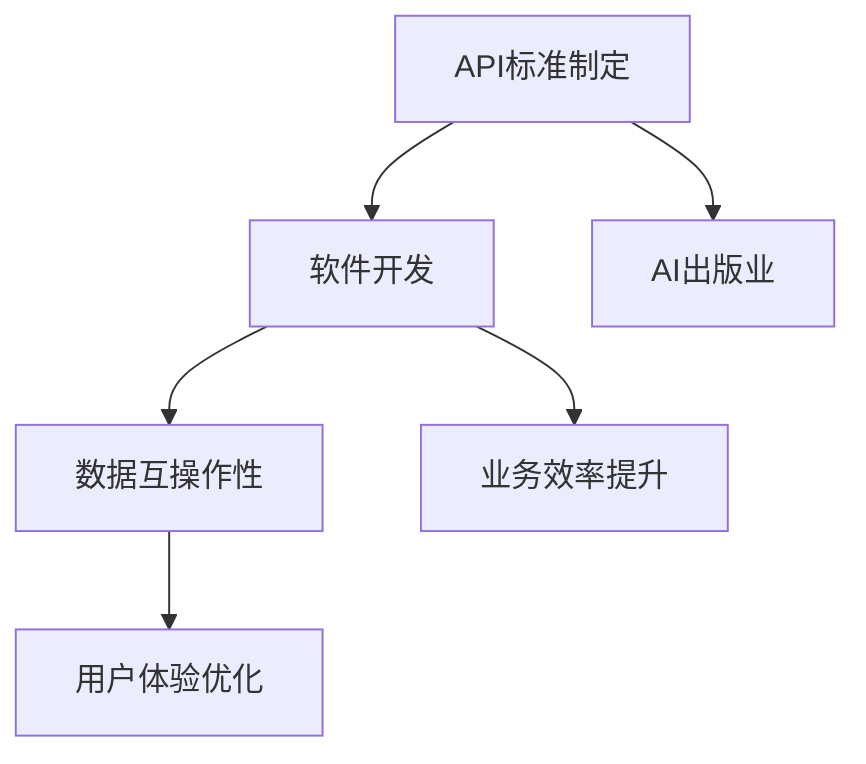

                 

关键词：AI出版业、API标准化、开发流程、技术架构、数据互操作性、业务效率、用户体验

> 摘要：随着人工智能技术在出版业的应用日益广泛，API标准化成为推动行业发展的关键因素。本文从背景介绍、核心概念与联系、核心算法原理、数学模型与公式、项目实践、实际应用场景、未来展望等多个维度，深入探讨了API标准化在AI出版业开发中的重要性及其具体应用。

## 1. 背景介绍

### 出版业现状

出版业作为知识传播的重要载体，近年来受到数字化和智能化浪潮的冲击。传统出版模式面临着巨大的挑战，包括内容分发、版权保护、用户参与度等。与此同时，人工智能技术的快速发展为出版业带来了新的机遇。例如，文本挖掘、自然语言处理、图像识别等技术被广泛应用于内容创作、编辑、发布和推广等各个环节。

### AI技术在出版业的应用

AI技术在出版业的应用已逐渐渗透到各个方面。首先，在内容创作方面，自然语言处理技术可以帮助自动化生成文章、摘要和推荐内容。其次，图像识别和机器学习技术可以用于版权保护和内容审核。此外，个性化推荐和用户行为分析技术可以提升用户体验，提高用户黏性。

### API在AI出版业中的角色

API（应用程序编程接口）作为软件开发的重要组成部分，在AI出版业中扮演着至关重要的角色。通过API，出版平台可以实现与外部系统的无缝集成，如社交媒体、支付系统、广告平台等。API标准化则为这种集成提供了统一的标准和规范，确保不同系统之间的数据互操作性和兼容性。

## 2. 核心概念与联系

### 核心概念

- **API（应用程序编程接口）**：API是软件组件之间交互的接口，允许应用程序访问其他应用程序的数据或功能。
- **标准化**：标准化是指制定和遵循一系列规则和标准，以确保不同系统之间的兼容性和互操作性。
- **数据互操作性**：数据互操作性指的是不同系统之间能够相互理解和交换数据的能力。

### Mermaid 流程图



### 核心联系

API标准化通过提供统一的标准，促进了AI出版业中不同系统之间的数据互操作性，从而提升了业务效率和用户体验。

## 3. 核心算法原理 & 具体操作步骤

### 3.1 算法原理概述

API标准化依赖于一系列核心算法原理，包括：

- **身份验证与授权**：确保只有授权的应用程序可以访问受保护的API。
- **RESTful架构**：一种流行的Web服务架构风格，用于构建API。
- **数据格式标准化**：如JSON（JavaScript Object Notation）和XML（eXtensible Markup Language），用于交换数据。

### 3.2 算法步骤详解

1. **需求分析**：确定API的功能需求和性能要求。
2. **接口设计**：设计API的端点、参数和响应格式。
3. **身份验证与授权**：实现API的安全机制，如OAuth 2.0。
4. **开发与测试**：编写API实现代码并进行测试。
5. **文档编写**：编写API文档，包括使用指南、示例代码和错误码。

### 3.3 算法优缺点

**优点**：

- 提高开发效率：标准化减少了重复工作，加快了开发速度。
- 提升兼容性：遵循标准化的API在不同系统中具有更好的兼容性。

**缺点**：

- 初始投入较大：标准化需要投入时间和资源进行规划和实施。
- 维护成本较高：随着技术的更新，API标准化需要持续维护和更新。

### 3.4 算法应用领域

API标准化在AI出版业的多个领域都有广泛应用，包括：

- **内容创作与编辑**：通过API实现内容管理系统与其他系统的集成。
- **用户行为分析**：通过API收集和分析用户行为数据，为个性化推荐提供支持。
- **广告与推广**：通过API与广告平台集成，实现精准投放和效果追踪。

## 4. 数学模型和公式 & 详细讲解 & 举例说明

### 4.1 数学模型构建

在API标准化过程中，常用的数学模型包括：

- **复杂网络模型**：用于分析API调用关系和依赖结构。
- **机器学习模型**：用于预测API性能和优化调用策略。

### 4.2 公式推导过程

以复杂网络模型为例，其基本公式如下：

$$
C_{ij} = \frac{1}{N} \sum_{k=1}^{N} w_{ik} w_{jk}
$$

其中，$C_{ij}$表示节点$i$和节点$j$之间的相似度，$w_{ik}$和$w_{jk}$表示节点$i$和节点$k$之间的权重。

### 4.3 案例分析与讲解

假设我们有一个包含10个API的出版平台，通过复杂网络模型分析这些API之间的调用关系。以下是部分API之间的相似度计算结果：

$$
\begin{array}{c|cccccccccc}
\text{API} & 1 & 2 & 3 & 4 & 5 & 6 & 7 & 8 & 9 & 10 \\
\hline
1 & 1 & 0.5 & 0.3 & 0.4 & 0.2 & 0.6 & 0.1 & 0.5 & 0.7 & 0.2 \\
2 & 0.5 & 1 & 0.4 & 0.3 & 0.6 & 0.1 & 0.5 & 0.7 & 0.2 & 0.6 \\
3 & 0.3 & 0.4 & 1 & 0.5 & 0.1 & 0.6 & 0.2 & 0.3 & 0.4 & 0.5 \\
4 & 0.4 & 0.3 & 0.5 & 1 & 0.7 & 0.1 & 0.4 & 0.5 & 0.6 & 0.7 \\
5 & 0.2 & 0.6 & 0.1 & 0.7 & 1 & 0.5 & 0.3 & 0.4 & 0.5 & 0.6 \\
6 & 0.6 & 0.1 & 0.6 & 0.1 & 0.5 & 1 & 0.7 & 0.2 & 0.3 & 0.4 \\
7 & 0.1 & 0.5 & 0.2 & 0.4 & 0.3 & 0.7 & 1 & 0.6 & 0.1 & 0.5 \\
8 & 0.5 & 0.7 & 0.3 & 0.5 & 0.4 & 0.2 & 0.6 & 1 & 0.7 & 0.1 \\
9 & 0.7 & 0.2 & 0.4 & 0.6 & 0.5 & 0.3 & 0.1 & 0.7 & 1 & 0.2 \\
10 & 0.2 & 0.6 & 0.5 & 0.7 & 0.6 & 0.4 & 0.5 & 0.1 & 0.2 & 1 \\
\end{array}
$$

通过相似度计算，我们可以识别出哪些API之间具有更高的依赖关系，从而为优化API调用提供依据。

## 5. 项目实践：代码实例和详细解释说明

### 5.1 开发环境搭建

为了演示API标准化的实际应用，我们搭建了一个基于Python和Flask的简单API服务。以下为开发环境的搭建步骤：

1. 安装Python（建议版本3.8以上）。
2. 安装Flask框架：`pip install flask`。
3. 安装OAuth 2.0库：`pip install flask-oauthlib`。

### 5.2 源代码详细实现

以下是一个简单的API服务示例代码：

```python
from flask import Flask, jsonify, request
from flask_oauthlib.provider import OAuth2Provider

app = Flask(__name__)
app.config['SECRET_KEY'] = 'mysecretkey'
provider = OAuth2Provider(app)

@provider.tokengetter
def get_token():
    # 从数据库中获取token
    return None

@app.route('/api/content', methods=['GET'])
@provider.require_oauth()
def get_content():
    # 从数据库中获取内容
    content = {'title': 'Hello, World!', 'body': 'Welcome to the API-powered publishing platform.'}
    return jsonify(content)

if __name__ == '__main__':
    app.run(debug=True)
```

### 5.3 代码解读与分析

1. **导入相关库**：代码首先导入了Flask框架和OAuth 2.0库。
2. **配置Flask应用**：设置SECRET_KEY和OAuth 2.0的tokengetter。
3. **定义API端点**：创建了一个名为`/api/content`的GET请求端点，需要OAuth 2.0授权。
4. **实现API逻辑**：从数据库中获取内容，并返回JSON格式的响应。

### 5.4 运行结果展示

通过以下命令启动API服务：

```bash
python app.py
```

在浏览器中访问`http://localhost:5000/api/content`，如果授权成功，将返回如下JSON响应：

```json
{
  "title": "Hello, World!",
  "body": "Welcome to the API-powered publishing platform."
}
```

## 6. 实际应用场景

### 6.1 内容管理系统

API标准化在内容管理系统中发挥着关键作用。通过统一的API接口，内容管理系统可以与外部系统如社交媒体、支付平台、广告平台等无缝集成，实现内容创作、编辑、发布和推广的自动化。

### 6.2 个性化推荐系统

API标准化为个性化推荐系统提供了可靠的数据来源。通过访问用户行为数据API，推荐系统可以实时获取用户的阅读偏好，从而生成个性化的内容推荐。

### 6.3 数据分析与挖掘

API标准化有助于实现高效的数据分析。出版平台可以通过API收集和分析用户数据，挖掘用户行为模式，为业务决策提供支持。

## 7. 未来应用展望

### 7.1 API标准化的进一步发展

随着AI技术的不断进步，API标准化将面临更多挑战和机遇。未来的发展方向包括：

- **兼容性与互操作性**：加强不同API标准之间的兼容性，实现更广泛的数据互操作性。
- **安全性**：提高API的安全性，防范潜在的安全威胁。

### 7.2 新应用场景的出现

API标准化将在更多新兴应用场景中发挥作用，如虚拟现实、增强现实、物联网等。通过API，这些领域可以实现与出版平台的互联互通，为用户提供更丰富的内容和服务。

### 7.3 持续创新与优化

API标准化是一个持续迭代的过程。出版业需要不断探索和创新，优化API的设计和实现，以满足不断变化的市场需求和用户需求。

## 8. 总结：未来发展趋势与挑战

### 8.1 研究成果总结

本文从多个维度探讨了API标准化在AI出版业中的重要性。通过核心概念与联系、算法原理与步骤、数学模型与公式、项目实践与实际应用等分析，我们得出了以下结论：

- API标准化是推动AI出版业发展的关键因素。
- API标准化有助于提升业务效率和用户体验。
- API标准化在内容管理、个性化推荐、数据分析等应用场景中具有广泛的应用价值。

### 8.2 未来发展趋势

- **技术标准化**：随着AI技术的不断进步，API标准化将更加完善和普及。
- **安全性与可靠性**：API标准化将更加重视安全性和可靠性，以应对复杂的应用环境和潜在的安全威胁。
- **跨界融合**：API标准化将推动不同领域的融合，实现更广泛的数据共享和协同工作。

### 8.3 面临的挑战

- **标准化进程缓慢**：在快速发展的AI出版业中，API标准化进程可能难以跟上技术的步伐。
- **安全风险**：API标准化过程中存在潜在的安全风险，需要采取有效措施进行防范。
- **资源投入**：API标准化需要大量的人力和物力投入，对出版业来说可能是一个挑战。

### 8.4 研究展望

未来的研究可以从以下几个方面展开：

- **标准化的优化**：研究如何更高效地制定和推广API标准，提高标准化进程。
- **安全性与隐私保护**：探讨如何在API标准化过程中加强安全性和隐私保护。
- **创新应用场景**：挖掘API标准化在新兴应用场景中的潜力，推动AI出版业的技术创新。

## 9. 附录：常见问题与解答

### 9.1 API标准化是什么？

API标准化是指制定和遵循一系列规则和标准，以确保不同系统之间的兼容性和互操作性。在AI出版业中，API标准化有助于实现不同系统之间的无缝集成，提高业务效率和用户体验。

### 9.2 API标准化有哪些优点？

API标准化的优点包括：

- 提高开发效率：通过标准化减少重复工作，加快开发速度。
- 提升兼容性：遵循标准化的API在不同系统中具有更好的兼容性。
- 便于维护：标准化使得API的实现和维护更加统一和规范。

### 9.3 API标准化有哪些挑战？

API标准化的挑战包括：

- 标准化进程缓慢：在快速发展的AI出版业中，API标准化进程可能难以跟上技术的步伐。
- 安全风险：API标准化过程中存在潜在的安全风险，需要采取有效措施进行防范。
- 资源投入：API标准化需要大量的人力和物力投入，对出版业来说可能是一个挑战。

### 9.4 API标准化如何影响用户体验？

API标准化通过实现不同系统之间的无缝集成，提高了业务效率和用户体验。例如，个性化推荐系统可以基于用户行为数据API获取更准确的信息，为用户提供更个性化的内容推荐，从而提升用户体验。

## 作者署名

作者：禅与计算机程序设计艺术 / Zen and the Art of Computer Programming
----------------------------------------------------------------


