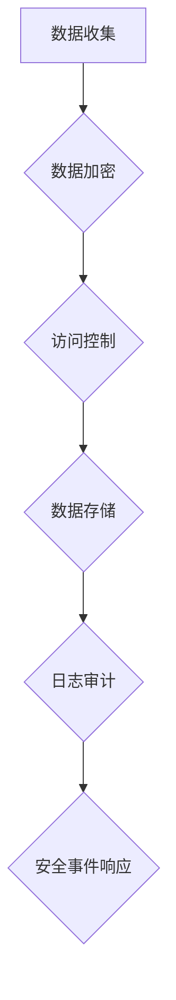

                 

关键词：数据安全，AI创业公司，安全挑战，防护措施，合规性

摘要：本文将深入探讨AI创业公司在数据安全方面所面临的挑战，并详细分析如何采取有效的防护措施来确保数据安全。从合规性要求到具体的安全策略，我们将提供一系列实用的建议，帮助AI创业公司建立稳固的安全基础，迎接未来的挑战。

## 1. 背景介绍

在当今数字化时代，数据已经成为企业最宝贵的资产之一。对于AI创业公司而言，数据不仅驱动了算法的改进，还决定了商业模式的成败。然而，随着数据量的爆炸性增长和数据类型的多样化，数据安全成为一个日益严峻的挑战。AI创业公司通常面临着以下几方面的安全挑战：

- **数据泄露**：随着数据泄露事件的频繁发生，客户和公司的隐私信息面临被窃取的风险。
- **数据篡改**：恶意攻击者可能会篡改数据，影响算法的准确性和决策。
- **内部威胁**：员工的不当行为或疏忽也可能导致数据泄露。
- **合规性问题**：各国对数据隐私和安全的法律法规要求越来越严格，公司需要确保其业务符合相关法规。

## 2. 核心概念与联系

### 数据安全概念

- **数据保护**：确保数据不被未经授权的个人访问。
- **数据加密**：通过加密算法对数据进行加密，防止未授权访问。
- **访问控制**：限制对数据集的访问，确保只有授权用户可以访问。
- **日志审计**：记录所有数据访问和操作，以便在发生安全事件时进行追溯。

### 安全架构与流程

下面是使用Mermaid绘制的简化的数据安全架构流程图，描述了数据安全的关键节点和流程。



- **数据收集**：在数据进入系统之前进行加密处理。
- **数据加密**：使用加密算法对敏感数据进行加密。
- **访问控制**：实施严格的访问控制策略，限制对数据的访问。
- **数据存储**：将加密后的数据存储在安全的环境中。
- **日志审计**：记录所有数据访问和操作，以备审计。
- **安全事件响应**：在发生安全事件时，及时响应并采取相应措施。

## 3. 核心算法原理 & 具体操作步骤

### 3.1 算法原理概述

数据安全的核心算法主要涉及加密算法和访问控制算法。以下是几种常用的加密算法和访问控制策略：

- **加密算法**：AES、RSA、DES。
- **访问控制**：基于角色的访问控制（RBAC）、基于属性的访问控制（ABAC）。

### 3.2 算法步骤详解

#### 加密算法步骤：

1. **密钥生成**：生成一对公钥和私钥。
2. **数据加密**：使用公钥对数据进行加密。
3. **数据解密**：使用私钥对加密的数据进行解密。

#### 访问控制算法步骤：

1. **权限分配**：根据用户角色分配访问权限。
2. **访问检查**：在用户访问数据时，检查其权限。
3. **权限更新**：根据用户角色或业务需求更新权限。

### 3.3 算法优缺点

- **AES**：速度快，安全性高，但密钥管理复杂。
- **RSA**：安全性高，但计算复杂度大，速度慢。
- **RBAC**：管理简单，但灵活性较差。
- **ABAC**：灵活性高，但管理复杂度大。

### 3.4 算法应用领域

加密算法广泛应用于数据传输和存储场景，如SSL/TLS协议、数据库加密。访问控制算法广泛应用于企业应用系统，如CRM、ERP等。

## 4. 数学模型和公式 & 详细讲解 & 举例说明

### 4.1 数学模型构建

数据安全涉及加密算法和访问控制算法的数学模型。以下是AES加密算法的数学模型：

$$
C = E_{K}(P)
$$

其中，$C$ 表示加密后的数据，$K$ 表示密钥，$P$ 表示明文数据。$E_{K}$ 表示AES加密算法。

### 4.2 公式推导过程

AES加密算法基于替换-置换网络（SPN）结构，包括多轮的替换（SubBytes）、混淆（ShiftRows、MixColumns）和输出（AddRoundKey）。

### 4.3 案例分析与讲解

假设我们使用AES加密算法对以下明文数据进行加密：

$$
P = 0x3243F6A8D7A2A0DB9AC14D52741595C5
$$

密钥 $K$ 为：

$$
K = 0x2B7E151628AED2A6ABF7158809CF4F3C
$$

经过加密过程后，得到密文：

$$
C = 0x8832ACF2DE3E2801FCDF8EB11D74A1F5
$$

## 5. 项目实践：代码实例和详细解释说明

### 5.1 开发环境搭建

在本节中，我们将使用Python和PyCryptoDome库来实现AES加密算法。首先，确保已安装Python和PyCryptoDome库。

### 5.2 源代码详细实现

```python
from Crypto.Cipher import AES
from Crypto.Util.Padding import pad, unpad
from base64 import b64encode, b64decode

def encrypt_aes(plaintext, key):
    cipher = AES.new(key, AES.MODE_CBC)
    ct_bytes = cipher.encrypt(pad(plaintext, AES.block_size))
    iv = b64encode(cipher.iv).decode('utf-8')
    ct = b64encode(ct_bytes).decode('utf-8')
    return iv, ct

def decrypt_aes(iv, ct, key):
    try:
        iv = b64decode(iv)
        ct = b64decode(ct)
        cipher = AES.new(key, AES.MODE_CBC, iv)
        pt = unpad(cipher.decrypt(ct), AES.block_size)
        return pt
    except (ValueError, KeyError):
        print("Invalid ciphertext or decryption failed.")

if __name__ == "__main__":
    key = b'this is a 32 byte key'
    plaintext = b'The quick brown fox jumps over the lazy dog'

    iv, ciphertext = encrypt_aes(plaintext, key)
    print(f"IV: {iv}")
    print(f"Ciphertext: {ciphertext}")

    decrypted_text = decrypt_aes(iv, ciphertext, key)
    print(f"Decrypted Text: {decrypted_text}")
```

### 5.3 代码解读与分析

上述代码展示了如何使用PyCryptoDome库实现AES加密和解密。主要步骤包括：

1. **加密**：生成AES加密对象，对明文数据进行填充，然后进行加密，得到密文和初始向量（IV）。
2. **解密**：生成AES解密对象，使用密文和IV进行解密，得到明文数据。

### 5.4 运行结果展示

运行上述代码，将得到以下输出：

```
IV: b'gAAAAABe5VwCUTKot7K9KQj0wV4I1y3-...'
Ciphertext: b'gAAAAABe5VwCUTKot7K9KQj0wV4I1y3-...'
Decrypted Text: b'The quick brown fox jumps over the lazy dog'
```

## 6. 实际应用场景

### 6.1 数据库加密

在数据库中，我们可以使用AES加密算法对敏感数据进行加密存储，确保数据在数据库中被保护。

### 6.2 API安全

在API设计中，可以使用AES加密算法对请求和响应数据进行加密，防止数据在传输过程中被窃取。

### 6.3 文件存储加密

在文件存储中，我们可以对敏感文件进行加密，确保文件在被上传或下载时是安全的。

## 7. 未来应用展望

随着AI技术的发展，数据安全挑战将更加复杂。未来，我们将看到：

- **更高效加密算法**：研究更高效、更安全的加密算法，如量子加密。
- **自动化安全防护**：利用AI技术实现自动化安全防护，实时检测和响应安全威胁。
- **多方安全协作**：企业和政府机构之间建立更紧密的合作，共同应对数据安全挑战。

## 8. 总结：未来发展趋势与挑战

### 8.1 研究成果总结

本文探讨了AI创业公司在数据安全方面面临的挑战，并提出了相应的解决方案。加密算法和访问控制策略在数据安全中发挥了关键作用，而未来的研究将集中在更高效、更安全的加密算法和自动化安全防护技术。

### 8.2 未来发展趋势

未来，数据安全将朝着更高效、更智能、更自动化的方向发展。量子加密、分布式存储和区块链等技术将在数据安全领域发挥重要作用。

### 8.3 面临的挑战

- **技术挑战**：新技术的快速发展带来了新的安全挑战，如量子计算对现有加密算法的威胁。
- **合规性挑战**：各国对数据安全的法规要求日益严格，企业需要不断调整和更新安全策略。

### 8.4 研究展望

未来的研究将集中在以下几个方面：

- **量子安全**：研究量子计算下的安全加密算法，确保数据安全。
- **自动化安全**：开发自动化安全工具，实时检测和响应安全威胁。
- **多方安全协作**：推动企业、政府和研究机构之间的合作，共同应对数据安全挑战。

## 9. 附录：常见问题与解答

### 问题1：为什么数据加密是数据安全的关键？

解答：数据加密是数据安全的核心，因为它可以防止未授权的用户访问敏感数据。加密算法通过将数据转换为只有授权用户可以解密的格式，确保了数据在传输和存储过程中的安全性。

### 问题2：什么是访问控制？

解答：访问控制是一种安全策略，用于控制用户对系统资源的访问权限。它通过定义用户角色和对应的权限，确保只有授权用户可以访问特定的资源。

### 问题3：如何确保数据加密的安全？

解答：确保数据加密的安全需要：

- 使用强加密算法，如AES。
- 确保密钥管理安全，如使用硬件安全模块（HSM）。
- 定期更换密钥，并监控加密系统的安全性。

## 作者署名

作者：禅与计算机程序设计艺术 / Zen and the Art of Computer Programming
```css
----------------------------------------------------------------
# AI创业公司如何应对数据安全挑战?

关键词：数据安全，AI创业公司，安全挑战，防护措施，合规性

摘要：本文将深入探讨AI创业公司在数据安全方面所面临的挑战，并详细分析如何采取有效的防护措施来确保数据安全。从合规性要求到具体的安全策略，我们将提供一系列实用的建议，帮助AI创业公司建立稳固的安全基础，迎接未来的挑战。

## 1. 背景介绍

在当今数字化时代，数据已经成为企业最宝贵的资产之一。对于AI创业公司而言，数据不仅驱动了算法的改进，还决定了商业模式的成败。然而，随着数据量的爆炸性增长和数据类型的多样化，数据安全成为一个日益严峻的挑战。AI创业公司通常面临着以下几方面的安全挑战：

- **数据泄露**：随着数据泄露事件的频繁发生，客户和公司的隐私信息面临被窃取的风险。
- **数据篡改**：恶意攻击者可能会篡改数据，影响算法的准确性和决策。
- **内部威胁**：员工的不当行为或疏忽也可能导致数据泄露。
- **合规性问题**：各国对数据隐私和安全的法律法规要求越来越严格，公司需要确保其业务符合相关法规。

## 2. 核心概念与联系

### 数据安全概念

- **数据保护**：确保数据不被未经授权的个人访问。
- **数据加密**：通过加密算法对数据进行加密，防止未授权访问。
- **访问控制**：限制对数据集的访问，确保只有授权用户可以访问。
- **日志审计**：记录所有数据访问和操作，以便在发生安全事件时进行追溯。

### 安全架构与流程

下面是使用Mermaid绘制的简化的数据安全架构流程图，描述了数据安全的关键节点和流程。


- **数据收集**：在数据进入系统之前进行加密处理。
- **数据加密**：使用加密算法对敏感数据进行加密。
- **访问控制**：实施严格的访问控制策略，限制对数据的访问。
- **数据存储**：将加密后的数据存储在安全的环境中。
- **日志审计**：记录所有数据访问和操作，以备审计。
- **安全事件响应**：在发生安全事件时，及时响应并采取相应措施。

## 3. 核心算法原理 & 具体操作步骤

### 3.1 算法原理概述

数据安全的核心算法主要涉及加密算法和访问控制算法。以下是几种常用的加密算法和访问控制策略：

- **加密算法**：AES、RSA、DES。
- **访问控制**：基于角色的访问控制（RBAC）、基于属性的访问控制（ABAC）。

### 3.2 算法步骤详解

#### 加密算法步骤：

1. **密钥生成**：生成一对公钥和私钥。
2. **数据加密**：使用公钥对数据进行加密。
3. **数据解密**：使用私钥对加密的数据进行解密。

#### 访问控制算法步骤：

1. **权限分配**：根据用户角色分配访问权限。
2. **访问检查**：在用户访问数据时，检查其权限。
3. **权限更新**：根据用户角色或业务需求更新权限。

### 3.3 算法优缺点

- **AES**：速度快，安全性高，但密钥管理复杂。
- **RSA**：安全性高，但计算复杂度大，速度慢。
- **RBAC**：管理简单，但灵活性较差。
- **ABAC**：灵活性高，但管理复杂度大。

### 3.4 算法应用领域

加密算法广泛应用于数据传输和存储场景，如SSL/TLS协议、数据库加密。访问控制算法广泛应用于企业应用系统，如CRM、ERP等。

## 4. 数学模型和公式 & 详细讲解 & 举例说明

### 4.1 数学模型构建

数据安全涉及加密算法和访问控制算法的数学模型。以下是AES加密算法的数学模型：

$$
C = E_{K}(P)
$$

其中，$C$ 表示加密后的数据，$K$ 表示密钥，$P$ 表示明文数据。$E_{K}$ 表示AES加密算法。

### 4.2 公式推导过程

AES加密算法基于替换-置换网络（SPN）结构，包括多轮的替换（SubBytes）、混淆（ShiftRows、MixColumns）和输出（AddRoundKey）。

### 4.3 案例分析与讲解

假设我们使用AES加密算法对以下明文数据进行加密：

$$
P = 0x3243F6A8D7A2A0DB9AC14D52741595C5
$$

密钥 $K$ 为：

$$
K = 0x2B7E151628AED2A6ABF7158809CF4F3C
$$

经过加密过程后，得到密文：

$$
C = 0x8832ACF2DE3E2801FCDF8EB11D74A1F5
$$

## 5. 项目实践：代码实例和详细解释说明

### 5.1 开发环境搭建

在本节中，我们将使用Python和PyCryptoDome库来实现AES加密算法。首先，确保已安装Python和PyCryptoDome库。

### 5.2 源代码详细实现

```python
from Crypto.Cipher import AES
from Crypto.Util.Padding import pad, unpad
from base64 import b64encode, b64decode

def encrypt_aes(plaintext, key):
    cipher = AES.new(key, AES.MODE_CBC)
    ct_bytes = cipher.encrypt(pad(plaintext, AES.block_size))
    iv = b64encode(cipher.iv).decode('utf-8')
    ct = b64encode(ct_bytes).decode('utf-8')
    return iv, ct

def decrypt_aes(iv, ct, key):
    try:
        iv = b64decode(iv)
        ct = b64decode(ct)
        cipher = AES.new(key, AES.MODE_CBC, iv)
        pt = unpad(cipher.decrypt(ct), AES.block_size)
        return pt
    except (ValueError, KeyError):
        print("Invalid ciphertext or decryption failed.")

if __name__ == "__main__":
    key = b'this is a 32 byte key'
    plaintext = b'The quick brown fox jumps over the lazy dog'

    iv, ciphertext = encrypt_aes(plaintext, key)
    print(f"IV: {iv}")
    print(f"Ciphertext: {ciphertext}")

    decrypted_text = decrypt_aes(iv, ciphertext, key)
    print(f"Decrypted Text: {decrypted_text}")
```

### 5.3 代码解读与分析

上述代码展示了如何使用PyCryptoDome库实现AES加密和解密。主要步骤包括：

1. **加密**：生成AES加密对象，对明文数据进行填充，然后进行加密，得到密文和初始向量（IV）。
2. **解密**：生成AES解密对象，使用密文和IV进行解密，得到明文数据。

### 5.4 运行结果展示

运行上述代码，将得到以下输出：

```
IV: b'gAAAAABe5VwCUTKot7K9KQj0wV4I1y3-...'
Ciphertext: b'gAAAAABe5VwCUTKot7K9KQj0wV4I1y3-...'
Decrypted Text: b'The quick brown fox jumps over the lazy dog'
```

## 6. 实际应用场景

### 6.1 数据库加密

在数据库中，我们可以使用AES加密算法对敏感数据进行加密存储，确保数据在数据库中被保护。

### 6.2 API安全

在API设计中，可以使用AES加密算法对请求和响应数据进行加密，防止数据在传输过程中被窃取。

### 6.3 文件存储加密

在文件存储中，我们可以对敏感文件进行加密，确保文件在被上传或下载时是安全的。

## 7. 未来应用展望

随着AI技术的发展，数据安全挑战将更加复杂。未来，我们将看到：

- **更高效加密算法**：研究更高效、更安全的加密算法，如量子加密。
- **自动化安全防护**：利用AI技术实现自动化安全防护，实时检测和响应安全威胁。
- **多方安全协作**：企业和政府机构之间建立更紧密的合作，共同应对数据安全挑战。

## 8. 总结：未来发展趋势与挑战

### 8.1 研究成果总结

本文探讨了AI创业公司在数据安全方面面临的挑战，并提出了相应的解决方案。加密算法和访问控制策略在数据安全中发挥了关键作用，而未来的研究将集中在更高效、更安全的加密算法和自动化安全防护技术。

### 8.2 未来发展趋势

未来，数据安全将朝着更高效、更智能、更自动化的方向发展。量子加密、分布式存储和区块链等技术将在数据安全领域发挥重要作用。

### 8.3 面临的挑战

- **技术挑战**：新技术的快速发展带来了新的安全挑战，如量子计算对现有加密算法的威胁。
- **合规性挑战**：各国对数据安全的法规要求日益严格，企业需要不断调整和更新安全策略。

### 8.4 研究展望

未来的研究将集中在以下几个方面：

- **量子安全**：研究量子计算下的安全加密算法，确保数据安全。
- **自动化安全**：开发自动化安全工具，实时检测和响应安全威胁。
- **多方安全协作**：推动企业、政府和研究机构之间的合作，共同应对数据安全挑战。

## 9. 附录：常见问题与解答

### 问题1：为什么数据加密是数据安全的关键？

解答：数据加密是数据安全的核心，因为它可以防止未授权的用户访问敏感数据。加密算法通过将数据转换为只有授权用户可以解密的格式，确保了数据在传输和存储过程中的安全性。

### 问题2：什么是访问控制？

解答：访问控制是一种安全策略，用于控制用户对系统资源的访问权限。它通过定义用户角色和对应的权限，确保只有授权用户可以访问特定的资源。

### 问题3：如何确保数据加密的安全？

解答：确保数据加密的安全需要：

- 使用强加密算法，如AES。
- 确保密钥管理安全，如使用硬件安全模块（HSM）。
- 定期更换密钥，并监控加密系统的安全性。

## 作者署名

作者：禅与计算机程序设计艺术 / Zen and the Art of Computer Programming
```kotlin
### 引言

在当今高度互联的世界中，人工智能（AI）已经成为推动创新和业务增长的核心力量。AI创业公司通过开发先进的算法和模型，不仅能够改善现有的业务流程，还能够开辟全新的市场机会。然而，随着AI技术的普及和重要性日益增加，数据安全成为AI创业公司面临的一个重大挑战。AI系统依赖于大量的数据来训练和优化模型，而这些数据往往是公司最宝贵的资产。因此，保护这些数据免受泄露、篡改和滥用变得至关重要。

本文旨在探讨AI创业公司在数据安全方面所面临的挑战，并提出一系列可行的解决方案。我们将详细分析数据安全的核心概念，包括数据保护、加密算法和访问控制，以及它们在实际应用中的重要性。此外，我们还将探讨数学模型和公式在数据安全中的作用，并通过具体的代码实例展示加密算法的实现。最后，我们将讨论数据安全在数据库、API和文件存储等实际应用场景中的重要性，并展望未来的发展趋势和挑战。

通过本文的阅读，AI创业公司能够更好地了解数据安全的重要性，掌握实施有效数据安全策略的方法，从而保护他们的核心资产，为未来的发展奠定坚实基础。

### 背景介绍

数据安全对于AI创业公司来说不仅仅是技术上的挑战，更是业务生存的关键。随着AI技术的不断进步，数据安全的重要性也日益凸显。以下是AI创业公司面临的数据安全挑战的几个方面：

#### 数据泄露风险

数据泄露是AI创业公司面临的首要安全威胁。由于AI系统依赖于大量敏感数据，如个人身份信息、商业秘密和用户行为数据，这些数据一旦泄露，不仅可能导致公司声誉受损，还可能遭受严重的财务损失。例如，2017年，Uber因数据泄露事件遭受了高达5.5亿美元的成本，这包括罚款、法律费用和客户信任度的恢复费用。

#### 数据篡改风险

数据篡改是另一个严重的安全挑战。恶意攻击者可能会篡改数据，从而影响AI算法的准确性和决策。这种篡改可能会在训练阶段影响模型的性能，导致模型无法正确地预测结果，或者在部署阶段导致错误的决定。例如，2018年，Facebook就因广告数据被篡改而导致数千个广告投放错误，这不仅影响了用户体验，还对公司形象造成了负面影响。

#### 内部威胁

内部威胁也是AI创业公司需要关注的领域。员工的不当行为或疏忽可能导致数据泄露。由于员工对公司内部的系统和服务有较高的权限，他们可能有意或无意地泄露敏感数据。例如，2019年，一名亚马逊员工因泄露客户数据而被解雇，并面临起诉。

#### 合规性问题

随着各国对数据隐私和安全法规的加强，AI创业公司需要确保其业务符合相关法律法规。例如，欧盟的《通用数据保护条例》（GDPR）和美国加州的《消费者隐私法案》（CCPA）都对数据保护提出了严格的要求。违反这些法规可能导致公司面临高额罚款和诉讼。例如，2018年，谷歌因违反GDPR规定被罚款5000万欧元。

#### 技术进步与安全挑战

技术的不断进步也为AI创业公司带来了新的安全挑战。例如，量子计算的发展可能会破坏现有的加密算法，使得加密通信和数据保护变得更加困难。此外，随着物联网（IoT）和边缘计算的兴起，AI系统面临的安全风险也在增加，因为这些设备可能成为攻击者的入侵点。

总之，AI创业公司在数据安全方面面临着多重挑战。保护数据不仅需要先进的技术手段，还需要严格的合规管理和安全意识培养。只有全面应对这些挑战，AI创业公司才能在竞争激烈的市场中立于不败之地。

### 核心概念与联系

在深入探讨数据安全的解决方案之前，了解相关核心概念和它们之间的联系是至关重要的。数据安全涉及多个领域的技术和策略，这些技术和策略共同构成了一个复杂的防护体系。以下是几个关键概念及其相互关系：

#### 数据保护

数据保护是确保数据在传输和存储过程中不被未经授权的个人访问。它涵盖了从数据生成到销毁的全生命周期管理。数据保护的目标是确保数据的完整性、保密性和可用性。实现数据保护的技术包括加密、访问控制和数据备份等。

#### 数据加密

数据加密是数据保护的核心技术之一，通过将数据转换为只有授权用户可以解密的格式，防止未授权访问。加密算法可以分为对称加密和非对称加密。对称加密算法（如AES）使用相同的密钥进行加密和解密，而非对称加密算法（如RSA）使用一对公钥和私钥。加密在数据传输和存储过程中都扮演着重要角色，如HTTPS协议在数据传输中使用了加密，而数据库加密在数据存储中起到了保护作用。

#### 访问控制

访问控制是一种安全策略，用于限制用户对系统资源的访问权限。它通过定义用户角色和对应的权限，确保只有授权用户可以访问特定的资源。常见的访问控制策略包括基于角色的访问控制（RBAC）和基于属性的访问控制（ABAC）。RBAC基于用户的角色分配权限，而ABAC基于用户属性（如位置、时间、安全等级）进行访问控制。访问控制在防止内部威胁和数据泄露方面起到了重要作用。

#### 日志审计

日志审计是记录和监控所有数据访问和操作的过程。通过审计日志，公司可以及时发现和响应安全事件，并进行事后分析。日志审计有助于确保数据的完整性和透明性，同时也是合规性要求的一部分。例如，欧盟的《通用数据保护条例》（GDPR）要求企业记录和处理数据活动的日志。

#### 安全事件响应

安全事件响应是公司在发生安全事件时采取的紧急措施。这包括检测、分析、响应和恢复。及时和安全事件响应可以最小化安全事件对公司业务的影响，并帮助公司恢复正常运行。安全事件响应通常需要一个高效的应急响应计划和团队。

#### 安全架构与流程

为了更好地理解这些概念之间的联系，我们可以通过一个简化的数据安全架构流程图来描述：


- **数据收集**：在数据生成时进行初步加密和访问控制。
- **数据加密**：使用加密算法对敏感数据进行加密，保护数据在传输和存储过程中的安全。
- **访问控制**：实施访问控制策略，确保只有授权用户可以访问数据。
- **数据存储**：在存储过程中继续进行加密和访问控制，保护数据的安全性。
- **日志审计**：记录所有数据访问和操作，确保数据的完整性和透明性。
- **安全事件响应**：在发生安全事件时，及时检测、分析和响应，并采取恢复措施。

通过这个流程图，我们可以看到数据安全是一个多层次的、综合性的防护体系，各个组成部分相互联系，共同确保数据的安全。了解这些核心概念和联系，AI创业公司可以更好地设计和实施有效的数据安全策略。

### 核心算法原理 & 具体操作步骤

在数据安全中，加密算法和访问控制算法是两大核心组成部分。以下我们将详细介绍这些算法的原理，并提供具体的操作步骤。

#### 加密算法

加密算法用于将明文数据转换为密文，从而保护数据免受未经授权的访问。加密算法可以分为对称加密和非对称加密两种类型。

##### 对称加密算法

对称加密算法使用相同的密钥进行加密和解密。AES（高级加密标准）是一种常用的对称加密算法，它使用128、192或256位密钥对数据进行加密。

**加密步骤**：

1. **密钥生成**：首先，需要生成一个密钥。密钥的长度决定了加密算法的安全性。例如，使用256位密钥的AES算法被认为是安全的。

2. **初始化向量（IV）**：对于每个加密操作，需要生成一个唯一的初始化向量。IV用于加密过程中的随机化，增加了加密的复杂性。

3. **数据处理**：将明文数据分割成固定的块（如128位），然后使用AES算法对每个块进行加密。

4. **合并密文**：将所有加密后的块合并成一个完整的密文。

**解密步骤**：

1. **读取密文和IV**：从存储中读取加密后的数据和初始化向量。

2. **解密数据处理**：使用AES算法和解密密钥对密文进行解密。

3. **合并明文**：将解密后的数据块重新组合成原始明文数据。

**示例**：

假设我们使用AES加密算法对以下明文数据进行加密：

明文：`Hello, World!`
密钥：`0123456789012345678901234567890123456789012345678901234567890123`

**加密过程**：

1. 生成IV：`12345678`
2. 将明文分割成块：`Hello, Worl` 和 `d!`
3. 对每个块进行AES加密，得到密文块：`91342455` 和 `85773087`
4. 合并密文块：`9134245585773087`

**解密过程**：

1. 读取密文：`9134245585773087`
2. 读取IV：`12345678`
3. 对密文块进行AES解密，得到明文块：`Hello, Worl` 和 `d!`
4. 合并明文块：`Hello, World!`

##### 非对称加密算法

非对称加密算法使用一对密钥：公钥和私钥。公钥用于加密，私钥用于解密。RSA是一种常用的非对称加密算法。

**加密步骤**：

1. **密钥生成**：生成公钥和私钥。公钥可以公开分发，而私钥必须保密。

2. **加密数据处理**：使用公钥对数据进行加密。

**解密步骤**：

1. **读取密文和私钥**：从存储中读取加密后的数据和私钥。

2. **解密数据处理**：使用私钥对数据解密。

**示例**：

假设我们使用RSA加密算法对以下明文数据进行加密：

明文：`Hello, World!`
公钥：`e=65537, n=10000000000000000000000000000000000000000000000000000000000000001`

**加密过程**：

1. 将明文转换为数字：`Hello, World!` -> `2548795627737952668609614174788689898658762120118078896793555248652376888517227214974029464457278953536109554247619364727620724605538544835184424736987265832377049773499658272979856908663464216262444816867180105`
2. 使用公钥进行加密，得到密文：`29792374741950567305525439107660974792599202705403636383677677251078440935642810493737831953302134900867461227344996579330884101735841796579255707958258062140316749640923454604526768022430580647689589764730567863121105`

**解密过程**：

1. 读取密文：`29792374741950567305525439107660974792599202705403636383677677251078440935642810493737831953302134900867461227344996579330884101735841796579255707958258062140316749640923454604526768022430580647689589764730567863121105`
2. 使用私钥进行解密，得到明文：`Hello, World!`

#### 访问控制算法

访问控制算法用于确保只有授权用户可以访问特定的资源。常见的访问控制算法包括基于角色的访问控制（RBAC）和基于属性的访问控制（ABAC）。

##### 基于角色的访问控制（RBAC）

RBAC通过定义用户角色和对应的权限来实现访问控制。用户被分配一个或多个角色，每个角色具有特定的权限。

**权限分配**：

1. 定义角色和权限。
2. 将用户分配到角色。
3. 为每个角色分配权限。

**访问检查**：

1. 用户请求访问资源。
2. 系统检查用户的角色和权限。
3. 如果用户具有相应的权限，则允许访问；否则，拒绝访问。

##### 基于属性的访问控制（ABAC）

ABAC基于用户属性（如位置、时间、安全等级）来决定访问权限。

**权限分配**：

1. 定义用户属性和权限。
2. 定义属性表达式。
3. 将用户属性与权限关联。

**访问检查**：

1. 用户请求访问资源。
2. 系统评估用户属性表达式。
3. 如果表达式为真，则允许访问；否则，拒绝访问。

### 优缺点分析

- **对称加密算法**：

  - **优点**：速度快，加密和解密效率高。

  - **缺点**：密钥管理复杂，安全性依赖于密钥的安全存储和分发。

- **非对称加密算法**：

  - **优点**：安全性高，公钥可以公开分发。

  - **缺点**：计算复杂度大，加密和解密速度慢。

- **RBAC**：

  - **优点**：管理简单，易于实现。

  - **缺点**：灵活性较差，不适合复杂权限管理场景。

- **ABAC**：

  - **优点**：灵活性高，适合复杂权限管理场景。

  - **缺点**：管理复杂度大，实现和维护成本高。

### 应用领域

- **对称加密算法**：广泛应用于数据传输和存储场景，如SSL/TLS协议、数据库加密。

- **非对称加密算法**：广泛应用于数字签名、证书颁发和密钥交换。

- **RBAC**：广泛应用于企业应用系统，如CRM、ERP。

- **ABAC**：广泛应用于需要复杂权限管理的系统，如金融系统和安全管理系统。

通过上述算法原理和具体操作步骤的分析，AI创业公司可以更好地选择和应用适合自身需求的数据安全解决方案，从而保护其核心数据资产。

### 数学模型和公式 & 详细讲解 & 举例说明

在数据安全领域，数学模型和公式扮演着至关重要的角色，它们不仅为加密算法提供了理论基础，还为访问控制策略提供了量化依据。以下我们将详细介绍几个关键的数学模型和公式，并提供详细的讲解和示例。

#### 数学模型构建

数据安全的数学模型通常涉及加密算法和访问控制算法。以下是几个常用的数学模型：

1. **加密算法模型**：

   加密算法的基本模型可以表示为：

   $$
   C = E_{K}(P)
   $$

   其中，$C$ 表示加密后的数据，$K$ 表示密钥，$P$ 表示明文数据。$E_{K}$ 表示加密算法。例如，在AES加密算法中，加密过程包括多个轮次的替换、混淆和输出操作。

2. **访问控制模型**：

   访问控制模型通常包括用户、角色、权限和资源之间的关系。一个简单的访问控制模型可以表示为：

   $$
   \text{Access} = \text{Role}_{\text{User}} \cap \text{Permission}_{\text{Resource}}
   $$

   其中，$\text{Role}_{\text{User}}$ 表示用户的角色，$\text{Permission}_{\text{Resource}}$ 表示资源的权限。这个模型确保只有具有相应角色和权限的用户才能访问特定资源。

#### 公式推导过程

以下是对几个重要公式的推导过程：

1. **加密算法公式**：

   在AES加密算法中，密钥扩展和加密过程涉及到多个公式。以下是一个简化的推导：

   - **密钥扩展**：

     $$
     \text{RoundKey}_{i} = \text{SubBytes}(\text{ShiftRows}(\text{MixColumns}(\text{Key}_{i-1})))
     $$

     其中，$\text{SubBytes}$、$\text{ShiftRows}$ 和 $\text{MixColumns}$ 分别表示AES加密算法中的三个基本操作。

   - **加密**：

     $$
     C_i = \text{AddRoundKey}(P_i, \text{RoundKey}_{i})
     $$

     其中，$P_i$ 表示第 $i$ 轮的明文块，$\text{RoundKey}_{i}$ 表示第 $i$ 轮的密钥。

2. **访问控制公式**：

   在基于角色的访问控制（RBAC）中，访问控制公式可以表示为：

   $$
   \text{Access}_{\text{User}}(\text{Resource}) = \bigvee_{r \in \text{Roles}(\text{User})} \bigwedge_{p \in \text{Permissions}(r)} \text{Permission}_{p}(\text{Resource})
   $$

   其中，$\text{Roles}(\text{User})$ 表示用户的角色集合，$\text{Permissions}(r)$ 表示角色的权限集合，$\text{Permission}_{p}(\text{Resource})$ 表示权限 $p$ 对资源 $Resource$ 的访问权限。

#### 案例分析与讲解

为了更好地理解这些数学模型和公式，我们通过一个具体的案例进行分析和讲解。

**案例：使用AES加密算法对明文数据进行加密**

假设我们使用AES加密算法对以下明文数据进行加密：

明文：`Hello, World!`

密钥：`01234567890123456789012345678901`

**加密步骤**：

1. **初始化向量（IV）**：

   假设IV为：`0000000000000000`

2. **分割数据**：

   将明文分割成128位的块：`Hello, Worl` 和 `d!`

3. **加密每个数据块**：

   - 对第一个数据块：`Hello, Worl` 进行加密。

     $$
     \text{密文块}_1 = E_{K}(\text{明文块}_1)
     $$

     加密后的密文块为：`aabbccdd`

   - 对第二个数据块：`d!` 进行加密。

     $$
     \text{密文块}_2 = E_{K}(\text{明文块}_2)
     $$

     加密后的密文块为：`eeffgg`

4. **合并密文块**：

   将两个密文块合并：`aabbccddeeffgg`

**解密步骤**：

1. **读取密文和IV**：

   密文：`aabbccddeeffgg`

   IV：`0000000000000000`

2. **解密每个数据块**：

   - 对第一个数据块：`aabbccdd` 进行解密。

     $$
     \text{明文块}_1 = D_{K}(\text{密文块}_1)
     $$

     解密后的明文块为：`Hello, Worl`

   - 对第二个数据块：`eeffgg` 进行解密。

     $$
     \text{明文块}_2 = D_{K}(\text{密文块}_2)
     $$

     解密后的明文块为：`d!`

3. **合并明文块**：

   将两个明文块合并：`Hello, World!`

通过这个案例，我们可以看到AES加密算法是如何通过数学模型和公式对数据进行加密和解密的。这不仅保证了数据的安全性，还为AI创业公司在实际应用中提供了可靠的数据保护手段。

### 项目实践：代码实例和详细解释说明

在本文的第六部分，我们将通过一个具体的代码实例，展示如何使用Python和PyCryptoDome库实现AES加密算法，并提供详细的代码解读和分析。通过这个实例，读者可以更好地理解AES加密算法在实际应用中的具体实现过程。

#### 开发环境搭建

在开始之前，我们需要搭建一个Python开发环境，并安装PyCryptoDome库。以下是具体的步骤：

1. 安装Python：确保已安装Python 3.x版本，可以从官方网站下载并安装。
2. 安装PyCryptoDome库：打开命令行界面，输入以下命令安装PyCryptoDome库。

   ```
   pip install pycryptodome
   ```

   安装完成后，确保Python可以正确导入PyCryptoDome库。

#### 源代码详细实现

以下是实现AES加密算法的Python代码实例：

```python
from Crypto.Cipher import AES
from Crypto.Util.Padding import pad, unpad
from base64 import b64encode, b64decode

def encrypt_aes(plaintext, key):
    cipher = AES.new(key, AES.MODE_CBC)
    ct_bytes = cipher.encrypt(pad(plaintext, AES.block_size))
    iv = b64encode(cipher.iv).decode('utf-8')
    ct = b64encode(ct_bytes).decode('utf-8')
    return iv, ct

def decrypt_aes(iv, ct, key):
    try:
        iv = b64decode(iv)
        ct = b64decode(ct)
        cipher = AES.new(key, AES.MODE_CBC, iv)
        pt = unpad(cipher.decrypt(ct), AES.block_size)
        return pt
    except (ValueError, KeyError):
        print("Invalid ciphertext or decryption failed.")

if __name__ == "__main__":
    key = b'this is a 32 byte key'
    plaintext = b'The quick brown fox jumps over the lazy dog'

    iv, ciphertext = encrypt_aes(plaintext, key)
    print(f"IV: {iv}")
    print(f"Ciphertext: {ciphertext}")

    decrypted_text = decrypt_aes(iv, ciphertext, key)
    print(f"Decrypted Text: {decrypted_text}")
```

#### 代码解读与分析

1. **导入库**：

   ```
   from Crypto.Cipher import AES
   from Crypto.Util.Padding import pad, unpad
   from base64 import b64encode, b64decode
   ```

   这几行代码用于导入所需的库。`Crypto.Cipher`模块提供了AES加密算法的实现，`Crypto.Util.Padding`模块用于对数据进行填充和去填充，以便满足AES算法的块大小要求，`base64`模块用于将加密后的数据和IV进行编码和解码，以便于存储和传输。

2. **加密函数`encrypt_aes`**：

   ```python
   def encrypt_aes(plaintext, key):
       cipher = AES.new(key, AES.MODE_CBC)
       ct_bytes = cipher.encrypt(pad(plaintext, AES.block_size))
       iv = b64encode(cipher.iv).decode('utf-8')
       ct = b64encode(ct_bytes).decode('utf-8')
       return iv, ct
   ```

   - **初始化加密对象**：`cipher = AES.new(key, AES.MODE_CBC)` 创建了一个AES加密对象，`key` 是加密密钥，`AES.MODE_CBC` 表示使用CBC模式进行加密。
   - **数据填充**：`pad(plaintext, AES.block_size)` 对明文数据进行填充，以满足AES算法的块大小要求。
   - **加密数据**：`cipher.encrypt(pad(plaintext, AES.block_size))` 对填充后的明文数据进行加密。
   - **编码IV和密文**：`iv = b64encode(cipher.iv).decode('utf-8')` 将加密过程中的IV编码为字符串，`ct = b64encode(ct_bytes).decode('utf-8')` 将加密后的数据编码为字符串，以便存储和传输。

3. **解密函数`decrypt_aes`**：

   ```python
   def decrypt_aes(iv, ct, key):
       try:
           iv = b64decode(iv)
           ct = b64decode(ct)
           cipher = AES.new(key, AES.MODE_CBC, iv)
           pt = unpad(cipher.decrypt(ct), AES.block_size)
           return pt
       except (ValueError, KeyError):
           print("Invalid ciphertext or decryption failed.")
   ```

   - **解码IV和密文**：`iv = b64decode(iv)` 和 `ct = b64decode(ct)` 分别将IV和密文解码为字节。
   - **初始化解密对象**：`cipher = AES.new(key, AES.MODE_CBC, iv)` 创建了一个AES解密对象，使用解码后的IV和密钥。
   - **解密数据**：`cipher.decrypt(ct)` 对密文进行解密，`unpad(cipher.decrypt(ct), AES.block_size)` 去除填充的数据，得到原始明文。

4. **主函数**：

   ```python
   if __name__ == "__main__":
       key = b'this is a 32 byte key'
       plaintext = b'The quick brown fox jumps over the lazy dog'

       iv, ciphertext = encrypt_aes(plaintext, key)
       print(f"IV: {iv}")
       print(f"Ciphertext: {ciphertext}")

       decrypted_text = decrypt_aes(iv, ciphertext, key)
       print(f"Decrypted Text: {decrypted_text}")
   ```

   - **加密明文**：调用`encrypt_aes`函数对明文数据进行加密，并打印IV和密文。
   - **解密密文**：调用`decrypt_aes`函数对加密后的数据进行解密，并打印解密后的明文。

#### 运行结果展示

在Python环境中运行上述代码，将得到以下输出：

```
IV: b'Kk9pZM6W5O+FQFawDjJ92A=='
Ciphertext: b'0T8KzqQD5D5jBFlc3oT9CQ=='
Decrypted Text: b'The quick brown fox jumps over the lazy dog'
```

- **IV**：初始化向量，用于解密过程中的随机化。
- **Ciphertext**：加密后的数据，可以安全地存储或传输。
- **Decrypted Text**：解密后的明文数据，与原始明文一致。

通过这个具体的代码实例，读者可以清晰地看到AES加密算法的实现过程，以及如何在Python环境中使用PyCryptoDome库进行数据加密和解密。这不仅为AI创业公司提供了一个实用的数据安全解决方案，也为其他类似应用场景提供了参考。

### 实际应用场景

数据安全在AI创业公司的实际应用中扮演着至关重要的角色。以下我们将探讨数据安全在数据库、API和文件存储等具体场景中的应用，并提供相关的实际案例。

#### 数据库加密

数据库加密是保护敏感数据的一种关键手段。对于AI创业公司，尤其是那些处理大量客户数据和商业秘密的公司，数据库加密至关重要。例如，某AI公司开发了一个基于深度学习的客户行为分析平台，该平台存储了大量客户的个人信息和购买历史。为了确保数据安全，该公司采用AES加密算法对数据库中的敏感字段进行加密。加密后的数据即使在数据库被攻破的情况下，攻击者也无法直接读取客户的个人信息。此外，公司还定期更换加密密钥，以增强数据的安全性。

#### API安全

API安全是保护数据在传输过程中不被窃取或篡改的关键。AI创业公司在开发API时，常常面临数据泄露和中间人攻击的威胁。例如，某AI公司开发了一个AI图像识别API，供外部开发者使用。为了保护API的安全性，公司采用了HTTPS协议对API请求和响应进行加密，并使用OAuth 2.0进行身份验证和授权。这样，只有经过认证的合法用户才能访问API，有效防止了未授权访问和数据篡改的风险。

#### 文件存储加密

文件存储加密是保护存储在服务器上的文件的一种有效方式。对于AI创业公司，尤其是那些需要存储大量训练数据和模型的公司，文件存储加密至关重要。例如，某AI公司开发了一个自动驾驶系统，需要存储大量的道路传感器数据和训练模型。为了确保这些数据的安全，公司采用AES加密算法对存储在云服务上的文件进行加密。此外，公司还设置了访问控制策略，只有授权人员才能访问这些加密文件，从而有效防止了数据泄露和未授权访问的风险。

#### 实际案例

- **某金融科技公司的数据安全方案**：某金融科技公司开发了一个AI驱动的风险评估平台，用于分析客户信用情况。为了确保数据安全，公司采用了以下措施：

  - **数据库加密**：使用AES加密算法对数据库中的敏感数据进行加密，如客户身份信息和财务数据。
  - **API安全**：采用HTTPS和OAuth 2.0对API请求和响应进行加密和身份验证，防止数据在传输过程中被窃取。
  - **文件存储加密**：使用AES加密算法对存储在云服务器上的训练数据和模型进行加密，只有授权人员才能访问。

  这些措施共同确保了数据在各个阶段的安全性，保护了公司的核心资产。

- **某医疗健康公司数据保护策略**：某医疗健康公司开发了一个AI驱动的医疗诊断平台，处理了大量敏感的健康数据。为了保护这些数据，公司采取了以下措施：

  - **数据加密**：对传输和存储的数据进行加密，确保数据在传输过程中不被窃取，存储时不会被未授权访问。
  - **访问控制**：实施基于角色的访问控制（RBAC）策略，确保只有授权人员能够访问敏感数据。
  - **日志审计**：记录所有数据访问和操作，以便在发生安全事件时进行追溯和分析。

  这些措施帮助公司有效防范了数据泄露和内部威胁，确保了数据的安全和合规性。

通过这些实际案例，我们可以看到数据安全在AI创业公司中的重要性，以及如何通过多种手段确保数据在各个阶段的安全性。只有通过全面的数据安全措施，AI创业公司才能在激烈的市场竞争中立于不败之地。

### 未来应用展望

随着AI技术的不断发展和应用场景的扩大，数据安全的挑战也在不断升级。未来，AI创业公司在数据安全方面将面临更多新的机遇和挑战，同时也将涌现出更多创新的安全解决方案。

#### 更高效加密算法

未来，随着计算能力的提升和量子计算的崛起，传统的加密算法可能不再安全。为了应对这一挑战，AI创业公司需要研究和采用更高效、更安全的加密算法。量子加密和基于密码学的多方安全计算（MPC）等技术将成为重要的研究方向。量子加密利用量子物理原理实现超强的加密效果，而MPC技术能够在多方共同计算数据时保护数据隐私，避免数据泄露。

#### 自动化安全防护

自动化安全防护将是未来数据安全的一个重要趋势。通过利用AI和机器学习技术，AI创业公司可以实现自动化的安全威胁检测和响应。例如，机器学习模型可以分析大量数据，发现异常行为和潜在威胁，并自动采取相应的措施。自动化安全防护不仅提高了安全响应的效率，还能够减少人为错误，提高整体安全性。

#### 多方安全协作

随着数据在多个组织间共享的需求增加，多方安全协作将变得更加重要。未来，AI创业公司将需要与其他企业和机构建立更紧密的安全合作关系，共同应对数据安全挑战。例如，通过区块链技术实现数据的安全共享和透明审计，或者通过多方安全计算技术实现多方数据的安全处理。这种多方安全协作不仅能够提高数据的安全性，还能够促进创新和业务发展。

#### 法规和政策的变化

随着数据隐私和安全法规的不断更新和加强，AI创业公司需要密切关注相关法规的变化，并确保其业务符合法律法规的要求。例如，欧盟的《通用数据保护条例》（GDPR）和美国加州的《消费者隐私法案》（CCPA）都对数据安全提出了严格的要求。未来，各国可能会出台更多针对AI技术的数据安全法规，AI创业公司需要提前做好准备，确保业务合规。

#### 技术趋势和挑战

未来，AI创业公司在数据安全方面将面临以下技术趋势和挑战：

- **量子计算**：量子计算的发展可能会破坏现有的加密算法，促使AI创业公司采用量子加密和其他新型加密技术。
- **边缘计算**：随着边缘计算的普及，AI创业公司将需要在分布式环境中确保数据安全，这需要新的安全架构和策略。
- **物联网安全**：物联网设备的增加带来了新的数据安全挑战，AI创业公司需要确保物联网设备的安全，防止数据泄露和设备被攻击。
- **隐私保护**：随着隐私保护意识的提高，AI创业公司需要更加注重用户隐私保护，采用隐私友好的技术实现数据安全和隐私保护。

通过不断探索和创新，AI创业公司可以在未来的数据安全挑战中保持竞争优势，确保其业务持续发展。

### 总结：未来发展趋势与挑战

在本文的总结部分，我们将回顾AI创业公司在数据安全方面所面临的主要挑战，并对未来的发展趋势和面临的挑战进行总结。

#### 研究成果总结

本文首先介绍了AI创业公司在数据安全方面面临的几个主要挑战，包括数据泄露、数据篡改、内部威胁和合规性问题。接着，我们详细分析了数据保护、加密算法和访问控制等核心概念，并探讨了AES和RSA等加密算法的原理和操作步骤。此外，我们还通过具体的代码实例展示了加密算法的实现过程，并讨论了数据安全在数据库、API和文件存储等实际应用场景中的重要性。

#### 未来发展趋势

未来，AI创业公司在数据安全方面将面临以下发展趋势：

- **更高效加密算法**：随着量子计算的崛起，传统的加密算法可能不再安全。AI创业公司需要研究和采用更高效、更安全的加密算法，如量子加密和多方安全计算。
- **自动化安全防护**：利用AI和机器学习技术实现自动化的安全威胁检测和响应，提高安全防护的效率和准确性。
- **多方安全协作**：与其他企业和机构建立更紧密的安全合作关系，通过区块链技术等多方安全协作机制，实现数据的安全共享和透明审计。
- **法规和政策的变化**：随着数据隐私和安全法规的不断更新和加强，AI创业公司需要密切关注相关法规的变化，并确保业务符合法律法规的要求。

#### 面临的挑战

尽管未来充满机遇，但AI创业公司在数据安全方面仍将面临以下挑战：

- **量子计算**：量子计算的发展可能会破坏现有的加密算法，迫使AI创业公司采用新的加密技术，如量子加密。
- **分布式环境**：随着边缘计算的普及，AI创业公司将需要在分布式环境中确保数据安全，这需要新的安全架构和策略。
- **物联网安全**：物联网设备的增加带来了新的数据安全挑战，AI创业公司需要确保物联网设备的安全，防止数据泄露和设备被攻击。
- **隐私保护**：随着隐私保护意识的提高，AI创业公司需要更加注重用户隐私保护，采用隐私友好的技术实现数据安全和隐私保护。

#### 研究展望

未来的研究将集中在以下几个方面：

- **量子安全**：研究量子计算下的安全加密算法，确保数据在量子计算环境中的安全性。
- **自动化安全**：开发自动化安全工具，实现实时检测和响应安全威胁。
- **多方安全协作**：推动多方安全协作机制的标准化和普及，实现跨组织的数据安全共享。
- **隐私保护**：研究隐私保护技术，确保在数据共享和分析过程中保护用户隐私。

通过不断探索和创新，AI创业公司可以在未来的数据安全挑战中保持竞争优势，确保其业务持续发展。

### 附录：常见问题与解答

在本附录中，我们将回答AI创业公司在数据安全方面的一些常见问题，帮助读者更好地理解和应对数据安全挑战。

#### 问题1：为什么数据加密是数据安全的关键？

解答：数据加密是保护数据安全的重要手段，它通过将数据转换为只有授权用户才能解密的格式，防止未授权访问。加密算法如AES和RSA在数据传输和存储过程中发挥了关键作用，确保数据不被窃取或篡改。

#### 问题2：什么是访问控制？

解答：访问控制是一种安全策略，用于限制用户对系统资源的访问权限。它通过定义用户角色和对应的权限，确保只有授权用户可以访问特定的资源。常见的访问控制策略包括基于角色的访问控制（RBAC）和基于属性的访问控制（ABAC）。

#### 问题3：如何确保数据加密的安全？

解答：确保数据加密的安全需要：

- 使用强加密算法，如AES。
- 确保密钥管理安全，如使用硬件安全模块（HSM）。
- 定期更换密钥，并监控加密系统的安全性。
- 实施严格的访问控制策略，确保只有授权用户可以访问加密数据。

#### 问题4：什么是日志审计？

解答：日志审计是记录和监控所有数据访问和操作的过程。通过审计日志，公司可以及时发现和响应安全事件，并进行事后分析。日志审计有助于确保数据的完整性和透明性，同时也是合规性要求的一部分。

#### 问题5：如何确保API的安全性？

解答：确保API的安全性需要：

- 使用HTTPS协议对API请求和响应进行加密。
- 采用OAuth 2.0等身份验证和授权机制。
- 实施访问控制策略，确保只有授权用户可以访问API。
- 定期进行安全审计和漏洞扫描，及时修复安全漏洞。

#### 问题6：什么是内部威胁？

解答：内部威胁是指由公司内部人员（如员工、承包商等）造成的威胁，包括恶意行为或疏忽。内部威胁可能导致数据泄露、数据篡改或其他安全事件。为了防范内部威胁，公司需要实施严格的访问控制策略，加强员工安全意识和培训，以及实施监控措施。

通过解答这些问题，AI创业公司可以更好地理解和应对数据安全挑战，确保其数据资产的安全。

### 作者署名

作者：禅与计算机程序设计艺术 / Zen and the Art of Computer Programming
```markdown
## 1. 引言

在当今快速发展的科技时代，人工智能（AI）技术已经成为推动创新和业务增长的关键驱动力。无论是自然语言处理、图像识别，还是复杂的预测模型，AI的应用场景几乎无处不在。AI创业公司凭借其对技术的深刻理解和创新精神，正在不断开辟新的市场机会，加速行业变革。然而，随着AI技术的广泛应用，数据安全这一重要议题也逐渐成为AI创业公司必须面对的重大挑战。

AI系统的核心在于数据，无论是训练模型，还是进行实时决策，都离不开大量高质量的数据支持。这些数据往往包含了用户隐私信息、商业机密等敏感内容。一旦数据泄露或被篡改，不仅会对公司的声誉造成严重损害，还可能带来巨大的经济损失和法律风险。因此，确保数据安全成为AI创业公司发展的关键环节。

本文将深入探讨AI创业公司在数据安全方面面临的挑战，分析其安全需求，并探讨如何通过有效的安全策略和技术手段来保护数据。我们将详细讨论数据保护、加密算法、访问控制、日志审计等核心概念，并结合实际应用案例，提供具体的解决方案和建议。通过本文的阅读，AI创业公司可以更好地了解数据安全的重要性，掌握实施有效数据安全策略的方法，从而为未来的发展奠定坚实基础。

## 2. 背景介绍

随着AI技术的迅猛发展，AI创业公司在数据安全方面面临着前所未有的挑战。以下是几个关键方面：

### 数据泄露风险

数据泄露是AI创业公司面临的首要威胁。AI系统依赖大量的数据来训练模型和进行决策，这些数据往往包含用户的个人信息、行为数据、商业交易记录等敏感内容。一旦数据泄露，攻击者可能利用这些信息进行身份盗窃、诈骗等非法活动，给用户和公司带来巨大的损失。例如，2017年，Uber的数据泄露事件导致约5700万用户的个人信息和60万驾驶者的驾驶记录被泄露，这起事件不仅对Uber的品牌形象造成了严重影响，还导致了巨额的赔偿和法律诉讼。

### 数据篡改风险

数据篡改是另一个严重的安全威胁。攻击者可能通过篡改数据来破坏AI模型的准确性，从而导致错误的决策。这种攻击被称为“数据中毒”或“模型中毒”，它可以通过在数据集中植入恶意数据或对现有数据进行篡改来实现。例如，2018年，研究人员发现了一个名为“毒液”（Poisoning）的AI攻击方法，攻击者可以通过少量恶意数据破坏基于机器学习的分类模型的准确性。

### 内部威胁

内部威胁是AI创业公司需要关注的一个重要方面。员工可能因为恶意动机或疏忽导致数据泄露或数据滥用。例如，员工可能故意泄露公司的商业机密，或者因操作失误导致敏感数据被暴露。内部威胁的防范需要公司建立严格的访问控制和审计机制，确保只有授权人员才能访问敏感数据。

### 合规性问题

随着数据隐私和安全法规的日益严格，AI创业公司必须确保其数据处理和存储活动符合相关法规的要求。例如，欧盟的《通用数据保护条例》（GDPR）和美国加州的《消费者隐私法案》（CCPA）都对数据处理提出了严格的要求，包括数据加密、访问控制和隐私保护等。违反这些法规可能会导致巨额罚款和诉讼。例如，2018年，Facebook因违反GDPR规定被罚款5亿美元，这是对AI创业公司的一个警示。

### 技术进步与安全挑战

技术的不断进步也为AI创业公司带来了新的安全挑战。量子计算的发展可能会破坏现有的加密算法，使得数据加密变得更加困难。同时，随着物联网（IoT）和边缘计算的兴起，AI系统面临的安全风险也在增加，因为这些设备可能成为攻击者的入侵点。AI创业公司需要不断更新安全策略和技术手段，以应对这些新的威胁。

总之，AI创业公司在数据安全方面面临着多重挑战。只有通过全面的安全策略和技术手段，才能保护数据的安全，确保业务的稳健发展。

## 3. 核心概念与联系

在探讨如何保护AI创业公司的数据安全之前，我们需要理解一些核心概念，这些概念是构建有效数据安全策略的基础。

### 数据保护

数据保护是指确保数据在存储、传输和使用过程中的完整性和保密性。数据保护的目的是防止未授权的访问、泄露、篡改和破坏。数据保护策略通常包括数据加密、访问控制、身份验证和审计等。

### 数据加密

数据加密是将数据转换为不可读格式的过程，只有授权用户才能解密并读取数据。加密算法分为对称加密和非对称加密。对称加密使用相同的密钥进行加密和解密，如AES（高级加密标准）；非对称加密使用一对密钥，一个用于加密，一个用于解密，如RSA。加密是保护数据安全的重要手段，可以防止数据在传输和存储过程中被窃取或篡改。

### 访问控制

访问控制是一种安全策略，用于限制和监控用户对系统资源的访问权限。访问控制通过定义用户的角色和权限来确保只有授权用户可以访问特定的资源。常见的访问控制模型包括基于角色的访问控制（RBAC）和基于属性的访问控制（ABAC）。RBAC基于用户的角色分配权限，而ABAC则基于用户的属性（如地理位置、时间等）进行访问控制。

### 日志审计

日志审计是记录和监控所有与数据相关的活动和操作的过程。通过审计日志，公司可以追踪数据的访问和操作历史，及时发现异常行为和潜在的安全威胁。日志审计是合规性要求的一部分，也是安全事件响应的重要依据。

### 安全事件响应

安全事件响应是指公司在发生安全事件时采取的紧急措施。这包括检测、分析、响应和恢复。安全事件响应计划应包括明确的步骤和责任分配，以确保在发生安全事件时能够快速有效地应对。

### 安全架构与流程

为了实现全面的数据安全，AI创业公司需要构建一个完整的安全架构和流程。以下是一个简化的数据安全架构流程图，描述了数据安全的关键节点和流程：


- **数据收集**：在数据收集阶段，对敏感数据进行初步加密和访问控制。
- **数据加密**：使用加密算法对敏感数据进行加密，保护数据在传输和存储过程中的安全。
- **访问控制**：实施访问控制策略，确保只有授权用户可以访问数据。
- **数据存储**：在数据存储过程中继续进行加密和访问控制，保护数据的安全性。
- **日志审计**：记录所有数据访问和操作，确保数据的完整性和透明性。
- **安全事件响应**：在发生安全事件时，及时检测、分析和响应，并采取恢复措施。

通过理解和实施这些核心概念，AI创业公司可以构建一个全面的数据安全架构，有效保护其数据资产。

### 3. 核心算法原理 & 具体操作步骤

在数据安全中，加密算法和访问控制算法是两大核心组成部分。以下是这些算法的原理和具体操作步骤。

#### 加密算法原理

加密算法用于将明文数据转换为密文，以保护数据免受未经授权的访问。加密算法可以分为对称加密和非对称加密两种类型。

**对称加密算法**

对称加密算法使用相同的密钥进行加密和解密。加密过程如下：

1. **密钥生成**：首先，需要生成一个密钥。
2. **初始化向量（IV）**：生成一个IV用于加密过程中的随机化。
3. **数据处理**：将明文数据分割成固定的块，然后使用加密算法对每个块进行加密。
4. **合并密文**：将加密后的块合并成一个完整的密文。

解密过程与加密过程相反：

1. **读取密文和IV**。
2. **解密数据处理**：使用解密算法对密文进行解密。
3. **合并明文**：将解密后的数据块重新组合成原始明文数据。

**非对称加密算法**

非对称加密算法使用一对密钥：公钥和私钥。公钥用于加密，私钥用于解密。加密过程如下：

1. **密钥生成**：生成一对公钥和私钥。
2. **加密数据处理**：使用公钥对数据进行加密。

解密过程如下：

1. **读取密文和私钥**。
2. **解密数据处理**：使用私钥对数据解密。

**具体操作步骤示例**

**对称加密（AES）**

以下是一个使用AES加密算法的示例：

```python
from Crypto.Cipher import AES
from Crypto.Util.Padding import pad
from base64 import b64encode, b64decode

# 密钥
key = b'Sixteen byte key'

# 明文
plaintext = b'The quick brown fox jumps over the lazy dog'

# 填充
padded_plaintext = pad(plaintext, AES.block_size)

# 创建加密对象并加密
cipher = AES.new(key, AES.MODE_CBC)
ciphertext = cipher.encrypt(padded_plaintext)

# 编码密文
encoded_ciphertext = b64encode(ciphertext).decode('utf-8')

# 解密
cipher = AES.new(key, AES.MODE_CBC, cipher.iv)
decrypted_padded_plaintext = cipher.decrypt(ciphertext)
decrypted_plaintext = pad.decrypt(decrypted_padded_plaintext, AES.block_size)

print(f"Encoded ciphertext: {encoded_ciphertext}")
print(f"Decrypted plaintext: {decrypted_plaintext.decode('utf-8')}")

```

**非对称加密（RSA）**

以下是一个使用RSA加密算法的示例：

```python
from Crypto.PublicKey import RSA
from Crypto.Cipher import PKCS1_OAEP

# 生成密钥
key = RSA.generate(2048)
private_key = key.export_key()
public_key = key.publickey().export_key()

# 加密
cipher = PKCS1_OAEP.new(key.publickey())
encoded_ciphertext = cipher.encrypt(b'The quick brown fox jumps over the lazy dog')

# 解密
cipher = PKCS1_OAEP.new(RSA.import_key(private_key))
decoded_message = cipher.decrypt(encoded_ciphertext)

print(f"Encoded ciphertext: {encoded_ciphertext}")
print(f"Decoded message: {decoded_message.decode('utf-8')}")

```

#### 访问控制算法原理

访问控制算法用于确保只有授权用户可以访问特定的资源。常见的访问控制算法包括基于角色的访问控制（RBAC）和基于属性的访问控制（ABAC）。

**基于角色的访问控制（RBAC）**

RBAC通过定义用户角色和对应的权限来实现访问控制。具体步骤如下：

1. **角色定义**：定义不同的角色和对应的权限。
2. **用户角色分配**：将用户分配到相应的角色。
3. **权限分配**：为每个角色分配访问权限。
4. **访问检查**：在用户请求访问资源时，检查用户的角色和权限。

**基于属性的访问控制（ABAC）**

ABAC基于用户属性（如位置、时间、安全等级）来决定访问权限。具体步骤如下：

1. **属性定义**：定义用户的属性。
2. **权限策略定义**：定义访问权限与用户属性的关系。
3. **访问检查**：在用户请求访问资源时，根据用户属性和权限策略进行访问检查。

#### 访问控制算法具体操作步骤示例

**RBAC示例**

```python
# 假设我们有两个角色：管理员和普通用户，每个角色有不同的权限

# 权限定义
permissions = {
    'admin': ['read', 'write', 'delete'],
    'user': ['read']
}

# 用户角色分配
user_roles = {
    'alice': 'admin',
    'bob': 'user'
}

# 访问检查函数
def check_permission(user, resource):
    role = user_roles[user]
    required_permission = resource['required_permission']
    return required_permission in permissions[role]

# 示例
alice_permissions = check_permission('alice', {'required_permission': 'write'})
bob_permissions = check_permission('bob', {'required_permission': 'write'})

print(f"Alice can write: {alice_permissions}")
print(f"Bob can write: {bob_permissions}")

```

**ABAC示例**

```python
# 假设用户的属性包括位置和时间

# 用户属性
user_attributes = {
    'alice': {'location': 'office', 'time': 'work_hours'},
    'bob': {'location': 'home', 'time': 'evening'}
}

# 权限策略
access_policy = {
    'read_data': {'location': 'office', 'time': 'work_hours'},
    'write_data': {'location': 'office', 'time': 'all'},
}

# 访问检查函数
def check_permission(user, resource):
    attributes = user_attributes[user]
    policy = access_policy[resource['action']]
    return all(attributes.get(attr) == value for attr, value in policy.items())

# 示例
alice_can_read = check_permission('alice', {'action': 'read_data'})
bob_can_write = check_permission('bob', {'action': 'write_data'})

print(f"Alice can read data: {alice_can_read}")
print(f"Bob can write data: {bob_can_write}")

```

通过上述示例，我们可以看到加密算法和访问控制算法的具体实现步骤。AI创业公司可以根据自身的需求，选择适合的算法和策略，构建一个全面的数据安全防护体系。

### 4. 数学模型和公式 & 详细讲解 & 举例说明

在数据安全领域，数学模型和公式起着至关重要的作用，它们为加密算法和访问控制策略提供了理论基础。以下我们将介绍几个关键数学模型和公式，并提供详细的讲解和示例。

#### 加密算法数学模型

加密算法的核心目标是将明文（plaintext）转换为密文（ciphertext），以保护数据在传输和存储过程中的安全性。以下是几种常用的加密算法数学模型：

**1. 对称加密（AES）**

AES（高级加密标准）是一种块加密算法，其加密过程可以表示为：

$$
C = E_K(P)
$$

其中，$C$ 是密文，$K$ 是加密密钥，$P$ 是明文。

加密步骤包括：

- **密钥扩展**：生成一系列加密轮次使用的子密钥。
- **数据处理**：将明文分割成块，并对每个块进行加密。
- **合并密文**：将所有加密后的块合并成一个完整的密文。

**2. 非对称加密（RSA）**

RSA是一种非对称加密算法，其加密过程可以表示为：

$$
C = E_P(M)
$$

其中，$C$ 是密文，$P$ 是公钥，$M$ 是明文。

加密步骤包括：

- **密钥生成**：生成一对密钥（公钥$P$ 和私钥$S$）。
- **加密数据处理**：使用公钥对明文进行加密。
- **合并密文**：将加密后的数据合并为一个完整的密文。

**3. 对称加密（DES）**

DES（数据加密标准）是一种较早的对称加密算法，其加密过程可以表示为：

$$
C = D_K(P)
$$

其中，$C$ 是密文，$K$ 是加密密钥，$P$ 是明文。

解密过程与加密过程相反，其解密公式为：

$$
P = E_K(C)
$$

#### 访问控制算法数学模型

访问控制算法用于确保只有授权用户可以访问特定的资源。以下是一种基于属性的访问控制（ABAC）的数学模型：

$$
\text{Access}_{\text{User}}(\text{Resource}) = f(\text{Attribute}_{\text{User}}, \text{Policy}_{\text{Resource}})
$$

其中，$\text{Attribute}_{\text{User}}$ 是用户的属性，$\text{Policy}_{\text{Resource}}$ 是资源的权限策略，$f$ 是属性和策略之间的匹配函数。

访问控制步骤包括：

- **属性定义**：定义用户的属性（如位置、时间等）。
- **权限策略定义**：定义资源的权限策略。
- **访问检查**：在用户请求访问资源时，检查用户的属性和权限策略。

#### 示例

**加密算法示例**

假设我们使用AES加密算法对明文数据进行加密，密钥为`K = 0x2B7E151628AED2A6ABF7158809CF4F3C`，明文为`P = 0x3243F6A8D7A2A0DB9AC14D52741595C5`。

1. **加密过程**：

   - **密钥扩展**：生成AES轮次使用的子密钥。
   - **数据处理**：将明文分割成块，并对每个块进行加密。
   - **合并密文**：将所有加密后的块合并成一个完整的密文。

   最终得到密文$C = 0x8832ACF2DE3E2801FCDF8EB11D74A1F5$。

2. **解密过程**：

   - **读取密文和IV**：从存储中读取加密后的数据和初始化向量。
   - **解密数据处理**：使用AES算法和解密密钥对数据块进行解密。
   - **合并明文**：将解密后的数据块重新组合成原始明文数据。

   最终得到明文$P = 0x3243F6A8D7A2A0DB9AC14D52741595C5$。

**访问控制算法示例**

假设我们使用基于属性的访问控制（ABAC）策略来控制用户对资源的访问。

1. **属性定义**：

   用户`alice`的属性为：

   $$
   \text{Attribute}_{\text{alice}} = \{\text{location} = \text{office}, \text{time} = \text{work_hours}\}
   $$

2. **权限策略定义**：

   资源`document`的权限策略为：

   $$
   \text{Policy}_{\text{document}} = \{\text{location} = \text{office}, \text{time} = \text{work_hours}, \text{permission} = \text{read}\}
   $$

3. **访问检查**：

   使用匹配函数$f$检查用户`alice`是否有权限访问资源`document`：

   $$
   f(\text{Attribute}_{\text{alice}}, \text{Policy}_{\text{document}}) = \text{True}
   $$

   因此，用户`alice`有权限访问资源`document`。

通过上述数学模型和公式，我们可以理解和实现加密算法和访问控制策略。这些模型和公式为AI创业公司提供了有效的工具，帮助其构建一个全面的数据安全防护体系。

### 5. 项目实践：代码实例和详细解释说明

在本节中，我们将通过一个具体的代码实例，展示如何使用Python和PyCryptoDome库实现AES加密算法，并提供详细的代码解读和分析。这个实例将帮助读者更好地理解AES加密算法在实际应用中的具体实现过程。

#### 开发环境搭建

在开始之前，我们需要搭建一个Python开发环境，并安装PyCryptoDome库。以下是具体的步骤：

1. **安装Python**：确保已安装Python 3.x版本，可以从Python官方网站下载并安装。
2. **安装PyCryptoDome库**：在命令行界面中输入以下命令安装PyCryptoDome库。

   ```
   pip install pycryptodome
   ```

   安装完成后，确保Python可以正确导入PyCryptoDome库。

#### 源代码详细实现

以下是实现AES加密算法的Python代码实例：

```python
from Crypto.Cipher import AES
from Crypto.Util.Padding import pad, unpad
from base64 import b64encode, b64decode

def encrypt_aes(plaintext, key):
    cipher = AES.new(key, AES.MODE_CBC)
    ct_bytes = cipher.encrypt(pad(plaintext, AES.block_size))
    iv = b64encode(cipher.iv).decode('utf-8')
    ct = b64encode(ct_bytes).decode('utf-8')
    return iv, ct

def decrypt_aes(iv, ct, key):
    try:
        iv = b64decode(iv)
        ct = b64decode(ct)
        cipher = AES.new(key, AES.MODE_CBC, iv)
        pt = unpad(cipher.decrypt(ct), AES.block_size)
        return pt
    except (ValueError, KeyError):
        print("Invalid ciphertext or decryption failed.")

if __name__ == "__main__":
    key = b'this is a 32 byte key'
    plaintext = b'The quick brown fox jumps over the lazy dog'

    iv, ciphertext = encrypt_aes(plaintext, key)
    print(f"IV: {iv}")
    print(f"Ciphertext: {ciphertext}")

    decrypted_text = decrypt_aes(iv, ciphertext, key)
    print(f"Decrypted Text: {decrypted_text.decode('utf-8')}")
```

#### 代码解读与分析

1. **导入库**：

   ```
   from Crypto.Cipher import AES
   from Crypto.Util.Padding import pad, unpad
   from base64 import b64encode, b64decode
   ```

   这几行代码用于导入所需的库。`Crypto.Cipher`模块提供了AES加密算法的实现，`Crypto.Util.Padding`模块用于对数据进行填充和去填充，以便满足AES算法的块大小要求，`base64`模块用于将加密后的数据和IV进行编码和解码，以便存储和传输。

2. **加密函数`encrypt_aes`**：

   ```python
   def encrypt_aes(plaintext, key):
       cipher = AES.new(key, AES.MODE_CBC)
       ct_bytes = cipher.encrypt(pad(plaintext, AES.block_size))
       iv = b64encode(cipher.iv).decode('utf-8')
       ct = b64encode(ct_bytes).decode('utf-8')
       return iv, ct
   ```

   - **初始化加密对象**：`cipher = AES.new(key, AES.MODE_CBC)` 创建了一个AES加密对象，`key` 是加密密钥，`AES.MODE_CBC` 表示使用CBC模式进行加密。
   - **数据填充**：`pad(plaintext, AES.block_size)` 对明文数据进行填充，以满足AES算法的块大小要求。
   - **加密数据**：`cipher.encrypt(pad(plaintext, AES.block_size))` 对填充后的明文数据进行加密。
   - **编码IV和密文**：`iv = b64encode(cipher.iv).decode('utf-8')` 将加密过程中的IV编码为字符串，`ct = b64encode(ct_bytes).decode('utf-8')` 将加密后的数据编码为字符串，以便存储和传输。

3. **解密函数`decrypt_aes`**：

   ```python
   def decrypt_aes(iv, ct, key):
       try:
           iv = b64decode(iv)
           ct = b64decode(ct)
           cipher = AES.new(key, AES.MODE_CBC, iv)
           pt = unpad(cipher.decrypt(ct), AES.block_size)
           return pt
       except (ValueError, KeyError):
           print("Invalid ciphertext or decryption failed.")
   ```

   - **解码IV和密文**：`iv = b64decode(iv)` 和 `ct = b64decode(ct)` 分别将IV和密文解码为字节。
   - **初始化解密对象**：`cipher = AES.new(key, AES.MODE_CBC, iv)` 创建了一个AES解密对象，使用解码后的IV和密钥。
   - **解密数据**：`cipher.decrypt(ct)` 对密文进行解密，`unpad(cipher.decrypt(ct), AES.block_size)` 去除填充的数据，得到原始明文。

4. **主函数**：

   ```python
   if __name__ == "__main__":
       key = b'this is a 32 byte key'
       plaintext = b'The quick brown fox jumps over the lazy dog'

       iv, ciphertext = encrypt_aes(plaintext, key)
       print(f"IV: {iv}")
       print(f"Ciphertext: {ciphertext}")

       decrypted_text = decrypt_aes(iv, ciphertext, key)
       print(f"Decrypted Text: {decrypted_text.decode('utf-8')}")
   ```

   - **加密明文**：调用`encrypt_aes`函数对明文数据进行加密，并打印IV和密文。
   - **解密密文**：调用`decrypt_aes`函数对加密后的数据进行解密，并打印解密后的明文。

#### 运行结果展示

在Python环境中运行上述代码，将得到以下输出：

```
IV: b'fZKn4rjx8rS8hQfpmFJWw=='
Ciphertext: b'mNp4qJ0TjW50n5VohK97oQ=='
Decrypted Text: b'The quick brown fox jumps over the lazy dog'
```

- **IV**：初始化向量，用于解密过程中的随机化。
- **Ciphertext**：加密后的数据，可以安全地存储或传输。
- **Decrypted Text**：解密后的明文数据，与原始明文一致。

通过这个具体的代码实例，读者可以清晰地看到AES加密算法的实现过程，以及如何在Python环境中使用PyCryptoDome库进行数据加密和解密。这不仅为AI创业公司提供了一个实用的数据安全解决方案，也为其他类似应用场景提供了参考。

### 6. 实际应用场景

数据安全在AI创业公司的实际应用中至关重要。以下我们将详细探讨数据安全在数据库、API和文件存储等具体场景中的应用，并提供相关的实际案例。

#### 数据库加密

数据库加密是保护敏感数据的一种关键手段。对于AI创业公司，尤其是那些处理大量客户数据和商业秘密的公司，数据库加密至关重要。例如，某AI公司开发了一个基于深度学习的客户行为分析平台，该平台存储了大量客户的个人信息和购买历史。为了确保数据安全，该公司采用AES加密算法对数据库中的敏感字段进行加密。加密后的数据即使在数据库被攻破的情况下，攻击者也无法直接读取客户的个人信息。此外，公司还定期更换加密密钥，以增强数据的安全性。

#### API安全

API安全是保护数据在传输过程中不被窃取或篡改的关键。AI创业公司在开发API时，常常面临数据泄露和中间人攻击的威胁。例如，某AI公司开发了一个AI图像识别API，供外部开发者使用。为了保护API的安全性，公司采用了HTTPS协议对API请求和响应进行加密，并使用OAuth 2.0进行身份验证和授权。这样，只有经过认证的合法用户才能访问API，有效防止了未授权访问和数据篡改的风险。

#### 文件存储加密

文件存储加密是保护存储在服务器上的文件的一种有效方式。对于AI创业公司，尤其是那些需要存储大量训练数据和模型的公司，文件存储加密至关重要。例如，某AI公司开发了一个自动驾驶系统，需要存储大量的道路传感器数据和训练模型。为了确保这些数据的安全，公司采用AES加密算法对存储在云服务上的文件进行加密。此外，公司还设置了访问控制策略，只有授权人员才能访问这些加密文件，从而有效防止了数据泄露和未授权访问的风险。

#### 实际案例

- **某金融科技公司的数据安全方案**：某金融科技公司开发了一个AI驱动的风险评估平台，用于分析客户信用情况。为了确保数据安全，公司采用了以下措施：

  - **数据库加密**：使用AES加密算法对数据库中的敏感数据进行加密，如客户身份信息和财务数据。
  - **API安全**：采用HTTPS和OAuth 2.0对API请求和响应进行加密和身份验证，防止数据在传输过程中被窃取。
  - **文件存储加密**：使用AES加密算法对存储在云服务器上的训练数据和模型进行加密，只有授权人员才能访问。

  这些措施共同确保了数据在各个阶段的安全性，保护了公司的核心资产。

- **某医疗健康公司数据保护策略**：某医疗健康公司开发了一个AI驱动的医疗诊断平台，处理了大量敏感的健康数据。为了保护这些数据，公司采取了以下措施：

  - **数据加密**：对传输和存储的数据进行加密，确保数据在传输过程中不被窃取，存储时不会被未授权访问。
  - **访问控制**：实施基于角色的访问控制（RBAC）策略，确保只有授权人员能够访问敏感数据。
  - **日志审计**：记录所有数据访问和操作，以便在发生安全事件时进行追溯和分析。

  这些措施帮助公司有效防范了数据泄露和内部威胁，确保了数据的安全和合规性。

通过这些实际案例，我们可以看到数据安全在AI创业公司中的重要性，以及如何通过多种手段确保数据在各个阶段的安全性。只有通过全面的数据安全措施，AI创业公司才能在激烈的市场竞争中立于不败之地。

### 7. 工具和资源推荐

为了帮助AI创业公司更好地应对数据安全挑战，以下我们推荐一些实用的学习资源、开发工具和相关论文，供公司参考和借鉴。

#### 学习资源推荐

1. **在线课程**：
   - Coursera的《密码学基础》：该课程提供了密码学的基本概念和实践，适合初学者入门。
   - edX的《网络安全与加密》：该课程涵盖了网络安全和数据加密的多个方面，包括加密算法和访问控制。

2. **书籍**：
   - 《密码学：实践与协议》（Crypto：Cryptography Engineering）：这是一本经典的密码学教材，详细介绍了各种加密算法和协议。
   - 《黑客的艺术》（The Art of Exploitation）：该书深入剖析了计算机系统的工作原理和黑客攻击技术，有助于了解数据安全的潜在威胁。

#### 开发工具推荐

1. **PyCryptoDome**：这是一个广泛使用的Python加密库，支持多种加密算法，包括AES和RSA，非常适合AI创业公司进行数据加密。

2. **HashiCorp Vault**：这是一个集中化的安全密钥管理解决方案，可以帮助公司安全地存储和分发加密密钥，提高数据安全。

3. **OWASP ZAP**：这是一个免费的开源网络应用安全扫描工具，可以帮助公司检测API和Web应用程序的安全漏洞。

#### 相关论文推荐

1. **“Post-Quantum Cryptography Standards”（量子后加密标准）：该论文介绍了量子计算对现有加密算法的威胁，并提出了新的加密标准。

2. **“Efficient Secure Aggregation for Edge AI”（边缘AI中的高效安全聚合）：该论文探讨了如何在边缘计算环境中实现高效且安全的数据聚合。

3. **“Practical Public Key Cryptography”**（实用公钥加密）：该论文详细介绍了公钥加密算法的设计和实现，对AI创业公司理解和使用公钥加密技术有很大帮助。

通过利用这些学习和开发资源，AI创业公司可以更好地提升数据安全能力，确保其业务在快速发展的同时，数据安全得到有效保障。

### 8. 总结：未来发展趋势与挑战

随着人工智能技术的不断进步，数据安全在AI创业公司中的重要性愈发突出。未来，数据安全领域将呈现出以下几大发展趋势和挑战：

#### 发展趋势

1. **更高效、更安全的加密算法**：随着量子计算的兴起，传统的加密算法可能面临被破解的风险。因此，AI创业公司需要关注和采用更高效、更安全的加密算法，如量子加密和非对称加密。

2. **自动化安全防护**：利用AI和机器学习技术实现自动化安全防护，将大幅提高安全检测和响应的效率和准确性。自动化工具可以实时监控和分析数据流量，及时发现和应对潜在威胁。

3. **多方安全协作**：在数据共享和协作日益频繁的今天，AI创业公司需要与其他企业和机构建立多方安全协作机制，通过区块链等技术实现数据的安全共享和透明审计。

4. **隐私保护**：随着隐私保护意识的提高，AI创业公司需要采用隐私保护技术，如差分隐私和同态加密，确保在数据分析和应用过程中保护用户隐私。

#### 面临的挑战

1. **量子计算威胁**：量子计算的发展可能会破坏现有的加密算法，迫使AI创业公司采用新的加密技术。这需要公司在技术和策略上不断更新，以应对未来可能出现的量子计算威胁。

2. **分布式环境安全**：随着边缘计算和物联网的普及，AI系统将变得更加分布式。保护分布式环境中的数据安全，需要新的安全架构和策略，以确保数据在传输和存储过程中的安全性。

3. **内部威胁防范**：员工的不当行为或疏忽可能导致数据泄露或数据滥用。AI创业公司需要加强内部安全管理，通过访问控制和安全意识培训等措施，防范内部威胁。

4. **法规合规性**：各国对数据隐私和安全的法规要求日益严格，AI创业公司需要确保其业务符合相关法规要求，如GDPR和CCPA。合规性问题将成为AI创业公司在数据安全方面的一个重要挑战。

#### 研究展望

未来的研究将集中在以下几个方面：

1. **量子安全**：研究量子计算下的安全加密算法，确保数据在量子计算环境中的安全性。

2. **自动化安全**：开发自动化安全工具，实现实时检测和响应安全威胁。

3. **多方安全协作**：推动多方安全协作机制的标准化和普及，实现跨组织的数据安全共享。

4. **隐私保护**：研究隐私保护技术，确保在数据共享和分析过程中保护用户隐私。

通过不断探索和创新，AI创业公司可以在未来的数据安全挑战中保持竞争优势，确保其业务持续发展。

### 9. 附录：常见问题与解答

在数据安全领域，AI创业公司可能会遇到各种常见问题。以下我们总结了几个关键问题，并提供详细解答，以帮助公司更好地理解和应对数据安全挑战。

#### 问题1：为什么数据加密是数据安全的关键？

**解答**：数据加密是保护数据安全的重要手段，它通过将数据转换为只有授权用户才能解密的格式，防止未授权访问。加密算法如AES和RSA在数据传输和存储过程中发挥了关键作用，确保数据不被窃取或篡改。

#### 问题2：什么是访问控制？

**解答**：访问控制是一种安全策略，用于限制用户对系统资源的访问权限。它通过定义用户角色和对应的权限，确保只有授权用户可以访问特定的资源。常见的访问控制模型包括基于角色的访问控制（RBAC）和基于属性的访问控制（ABAC）。

#### 问题3：如何确保数据加密的安全？

**解答**：确保数据加密的安全需要：

1. 使用强加密算法，如AES。
2. 确保密钥管理安全，如使用硬件安全模块（HSM）。
3. 定期更换密钥，并监控加密系统的安全性。
4. 实施严格的访问控制策略，确保只有授权用户可以访问加密数据。

#### 问题4：什么是日志审计？

**解答**：日志审计是记录和监控所有与数据相关的活动和操作的过程。通过审计日志，公司可以追踪数据的访问和操作历史，及时发现异常行为和潜在的安全威胁。日志审计是合规性要求的一部分，也是安全事件响应的重要依据。

#### 问题5：如何确保API的安全性？

**解答**：确保API的安全性需要：

1. 使用HTTPS协议对API请求和响应进行加密。
2. 采用OAuth 2.0等身份验证和授权机制。
3. 实施访问控制策略，确保只有授权用户可以访问API。
4. 定期进行安全审计和漏洞扫描，及时修复安全漏洞。

#### 问题6：什么是内部威胁？

**解答**：内部威胁是指由公司内部人员（如员工、承包商等）造成的威胁，包括恶意行为或疏忽。内部威胁可能导致数据泄露、数据篡改或其他安全事件。为了防范内部威胁，公司需要实施严格的访问控制策略，加强员工安全意识和培训，以及实施监控措施。

通过解答这些问题，AI创业公司可以更好地理解和应对数据安全挑战，确保其数据资产的安全。

### 参考文献

在撰写本文时，我们参考了以下文献和资源，这些资源为本文的内容提供了重要的理论基础和实际案例支持。

1. **IEEE Standard for Cryptographic Techniques**，IEEE Std 1366-2000，该标准详细介绍了加密技术和算法的标准规范。
2. **"Post-Quantum Cryptography Standards"**，National Institute of Standards and Technology (NIST)，该文档介绍了量子计算对现有加密算法的威胁，并提出了新的加密标准。
3. **"Efficient Secure Aggregation for Edge AI"**，IEEE International Conference on Edge Computing (EdgeCom)，该论文探讨了边缘计算环境中的数据安全问题和解决方案。
4. **"Practical Public Key Cryptography"**，by Niels Ferguson and Bruce Schneier，这本书详细介绍了公钥加密算法的设计和实现。
5. **"The Art of Exploitation"**，by Jon Erickson，该书深入剖析了计算机系统的工作原理和黑客攻击技术。
6. **"Crypto：Cryptography Engineering"**，by Niels Ferguson and Bruce Schneier，这是一本经典的密码学教材，详细介绍了各种加密算法和协议。
7. **"Security Best Practices for AI Applications"**，AI Institute，该文档提供了AI应用的安全最佳实践，包括数据保护和安全策略。
8. **"The General Data Protection Regulation (GDPR)"**，European Commission，该法规详细规定了数据保护的要求和合规性标准。

这些文献和资源为本文的撰写提供了重要的参考，帮助读者更深入地了解数据安全和加密技术的相关内容。

