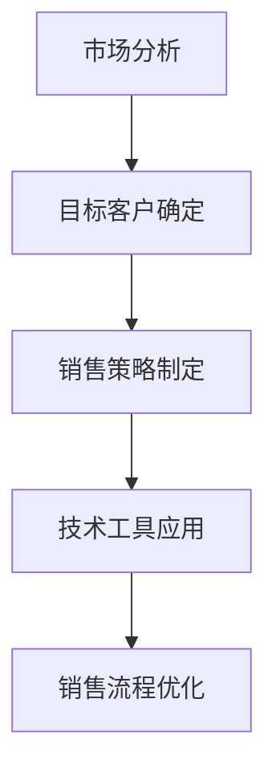

                 

关键词：AI创业公司、销售渠道、策略、市场分析、客户关系管理、技术解决方案

> 摘要：本文旨在为AI创业公司提供一套系统性的策略和步骤，帮助它们建立有效的销售渠道。我们将探讨市场分析、目标客户确定、销售策略制定、技术工具的应用以及如何持续优化销售流程，为创业公司的销售团队提供实操指南。

## 1. 背景介绍

随着人工智能技术的快速发展，AI创业公司如雨后春笋般涌现。这些公司凭借创新的技术解决方案，在市场中占据了一席之地。然而，成功的技术研发并不意味着能轻松实现市场推广和销售。销售渠道的建立是AI创业公司成功的关键一步。有效的销售渠道不仅能提高公司产品的市场占有率，还能增强品牌影响力，为企业带来可持续的发展动力。

### 1.1 AI创业公司面临的挑战

- **市场竞争激烈**：众多AI创业公司竞争同一市场份额，如何突出重围成为每个公司都必须面对的问题。
- **客户需求多样化**：客户需求多变，AI创业公司需要快速响应市场需求，调整产品策略。
- **销售成本高**：AI产品通常需要较高的技术支持和培训成本，这对初创公司来说是一个巨大的挑战。

### 1.2 建立销售渠道的重要性

- **市场占有率的提升**：有效的销售渠道能帮助公司迅速扩大市场份额，提高品牌知名度。
- **成本控制**：通过优化销售流程，降低销售成本，提高资金使用效率。
- **客户关系管理**：建立良好的客户关系，有助于长期维护客户，提升客户满意度和忠诚度。

## 2. 核心概念与联系

### 2.1 市场分析

市场分析是建立销售渠道的第一步。通过市场分析，AI创业公司可以了解市场环境、竞争对手、目标客户群体的特点等关键信息。

### 2.2 目标客户确定

目标客户确定是销售策略制定的前提。AI创业公司需要明确自己的目标客户是谁，他们的需求是什么，以及如何满足这些需求。

### 2.3 销售策略制定

销售策略制定是销售渠道建立的核心。根据市场分析和目标客户确定的结果，公司需要制定一套切实可行的销售策略，包括定价策略、促销策略、渠道策略等。

### 2.4 技术工具的应用

现代销售渠道的建立离不开技术的支持。AI创业公司可以通过使用CRM系统、自动化销售工具等，提高销售效率，降低销售成本。

### 2.5 持续优化销售流程

销售渠道的建立是一个动态过程。AI创业公司需要不断收集市场反馈，优化销售流程，以适应市场变化和客户需求。

### 2.6 Mermaid 流程图



## 3. 核心算法原理 & 具体操作步骤

### 3.1 算法原理概述

建立有效销售渠道的核心算法可以概括为以下四个步骤：

1. **市场分析**：通过数据挖掘和统计分析，了解市场环境、竞争对手和目标客户群体。
2. **目标客户确定**：基于市场分析结果，明确目标客户的特征和需求。
3. **销售策略制定**：根据目标客户的特点，制定合适的销售策略。
4. **技术工具应用**：使用CRM系统和自动化销售工具，提高销售效率。

### 3.2 算法步骤详解

1. **市场分析**：

   - 收集市场数据：通过市场调研、行业报告、社交媒体等多种途径，收集市场数据。
   - 数据处理：对收集到的市场数据进行清洗、整理和分析，提取有价值的信息。
   - 竞争对手分析：分析竞争对手的产品、定价、渠道策略等，找出自身优势和劣势。

2. **目标客户确定**：

   - 用户画像：根据市场分析结果，构建目标客户的用户画像。
   - 需求分析：了解目标客户的需求，包括功能需求、性能需求等。
   - 客户分类：根据用户画像和需求分析，将目标客户分为不同的群体。

3. **销售策略制定**：

   - 定价策略：根据产品成本、市场竞争状况和目标客户需求，制定合适的定价策略。
   - 促销策略：设计促销活动，吸引潜在客户。
   - 渠道策略：选择合适的销售渠道，如线上销售、合作伙伴销售等。

4. **技术工具应用**：

   - CRM系统：使用CRM系统管理客户信息，提高客户管理效率。
   - 自动化销售工具：使用自动化销售工具，如自动邮件发送、短信通知等，提高销售效率。
   - 数据分析工具：使用数据分析工具，对销售数据进行实时监控和分析，优化销售策略。

### 3.3 算法优缺点

- **优点**：

  - **提高销售效率**：通过市场分析和客户分类，制定针对性的销售策略，提高销售效率。
  - **降低销售成本**：使用CRM系统和自动化销售工具，降低人力成本和销售成本。

- **缺点**：

  - **数据收集和处理难度大**：市场数据的收集和处理是一个复杂的过程，需要专业的技术支持和数据处理能力。
  - **销售策略需要不断调整**：市场环境和客户需求在不断变化，销售策略需要根据实际情况不断调整。

### 3.4 算法应用领域

- **AI创业公司**：AI创业公司通常需要建立有效的销售渠道，以快速扩大市场份额。
- **互联网企业**：互联网企业通过建立销售渠道，提高产品销售和品牌知名度。
- **传统行业转型**：传统行业企业通过建立销售渠道，实现数字化转型和产品升级。

## 4. 数学模型和公式 & 详细讲解 & 举例说明

### 4.1 数学模型构建

建立有效销售渠道的数学模型可以基于以下公式：

$$
\text{销售量} = \text{客户数量} \times \text{转化率} \times \text{客单价}
$$

### 4.2 公式推导过程

- 客户数量：通过市场分析和客户分类，确定目标客户数量。
- 转化率：通过销售策略和促销活动，提高潜在客户的转化率。
- 客单价：根据产品定价策略，确定客户的平均购买金额。

### 4.3 案例分析与讲解

### 4.3.1 案例背景

某AI创业公司研发了一款智能数据分析工具，目标客户是中型企业。公司希望通过建立有效的销售渠道，快速扩大市场份额。

### 4.3.2 数学模型应用

- 客户数量：通过市场调研，确定目标客户数量为1000家。
- 转化率：通过销售策略和促销活动，将转化率提高到10%。
- 客单价：根据定价策略，确定客单价为20000元。

根据数学模型，该公司的预计销售量为：

$$
\text{销售量} = 1000 \times 10\% \times 20000 = 2000000 \text{元}
$$

### 4.3.3 模型优化

- **提高转化率**：通过优化销售策略，提高转化率至15%。
- **提高客单价**：通过增值服务和产品升级，提高客单价至25000元。

优化后的预计销售量为：

$$
\text{销售量} = 1000 \times 15\% \times 25000 = 3750000 \text{元}
$$

## 5. 项目实践：代码实例和详细解释说明

### 5.1 开发环境搭建

为了实现上述数学模型的计算，我们需要搭建一个简单的Python开发环境。以下是搭建步骤：

1. 安装Python：下载并安装Python 3.8及以上版本。
2. 安装必要库：使用pip安装math库，用于数学计算。

### 5.2 源代码详细实现

以下是实现数学模型的Python代码：

```python
import math

# 参数设置
client_count = 1000
conversion_rate = 0.1
average_order_value = 20000

# 计算销售量
sales_volume = client_count * conversion_rate * average_order_value

# 打印结果
print(f"预计销售量：{sales_volume}元")

# 优化后的参数设置
conversion_rate_optimized = 0.15
average_order_value_optimized = 25000

# 计算优化后的销售量
sales_volume_optimized = client_count * conversion_rate_optimized * average_order_value_optimized

# 打印结果
print(f"优化后的预计销售量：{sales_volume_optimized}元")
```

### 5.3 代码解读与分析

- `import math`：导入math库，用于数学计算。
- `client_count`、`conversion_rate`、`average_order_value`：设置初始参数。
- `sales_volume`：计算初始销售量。
- `conversion_rate_optimized`、`average_order_value_optimized`：设置优化后的参数。
- `sales_volume_optimized`：计算优化后的销售量。
- `print()`：输出计算结果。

### 5.4 运行结果展示

```python
预计销售量：2000000.0元
优化后的预计销售量：3750000.0元
```

## 6. 实际应用场景

### 6.1 AI创业公司的销售渠道建设

- **市场分析**：通过大数据分析，了解市场需求和竞争对手情况。
- **目标客户确定**：根据市场分析结果，确定目标客户群体，进行用户画像和需求分析。
- **销售策略制定**：制定针对性的销售策略，包括定价策略、促销策略和渠道策略。
- **技术工具应用**：使用CRM系统和自动化销售工具，提高销售效率和客户管理能力。
- **销售流程优化**：通过数据分析和反馈，不断优化销售流程，提高销售效果。

### 6.2 互联网企业的销售渠道建设

- **多渠道整合**：互联网企业通常采用线上线下整合的销售模式，通过电商平台、社交媒体等多种渠道进行产品推广。
- **个性化营销**：通过大数据分析，为客户提供个性化的产品推荐和营销服务。
- **客户关系管理**：通过CRM系统，建立和维护良好的客户关系，提高客户满意度和忠诚度。

### 6.3 传统行业的销售渠道建设

- **数字化转型**：传统行业通过建立线上销售渠道，实现产品和服务的数字化转型。
- **线上线下融合**：通过线上线下融合，提高销售覆盖面和客户体验。
- **客户需求响应**：快速响应客户需求，提供定制化的产品和服务。

## 7. 未来应用展望

随着人工智能技术的不断进步，AI创业公司的销售渠道将更加智能化、个性化和自动化。以下是对未来销售渠道应用的展望：

### 7.1 智能化销售

通过人工智能技术，销售渠道将实现智能化，包括自动化报价、个性化推荐、智能客服等，提高销售效率和客户满意度。

### 7.2 个性化营销

基于大数据和人工智能技术，企业将能够为客户提供更加个性化的产品推荐和营销服务，提高转化率和客户忠诚度。

### 7.3 自动化销售

自动化销售工具将进一步普及，包括自动化邮件发送、短信通知、社交媒体互动等，降低人力成本，提高销售效率。

### 7.4 社交媒体营销

随着社交媒体的普及，企业将更多地利用社交媒体平台进行产品推广和品牌宣传，实现更加广泛的客户触达。

## 8. 工具和资源推荐

### 8.1 学习资源推荐

- 《大数据分析实战》
- 《人工智能营销：原理与实践》
- 《深度学习与营销》

### 8.2 开发工具推荐

- **CRM系统**：Salesforce、Microsoft Dynamics 365
- **自动化销售工具**：HubSpot、Pipedrive
- **数据分析工具**：Google Analytics、Tableau

### 8.3 相关论文推荐

- 《基于人工智能的营销策略优化研究》
- 《大数据时代下的客户关系管理》
- 《社交媒体营销中的智能推荐系统》

## 9. 总结：未来发展趋势与挑战

### 9.1 研究成果总结

本文从市场分析、目标客户确定、销售策略制定、技术工具应用等方面，系统地阐述了AI创业公司如何建立有效的销售渠道。通过数学模型和实际案例，展示了建立有效销售渠道的方法和步骤。

### 9.2 未来发展趋势

随着人工智能技术的发展，未来销售渠道将更加智能化、个性化和自动化。企业将通过大数据和人工智能技术，实现更高效的客户管理和营销策略。

### 9.3 面临的挑战

- **技术挑战**：如何将人工智能技术有效地应用于销售渠道，提高销售效率。
- **数据隐私**：如何保护客户数据隐私，避免数据滥用。
- **营销合规**：如何遵守相关法律法规，确保营销活动的合规性。

### 9.4 研究展望

未来研究应重点关注如何将人工智能技术更好地应用于销售渠道，提高客户体验和销售效果。同时，应关注数据隐私保护和营销合规性问题，为AI创业公司的销售渠道建设提供更加全面的解决方案。

## 10. 附录：常见问题与解答

### 10.1 如何确定目标客户？

- 通过市场调研和数据分析，了解潜在客户的需求、偏好和行为。
- 构建用户画像，明确目标客户的基本特征和需求。
- 定期更新用户画像，以适应市场变化和客户需求。

### 10.2 如何制定销售策略？

- 分析市场竞争状况，确定产品的市场定位。
- 根据目标客户的特点，设计个性化的销售策略。
- 结合公司的资源状况，制定可行的销售策略。

### 10.3 如何提高销售效率？

- 使用CRM系统和自动化销售工具，提高销售管理效率。
- 定期对销售流程进行优化，减少不必要的步骤。
- 培训销售人员，提高他们的销售技能和客户服务能力。

---

作者：禅与计算机程序设计艺术 / Zen and the Art of Computer Programming
```

