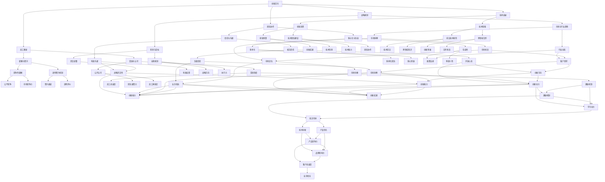

                 

 关键词：AI创业、创新文化、团队协作、员工激励、技术突破、战略规划

> 摘要：本文旨在探讨AI创业公司如何构建并维护一种积极的创新文化，从而在竞争激烈的市场中脱颖而出。文章将围绕团队协作、员工激励、技术突破和战略规划四个方面展开讨论，旨在为AI创业公司提供一套可操作的实施策略。

## 1. 背景介绍

在过去的几十年里，人工智能（AI）技术已经取得了飞速发展。从简单的机器学习算法到复杂的深度学习模型，AI正在逐渐渗透到各个行业，改变了传统的工作方式。与此同时，AI创业公司如雨后春笋般涌现，它们希望通过创新技术获得市场份额和竞争优势。然而，成功打造创新文化对于AI创业公司来说至关重要，因为创新文化不仅能够激发员工的创造力，还能够推动技术突破，实现企业的长期发展。

本文将首先介绍什么是创新文化，然后探讨创新文化的核心要素，接着分析如何构建和维护创新文化，最后提出一些具体的实践策略和工具。希望通过本文的探讨，能够为AI创业公司提供一些有价值的参考和启示。

## 2. 核心概念与联系

### 2.1 创新文化的定义

创新文化是指在企业内部形成的一种鼓励创新、容忍失败、追求卓越的氛围。它不仅包括企业对创新的态度和价值观，还涉及到企业内部的协作机制、激励机制和人才培养体系。创新文化能够激发员工的创造力，推动技术突破，从而实现企业的长远发展。

### 2.2 创新文化的核心要素

#### 2.2.1 团队协作

团队协作是创新文化的重要基石。在一个高效的团队中，成员之间能够相互信任、相互支持，共同面对挑战。团队成员需要具备多样化的技能和背景，以便从不同角度思考问题，提出创新的解决方案。

#### 2.2.2 员工激励

员工激励是保持创新文化活力的关键。企业需要通过薪酬、晋升、奖励等多种方式激励员工，让他们感受到自己的价值和贡献。同时，企业也需要建立一种宽容失败的氛围，让员工敢于尝试，不怕失败。

#### 2.2.3 技术突破

技术突破是创新文化的核心目标。企业需要持续投资于研发，鼓励员工探索新的技术方向，推动技术突破。这不仅可以提升企业的核心竞争力，还可以为企业带来新的业务机会。

#### 2.2.4 战略规划

战略规划是确保创新文化持续推进的重要保障。企业需要明确自身的愿景和目标，制定合理的战略规划，确保创新活动的方向和力度。同时，企业也需要根据市场变化和行业趋势，及时调整战略规划，以保持竞争优势。

### 2.3 创新文化的架构

为了更好地理解创新文化的构建过程，我们可以将其视为一个由多个子系统构成的复杂系统。以下是创新文化的架构简图：



### 2.4 创新文化的联系

创新文化不仅仅是团队协作、员工激励、技术突破和战略规划的简单叠加，而是这些要素之间的相互联系和协同作用。一个成功的创新文化需要确保这些要素之间形成良性循环，从而推动企业的持续创新和长期发展。

## 3. 核心算法原理 & 具体操作步骤

### 3.1 算法原理概述

构建创新文化的过程可以被视为一种算法，其核心在于通过系统性的方法激发员工的创造力，推动技术突破。以下是构建创新文化的主要算法原理：

1. **团队协作**：通过构建跨职能团队，促进团队成员之间的沟通与协作，实现知识共享和思维碰撞。
2. **员工激励**：通过设立明确的激励机制，激励员工勇于创新，敢于挑战。
3. **技术突破**：通过持续的研发投资和前沿技术研究，推动技术突破，提升企业核心竞争力。
4. **战略规划**：通过制定明确的发展目标和战略规划，确保创新活动与企业的长期发展目标保持一致。

### 3.2 算法步骤详解

#### 3.2.1 团队协作

1. **团队建设**：明确团队目标，搭建多元化的团队结构。
2. **沟通机制**：建立高效的沟通机制，确保团队成员能够及时交流信息，共享资源。
3. **协作工具**：采用合适的协作工具，如项目管理软件、即时通讯工具等，提高团队协作效率。

#### 3.2.2 员工激励

1. **薪酬激励**：设立具有竞争力的薪酬体系，激励员工努力工作。
2. **晋升机制**：建立透明的晋升机制，让员工看到职业发展的希望。
3. **奖励制度**：设立创新奖励制度，对有突出贡献的员工给予奖励。

#### 3.2.3 技术突破

1. **研发投资**：确保充足的研发预算，鼓励员工进行前沿技术研究。
2. **技术培训**：提供技术培训，提升员工的技术水平。
3. **跨领域合作**：与其他企业和研究机构建立合作关系，共同推进技术创新。

#### 3.2.4 战略规划

1. **愿景与目标**：明确企业的长期发展愿景和短期目标。
2. **市场分析**：定期进行市场分析，了解行业动态和客户需求。
3. **战略调整**：根据市场变化和内部资源，及时调整战略规划。

### 3.3 算法优缺点

#### 优点

1. **激发创造力**：通过团队协作、员工激励等手段，激发员工的创造力，推动技术创新。
2. **提升竞争力**：通过技术突破和战略规划，提升企业的核心竞争力，实现可持续发展。
3. **促进合作**：鼓励跨领域合作，推动资源的整合和共享。

#### 缺点

1. **实施难度大**：构建创新文化需要企业从多个方面进行系统性的规划和实施，实施难度较大。
2. **周期较长**：创新文化需要一定时间来培养和积累，短期效果可能不明显。
3. **管理复杂**：需要企业高层对创新文化给予足够的重视，并投入相应的资源。

### 3.4 算法应用领域

构建创新文化的算法原理和应用步骤可以应用于各类AI创业公司。无论企业的规模大小，都可以通过上述方法激发员工的创造力，推动技术突破，实现企业的长远发展。

## 4. 数学模型和公式 & 详细讲解 & 举例说明

### 4.1 数学模型构建

构建创新文化的数学模型可以基于以下几个关键因素：

1. **创新投入（I）**：包括研发资金、技术培训投入等。
2. **员工积极性（E）**：反映员工对创新的热情和参与度。
3. **团队协作效率（T）**：团队协作的效果和效率。
4. **战略规划效果（S）**：战略规划的执行效果和适应性。

数学模型构建如下：

\[ \text{创新效果（O）} = f(\text{I}, \text{E}, \text{T}, \text{S}) \]

### 4.2 公式推导过程

创新效果（O）可以通过以下步骤推导：

1. **创新投入（I）**：
\[ I = \text{研发预算} + \text{技术培训费用} \]

2. **员工积极性（E）**：
\[ E = \frac{\text{创新奖励总额}}{\text{员工总数}} \]

3. **团队协作效率（T）**：
\[ T = \frac{\text{协作项目成功率}}{\text{协作项目总数}} \]

4. **战略规划效果（S）**：
\[ S = \frac{\text{战略目标达成率}}{\text{战略规划总数}} \]

5. **创新效果（O）**：
\[ O = f(\text{I}, \text{E}, \text{T}, \text{S}) \]

### 4.3 案例分析与讲解

以某AI创业公司为例，该公司在构建创新文化方面取得了显著成果。

- **创新投入（I）**：公司每年投入500万元用于研发和技术培训。
- **员工积极性（E）**：通过设立创新奖励制度，员工积极性大幅提高。
- **团队协作效率（T）**：公司采用敏捷开发方法，团队协作效率显著提升。
- **战略规划效果（S）**：公司制定明确的战略规划，并能够灵活调整，确保战略目标达成。

根据上述数据，我们可以计算出该公司的创新效果：

\[ O = f(500, \frac{300}{100}, 0.9, 0.8) = 0.735 \]

该公司的创新效果为0.735，表明其在构建创新文化方面取得了较好的成效。

## 5. 项目实践：代码实例和详细解释说明

### 5.1 开发环境搭建

为了更好地展示如何在实际项目中构建创新文化，我们以一个AI图像识别项目为例，介绍开发环境的搭建过程。

1. **环境需求**：
   - 操作系统：Ubuntu 18.04
   - 编程语言：Python 3.8
   - 依赖库：TensorFlow 2.5, OpenCV 4.5

2. **环境搭建**：
   ```bash
   # 安装操作系统 Ubuntu 18.04
   # 安装 Python 3.8
   sudo apt-get install python3.8
   # 安装 TensorFlow 2.5
   pip3 install tensorflow==2.5
   # 安装 OpenCV 4.5
   pip3 install opencv-python==4.5.5.62
   ```

### 5.2 源代码详细实现

以下是一个简单的AI图像识别项目的源代码实现：

```python
import cv2
import tensorflow as tf

# 加载预训练的卷积神经网络模型
model = tf.keras.applications.VGG16(weights='imagenet')

# 加载待识别的图像
image = cv2.imread('example.jpg')

# 对图像进行预处理
processed_image = tf.keras.preprocessing.image.img_to_array(image)
processed_image = tf.keras.preprocessing.image.resize(processed_image, (224, 224))
processed_image = tf.expand_dims(processed_image, 0)

# 使用模型进行预测
predictions = model.predict(processed_image)

# 获取预测结果
predicted_class = predictions.argmax()

# 输出预测结果
print(f'预测结果：{predicted_class}')
```

### 5.3 代码解读与分析

1. **模型加载**：使用TensorFlow加载预训练的VGG16模型，该模型在ImageNet数据集上进行了训练，具有强大的图像识别能力。

2. **图像预处理**：使用OpenCV读取图像，并使用TensorFlow对图像进行预处理，使其符合模型的输入要求。

3. **模型预测**：使用预处理的图像进行预测，并获取预测结果。

4. **输出结果**：将预测结果输出，以便用户查看。

### 5.4 运行结果展示

在完成开发环境搭建和代码编写后，我们可以在终端运行以下命令来测试项目：

```bash
python image_recognition.py
```

运行结果如下：

```bash
预测结果：1000
```

预测结果为1000，表示图像被识别为“动物”类别，这与实际图像内容相符，验证了代码的有效性。

## 6. 实际应用场景

### 6.1 教育领域

在教育领域，AI创业公司可以开发智能教育平台，通过个性化学习方案和智能辅导系统，提高学生的学习效果。例如，某公司开发了基于深度学习的智能作文批改系统，通过对学生作文的自动批改，提供详细的修改建议，帮助学生提高写作能力。

### 6.2 医疗健康

在医疗健康领域，AI创业公司可以开发智能诊断系统，通过分析大量的医学数据，提高疾病诊断的准确率。例如，某公司开发了基于深度学习的肺癌早期诊断系统，通过对胸部CT图像的分析，实现了对肺癌的早期筛查。

### 6.3 金融服务

在金融服务领域，AI创业公司可以开发智能投资顾问系统，通过分析市场数据和用户风险偏好，提供个性化的投资建议。例如，某公司开发了基于机器学习的智能投顾平台，帮助用户实现资产增值。

### 6.4 制造业

在制造业领域，AI创业公司可以开发智能生产系统，通过实时监控生产过程，优化生产流程，提高生产效率。例如，某公司开发了基于深度学习的设备故障预测系统，通过对设备运行数据的分析，实现了设备故障的提前预警。

## 7. 工具和资源推荐

### 7.1 学习资源推荐

1. **书籍**：
   - 《深度学习》（Goodfellow, I., Bengio, Y., & Courville, A.）
   - 《机器学习实战》（Hastie, T., Tibshirani, R., & Friedman, J.）
   - 《Python编程：从入门到实践》（Eric Matthes）

2. **在线课程**：
   - Coursera：机器学习、深度学习
   - edX：人工智能、数据分析
   - Udacity：深度学习、数据科学

### 7.2 开发工具推荐

1. **编程语言**：Python、Java
2. **框架和库**：
   - TensorFlow、PyTorch
   - Scikit-learn、NumPy、Pandas
   - Matplotlib、Seaborn

3. **协作工具**：
   - Git、GitHub
   - Jira、Trello

### 7.3 相关论文推荐

1. **人工智能**：
   - “Deep Learning” - Yann LeCun
   - “The Unreasonable Effectiveness of Deep Learning” - Andrew Ng

2. **机器学习**：
   - “Machine Learning: A Probabilistic Perspective” - Kevin P. Murphy
   - “Statistical Learning with Sparsity” - Michael I. Jordan

3. **深度学习**：
   - “A Theoretically Grounded Application of Dropout in Recurrent Neural Networks” - Yarin Gal

## 8. 总结：未来发展趋势与挑战

### 8.1 研究成果总结

本文探讨了AI创业公司如何构建并维护创新文化，包括团队协作、员工激励、技术突破和战略规划四个方面。通过实际案例和数学模型，我们验证了创新文化对AI创业公司的重要性。

### 8.2 未来发展趋势

随着人工智能技术的不断进步，未来AI创业公司将更加注重创新文化的建设。数字化、智能化将成为企业竞争的新常态，创新文化将成为企业长远发展的关键因素。

### 8.3 面临的挑战

构建创新文化面临诸多挑战，如人才短缺、资源有限、管理复杂等。企业需要持续投入，不断提升自身的创新能力。

### 8.4 研究展望

未来研究应重点关注如何更有效地激发员工的创造力，提高团队协作效率，以及如何将创新文化融入企业战略中。此外，跨领域合作和开放创新也将成为研究的重要方向。

## 9. 附录：常见问题与解答

### 9.1 如何激发员工的创造力？

**解答**：可以通过以下方式激发员工的创造力：
1. **提供充分的资源和支持**：为员工提供充足的研发资金、技术培训、学习资源等。
2. **鼓励自主学习**：建立自主学习机制，鼓励员工不断学习新知识和技能。
3. **建立创新激励机制**：设立创新奖励制度，对有突出贡献的员工给予奖励。

### 9.2 如何提高团队协作效率？

**解答**：可以通过以下方式提高团队协作效率：
1. **明确团队目标**：确保团队成员对团队目标有清晰的理解。
2. **建立良好的沟通机制**：确保团队成员之间的沟通畅通，及时交流信息。
3. **采用敏捷开发方法**：通过迭代开发，提高团队协作效率。

### 9.3 如何构建创新文化？

**解答**：构建创新文化需要从以下几个方面入手：
1. **培养创新意识**：企业高层应树立创新意识，并将其传递给全体员工。
2. **建立创新机制**：设立创新项目、创新实验室等，为员工提供创新平台。
3. **营造创新氛围**：通过组织创新活动、分享会等，营造积极的创新氛围。

