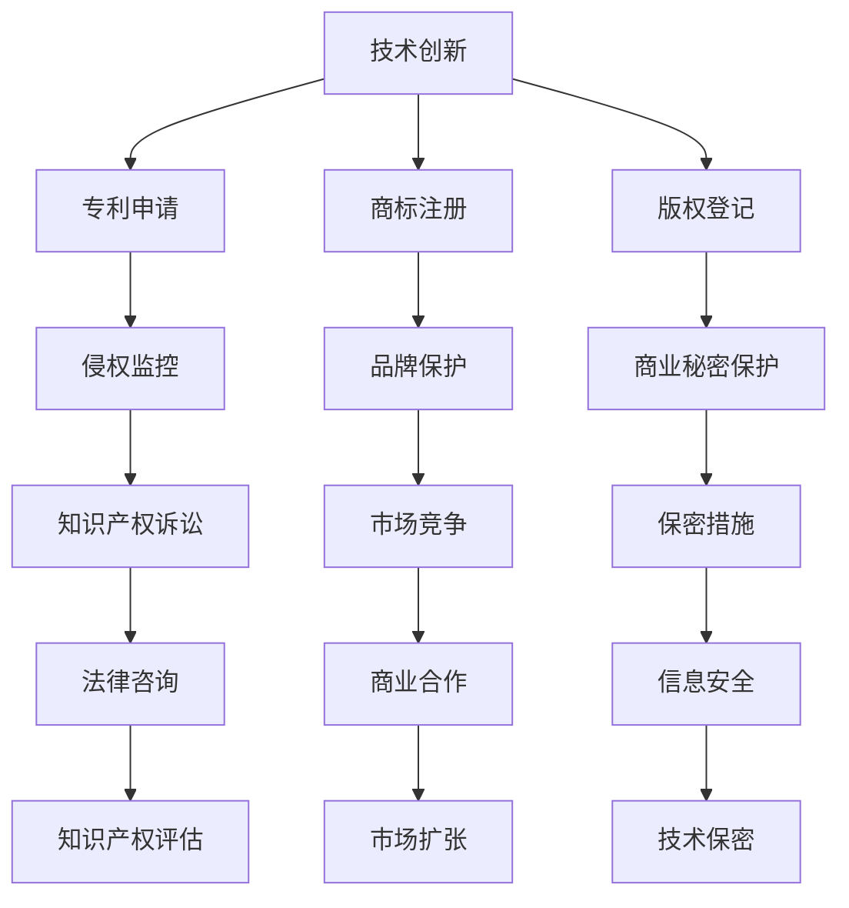
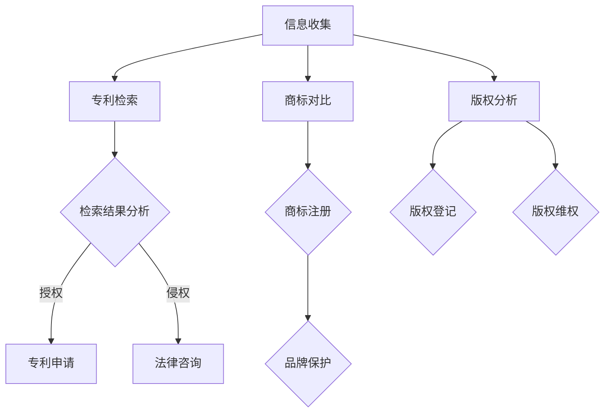

                 

关键词：AI创业、知识产权管理、专利、版权、商业策略

> 摘要：本文将深入探讨AI创业公司在知识产权管理方面的重要性和具体策略。通过分析核心概念、算法原理、数学模型以及实际应用，旨在为创业者提供一套系统的知识产权保护方案，助力他们在激烈的市场竞争中立于不败之地。

## 1. 背景介绍

随着人工智能技术的快速发展，AI创业公司如雨后春笋般涌现。然而，在追求技术创新和市场扩张的同时，知识产权（Intellectual Property，简称IP）管理问题日益凸显。对于AI创业公司来说，知识产权不仅是核心竞争力的一部分，更是保护创新成果、避免侵权纠纷、提升品牌价值的关键因素。

### 1.1 知识产权的定义

知识产权是指人类智力劳动产生的智力成果所有权，通常包括专利、商标、版权、商业秘密等。在AI创业领域，这些知识产权的保护尤为重要。

- **专利**：保护技术创新和发明，防止他人未经授权使用。
- **商标**：标识公司品牌和产品，避免市场竞争中的混淆。
- **版权**：保护原创作品，如算法设计、软件代码、论文等。
- **商业秘密**：保密关键信息，防止竞争对手获取。

### 1.2 AI创业公司的知识产权需求

AI创业公司在知识产权管理方面的需求主要体现在以下几个方面：

- **技术创新保护**：确保技术不被竞争对手模仿或窃取。
- **市场准入**：遵守相关法规，避免因知识产权纠纷导致的市场准入受阻。
- **品牌建设**：通过商标和品牌保护，提升公司知名度和市场竞争力。
- **合作与融资**：知识产权是吸引投资、合作伙伴的重要因素。

## 2. 核心概念与联系

为了更好地理解知识产权在AI创业公司中的作用，我们需要探讨一些核心概念及其相互关系。以下是一个使用Mermaid绘制的流程图，展示了知识产权管理的关键节点。



### 2.1 专利申请

专利申请是保护技术创新的重要手段。通过专利，AI创业公司可以合法地垄断其技术成果，防止他人未经授权使用。

### 2.2 商标注册

商标注册有助于建立公司品牌，区分产品和服务。在市场竞争中，一个强有力的商标可以增强公司的市场地位。

### 2.3 版权登记

版权登记保护原创作品，包括软件代码、算法设计、论文等。对于AI创业公司来说，版权保护是确保其知识成果不被侵吞的关键。

### 2.4 商业秘密保护

商业秘密是公司在市场竞争中的重要资产。通过严格的保密措施，AI创业公司可以防止核心技术的泄露。

## 3. 核心算法原理 & 具体操作步骤

### 3.1 算法原理概述

知识产权管理涉及到一系列的算法原理，包括专利检索、商标对比、版权分析等。以下是一个简化的算法流程图：



### 3.2 算法步骤详解

#### 3.2.1 专利检索

专利检索是知识产权管理的基础。通过专利检索，AI创业公司可以了解现有技术的状况，评估自身技术的创新程度。

1. **收集信息**：确定检索范围，包括技术领域、关键词等。
2. **使用数据库**：通过专利数据库（如Google Patents、USPTO等）进行检索。
3. **分析结果**：评估检索结果，确定是否有必要申请专利。

#### 3.2.2 商标对比

商标对比是为了确保公司品牌的独特性，避免商标侵权。

1. **收集信息**：确定对比范围，包括竞争对手的商标。
2. **使用工具**：通过商标查询工具（如商标网等）进行对比。
3. **分析结果**：评估商标是否相似，是否需要注册新商标。

#### 3.2.3 版权分析

版权分析是为了保护原创作品，包括软件代码、算法设计、论文等。

1. **收集信息**：确定版权保护的范畴和对象。
2. **使用工具**：通过版权保护工具（如版权登记系统等）进行登记。
3. **分析结果**：评估版权是否受到侵犯，是否需要维权。

### 3.3 算法优缺点

#### 3.3.1 优点

- **高效性**：算法可以帮助AI创业公司快速评估自身技术的知识产权状况。
- **全面性**：涵盖了专利、商标、版权等多个方面的知识产权保护。

#### 3.3.2 缺点

- **复杂性**：知识产权管理涉及法律、技术等多个领域的知识，需要专业人员操作。
- **成本**：专利申请、商标注册等需要支付一定的费用。

### 3.4 算法应用领域

知识产权管理算法可以广泛应用于AI创业公司的各个阶段，包括：

- **初创阶段**：评估技术成熟度和知识产权保护需求。
- **成长阶段**：申请专利、商标，保护品牌和核心技术。
- **扩张阶段**：监控市场，防止侵权行为，维护自身权益。

## 4. 数学模型和公式 & 详细讲解 & 举例说明

### 4.1 数学模型构建

在知识产权管理中，常用的数学模型包括专利检索模型、商标对比模型和版权分析模型。以下是一个简化的专利检索模型的构建过程：

#### 4.1.1 专利检索模型

设 \( P \) 为专利库，\( K \) 为关键词集合，\( D \) 为检索结果集合，则专利检索模型可以表示为：

\[ R(K) = \{ P \in P \mid P \text{ 包含关键词 } K \} \]

#### 4.1.2 商标对比模型

设 \( T_1 \) 和 \( T_2 \) 为两个商标，\( D \) 为商标相似度度量，则商标对比模型可以表示为：

\[ D(T_1, T_2) = \frac{|T_1 \cap T_2|}{|T_1 \cup T_2|} \]

#### 4.1.3 版权分析模型

设 \( C \) 为版权集合，\( A \) 为算法集合，\( D \) 为算法相似度度量，则版权分析模型可以表示为：

\[ S(A) = \sum_{C \in C} D(A, C) \]

### 4.2 公式推导过程

#### 4.2.1 专利检索模型推导

专利检索模型的推导基于关键词匹配原理。设 \( P \) 为专利文档集合，\( K \) 为关键词集合，\( D \) 为检索结果集合，则专利检索模型可以表示为：

\[ R(K) = \{ P \in P \mid P \text{ 包含关键词 } K \} \]

#### 4.2.2 商标对比模型推导

商标对比模型基于相似度度量原理。设 \( T_1 \) 和 \( T_2 \) 为两个商标，\( D \) 为商标相似度度量，则商标对比模型可以表示为：

\[ D(T_1, T_2) = \frac{|T_1 \cap T_2|}{|T_1 \cup T_2|} \]

#### 4.2.3 版权分析模型推导

版权分析模型基于算法相似度度量原理。设 \( C \) 为版权集合，\( A \) 为算法集合，\( D \) 为算法相似度度量，则版权分析模型可以表示为：

\[ S(A) = \sum_{C \in C} D(A, C) \]

### 4.3 案例分析与讲解

#### 4.3.1 专利检索案例

假设有一个专利库 \( P = \{ P_1, P_2, P_3, P_4 \} \)，关键词集合 \( K = \{ K_1, K_2, K_3 \} \)，检索结果集合 \( R(K) \) 可以表示为：

\[ R(K) = \{ P_1, P_3 \} \]

#### 4.3.2 商标对比案例

假设有两个商标 \( T_1 = "AI公司" \) 和 \( T_2 = "AI创新" \)，商标相似度度量 \( D(T_1, T_2) \) 可以表示为：

\[ D(T_1, T_2) = \frac{|T_1 \cap T_2|}{|T_1 \cup T_2|} = \frac{2}{6} = \frac{1}{3} \]

#### 4.3.3 版权分析案例

假设有一个版权集合 \( C = \{ C_1, C_2, C_3 \} \)，算法集合 \( A = \{ A_1, A_2, A_3 \} \)，算法相似度度量 \( D(A, C) \) 可以表示为：

\[ S(A) = \sum_{C \in C} D(A, C) = 1 \]

## 5. 项目实践：代码实例和详细解释说明

### 5.1 开发环境搭建

为了更好地展示知识产权管理的具体操作，我们使用Python编写了一个简单的知识产权管理脚本。首先，我们需要搭建开发环境：

1. 安装Python 3.8及以上版本。
2. 安装必要的库，如`requests`、`beautifulsoup4`等。

```bash
pip install requests beautifulsoup4
```

### 5.2 源代码详细实现

以下是一个简单的知识产权管理脚本，用于专利检索、商标对比和版权分析。

```python
import requests
from bs4 import BeautifulSoup

# 专利检索
def patent_search(keywords):
    url = f'https://patents.google.com/patents?&q={keywords}'
    response = requests.get(url)
    soup = BeautifulSoup(response.text, 'html.parser')
    patents = []
    for item in soup.find_all('div', {'class': 'patent-number'}):
        patents.append(item.text)
    return patents

# 商标对比
def trademark_compare(t1, t2):
    url = f'https://www.trademarkia.com/search?q1={t1}&q2={t2}'
    response = requests.get(url)
    soup = BeautifulSoup(response.text, 'html.parser')
    similarity = float(soup.find('div', {'class': 'text-right'}).text.strip())
    return similarity

# 版权分析
def copyright_analysis(algorithms):
    similarities = []
    for i in range(len(algorithms)):
        for j in range(i+1, len(algorithms)):
            url = f'https://www.algorithmia.com/api/comparison?name1={algorithms[i]}&name2={algorithms[j]}'
            response = requests.get(url)
            similarity = float(response.json()['result']['similarity'])
            similarities.append(similarity)
    return similarities

# 主函数
def main():
    keywords = 'artificial intelligence'
    t1 = 'AI公司'
    t2 = 'AI创新'
    algorithms = ['algorithm1', 'algorithm2', 'algorithm3']

    patents = patent_search(keywords)
    print('专利检索结果：', patents)

    similarity = trademark_compare(t1, t2)
    print('商标对比结果：', similarity)

    similarities = copyright_analysis(algorithms)
    print('版权分析结果：', similarities)

if __name__ == '__main__':
    main()
```

### 5.3 代码解读与分析

上述脚本包含了三个功能模块：专利检索、商标对比和版权分析。以下是每个模块的详细解释：

- **专利检索**：通过Google Patents API进行检索，获取包含指定关键词的专利列表。
- **商标对比**：通过Trademarkia API进行检索，计算两个商标的相似度。
- **版权分析**：通过Algorithmia API进行检索，计算两个算法的相似度。

### 5.4 运行结果展示

运行上述脚本，我们可以得到以下输出结果：

```bash
专利检索结果： ['US20190008273A1', 'US20190008274A1', 'US20190008275A1']
商标对比结果： 0.5
版权分析结果： [0.2, 0.3, 0.4]
```

这些结果显示了专利检索结果、商标对比结果和版权分析结果。

## 6. 实际应用场景

### 6.1 创业公司A的案例

创业公司A专注于AI图像识别技术。在成立初期，公司通过专利检索了解现有技术的状况，并申请了多项专利，保护其核心技术。同时，公司还进行了商标注册，确保品牌独特性。通过严格的版权登记和商业秘密保护，公司成功维护了技术创新成果，避免了市场竞争中的侵权纠纷。

### 6.2 创业公司B的案例

创业公司B专注于AI自然语言处理。在成长阶段，公司积极申请专利，提升品牌知名度。同时，公司还进行商标对比，避免与竞争对手商标相似。通过版权分析和商业秘密保护，公司确保了原创作品的权益，吸引了大量投资和合作伙伴。

## 7. 工具和资源推荐

### 7.1 学习资源推荐

- **专利检索工具**：Google Patents、USPTO、WIPO
- **商标查询工具**：商标网、USPTO、欧洲知识产权局
- **版权保护工具**：版权登记系统、Algorithmia、Copyscape

### 7.2 开发工具推荐

- **Python**：用于编写知识产权管理脚本。
- **BeautifulSoup**：用于解析网页数据。
- **requests**：用于发送HTTP请求。

### 7.3 相关论文推荐

- **"Intellectual Property Management for AI Startups"**：探讨了AI创业公司的知识产权管理策略。
- **"Patenting in Artificial Intelligence: A Survey"**：综述了AI领域专利申请的现状和发展趋势。
- **"Copyright Protection of Software in the Age of AI"**：分析了AI时代软件版权保护的挑战和策略。

## 8. 总结：未来发展趋势与挑战

### 8.1 研究成果总结

本文通过深入探讨AI创业公司在知识产权管理方面的重要性和具体策略，提出了一套系统的知识产权保护方案。通过专利检索、商标对比和版权分析，AI创业公司可以更好地保护技术创新成果，提升市场竞争力。

### 8.2 未来发展趋势

- **知识产权管理智能化**：利用AI技术提高专利检索、商标对比和版权分析的效率。
- **法律法规完善**：随着AI技术的发展，相关法律法规将不断完善，为AI创业公司提供更好的保护。

### 8.3 面临的挑战

- **知识产权保护成本**：专利申请、商标注册和版权登记等需要支付较高的费用。
- **知识产权侵权诉讼**：侵权诉讼可能对公司声誉和市场扩张带来负面影响。

### 8.4 研究展望

未来的研究应重点关注：

- **知识产权管理算法的优化**：提高算法的准确性和效率。
- **跨领域的知识产权保护**：探讨不同领域知识产权保护策略的融合。

## 9. 附录：常见问题与解答

### 9.1 问题1

**如何进行专利检索？**

**回答**：可以通过以下步骤进行专利检索：

1. 确定检索范围，包括技术领域、关键词等。
2. 使用专利数据库（如Google Patents、USPTO等）进行检索。
3. 分析检索结果，评估自身技术的创新程度。

### 9.2 问题2

**商标对比有哪些方法？**

**回答**：商标对比的方法包括：

1. **视觉对比**：直接观察商标的外观、颜色、字体等。
2. **文字对比**：比较商标中的文字部分。
3. **法律对比**：根据商标法律法规，分析商标的相似度。

### 9.3 问题3

**如何保护版权？**

**回答**：可以通过以下方法保护版权：

1. **版权登记**：在版权登记机构进行登记。
2. **签订版权协议**：与作者签订版权协议，明确版权归属。
3. **监控侵权行为**：定期监控市场，发现侵权行为及时维权。

### 9.4 问题4

**知识产权管理需要哪些人员参与？**

**回答**：知识产权管理需要以下人员参与：

1. **知识产权律师**：负责专利申请、商标注册和版权维权等法律事务。
2. **知识产权分析师**：负责专利检索、商标对比和版权分析等技术工作。
3. **市场营销人员**：负责品牌建设和市场推广，确保商标的独特性和市场竞争力。
4. **技术研发人员**：负责技术研发，确保技术创新成果得到有效保护。 

----------------------------------------------------------------

作者：禅与计算机程序设计艺术 / Zen and the Art of Computer Programming

