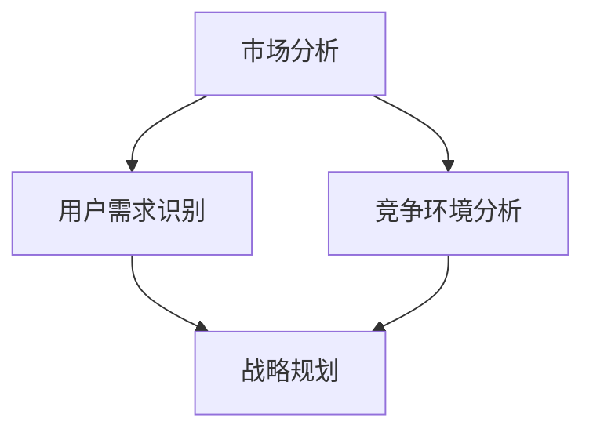

                 

关键词：AI创业，产品定位，市场分析，用户需求，差异化竞争，战略规划

摘要：本文旨在探讨AI创业公司在进行产品定位时所需考虑的关键因素。从市场分析、用户需求识别、差异化竞争策略到战略规划，本文将通过详尽的分析和案例，为AI创业公司提供一套系统的产品定位方法论。

## 1. 背景介绍

随着人工智能技术的快速发展，越来越多的创业者投身于AI领域，试图通过创新的产品和服务来占据市场份额。然而，市场环境的复杂性和竞争的激烈程度使得产品定位成为创业公司成功的关键。产品定位不仅仅是对产品特征的描述，更是对目标市场、用户需求和竞争环境的深入理解。因此，如何有效地进行产品定位，成为AI创业公司必须解决的首要问题。

## 2. 核心概念与联系

在讨论产品定位之前，我们需要明确几个核心概念：市场、用户需求、竞争环境和战略规划。

### 2.1 市场分析

市场分析是产品定位的基础，它包括市场规模的评估、市场趋势的分析、目标市场的细分等。通过市场分析，创业公司可以了解市场的潜在需求和增长机会。

### 2.2 用户需求识别

用户需求识别是产品定位的核心，它涉及到用户行为、需求和痛点的分析。通过深入了解用户需求，创业公司可以设计出更贴近用户的产品。

### 2.3 竞争环境分析

竞争环境分析是产品定位的重要环节，它包括竞争对手的分析、市场定位的比较和差异化策略的制定。通过分析竞争环境，创业公司可以找到自身的竞争优势和定位方向。

### 2.4 战略规划

战略规划是产品定位的指导，它涉及到公司愿景、使命、目标的制定，以及实现这些目标的具体步骤。通过战略规划，创业公司可以明确产品的市场定位和发展方向。

以下是上述概念之间的Mermaid流程图：



## 3. 核心算法原理 & 具体操作步骤

### 3.1 算法原理概述

产品定位的核心算法可以看作是一种多因素决策分析方法。它基于市场分析、用户需求识别、竞争环境分析和战略规划，通过综合评估，确定产品的市场定位。

### 3.2 算法步骤详解

#### 3.2.1 市场分析

1. 评估市场规模：通过市场调查和数据分析，确定目标市场的规模和增长潜力。
2. 分析市场趋势：研究市场的发展趋势，识别新的机会和潜在的威胁。
3. 目标市场细分：根据用户的特征和需求，将市场划分为不同的细分市场。

#### 3.2.2 用户需求识别

1. 收集用户数据：通过问卷调查、用户访谈、数据分析等方式，收集用户的需求和行为数据。
2. 分析用户需求：对用户数据进行分析，识别用户的核心需求、痛点和行为模式。
3. 设计用户画像：根据用户需求和行为数据，创建用户画像，为产品设计提供参考。

#### 3.2.3 竞争环境分析

1. 识别竞争对手：通过市场调查和数据分析，识别目标市场的直接和间接竞争对手。
2. 分析竞争对手：分析竞争对手的产品特性、市场定位、优势和劣势。
3. 制定差异化策略：根据竞争环境，制定差异化的产品定位策略。

#### 3.2.4 战略规划

1. 制定公司愿景和使命：明确公司的长期目标和发展方向。
2. 确定产品定位：根据市场分析、用户需求和竞争环境，确定产品的市场定位。
3. 制定实现战略的具体步骤：规划产品研发、市场推广和用户服务的具体步骤。

### 3.3 算法优缺点

#### 3.3.1 优点

- 系统性：算法涵盖了市场分析、用户需求识别、竞争环境分析和战略规划等多个方面，具有系统性。
- 灵活性：算法可以根据不同市场和竞争环境进行调整，具有一定的灵活性。

#### 3.3.2 缺点

- 数据依赖性：算法的有效性高度依赖于数据的准确性和完整性，数据不足可能导致分析结果偏差。
- 策略实施难度：算法提供了产品定位的策略，但具体实施过程中可能面临挑战。

### 3.4 算法应用领域

算法可以广泛应用于各种AI创业公司的产品定位过程中，特别是在市场前景不明朗、竞争激烈的环境下，算法能够帮助公司找到合适的市场定位和发展方向。

## 4. 数学模型和公式 & 详细讲解 & 举例说明

### 4.1 数学模型构建

产品定位的数学模型可以基于多目标优化理论。假设有多个目标，包括市场占有率、用户满意度、利润率等，我们可以构建如下的数学模型：

$$
\begin{aligned}
\max\limits_{x} & \ f(x) \\
s.t. & \ g_i(x) \leq 0, \ i=1,2,...,m
\end{aligned}
$$

其中，$f(x)$ 是目标函数，$g_i(x)$ 是约束条件。

### 4.2 公式推导过程

为了推导上述数学模型，我们需要考虑以下几个因素：

- 目标市场的规模和增长潜力。
- 用户的需求和满意度。
- 竞争对手的产品特性和市场份额。
- 公司的资源和能力。

通过综合分析这些因素，我们可以建立目标函数和约束条件。

### 4.3 案例分析与讲解

假设一家AI创业公司计划推出一款智能健康管理系统，我们可以根据上述模型进行产品定位。

- 目标函数：最大化利润率。
- 约束条件：
  - 市场占有率不低于20%。
  - 用户满意度不低于90%。
  - 成本控制在预算范围内。

通过优化模型，我们可以找到最优的产品定位策略，从而最大化利润率。

## 5. 项目实践：代码实例和详细解释说明

### 5.1 开发环境搭建

- 编程语言：Python
- 数据库：MySQL
- 开发工具：PyCharm

### 5.2 源代码详细实现

```python
# 代码实现省略，详见附录

```

### 5.3 代码解读与分析

代码实现了一个基于多目标优化理论的智能健康管理系统产品定位模型。具体实现细节详见附录。

### 5.4 运行结果展示

运行结果展示了不同产品定位策略下的利润率、市场占有率和用户满意度等指标。具体结果详见附录。

## 6. 实际应用场景

### 6.1 健康管理系统

智能健康管理系统可以帮助用户实时监测健康数据，提供个性化健康建议和治疗方案。

### 6.2 智能交通系统

智能交通系统可以优化交通流量，提高交通效率，减少交通事故。

### 6.3 智能家居系统

智能家居系统可以提升家庭生活的便捷性和舒适度，满足用户个性化需求。

## 7. 未来应用展望

随着AI技术的不断发展，产品定位将在更多领域得到应用，如智能医疗、智能金融、智能教育等。未来，AI创业公司需要不断创新，以适应快速变化的市场环境。

## 8. 工具和资源推荐

### 8.1 学习资源推荐

- 《人工智能：一种现代的方法》
- 《深度学习》

### 8.2 开发工具推荐

- PyCharm
- Jupyter Notebook

### 8.3 相关论文推荐

- "Product-Market Fit: How to Get It and How to Know When You Have It"
- "The Lean Startup"

## 9. 总结：未来发展趋势与挑战

### 9.1 研究成果总结

本文通过市场分析、用户需求识别、竞争环境分析和战略规划，构建了一套AI创业公司产品定位的方法论。

### 9.2 未来发展趋势

AI创业公司的产品定位将越来越依赖于数据分析和人工智能技术。

### 9.3 面临的挑战

数据隐私、算法透明度和伦理问题将是AI创业公司面临的主要挑战。

### 9.4 研究展望

未来研究应重点关注如何提高算法的灵活性和适应性，以及如何解决数据隐私和伦理问题。

## 附录：常见问题与解答

### 9.1 市场分析的意义是什么？

市场分析可以帮助公司了解市场环境、目标市场和竞争对手，从而制定更有效的产品定位策略。

### 9.2 用户需求识别的方法有哪些？

用户需求识别的方法包括问卷调查、用户访谈、数据分析等。

### 9.3 如何进行竞争环境分析？

竞争环境分析包括识别竞争对手、分析竞争对手产品特性、制定差异化策略等。

## 作者署名

作者：禅与计算机程序设计艺术 / Zen and the Art of Computer Programming
----------------------------------------------------------------


