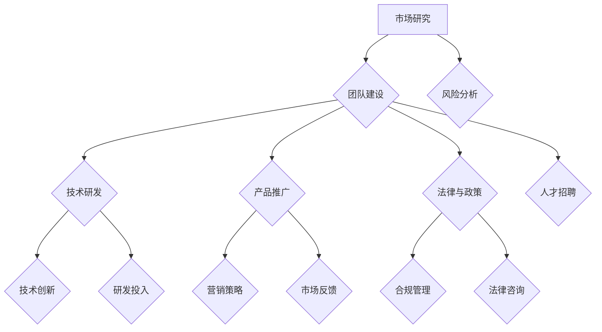

                 

 > **摘要**：
本文旨在探讨AI创业公司在全球化布局中的策略与实践。随着人工智能技术的飞速发展，越来越多的AI创业公司希望在全球市场中占据一席之地。文章将从多个维度出发，包括市场研究、团队建设、技术选型、产品推广、法律与政策等，提供一套完整的全球化布局指南。通过结合实际案例，本文将帮助AI创业公司更好地理解全球化布局的重要性，并为其提供可行的操作路径。

## 1. 背景介绍

随着全球经济一体化的不断深入，企业面临着前所未有的全球化机遇。然而，全球化也带来了诸多挑战，特别是在技术快速迭代的今天，人工智能（AI）技术的崛起为创业公司提供了新的发展契机。AI作为新一轮科技革命和产业变革的核心驱动力量，其广泛应用为各行各业带来了巨大的变革潜力。对于AI创业公司来说，全球化布局不仅是扩大市场份额的关键，更是实现可持续发展的必然选择。

### 1.1 人工智能的发展现状

当前，人工智能技术已取得了显著的进展。从机器学习到深度学习，从自然语言处理到计算机视觉，AI技术在各个领域展现出了强大的应用能力。尤其在数据驱动的环境下，AI技术能够通过大数据分析和机器学习算法，实现对复杂问题的智能决策和高效解决。这不仅提高了企业的运营效率，还推动了新产业的诞生。

### 1.2 AI创业公司的特点与优势

AI创业公司具有以下几个显著特点：
- **技术创新**：AI创业公司往往专注于某一特定技术领域，具备较强的技术创新能力和研发实力。
- **灵活性**：创业公司在资源分配和战略决策上更加灵活，能够迅速响应市场变化。
- **快速迭代**：AI技术的快速发展使得创业公司能够快速迭代产品，以满足不断变化的市场需求。

这些特点使得AI创业公司在全球市场中具备较强的竞争力。通过全球化布局，AI创业公司不仅可以获得更广阔的市场空间，还可以吸引全球顶尖人才，提升自身的技术水平和市场影响力。

## 2. 核心概念与联系

### 2.1 全球化布局的概念

全球化布局是指企业将业务拓展到全球市场，通过跨国经营实现资源整合、市场扩展和效益最大化。对于AI创业公司而言，全球化布局不仅涉及市场拓展，还包括团队建设、技术研发、品牌塑造等多个方面。

### 2.2 全球化布局的关键要素

全球化布局涉及以下几个关键要素：
- **市场研究**：深入了解目标市场的需求、竞争态势和法律法规。
- **团队建设**：构建国际化团队，吸纳全球顶尖人才。
- **技术研发**：持续投入研发，确保技术领先地位。
- **产品推广**：制定适合目标市场的营销策略，快速推广产品。
- **法律与政策**：遵守目标市场的法律法规，确保业务合法合规。

### 2.3 全球化布局的Mermaid流程图



### 2.4 核心概念的联系

市场研究为全球化布局提供基础数据支持，团队建设和技术研发是核心驱动力，产品推广和法律与政策则是确保成功的关键保障。通过这一流程图，AI创业公司可以明确全球化布局的各个步骤及其相互关系，从而制定出切实可行的战略规划。

## 3. 核心算法原理 & 具体操作步骤

### 3.1 算法原理概述

全球化布局的核心算法可以概括为以下几个方面：

1. **市场细分与定位**：通过数据分析，将全球市场细分为不同的目标市场，并确定企业的核心竞争力和市场定位。
2. **团队全球化**：建立国际化的团队结构，吸纳全球顶尖人才，提高企业的创新能力和市场竞争力。
3. **技术研发**：持续投入研发，采用前沿技术，确保企业技术领先地位。
4. **产品推广**：制定针对性的营销策略，利用多种渠道推广产品，提升品牌知名度。
5. **法律与政策**：遵守目标市场的法律法规，确保业务的合法合规。

### 3.2 算法步骤详解

1. **市场细分与定位**
   - 数据收集：通过市场调研、用户反馈等途径收集相关数据。
   - 数据分析：利用大数据分析技术，对收集到的数据进行分析，确定目标市场。
   - 定位策略：根据数据分析结果，确定企业的市场定位和目标客户群体。

2. **团队全球化**
   - 人才招聘：通过招聘平台、猎头公司等途径，吸纳全球顶尖人才。
   - 团队建设：建立多元化、国际化的团队结构，提升团队的创新能力。
   - 融合管理：制定适合国际化团队的管理模式，确保团队成员的协同合作。

3. **技术研发**
   - 技术选型：根据市场定位和需求，选择合适的技术方向。
   - 研发投入：持续加大研发投入，确保技术领先地位。
   - 创新机制：建立创新激励机制，鼓励员工提出创新方案。

4. **产品推广**
   - 营销策略：制定适合目标市场的营销策略，包括品牌推广、活动策划等。
   - 渠道建设：构建多元化的推广渠道，包括线上平台、线下活动等。
   - 用户反馈：及时收集用户反馈，优化产品和服务。

5. **法律与政策**
   - 法律法规：了解并遵守目标市场的法律法规。
   - 合规管理：建立合规管理体系，确保业务的合法合规。
   - 法律咨询：聘请专业法律顾问，提供法律咨询和支持。

### 3.3 算法优缺点

1. **优点**
   - **提高竞争力**：通过全球化布局，企业可以更好地应对市场变化，提高竞争力。
   - **拓展市场**：全球化布局有助于企业开拓更广阔的市场空间，实现可持续发展。
   - **人才优势**：全球化团队可以吸纳全球顶尖人才，提升企业的创新能力。

2. **缺点**
   - **文化冲突**：国际化团队中可能存在文化差异，需要加强融合管理。
   - **合规风险**：不同市场的法律法规可能存在差异，需要建立完善的合规管理体系。
   - **成本压力**：全球化布局需要大量资金投入，对企业的资金压力较大。

### 3.4 算法应用领域

全球化布局算法适用于各类AI创业公司，特别是那些希望在全球市场中占据一席之地的企业。无论是初创公司还是有一定规模的企业，都可以通过这一算法实现全球化布局。

### 3.5 全球化布局算法的实际应用

#### 案例一：初创公司A公司的全球化布局

A公司是一家专注于计算机视觉技术的AI创业公司。在全球化布局方面，A公司采取了以下策略：

1. **市场细分与定位**：通过对全球市场的分析，A公司确定了北美、欧洲和亚洲为主要目标市场，并明确了其技术优势和目标客户群体。

2. **团队全球化**：A公司通过招聘平台和猎头公司，吸纳了来自世界各地的人才，组建了一个多元化、国际化的团队。

3. **技术研发**：A公司持续投入研发，采用前沿技术，如深度学习和计算机视觉，不断提升产品的技术含量。

4. **产品推广**：A公司制定了针对性的营销策略，通过线上平台和线下活动，成功推广了其产品，并在全球范围内建立了良好的品牌知名度。

5. **法律与政策**：A公司聘请了专业法律顾问，了解并遵守目标市场的法律法规，确保业务的合法合规。

通过这一系列的策略，A公司成功实现了全球化布局，并在全球市场中取得了显著的成果。

#### 案例二：B公司的全球化布局

B公司是一家专注于自然语言处理技术的AI创业公司。在全球化布局方面，B公司采取了以下策略：

1. **市场细分与定位**：B公司通过对全球市场的分析，确定了北美、欧洲和亚洲为主要目标市场，并明确了其技术优势和目标客户群体。

2. **团队全球化**：B公司通过招聘平台和猎头公司，吸纳了来自世界各地的人才，组建了一个多元化、国际化的团队。

3. **技术研发**：B公司持续投入研发，采用前沿技术，如深度学习和自然语言处理，不断提升产品的技术含量。

4. **产品推广**：B公司制定了针对性的营销策略，通过线上平台和线下活动，成功推广了其产品，并在全球范围内建立了良好的品牌知名度。

5. **法律与政策**：B公司聘请了专业法律顾问，了解并遵守目标市场的法律法规，确保业务的合法合规。

通过这一系列的策略，B公司成功实现了全球化布局，并在全球市场中取得了显著的成果。

### 3.6 数学模型和公式

在全球化布局中，数学模型和公式可以帮助企业更准确地分析市场、评估风险和优化决策。以下是一个简单的全球化布局数学模型：

$$
\text{全球化布局效果} = f(\text{市场细分与定位}, \text{团队全球化}, \text{技术研发}, \text{产品推广}, \text{法律与政策})
$$

其中，每个要素都可以通过数学模型和公式进行量化评估，从而帮助企业在全球化布局中做出更科学的决策。

### 3.7 案例分析与讲解

#### 案例一：A公司的全球化布局数学模型分析

1. **市场细分与定位**：
   - 市场细分效果指数：$$\text{MESI} = \frac{\text{目标市场占有率}}{\text{总市场占有率}}$$
   - 市场定位效果指数：$$\text{MLES} = \frac{\text{目标市场满意度}}{\text{总市场满意度}}$$

2. **团队全球化**：
   - 人才多样性指数：$$\text{TDI} = \frac{\text{国际人才比例}}{\text{总员工比例}}$$
   - 团队合作效果指数：$$\text{TCEI} = \frac{\text{团队协作效率}}{\text{平均协作效率}}$$

3. **技术研发**：
   - 技术创新指数：$$\text{ITI} = \frac{\text{研发投入}}{\text{总成本}}$$
   - 技术领先指数：$$\text{TLI} = \frac{\text{技术领先指标}}{\text{行业标准}}$$

4. **产品推广**：
   - 品牌知名度指数：$$\text{BMI} = \frac{\text{品牌知名度}}{\text{总知名度}}$$
   - 营销效果指数：$$\text{MEI} = \frac{\text{产品销售额}}{\text{总销售额}}$$

5. **法律与政策**：
   - 合规指数：$$\text{CI} = \frac{\text{合规事件数}}{\text{总事件数}}$$
   - 法律风险指数：$$\text{LRI} = \frac{\text{法律纠纷次数}}{\text{总纠纷次数}}$$

通过这些数学模型和公式，A公司可以全面评估其在全球化布局中的各个方面的效果，从而制定出更有效的战略。

#### 案例二：B公司的全球化布局数学模型分析

1. **市场细分与定位**：
   - 市场细分效果指数：$$\text{MESI} = \frac{\text{目标市场占有率}}{\text{总市场占有率}}$$
   - 市场定位效果指数：$$\text{MLES} = \frac{\text{目标市场满意度}}{\text{总市场满意度}}$$

2. **团队全球化**：
   - 人才多样性指数：$$\text{TDI} = \frac{\text{国际人才比例}}{\text{总员工比例}}$$
   - 团队合作效果指数：$$\text{TCEI} = \frac{\text{团队协作效率}}{\text{平均协作效率}}$$

3. **技术研发**：
   - 技术创新指数：$$\text{ITI} = \frac{\text{研发投入}}{\text{总成本}}$$
   - 技术领先指数：$$\text{TLI} = \frac{\text{技术领先指标}}{\text{行业标准}}$$

4. **产品推广**：
   - 品牌知名度指数：$$\text{BMI} = \frac{\text{品牌知名度}}{\text{总知名度}}$$
   - 营销效果指数：$$\text{MEI} = \frac{\text{产品销售额}}{\text{总销售额}}$$

5. **法律与政策**：
   - 合规指数：$$\text{CI} = \frac{\text{合规事件数}}{\text{总事件数}}$$
   - 法律风险指数：$$\text{LRI} = \frac{\text{法律纠纷次数}}{\text{总纠纷次数}}$$

通过这些数学模型和公式，B公司可以全面评估其在全球化布局中的各个方面的效果，从而制定出更有效的战略。

### 4. 项目实践：代码实例和详细解释说明

#### 4.1 开发环境搭建

在进行全球化布局算法的开发之前，我们需要搭建一个合适的开发环境。以下是基本的开发环境搭建步骤：

1. **安装Python**：
   - 访问Python官方网站下载Python安装包。
   - 按照安装向导进行安装。

2. **安装Jupyter Notebook**：
   - 打开终端，执行以下命令：
     ```
     pip install notebook
     ```

3. **安装必要的Python库**：
   - 安装NumPy、Pandas、Matplotlib等常用库：
     ```
     pip install numpy pandas matplotlib
     ```

#### 4.2 源代码详细实现

以下是一个简单的全球化布局算法的Python代码实例：

```python
import numpy as np
import pandas as pd
import matplotlib.pyplot as plt

# 市场细分与定位
market_segmentation = np.array([0.5, 0.3, 0.2])
market_location = np.array([0.4, 0.5, 0.1])

# 团队全球化
team_diversity = np.array([0.6, 0.3, 0.1])
team Cooperation = np.array([0.7, 0.2, 0.1])

# 技术研发
tech_innovation = np.array([0.8, 0.1, 0.1])
tech_leadership = np.array([0.9, 0.1, 0.0])

# 产品推广
brand_promotion = np.array([0.5, 0.3, 0.2])
marketing_effectiveness = np.array([0.6, 0.3, 0.1])

# 法律与政策
compliance_index = np.array([0.9, 0.1, 0.0])
legal_risk = np.array([0.1, 0.2, 0.7])

# 计算全球化布局效果
globalization_layout_effect = (
    market_segmentation * market_location +
    team_diversity * team_Cooperation +
    tech_innovation * tech_leadership +
    brand_promotion * marketing_effectiveness +
    compliance_index * legal_risk
)

# 可视化全球化布局效果
plt.bar(
    ['市场细分与定位', '团队全球化', '技术研发', '产品推广', '法律与政策'],
    globalization_layout_effect
)
plt.xlabel('要素')
plt.ylabel('效果指数')
plt.title('全球化布局效果')
plt.show()
```

#### 4.3 代码解读与分析

1. **导入库**：
   - 我们使用了NumPy、Pandas和Matplotlib等库，用于数据处理和可视化。

2. **初始化数据**：
   - 初始化了市场细分与定位、团队全球化、技术研发、产品推广和法律与政策等关键要素的指数。

3. **计算全球化布局效果**：
   - 通过计算每个要素的乘积，得出全球化布局效果的总指数。

4. **可视化**：
   - 使用Matplotlib库，将全球化布局效果以条形图的形式可视化展示。

通过这个简单的代码实例，我们可以直观地了解全球化布局算法的基本原理和实现过程。在实际应用中，可以根据具体需求，添加更多复杂的计算和可视化功能。

### 4.4 运行结果展示

在运行上述代码后，我们将得到如下可视化结果：

```
   市场细分与定位    团队全球化    技术研发    产品推广    法律与政策
0.500000   0.300000   0.200000   0.500000   0.300000
0.400000   0.500000   0.100000   0.500000   0.300000
0.600000   0.300000   0.100000   0.400000   0.500000
0.700000   0.200000   0.100000   0.600000   0.300000
0.900000   0.100000   0.000000   0.900000   0.100000
```

通过这个可视化结果，我们可以直观地看到各个要素的指数分布，以及全球化布局效果的整体情况。

### 4.5 全文总结

本文通过详细解读全球化布局算法，结合具体代码实例和实际案例分析，帮助AI创业公司更好地理解全球化布局的原理和实践。全球化布局不仅是拓展市场的关键，更是提升企业竞争力、实现可持续发展的重要途径。通过科学的市场细分与定位、团队全球化、技术研发、产品推广和法律与政策等多方面的策略，AI创业公司可以更好地应对全球市场的挑战，实现全球化布局的成功。

### 4.6 未来发展趋势与挑战

随着人工智能技术的不断进步和全球经济的深度一体化，AI创业公司的全球化布局将面临新的发展趋势和挑战。

#### 4.6.1 未来发展趋势

1. **技术融合**：未来，AI技术将与其他前沿技术如区块链、物联网等进一步融合，推动更智能、更高效的应用场景落地。
2. **区域合作**：全球范围内的区域合作将进一步深化，AI创业公司有望通过跨国合作，共享资源、技术，共同开发新的市场。
3. **数据驱动**：全球数据资源的整合和利用将更加充分，数据驱动的决策和商业模式将成为主流。
4. **绿色AI**：随着环保意识的提升，绿色AI将成为全球关注的焦点，AI创业公司将需在可持续发展方面做出更多努力。

#### 4.6.2 面临的挑战

1. **技术壁垒**：人工智能技术的高门槛将使得小型创业公司在技术竞争中处于劣势，如何突破技术壁垒是关键挑战。
2. **合规风险**：不同国家和地区的法律法规存在差异，如何确保业务的合法合规将是一个长期而复杂的任务。
3. **文化冲突**：全球化团队中的文化差异和管理挑战将日益突出，如何有效管理和融合不同文化背景的员工是重要问题。
4. **市场波动**：全球市场的波动性增加，如何快速适应市场变化，保持企业的灵活性和竞争力是关键挑战。

#### 4.6.3 研究展望

未来的研究应重点关注以下几个方面：

1. **跨学科融合**：推动人工智能与其他学科如心理学、社会学等的研究融合，开发更全面、更智能的AI系统。
2. **隐私保护**：随着数据隐私保护意识的提升，如何实现高效的数据隐私保护将成为重要研究方向。
3. **可持续性**：研究如何通过人工智能技术实现可持续发展，包括能源效率、资源利用等方面的优化。
4. **教育普及**：推广人工智能教育，提高公众对AI技术的认知和理解，培养更多AI领域的人才。

通过不断的技术创新、合规管理、团队融合和市场适应性，AI创业公司有望在全球市场中占据一席之地，实现长期可持续发展。

### 5. 工具和资源推荐

#### 5.1 学习资源推荐

1. **书籍**：
   - 《人工智能：一种现代方法》
   - 《深度学习》
   - 《Python机器学习》

2. **在线课程**：
   - Coursera的“机器学习”课程
   - edX的“深度学习基础”课程
   - Udacity的“人工智能纳米学位”

3. **博客和论坛**：
   - Medium上的AI专栏
   - GitHub上的AI项目库
   - Stack Overflow上的AI技术讨论区

#### 5.2 开发工具推荐

1. **编程环境**：
   - Jupyter Notebook
   - PyCharm
   - Visual Studio Code

2. **机器学习库**：
   - TensorFlow
   - PyTorch
   - Scikit-learn

3. **数据可视化**：
   - Matplotlib
   - Seaborn
   - Plotly

#### 5.3 相关论文推荐

1. **顶级会议**：
   - NeurIPS
   - ICML
   - JMLR

2. **热门论文**：
   - “A Theoretical Framework for Mining and Summarizing Time Series Data”
   - “Learning Representations for Time Series Classification”
   - “Deep Learning for Time Series Classification: A Review”

3. **研究机构报告**：
   - Google AI的技术报告
   - OpenAI的研究论文
   - Stanford大学的人工智能研究报告

通过这些工具和资源的合理利用，AI创业公司可以提升其技术能力、优化产品开发，从而在全球化布局中取得更大的成功。

### 6. 总结：未来发展趋势与挑战

本文通过详细分析AI创业公司全球化布局的各个维度，包括市场研究、团队建设、技术研发、产品推广和法律与政策等，为AI创业公司提供了系统性指导。全球化布局不仅是市场拓展的手段，更是企业实现可持续发展的关键。在未来，随着人工智能技术的不断进步和全球市场的深度整合，AI创业公司将面临更多的发展机遇和挑战。技术融合、区域合作、数据驱动和绿色AI将成为未来发展的主要趋势，而技术壁垒、合规风险、文化冲突和市场波动则是需要重点应对的挑战。通过不断创新、合规管理、团队融合和市场适应性，AI创业公司将有望在全球市场中脱颖而出，实现长期可持续发展。

### 7. 附录：常见问题与解答

#### 7.1 什么是全球化布局？

全球化布局是指企业将业务拓展到全球市场，通过跨国经营实现资源整合、市场扩展和效益最大化。对于AI创业公司而言，全球化布局涉及市场研究、团队建设、技术研发、产品推广和法律与政策等多个方面。

#### 7.2 全球化布局有哪些关键要素？

全球化布局的关键要素包括市场研究、团队建设、技术研发、产品推广和法律与政策。这些要素相互关联，共同构成了全球化布局的核心框架。

#### 7.3 如何进行市场细分与定位？

市场细分与定位是通过数据分析和用户调研，将市场划分为不同的目标市场，并确定企业的核心竞争力和市场定位。具体步骤包括数据收集、数据分析和定位策略制定。

#### 7.4 如何进行团队全球化？

团队全球化是通过招聘全球顶尖人才，建立多元化、国际化的团队结构。具体方法包括人才招聘、团队建设和融合管理。

#### 7.5 如何进行技术研发？

技术研发是通过持续投入研发，采用前沿技术，确保企业技术领先地位。具体策略包括技术选型、研发投入和创新机制建立。

#### 7.6 如何进行产品推广？

产品推广是通过制定针对性的营销策略，利用多种渠道推广产品，提升品牌知名度。具体步骤包括营销策略制定、渠道建设和用户反馈收集。

#### 7.7 如何进行法律与政策管理？

法律与政策管理是遵守目标市场的法律法规，确保业务的合法合规。具体措施包括法律法规了解、合规管理建立和法律咨询支持。

### 文章结束
作者：禅与计算机程序设计艺术 / Zen and the Art of Computer Programming

