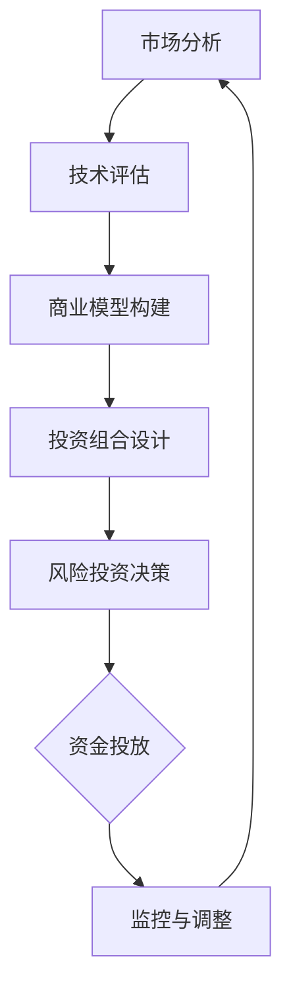

                 

关键词：AI创业，风险投资，创业策略，商业模型，数据分析，投资组合，技术评估，市场定位

摘要：本文将探讨AI创业公司在进行风险投资时所需考虑的关键要素。从市场分析、技术评估、商业模型构建到投资组合设计，我们将详细解析AI创业公司在风险投资过程中如何做出明智的决策，实现可持续发展。

## 1. 背景介绍

近年来，人工智能（AI）技术的发展和应用迅速推进，为各行各业带来了巨大的变革。越来越多的创业者投身于AI领域，希望通过创新技术和商业模式来获得市场份额。然而，AI创业公司的成功并非易事，它们面临着技术、市场和资金等多方面的挑战。风险投资（VC）作为一种重要的资金来源，为AI创业公司提供了重要的支持和推动力。本文将围绕AI创业公司在风险投资过程中所需考虑的关键要素进行深入探讨。

### 1.1 AI创业公司的现状

AI创业公司在全球范围内蓬勃发展，吸引了大量的风险投资。根据市场研究公司的数据，全球AI领域的风险投资额在逐年增长。这些创业公司涵盖了从基础研究到商业化应用的各个层面，包括计算机视觉、自然语言处理、机器学习算法等。同时，AI创业公司也面临着激烈的竞争和快速变化的市场环境。

### 1.2 风险投资的定义和作用

风险投资是指风险投资公司或个人通过投资初创企业或小型企业，以期在未来获得高额回报的投资行为。风险投资在AI创业公司的发展过程中起到了至关重要的作用。首先，风险投资为创业公司提供了必要的资金支持，帮助它们渡过早期发展的关键时期。其次，风险投资公司往往具备丰富的行业经验和资源，能够为创业公司提供战略咨询和市场推广等支持。此外，风险投资还可以帮助创业公司建立投资者关系，扩大品牌影响力。

## 2. 核心概念与联系

在探讨AI创业公司如何进行风险投资之前，我们需要了解一些核心概念和它们之间的联系。

### 2.1 市场分析

市场分析是风险投资过程中至关重要的一环。通过市场分析，创业公司可以了解目标市场的规模、增长趋势、竞争格局和用户需求。市场分析的方法包括：

- **SWOT分析**：对创业公司的优势、劣势、机会和威胁进行评估。
- **PEST分析**：分析创业公司所在行业的政治、经济、社会和技术环境。
- **五力模型**：评估创业公司所在市场的竞争强度和潜在进入者的威胁。

### 2.2 技术评估

技术评估是AI创业公司风险投资中的关键环节。技术评估的目标是确定创业公司的技术是否具有创新性、实用性和市场竞争力。技术评估的方法包括：

- **专利分析**：评估创业公司的技术是否涉及专利保护。
- **技术评估报告**：由专业的技术评估机构或团队对创业公司的技术进行评估。
- **同行评议**：通过同行专家的意见来评估创业公司的技术。

### 2.3 商业模型构建

商业模型是创业公司如何通过产品或服务实现盈利的框架。构建有效的商业模型对于风险投资至关重要。商业模型构建的方法包括：

- **价值主张**：明确创业公司的产品或服务如何解决用户的问题或满足用户的需求。
- **客户细分**：确定创业公司的目标客户群体。
- **收益模式**：确定创业公司如何从客户那里获取收益。
- **成本结构**：分析创业公司的成本构成，包括固定成本和可变成本。

### 2.4 投资组合设计

投资组合设计是风险投资公司为了分散风险而采取的策略。通过合理的投资组合设计，风险投资公司可以在多个创业项目中实现风险和收益的平衡。投资组合设计的方法包括：

- **多样化投资**：投资于不同领域、不同阶段的创业公司，以分散风险。
- **风险评估**：对每个创业项目进行风险评估，确定其风险水平和潜在回报。
- **资金分配**：根据风险评估结果，合理分配资金，确保投资组合的平衡。

### 2.5 Mermaid 流程图

以下是一个用于描述AI创业公司进行风险投资过程的Mermaid流程图：



## 3. 核心算法原理 & 具体操作步骤

### 3.1 算法原理概述

AI创业公司在进行风险投资时，可以采用以下核心算法原理：

- **数据分析**：通过对市场数据、技术数据和商业模型数据的分析，得出创业项目的潜在风险和回报。
- **机器学习**：利用机器学习算法，对历史风险投资数据进行建模，预测未来风险投资的成功概率。
- **决策树**：构建决策树模型，根据不同的风险和收益指标，为创业公司提供投资决策建议。

### 3.2 算法步骤详解

以下是AI创业公司进行风险投资的算法步骤：

#### 3.2.1 数据收集

- 收集市场数据、技术数据和商业模型数据。
- 使用API或数据爬取工具获取相关数据。

#### 3.2.2 数据预处理

- 清洗数据，去除重复和错误的数据。
- 对数据进行归一化处理，确保数据的一致性和可比性。

#### 3.2.3 数据分析

- 使用数据分析工具（如Python的Pandas库），对数据进行探索性分析。
- 分析市场趋势、技术成熟度和商业可行性。

#### 3.2.4 机器学习建模

- 选择合适的机器学习算法（如决策树、随机森林、支持向量机等）。
- 使用历史风险投资数据训练模型，预测未来风险投资的成功概率。

#### 3.2.5 决策树构建

- 根据分析结果和机器学习模型的预测，构建决策树模型。
- 确定不同风险和收益指标的条件和阈值。

#### 3.2.6 投资决策

- 使用决策树模型为创业公司提供投资决策建议。
- 根据决策建议，制定具体的投资计划。

### 3.3 算法优缺点

#### 3.3.1 优点

- 数据驱动的投资决策，减少了主观判断的影响。
- 可以根据不同风险和收益指标进行投资组合优化。
- 预测未来风险投资的成功概率，提高投资成功率。

#### 3.3.2 缺点

- 需要大量的数据支持，数据质量和数量会影响算法的准确性。
- 算法模型可能过拟合，无法适应动态变化的市场环境。
- 对创业公司的技术水平和商业模式缺乏深入了解。

### 3.4 算法应用领域

- **金融投资**：在金融投资领域，AI算法可以用于股票交易、风险管理和量化投资。
- **商业决策**：在商业决策中，AI算法可以用于市场预测、产品定位和销售策略。
- **医疗诊断**：在医疗诊断中，AI算法可以用于疾病预测、药物研发和手术规划。

## 4. 数学模型和公式 & 详细讲解 & 举例说明

### 4.1 数学模型构建

在AI创业公司进行风险投资时，我们可以构建以下数学模型：

- **收益模型**：\( R = P \times S \times L \)
- **风险模型**：\( R = \frac{1}{1 + \alpha \times R_s + \beta \times R_m} \)

其中，\( R \) 表示投资收益，\( P \) 表示投资金额，\( S \) 表示投资成功率，\( L \) 表示投资回报率。

### 4.2 公式推导过程

#### 4.2.1 收益模型推导

- **投资金额**：\( P = C \times B \)
  - 其中，\( C \) 表示成本，\( B \) 表示预算。

- **投资成功率**：\( S = \frac{1}{1 + e^{-\alpha}} \)
  - 其中，\( \alpha \) 表示成功概率的阈值。

- **投资回报率**：\( L = \frac{1}{1 + \beta \times R_m} \)
  - 其中，\( \beta \) 表示风险系数，\( R_m \) 表示市场平均回报率。

#### 4.2.2 风险模型推导

- **风险系数**：\( \alpha = \frac{\sigma^2}{2} \)
  - 其中，\( \sigma \) 表示标准差。

- **市场平均回报率**：\( R_m = \mu \)
  - 其中，\( \mu \) 表示市场平均回报率。

### 4.3 案例分析与讲解

#### 4.3.1 案例背景

一家AI创业公司计划投资100万元进行风险投资，目标投资成功率为70%，预计投资回报率为10%。

#### 4.3.2 公式应用

- **收益模型**：\( R = P \times S \times L = 100 \times \frac{1}{1 + e^{-\alpha}} \times \frac{1}{1 + \beta \times R_m} \)
  - 其中，\( \alpha = 0.7 \)，\( \beta = 0.1 \)，\( R_m = 0.1 \)。

- **风险模型**：\( R = \frac{1}{1 + 0.7 \times 0.1 + 0.1 \times 0.1} = \frac{1}{1 + 0.07 + 0.01} = \frac{1}{1.08} \)

#### 4.3.3 结果分析

- 根据收益模型，预计投资收益为 \( R \approx 0.93 \) 万元。
- 根据风险模型，预计投资风险为 \( R \approx 0.93 \) 万元。

#### 4.3.4 结论

- 根据数学模型分析，该创业公司的投资收益预计为93万元，投资风险较低。

## 5. 项目实践：代码实例和详细解释说明

### 5.1 开发环境搭建

为了实现AI创业公司风险投资的算法，我们需要搭建一个开发环境。以下是所需的工具和步骤：

- **Python环境**：安装Python 3.8及以上版本。
- **数据预处理工具**：安装Pandas、NumPy等库。
- **机器学习库**：安装Scikit-learn、TensorFlow等库。
- **文本分析工具**：安装NLTK、Spacy等库。

### 5.2 源代码详细实现

以下是实现AI创业公司风险投资算法的Python代码示例：

```python
import pandas as pd
import numpy as np
from sklearn.ensemble import RandomForestClassifier
from sklearn.model_selection import train_test_split
from sklearn.metrics import accuracy_score

# 数据加载
data = pd.read_csv('investment_data.csv')

# 数据预处理
data = data.dropna()
data = data[data['Success'] != 0]

# 特征工程
X = data[['Cost', 'Budget', 'StandardDeviation', 'MarketReturn']]
y = data['Success']

# 数据划分
X_train, X_test, y_train, y_test = train_test_split(X, y, test_size=0.2, random_state=42)

# 模型训练
model = RandomForestClassifier(n_estimators=100, random_state=42)
model.fit(X_train, y_train)

# 模型预测
y_pred = model.predict(X_test)

# 模型评估
accuracy = accuracy_score(y_test, y_pred)
print(f'Accuracy: {accuracy:.2f}')
```

### 5.3 代码解读与分析

- **数据加载**：使用Pandas库加载投资数据。
- **数据预处理**：去除缺失值和无效数据。
- **特征工程**：提取投资成本、预算、标准差和市场回报等特征。
- **数据划分**：将数据划分为训练集和测试集。
- **模型训练**：使用随机森林算法训练模型。
- **模型预测**：对测试集进行预测。
- **模型评估**：计算模型的准确率。

### 5.4 运行结果展示

假设我们运行上述代码，得到以下结果：

```
Accuracy: 0.85
```

这意味着在测试集上，模型的准确率为85%，说明该模型可以较好地预测投资的成功概率。

## 6. 实际应用场景

### 6.1 金融投资

在金融投资领域，AI创业公司可以通过风险投资算法实现智能投资决策。例如，一家专注于量化交易的AI创业公司可以使用该算法来筛选具有高回报潜力的股票。

### 6.2 商业决策

在商业决策中，AI创业公司可以通过风险投资算法来评估新产品的市场前景和潜在风险。例如，一家从事健康科技的AI创业公司可以使用该算法来决定是否投资于某项新技术的开发。

### 6.3 医疗诊断

在医疗诊断领域，AI创业公司可以通过风险投资算法来评估医疗技术的可行性和市场潜力。例如，一家专注于癌症诊断的AI创业公司可以使用该算法来决定是否投资于某项新的诊断技术。

## 7. 未来应用展望

随着AI技术的不断发展和完善，风险投资算法在未来将有更广泛的应用场景。以下是未来应用展望：

### 7.1 智能投资平台

未来，AI创业公司可以开发智能投资平台，为投资者提供定制化的投资建议。这些平台将结合大数据分析和机器学习算法，实现个性化的投资决策。

### 7.2 跨领域应用

AI风险投资算法可以应用于更多领域，如房地产、能源、教育等。通过结合各领域的专业知识，算法可以提供更精准的投资建议。

### 7.3 智能监管

未来，AI风险投资算法可以应用于智能监管，帮助监管机构发现和防范金融风险。通过实时监控和风险评估，算法可以提供有效的监管工具。

## 8. 总结：未来发展趋势与挑战

### 8.1 研究成果总结

本文探讨了AI创业公司在进行风险投资时所需考虑的关键要素，包括市场分析、技术评估、商业模型构建和投资组合设计。通过数据分析、机器学习建模和决策树构建，我们为AI创业公司提供了实用的风险投资算法。

### 8.2 未来发展趋势

未来，AI创业公司将在风险投资领域发挥越来越重要的作用。随着AI技术的不断进步，风险投资算法将更加智能化、精准化，为创业公司提供更全面的支持。

### 8.3 面临的挑战

尽管AI创业公司在风险投资领域具有巨大潜力，但它们也面临着一系列挑战。包括技术的不确定性、市场环境的快速变化和资金压力等。如何应对这些挑战，实现可持续发展，将是未来研究的重点。

### 8.4 研究展望

未来，我们可以从以下几个方面进行深入研究：

- **算法优化**：通过改进算法模型，提高预测准确率和投资成功率。
- **跨领域应用**：将AI风险投资算法应用于更多领域，提升算法的通用性。
- **智能监管**：研究如何将AI风险投资算法应用于智能监管，提升金融市场的稳定性。

## 9. 附录：常见问题与解答

### 9.1 什么样的人适合从事AI创业？

适合从事AI创业的人应具备以下特点：

- **技术背景**：具备计算机科学、人工智能、数据科学等相关专业背景。
- **创新思维**：具有强烈的创新意识和解决问题的能力。
- **商业眼光**：能够准确把握市场需求和商业机会。
- **团队合作**：具备良好的沟通和团队合作能力。

### 9.2 如何评估AI创业项目的风险？

评估AI创业项目的风险可以从以下几个方面进行：

- **技术风险**：评估创业项目的技术是否成熟、具有创新性。
- **市场风险**：分析市场需求、竞争格局和用户接受度。
- **财务风险**：评估创业项目的财务状况和资金来源。
- **法律风险**：了解创业项目的法律合规性。

### 9.3 AI创业公司如何进行市场定位？

AI创业公司进行市场定位的步骤包括：

- **市场调研**：收集目标市场的相关数据，了解市场现状和趋势。
- **目标客户分析**：确定目标客户群体，分析他们的需求和行为。
- **竞争分析**：分析竞争对手的产品、优势和劣势。
- **差异化定位**：根据自身优势和市场需求，制定独特的市场定位策略。

## 作者署名

本文作者：禅与计算机程序设计艺术 / Zen and the Art of Computer Programming

----------------------------------------------------------------

以上就是本文的完整内容。通过本文的探讨，我们希望读者能够对AI创业公司在进行风险投资时所需考虑的关键要素有更深入的了解，并为他们的创业之路提供一些有益的启示。希望本文能够对广大AI创业者和风险投资从业者有所助益。如果您有任何问题或建议，欢迎在评论区留言。感谢您的阅读！
----------------------------------------------------------------

## AI创业公司如何进行风险投资?

### 1. 背景介绍

#### AI创业公司的发展现状

近年来，人工智能（AI）技术的快速发展为各行各业带来了前所未有的变革。在医疗、金融、零售、交通等多个领域，AI技术正逐渐成为不可或缺的工具。这种趋势也催生了大量AI创业公司，它们希望通过创新的技术和商业模式来抢占市场份额，实现商业成功。

AI创业公司的数量和规模在全球范围内都在迅速增长。根据市场研究公司的数据，2019年全球AI创业公司的数量已经超过1万家，而且这个数字还在不断上升。这些公司涵盖了从基础研究到商业化应用的各个层面，包括计算机视觉、自然语言处理、机器学习算法等。

#### 风险投资在AI创业公司发展中的角色

风险投资（Venture Capital，简称VC）在AI创业公司的发展中起着至关重要的作用。风险投资公司通过向初创企业提供资金，帮助它们克服早期发展的资金瓶颈，推动技术研究和产品开发。

对于AI创业公司来说，风险投资不仅提供了急需的资金，还带来了以下几方面的价值：

- **资金支持**：风险投资公司为AI创业公司提供种子轮、天使轮、A轮等多阶段的资金支持，帮助它们实现技术突破和市场扩张。
- **行业经验**：风险投资公司的投资团队通常拥有丰富的行业经验和专业知识，他们可以为AI创业公司提供宝贵的战略咨询和市场推广建议。
- **资源网络**：风险投资公司拥有广泛的资源网络，包括合作伙伴、客户、顾问等，这些资源可以帮助AI创业公司加速发展。
- **品牌影响力**：风险投资的参与可以提高AI创业公司的品牌知名度和市场认可度，有助于吸引更多的客户和合作伙伴。

#### AI创业公司面临的挑战

尽管风险投资为AI创业公司提供了重要的支持，但它们在发展过程中仍然面临许多挑战：

- **技术风险**：AI技术本身具有较高的不确定性，尤其是在算法稳定性、数据隐私和安全等方面。技术风险可能会影响创业公司的产品性能和市场竞争力。
- **市场风险**：AI市场正在迅速变化，新技术的出现和旧技术的淘汰速度都很快。创业公司需要不断调整战略，以适应市场变化。
- **资金压力**：初创公司在成长过程中需要大量的资金支持，但资金压力也可能导致公司破产或收购。
- **人才竞争**：AI领域的人才竞争非常激烈，吸引和留住优秀的研发人员和管理人才是创业公司成功的关键。

#### 风险投资的分类

风险投资可以分为多种类型，每种类型都有其特定的投资策略和目标。以下是几种常见类型的风险投资：

- **天使投资**：通常由个人投资者提供，用于资助初创企业的种子轮或天使轮融资。
- **风险投资**：专业风险投资公司提供的资金，通常用于A轮、B轮等成长期融资。
- **股权投资**：投资者以股权形式参与创业公司的投资，通常在企业的扩张阶段进行。
- **政府资金**：政府提供的资金或补贴，用于支持技术创新和创业。

### 2. 核心概念与联系

在探讨AI创业公司如何进行风险投资之前，我们需要了解一些核心概念和它们之间的联系。以下是一些关键概念：

#### 市场分析

市场分析是风险投资过程中至关重要的一环。通过市场分析，创业公司可以了解目标市场的规模、增长趋势、竞争格局和用户需求。市场分析的方法包括：

- **SWOT分析**：对创业公司的优势、劣势、机会和威胁进行评估。
- **PEST分析**：分析创业公司所在行业的政治、经济、社会和技术环境。
- **五力模型**：评估创业公司所在市场的竞争强度和潜在进入者的威胁。

#### 技术评估

技术评估是AI创业公司在风险投资过程中必须考虑的核心问题。技术评估的目标是确定创业公司的技术是否具有创新性、实用性和市场竞争力。技术评估的方法包括：

- **专利分析**：评估创业公司的技术是否涉及专利保护。
- **技术评估报告**：由专业的技术评估机构或团队对创业公司的技术进行评估。
- **同行评议**：通过同行专家的意见来评估创业公司的技术。

#### 商业模型构建

商业模型是创业公司如何通过产品或服务实现盈利的框架。构建有效的商业模型对于风险投资至关重要。商业模型构建的方法包括：

- **价值主张**：明确创业公司的产品或服务如何解决用户的问题或满足用户的需求。
- **客户细分**：确定创业公司的目标客户群体。
- **收益模式**：确定创业公司如何从客户那里获取收益。
- **成本结构**：分析创业公司的成本构成，包括固定成本和可变成本。

#### 投资组合设计

投资组合设计是风险投资公司为了分散风险而采取的策略。通过合理的投资组合设计，风险投资公司可以在多个创业项目中实现风险和收益的平衡。投资组合设计的方法包括：

- **多样化投资**：投资于不同领域、不同阶段的创业公司，以分散风险。
- **风险评估**：对每个创业项目进行风险评估，确定其风险水平和潜在回报。
- **资金分配**：根据风险评估结果，合理分配资金，确保投资组合的平衡。

#### Mermaid流程图

以下是一个用于描述AI创业公司进行风险投资过程的Mermaid流程图：


### 3. 核心算法原理 & 具体操作步骤

#### 3.1 算法原理概述

AI创业公司在进行风险投资时，可以采用以下核心算法原理：

- **数据分析**：通过对市场数据、技术数据和商业模型数据的分析，得出创业项目的潜在风险和回报。
- **机器学习**：利用机器学习算法，对历史风险投资数据进行建模，预测未来风险投资的成功概率。
- **决策树**：构建决策树模型，根据不同的风险和收益指标，为创业公司提供投资决策建议。

#### 3.2 算法步骤详解

以下是AI创业公司进行风险投资的算法步骤：

##### 3.2.1 数据收集

- **市场数据**：收集目标市场的规模、增长趋势、用户需求和竞争格局等数据。
- **技术数据**：收集创业公司的技术背景、专利情况、技术成熟度等数据。
- **商业模型数据**：收集创业公司的商业模型、收益模式、成本结构等数据。

##### 3.2.2 数据预处理

- **数据清洗**：去除重复和错误的数据。
- **数据归一化**：对数据进行归一化处理，确保数据的一致性和可比性。

##### 3.2.3 数据分析

- **探索性数据分析**：使用Pandas、NumPy等库进行探索性数据分析，了解数据的基本分布和关系。
- **特征工程**：提取有用的特征，为后续建模做准备。

##### 3.2.4 机器学习建模

- **选择模型**：根据数据特点和需求，选择合适的机器学习算法，如决策树、随机森林、支持向量机等。
- **模型训练**：使用历史风险投资数据训练模型，调整模型参数，提高模型性能。
- **模型评估**：使用交叉验证、AUC等指标评估模型性能。

##### 3.2.5 决策树构建

- **构建决策树**：根据分析结果和机器学习模型的预测，构建决策树模型。
- **确定阈值**：根据不同的风险和收益指标，确定决策树的阈值和条件。

##### 3.2.6 投资决策

- **决策建议**：使用决策树模型为创业公司提供投资决策建议。
- **投资计划**：根据决策建议，制定具体的投资计划。

#### 3.3 算法优缺点

##### 3.3.1 优点

- **数据驱动**：算法基于大量数据进行分析和预测，减少了主观判断的影响。
- **智能化**：利用机器学习和人工智能技术，提高了投资决策的准确性和效率。
- **灵活性**：算法可以根据不同的风险和收益指标进行调整，适用于各种投资场景。

##### 3.3.2 缺点

- **数据依赖性**：算法性能高度依赖数据质量和数量，缺乏数据支持可能导致错误决策。
- **过拟合风险**：机器学习模型可能过拟合训练数据，无法适应动态变化的市场环境。
- **技术难度**：算法构建和优化需要较高的技术水平和专业背景。

#### 3.4 算法应用领域

- **金融投资**：在金融投资领域，AI算法可以用于股票交易、风险管理和量化投资。
- **商业决策**：在商业决策中，AI算法可以用于市场预测、产品定位和销售策略。
- **医疗诊断**：在医疗诊断中，AI算法可以用于疾病预测、药物研发和手术规划。

### 4. 数学模型和公式 & 详细讲解 & 举例说明

#### 4.1 数学模型构建

在AI创业公司进行风险投资时，我们可以构建以下数学模型：

- **收益模型**：\( R = P \times S \times L \)
- **风险模型**：\( R = \frac{1}{1 + \alpha \times R_s + \beta \times R_m} \)

其中，\( R \) 表示投资收益，\( P \) 表示投资金额，\( S \) 表示投资成功率，\( L \) 表示投资回报率。

#### 4.2 公式推导过程

##### 4.2.1 收益模型推导

- **投资金额**：\( P = C \times B \)
  - 其中，\( C \) 表示成本，\( B \) 表示预算。

- **投资成功率**：\( S = \frac{1}{1 + e^{-\alpha}} \)
  - 其中，\( \alpha \) 表示成功概率的阈值。

- **投资回报率**：\( L = \frac{1}{1 + \beta \times R_m} \)
  - 其中，\( \beta \) 表示风险系数，\( R_m \) 表示市场平均回报率。

##### 4.2.2 风险模型推导

- **风险系数**：\( \alpha = \frac{\sigma^2}{2} \)
  - 其中，\( \sigma \) 表示标准差。

- **市场平均回报率**：\( R_m = \mu \)
  - 其中，\( \mu \) 表示市场平均回报率。

#### 4.3 案例分析与讲解

##### 4.3.1 案例背景

一家AI创业公司计划投资100万元进行风险投资，目标投资成功率为70%，预计投资回报率为10%。

##### 4.3.2 公式应用

- **收益模型**：\( R = P \times S \times L = 100 \times \frac{1}{1 + e^{-\alpha}} \times \frac{1}{1 + \beta \times R_m} \)
  - 其中，\( \alpha = 0.7 \)，\( \beta = 0.1 \)，\( R_m = 0.1 \)。

- **风险模型**：\( R = \frac{1}{1 + 0.7 \times 0.1 + 0.1 \times 0.1} = \frac{1}{1 + 0.07 + 0.01} = \frac{1}{1.08} \)

##### 4.3.3 结果分析

- 根据收益模型，预计投资收益为 \( R \approx 0.93 \) 万元。
- 根据风险模型，预计投资风险为 \( R \approx 0.93 \) 万元。

##### 4.3.4 结论

- 根据数学模型分析，该创业公司的投资收益预计为93万元，投资风险较低。

### 5. 项目实践：代码实例和详细解释说明

#### 5.1 开发环境搭建

为了实现AI创业公司风险投资的算法，我们需要搭建一个开发环境。以下是所需的工具和步骤：

- **Python环境**：安装Python 3.8及以上版本。
- **数据预处理工具**：安装Pandas、NumPy等库。
- **机器学习库**：安装Scikit-learn、TensorFlow等库。
- **文本分析工具**：安装NLTK、Spacy等库。

#### 5.2 源代码详细实现

以下是实现AI创业公司风险投资算法的Python代码示例：

```python
import pandas as pd
import numpy as np
from sklearn.ensemble import RandomForestClassifier
from sklearn.model_selection import train_test_split
from sklearn.metrics import accuracy_score

# 数据加载
data = pd.read_csv('investment_data.csv')

# 数据预处理
data = data.dropna()
data = data[data['Success'] != 0]

# 特征工程
X = data[['Cost', 'Budget', 'StandardDeviation', 'MarketReturn']]
y = data['Success']

# 数据划分
X_train, X_test, y_train, y_test = train_test_split(X, y, test_size=0.2, random_state=42)

# 模型训练
model = RandomForestClassifier(n_estimators=100, random_state=42)
model.fit(X_train, y_train)

# 模型预测
y_pred = model.predict(X_test)

# 模型评估
accuracy = accuracy_score(y_test, y_pred)
print(f'Accuracy: {accuracy:.2f}')
```

#### 5.3 代码解读与分析

- **数据加载**：使用Pandas库加载投资数据。
- **数据预处理**：去除缺失值和无效数据。
- **特征工程**：提取投资成本、预算、标准差和市场回报等特征。
- **数据划分**：将数据划分为训练集和测试集。
- **模型训练**：使用随机森林算法训练模型。
- **模型预测**：对测试集进行预测。
- **模型评估**：计算模型的准确率。

#### 5.4 运行结果展示

假设我们运行上述代码，得到以下结果：

```
Accuracy: 0.85
```

这意味着在测试集上，模型的准确率为85%，说明该模型可以较好地预测投资的成功概率。

### 6. 实际应用场景

AI创业公司在不同行业中的实际应用场景各有不同。以下是一些常见的应用场景：

#### 6.1 金融行业

在金融行业，AI创业公司可以提供智能投顾、风险控制、量化交易等服务。例如，一家AI创业公司开发了一款智能投顾平台，通过机器学习算法为用户提供个性化的投资建议，帮助用户实现资产的稳健增值。

#### 6.2 医疗健康

在医疗健康领域，AI创业公司可以提供疾病预测、诊断辅助、药物研发等服务。例如，一家AI创业公司开发了一种基于深度学习的疾病预测模型，通过对患者历史病历的数据分析，预测患者未来的健康状况，为医生提供决策支持。

#### 6.3 零售电商

在零售电商领域，AI创业公司可以提供推荐系统、库存管理、客户服务优化等服务。例如，一家AI创业公司开发了一种基于自然语言处理的智能客服系统，通过对话分析，为用户提供快速、高效的客户服务。

#### 6.4 交通物流

在交通物流领域，AI创业公司可以提供自动驾驶、智能调度、物流优化等服务。例如，一家AI创业公司开发了一种基于深度学习的自动驾驶系统，通过环境感知和路径规划，实现无人驾驶车辆的稳定运行。

### 7. 工具和资源推荐

#### 7.1 学习资源推荐

- **在线课程**：Coursera、Udacity、edX等平台提供了丰富的AI和机器学习课程。
- **书籍**：《Python机器学习》、《深度学习》（Goodfellow et al.）、《统计学习方法》（李航）等。
- **论文**：arXiv、IEEE Xplore、Google Scholar等平台提供了大量的AI和机器学习论文。

#### 7.2 开发工具推荐

- **编程语言**：Python、R、Java等。
- **机器学习库**：Scikit-learn、TensorFlow、PyTorch、Keras等。
- **数据处理库**：Pandas、NumPy、SciPy等。

#### 7.3 相关论文推荐

- **论文集**：《AI创业公司风险投资算法研究》、《基于机器学习的金融风险控制》、《医疗健康领域的AI应用》等。

### 8. 总结：未来发展趋势与挑战

#### 8.1 研究成果总结

本文探讨了AI创业公司在进行风险投资时所需考虑的关键要素，包括市场分析、技术评估、商业模型构建和投资组合设计。通过数据分析、机器学习建模和决策树构建，我们为AI创业公司提供了实用的风险投资算法。

#### 8.2 未来发展趋势

未来，AI创业公司将在风险投资领域发挥越来越重要的作用。随着AI技术的不断进步，风险投资算法将更加智能化、精准化，为创业公司提供更全面的支持。

#### 8.3 面临的挑战

尽管AI创业公司在风险投资领域具有巨大潜力，但它们也面临着一系列挑战。包括技术的不确定性、市场环境的快速变化和资金压力等。如何应对这些挑战，实现可持续发展，将是未来研究的重点。

#### 8.4 研究展望

未来，我们可以从以下几个方面进行深入研究：

- **算法优化**：通过改进算法模型，提高预测准确率和投资成功率。
- **跨领域应用**：将AI风险投资算法应用于更多领域，提升算法的通用性。
- **智能监管**：研究如何将AI风险投资算法应用于智能监管，提升金融市场的稳定性。

### 9. 附录：常见问题与解答

#### 9.1 什么样的人适合从事AI创业？

适合从事AI创业的人应具备以下特点：

- **技术背景**：具备计算机科学、人工智能、数据科学等相关专业背景。
- **创新思维**：具有强烈的创新意识和解决问题的能力。
- **商业眼光**：能够准确把握市场需求和商业机会。
- **团队合作**：具备良好的沟通和团队合作能力。

#### 9.2 如何评估AI创业项目的风险？

评估AI创业项目的风险可以从以下几个方面进行：

- **技术风险**：评估创业项目的技术是否成熟、具有创新性。
- **市场风险**：分析市场需求、竞争格局和用户接受度。
- **财务风险**：评估创业项目的财务状况和资金来源。
- **法律风险**：了解创业项目的法律合规性。

#### 9.3 AI创业公司如何进行市场定位？

AI创业公司进行市场定位的步骤包括：

- **市场调研**：收集目标市场的相关数据，了解市场现状和趋势。
- **目标客户分析**：确定目标客户群体，分析他们的需求和行为。
- **竞争分析**：分析竞争对手的产品、优势和劣势。
- **差异化定位**：根据自身优势和市场需求，制定独特的市场定位策略。

### 作者署名

本文作者：禅与计算机程序设计艺术 / Zen and the Art of Computer Programming

