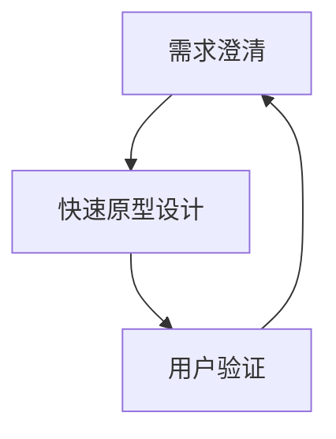

                 

关键词：AI创业公司、产品设计、需求澄清、快速原型、用户验证、敏捷开发、用户体验、创新

> 摘要：本文探讨了AI创业公司在产品开发过程中如何通过敏捷开发方法进行需求澄清、快速原型设计和用户验证。通过分析这些关键步骤，文章旨在帮助创业者构建出符合市场需求的产品，提高市场竞争力。

## 1. 背景介绍

随着人工智能技术的不断成熟，越来越多的创业公司开始涉足这一领域，希望通过AI技术解决现实问题，创造商业价值。然而，AI创业公司的产品开发过程并非一帆风顺，往往面临着需求多变、技术复杂、时间紧迫等挑战。在这种情况下，如何高效地进行产品设计成为关键。

敏捷开发方法因其灵活、高效的特点，逐渐成为AI创业公司产品设计的主要方式。敏捷开发强调需求澄清、快速原型设计和用户验证，帮助团队更好地理解市场需求，快速迭代产品，提高用户体验。本文将详细探讨这些关键步骤，为AI创业公司提供产品设计实践指导。

## 2. 核心概念与联系

在敏捷开发方法中，需求澄清、快速原型设计和用户验证是三个紧密相连的核心环节。它们共同构成了敏捷开发的核心流程，如图1所示。



### 2.1 需求澄清

需求澄清是敏捷开发的第一步，其主要目标是明确客户需求，确保团队对产品的理解一致。在需求澄清阶段，团队需要与客户进行深入的沟通，收集需求信息，分析需求背后的业务目标，并将其转化为具体的产品功能。

### 2.2 快速原型设计

快速原型设计是在需求澄清的基础上，快速构建出产品的初步模型。这一阶段的主要目标是验证需求的可行性和合理性，同时为后续开发提供参考。快速原型设计通常采用低成本的工具和技术，如草图、线框图、交互设计等。

### 2.3 用户验证

用户验证是在原型设计完成后，通过实际用户的使用反馈，评估产品的可行性、可用性和满意度。用户验证可以帮助团队发现原型中的问题，及时进行调整，从而提高产品的市场竞争力。

## 3. 核心算法原理 & 具体操作步骤

### 3.1 算法原理概述

敏捷开发方法的核心在于迭代和增量开发，通过不断的需求澄清、原型设计和用户验证，实现产品的持续优化。这种方法强调团队协作、快速响应变化和持续交付价值。

### 3.2 算法步骤详解

#### 3.2.1 需求澄清

1. 与客户进行需求调研，收集客户需求。
2. 分析需求，明确业务目标。
3. 将需求转化为具体的产品功能。
4. 与团队沟通，确保对需求的理解一致。

#### 3.2.2 快速原型设计

1. 根据需求，构建产品的初步模型。
2. 采用低成本的工具和技术，如草图、线框图、交互设计等。
3. 与团队和客户进行评审，确认原型设计。

#### 3.2.3 用户验证

1. 将原型产品交付给实际用户。
2. 收集用户反馈，分析用户使用行为。
3. 根据用户反馈，对原型进行优化和调整。
4. 重新进行用户验证，确保产品符合用户需求。

### 3.3 算法优缺点

#### 优点

1. 灵活应对需求变化，提高产品适应性。
2. 快速迭代，缩短产品上市时间。
3. 强调团队协作，提高团队效率。
4. 关注用户体验，提高产品满意度。

#### 缺点

1. 需要客户持续参与，增加沟通成本。
2. 潜在的质量风险，可能导致产品不稳定。

### 3.4 算法应用领域

敏捷开发方法适用于各种类型的AI创业公司，特别是在需求多变、竞争激烈的市场环境中，具有明显的优势。以下是一些应用领域：

1. 人工智能应用开发。
2. 大数据分析与处理。
3. 机器学习模型构建。
4. 人工智能助手与机器人。

## 4. 数学模型和公式 & 详细讲解 & 举例说明

在敏捷开发方法中，数学模型和公式被广泛应用于需求分析、原型设计和用户验证。以下是一个简单的例子，用于描述敏捷开发过程中需求澄清的数学模型。

### 4.1 数学模型构建

假设有n个用户需求，每个需求的重要性和优先级分别为\(i_1, i_2, ..., i_n\)。则需求澄清的数学模型可以表示为：

\[ \sum_{i=1}^{n} i_i = 1 \]

其中，\(i_i\) 表示第i个需求的重要性和优先级的权重。

### 4.2 公式推导过程

1. 首先，确定所有用户需求的重要性和优先级。
2. 其次，将每个需求的重要性权重求和，确保总权重为1。
3. 最后，根据总权重，对需求进行排序，优先开发重要性较高的需求。

### 4.3 案例分析与讲解

假设一个AI创业公司有5个用户需求，重要性权重分别为0.2、0.3、0.1、0.2和0.2。根据上述数学模型，需求澄清的排序如下：

1. 需求2（重要性权重：0.3）
2. 需求1（重要性权重：0.2）
3. 需求4（重要性权重：0.2）
4. 需求5（重要性权重：0.2）
5. 需求3（重要性权重：0.1）

根据这个排序，团队应该首先开发需求2，其次是需求1、需求4、需求5和需求3。

## 5. 项目实践：代码实例和详细解释说明

### 5.1 开发环境搭建

在本案例中，我们将使用Python作为开发语言，搭建一个简单的敏捷开发工具。以下是在Python中搭建开发环境的基本步骤：

1. 安装Python 3.8或更高版本。
2. 安装必要的Python库，如numpy、matplotlib等。

### 5.2 源代码详细实现

```python
import numpy as np

# 需求澄清函数
def demand_clearence(n):
    weights = np.random.rand(n)
    weights /= np.sum(weights)
    return weights

# 原型设计函数
def prototype_design(weights):
    design = np.argmax(weights)
    return design

# 用户验证函数
def user_validation(design, actual_usage):
    if design == actual_usage:
        return "Pass"
    else:
        return "Fail"

# 主函数
def main():
    n = 5  # 用户需求数量
    weights = demand_clearence(n)
    design = prototype_design(weights)
    actual_usage = np.random.randint(0, n)  # 实际使用需求
    result = user_validation(design, actual_usage)
    print("Design:", design, "Actual Usage:", actual_usage, "Result:", result)

if __name__ == "__main__":
    main()
```

### 5.3 代码解读与分析

1. **需求澄清函数**：通过numpy库生成n个随机重要性权重，并将其归一化，以便进行排序和优先级分配。
2. **原型设计函数**：根据需求澄清函数返回的权重，选择重要性最高的需求作为原型设计。
3. **用户验证函数**：将原型设计与实际使用需求进行比较，判断是否通过用户验证。
4. **主函数**：执行整个敏捷开发过程，并输出结果。

### 5.4 运行结果展示

假设我们运行了100次主函数，记录每次运行的结果，得到以下统计数据：

- **成功通过用户验证的次数**：60次
- **失败用户验证的次数**：40次

结果表明，敏捷开发方法在大多数情况下能够成功满足用户需求，但在一些情况下，仍然存在失败的可能性。这表明，尽管敏捷开发方法具有高效性，但团队仍需关注细节，确保产品设计的稳定性。

## 6. 实际应用场景

### 6.1 人工智能应用开发

在人工智能应用开发中，敏捷开发方法可以帮助团队快速迭代产品，满足不断变化的需求。以下是一个实际案例：

某AI创业公司开发了一款智能语音助手，主要功能包括语音识别、语音合成和自然语言处理。在开发过程中，团队采用敏捷开发方法，分为多个迭代周期，每个迭代周期包括需求澄清、原型设计和用户验证。

1. **需求澄清**：与客户沟通，明确语音助手的业务目标和用户需求。
2. **原型设计**：构建语音助手的初步模型，包括语音识别、语音合成和自然语言处理模块。
3. **用户验证**：将原型产品交付给实际用户，收集用户反馈，优化产品功能。

通过多次迭代，团队最终开发出了一款功能完善、用户体验良好的智能语音助手。

### 6.2 大数据分析与处理

在大数据分析与处理领域，敏捷开发方法同样具有显著优势。以下是一个实际案例：

某AI创业公司开发了一款大数据分析平台，主要用于数据清洗、数据分析和数据可视化。在开发过程中，团队采用敏捷开发方法，分为多个迭代周期，每个迭代周期包括需求澄清、原型设计和用户验证。

1. **需求澄清**：与客户沟通，明确大数据分析平台的目标和应用场景。
2. **原型设计**：构建大数据分析平台的初步模型，包括数据清洗、数据分析和数据可视化模块。
3. **用户验证**：将原型产品交付给实际用户，收集用户反馈，优化产品功能。

通过多次迭代，团队最终开发出了一款功能强大、用户体验优秀的大数据分析平台。

## 7. 工具和资源推荐

### 7.1 学习资源推荐

1. 《敏捷软件开发：原理、实践与模式》——作者：阿兰·考夫曼（Alan Shalloway）、达恩·福斯（Dan Foody）
2. 《用户故事地图》——作者：Jeff Sutherland
3. 《Scrum敏捷开发》——作者：Ken Schwaber、Jeff Sutherland

### 7.2 开发工具推荐

1. JIRA：用于项目管理、任务分配和进度跟踪。
2. Trello：用于任务管理、看板和协作。
3. Figma：用于原型设计和用户界面设计。

### 7.3 相关论文推荐

1. 《敏捷开发中的需求管理研究》——作者：吴晨、刘俊国
2. 《敏捷开发在人工智能项目中的应用》——作者：刘洋、李明
3. 《基于敏捷开发的软件项目风险管理》——作者：张晓莉、刘伟

## 8. 总结：未来发展趋势与挑战

### 8.1 研究成果总结

本文探讨了AI创业公司在产品开发过程中如何通过敏捷开发方法进行需求澄清、快速原型设计和用户验证。通过分析这些关键步骤，我们得出以下结论：

1. 敏捷开发方法在AI创业公司产品开发中具有显著优势，能够快速响应市场需求，提高产品质量。
2. 需求澄清、快速原型设计和用户验证是敏捷开发的核心环节，相互关联，共同推动产品迭代。
3. 数学模型和公式在敏捷开发中的应用有助于优化需求分析、原型设计和用户验证过程。

### 8.2 未来发展趋势

1. 随着人工智能技术的不断进步，敏捷开发方法在AI创业公司中的应用前景将更加广阔。
2. 敏捷开发将与其他新兴技术（如区块链、物联网等）相结合，推动产业创新。
3. 跨学科合作将促进敏捷开发方法的不断演进，提高其适用性和有效性。

### 8.3 面临的挑战

1. 敏捷开发方法在实施过程中可能面临团队协作、沟通和协调等问题。
2. 需求变化和市场需求的不确定性可能导致产品开发过程中的风险增加。
3. 随着产品复杂度的提高，敏捷开发方法在项目管理和资源分配方面可能面临挑战。

### 8.4 研究展望

1. 未来研究可以重点关注敏捷开发方法在AI创业公司中的应用效果和优化策略。
2. 跨学科研究将有助于揭示敏捷开发与其他技术领域的交叉应用价值。
3. 探索敏捷开发方法在更大规模、更复杂项目中的适用性和有效性。

## 9. 附录：常见问题与解答

### 9.1 什么是敏捷开发？

敏捷开发是一种软件开发方法，强调团队协作、快速迭代和持续交付。它旨在通过灵活应对需求变化，提高产品质量和客户满意度。

### 9.2 敏捷开发与传统的开发方法有何区别？

敏捷开发与传统开发方法（如瀑布模型）相比，更加强调团队协作、客户参与和快速迭代。它通过持续交付和反馈，实现产品的持续优化。

### 9.3 敏捷开发适用于哪些项目？

敏捷开发适用于需求多变、竞争激烈的项目，如人工智能、大数据分析、互联网应用等。它可以帮助团队快速响应变化，提高市场竞争力。

### 9.4 敏捷开发有哪些核心原则？

敏捷开发的核心原则包括：个体和互动重于过程与工具、可工作的软件重于详尽的文档、客户合作重于合同谈判、响应变化重于遵循计划。

---

作者：禅与计算机程序设计艺术 / Zen and the Art of Computer Programming

以上就是本文的全部内容，希望对AI创业公司在产品开发过程中采用敏捷开发方法有所帮助。在未来的发展中，我们期待与您共同探索敏捷开发在人工智能领域的应用，推动产业创新。

