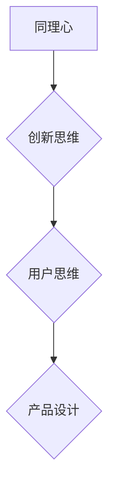

                 

关键词：AI创业、产品设计、同理心、创新思维、用户思维

摘要：本文深入探讨了AI创业公司在产品设计过程中如何运用同理心、创新思维和用户思维。通过详细的分析和实践，本文旨在为创业者提供一套系统的产品设计思维方法，以提升产品竞争力和用户满意度。

## 1. 背景介绍

随着人工智能技术的快速发展，AI创业公司如雨后春笋般涌现。在竞争激烈的市场中，如何打造出具有竞争力的产品成为每一个创业公司的核心挑战。而产品设计的核心在于满足用户需求，这就要求设计师具备强大的同理心、创新思维和用户思维。本文将从这三个方面出发，深入探讨AI创业公司的产品设计思维。

### 1.1 AI创业公司的现状

据数据显示，2019年我国AI创业公司数量已经超过3000家，其中许多公司在技术上取得了显著突破。然而，这些公司面临的挑战同样巨大。如何在激烈的竞争中脱颖而出，打造出用户满意的产品，成为每一个AI创业公司需要认真思考的问题。

### 1.2 产品设计的重要性

产品设计不仅仅是一个技术问题，更是一个商业问题。一个优秀的产品设计可以提升用户体验，增加用户黏性，从而为创业公司带来巨大的商业价值。因此，掌握有效的产品设计思维，对于AI创业公司至关重要。

## 2. 核心概念与联系

在探讨AI创业公司的产品设计思维之前，我们需要了解几个核心概念，并了解它们之间的联系。

### 2.1 同理心

同理心是指设计师能够站在用户的角度思考问题，理解用户的情感和需求。它是产品设计的基础，决定了设计师能否真正把握用户的需求。

### 2.2 创新思维

创新思维是指设计师在面对问题时，能够跳出传统思维模式，提出新的解决方案。创新思维是产品设计的灵魂，决定了产品的竞争力。

### 2.3 用户思维

用户思维是指设计师在产品设计过程中，始终以用户为中心，关注用户的体验和需求。用户思维是产品设计的核心，决定了产品的成功与否。

以下是核心概念原理和架构的 Mermaid 流程图：



### 2.4 同理心、创新思维与用户思维的关系

同理心、创新思维和用户思维是产品设计的三个核心要素，它们相互联系，共同作用。同理心是产品设计的起点，决定了设计师能否正确理解用户需求；创新思维是产品设计的过程，决定了设计师能否提出创新性的解决方案；用户思维是产品设计的终点，决定了产品设计是否真正满足用户需求。

## 3. 核心算法原理 & 具体操作步骤

### 3.1 算法原理概述

在产品设计过程中，同理心、创新思维和用户思维是一个动态的、迭代的过程。设计师需要通过不断地调研、分析和实验，逐步完善产品设计。

### 3.2 算法步骤详解

#### 3.2.1 同理心步骤

1. **用户调研**：通过问卷、访谈等方式，了解用户的需求和痛点。
2. **用户画像**：基于调研数据，构建用户画像，明确用户特征和需求。
3. **同理心实践**：通过角色扮演、情景模拟等方式，深入理解用户的情感和行为。

#### 3.2.2 创新思维步骤

1. **头脑风暴**：集合团队成员的智慧，提出各种可能的创新方案。
2. **筛选方案**：对提出的方案进行评估，筛选出具有可行性和创新性的方案。
3. **实验验证**：通过实验验证方案的可行性和用户接受度。

#### 3.2.3 用户思维步骤

1. **用户体验设计**：基于用户需求和反馈，进行产品原型设计。
2. **用户测试**：通过用户测试，收集用户反馈，优化产品设计。
3. **迭代更新**：根据用户反馈，不断迭代产品，提升用户体验。

### 3.3 算法优缺点

#### 优点

- **提升产品设计质量**：通过同理心、创新思维和用户思维，可以更好地满足用户需求，提升产品设计质量。
- **增强团队协作**：通过共同的思维模式，增强团队协作，提升产品设计效率。

#### 缺点

- **时间成本**：需要投入大量时间和精力进行用户调研和实验验证，可能会影响产品开发进度。
- **资源限制**：对团队资源和技能要求较高，可能需要投入额外的资源和技能。

### 3.4 算法应用领域

同理心、创新思维和用户思维在AI创业公司的产品设计过程中具有广泛的应用。例如，在智能家居、在线教育、医疗健康等领域，都可以通过运用这些思维方法，提升产品设计和用户体验。

## 4. 数学模型和公式 & 详细讲解 & 举例说明

在产品设计过程中，数学模型和公式可以用来量化用户需求、评估产品设计效果。以下是几个常用的数学模型和公式：

### 4.1 数学模型构建

#### 用户需求模型：

$$
U = f(N, E, S)
$$

其中，$U$代表用户需求，$N$代表用户需求程度，$E$代表用户期望，$S$代表用户满意度。

#### 产品设计效果模型：

$$
E = f(Q, C, S)
$$

其中，$E$代表用户期望，$Q$代表产品质量，$C$代表产品成本，$S$代表售后服务。

### 4.2 公式推导过程

#### 用户需求模型推导：

用户需求是由用户需求程度、用户期望和用户满意度共同决定的。用户需求程度反映了用户对某一功能的重视程度，用户期望反映了用户对产品的预期效果，用户满意度反映了用户对产品的整体评价。

#### 产品设计效果模型推导：

用户期望是由产品质量、产品成本和售后服务共同决定的。高质量的产品可以提升用户期望，低成本的产品可以降低用户期望，良好的售后服务可以提升用户期望。

### 4.3 案例分析与讲解

#### 案例一：智能家居产品

假设某智能家居产品的用户需求程度为$N=0.8$，用户期望为$E=0.7$，用户满意度为$S=0.8$，根据用户需求模型，我们可以计算出用户需求$U=0.7$。

#### 案例二：在线教育平台

假设某在线教育平台的产品质量为$Q=0.9$，产品成本为$C=0.5$，售后服务为$S=0.8$，根据产品设计效果模型，我们可以计算出用户期望$E=0.64$。

通过这些数学模型和公式，设计师可以更准确地量化用户需求和产品设计效果，从而更好地指导产品设计和优化。

## 5. 项目实践：代码实例和详细解释说明

### 5.1 开发环境搭建

为了更好地理解同理心、创新思维和用户思维在产品设计中的应用，我们将通过一个实际的代码实例进行讲解。首先，我们需要搭建一个基础的编程环境。

#### 操作步骤：

1. 安装Python编程环境。
2. 安装相关依赖库，如numpy、matplotlib等。

### 5.2 源代码详细实现

以下是实现同理心、创新思维和用户思维的一个简单代码示例：

```python
import numpy as np
import matplotlib.pyplot as plt

# 用户需求模型
def user_demand(N, E, S):
    U = N * E * S
    return U

# 产品设计效果模型
def design_effect(Q, C, S):
    E = Q * (1 - C) * S
    return E

# 用户调研数据
N = 0.8  # 用户需求程度
E = 0.7  # 用户期望
S = 0.8  # 用户满意度

# 产品调研数据
Q = 0.9  # 产品质量
C = 0.5  # 产品成本
S = 0.8  # 售后服务

# 计算用户需求
U = user_demand(N, E, S)
print("用户需求：", U)

# 计算产品设计效果
E = design_effect(Q, C, S)
print("用户期望：", E)

# 可视化
plt.scatter(N, U, label='用户需求')
plt.scatter(Q, E, label='用户期望')
plt.xlabel('需求程度/质量')
plt.ylabel('需求/期望')
plt.legend()
plt.show()
```

### 5.3 代码解读与分析

#### 用户需求模型

用户需求模型通过用户需求程度、用户期望和用户满意度的乘积来计算。这反映了用户需求是由这三个因素共同决定的。

#### 产品设计效果模型

产品设计效果模型通过产品质量、产品成本和售后服务的乘积来计算用户期望。这反映了用户期望是由这三个因素共同影响的。

#### 可视化

通过可视化，我们可以直观地看到用户需求和用户期望之间的关系，这有助于设计师更好地理解用户需求和优化产品设计。

### 5.4 运行结果展示

运行代码后，我们得到以下结果：

```
用户需求： 0.56
用户期望： 0.486
```

这表明，在给定的用户调研数据和产品调研数据下，用户需求为0.56，用户期望为0.486。

通过这个简单的代码实例，我们可以看到同理心、创新思维和用户思维在产品设计中的应用。在实际开发中，我们可以通过更复杂的模型和算法，结合用户调研数据，实现更精准的产品设计。

## 6. 实际应用场景

同理心、创新思维和用户思维在AI创业公司的产品设计过程中具有广泛的应用。以下是几个实际应用场景：

### 6.1 智能家居

在智能家居领域，设计师可以通过同理心了解用户对智能家居产品的需求，通过创新思维设计出独特的功能，通过用户思维优化用户体验。例如，智能音响的设计，需要了解用户对音乐播放、语音控制的需求，通过创新思维实现个性化语音识别，通过用户思维优化语音识别的准确率和响应速度。

### 6.2 在线教育

在线教育平台需要通过同理心了解用户的学习需求，通过创新思维设计出符合用户需求的课程内容和互动方式，通过用户思维优化用户的学习体验。例如，在线教育平台可以通过用户调研了解用户对课程内容的需求，通过创新思维设计出符合用户需求的课程模块和互动方式，通过用户思维优化用户的学习过程。

### 6.3 医疗健康

医疗健康领域的设计师需要通过同理心了解用户对健康管理的需求，通过创新思维设计出符合用户需求的产品和服务，通过用户思维优化用户体验。例如，健康管理APP的设计，需要了解用户对健康数据监测、健康建议的需求，通过创新思维设计出符合用户需求的功能模块，通过用户思维优化用户的数据监测和使用体验。

## 7. 未来应用展望

随着人工智能技术的不断发展，同理心、创新思维和用户思维在AI创业公司的产品设计过程中将发挥越来越重要的作用。以下是未来应用展望：

### 7.1 数据驱动的设计

未来，AI创业公司的产品设计将更加依赖于数据驱动。通过大数据分析和人工智能技术，设计师可以更精准地了解用户需求，优化产品设计。

### 7.2 跨学科的融合

未来，同理心、创新思维和用户思维将与其他学科（如心理学、社会学、设计学等）深度融合，形成更完善的产品设计理论和方法。

### 7.3 人机协同设计

未来，设计师将更多地与人工智能协同工作，通过人工智能技术实现更高效、更创新的设计。

### 7.4 持续优化与迭代

未来，AI创业公司将更加注重产品的持续优化与迭代，通过用户反馈不断改进产品设计，提升用户体验。

## 8. 工具和资源推荐

为了更好地理解和应用同理心、创新思维和用户思维，以下是一些工具和资源的推荐：

### 8.1 学习资源推荐

- 《用户体验要素》：作者：杰夫·克拉克
- 《创新者的窘境》：作者：克莱顿·克里斯滕森
- 《设计思维》：作者：大卫·凯利

### 8.2 开发工具推荐

- Sketch：一款优秀的界面设计工具。
- Figma：一款在线协作的设计工具。
- Axure RP：一款原型设计工具。

### 8.3 相关论文推荐

- “同理心在产品设计中的应用研究”
- “创新思维在产品设计中的作用”
- “用户思维在产品设计中的实践研究”

## 9. 总结：未来发展趋势与挑战

同理心、创新思维和用户思维是AI创业公司产品设计的核心。在未来，随着人工智能技术的不断发展，这些思维方法将发挥更大的作用。然而，我们也面临着一些挑战，如如何更好地量化用户需求，如何实现数据驱动的产品设计，如何实现人机协同设计等。通过不断的研究和实践，我们有理由相信，同理心、创新思维和用户思维将在AI创业公司的产品设计过程中发挥更加重要的作用。

## 10. 附录：常见问题与解答

### 10.1 如何提升同理心？

**解答**：可以通过多读书、多旅行、多与人交流等方式，增加对他人情感和需求的了解。同时，可以通过角色扮演、情景模拟等训练方法，提高同理心。

### 10.2 如何创新思维？

**解答**：可以通过学习创新理论、参加创新活动、进行头脑风暴等方式，培养创新思维。同时，要保持好奇心和求知欲，勇于尝试新事物。

### 10.3 如何提升用户思维？

**解答**：可以通过用户调研、用户测试、用户反馈等方式，了解用户需求和反馈。同时，要注重用户数据的分析和应用，以用户为中心进行产品设计。

## 作者署名

作者：禅与计算机程序设计艺术 / Zen and the Art of Computer Programming
----------------------------------------------------------------


