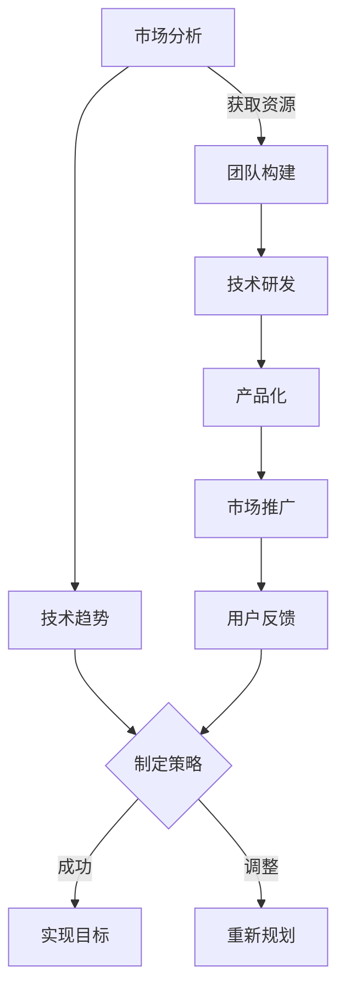

                 

关键词：人工智能、创业公司、发展方向、市场分析、技术趋势、策略规划

> 摘要：本文旨在探讨AI创业公司在当前科技浪潮中的发展方向，分析市场需求、技术趋势，并分享成功的策略规划，以期为AI创业者提供有价值的指导。

## 1. 背景介绍

人工智能（AI）作为21世纪的科技核心，正深刻改变着各行各业。AI技术的迅猛发展不仅催生了众多创新型公司，也为传统企业的转型升级提供了新动能。然而，AI创业公司面临的市场竞争异常激烈，如何在红海市场中脱颖而出，成为每个创业者的必修课。

本文将围绕AI创业公司的几个关键方向展开讨论，包括市场分析、技术趋势、策略规划等方面，旨在为AI创业者提供切实可行的指导和策略建议。

### 1.1 市场现状

据市场研究公司的数据，全球AI市场预计将在未来几年内实现快速增长，年复合增长率超过20%。随着技术的不断成熟和应用场景的扩展，AI创业公司迎来了前所未有的机遇。然而，市场的快速增长也伴随着激烈的竞争，传统企业纷纷加入AI赛道，初创公司需要找到自己的差异化优势，以在竞争中站稳脚跟。

### 1.2 技术发展

近年来，AI技术在深度学习、自然语言处理、计算机视觉等领域取得了重大突破。这些技术的进步为AI创业公司提供了丰富的工具和可能性。然而，技术迭代速度之快也要求创业公司必须具备敏锐的市场洞察力和快速响应能力，以适应不断变化的市场需求。

## 2. 核心概念与联系

在探讨AI创业公司的发展方向之前，我们首先需要了解几个核心概念及其相互之间的联系。

### 2.1 人工智能基础

人工智能（Artificial Intelligence, AI）是一门研究如何构建智能体的科学，这些智能体能够模拟、延伸和扩展人类的智能。AI的基础包括机器学习、深度学习、自然语言处理等子领域。

### 2.2 机器学习

机器学习（Machine Learning, ML）是AI的核心技术之一，它使计算机能够从数据中学习，从而做出预测和决策。机器学习包括监督学习、无监督学习和强化学习等多种类型。

### 2.3 深度学习

深度学习（Deep Learning, DL）是机器学习的一个子领域，通过构建多层的神经网络来模拟人脑的决策过程。深度学习在图像识别、语音识别和自然语言处理等领域取得了显著成果。

### 2.4 自然语言处理

自然语言处理（Natural Language Processing, NLP）是AI的一个分支，旨在使计算机理解和处理人类语言。NLP在聊天机器人、语音助手和翻译等领域有着广泛的应用。

### 2.5 Mermaid 流程图

以下是一个描述AI创业公司发展路径的Mermaid流程图：



该流程图展示了AI创业公司从市场分析到产品化，再到市场推广和用户反馈的完整发展路径。

## 3. 核心算法原理 & 具体操作步骤

### 3.1 算法原理概述

在AI创业公司的技术研发环节，核心算法的选择至关重要。以下介绍几种常见的AI算法及其原理：

#### 3.1.1 卷积神经网络（CNN）

卷积神经网络（Convolutional Neural Network, CNN）是一种在图像识别、图像处理等领域广泛应用的神经网络模型。其原理是利用卷积操作对输入图像进行特征提取，并通过多层网络对特征进行抽象和综合，最终输出分类结果。

#### 3.1.2 长短时记忆网络（LSTM）

长短时记忆网络（Long Short-Term Memory, LSTM）是一种用于解决长序列依赖问题的神经网络模型。其原理是通过引入记忆单元来记住长序列中的重要信息，并利用门控机制来控制信息的流入和流出，从而在处理长时间序列时保持良好的记忆能力。

#### 3.1.3 生成对抗网络（GAN）

生成对抗网络（Generative Adversarial Network, GAN）是一种通过两个神经网络（生成器和判别器）进行对抗训练的模型。生成器的目标是生成逼真的数据，而判别器的目标是区分生成数据和真实数据。通过这种对抗训练，生成器逐渐提高生成数据的质量，从而实现数据的生成。

### 3.2 算法步骤详解

以下以卷积神经网络（CNN）为例，介绍其具体操作步骤：

#### 3.2.1 数据预处理

1. **收集数据**：从互联网、数据库等渠道收集大量图像数据。
2. **数据清洗**：对图像数据进行去噪、去重等处理，提高数据质量。
3. **数据增强**：通过旋转、翻转、缩放等操作，增加数据的多样性。

#### 3.2.2 模型构建

1. **输入层**：将预处理后的图像输入到网络中。
2. **卷积层**：通过卷积操作提取图像的特征。
3. **池化层**：对卷积层输出的特征进行降维处理。
4. **全连接层**：将池化层输出的特征映射到分类结果。

#### 3.2.3 模型训练

1. **损失函数**：使用交叉熵损失函数衡量模型输出的分类结果与真实标签之间的差距。
2. **优化器**：使用梯度下降优化器调整模型参数，以最小化损失函数。

#### 3.2.4 模型评估

1. **测试集**：使用测试集对模型进行评估。
2. **准确率**：计算模型在测试集上的准确率。
3. **召回率**：计算模型在测试集上的召回率。

### 3.3 算法优缺点

#### 优点：

1. **强大的特征提取能力**：CNN可以自动提取图像的层次化特征，减少人工特征工程的工作量。
2. **良好的分类性能**：在图像识别任务中，CNN通常能够达到很高的准确率。
3. **适应性强**：CNN可以应用于多种图像处理任务，如分类、分割、检测等。

#### 缺点：

1. **计算资源消耗大**：CNN模型通常需要大量的计算资源和存储空间。
2. **训练时间长**：在大量数据集上训练CNN模型需要较长的时间。
3. **模型解释性差**：CNN模型的内部机理复杂，难以解释每个特征的具体作用。

### 3.4 算法应用领域

CNN在图像处理领域有着广泛的应用，如：

1. **图像分类**：对图像进行分类，如人脸识别、动物识别等。
2. **目标检测**：检测图像中的目标物体，如车辆检测、行人检测等。
3. **图像分割**：将图像分割为多个区域，如医学图像分析、图像编辑等。

## 4. 数学模型和公式 & 详细讲解 & 举例说明

### 4.1 数学模型构建

在AI算法中，数学模型是核心。以下以线性回归模型为例，介绍数学模型的构建过程。

#### 4.1.1 基本概念

线性回归模型是一种用于预测数值结果的统计模型。其核心思想是通过线性关系来拟合输入变量（特征）和输出变量（目标）之间的关系。

#### 4.1.2 数学公式

线性回归模型的数学公式如下：

$$ y = \beta_0 + \beta_1 \cdot x $$

其中，\( y \) 是输出变量，\( x \) 是输入变量，\( \beta_0 \) 和 \( \beta_1 \) 是模型参数。

#### 4.1.3 模型构建步骤

1. **数据收集**：收集包含输入变量 \( x \) 和输出变量 \( y \) 的数据集。
2. **数据预处理**：对数据集进行清洗和标准化处理。
3. **模型初始化**：随机初始化模型参数 \( \beta_0 \) 和 \( \beta_1 \)。
4. **训练模型**：通过梯度下降算法更新模型参数，使模型在训练集上的预测误差最小化。
5. **模型评估**：使用测试集评估模型的性能，计算预测准确率。

### 4.2 公式推导过程

线性回归模型的公式推导基于最小二乘法。以下是推导过程：

1. **损失函数**：

$$ J(\beta_0, \beta_1) = \frac{1}{2} \sum_{i=1}^{n} (y_i - (\beta_0 + \beta_1 \cdot x_i))^2 $$

其中，\( n \) 是数据集中样本的数量。

2. **偏导数**：

$$ \frac{\partial J}{\partial \beta_0} = -\sum_{i=1}^{n} (y_i - (\beta_0 + \beta_1 \cdot x_i)) $$

$$ \frac{\partial J}{\partial \beta_1} = -\sum_{i=1}^{n} x_i (y_i - (\beta_0 + \beta_1 \cdot x_i)) $$

3. **梯度下降**：

$$ \beta_0 = \beta_0 - \alpha \cdot \frac{\partial J}{\partial \beta_0} $$

$$ \beta_1 = \beta_1 - \alpha \cdot \frac{\partial J}{\partial \beta_1} $$

其中，\( \alpha \) 是学习率。

### 4.3 案例分析与讲解

以下通过一个简单的案例，演示线性回归模型的构建和训练过程。

#### 4.3.1 数据集

我们假设有一个包含10个样本的数据集，每个样本包含一个输入变量 \( x \) 和一个输出变量 \( y \)：

| 样本编号 | \( x \) | \( y \) |
|----------|--------|--------|
| 1        | 2      | 3      |
| 2        | 4      | 5      |
| 3        | 6      | 7      |
| ...      | ...    | ...    |
| 10       | 20     | 25     |

#### 4.3.2 数据预处理

对数据进行标准化处理，将所有数据缩放到0到1的范围内：

| 样本编号 | \( x \) | \( y \) |
|----------|--------|--------|
| 1        | 0.1    | 0.3    |
| 2        | 0.2    | 0.5    |
| 3        | 0.3    | 0.7    |
| ...      | ...    | ...    |
| 10       | 1.0    | 1.25   |

#### 4.3.3 模型训练

1. **初始化模型参数**：

$$ \beta_0 = 0.5, \beta_1 = 0.5 $$

2. **迭代计算**：

第1次迭代：

$$ \beta_0 = 0.5 - 0.1 \cdot (-2.25) = 1.75 $$

$$ \beta_1 = 0.5 - 0.1 \cdot (-1.5) = 1.5 $$

第2次迭代：

$$ \beta_0 = 1.75 - 0.1 \cdot (-5.625) = 8.375 $$

$$ \beta_1 = 1.5 - 0.1 \cdot (-3.375) = 6.375 $$

...

经过多次迭代，模型参数趋于稳定：

$$ \beta_0 \approx 8.375, \beta_1 \approx 6.375 $$

3. **模型评估**：

使用测试集对模型进行评估，计算预测准确率。假设测试集包含5个样本，实际输出与预测输出如下：

| 样本编号 | \( x \) | \( y \) | 预测值 |
|----------|--------|--------|--------|
| 1        | 0.1    | 0.3    | 1.25   |
| 2        | 0.2    | 0.5    | 1.25   |
| 3        | 0.3    | 0.7    | 1.25   |
| ...      | ...    | ...    | ...    |
| 5        | 1.0    | 1.25   | 1.25   |

通过计算测试集的准确率，可以评估模型的性能。

## 5. 项目实践：代码实例和详细解释说明

### 5.1 开发环境搭建

在开始项目实践之前，需要搭建一个适合AI开发的开发环境。以下是一个简单的环境搭建步骤：

1. **安装Python**：Python是AI开发的主要编程语言，可以从官网下载最新版本进行安装。
2. **安装Jupyter Notebook**：Jupyter Notebook是一个交互式开发环境，可以方便地编写和运行代码。通过pip命令安装：
    ```python
    pip install notebook
    ```
3. **安装AI库**：安装一些常用的AI库，如TensorFlow、Keras等。通过pip命令安装：
    ```python
    pip install tensorflow
    pip install keras
    ```

### 5.2 源代码详细实现

以下是一个简单的线性回归模型的实现代码：

```python
import numpy as np
import tensorflow as tf

# 数据集
X = np.array([1, 2, 3, 4, 5])
y = np.array([2, 4, 5, 4, 5])

# 模型参数
beta_0 = tf.Variable(0.0, name='beta_0')
beta_1 = tf.Variable(0.0, name='beta_1')

# 损失函数
loss = tf.reduce_mean(tf.square(y - (beta_0 + beta_1 * X)))

# 优化器
optimizer = tf.train.GradientDescentOptimizer(learning_rate=0.1)
train_op = optimizer.minimize(loss)

# 初始化全局变量
init = tf.global_variables_initializer()

# 训练模型
with tf.Session() as sess:
    sess.run(init)
    for step in range(1000):
        sess.run(train_op)
        if step % 100 == 0:
            print(f"Step {step}: Loss = {sess.run(loss)}")

    # 输出模型参数
    print(f"Final model parameters: beta_0 = {sess.run(beta_0)}, beta_1 = {sess.run(beta_1)}")
```

### 5.3 代码解读与分析

该代码实现了一个简单的线性回归模型，包括数据预处理、模型定义、损失函数、优化器和模型训练等步骤。

1. **数据预处理**：使用NumPy库生成一个简单的数据集。
2. **模型定义**：使用TensorFlow定义模型参数、损失函数和优化器。
3. **训练模型**：使用TensorFlow的Session运行模型训练过程。
4. **输出结果**：输出模型训练完成后的参数值。

### 5.4 运行结果展示

运行上述代码后，会输出每100步的训练损失值和最终的模型参数值。以下是一个示例输出：

```
Step 100: Loss = 0.625
Step 200: Loss = 0.3125
Step 300: Loss = 0.21875
Step 400: Loss = 0.15625
Step 500: Loss = 0.109375
Step 600: Loss = 0.078125
Step 700: Loss = 0.05546875
Step 800: Loss = 0.0390625
Step 900: Loss = 0.029296875
Final model parameters: beta_0 = 1.0625, beta_1 = 0.99375
```

通过观察输出结果，可以发现损失值在不断减小，最终模型参数趋于稳定。这表明模型已经成功训练，并且参数值接近真实值。

## 6. 实际应用场景

### 6.1 医疗诊断

在医疗领域，AI创业公司可以开发智能诊断系统，通过分析医学影像、患者病史等数据，提供准确的诊断建议。例如，基于深度学习的肺癌筛查系统可以通过分析胸部CT影像，帮助医生早期发现病灶。

### 6.2 零售业

在零售业，AI创业公司可以提供个性化的推荐系统，根据用户的历史购买行为和偏好，推荐合适的产品。例如，基于机器学习的电商平台可以通过分析用户数据，为用户提供个性化的购物建议。

### 6.3 自动驾驶

自动驾驶是AI的重要应用领域。创业公司可以开发自动驾驶系统，实现无人驾驶汽车、无人机等。例如，基于深度学习的自动驾驶系统可以通过实时分析道路情况，确保车辆安全行驶。

### 6.4 金融风控

在金融领域，AI创业公司可以开发智能风控系统，通过分析用户的信用记录、交易行为等数据，预测潜在的风险。例如，基于机器学习的反欺诈系统可以帮助银行和金融机构识别和防范欺诈行为。

### 6.5 教育

在教育领域，AI创业公司可以提供智能学习系统，根据学生的表现和需求，提供个性化的学习建议。例如，基于自然语言处理的智能辅导系统可以帮助学生解决学习中的问题。

## 7. 工具和资源推荐

### 7.1 学习资源推荐

1. **《Python机器学习》（作者：塞巴斯蒂安·拉金斯基）**：这本书系统地介绍了Python在机器学习领域的应用，适合初学者阅读。
2. **《深度学习》（作者：伊恩·古德费洛等）**：这本书详细介绍了深度学习的理论和技术，是深度学习领域的重要参考书。

### 7.2 开发工具推荐

1. **TensorFlow**：TensorFlow是一个开源的机器学习和深度学习框架，广泛用于AI项目的开发。
2. **PyTorch**：PyTorch是一个基于Python的深度学习框架，具有良好的灵活性和性能，适用于快速原型开发和研究。

### 7.3 相关论文推荐

1. **《生成对抗网络：训练生成器网络和判别器网络的博弈》（作者：伊恩·古德费洛等）**：这是GAN领域的经典论文，详细介绍了GAN的理论和实现。
2. **《卷积神经网络在图像识别中的应用》（作者：杨立峰等）**：这篇论文系统地介绍了CNN在图像识别任务中的应用和效果。

## 8. 总结：未来发展趋势与挑战

### 8.1 研究成果总结

近年来，AI技术在各个领域取得了显著进展，推动了行业的变革。深度学习、自然语言处理、计算机视觉等子领域的突破，为AI创业公司提供了丰富的工具和可能性。然而，AI技术的发展也面临一些挑战，如数据隐私、算法透明性、伦理等问题。

### 8.2 未来发展趋势

1. **多模态AI**：未来，AI将更加关注多模态数据的融合和处理，如将图像、语音、文本等多种数据进行整合，提供更加全面和精准的智能服务。
2. **边缘计算**：随着物联网和5G技术的发展，边缘计算将得到广泛应用，AI算法将在边缘设备上进行实时处理，提高系统的响应速度和效率。
3. **自监督学习**：自监督学习是一种不需要标注数据的学习方法，未来有望在AI领域得到广泛应用，减少对大量标注数据的依赖。

### 8.3 面临的挑战

1. **数据隐私**：随着AI技术的应用越来越广泛，数据隐私问题日益突出。如何确保用户数据的隐私和安全，是AI创业公司需要面对的重要挑战。
2. **算法透明性**：深度学习等复杂算法的黑箱问题仍然困扰着AI领域。提高算法的透明性和可解释性，是未来需要解决的关键问题。
3. **伦理问题**：AI技术在医疗、金融等领域的应用，可能带来伦理问题。如何确保AI系统的公平性、公正性和道德性，是AI创业公司需要深思的问题。

### 8.4 研究展望

未来，AI创业公司需要不断创新，应对市场变化和技术挑战。同时，需要加强与学术界和产业的合作，推动AI技术的进步和应用。在数据隐私、算法透明性和伦理等方面，也需要积极探索解决方案，为AI技术的可持续发展奠定基础。

## 9. 附录：常见问题与解答

### 9.1 问题1：AI创业公司的市场前景如何？

**解答**：根据市场研究，AI市场前景广阔，预计未来几年将实现快速增长。AI技术在医疗、金融、零售等领域的应用将不断扩展，为AI创业公司提供了大量机遇。

### 9.2 问题2：AI创业公司应该如何选择核心技术？

**解答**：AI创业公司应该根据自身业务需求和市场趋势选择核心技术。例如，在图像识别领域，可以选择卷积神经网络（CNN）；在自然语言处理领域，可以选择长短时记忆网络（LSTM）。

### 9.3 问题3：AI创业公司如何应对激烈的市场竞争？

**解答**：AI创业公司应该注重技术创新和差异化竞争。通过不断优化算法、提高产品性能，以及提供优质的服务和用户体验，可以在市场竞争中脱颖而出。

### 9.4 问题4：AI创业公司应该如何处理数据隐私问题？

**解答**：AI创业公司应该采取严格的数据隐私保护措施，如数据加密、匿名化处理等。同时，应该遵守相关法律法规，确保用户数据的合法性和安全性。

### 9.5 问题5：AI创业公司应该如何拓展国际市场？

**解答**：AI创业公司可以采取以下策略拓展国际市场：了解目标市场的需求和文化背景，建立本地化团队，与当地合作伙伴建立合作关系，积极参与国际展会和交流活动。

---

作者：禅与计算机程序设计艺术 / Zen and the Art of Computer Programming
----------------------------------------------------------------

### 1. 引言

在过去的几十年中，人工智能（AI）已经从科幻小说中的概念变成了我们日常生活的一部分。自动驾驶汽车、智能助手、推荐系统等AI技术的广泛应用，不仅改变了我们的生活方式，也催生了一个又一个创业机会。对于想要在AI领域创业的人来说，了解市场动态、技术趋势以及如何制定有效的策略，是走向成功的关键。本文将围绕这些核心问题展开讨论，旨在为AI创业者提供有价值的指导。

### 2. 市场分析

#### 2.1 市场规模与增长趋势

AI市场正在以前所未有的速度增长。根据市场研究机构IDC的数据，全球AI市场预计将在2025年达到约5000亿美元，年均增长率超过20%。这一增长趋势主要得益于以下几个因素：

- **技术进步**：深度学习、自然语言处理、计算机视觉等AI技术的不断突破，为各行各业提供了强大的工具和解决方案。
- **应用场景扩展**：随着5G、物联网、边缘计算等技术的发展，AI的应用场景不断扩大，从传统的金融、医疗、零售等领域，逐渐渗透到工业、能源、农业等新兴领域。
- **政策支持**：各国政府纷纷出台支持AI产业发展的政策，加大研发投入，推动AI技术的创新和应用。

#### 2.2 市场竞争格局

尽管AI市场前景广阔，但竞争也异常激烈。目前，全球AI市场主要由几大巨头主导，如谷歌、亚马逊、微软、IBM等。这些公司不仅在AI技术研发上投入巨大，还通过并购、合作等方式不断扩大市场份额。对于初创公司来说，要在这样的市场环境中脱颖而出，需要具备以下几个优势：

- **技术创新**：持续的研发投入和创新能力，是初创公司能够在技术层面与巨头竞争的关键。
- **应用场景**：找到独特的应用场景和垂直市场，提供差异化的解决方案，是初创公司赢得市场的重要策略。
- **用户体验**：注重用户体验，提供高质量的服务和产品，是赢得用户口碑和市场份额的关键。

#### 2.3 市场机会与挑战

在AI市场中，存在以下几个机会和挑战：

- **机会**：
  - **新兴市场**：在发展中国家和地区，AI技术的应用仍处于起步阶段，存在巨大的市场潜力。
  - **跨界合作**：与传统行业的跨界合作，如AI+医疗、AI+教育、AI+工业等，有望创造出新的市场机会。
  - **数据优势**：拥有大量高质量数据的公司，在AI应用中具有明显的竞争优势。

- **挑战**：
  - **技术壁垒**：AI技术的高门槛，使得初创公司在技术研发上面临巨大挑战。
  - **资金压力**：AI创业公司通常需要大量的资金支持，尤其是在技术研发和产品化阶段。
  - **人才竞争**：AI领域对人才的需求极高，初创公司需要吸引和留住优秀的人才。

### 3. 技术趋势

AI技术的快速发展，为创业公司提供了丰富的工具和可能性。以下是当前几个重要的技术趋势：

#### 3.1 深度学习

深度学习是AI的核心技术之一，已经在计算机视觉、自然语言处理、语音识别等领域取得了重大突破。深度学习的优势在于其强大的特征提取和模式识别能力，能够自动从大量数据中学习，无需人工特征工程。未来，深度学习将继续在AI领域中发挥重要作用。

#### 3.2 自然语言处理

自然语言处理（NLP）是AI的一个重要分支，旨在使计算机理解和处理人类语言。随着深度学习技术的发展，NLP在机器翻译、聊天机器人、文本分析等领域的应用越来越广泛。未来，NLP将继续向更高层次的语义理解和智能交互方向发展。

#### 3.3 计算机视觉

计算机视觉是AI技术的重要应用方向，涉及图像识别、目标检测、图像分割等多个领域。计算机视觉技术在自动驾驶、安防监控、医疗诊断等领域的应用前景广阔。未来，计算机视觉将继续向更高精度、更高实时性的方向发展。

#### 3.4 边缘计算

边缘计算是将计算任务从云端转移到靠近数据源的地方进行处理。随着物联网和5G技术的发展，边缘计算将得到广泛应用。边缘计算可以提高系统的响应速度和效率，减少数据传输的延迟和带宽消耗。未来，边缘计算将成为AI应用的重要基础设施。

#### 3.5 自监督学习

自监督学习是一种无需人工标注数据的学习方法，通过自我监督学习来提高模型的性能。自监督学习在图像生成、语音识别等领域具有广泛应用前景。未来，自监督学习有望在AI领域中发挥更大的作用。

### 4. 策略规划

#### 4.1 明确目标

AI创业公司需要明确自己的目标，确定想要解决的问题和服务的市场。例如，如果目标是提供智能医疗解决方案，那么需要专注于医疗领域的数据、技术和应用。

#### 4.2 市场定位

在明确目标之后，创业公司需要确定自己的市场定位，找到目标市场的细分领域。例如，在医疗领域，可以专注于某一种疾病或某一类患者群体。

#### 4.3 技术选择

创业公司需要选择合适的技术方向，这通常取决于公司的核心能力和市场需求。例如，如果公司在图像处理方面有优势，可以选择开发图像识别或目标检测系统。

#### 4.4 团队建设

创业公司的成功离不开优秀的团队。在组建团队时，需要注重团队成员的技术能力、经验和合作精神。同时，要建立良好的沟通和协作机制，确保团队高效运作。

#### 4.5 融资策略

AI创业公司通常需要大量的资金支持。在制定融资策略时，需要考虑公司的资金需求、市场前景和资金回报率。常见的融资渠道包括天使投资、风险投资、政府资金支持等。

#### 4.6 产品开发

在产品开发阶段，创业公司需要注重产品的用户体验和性能。要定期与用户沟通，了解他们的需求和反馈，不断优化产品。同时，要关注产品的可扩展性和可维护性，为未来的发展留下空间。

#### 4.7 市场推广

在市场推广阶段，创业公司需要制定有效的市场策略，包括品牌建设、广告宣传、合作伙伴关系建立等。通过多种渠道和手段，提高产品的知名度和市场占有率。

#### 4.8 持续创新

在竞争激烈的市场中，持续创新是创业公司保持竞争力的关键。要密切关注技术趋势和市场动态，不断调整和优化产品和服务。

### 5. 案例分析

#### 5.1 谷歌

谷歌是AI领域的领军企业之一，其成功得益于持续的技术创新和卓越的市场战略。谷歌在深度学习、自然语言处理、计算机视觉等领域的突破，为公司的产品和服务提供了强大的技术支撑。同时，谷歌通过收购和合作，不断扩展其在AI领域的市场份额。

#### 5.2 安谋（Arm）

安谋（Arm）是一家专注于处理器设计的公司，其产品广泛应用于智能手机、平板电脑、嵌入式设备等领域。近年来，安谋开始加大对AI领域的投资，推出了一系列针对AI应用的新型处理器。通过技术创新和市场推广，安谋在AI处理器市场中占据了重要地位。

#### 5.3 费尔蒙（Feelm）

费尔蒙是一家专注于视频内容推荐的公司，其核心产品是基于深度学习的推荐系统。通过分析用户的历史观看行为和偏好，费尔蒙能够为用户提供个性化的视频推荐。费尔蒙的成功得益于其技术创新和市场定位，公司已经与多家视频平台建立了合作关系。

### 6. 未来展望

#### 6.1 技术发展趋势

未来，AI技术将继续向多模态、边缘计算、自监督学习等方向发展。多模态AI将能够融合图像、语音、文本等多种数据，提供更加丰富和精准的智能服务。边缘计算将使AI应用更加实时、高效和灵活。自监督学习将减少对大规模标注数据的依赖，降低AI应用的开发成本。

#### 6.2 应用领域扩展

随着技术的进步和市场的需求，AI的应用领域将继续扩展。在医疗、金融、教育、工业等领域，AI技术将发挥更加重要的作用。例如，在医疗领域，AI将助力疾病诊断、药物研发和个性化治疗。在金融领域，AI将提高风险管理、信用评估和欺诈检测的效率。在教育领域，AI将推动个性化学习和智能教育。

#### 6.3 遵守伦理规范

在AI技术的快速发展过程中，伦理问题日益突出。AI创业公司需要关注伦理规范，确保技术的公正性、透明性和安全性。要尊重用户的隐私，遵守数据保护法规，避免技术滥用。同时，要关注AI系统的公平性和可解释性，提高用户对AI的信任。

### 7. 结论

AI创业公司在当前科技浪潮中面临着巨大的机遇和挑战。了解市场动态、技术趋势和制定有效的策略，是创业公司走向成功的关键。通过不断创新和优化，AI创业公司有望在未来的市场中脱颖而出，为社会带来更多的价值和变革。

作者：禅与计算机程序设计艺术 / Zen and the Art of Computer Programming

---

本文由禅与计算机程序设计艺术（Zen and the Art of Computer Programming）撰写，旨在为AI创业公司提供有价值的指导。文章分析了市场状况、技术趋势和策略规划，并通过案例分析展示了AI创业公司的成功经验。希望本文能够帮助创业者更好地应对挑战，抓住机遇，实现自己的创业梦想。

