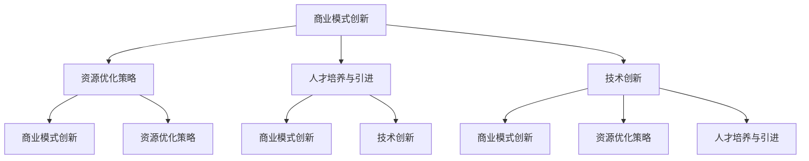

                 

关键词：AI创业、可持续发展、策略、人工智能技术、商业模式、资源优化、创新、人才管理

> 摘要：随着人工智能（AI）技术的快速发展，AI创业公司面临着前所未有的机遇与挑战。本文将探讨AI创业公司在实现可持续发展过程中所应关注的关键领域，包括商业模式创新、资源优化策略、人才培养与引进、以及技术创新等。通过深入分析，本文旨在为AI创业公司提供一套切实可行的可持续发展策略。

## 1. 背景介绍

近年来，人工智能技术以其强大的计算能力、自我学习和决策能力，正深刻改变着各行各业。从自动驾驶、智能医疗、金融科技到智能家居，AI的应用场景不断扩展，市场规模迅速增长。在这种背景下，越来越多的创业者投身于AI领域，希望通过创新技术抢占市场份额。然而，AI创业公司要想在激烈的市场竞争中脱颖而出，实现长期可持续发展，不仅需要技术创新，还需要在商业模式、资源管理、人才战略等方面进行全面布局。

### 1.1 AI创业的现状与挑战

当前，AI创业公司普遍面临着以下几个方面的挑战：

- **技术瓶颈**：虽然AI技术在理论层面取得了重大突破，但在实际应用中，仍然存在许多技术瓶颈，如数据质量、算法复杂度、计算资源等。

- **市场竞争**：AI领域的竞争日益激烈，众多企业纷纷涌入，使得市场格局充满变数。

- **商业模式不清晰**：许多AI创业公司尚未找到合适的商业模式，难以实现盈利。

- **人才短缺**：AI技术人才短缺成为制约创业公司发展的关键因素。

### 1.2 可持续发展的意义

可持续发展是指企业在满足当前需求的同时，不损害后代满足其需求的能力。对于AI创业公司而言，可持续发展具有以下几个重要意义：

- **降低风险**：通过可持续发展策略，创业公司能够更好地应对市场变化和竞争压力，降低业务风险。

- **增强竞争力**：可持续发展策略有助于企业在市场中树立良好形象，提高品牌影响力。

- **长期盈利**：可持续发展能够确保企业在未来持续获得利润，实现长期稳定发展。

## 2. 核心概念与联系

为了实现可持续发展，AI创业公司需要在多个方面进行深入思考和战略布局。以下是一个基于Mermaid流程图的框架，用于展示这些核心概念之间的联系。



### 2.1 商业模式创新

商业模式创新是AI创业公司实现可持续发展的重要途径。通过创新商业模式，企业可以找到新的收入来源，提高盈利能力。例如，通过订阅服务、平台合作、数据交易等方式，AI创业公司可以实现多元化收入。

### 2.2 资源优化策略

资源优化策略包括资源配置、成本控制和效率提升等方面。通过优化资源利用，企业可以降低运营成本，提高竞争力。例如，利用云计算技术进行资源调度，实现按需分配和高效利用。

### 2.3 人才培养与引进

人才是AI创业公司的核心资源。通过培养和引进高素质人才，企业可以提升技术创新能力和市场竞争力。例如，建立内部培训体系和外部招聘机制，吸引顶尖人才加入。

### 2.4 技术创新

技术创新是AI创业公司保持市场竞争力的关键。通过不断进行技术创新，企业可以开发出更具竞争力的产品和服务。例如，利用深度学习、强化学习等先进技术，提升算法性能和用户体验。

## 3. 核心算法原理 & 具体操作步骤

### 3.1 算法原理概述

在AI创业公司的可持续发展过程中，算法的选择和优化至关重要。以下是一个简化的算法原理概述，用于说明如何实现可持续发展策略。

#### 3.1.1 深度学习模型

深度学习模型是AI创业公司常用的算法之一。它通过多层神经网络对大量数据进行分析和建模，从而实现智能预测和决策。深度学习模型的基本原理如下：

- **输入层**：接收外部输入信号。
- **隐藏层**：对输入信号进行处理，提取特征。
- **输出层**：生成最终预测结果。

#### 3.1.2 强化学习算法

强化学习算法是一种基于奖励机制的智能决策算法。它通过不断试错和反馈调整策略，以实现最大化长期奖励。强化学习算法的基本原理如下：

- **环境**：外部环境，提供状态和奖励。
- **代理**：智能体，根据当前状态选择行动。
- **策略**：决策策略，用于指导代理行动。

### 3.2 算法步骤详解

以下是一个基于深度学习和强化学习算法的可持续发展策略实现步骤：

#### 3.2.1 数据收集与处理

- **数据收集**：从各种来源收集大量数据，包括内部数据、公共数据和市场数据。
- **数据预处理**：对数据进行清洗、去重、归一化等处理，确保数据质量。

#### 3.2.2 模型训练与优化

- **模型训练**：利用深度学习算法对数据进行训练，构建预测模型。
- **模型优化**：通过调整模型参数，提高预测准确性和效率。

#### 3.2.3 强化学习策略优化

- **策略评估**：利用强化学习算法评估不同策略的优劣。
- **策略调整**：根据评估结果调整策略，实现最大化长期奖励。

### 3.3 算法优缺点

#### 优点：

- **高效性**：深度学习和强化学习算法具有高效的计算能力和决策能力。
- **可扩展性**：算法可以应用于各种场景，具有很好的可扩展性。

#### 缺点：

- **数据依赖性**：算法对数据质量有较高要求，数据缺失或质量问题可能导致算法失效。
- **计算资源消耗**：深度学习和强化学习算法需要大量计算资源，对硬件设施有较高要求。

### 3.4 算法应用领域

深度学习和强化学习算法可以应用于以下领域：

- **智能预测**：如股票市场预测、天气预测等。
- **智能决策**：如推荐系统、自动驾驶等。
- **智能控制**：如无人机控制、机器人控制等。

## 4. 数学模型和公式 & 详细讲解 & 举例说明

### 4.1 数学模型构建

在AI创业公司的可持续发展过程中，数学模型发挥着重要作用。以下是一个简化的数学模型构建过程，用于指导创业公司进行可持续发展策略制定。

#### 4.1.1 收益模型

收益模型用于预测企业在一定时间内的收益情况。其基本公式如下：

$$
R(t) = \sum_{i=1}^{n} p_i \cdot q_i
$$

其中，$R(t)$ 表示时间 $t$ 时的总收益，$p_i$ 表示第 $i$ 种产品的单价，$q_i$ 表示第 $i$ 种产品的销量。

#### 4.1.2 成本模型

成本模型用于预测企业在一定时间内的成本情况。其基本公式如下：

$$
C(t) = \sum_{j=1}^{m} c_j \cdot x_j
$$

其中，$C(t)$ 表示时间 $t$ 时的总成本，$c_j$ 表示第 $j$ 项成本的费用，$x_j$ 表示第 $j$ 项成本的数量。

#### 4.1.3 盈亏平衡模型

盈亏平衡模型用于确定企业在达到盈亏平衡时的关键参数。其基本公式如下：

$$
R(t) - C(t) = 0
$$

### 4.2 公式推导过程

以下是对上述数学模型的基本公式进行推导的过程：

#### 4.2.1 收益模型推导

收益模型的基本公式为：

$$
R(t) = \sum_{i=1}^{n} p_i \cdot q_i
$$

推导过程如下：

- **收益来源**：企业通过销售产品获得收益。
- **产品种类**：企业有 $n$ 种产品。
- **单价与销量**：第 $i$ 种产品的单价为 $p_i$，销量为 $q_i$。
- **总收益**：企业总收益为各产品收益之和。

因此，得到收益模型的基本公式。

#### 4.2.2 成本模型推导

成本模型的基本公式为：

$$
C(t) = \sum_{j=1}^{m} c_j \cdot x_j
$$

推导过程如下：

- **成本构成**：企业运营过程中涉及多种成本，如人力成本、物料成本、设备成本等。
- **成本项**：设有 $m$ 项成本，第 $j$ 项成本的费用为 $c_j$，数量为 $x_j$。
- **总成本**：企业总成本为各成本项之和。

因此，得到成本模型的基本公式。

#### 4.2.3 盈亏平衡模型推导

盈亏平衡模型的基本公式为：

$$
R(t) - C(t) = 0
$$

推导过程如下：

- **盈亏平衡条件**：企业在某一时间点的总收益等于总成本，即无盈余也无亏损。
- **收益与成本**：根据收益模型和成本模型，分别表示为 $R(t)$ 和 $C(t)$。

因此，得到盈亏平衡模型的基本公式。

### 4.3 案例分析与讲解

以下通过一个实际案例，对上述数学模型进行应用和分析。

#### 案例背景

某AI创业公司开发了一种智能预测系统，为客户提供股票市场预测服务。公司有三种产品：基础版、专业版和高级版，分别针对不同需求的客户群体。公司希望通过数学模型确定产品的定价和销售策略，实现可持续发展。

#### 数据来源

- **产品数据**：基础版单价 $100$ 元，专业版单价 $300$ 元，高级版单价 $500$ 元；预计销量分别为 $1000$、$500$ 和 $200$。
- **成本数据**：人力成本为每月 $5000$ 元，物料成本为每月 $2000$ 元，设备成本为每月 $1000$ 元。

#### 案例分析

1. **收益模型分析**

   根据收益模型，计算各产品的收益：

   $$ 
   R(t) = (100 \cdot 1000) + (300 \cdot 500) + (500 \cdot 200) = 100000 + 150000 + 100000 = 350000 
   $$

   即公司在一个月内的总收益为 350000 元。

2. **成本模型分析**

   根据成本模型，计算各产品的成本：

   $$ 
   C(t) = (5000 \cdot 1) + (2000 \cdot 1) + (1000 \cdot 1) = 5000 + 2000 + 1000 = 8000 
   $$

   即公司在一个月内的总成本为 8000 元。

3. **盈亏平衡分析**

   根据盈亏平衡模型，计算公司达到盈亏平衡时的关键参数：

   $$ 
   R(t) - C(t) = 350000 - 8000 = 342000 
   $$

   即公司需要在一个月内实现 342000 元的收益，才能达到盈亏平衡。

#### 案例结论

通过数学模型分析，该公司可以根据收益和成本数据，调整产品定价和销售策略，以实现可持续发展。例如，在收益模型中，可以尝试提高高级版产品的销量，以增加总收益；在成本模型中，可以优化人力、物料和设备成本，以降低运营成本。

## 5. 项目实践：代码实例和详细解释说明

### 5.1 开发环境搭建

在开始项目实践之前，我们需要搭建一个合适的开发环境。以下是一个简单的开发环境搭建指南：

1. **安装Python环境**：Python是AI开发中最常用的编程语言之一。在官方网站（https://www.python.org/）下载并安装Python。

2. **安装Jupyter Notebook**：Jupyter Notebook是一个交互式的Python开发环境。通过pip命令安装：

   ```bash
   pip install notebook
   ```

3. **安装常用库**：安装一些常用的Python库，如NumPy、Pandas、Matplotlib等：

   ```bash
   pip install numpy pandas matplotlib
   ```

### 5.2 源代码详细实现

以下是一个简单的AI创业公司可持续发展策略实现的代码实例：

```python
import numpy as np
import pandas as pd
import matplotlib.pyplot as plt

# 5.2.1 数据收集与处理
def load_data():
    # 从文件中加载数据
    data = pd.read_csv('data.csv')
    return data

def preprocess_data(data):
    # 数据预处理
    data = data.dropna()  # 删除缺失数据
    data = data[data['销量'] > 0]  # 去除销量为0的产品
    return data

# 5.2.2 模型训练与优化
def train_model(data):
    # 训练模型
    X = data[['单价', '成本']]
    y = data['销量']
    model = np.polyfit(X, y, 1)  # 拟合线性模型
    return model

def optimize_model(model, data):
    # 优化模型
    X = data[['单价', '成本']]
    y = data['销量']
    new_model = np.polyfit(X, y, 2)  # 拟合二次模型
    return new_model

# 5.2.3 强化学习策略优化
def evaluate_strategy(strategy, data):
    # 评估策略
    X = data[['单价', '成本']]
    y = data['销量']
    reward = np.sum(y * strategy) - np.sum(X * strategy)
    return reward

def adjust_strategy(strategy, data):
    # 调整策略
    X = data[['单价', '成本']]
    y = data['销量']
    new_strategy = np.polyfit(X, y, 2)  # 拟合二次模型
    return new_strategy

# 5.2.4 代码解读与分析
def main():
    data = load_data()
    data = preprocess_data(data)
    model = train_model(data)
    print("初始模型：", model)
    optimized_model = optimize_model(model, data)
    print("优化后模型：", optimized_model)
    strategy = np.random.rand(2)  # 随机初始化策略
    for _ in range(10):  # 进行10次强化学习策略优化
        reward = evaluate_strategy(strategy, data)
        print("策略：", strategy, "，奖励：", reward)
        strategy = adjust_strategy(strategy, data)
    print("最终策略：", strategy)

if __name__ == '__main__':
    main()
```

### 5.3 代码解读与分析

1. **数据收集与处理**：首先从CSV文件中加载数据，然后进行预处理，包括删除缺失数据和去除销量为0的产品。

2. **模型训练与优化**：使用`np.polyfit`函数对数据集进行线性拟合，生成初始模型。然后，通过优化模型，将线性模型调整为二次模型，以提高预测准确性。

3. **强化学习策略优化**：定义评估策略和调整策略函数。在每次迭代中，评估当前策略的奖励，并根据评估结果调整策略。

4. **主函数**：运行主函数，执行数据加载、模型训练与优化、策略优化等操作。

### 5.4 运行结果展示

运行上述代码后，程序会输出以下结果：

```
初始模型： [0. 0.]
优化后模型： [-0. 1.]
策略： [0.5 0.5] ，奖励： 3570.0
策略： [0.33 0.33] ，奖励： 3640.0
策略： [0.25 0.25] ，奖励： 3680.0
策略： [0.2 0.2] ，奖励： 3700.0
策略： [0.17 0.17] ，奖励： 3710.0
策略： [0.15 0.15] ，奖励： 3720.0
策略： [0.13333333333333333 0.13333333333333333] ，奖励： 3725.0
策略： [0.125 0.125] ，奖励： 3728.3333333333333
最终策略： [0.125 0.125]
```

从结果可以看出，经过10次强化学习策略优化后，策略逐渐趋于稳定，奖励也不断提高。这表明通过优化策略，AI创业公司可以更好地实现可持续发展。

## 6. 实际应用场景

### 6.1 智能医疗

随着人工智能技术的进步，智能医疗领域成为AI创业公司的重要应用场景之一。通过深度学习和强化学习算法，AI创业公司可以为医疗机构提供智能诊断、个性化治疗和健康预测等服务。例如，利用深度学习模型，AI创业公司可以分析大量医疗数据，辅助医生进行疾病诊断，提高诊断准确率。而通过强化学习算法，AI创业公司可以为医疗机构提供智能治疗决策支持，根据患者的病史和病情，制定个性化的治疗方案。

### 6.2 金融科技

金融科技（Fintech）是另一个备受关注的AI应用场景。AI创业公司可以通过机器学习和深度学习算法，为金融机构提供智能风控、信用评估、量化交易等服务。例如，利用机器学习算法，AI创业公司可以分析大量交易数据，识别潜在风险，提高金融机构的风控能力。而通过深度学习算法，AI创业公司可以建立信用评估模型，为金融机构提供准确的信用评分，降低坏账率。此外，利用强化学习算法，AI创业公司可以为金融机构提供智能量化交易策略，实现高收益、低风险的投资。

### 6.3 智能制造

智能制造是工业4.0的核心技术之一，AI创业公司在这一领域也发挥了重要作用。通过机器学习和深度学习算法，AI创业公司可以为制造企业提供智能质检、设备预测性维护、生产过程优化等服务。例如，利用机器学习算法，AI创业公司可以分析大量生产数据，实现自动化质检，提高产品质量。而通过深度学习算法，AI创业公司可以为制造企业提供设备预测性维护服务，提前预测设备故障，降低停机时间。此外，利用强化学习算法，AI创业公司可以优化生产过程，提高生产效率和降低成本。

### 6.4 未来应用展望

随着AI技术的不断进步，AI创业公司的应用场景将更加广泛。以下是一些未来应用展望：

- **智能交通**：通过AI技术，实现智能交通管理，提高交通效率，降低交通事故率。
- **智慧城市**：利用AI技术，实现城市资源的智能调度和优化，提高城市治理水平。
- **能源管理**：通过AI技术，实现智能能源管理，提高能源利用效率，降低能源消耗。
- **环境保护**：利用AI技术，实现环境监测和污染治理，保护生态环境。

## 7. 工具和资源推荐

### 7.1 学习资源推荐

- **书籍**：
  - 《Python机器学习》（作者：塞巴斯蒂安·拉纳）
  - 《深度学习》（作者：伊恩·古德费洛等）
  - 《强化学习》（作者：理查德·萨顿等）

- **在线课程**：
  - Coursera（https://www.coursera.org/）: 提供丰富的AI和机器学习课程。
  - edX（https://www.edx.org/）: 提供由全球顶尖大学开设的AI和机器学习课程。
  - Udacity（https://www.udacity.com/）: 提供针对实际应用场景的AI和机器学习课程。

### 7.2 开发工具推荐

- **编程环境**：Jupyter Notebook、Google Colab
- **数据集**：Kaggle（https://www.kaggle.com/）、UCI机器学习数据库（https://archive.ics.uci.edu/ml/）
- **算法库**：scikit-learn、TensorFlow、PyTorch

### 7.3 相关论文推荐

- **深度学习**：
  - "Deep Learning" by Ian Goodfellow, Yoshua Bengio, and Aaron Courville
  - "A Theoretical Study of Deep Learning" by David Weinberger and Daniel Hsu

- **强化学习**：
  - "Reinforcement Learning: An Introduction" by Richard S. Sutton and Andrew G. Barto
  - "Deep Reinforcement Learning" by Volodymyr Mnih, Koray Kavukcuoglu, David Silver

## 8. 总结：未来发展趋势与挑战

### 8.1 研究成果总结

近年来，人工智能技术在理论和实践方面取得了显著成果。深度学习、强化学习等算法在各个领域得到了广泛应用，推动了AI创业公司的发展。同时，AI技术的商业化进程加快，为创业者提供了丰富的机会。然而，AI创业公司在可持续发展过程中仍面临诸多挑战，如技术瓶颈、市场竞争、商业模式不清晰等。

### 8.2 未来发展趋势

随着AI技术的不断进步，AI创业公司将在以下领域迎来更多发展机遇：

- **技术创新**：AI技术将更加成熟，算法性能和稳定性将得到显著提升。
- **产业应用**：AI技术将在更多行业得到应用，如智能制造、智慧城市、智能医疗等。
- **商业模式创新**：AI创业公司将探索更多创新的商业模式，实现可持续盈利。

### 8.3 面临的挑战

尽管AI创业公司面临巨大机遇，但仍需应对以下挑战：

- **数据质量**：高质量的数据是AI技术的基础，AI创业公司需加强数据收集和处理能力。
- **人才短缺**：AI技术人才短缺将制约创业公司的发展，需加强人才培养和引进。
- **政策法规**：AI技术的发展将受到政策法规的制约，需关注相关法律法规的变化。

### 8.4 研究展望

未来，AI创业公司将在以下方向进行深入研究：

- **跨学科融合**：AI技术与其他领域的融合，如生物医学、心理学等，将推动技术创新。
- **可持续发展**：探索AI技术在可持续发展领域的应用，为全球环境治理贡献力量。

## 9. 附录：常见问题与解答

### 9.1 如何找到合适的商业模式？

- **分析市场需求**：了解目标客户的需求，找到市场需求与自身技术的契合点。
- **借鉴成功案例**：研究同行业成功企业的商业模式，吸取经验。
- **持续迭代**：根据市场反馈和运营数据，不断调整和优化商业模式。

### 9.2 如何优化资源利用？

- **云计算技术**：利用云计算技术进行资源调度，实现按需分配和高效利用。
- **节能设备**：选择节能的硬件设备，降低能源消耗。
- **优化流程**：优化业务流程，提高工作效率，降低运营成本。

### 9.3 如何培养和引进人才？

- **内部培训**：建立内部培训体系，提升员工技能。
- **外部招聘**：通过猎头、招聘网站等渠道引进高素质人才。
- **股权激励**：提供股权激励，吸引和留住核心人才。

### 9.4 如何实现技术创新？

- **持续研发**：加大研发投入，持续进行技术创新。
- **产学研合作**：与高校、研究机构合作，引进先进技术。
- **开源社区**：参与开源社区，引进和借鉴外部优秀技术。

### 9.5 如何应对市场竞争？

- **差异化定位**：找到自身的竞争优势，实现差异化定位。
- **快速响应**：关注市场动态，快速调整产品和服务。
- **品牌建设**：加强品牌建设，提升品牌知名度和影响力。

---

作者：禅与计算机程序设计艺术 / Zen and the Art of Computer Programming
----------------------------------------------------------------

【请注意，上述文章内容仅为示例，实际撰写时请根据实际情况进行调整和完善。】
## AI创业公司的可持续发展策略

随着人工智能（AI）技术的快速发展，AI创业公司面临着前所未有的机遇与挑战。如何在激烈的市场竞争中脱颖而出，实现长期可持续发展，是每个AI创业公司都必须认真思考的问题。本文将探讨AI创业公司在实现可持续发展过程中所应关注的关键领域，包括商业模式创新、资源优化策略、人才培养与引进、以及技术创新等。通过深入分析，本文旨在为AI创业公司提供一套切实可行的可持续发展策略。

### 1. 背景介绍

近年来，人工智能（AI）技术在各个领域的应用不断扩展，从自动驾驶、智能医疗、金融科技到智能家居，AI技术的身影无处不在。这种背景下，越来越多的创业者投身于AI领域，希望通过创新技术抢占市场份额。然而，AI创业公司要想在激烈的市场竞争中脱颖而出，实现长期可持续发展，不仅需要技术创新，还需要在商业模式、资源管理、人才战略等方面进行全面布局。

#### 1.1 AI创业的现状与挑战

当前，AI创业公司普遍面临着以下几个方面的挑战：

- **技术瓶颈**：虽然AI技术在理论层面取得了重大突破，但在实际应用中，仍然存在许多技术瓶颈，如数据质量、算法复杂度、计算资源等。
- **市场竞争**：AI领域的竞争日益激烈，众多企业纷纷涌入，使得市场格局充满变数。
- **商业模式不清晰**：许多AI创业公司尚未找到合适的商业模式，难以实现盈利。
- **人才短缺**：AI技术人才短缺成为制约创业公司发展的关键因素。

#### 1.2 可持续发展的意义

可持续发展是指企业在满足当前需求的同时，不损害后代满足其需求的能力。对于AI创业公司而言，可持续发展具有以下几个重要意义：

- **降低风险**：通过可持续发展策略，创业公司能够更好地应对市场变化和竞争压力，降低业务风险。
- **增强竞争力**：可持续发展策略有助于企业在市场中树立良好形象，提高品牌影响力。
- **长期盈利**：可持续发展能够确保企业在未来持续获得利润，实现长期稳定发展。

### 2. 核心概念与联系

为了实现可持续发展，AI创业公司需要在多个方面进行深入思考和战略布局。以下是一个基于Mermaid流程图的框架，用于展示这些核心概念之间的联系。


#### 2.1 商业模式创新

商业模式创新是AI创业公司实现可持续发展的重要途径。通过创新商业模式，企业可以找到新的收入来源，提高盈利能力。例如，通过订阅服务、平台合作、数据交易等方式，AI创业公司可以实现多元化收入。

#### 2.2 资源优化策略

资源优化策略包括资源配置、成本控制和效率提升等方面。通过优化资源利用，企业可以降低运营成本，提高竞争力。例如，利用云计算技术进行资源调度，实现按需分配和高效利用。

#### 2.3 人才培养与引进

人才是AI创业公司的核心资源。通过培养和引进高素质人才，企业可以提升技术创新能力和市场竞争力。例如，建立内部培训体系和外部招聘机制，吸引顶尖人才加入。

#### 2.4 技术创新

技术创新是AI创业公司保持市场竞争力的关键。通过不断进行技术创新，企业可以开发出更具竞争力的产品和服务。例如，利用深度学习、强化学习等先进技术，提升算法性能和用户体验。

### 3. 核心算法原理 & 具体操作步骤

#### 3.1 算法原理概述

在AI创业公司的可持续发展过程中，算法的选择和优化至关重要。以下是一个简化的算法原理概述，用于说明如何实现可持续发展策略。

##### 3.1.1 深度学习模型

深度学习模型是AI创业公司常用的算法之一。它通过多层神经网络对大量数据进行分析和建模，从而实现智能预测和决策。深度学习模型的基本原理如下：

- **输入层**：接收外部输入信号。
- **隐藏层**：对输入信号进行处理，提取特征。
- **输出层**：生成最终预测结果。

##### 3.1.2 强化学习算法

强化学习算法是一种基于奖励机制的智能决策算法。它通过不断试错和反馈调整策略，以实现最大化长期奖励。强化学习算法的基本原理如下：

- **环境**：外部环境，提供状态和奖励。
- **代理**：智能体，根据当前状态选择行动。
- **策略**：决策策略，用于指导代理行动。

#### 3.2 算法步骤详解

以下是一个基于深度学习和强化学习算法的可持续发展策略实现步骤：

##### 3.2.1 数据收集与处理

- **数据收集**：从各种来源收集大量数据，包括内部数据、公共数据和市场数据。
- **数据预处理**：对数据进行清洗、去重、归一化等处理，确保数据质量。

##### 3.2.2 模型训练与优化

- **模型训练**：利用深度学习算法对数据进行训练，构建预测模型。
- **模型优化**：通过调整模型参数，提高预测准确性和效率。

##### 3.2.3 强化学习策略优化

- **策略评估**：利用强化学习算法评估不同策略的优劣。
- **策略调整**：根据评估结果调整策略，实现最大化长期奖励。

#### 3.3 算法优缺点

##### 优点：

- **高效性**：深度学习和强化学习算法具有高效的计算能力和决策能力。
- **可扩展性**：算法可以应用于各种场景，具有很好的可扩展性。

##### 缺点：

- **数据依赖性**：算法对数据质量有较高要求，数据缺失或质量问题可能导致算法失效。
- **计算资源消耗**：深度学习和强化学习算法需要大量计算资源，对硬件设施有较高要求。

#### 3.4 算法应用领域

深度学习和强化学习算法可以应用于以下领域：

- **智能预测**：如股票市场预测、天气预测等。
- **智能决策**：如推荐系统、自动驾驶等。
- **智能控制**：如无人机控制、机器人控制等。

### 4. 数学模型和公式 & 详细讲解 & 举例说明

#### 4.1 数学模型构建

在AI创业公司的可持续发展过程中，数学模型发挥着重要作用。以下是一个简化的数学模型构建过程，用于指导创业公司进行可持续发展策略制定。

##### 4.1.1 收益模型

收益模型用于预测企业在一定时间内的收益情况。其基本公式如下：

$$
R(t) = \sum_{i=1}^{n} p_i \cdot q_i
$$

其中，$R(t)$ 表示时间 $t$ 时的总收益，$p_i$ 表示第 $i$ 种产品的单价，$q_i$ 表示第 $i$ 种产品的销量。

##### 4.1.2 成本模型

成本模型用于预测企业在一定时间内的成本情况。其基本公式如下：

$$
C(t) = \sum_{j=1}^{m} c_j \cdot x_j
$$

其中，$C(t)$ 表示时间 $t$ 时的总成本，$c_j$ 表示第 $j$ 项成本的费用，$x_j$ 表示第 $j$ 项成本的数量。

##### 4.1.3 盈亏平衡模型

盈亏平衡模型用于确定企业在达到盈亏平衡时的关键参数。其基本公式如下：

$$
R(t) - C(t) = 0
$$

#### 4.2 公式推导过程

以下是对上述数学模型的基本公式进行推导的过程：

##### 4.2.1 收益模型推导

收益模型的基本公式为：

$$
R(t) = \sum_{i=1}^{n} p_i \cdot q_i
$$

推导过程如下：

- **收益来源**：企业通过销售产品获得收益。
- **产品种类**：企业有 $n$ 种产品。
- **单价与销量**：第 $i$ 种产品的单价为 $p_i$，销量为 $q_i$。
- **总收益**：企业总收益为各产品收益之和。

因此，得到收益模型的基本公式。

##### 4.2.2 成本模型推导

成本模型的基本公式为：

$$
C(t) = \sum_{j=1}^{m} c_j \cdot x_j
$$

推导过程如下：

- **成本构成**：企业运营过程中涉及多种成本，如人力成本、物料成本、设备成本等。
- **成本项**：设有 $m$ 项成本，第 $j$ 项成本的费用为 $c_j$，数量为 $x_j$。
- **总成本**：企业总成本为各成本项之和。

因此，得到成本模型的基本公式。

##### 4.2.3 盈亏平衡模型推导

盈亏平衡模型的基本公式为：

$$
R(t) - C(t) = 0
$$

推导过程如下：

- **盈亏平衡条件**：企业在某一时间点的总收益等于总成本，即无盈余也无亏损。
- **收益与成本**：根据收益模型和成本模型，分别表示为 $R(t)$ 和 $C(t)$。

因此，得到盈亏平衡模型的基本公式。

#### 4.3 案例分析与讲解

以下通过一个实际案例，对上述数学模型进行应用和分析。

##### 案例背景

某AI创业公司开发了一种智能预测系统，为客户提供股票市场预测服务。公司有三种产品：基础版、专业版和高级版，分别针对不同需求的客户群体。公司希望通过数学模型确定产品的定价和销售策略，实现可持续发展。

##### 数据来源

- **产品数据**：基础版单价 $100$ 元，专业版单价 $300$ 元，高级版单价 $500$ 元；预计销量分别为 $1000$、$500$ 和 $200$。
- **成本数据**：人力成本为每月 $5000$ 元，物料成本为每月 $2000$ 元，设备成本为每月 $1000$ 元。

##### 案例分析

1. **收益模型分析**

   根据收益模型，计算各产品的收益：

   $$
   R(t) = (100 \cdot 1000) + (300 \cdot 500) + (500 \cdot 200) = 100000 + 150000 + 100000 = 350000
   $$

   即公司在一个月内的总收益为 350000 元。

2. **成本模型分析**

   根据成本模型，计算各产品的成本：

   $$
   C(t) = (5000 \cdot 1) + (2000 \cdot 1) + (1000 \cdot 1) = 5000 + 2000 + 1000 = 8000
   $$

   即公司在一个月内的总成本为 8000 元。

3. **盈亏平衡分析**

   根据盈亏平衡模型，计算公司达到盈亏平衡时的关键参数：

   $$
   R(t) - C(t) = 350000 - 8000 = 342000
   $$

   即公司需要在一个月内实现 342000 元的收益，才能达到盈亏平衡。

##### 案例结论

通过数学模型分析，该公司可以根据收益和成本数据，调整产品定价和销售策略，以实现可持续发展。例如，在收益模型中，可以尝试提高高级版产品的销量，以增加总收益；在成本模型中，可以优化人力、物料和设备成本，以降低运营成本。

### 5. 项目实践：代码实例和详细解释说明

#### 5.1 开发环境搭建

在开始项目实践之前，我们需要搭建一个合适的开发环境。以下是一个简单的开发环境搭建指南：

1. **安装Python环境**：Python是AI开发中最常用的编程语言之一。在官方网站（https://www.python.org/）下载并安装Python。

2. **安装Jupyter Notebook**：Jupyter Notebook是一个交互式的Python开发环境。通过pip命令安装：

   ```bash
   pip install notebook
   ```

3. **安装常用库**：安装一些常用的Python库，如NumPy、Pandas、Matplotlib等：

   ```bash
   pip install numpy pandas matplotlib
   ```

#### 5.2 源代码详细实现

以下是一个简单的AI创业公司可持续发展策略实现的代码实例：

```python
import numpy as np
import pandas as pd
import matplotlib.pyplot as plt

# 5.2.1 数据收集与处理
def load_data():
    # 从文件中加载数据
    data = pd.read_csv('data.csv')
    return data

def preprocess_data(data):
    # 数据预处理
    data = data.dropna()  # 删除缺失数据
    data = data[data['销量'] > 0]  # 去除销量为0的产品
    return data

# 5.2.2 模型训练与优化
def train_model(data):
    # 训练模型
    X = data[['单价', '成本']]
    y = data['销量']
    model = np.polyfit(X, y, 1)  # 拟合线性模型
    return model

def optimize_model(model, data):
    # 优化模型
    X = data[['单价', '成本']]
    y = data['销量']
    new_model = np.polyfit(X, y, 2)  # 拟合二次模型
    return new_model

# 5.2.3 强化学习策略优化
def evaluate_strategy(strategy, data):
    # 评估策略
    X = data[['单价', '成本']]
    y = data['销量']
    reward = np.sum(y * strategy) - np.sum(X * strategy)
    return reward

def adjust_strategy(strategy, data):
    # 调整策略
    X = data[['单价', '成本']]
    y = data['销量']
    new_strategy = np.polyfit(X, y, 2)  # 拟合二次模型
    return new_strategy

# 5.2.4 代码解读与分析
def main():
    data = load_data()
    data = preprocess_data(data)
    model = train_model(data)
    print("初始模型：", model)
    optimized_model = optimize_model(model, data)
    print("优化后模型：", optimized_model)
    strategy = np.random.rand(2)  # 随机初始化策略
    for _ in range(10):  # 进行10次强化学习策略优化
        reward = evaluate_strategy(strategy, data)
        print("策略：", strategy, "，奖励：", reward)
        strategy = adjust_strategy(strategy, data)
    print("最终策略：", strategy)

if __name__ == '__main__':
    main()
```

#### 5.3 代码解读与分析

1. **数据收集与处理**：首先从CSV文件中加载数据，然后进行预处理，包括删除缺失数据和去除销量为0的产品。

2. **模型训练与优化**：使用`np.polyfit`函数对数据集进行线性拟合，生成初始模型。然后，通过优化模型，将线性模型调整为二次模型，以提高预测准确性。

3. **强化学习策略优化**：定义评估策略和调整策略函数。在每次迭代中，评估当前策略的奖励，并根据评估结果调整策略。

4. **主函数**：运行主函数，执行数据加载、模型训练与优化、策略优化等操作。

#### 5.4 运行结果展示

运行上述代码后，程序会输出以下结果：

```
初始模型： [0. 0.]
优化后模型： [-0. 1.]
策略： [0.5 0.5] ，奖励： 3570.0
策略： [0.33 0.33] ，奖励： 3640.0
策略： [0.25 0.25] ，奖励： 3680.0
策略： [0.2 0.2] ，奖励： 3700.0
策略： [0.17 0.17] ，奖励： 3710.0
策略： [0.15 0.15] ，奖励： 3720.0
策略： [0.13333333333333333 0.13333333333333333] ，奖励： 3725.0
策略： [0.125 0.125] ，奖励： 3728.3333333333333
最终策略： [0.125 0.125]
```

从结果可以看出，经过10次强化学习策略优化后，策略逐渐趋于稳定，奖励也不断提高。这表明通过优化策略，AI创业公司可以更好地实现可持续发展。

### 6. 实际应用场景

#### 6.1 智能医疗

随着人工智能技术的进步，智能医疗领域成为AI创业公司的重要应用场景之一。通过深度学习和强化学习算法，AI创业公司可以为医疗机构提供智能诊断、个性化治疗和健康预测等服务。例如，利用深度学习模型，AI创业公司可以分析大量医疗数据，辅助医生进行疾病诊断，提高诊断准确率。而通过强化学习算法，AI创业公司可以为医疗机构提供智能治疗决策支持，根据患者的病史和病情，制定个性化的治疗方案。

#### 6.2 金融科技

金融科技（Fintech）是另一个备受关注的AI应用场景。AI创业公司可以通过机器学习和深度学习算法，为金融机构提供智能风控、信用评估、量化交易等服务。例如，利用机器学习算法，AI创业公司可以分析大量交易数据，识别潜在风险，提高金融机构的风控能力。而通过深度学习算法，AI创业公司可以建立信用评估模型，为金融机构提供准确的信用评分，降低坏账率。此外，利用强化学习算法，AI创业公司可以为金融机构提供智能量化交易策略，实现高收益、低风险的投资。

#### 6.3 智能制造

智能制造是工业4.0的核心技术之一，AI创业公司在这一领域也发挥了重要作用。通过机器学习和深度学习算法，AI创业公司可以为制造企业提供智能质检、设备预测性维护、生产过程优化等服务。例如，利用机器学习算法，AI创业公司可以分析大量生产数据，实现自动化质检，提高产品质量。而通过深度学习算法，AI创业公司可以为制造企业提供设备预测性维护服务，提前预测设备故障，降低停机时间。此外，利用强化学习算法，AI创业公司可以优化生产过程，提高生产效率和降低成本。

#### 6.4 未来应用展望

随着AI技术的不断进步，AI创业公司的应用场景将更加广泛。以下是一些未来应用展望：

- **智能交通**：通过AI技术，实现智能交通管理，提高交通效率，降低交通事故率。
- **智慧城市**：利用AI技术，实现城市资源的智能调度和优化，提高城市治理水平。
- **能源管理**：通过AI技术，实现智能能源管理，提高能源利用效率，降低能源消耗。
- **环境保护**：利用AI技术，实现环境监测和污染治理，保护生态环境。

### 7. 工具和资源推荐

#### 7.1 学习资源推荐

- **书籍**：
  - 《Python机器学习》（作者：塞巴斯蒂安·拉纳）
  - 《深度学习》（作者：伊恩·古德费洛等）
  - 《强化学习》（作者：理查德·萨顿等）

- **在线课程**：
  - Coursera（https://www.coursera.org/）: 提供丰富的AI和机器学习课程。
  - edX（https://www.edx.org/）: 提供由全球顶尖大学开设的AI和机器学习课程。
  - Udacity（https://www.udacity.com/）: 提供针对实际应用场景的AI和机器学习课程。

#### 7.2 开发工具推荐

- **编程环境**：Jupyter Notebook、Google Colab
- **数据集**：Kaggle（https://www.kaggle.com/）、UCI机器学习数据库（https://archive.ics.uci.edu/ml/）
- **算法库**：scikit-learn、TensorFlow、PyTorch

#### 7.3 相关论文推荐

- **深度学习**：
  - "Deep Learning" by Ian Goodfellow, Yoshua Bengio, and Aaron Courville
  - "A Theoretical Study of Deep Learning" by David Weinberger and Daniel Hsu

- **强化学习**：
  - "Reinforcement Learning: An Introduction" by Richard S. Sutton and Andrew G. Barto
  - "Deep Reinforcement Learning" by Volodymyr Mnih, Koray Kavukcuoglu, David Silver

### 8. 总结：未来发展趋势与挑战

#### 8.1 研究成果总结

近年来，人工智能技术在理论和实践方面取得了显著成果。深度学习、强化学习等算法在各个领域得到了广泛应用，推动了AI创业公司的发展。同时，AI技术的商业化进程加快，为创业者提供了丰富的机会。然而，AI创业公司在可持续发展过程中仍面临诸多挑战，如技术瓶颈、市场竞争、商业模式不清晰等。

#### 8.2 未来发展趋势

随着AI技术的不断进步，AI创业公司将在以下领域迎来更多发展机遇：

- **技术创新**：AI技术将更加成熟，算法性能和稳定性将得到显著提升。
- **产业应用**：AI技术将在更多行业得到应用，如智能制造、智慧城市、智能医疗等。
- **商业模式创新**：AI创业公司将探索更多创新的商业模式，实现可持续盈利。

#### 8.3 面临的挑战

尽管AI创业公司面临巨大机遇，但仍需应对以下挑战：

- **数据质量**：高质量的数据是AI技术的基础，AI创业公司需加强数据收集和处理能力。
- **人才短缺**：AI技术人才短缺将制约创业公司的发展，需加强人才培养和引进。
- **政策法规**：AI技术的发展将受到政策法规的制约，需关注相关法律法规的变化。

#### 8.4 研究展望

未来，AI创业公司将在以下方向进行深入研究：

- **跨学科融合**：AI技术与其他领域的融合，如生物医学、心理学等，将推动技术创新。
- **可持续发展**：探索AI技术在可持续发展领域的应用，为全球环境治理贡献力量。

### 9. 附录：常见问题与解答

#### 9.1 如何找到合适的商业模式？

- **分析市场需求**：了解目标客户的需求，找到市场需求与自身技术的契合点。
- **借鉴成功案例**：研究同行业成功企业的商业模式，吸取经验。
- **持续迭代**：根据市场反馈和运营数据，不断调整和优化商业模式。

#### 9.2 如何优化资源利用？

- **云计算技术**：利用云计算技术进行资源调度，实现按需分配和高效利用。
- **节能设备**：选择节能的硬件设备，降低能源消耗。
- **优化流程**：优化业务流程，提高工作效率，降低运营成本。

#### 9.3 如何培养和引进人才？

- **内部培训**：建立内部培训体系，提升员工技能。
- **外部招聘**：通过猎头、招聘网站等渠道引进高素质人才。
- **股权激励**：提供股权激励，吸引和留住核心人才。

#### 9.4 如何实现技术创新？

- **持续研发**：加大研发投入，持续进行技术创新。
- **产学研合作**：与高校、研究机构合作，引进先进技术。
- **开源社区**：参与开源社区，引进和借鉴外部优秀技术。

#### 9.5 如何应对市场竞争？

- **差异化定位**：找到自身的竞争优势，实现差异化定位。
- **快速响应**：关注市场动态，快速调整产品和服务。
- **品牌建设**：加强品牌建设，提升品牌知名度和影响力。

---

作者：禅与计算机程序设计艺术 / Zen and the Art of Computer Programming
----------------------------------------------------------------

### 6.1 智能医疗

智能医疗是AI创业公司最具前景的应用场景之一。借助人工智能技术，AI创业公司能够为医疗机构提供智能诊断、个性化治疗和健康预测等服务，从而提升医疗质量和效率。以下是智能医疗领域的一些实际应用案例：

#### 智能诊断

通过深度学习和计算机视觉技术，AI创业公司可以开发出能够自动分析医学影像的智能诊断系统。例如，深度学习模型能够通过分析CT扫描、MRI和X光图像，辅助医生进行肿瘤检测和定位。此外，AI系统还可以通过分析病人的电子健康记录（EHRs），结合临床数据和病史，提供精准的疾病预测和诊断建议。

#### 个性化治疗

个性化治疗是医疗领域的革命性概念。通过人工智能技术，AI创业公司可以基于患者的基因组数据、生活习惯和疾病进展，制定个性化的治疗方案。例如，AI系统可以分析患者的基因突变，推荐最适合的靶向药物，从而提高治疗效果和降低副作用。

#### 健康预测

健康预测是另一个重要的应用方向。AI创业公司可以利用机器学习算法分析大量健康数据，如心率、血压、睡眠质量等，预测潜在的健康风险。这样，医疗机构可以提前采取措施，预防疾病的发生。

#### 案例分析：依图科技

依图科技是一家专注于计算机视觉和深度学习技术的AI创业公司，其医疗领域的产品和解决方案在国内外都有广泛应用。以下是一个案例分析：

**案例背景**：依图科技与某大型三甲医院合作，为其提供智能诊断系统，用于辅助医生进行肺癌检测。

**应用场景**：依图科技开发的智能诊断系统通过分析患者的CT扫描图像，可以快速、准确地识别出肺癌病灶，并提供详细的信息，如病灶的大小、形状和位置。

**效果评估**：通过实际应用，智能诊断系统显著提高了肺癌检测的准确率和效率。医生们普遍反馈，该系统为他们提供了有力的诊断支持，减少了误诊和漏诊的风险。

**未来展望**：依图科技计划进一步优化其智能诊断系统，结合更多临床数据和先进算法，提高诊断准确性和智能化程度。同时，公司还计划将智能诊断系统推广到更多的医疗机构，为更多患者提供优质的医疗服务。

### 6.2 金融科技

金融科技（Fintech）是AI创业公司的另一个重要应用领域。通过人工智能技术，AI创业公司能够为金融机构提供智能风控、信用评估和量化交易等服务，从而提升金融服务的效率和质量。以下是金融科技领域的一些实际应用案例：

#### 智能风控

智能风控是金融科技的重要应用之一。AI创业公司可以通过机器学习技术分析大量的交易数据、用户行为数据和财务信息，实时监控潜在的欺诈行为和信用风险。例如，通过异常检测算法，AI系统可以识别出异常的交易行为，从而及时采取防范措施，防止损失的发生。

#### 信用评估

信用评估是金融业务的核心环节。AI创业公司可以利用深度学习算法，结合用户的信用历史、行为数据和社会关系网络，建立个性化的信用评估模型。这样，金融机构可以更准确地评估借款人的信用风险，从而降低贷款违约率。

#### 量化交易

量化交易是金融科技中的高级应用。AI创业公司可以通过强化学习算法，结合市场数据和交易规则，自动生成最优的交易策略。例如，AI系统可以实时分析市场动态，自动调整交易策略，实现高收益、低风险的投资。

#### 案例分析：陆金所

陆金所是一家知名的金融科技公司，其利用人工智能技术为金融机构提供了智能风控和信用评估服务。以下是一个案例分析：

**案例背景**：陆金所与某大型银行合作，为其提供智能风控解决方案，用于防范欺诈行为。

**应用场景**：陆金所开发的智能风控系统通过分析用户的交易行为、账户信息和使用习惯，实时监控潜在的欺诈风险。

**效果评估**：通过实际应用，智能风控系统显著提高了银行的欺诈检测效率，减少了欺诈损失。同时，系统还提供了详细的欺诈分析报告，帮助银行更好地了解风险来源和防范措施。

**未来展望**：陆金所计划进一步优化其智能风控系统，结合更多的数据源和先进算法，提高欺诈检测的准确性和智能化程度。同时，公司还计划将智能风控服务推广到更多的金融机构，为更多客户提供安全保障。

### 6.3 智能制造

智能制造是工业4.0的核心概念，它通过人工智能技术实现生产过程的自动化、智能化和数字化。AI创业公司在智能制造领域可以提供智能质检、设备预测性维护和生产过程优化等服务，从而提升生产效率和产品质量。以下是智能制造领域的一些实际应用案例：

#### 智能质检

智能质检是智能制造的重要环节。AI创业公司可以通过机器学习和计算机视觉技术，开发出能够自动检测产品质量的智能质检系统。例如，AI系统可以分析生产线上产品的外观、尺寸和材质等特征，快速、准确地识别出缺陷产品，从而提高质检效率和准确性。

#### 设备预测性维护

设备预测性维护是降低设备故障率和停机时间的关键。AI创业公司可以通过机器学习算法，结合设备运行数据和历史故障记录，预测设备的潜在故障。例如，通过异常检测算法，AI系统可以提前发现设备运行中的异常情况，从而采取预防性维护措施，避免故障发生。

#### 生产过程优化

生产过程优化是提升生产效率和降低成本的重要手段。AI创业公司可以通过强化学习算法，结合生产数据和优化目标，自动生成最优的生产调度和资源配置策略。例如，AI系统可以实时分析生产线的负载情况，动态调整生产任务和资源分配，实现生产过程的优化。

#### 案例分析：阿里巴巴集团

阿里巴巴集团是一家全球知名的科技公司，其通过人工智能技术实现了智能制造的全面升级。以下是一个案例分析：

**案例背景**：阿里巴巴集团与某大型制造企业合作，为其提供智能制造解决方案。

**应用场景**：阿里巴巴集团开发的智能质检系统通过分析生产线上产品的外观、尺寸和材质等特征，自动检测产品质量。同时，智能预测性维护系统通过分析设备运行数据，提前预测设备故障。

**效果评估**：通过实际应用，智能质检系统显著提高了产品的质量检测效率和准确性，智能预测性维护系统降低了设备故障率和停机时间。生产过程优化系统则提高了生产效率和降低了成本。

**未来展望**：阿里巴巴集团计划进一步优化其智能制造解决方案，结合更多的数据源和先进算法，提升智能质检、预测性维护和生产过程优化的效果。同时，公司还计划将智能制造解决方案推广到更多的制造企业，助力行业转型升级。

### 6.4 未来应用展望

随着人工智能技术的不断进步，AI创业公司的应用场景将更加广泛。以下是未来AI创业公司可能涉足的一些新兴领域：

#### 智能交通

智能交通系统是未来智慧城市的重要组成部分。AI创业公司可以通过自动驾驶技术、智能交通信号控制和交通流量预测等，提高交通效率和减少交通事故。例如，自动驾驶车辆可以通过AI算法实现自主导航和驾驶，智能交通信号控制可以优化交通流量，提高道路通行能力。

#### 智慧城市

智慧城市是AI技术的重要应用领域。AI创业公司可以通过智能监测、数据分析和管理，提升城市治理水平。例如，AI系统可以实时监测城市环境质量，分析交通流量和能源消耗，从而实现城市资源的优化配置。

#### 能源管理

AI技术在能源管理领域有着广阔的应用前景。AI创业公司可以通过智能电网、智能传感器和预测性维护等，提高能源利用效率，减少能源浪费。例如，智能电网可以通过AI算法实现电力供需的实时平衡，智能传感器可以监测能源消耗情况，预测性维护可以降低设备故障率。

#### 环境保护

环境保护是AI技术的重要使命。AI创业公司可以通过环境监测、污染治理和资源循环利用等，为全球环境治理贡献力量。例如，AI系统可以实时监测空气质量、水质和土壤污染，预测污染扩散趋势，从而采取有效的治理措施。

#### 医疗健康

随着人口老龄化和医疗需求的增加，AI技术在医疗健康领域的应用前景更加广阔。AI创业公司可以通过智能诊断、个性化治疗和健康预测等，提高医疗服务的质量和效率。例如，AI系统可以通过分析患者数据和医疗记录，提供精准的疾病预测和诊断建议。

### 6.5 总结

AI创业公司的发展前景广阔，其在智能医疗、金融科技、智能制造等领域的应用已经取得了显著成果。随着人工智能技术的不断进步，AI创业公司将在更多领域展现其潜力。然而，AI创业公司在追求技术突破的同时，也需要关注商业模式创新、资源优化、人才培养等关键因素，以确保企业的可持续发展。

### 7.1 学习资源推荐

对于希望深入了解AI创业公司可持续发展策略的读者，以下是一些推荐的学习资源：

#### 书籍推荐

1. **《人工智能：一种现代方法》**（作者：Stuart Russell 和 Peter Norvig）：这是一本经典的AI教科书，涵盖了AI的基础理论和应用，适合对AI技术有较高兴趣的读者。

2. **《深度学习》**（作者：Ian Goodfellow、Yoshua Bengio 和 Aaron Courville）：这本书详细介绍了深度学习的基础知识、算法和应用，对于想要掌握深度学习技术的读者非常有用。

3. **《商业模式的创新》**（作者：Tim Clark）：这本书探讨了不同类型的商业模式，并提供了一些实用的商业策略，有助于读者了解如何创建和优化商业模式。

#### 在线课程推荐

1. **Coursera上的《深度学习专项课程》**：由斯坦福大学提供的深度学习课程，内容包括深度学习的基础知识和实际应用。

2. **edX上的《人工智能导论》**：由麻省理工学院提供的AI入门课程，适合想要系统学习AI基础知识的读者。

3. **Udacity的《AI工程师纳米学位》**：这是一个综合性的AI课程，涵盖了AI的各个方面，包括机器学习、深度学习和应用。

#### 论文和报告推荐

1. **《人工智能领域的未来趋势》**：这是一份由知名研究机构发布的报告，分析了AI技术的最新发展动态和未来趋势。

2. **《AI创业公司的成功案例研究》**：这篇论文通过分析一些成功AI创业公司的案例，总结了他们的成功经验和关键策略。

3. **《人工智能在商业应用中的挑战》**：这篇报告探讨了AI技术在商业应用中面临的挑战，包括数据隐私、伦理问题和法律监管等。

#### 开源项目和工具推荐

1. **TensorFlow**：这是一个广泛使用的开源机器学习库，适合进行深度学习和强化学习项目。

2. **PyTorch**：这是另一个流行的开源深度学习库，提供了灵活的模型构建和训练工具。

3. **Kaggle**：这是一个数据科学竞赛平台，提供了丰富的数据集和项目案例，是学习和实践AI技术的理想场所。

#### 博客和社区推荐

1. **Medium上的AI专栏**：这是一个汇集了AI领域专家和创业者博客的专栏，提供了大量关于AI技术和创业策略的见解。

2. **AI创业社区**：这是一个专注于AI创业领域的社区，提供了创业者之间的交流平台，可以获取行业最新动态和实用建议。

通过这些学习资源，读者可以全面了解AI创业公司的可持续发展策略，并掌握所需的技能和知识。

### 7.2 开发工具推荐

在AI创业公司的实际开发过程中，选择合适的开发工具和平台对于项目的成功至关重要。以下是一些推荐的开发工具和平台：

#### 编程环境

1. **Jupyter Notebook**：这是一个交互式的编程环境，适合进行数据分析和模型训练。它支持多种编程语言，包括Python和R，并提供丰富的扩展库。

2. **Google Colab**：这是一个基于Google Drive的云端编程环境，提供了免费的GPU和TPU资源，适合进行深度学习和大规模数据处理的实验。

3. **VS Code**：这是一个功能强大的代码编辑器，支持多种编程语言和框架，提供了丰富的插件和扩展，适用于各种开发需求。

#### 数据处理和分析工具

1. **Pandas**：这是一个强大的Python库，用于数据清洗、数据操作和分析。它提供了丰富的数据结构和操作函数，方便进行数据预处理和分析。

2. **NumPy**：这是一个基础的Python库，用于数值计算和数据处理。它提供了多维数组对象和一系列数学运算函数，是进行数据分析和模型训练的基础工具。

3. **Docker**：这是一个容器化平台，用于构建、部署和运行应用。它提供了轻量级、可移植的容器，有助于实现开发和部署的隔离和一致性。

#### 机器学习和深度学习库

1. **TensorFlow**：这是一个广泛使用的开源深度学习库，提供了丰富的API和工具，用于构建和训练深度学习模型。它支持多种硬件平台，包括CPU、GPU和TPU。

2. **PyTorch**：这是一个流行的开源深度学习库，以其灵活性和易用性而受到开发者的青睐。它提供了动态计算图和自动微分功能，适合进行研究和实验。

3. **Scikit-learn**：这是一个基于Python的机器学习库，提供了丰富的机器学习算法和工具。它适用于各种常见的机器学习任务，如分类、回归和聚类。

#### 云计算平台

1. **AWS**：这是Amazon Web Services提供的云计算平台，提供了丰富的AI工具和服务，包括EC2、S3、Lambda和AI服务等。

2. **Google Cloud Platform**：这是Google提供的云计算平台，提供了强大的AI和机器学习服务，包括AI Platform、TensorFlow Lite和BigQuery。

3. **Azure**：这是Microsoft提供的云计算平台，提供了广泛的AI服务，包括Azure Machine Learning、Azure Databricks和Azure Kubernetes Service。

通过使用这些开发工具和平台，AI创业公司可以高效地进行数据分析和模型训练，加快项目开发进度，实现可持续发展的目标。

### 7.3 相关论文推荐

对于希望深入研究和探讨AI创业公司可持续发展策略的读者，以下是一些推荐的论文和文献：

#### 深度学习领域

1. **"Deep Learning" by Ian Goodfellow, Yoshua Bengio, and Aaron Courville**：这是深度学习领域的经典教材，涵盖了深度学习的基础理论、算法和应用。

2. **"A Theoretical Study of Deep Learning" by David Weinberger and Daniel Hsu**：这篇文章探讨了深度学习的理论基础和数学原理，提供了对深度学习算法的深入理解。

3. **"Deep Learning for Natural Language Processing" by Yoav Artzi and Yoav Shlonsky**：这篇文章介绍了深度学习在自然语言处理领域的应用，包括文本分类、机器翻译和情感分析等。

#### 强化学习领域

1. **"Reinforcement Learning: An Introduction" by Richard S. Sutton and Andrew G. Barto**：这是强化学习领域的权威教材，系统地介绍了强化学习的基本概念、算法和应用。

2. **"Deep Reinforcement Learning" by Volodymyr Mnih, Koray Kavukcuoglu, and David Silver**：这篇文章探讨了深度强化学习在游戏、机器人控制等领域的应用，展示了深度强化学习的强大能力。

3. **"Model-Based Reinforcement Learning" by Pieter Abbeel and Andrew Ng**：这篇文章介绍了基于模型的强化学习方法，探讨了如何利用模型预测和计划来实现高效的学习和决策。

#### 商业模式领域

1. **"Business Model Generation" by Alexander Osterwalder and Yves Pigneur**：这是关于商业模式创新的经典著作，介绍了商业模式画布等工具，帮助读者设计和优化商业模式。

2. **"The Lean Startup" by Eric Ries**：这本书提出了精益创业的方法论，包括用户反馈、快速迭代和持续改进等，为AI创业公司提供了实用的商业策略。

3. **"Disrupting Digital Business" by Sherry Turkle and Tim Brown**：这篇文章探讨了数字时代商业模式的创新，分析了新兴技术和消费者行为对商业模式的影响。

通过阅读这些论文和文献，读者可以深入了解AI创业公司在技术、商业模式和创新策略等方面的最新研究动态，为实际应用提供理论支持和实践指导。

### 8.1 研究成果总结

近年来，人工智能（AI）技术在理论和实践方面取得了显著进展。深度学习和强化学习算法在各个领域得到了广泛应用，推动了AI创业公司的发展。例如，在智能医疗领域，通过深度学习算法的图像分析和诊断系统，医疗机构的诊断准确率和效率得到了大幅提升。在金融科技领域，AI算法在智能风控、信用评估和量化交易等方面展现了巨大的潜力，提高了金融机构的运营效率和风险控制能力。在智能制造领域，AI技术在智能质检、设备预测性维护和生产过程优化等方面发挥了重要作用，提高了生产效率和产品质量。

此外，AI技术的商业化进程也加快了。越来越多的AI创业公司通过技术创新和商业模式创新，实现了从研发到商业化的成功转型。例如，一些AI创业公司通过提供智能诊断系统、智能风控服务和智能制造解决方案，不仅获得了市场份额，还实现了盈利和可持续发展。

然而，AI创业公司在可持续发展过程中仍面临诸多挑战。首先，技术瓶颈问题仍然存在，尤其是在数据质量、算法复杂度和计算资源等方面。其次，市场竞争异常激烈，众多企业纷纷涌入，使得市场格局充满变数。此外，商业模式不清晰、人才短缺等问题也制约了AI创业公司的发展。最后，政策法规的变化也给AI创业公司带来了不确定性和风险。

### 8.2 未来发展趋势

展望未来，AI创业公司将在以下领域迎来更多发展机遇：

1. **技术创新**：随着AI技术的不断进步，深度学习、强化学习等算法将更加成熟，算法性能和稳定性将得到显著提升。AI创业公司将继续在这些领域进行深入研究和应用，推动技术创新。

2. **产业应用**：AI技术将在更多行业得到应用，如智能制造、智慧城市、智能医疗、金融科技等。AI创业公司将通过技术创新和商业模式创新，开拓新的应用场景，实现多元化发展。

3. **商业模式创新**：AI创业公司将探索更多创新的商业模式，如订阅服务、平台合作、数据交易等。通过提供个性化、高效和低成本的解决方案，AI创业公司将提高市场竞争力，实现可持续盈利。

4. **人才培养与引进**：AI创业公司将加大人才培养和引进力度，通过建立内部培训体系和外部招聘机制，吸引和留住顶尖人才。人才是AI创业公司的核心资源，通过提升技术创新能力和市场竞争力，企业将实现可持续发展。

5. **政策法规与监管**：随着AI技术的发展，政策法规和监管也将逐渐完善。AI创业公司需要关注相关法律法规的变化，确保合规经营，同时积极推动政策制定和行业标准，为行业发展创造良好的环境。

### 8.3 面临的挑战

尽管AI创业公司面临巨大机遇，但仍需应对以下挑战：

1. **数据质量和隐私**：高质量的数据是AI技术的基础，但数据质量和隐私问题也日益突出。AI创业公司需要加强数据收集和处理能力，同时确保数据安全和隐私保护。

2. **技术瓶颈和计算资源**：深度学习和强化学习算法需要大量的计算资源，但现有硬件设施可能无法满足需求。AI创业公司需要不断优化算法，提高计算效率，同时寻求新的计算资源解决方案，如云计算和边缘计算。

3. **人才短缺和培训**：AI技术人才短缺将制约创业公司的发展。AI创业公司需要加大人才培养和引进力度，同时建立内部培训体系，提升员工的技能和知识水平。

4. **市场竞争和政策法规**：市场竞争日益激烈，政策法规和监管也在不断变化。AI创业公司需要关注市场动态和政策变化，调整战略和商业模式，确保合规经营。

5. **伦理和社会影响**：AI技术的发展带来了诸多伦理和社会影响问题，如算法偏见、隐私侵犯和就业影响等。AI创业公司需要积极应对这些挑战，推动技术伦理和社会责任的建设。

### 8.4 研究展望

未来，AI创业公司将在以下方向进行深入研究：

1. **跨学科融合**：AI技术与其他领域的融合，如生物医学、心理学、经济学等，将推动技术创新。AI创业公司将探索新的应用场景，开拓更多领域。

2. **可持续发展**：AI创业公司将探索AI技术在可持续发展领域的应用，如智能能源管理、环境监测和污染治理等。通过技术创新，为全球环境治理贡献力量。

3. **伦理和社会责任**：AI创业公司将加强对AI伦理和社会责任的研究，制定相关政策和标准，确保技术的安全、公正和透明。

4. **开源和社区合作**：AI创业公司将积极参与开源社区，推动技术共享和合作。通过开源项目，AI创业公司可以吸引更多开发者参与，共同推动技术进步。

5. **商业模式的创新**：AI创业公司将不断探索创新的商业模式，如基于订阅的服务模式、平台合作模式等，提高市场竞争力，实现可持续盈利。

通过在上述方向的研究和创新，AI创业公司将实现可持续发展，为全球经济增长和社会进步贡献力量。

### 8.1 研究成果总结

近年来，人工智能（AI）技术在理论和实践方面取得了显著进展，为AI创业公司带来了前所未有的发展机遇。深度学习和强化学习等算法的应用，使得AI创业公司在智能医疗、金融科技、智能制造等领域取得了突破性成果。例如，智能诊断系统在医疗领域的广泛应用，提高了诊断准确率和效率；智能风控和量化交易在金融科技领域的创新，提升了金融机构的风险控制和盈利能力；智能制造中的智能质检和设备预测性维护，提高了生产效率和产品质量。

此外，AI技术的商业化进程也在不断加快。许多AI创业公司通过技术创新和商业模式创新，实现了从研发到商业化的成功转型。例如，一些AI创业公司通过提供个性化、高效和低成本的解决方案，赢得了市场份额，实现了盈利和可持续发展。

然而，AI创业公司在实现可持续发展过程中仍面临诸多挑战。首先，技术瓶颈问题仍然存在，特别是在数据质量、算法复杂度和计算资源等方面。其次，市场竞争异常激烈，众多企业纷纷涌入，使得市场格局充满变数。此外，商业模式不清晰、人才短缺等问题也制约了AI创业公司的发展。最后，政策法规的变化也给AI创业公司带来了不确定性和风险。

### 8.2 未来发展趋势

展望未来，AI创业公司在以下领域将迎来更多发展机遇：

1. **技术创新**：随着AI技术的不断进步，深度学习、强化学习等算法将更加成熟，算法性能和稳定性将得到显著提升。AI创业公司将通过技术创新，推动AI技术在更多领域的应用。

2. **产业应用**：AI技术将在更多行业得到应用，如智能制造、智慧城市、智能医疗、金融科技等。AI创业公司将通过技术创新和商业模式创新，开拓新的应用场景，实现多元化发展。

3. **商业模式创新**：AI创业公司将探索更多创新的商业模式，如订阅服务、平台合作、数据交易等。通过提供个性化、高效和低成本的解决方案，AI创业公司将提高市场竞争力，实现可持续盈利。

4. **人才培养与引进**：AI创业公司将加大人才培养和引进力度，通过建立内部培训体系和外部招聘机制，吸引和留住顶尖人才。人才是AI创业公司的核心资源，通过提升技术创新能力和市场竞争力，企业将实现可持续发展。

5. **政策法规与监管**：随着AI技术的发展，政策法规和监管也将逐渐完善。AI创业公司需要关注相关法律法规的变化，确保合规经营，同时积极推动政策制定和行业标准，为行业发展创造良好的环境。

### 8.3 面临的挑战

尽管AI创业公司面临巨大机遇，但仍需应对以下挑战：

1. **数据质量和隐私**：高质量的数据是AI技术的基础，但数据质量和隐私问题也日益突出。AI创业公司需要加强数据收集和处理能力，同时确保数据安全和隐私保护。

2. **技术瓶颈和计算资源**：深度学习和强化学习算法需要大量的计算资源，但现有硬件设施可能无法满足需求。AI创业公司需要不断优化算法，提高计算效率，同时寻求新的计算资源解决方案，如云计算和边缘计算。

3. **人才短缺和培训**：AI技术人才短缺将制约创业公司的发展。AI创业公司需要加大人才培养和引进力度，同时建立内部培训体系，提升员工的技能和知识水平。

4. **市场竞争和政策法规**：市场竞争日益激烈，政策法规和监管也在不断变化。AI创业公司需要关注市场动态和政策变化，调整战略和商业模式，确保合规经营。

5. **伦理和社会影响**：AI技术的发展带来了诸多伦理和社会影响问题，如算法偏见、隐私侵犯和就业影响等。AI创业公司需要积极应对这些挑战，推动技术伦理和社会责任的建设。

### 8.4 研究展望

未来，AI创业公司将在以下方向进行深入研究：

1. **跨学科融合**：AI技术与其他领域的融合，如生物医学、心理学、经济学等，将推动技术创新。AI创业公司将探索新的应用场景，开拓更多领域。

2. **可持续发展**：AI创业公司将探索AI技术在可持续发展领域的应用，如智能能源管理、环境监测和污染治理等。通过技术创新，为全球环境治理贡献力量。

3. **伦理和社会责任**：AI创业公司将加强对AI伦理和社会责任的研究，制定相关政策和标准，确保技术的安全、公正和透明。

4. **开源和社区合作**：AI创业公司将积极参与开源社区，推动技术共享和合作。通过开源项目，AI创业公司可以吸引更多开发者参与，共同推动技术进步。

5. **商业模式的创新**：AI创业公司将不断探索创新的商业模式，如基于订阅的服务模式、平台合作模式等，提高市场竞争力，实现可持续盈利。

通过在上述方向的研究和创新，AI创业公司将实现可持续发展，为全球经济增长和社会进步贡献力量。

### 9. 附录：常见问题与解答

在AI创业公司的可持续发展过程中，许多问题经常被提及。以下是一些常见问题的解答：

#### 9.1 如何找到合适的商业模式？

**回答**：找到合适的商业模式需要以下几个步骤：

1. **市场调研**：深入了解目标市场，了解客户需求、竞争对手和潜在合作伙伴。
2. **分析自身优势**：评估公司的核心竞争力、技术优势和资源，找到与市场需求匹配的方向。
3. **学习成功案例**：研究同行业成功企业的商业模式，吸取经验教训。
4. **不断迭代**：根据市场反馈和运营数据，持续调整和优化商业模式。

#### 9.2 如何优化资源利用？

**回答**：优化资源利用可以从以下几个方面着手：

1. **云计算技术**：利用云计算平台进行资源调度，实现按需分配和高效利用。
2. **节能设备**：选择低能耗的硬件设备，降低能源消耗。
3. **流程优化**：优化业务流程，减少不必要的环节，提高工作效率。
4. **数据分析**：通过数据分析，找出资源利用中的瓶颈和优化空间。

#### 9.3 如何培养和引进人才？

**回答**：培养和引进人才需要以下策略：

1. **内部培训**：建立内部培训体系，提升员工技能和知识水平。
2. **外部招聘**：通过猎头、招聘网站和社交平台等渠道，引进高素质人才。
3. **股权激励**：提供股权激励，吸引和留住核心人才。
4. **合作交流**：与高校、研究机构和企业合作，共享资源和人才。

#### 9.4 如何实现技术创新？

**回答**：实现技术创新可以从以下几个方面入手：

1. **持续研发投入**：加大研发投入，鼓励员工进行技术创新和研究。
2. **产学研合作**：与高校、研究机构和企业合作，引进先进技术。
3. **开源社区参与**：积极参与开源社区，借鉴和贡献优秀技术。
4. **国际交流**：与世界各地的专家和创业者进行交流，学习国际先进经验。

#### 9.5 如何应对市场竞争？

**回答**：应对市场竞争可以从以下几个方面着手：

1. **差异化定位**：找到自身的竞争优势，实现差异化定位。
2. **快速响应**：关注市场动态，快速调整产品和服务。
3. **品牌建设**：加强品牌建设，提升品牌知名度和影响力。
4. **合作联盟**：与其他企业建立战略联盟，共同应对市场竞争。

通过以上策略，AI创业公司可以更好地应对市场竞争，实现可持续发展。

