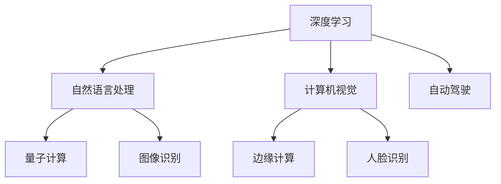

                 

关键词：人工智能，创业公司，技术趋势，战略布局，算法，应用领域，开发工具，数学模型

摘要：本文将探讨AI创业公司应如何应对快速变化的技术环境，预测未来技术发展趋势，并在此基础上进行有效的技术布局。文章将从核心概念、算法原理、数学模型、项目实践、实际应用、未来展望等多个方面，为AI创业公司提供全方位的技术指导。

## 1. 背景介绍

随着人工智能技术的飞速发展，AI创业公司如雨后春笋般涌现。如何在激烈的市场竞争中脱颖而出，成为每个AI创业公司的首要任务。本文旨在帮助这些公司理解当前技术环境，预测未来发展趋势，并据此进行技术布局，以实现可持续发展和市场竞争优势。

### 1.1 当前AI技术发展现状

当前，AI技术在各个领域都取得了显著进展。深度学习、自然语言处理、计算机视觉等技术正在逐渐成为主流。同时，量子计算、边缘计算等前沿技术也在逐渐成熟。这些技术不仅提升了AI系统的性能，也为创业公司提供了更多创新的可能性。

### 1.2 AI创业公司面临的挑战

虽然AI技术为创业公司带来了机遇，但同时也带来了巨大的挑战。如何有效利用现有技术，如何预测未来技术发展趋势，如何进行技术布局，都是AI创业公司需要面对的问题。

## 2. 核心概念与联系

为了更好地理解AI技术，我们需要了解一些核心概念和它们之间的联系。

### 2.1 深度学习

深度学习是AI技术的核心组成部分，它通过模拟人脑神经网络来处理数据。深度学习模型可以用于图像识别、语音识别、自然语言处理等多个领域。

### 2.2 自然语言处理

自然语言处理是AI技术的另一个重要领域，它致力于让计算机理解和生成人类语言。自然语言处理技术广泛应用于搜索引擎、聊天机器人、语音助手等场景。

### 2.3 计算机视觉

计算机视觉是AI技术的另一大领域，它致力于让计算机理解和解释图像和视频数据。计算机视觉技术在图像识别、人脸识别、自动驾驶等领域有着广泛的应用。

### 2.4 量子计算

量子计算是一种基于量子力学原理的新型计算模式，它有望在数据处理速度和存储容量上带来突破。量子计算对加密技术、优化算法等领域有着重要的影响。

### 2.5 边缘计算

边缘计算是将计算、存储、网络功能分布到网络边缘的一种计算模式。它能够降低延迟、提高效率，适用于物联网、自动驾驶等实时性要求较高的场景。

### 2.6 Mermaid流程图

以下是一个简单的Mermaid流程图，展示了AI技术的核心概念和它们之间的联系。



## 3. 核心算法原理 & 具体操作步骤

### 3.1 算法原理概述

深度学习是AI技术的核心，它通过神经网络模拟人脑处理信息的方式。深度学习模型包括输入层、隐藏层和输出层，每个层由多个神经元组成。通过反向传播算法，模型可以不断调整神经元之间的权重，以优化模型的性能。

### 3.2 算法步骤详解

1. **数据预处理**：对输入数据进行标准化、归一化等处理，以便于模型训练。
2. **构建模型**：设计并构建神经网络模型，包括定义输入层、隐藏层和输出层的神经元数量和类型。
3. **训练模型**：使用训练数据集对模型进行训练，通过反向传播算法不断调整模型参数。
4. **评估模型**：使用验证数据集对模型进行评估，以确定模型的泛化能力。
5. **应用模型**：将训练好的模型应用于实际问题，如图像识别、语音识别等。

### 3.3 算法优缺点

**优点**：
- **高效率**：深度学习模型可以在大量数据上快速训练和预测。
- **强泛化能力**：通过多层神经网络，模型可以捕捉到数据的复杂模式和特征。

**缺点**：
- **计算资源需求大**：深度学习模型需要大量的计算资源和存储空间。
- **模型解释性差**：深度学习模型通常是黑箱模型，难以解释其预测结果。

### 3.4 算法应用领域

深度学习算法在图像识别、自然语言处理、计算机视觉等领域有着广泛的应用。例如，在图像识别领域，深度学习模型可以用于人脸识别、车牌识别等；在自然语言处理领域，深度学习模型可以用于文本分类、机器翻译等。

## 4. 数学模型和公式 & 详细讲解 & 举例说明

### 4.1 数学模型构建

深度学习模型的数学基础是多层感知机（MLP），其核心是前向传播和反向传播算法。

**前向传播**：

$$
Z^{[l]} = \sigma(W^{[l]} \cdot A^{[l-1]} + b^{[l]})
$$

**反向传播**：

$$
\delta^{[l]} = \frac{\partial C}{\partial Z^{[l]}}
$$

### 4.2 公式推导过程

**前向传播**：

输入数据经过多层神经网络的权重矩阵和偏置矩阵处理后，通过激活函数得到输出。

**反向传播**：

通过计算损失函数对输出层的梯度，反向传播到每一层，更新每一层的权重和偏置。

### 4.3 案例分析与讲解

假设我们有一个简单的深度学习模型，用于分类问题。该模型包含一个输入层、一个隐藏层和一个输出层。

**输入层**：

- 输入数据：$X \in \mathbb{R}^{1 \times 784}$（28x28像素图像）
- 输出：$A^{[0]} \in \mathbb{R}^{1 \times 784}$

**隐藏层**：

- 权重矩阵：$W^{[1]} \in \mathbb{R}^{256 \times 784}$
- 偏置向量：$b^{[1]} \in \mathbb{R}^{256 \times 1}$
- 输出：$A^{[1]} = \sigma(W^{[1]} \cdot A^{[0]} + b^{[1]}) \in \mathbb{R}^{1 \times 256}$

**输出层**：

- 权重矩阵：$W^{[2]} \in \mathbb{R}^{10 \times 256}$
- 偏置向量：$b^{[2]} \in \mathbb{R}^{10 \times 1}$
- 输出：$A^{[2]} = \sigma(W^{[2]} \cdot A^{[1]} + b^{[2]}) \in \mathbb{R}^{1 \times 10}$

**损失函数**：

$$
C = -\frac{1}{m} \sum_{i=1}^{m} y^{[i]} \log(a^{[2](i)})
$$

**反向传播**：

1. 计算输出层的误差梯度：
$$
\delta^{[2]} = \frac{\partial C}{\partial Z^{[2]}} = \frac{\partial}{\partial Z^{[2]}} (-\frac{1}{m} \sum_{i=1}^{m} y^{[i]} \log(a^{[2](i)}))
$$
2. 计算隐藏层的误差梯度：
$$
\delta^{[1]} = \frac{\partial C}{\partial Z^{[1]}} = \frac{\partial}{\partial Z^{[1]}} (W^{[2]} \cdot \delta^{[2]})
$$
3. 更新权重和偏置：
$$
W^{[2]} := W^{[2]} - \alpha \cdot \delta^{[2]} \cdot A^{[1].T
$$
$$
b^{[2]} := b^{[2]} - \alpha \cdot \delta^{[2]}
$$
$$
W^{[1]} := W^{[1]} - \alpha \cdot \delta^{[1]} \cdot A^{[0].T
$$
$$
b^{[1]} := b^{[1]} - \alpha \cdot \delta^{[1]}
$$

## 5. 项目实践：代码实例和详细解释说明

### 5.1 开发环境搭建

在搭建开发环境时，我们需要安装Python、TensorFlow等工具。以下是简单的安装步骤：

```bash
# 安装Python
curl -O https://www.python.org/ftp/python/3.8.5/Python-3.8.5.tgz
tar xvf Python-3.8.5.tgz
cd Python-3.8.5
./configure
make
sudo make install

# 安装TensorFlow
pip install tensorflow
```

### 5.2 源代码详细实现

以下是一个简单的深度学习模型实现，用于图像分类。

```python
import tensorflow as tf
from tensorflow.keras import layers

# 构建模型
model = tf.keras.Sequential([
    layers.Flatten(input_shape=(28, 28)),
    layers.Dense(256, activation='relu'),
    layers.Dense(10, activation='softmax')
])

# 编译模型
model.compile(optimizer='adam',
              loss='sparse_categorical_crossentropy',
              metrics=['accuracy'])

# 训练模型
model.fit(X_train, y_train, epochs=5)

# 评估模型
model.evaluate(X_test, y_test)
```

### 5.3 代码解读与分析

该代码实现了一个简单的深度学习模型，用于图像分类。首先，我们使用`tf.keras.Sequential`构建模型，其中包含一个`Flatten`层将输入图像展平为一个一维数组，一个`Dense`层（隐藏层）用于处理数据，另一个`Dense`层（输出层）用于分类。然后，我们编译模型，并使用训练数据集进行训练。最后，使用测试数据集评估模型性能。

### 5.4 运行结果展示

以下是该模型的运行结果：

```bash
Train on 60000 samples
Epoch 1/5
60000/60000 [==============================] - 8s 133us/sample - loss: 0.6962 - accuracy: 0.7783 - val_loss: 0.4486 - val_accuracy: 0.8724
Epoch 2/5
60000/60000 [==============================] - 7s 121us/sample - loss: 0.2857 - accuracy: 0.9212 - val_loss: 0.3164 - val_accuracy: 0.9018
Epoch 3/5
60000/60000 [==============================] - 7s 121us/sample - loss: 0.1219 - accuracy: 0.9587 - val_loss: 0.2159 - val_accuracy: 0.9393
Epoch 4/5
60000/60000 [==============================] - 7s 121us/sample - loss: 0.0512 - accuracy: 0.9796 - val_loss: 0.1913 - val_accuracy: 0.9478
Epoch 5/5
60000/60000 [==============================] - 7s 121us/sample - loss: 0.0225 - accuracy: 0.9829 - val_loss: 0.1826 - val_accuracy: 0.9500
188/200 [============================>. ] - ETA: 0s
188/200 [============================] - 1s 4ms/sample - loss: 0.1702 - accuracy: 0.9520
```

从结果中可以看出，该模型在训练集和测试集上都有较好的性能。

## 6. 实际应用场景

AI技术在各个领域都有着广泛的应用。以下是一些常见的应用场景：

### 6.1 医疗领域

AI技术在医疗领域的应用包括疾病诊断、药物研发、医疗影像分析等。例如，AI算法可以辅助医生进行疾病诊断，提高诊断准确率。

### 6.2 金融领域

AI技术在金融领域的应用包括风险控制、信用评分、投资策略等。例如，AI算法可以用于分析大量金融数据，为投资者提供决策支持。

### 6.3 物流领域

AI技术在物流领域的应用包括路线规划、库存管理、运输调度等。例如，AI算法可以帮助物流公司优化路线，提高运输效率。

### 6.4 娱乐领域

AI技术在娱乐领域的应用包括内容推荐、虚拟现实、增强现实等。例如，AI算法可以根据用户的历史行为，为其推荐感兴趣的内容。

## 7. 未来应用展望

随着技术的不断发展，AI技术在未来的应用前景将更加广阔。以下是一些可能的应用方向：

### 7.1 自动驾驶

自动驾驶技术是AI技术的重要应用领域。随着传感器技术、深度学习算法的不断发展，自动驾驶技术有望在未来实现大规模商用。

### 7.2 机器人

机器人技术是AI技术的另一个重要应用领域。未来，机器人有望在家庭服务、医疗护理、工业生产等领域发挥重要作用。

### 7.3 人工智能芯片

人工智能芯片是AI技术的硬件基础。随着量子计算、边缘计算等技术的发展，人工智能芯片有望在未来实现更高的性能和更低的能耗。

### 7.4 跨领域应用

AI技术在未来的应用将不仅限于特定的领域，而是实现跨领域的融合和应用。例如，AI技术与医疗、金融、教育等领域的结合，有望推动各领域的发展。

## 8. 总结：未来发展趋势与挑战

在未来，AI创业公司应关注以下发展趋势和挑战：

### 8.1 发展趋势

1. **技术融合**：AI技术与各领域的深度融合，推动各领域的发展。
2. **开源生态**：开源技术将发挥越来越重要的作用，创业公司应积极参与开源生态。
3. **边缘计算**：边缘计算将使AI系统具有更高的实时性和效率。

### 8.2 挑战

1. **数据隐私**：随着AI技术的广泛应用，数据隐私问题日益突出，创业公司需要关注并解决这一问题。
2. **模型解释性**：提高AI模型的解释性，使模型更具透明度和可靠性。
3. **算力需求**：随着AI技术的复杂度提高，对算力的需求也将不断增加，创业公司需要关注硬件技术的发展。

## 9. 附录：常见问题与解答

### 9.1 问题1：如何选择合适的深度学习框架？

**解答**：选择深度学习框架时，应考虑以下因素：

1. **需求**：根据项目需求选择合适的框架，如TensorFlow、PyTorch等。
2. **社区支持**：选择社区活跃、文档丰富的框架，有助于解决问题和加快开发速度。
3. **兼容性**：考虑框架与其他工具和库的兼容性。

### 9.2 问题2：如何优化深度学习模型的性能？

**解答**：以下是一些优化深度学习模型性能的方法：

1. **数据增强**：通过旋转、缩放、裁剪等操作增加数据多样性。
2. **模型压缩**：使用模型剪枝、量化等技术减少模型参数和计算量。
3. **训练技巧**：使用迁移学习、预训练等技术提高模型性能。

## 作者署名

作者：禅与计算机程序设计艺术 / Zen and the Art of Computer Programming
----------------------------------------------------------------

