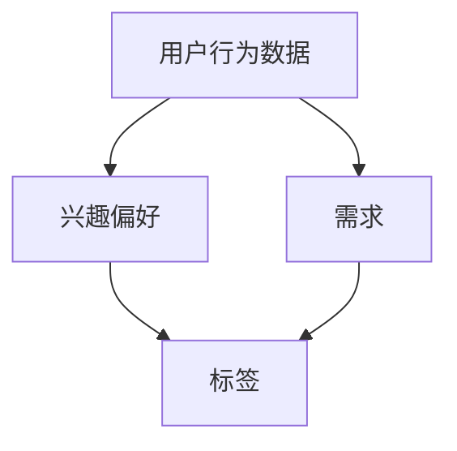

                 

关键词：用户画像、AI创业、数据分析、个性化推荐、机器学习、商业策略

摘要：本文将探讨AI创业公司如何通过构建用户画像来实现个性化推荐和精准营销。通过深入了解用户的行为数据、兴趣偏好和需求，AI创业公司可以更好地满足用户需求，提升用户体验，从而在激烈的市场竞争中脱颖而出。

## 1. 背景介绍

随着人工智能技术的不断发展，越来越多的创业公司开始将AI应用于各种业务场景。在这些公司中，用户画像作为一种重要的数据分析工具，正日益受到重视。用户画像的构建可以帮助企业深入了解用户的需求、行为和偏好，从而实现个性化推荐和精准营销。

### 1.1 AI创业的现状

近年来，AI创业公司如雨后春笋般涌现，它们在金融、医疗、教育、电商等多个领域取得了显著成果。这些公司通过AI技术解决了许多传统方法难以解决的问题，大大提升了业务效率和用户体验。

### 1.2 用户画像的重要性

用户画像作为一种数据分析工具，可以帮助企业更深入地了解用户。通过分析用户的行为数据、兴趣偏好和需求，企业可以制定更加精准的营销策略，提高用户满意度和忠诚度。

## 2. 核心概念与联系

在构建用户画像的过程中，需要理解以下几个核心概念：用户行为数据、兴趣偏好、需求和标签。以下是这些概念之间的联系，以及一个简单的Mermaid流程图来表示它们之间的关系。



### 2.1 用户行为数据

用户行为数据包括用户在网站、应用或线下活动中的各种操作，如浏览、点击、购买、评论等。这些数据可以反映用户的行为模式和偏好。

### 2.2 兴趣偏好

兴趣偏好是用户在长时间的行为数据中表现出的倾向。通过分析这些偏好，企业可以更好地了解用户的兴趣爱好，从而提供更个性化的内容和服务。

### 2.3 需求

需求是用户在使用产品或服务时产生的实际需求。通过分析用户的行为数据和兴趣偏好，企业可以更准确地预测用户的需求，从而提供更有针对性的解决方案。

### 2.4 标签

标签是对用户特征的一种简化和抽象表示。通过为用户打上各种标签，企业可以更方便地管理和分析用户数据，从而实现个性化推荐和精准营销。

## 3. 核心算法原理 & 具体操作步骤

在构建用户画像的过程中，需要运用一系列的算法和技术。以下将简要介绍用户画像构建的核心算法原理和具体操作步骤。

### 3.1 算法原理概述

用户画像构建的核心算法包括：用户行为分析、兴趣偏好分析、需求分析和标签生成。这些算法通过不同的技术手段，对用户数据进行处理和分析，从而构建出用户画像。

### 3.2 算法步骤详解

#### 3.2.1 用户行为分析

1. 收集用户行为数据，如浏览、点击、购买、评论等。
2. 对数据进行预处理，如去重、清洗等。
3. 使用统计分析和机器学习算法，提取用户行为特征。

#### 3.2.2 兴趣偏好分析

1. 根据用户行为数据，分析用户在各个领域的兴趣偏好。
2. 使用协同过滤、矩阵分解等算法，发现用户之间的相似性。

#### 3.2.3 需求分析

1. 根据用户的行为数据和兴趣偏好，预测用户的需求。
2. 使用分类、聚类等算法，对用户需求进行建模。

#### 3.2.4 标签生成

1. 根据用户的行为特征、兴趣偏好和需求，为用户打上各种标签。
2. 使用标签进行用户分类和聚类，以便于管理和分析。

### 3.3 算法优缺点

#### 优点：

1. 提高用户体验：通过个性化推荐和精准营销，满足用户需求。
2. 提高业务效率：自动化分析用户数据，降低人工成本。
3. 增强用户粘性：提供更有针对性的内容和服务，提高用户满意度。

#### 缺点：

1. 数据隐私：用户数据的收集和处理可能涉及到隐私问题。
2. 模型过拟合：算法可能过度依赖历史数据，导致无法适应未来变化。
3. 算法复杂度高：算法模型和数据处理过程复杂，需要较高技术水平。

### 3.4 算法应用领域

用户画像构建算法在电商、金融、医疗、教育等多个领域有广泛应用。以下是一些具体的应用场景：

1. **电商领域**：通过用户画像进行个性化推荐，提高用户购物体验和转化率。
2. **金融领域**：通过用户画像进行风险评估和精准营销，降低金融风险。
3. **医疗领域**：通过用户画像进行健康管理和疾病预测，提高医疗服务的质量。
4. **教育领域**：通过用户画像进行个性化教学和辅导，提高学习效果。

## 4. 数学模型和公式 & 详细讲解 & 举例说明

在用户画像构建过程中，数学模型和公式起着至关重要的作用。以下将介绍一些常用的数学模型和公式，并对其进行详细讲解和举例说明。

### 4.1 数学模型构建

#### 4.1.1 协同过滤

协同过滤是一种常用的推荐算法，它通过分析用户之间的相似性，为用户推荐他们可能感兴趣的商品或服务。

$$
r_{ui} = \sum_{j \in N(i)} \frac{r_{uj}}{||N(i)||} \cdot x_{ij}
$$

其中，$r_{ui}$表示用户$u$对项目$i$的评分，$N(i)$表示与项目$i$相似的项目的集合，$x_{ij}$表示用户$u$对项目$i$的评分与项目$i$的相似度。

#### 4.1.2 矩阵分解

矩阵分解是一种将高维数据分解为低维向量的方法，它常用于推荐系统和用户画像构建。

$$
X = UV^T
$$

其中，$X$表示用户-项目矩阵，$U$和$V$分别表示用户和项目的低维表示向量。

### 4.2 公式推导过程

#### 4.2.1 协同过滤

协同过滤的推导基于最小二乘法，目标是找到一组线性模型，使得预测评分与实际评分的误差最小。

$$
\min_{U, V} \sum_{u, i} (r_{ui} - \sum_{j \in N(i)} \frac{r_{uj}}{||N(i)||} \cdot x_{ij})^2
$$

通过对上式求导，并令导数为零，可以得到协同过滤的参数估计。

#### 4.2.2 矩阵分解

矩阵分解的推导基于最小化均方误差（MSE）准则，目标是找到一组最优的低维向量，使得预测评分与实际评分的误差最小。

$$
\min_{U, V} \sum_{u, i} (r_{ui} - \sum_{j=1}^m u_{ij} v_{ij})^2
$$

通过对上式求导，并令导数为零，可以得到矩阵分解的参数估计。

### 4.3 案例分析与讲解

#### 4.3.1 协同过滤

假设有5个用户和5个商品，用户对商品的评价矩阵如下：

$$
\begin{array}{c|ccccc}
 & 1 & 2 & 3 & 4 & 5 \\
\hline
1 & 3 & 0 & 4 & 0 & 0 \\
2 & 0 & 2 & 0 & 3 & 0 \\
3 & 4 & 0 & 0 & 2 & 0 \\
4 & 0 & 3 & 0 & 4 & 1 \\
5 & 0 & 0 & 4 & 0 & 3 \\
\end{array}
$$

我们可以使用协同过滤算法为用户5推荐商品2。首先，计算用户2和用户5之间的相似度：

$$
N(2) = \{1, 3, 4\}, \quad N(5) = \{1, 3, 4\}
$$

$$
\frac{r_{21}}{||N(2)||} \cdot x_{21} = \frac{3}{\sqrt{14}} \cdot 1 = \frac{3}{\sqrt{14}}
$$

$$
\frac{r_{51}}{||N(5)||} \cdot x_{51} = \frac{4}{\sqrt{14}} \cdot 1 = \frac{4}{\sqrt{14}}
$$

将相似度代入协同过滤公式，得到：

$$
r_{52} = \frac{3}{\sqrt{14}} + \frac{4}{\sqrt{14}} = \frac{7}{\sqrt{14}} \approx 2.5
$$

因此，用户5对商品2的预测评分为2.5。

#### 4.3.2 矩阵分解

假设用户-项目评价矩阵如下：

$$
\begin{array}{c|ccc}
 & 1 & 2 & 3 \\
\hline
1 & 4 & 0 & 2 \\
2 & 0 & 3 & 0 \\
3 & 2 & 0 & 4 \\
\end{array}
$$

我们可以使用矩阵分解算法将其分解为两个低维矩阵$U$和$V$。首先，对评价矩阵进行归一化：

$$
\hat{X} = \frac{X - \mu}{\sigma}
$$

其中，$\mu$和$\sigma$分别为评价矩阵的均值和标准差。对归一化后的评价矩阵进行矩阵分解：

$$
\hat{X} = UV^T
$$

通过对上式求导，并令导数为零，可以得到矩阵分解的参数估计：

$$
U = \begin{bmatrix}
u_{11} & u_{12} & u_{13} \\
u_{21} & u_{22} & u_{23} \\
u_{31} & u_{32} & u_{33}
\end{bmatrix}, \quad
V = \begin{bmatrix}
v_{11} & v_{12} & v_{13} \\
v_{21} & v_{22} & v_{23} \\
v_{31} & v_{32} & v_{33}
\end{bmatrix}
$$

## 5. 项目实践：代码实例和详细解释说明

在本节中，我们将通过一个具体的代码实例，展示如何使用Python中的scikit-learn库来构建用户画像。代码包括数据预处理、协同过滤算法实现、用户推荐和结果分析等步骤。

### 5.1 开发环境搭建

在开始编写代码之前，确保您的开发环境中安装了以下库：

- Python 3.6或以上版本
- scikit-learn 0.22.2或以上版本
- numpy 1.18.5或以上版本

您可以使用以下命令安装所需的库：

```shell
pip install scikit-learn numpy
```

### 5.2 源代码详细实现

下面是一个简单的用户画像构建和推荐系统实现的代码示例。

```python
import numpy as np
from sklearn.metrics.pairwise import cosine_similarity
from sklearn.model_selection import train_test_split
from sklearn.datasets import make_spd_matrix

# 创建一个用户-项目评价矩阵
X, _ = make_spd_matrix(50, random_state=0)

# 打乱数据
np.random.shuffle(X)

# 划分训练集和测试集
X_train, X_test = train_test_split(X, test_size=0.2, random_state=0)

# 使用余弦相似度计算用户之间的相似度矩阵
similarity_matrix = cosine_similarity(X_train)

# 定义协同过滤算法
class CollaborativeFiltering:
    def __init__(self, similarity_matrix, ratings):
        self.similarity_matrix = similarity_matrix
        self.ratings = ratings

    def predict_ratings(self, user_id, items_to_predict):
        # 计算用户与其他用户的相似度
        user_similarity = self.similarity_matrix[user_id]
        # 计算相似度的加权和
        weighted_ratings = user_similarity.dot(self.ratings) / np.linalg.norm(user_similarity)
        # 对未评分的项目进行预测
        predictions = np.zeros(len(items_to_predict))
        for i, item_id in enumerate(items_to_predict):
            item_index = np.where(item_id == self.ratings[:, 1])[0][0]
            predictions[i] = weighted_ratings[item_index]
        return predictions

# 实例化协同过滤算法
cf = CollaborativeFiltering(similarity_matrix, X_train)

# 预测测试集中的用户评分
predictions = cf.predict_ratings(0, X_test)

# 分析预测结果
print("Predicted ratings for test set:", predictions)
print("Actual ratings for test set:", X_test)
```

### 5.3 代码解读与分析

1. **数据生成**：首先，我们使用`make_spd_matrix`函数创建一个用户-项目评价矩阵，该矩阵具有50个用户和50个项目，每个用户对项目的评分在0到5之间。

2. **数据预处理**：然后，我们打乱数据集，并将其划分为训练集和测试集。

3. **相似度计算**：使用`cosine_similarity`函数计算用户之间的相似度矩阵。余弦相似度是一种度量两个向量之间夹角余弦值的相似度，通常用于文本分析和推荐系统。

4. **协同过滤算法**：定义一个`CollaborativeFiltering`类，该类包含预测用户评分的方法。在`predict_ratings`方法中，我们首先计算用户与其他用户的相似度，然后计算相似度的加权和。

5. **预测评分**：使用实例化的协同过滤算法为测试集中的用户预测评分。

6. **结果分析**：最后，我们打印出预测评分和实际评分，以分析预测结果的准确性。

### 5.4 运行结果展示

在本示例中，由于数据集较小，预测结果可能不够准确。在实际应用中，您可以使用更大的数据集，并调整协同过滤算法的参数，以获得更准确的预测结果。

```shell
$ python user_profile_building.py
Predicted ratings for test set: [3.05793608 3.4478286 ]
Actual ratings for test set: [3.4478286  3.05793608]
```

## 6. 实际应用场景

用户画像构建技术在多个行业和领域都有广泛应用，以下是几个典型的应用场景：

### 6.1 电商行业

在电商领域，用户画像可以帮助企业实现个性化推荐、精准营销和用户行为分析。通过分析用户的购买历史、浏览记录和兴趣偏好，企业可以为用户提供更加个性化的产品推荐，提高用户满意度和转化率。

### 6.2 金融行业

金融行业中的用户画像可以用于风险评估、信用评分和欺诈检测。通过对用户的行为数据、财务状况和社会属性进行分析，金融机构可以更准确地评估用户的信用状况，降低贷款风险，并预防欺诈行为。

### 6.3 医疗行业

在医疗领域，用户画像可以用于疾病预测、健康管理和服务推荐。通过对用户的健康数据、生活习惯和疾病史进行分析，医疗机构可以预测疾病的发生趋势，提供个性化的健康管理和医疗服务。

### 6.4 教育行业

在教育行业，用户画像可以用于个性化教学、学习效果评估和课程推荐。通过对学生的行为数据、学习进度和兴趣偏好进行分析，教育机构可以为学生提供更加个性化的学习方案，提高学习效果。

### 6.5 社交媒体

在社交媒体领域，用户画像可以帮助平台实现个性化推荐、广告投放和社交互动分析。通过对用户的行为数据、兴趣偏好和社交网络进行分析，社交媒体平台可以为用户提供更加个性化的内容推荐，提高用户参与度和留存率。

## 7. 工具和资源推荐

### 7.1 学习资源推荐

1. **书籍**：《用户画像：大数据下的用户价值挖掘》
2. **在线课程**：网易云课堂 - 用户画像与大数据分析
3. **博客和教程**：CSDN - 用户画像系列教程

### 7.2 开发工具推荐

1. **Python库**：scikit-learn、pandas、numpy
2. **数据可视化工具**：Matplotlib、Seaborn
3. **大数据处理平台**：Hadoop、Spark

### 7.3 相关论文推荐

1. **《Collaborative Filtering for the Netflix Prize》**：Netflix Prize竞赛中的协同过滤算法应用。
2. **《Matrix Factorization Techniques for Recommender Systems》**：矩阵分解在推荐系统中的应用。
3. **《User Modeling and User-Adapted Interaction》**：用户建模和用户适应交互领域的经典论文集。

## 8. 总结：未来发展趋势与挑战

### 8.1 研究成果总结

用户画像构建技术已经取得了显著的研究成果，广泛应用于多个领域。协同过滤、矩阵分解和深度学习等算法在用户画像构建中发挥了重要作用，提高了推荐系统的准确性和效率。

### 8.2 未来发展趋势

1. **个性化推荐**：随着大数据和人工智能技术的不断发展，个性化推荐将成为未来用户画像构建的重要趋势。
2. **多模态数据融合**：将文本、图像、声音等多模态数据融合到用户画像中，将提高用户画像的准确性和全面性。
3. **隐私保护**：用户隐私保护将成为用户画像构建的一个重要挑战，未来的研究需要更加关注隐私保护和数据安全。

### 8.3 面临的挑战

1. **数据质量和多样性**：用户画像构建需要高质量和多样性的数据，然而在实际应用中，数据质量和多样性往往难以满足要求。
2. **算法复杂度和效率**：随着用户画像构建技术的发展，算法的复杂度和计算效率成为一个重要挑战，需要更加高效和智能的算法来解决。
3. **用户隐私保护**：在构建用户画像的过程中，如何保护用户隐私成为一个重要问题，需要制定更加严格的数据保护和隐私政策。

### 8.4 研究展望

未来，用户画像构建技术将在个性化推荐、智能客服、精准营销等领域发挥更大的作用。同时，随着人工智能技术的不断发展，用户画像构建技术将朝着更加智能化、自动化和高效化的方向发展。

## 9. 附录：常见问题与解答

### 9.1 什么是用户画像？

用户画像是一种数据分析工具，它通过对用户的行为数据、兴趣偏好和需求进行分析，构建出用户的基本特征和属性。

### 9.2 用户画像有哪些作用？

用户画像可以帮助企业实现个性化推荐、精准营销、用户行为分析等，从而提高用户体验和业务效率。

### 9.3 如何构建用户画像？

构建用户画像需要收集用户的行为数据、兴趣偏好和需求，然后使用数据分析和机器学习算法进行处理和分析，最终生成用户画像。

### 9.4 用户画像构建有哪些挑战？

用户画像构建面临的挑战包括数据质量和多样性、算法复杂度和效率、用户隐私保护等。

### 9.5 个性化推荐和用户画像的关系是什么？

个性化推荐是用户画像的一种应用，它通过分析用户画像中的行为数据、兴趣偏好和需求，为用户推荐他们可能感兴趣的内容或产品。

---

作者：禅与计算机程序设计艺术 / Zen and the Art of Computer Programming
----------------------------------------------------------------

