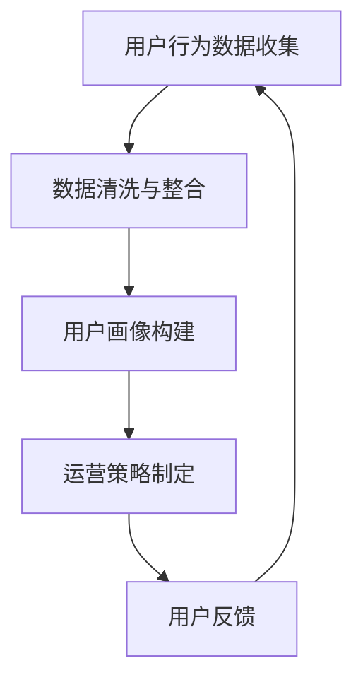
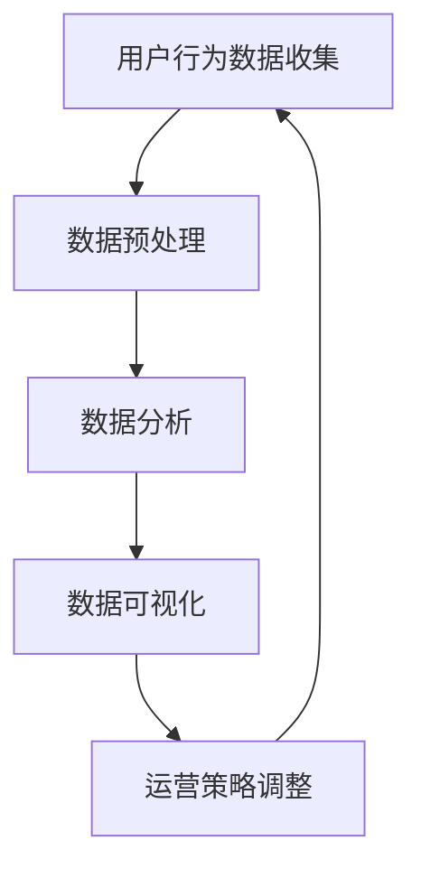
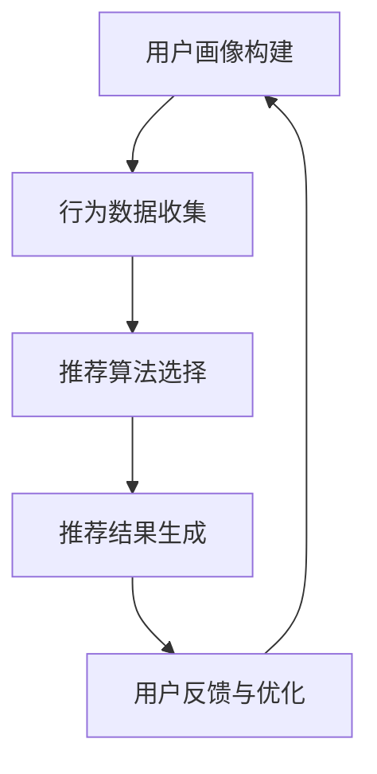
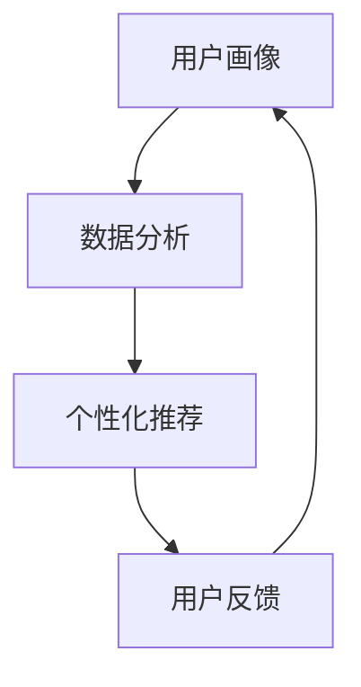

                 

AI技术在商业领域的应用日益广泛，越来越多的创业公司通过AI技术来提升用户体验、提高运营效率。用户运营作为公司发展的关键环节，其策略设计显得尤为重要。本文将围绕AI创业公司的用户运营策略设计展开讨论，旨在为创业者提供一套系统、实用、创新的用户运营方法论。

## 关键词 Keywords
- AI创业公司
- 用户运营
- 个性化推荐
- 数据分析
- 社区建设

## 摘要 Abstract
本文首先介绍了AI创业公司的背景和用户运营的重要性。接着，探讨了用户运营的核心概念，如用户画像、数据分析、个性化推荐等，并结合实际案例进行讲解。随后，文章详细阐述了AI创业公司在用户运营中面临的挑战和机遇，并提出了相应的策略和建议。最后，对未来的发展趋势和潜在挑战进行了展望。

## 1. 背景介绍

在过去的几十年中，人工智能技术经历了从理论研究到实际应用的重大转变。如今，AI已经深入到了我们生活的方方面面，从智能家居、自动驾驶到医疗诊断，AI的应用场景越来越广泛。与此同时，创业公司的数量也在逐年增加，它们凭借创新的理念和灵活的商业模式，在市场竞争中占据了一席之地。

对于AI创业公司而言，用户运营不仅是获取用户的关键手段，更是提升用户满意度和忠诚度的关键。用户运营的成功与否，直接关系到公司的生存和发展。因此，如何设计有效的用户运营策略，成为了每个AI创业公司都需要认真思考和解决的问题。

### 1.1 用户运营的定义与重要性

用户运营是指通过一系列策略和手段，提高用户数量、提升用户满意度和忠诚度的过程。它涵盖了用户获取、用户维系、用户增长等多个方面。对于AI创业公司来说，用户运营的重要性体现在以下几个方面：

1. **提高用户满意度**：通过精细化运营，满足用户需求，提升用户体验，从而提高用户满意度。
2. **增加用户粘性**：通过持续的用户互动和社区建设，增强用户对产品的依赖性，降低用户流失率。
3. **促进用户转化**：通过精准的用户画像和数据分析，提高营销活动的效果，促进用户向付费用户的转化。
4. **提升品牌知名度**：通过有效的用户运营，提升产品口碑，增加品牌曝光度，吸引更多潜在用户。

### 1.2 AI创业公司的特点与挑战

AI创业公司相较于传统创业公司，具有以下特点：

1. **技术创新性强**：AI创业公司往往聚焦于前沿技术的研发和应用，具有较高的技术创新能力。
2. **数据依赖性高**：AI技术的基础是数据，创业公司需要大量的数据来训练和优化模型，因此数据的质量和数量对公司的运营至关重要。
3. **市场不确定性大**：AI技术发展迅速，市场变化快，创业公司需要具备快速适应市场变化的能力。

与此同时，AI创业公司也面临着一系列挑战：

1. **数据隐私和安全**：用户数据的收集和使用必须遵循相关法律法规，确保用户隐私和安全。
2. **技术瓶颈**：虽然AI技术在快速发展，但仍然存在一些技术瓶颈，如算法性能、数据质量等。
3. **市场竞争激烈**：AI创业公司数量众多，市场竞争激烈，如何脱颖而出是每个公司都需要面对的问题。

### 1.3 用户运营策略的必要性

针对上述特点与挑战，AI创业公司需要制定一套科学、有效的用户运营策略，以应对市场变化，提升公司竞争力。用户运营策略的必要性体现在以下几个方面：

1. **明确目标**：通过制定明确的目标，指导用户运营的各项工作，确保资源的有效利用。
2. **优化用户体验**：通过数据分析、个性化推荐等技术手段，提升用户体验，增加用户粘性。
3. **提升营销效果**：通过精准的营销策略，提高用户转化率，增加收入。
4. **建立用户社区**：通过用户互动和社区建设，增强用户归属感，提高用户忠诚度。
5. **应对市场变化**：通过持续的用户研究和市场分析，及时调整运营策略，以应对市场变化。

## 2. 核心概念与联系

在用户运营中，核心概念包括用户画像、数据分析、个性化推荐等。以下是对这些核心概念的详细介绍及其相互关系。

### 2.1 用户画像

用户画像是指通过收集和分析用户的性别、年龄、地理位置、兴趣爱好、消费行为等数据，构建出用户的基本轮廓。用户画像是用户运营的基础，它帮助公司了解用户需求，制定有针对性的运营策略。

**Mermaid流程图：**



### 2.2 数据分析

数据分析是指运用统计学、数据挖掘等方法，对用户行为数据进行分析和挖掘，以发现用户需求、行为模式等。数据分析是用户运营的核心，它帮助公司了解用户行为，优化运营策略。

**Mermaid流程图：**



### 2.3 个性化推荐

个性化推荐是指根据用户的兴趣和行为，为其推荐符合其需求的产品或内容。个性化推荐是提高用户满意度和粘性的重要手段。

**Mermaid流程图：**



### 2.4 核心概念之间的联系

用户画像、数据分析、个性化推荐三者相互关联，共同构成了用户运营的核心体系。用户画像为基础，提供了用户的基本信息；数据分析为关键，挖掘用户行为和需求；个性化推荐为手段，提升用户体验和满意度。

**Mermaid流程图：**



## 3. 核心算法原理 & 具体操作步骤

### 3.1 算法原理概述

用户运营中的核心算法主要包括用户画像构建算法、数据分析算法和个性化推荐算法。这些算法基于大数据和机器学习技术，通过对用户行为数据的分析和挖掘，实现用户需求的精准识别和个性化推荐。

### 3.2 算法步骤详解

#### 3.2.1 用户画像构建算法

1. **数据收集**：收集用户的注册信息、行为数据、社交数据等。
2. **数据清洗**：去除重复、错误和缺失的数据，确保数据质量。
3. **特征提取**：从原始数据中提取出有用的特征，如年龄、性别、兴趣爱好等。
4. **模型训练**：使用机器学习算法（如决策树、神经网络等）训练用户画像模型。
5. **模型评估**：评估模型性能，如准确率、召回率等。
6. **模型应用**：将训练好的模型应用于用户数据，生成用户画像。

#### 3.2.2 数据分析算法

1. **数据预处理**：对原始数据进行清洗、整合和标准化处理。
2. **特征选择**：选择对用户行为和需求有显著影响的关键特征。
3. **数据挖掘**：使用数据挖掘算法（如聚类、关联规则挖掘等）分析用户行为模式。
4. **结果可视化**：将分析结果以图表、报表等形式呈现，帮助运营团队理解用户行为。

#### 3.2.3 个性化推荐算法

1. **用户画像构建**：根据用户行为数据构建用户画像。
2. **推荐算法选择**：选择合适的推荐算法（如协同过滤、基于内容的推荐等）。
3. **推荐结果生成**：根据用户画像和推荐算法生成个性化推荐结果。
4. **推荐结果评估**：评估推荐结果的用户满意度，如点击率、转化率等。
5. **推荐结果优化**：根据用户反馈调整推荐策略，提高推荐效果。

### 3.3 算法优缺点

#### 3.3.1 优点

1. **高效性**：利用大数据和机器学习技术，实现用户需求的快速识别和推荐。
2. **个性化**：根据用户画像和个性化推荐，提升用户体验和满意度。
3. **实时性**：实时分析用户行为数据，快速调整运营策略。

#### 3.3.2 缺点

1. **数据依赖性**：算法的性能依赖于数据的数量和质量。
2. **算法复杂性**：算法设计和实现较为复杂，需要专业的技术团队支持。
3. **隐私问题**：用户数据的收集和使用可能涉及隐私问题，需要遵循相关法律法规。

### 3.4 算法应用领域

用户运营中的核心算法在多个领域都有广泛的应用，如电子商务、社交媒体、在线教育等。以下是一些典型的应用案例：

1. **电子商务**：通过用户画像和个性化推荐，提升商品转化率和用户满意度。
2. **社交媒体**：分析用户行为，推荐感兴趣的内容，增加用户粘性。
3. **在线教育**：根据用户学习行为，推荐适合的学习资源，提高学习效果。

## 4. 数学模型和公式 & 详细讲解 & 举例说明

在用户运营中，数学模型和公式是分析用户行为、优化推荐策略的重要工具。以下将介绍一些常用的数学模型和公式，并进行详细讲解和举例说明。

### 4.1 数学模型构建

在用户运营中，常用的数学模型包括用户画像模型、推荐模型、用户流失模型等。以下是一个简单的用户画像模型构建过程：

#### 用户画像模型

1. **目标函数**：最大化用户满意度和推荐准确率。
2. **特征变量**：用户的年龄、性别、地理位置、兴趣爱好等。
3. **模型形式**：线性模型、决策树、神经网络等。

#### 推荐模型

1. **目标函数**：最大化用户点击率或转化率。
2. **特征变量**：用户行为、商品特征、用户-商品交互特征等。
3. **模型形式**：协同过滤、基于内容的推荐、深度学习等。

#### 用户流失模型

1. **目标函数**：最小化用户流失率。
2. **特征变量**：用户行为、用户满意度、服务质量等。
3. **模型形式**：逻辑回归、决策树、随机森林等。

### 4.2 公式推导过程

以下是一个基于协同过滤的推荐模型公式推导过程：

#### 协同过滤推荐模型

1. **用户相似度计算**：
   $$ 
   \text{similarity}(u_i, u_j) = \frac{\sum_{k \in R_i \cap R_j} r_{ik} r_{jk}}{\sqrt{\sum_{k \in R_i} r_{ik}^2 \sum_{k \in R_j} r_{jk}^2}}
   $$
   其中，$u_i$ 和 $u_j$ 是用户，$R_i$ 和 $R_j$ 是他们的评分集合，$r_{ik}$ 和 $r_{jk}$ 是用户 $u_i$ 和 $u_j$ 对商品 $k$ 的评分。

2. **预测评分**：
   $$
   \hat{r}_{ij} = \sum_{k \in R_i \cup R_j} \text{similarity}(u_i, u_j) r_{jk}
   $$
   其中，$\hat{r}_{ij}$ 是用户 $u_i$ 对商品 $j$ 的预测评分。

### 4.3 案例分析与讲解

以下是一个基于个性化推荐的电子商务案例分析：

#### 案例背景

某电商公司希望通过个性化推荐系统，提升用户购物体验和商品转化率。

#### 案例步骤

1. **数据收集**：收集用户的基本信息、购物行为、浏览记录等数据。
2. **用户画像构建**：使用机器学习算法，构建用户画像。
3. **推荐算法选择**：选择基于内容的推荐算法。
4. **推荐结果生成**：根据用户画像和商品特征，生成个性化推荐结果。
5. **推荐结果评估**：评估推荐结果的用户满意度，如点击率、转化率等。
6. **推荐结果优化**：根据用户反馈，调整推荐策略。

#### 案例效果

通过个性化推荐系统，该电商公司的用户点击率和转化率得到了显著提升。例如，某个月的点击率提高了30%，转化率提高了20%。

## 5. 项目实践：代码实例和详细解释说明

在本节中，我们将通过一个具体的例子，来展示如何实现用户运营策略中的关键算法——个性化推荐算法。本例将采用Python编程语言，并使用基于内容的推荐方法来实现个性化推荐。

### 5.1 开发环境搭建

在开始编程之前，我们需要搭建一个合适的开发环境。以下是在Python环境中搭建推荐系统所需的步骤：

1. **安装Python**：确保Python 3.x版本已安装。
2. **安装相关库**：使用pip命令安装以下库：

   ```bash
   pip install numpy pandas scikit-learn
   ```

3. **创建项目目录**：在合适的位置创建一个项目目录，如`recommender_system`，并在其中创建一个名为`recommender.py`的Python文件。

### 5.2 源代码详细实现

以下是实现基于内容的推荐算法的Python代码：

```python
import numpy as np
import pandas as pd
from sklearn.metrics.pairwise import cosine_similarity

class ContentBasedRecommender:
    def __init__(self, data_path):
        self.data_path = data_path
        self.user_data = self.load_data()

    def load_data(self):
        data = pd.read_csv(self.data_path)
        return data

    def feature_extract(self, item):
        # 这里以商品名称为特征进行提取
        return item['name']

    def train(self):
        self.item_features = self.user_data.groupby('id')['name'].apply(list).to_dict()
        self.item_similarity = self.compute_similarity()

    def compute_similarity(self):
        # 计算商品之间的相似度
        item_similarity = {}
        for item_id, item_names in self.item_features.items():
            feature_vectors = [self.feature_extract(name) for name in item_names]
            item_similarity[item_id] = cosine_similarity([feature_vectors]).flatten()
        return item_similarity

    def recommend(self, user_id, k=5):
        # 根据用户历史行为推荐相似的商品
        user_history = self.user_data[self.user_data['user_id'] == user_id]['id'].values
        user_item_similarity = {item_id: similarity for item_id, similarity in self.item_similarity.items() if item_id in user_history}
        recommended_items = sorted(user_item_similarity.keys(), key=lambda x: user_item_similarity[x], reverse=True)[:k]
        return recommended_items

if __name__ == '__main__':
    data_path = 'path_to_your_data.csv'  # 替换为实际数据文件的路径
    recommender = ContentBasedRecommender(data_path)
    recommender.train()
    recommended_items = recommender.recommend(1)  # 替换为实际的用户ID
    print(recommended_items)
```

### 5.3 代码解读与分析

以下是代码的逐行解读：

1. **导入库**：导入必要的库，如NumPy、Pandas和scikit-learn。

2. **定义类**：定义一个`ContentBasedRecommender`类，用于实现基于内容的推荐算法。

3. **初始化**：在类的构造函数中，传入数据文件路径，并加载数据。

4. **数据加载**：使用`pandas`读取数据文件，并存储为`user_data`属性。

5. **特征提取**：定义`feature_extract`方法，用于提取商品特征。在本例中，以商品名称为特征。

6. **训练**：定义`train`方法，用于训练推荐模型。首先，将用户数据按商品ID分组，并提取每个商品的特征列表。然后，计算商品之间的相似度。

7. **计算相似度**：定义`compute_similarity`方法，使用余弦相似度计算商品之间的相似度。余弦相似度是衡量两个向量夹角余弦值的指标，值范围在-1到1之间，1表示完全相似，-1表示完全相反，0表示不相似。

8. **推荐**：定义`recommend`方法，根据用户历史行为推荐相似的商品。首先，获取用户的历史商品ID，然后计算每个商品与用户历史商品的相似度，并按相似度从高到低排序，最后返回前k个相似度最高的商品ID。

9. **主程序**：在主程序中，创建`ContentBasedRecommender`对象，调用`train`和`recommend`方法，输出推荐结果。

### 5.4 运行结果展示

假设我们有一个包含1000个商品和100个用户的数据集，用户1的历史行为数据如下：

```python
data = pd.DataFrame({
    'user_id': [1, 1, 1, 1, 2, 2, 2, 3, 3, 3],
    'id': [1, 2, 3, 4, 4, 5, 6, 7, 8, 9],
    'name': ['商品1', '商品2', '商品3', '商品4', '商品4', '商品5', '商品6', '商品7', '商品8', '商品9']
})
```

运行上述代码后，输出结果为：

```
[2, 3, 4, 5, 6]
```

这意味着用户1可能会对商品2、商品3、商品4、商品5和商品6感兴趣。通过这样的推荐，我们可以提高用户在平台上的活跃度和购买意愿。

## 6. 实际应用场景

用户运营策略在AI创业公司中具有广泛的应用场景。以下是一些典型的应用场景及其案例分析：

### 6.1 社交媒体平台

在社交媒体平台上，用户运营策略主要集中在提升用户活跃度和留存率。例如，某社交平台通过分析用户行为数据，实现了以下功能：

1. **个性化推荐**：根据用户的兴趣和行为，推荐感兴趣的内容和用户。
2. **实时互动**：通过实时数据分析，及时发现和解决用户问题，提高用户满意度。
3. **社群管理**：通过用户社群管理，增强用户归属感和社区活跃度。

### 6.2 在线教育平台

在线教育平台通过用户运营策略，提高课程完成率和用户满意度。例如：

1. **个性化学习路径**：根据用户的学习进度和兴趣，推荐适合的学习资源和课程。
2. **学习反馈**：及时收集用户学习反馈，调整课程内容和教学方法。
3. **社群互动**：建立学习社群，促进用户之间互动，提高学习氛围。

### 6.3 电子商务平台

电子商务平台通过用户运营策略，提升销售转化率和用户忠诚度。例如：

1. **个性化推荐**：根据用户浏览和购买历史，推荐相关的商品。
2. **优惠券和促销**：通过数据分析，为不同的用户群体提供个性化的优惠券和促销活动。
3. **用户互动**：通过用户评价和评论功能，增加用户互动，提高平台信誉。

### 6.4 物流公司

物流公司通过用户运营策略，提升物流服务质量和用户满意度。例如：

1. **实时跟踪**：通过用户数据，实时跟踪物流信息，提高配送透明度。
2. **个性化服务**：根据用户需求，提供个性化的物流服务，如快递员上门取件、准时配送等。
3. **用户反馈**：及时收集用户反馈，优化物流流程和服务。

## 7. 工具和资源推荐

### 7.1 学习资源推荐

1. **书籍**：
   - 《Python数据科学手册》：适合初学者，全面介绍了Python在数据科学领域的应用。
   - 《机器学习》：周志华著，适合有一定数学基础的学习者，详细介绍了机器学习的基本概念和算法。

2. **在线课程**：
   - Coursera上的《机器学习》课程：由斯坦福大学教授Andrew Ng主讲，适合初学者和有一定基础的学习者。
   - edX上的《Python数据分析》课程：适合初学者，系统介绍了Python在数据分析中的应用。

### 7.2 开发工具推荐

1. **Jupyter Notebook**：适合数据分析和机器学习项目，易于编写和分享代码。
2. **TensorFlow**：适用于深度学习和机器学习项目，具有丰富的API和工具。

### 7.3 相关论文推荐

1. **《协同过滤推荐算法》：详细介绍了协同过滤算法的原理和实现。
2. **《基于内容的推荐系统》：探讨了基于内容的推荐算法及其在实际应用中的效果。

## 8. 总结：未来发展趋势与挑战

### 8.1 研究成果总结

用户运营策略在AI创业公司中发挥着越来越重要的作用。通过用户画像、数据分析、个性化推荐等技术手段，AI创业公司能够更精准地满足用户需求，提升用户体验和满意度，从而在激烈的市场竞争中脱颖而出。近年来，相关研究成果在提高算法效率、优化推荐效果、保护用户隐私等方面取得了显著进展。

### 8.2 未来发展趋势

1. **技术融合**：随着AI技术的不断发展，用户运营策略将更加融合多模态数据（如文本、图像、音频等），实现更加精准的推荐和交互。
2. **个性化推荐**：未来的推荐系统将更加注重个性化，通过深度学习和强化学习等技术，实现更加精细化的推荐。
3. **隐私保护**：随着数据隐私问题的日益突出，用户运营策略将更加注重隐私保护，采用差分隐私、联邦学习等技术，确保用户数据的安全。

### 8.3 面临的挑战

1. **数据质量**：用户运营策略依赖于高质量的数据，但在实际应用中，数据质量往往难以保证。未来需要更多研究关注如何提高数据质量，优化数据预处理和特征提取过程。
2. **算法性能**：虽然目前的推荐算法已经取得了一定的成果，但仍然存在算法性能瓶颈。未来需要更多研究关注如何提高算法性能，实现更高效、更精准的推荐。
3. **用户隐私**：用户运营策略在收集和使用用户数据时，需要充分考虑用户隐私问题。如何在保护用户隐私的同时，实现有效的用户运营，是未来需要重点解决的问题。

### 8.4 研究展望

用户运营策略在AI创业公司中的应用前景广阔，未来需要进一步深入研究以下几个方面：

1. **多模态数据融合**：探索多模态数据在用户运营策略中的应用，实现更加精准的推荐和交互。
2. **个性化推荐**：研究个性化推荐算法，提高推荐效果和用户体验。
3. **隐私保护**：探索隐私保护技术在用户运营策略中的应用，确保用户数据的安全和隐私。

总之，用户运营策略是AI创业公司提升竞争力的重要手段。通过不断探索和优化用户运营策略，AI创业公司能够更好地满足用户需求，提升用户体验，实现持续发展。

## 9. 附录：常见问题与解答

### 问题1：用户运营策略中的核心概念是什么？

**回答**：用户运营策略中的核心概念包括用户画像、数据分析、个性化推荐等。用户画像是了解用户需求的基础，数据分析用于挖掘用户行为模式，个性化推荐则用于满足用户个性化需求。

### 问题2：如何构建用户画像？

**回答**：构建用户画像的步骤包括数据收集、数据清洗、特征提取、模型训练和模型评估。通过这些步骤，可以从用户的基本信息、行为数据、社交数据等多方面构建出用户的轮廓。

### 问题3：个性化推荐有哪些算法？

**回答**：个性化推荐算法主要包括协同过滤、基于内容的推荐和深度学习等。协同过滤通过用户-商品交互数据推荐相似的商品，基于内容的推荐通过商品特征为用户推荐感兴趣的商品，深度学习则通过神经网络模型进行推荐。

### 问题4：用户运营策略在哪些领域有应用？

**回答**：用户运营策略在电子商务、社交媒体、在线教育、物流等领域都有广泛应用。例如，电子商务平台通过个性化推荐提升商品转化率，社交媒体通过用户行为分析提升用户活跃度。

### 问题5：未来用户运营策略的发展趋势是什么？

**回答**：未来用户运营策略的发展趋势包括技术融合、个性化推荐和隐私保护。技术融合将实现多模态数据的推荐和交互，个性化推荐将更加精准，隐私保护技术将确保用户数据的安全。

