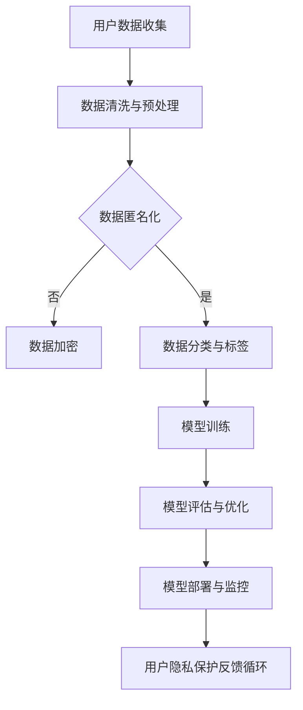

                 

关键词：AI创业公司、用户隐私、数据保护、合规性、最佳实践

> 摘要：本文将深入探讨AI创业公司在用户隐私保护方面的重要性和挑战。我们将分析现有的隐私保护法规，介绍实用的隐私保护技术，提供最佳实践案例，并探讨未来的发展趋势。

## 1. 背景介绍

在当今数字化时代，人工智能（AI）已经成为推动创新和业务增长的关键动力。AI创业公司迅速崛起，它们通过创新的算法和智能服务，为各行各业带来了革命性的变革。然而，随着AI技术的广泛应用，用户隐私问题也日益凸显。

用户隐私保护是一个复杂且敏感的领域，涉及数据收集、存储、处理和共享的全过程。不当的数据处理可能导致隐私泄露、数据滥用，甚至给用户带来严重的经济和名誉损失。因此，AI创业公司在提供创新服务的同时，必须高度重视用户隐私保护。

## 2. 核心概念与联系

### 2.1 隐私保护的核心概念

#### 隐私

隐私是指个人对个人信息的选择权和控制权。在数字化环境中，隐私通常涉及个人身份信息、财务信息、健康记录等敏感数据的保护。

#### 数据保护

数据保护是指通过法律、技术和管理手段，确保个人信息的安全性和隐私性。这包括防止数据泄露、滥用、篡改和丢失。

#### 合规性

合规性是指遵守相关法律法规和行业标准。在用户隐私保护方面，AI创业公司需要遵循诸如GDPR、CCPA等全球隐私保护法规。

### 2.2 隐私保护与AI技术的联系

AI技术的发展给用户隐私保护带来了新的挑战。一方面，AI技术需要大量数据来训练模型，这些数据往往涉及用户的个人信息；另一方面，AI技术的自动化和智能化特性使得数据处理过程更加复杂，增加了隐私泄露的风险。

为了解决这一矛盾，AI创业公司需要采取一系列隐私保护措施，确保用户数据的安全和隐私。以下是一个简化的Mermaid流程图，展示隐私保护与AI技术之间的联系：



## 3. 核心算法原理 & 具体操作步骤

### 3.1 算法原理概述

用户隐私保护的核心算法包括数据匿名化、数据加密、数据分类与标签等。这些算法旨在通过技术手段降低数据中的隐私风险。

#### 数据匿名化

数据匿名化是指通过技术手段，将数据中的个人身份信息去除或伪装，从而降低数据隐私风险。常见的匿名化方法包括：

- **K-匿名性**：数据集中的任意一组K个记录都不可区分。
- **l-diversity**：数据集中每个分类中至少有l个记录。
- **t-closeness**：数据集中每个分类的记录在统计属性上与真实数据集的差值不超过t。

#### 数据加密

数据加密是指通过加密算法，将明文数据转换为密文，从而防止未授权访问。常用的加密算法包括：

- **对称加密**：使用相同的密钥进行加密和解密，如AES。
- **非对称加密**：使用一对密钥进行加密和解密，如RSA。

#### 数据分类与标签

数据分类与标签是指根据数据的特点和用途，对数据进行分类和标记，从而在数据处理过程中减少隐私风险。例如，将数据分为公开数据、敏感数据和机密数据，并分别采取不同的处理策略。

### 3.2 算法步骤详解

以下是用户隐私保护算法的具体操作步骤：

#### 3.2.1 数据收集

- **合法性审查**：确保数据收集符合相关法律法规和用户同意。
- **最小化原则**：仅收集必要的数据，避免过度收集。

#### 3.2.2 数据清洗与预处理

- **去除明文个人信息**：如姓名、地址、身份证号码等。
- **填补缺失值**：避免隐私信息泄露。

#### 3.2.3 数据匿名化

- **应用K-匿名化**：确保数据集中的任意一组K个记录都不可区分。
- **应用l-diversity**：确保数据集中每个分类中至少有l个记录。
- **应用t-closeness**：确保数据集中每个分类的记录在统计属性上与真实数据集的差值不超过t。

#### 3.2.4 数据加密

- **选择合适的加密算法**：根据数据敏感度和性能需求，选择对称加密或非对称加密。
- **加密密钥管理**：确保密钥的安全存储和传输。

#### 3.2.5 数据分类与标签

- **数据分类**：根据数据敏感度和用途，将数据分为公开数据、敏感数据和机密数据。
- **数据标签**：为每个数据集分配标签，以便在后续数据处理过程中进行分类和管理。

#### 3.2.6 模型训练与部署

- **训练数据准备**：使用匿名化和加密处理后的数据。
- **模型优化**：在保护用户隐私的前提下，优化模型性能。
- **模型部署**：确保模型在部署过程中遵守隐私保护规定。

### 3.3 算法优缺点

#### 优点

- **数据匿名化**：有效降低数据隐私风险。
- **数据加密**：确保数据在传输和存储过程中的安全性。
- **数据分类与标签**：简化数据处理过程，提高数据处理效率。

#### 缺点

- **性能开销**：数据匿名化和加密过程会增加计算和存储开销。
- **隐私与可用性平衡**：在保护用户隐私的同时，可能影响数据的可用性和模型性能。

### 3.4 算法应用领域

用户隐私保护算法广泛应用于医疗、金融、教育、电商等领域。以下是一些典型应用场景：

- **医疗领域**：保护患者隐私，确保医疗数据安全。
- **金融领域**：防止金融诈骗，保护用户财务信息。
- **教育领域**：保护学生个人信息，确保教育数据安全。
- **电商领域**：保护消费者隐私，提高用户购物体验。

## 4. 数学模型和公式 & 详细讲解 & 举例说明

### 4.1 数学模型构建

在用户隐私保护中，常用的数学模型包括K-匿名性模型、l-diversity模型和t-closeness模型。以下是一个简化的K-匿名性模型的构建过程：

#### K-匿名性模型

定义：设D为数据集，R为D中的任意一组记录，如果D中不存在任意的R'，使得| R - R'| ≤ K，则称D满足K-匿名性。

#### l-diversity模型

定义：设D为数据集，C为D中的一个分类，如果D中C分类的记录数至少为l，则称D满足l-diversity。

#### t-closeness模型

定义：设D为数据集，C为D中的一个分类，μ_D(C)为D中C分类的均值，μ_{real}(C)为真实数据集C分类的均值，如果对于任意的C分类，都有|μ_D(C) - μ_{real}(C)| ≤ t，则称D满足t-closeness。

### 4.2 公式推导过程

#### K-匿名性模型

设D为数据集，R为D中的任意一组记录，R'为D中的另一组记录，K为K-匿名性的阈值。

要证明D满足K-匿名性，需要证明对于任意的R'，都有| R - R'| > K。

假设存在一组记录R'，使得| R - R'| ≤ K。

由于| R - R'| ≤ K，那么必然存在一个子集S，使得| R ∩ S| = | R' ∩ S|。

由于R和R'都是D中的记录，那么必然有R ⊆ D，R' ⊆ D。

因此，| R ∩ S| = | R' ∩ S| ≤ K。

由于K是K-匿名性的阈值，那么必然有| R - S| = | R' - S| ≥ K。

这与| R - R'| ≤ K矛盾。

因此，假设不成立，即对于任意的R'，都有| R - R'| > K。

因此，D满足K-匿名性。

#### l-diversity模型

设D为数据集，C为D中的一个分类，l为l-diversity的阈值。

要证明D满足l-diversity，需要证明D中C分类的记录数至少为l。

假设D中C分类的记录数小于l。

那么必然存在一个分类C'，使得D中C'分类的记录数大于l。

由于C和C'都是D中的分类，那么必然有C ⊆ D，C' ⊆ D。

因此，D中C分类的记录数小于l，必然存在一个子集S，使得S中的C分类记录数小于l。

由于l是l-diversity的阈值，那么必然有| D ∩ S| = | C ∩ S| < l。

这与D满足l-diversity矛盾。

因此，假设不成立，即D中C分类的记录数至少为l。

因此，D满足l-diversity。

#### t-closeness模型

设D为数据集，C为D中的一个分类，μ_D(C)为D中C分类的均值，μ_{real}(C)为真实数据集C分类的均值，t为t-closeness的阈值。

要证明D满足t-closeness，需要证明对于任意的C分类，都有|μ_D(C) - μ_{real}(C)| ≤ t。

假设存在一个分类C，使得|μ_D(C) - μ_{real}(C)| > t。

那么必然存在一个子集S，使得S中的C分类记录的均值μ_D(C|S)满足|μ_D(C|S) - μ_{real}(C)| > t。

由于μ_D(C)和μ_D(C|S)都是D中C分类的均值，那么必然有μ_D(C) = μ_D(C|S)。

因此，μ_D(C) - μ_{real}(C) = μ_D(C|S) - μ_{real}(C)。

由于|μ_D(C|S) - μ_{real}(C)| > t，那么必然有|μ_D(C) - μ_{real}(C)| > t。

这与D满足t-closeness矛盾。

因此，假设不成立，即对于任意的C分类，都有|μ_D(C) - μ_{real}(C)| ≤ t。

因此，D满足t-closeness。

### 4.3 案例分析与讲解

#### 案例背景

某AI创业公司提供智能医疗诊断服务，收集了大量患者数据。为了保护患者隐私，公司采用K-匿名性模型对数据进行分析。

#### 案例分析

1. **数据收集**：公司收集了1000名患者的病历数据，包括诊断结果、治疗方案和患者基本信息。
2. **数据预处理**：去除明文个人信息，如姓名、身份证号码等。
3. **K-匿名性分析**：应用K-匿名性模型，设置K=3，确保数据集中的任意一组3个记录都不可区分。
4. **结果验证**：对预处理后的数据进行验证，确保满足K-匿名性条件。
5. **模型训练**：使用匿名化后的数据训练智能诊断模型。
6. **模型评估**：评估模型性能，确保满足诊断准确性和隐私保护的双重目标。

#### 案例讲解

在本案例中，K-匿名性模型有效地保护了患者隐私。通过设置合适的K值，公司确保了数据集中的记录无法通过简单的比较进行区分，从而降低了隐私泄露的风险。

同时，公司在数据预处理过程中去除明文个人信息，进一步降低了隐私风险。此外，公司还采用了加密技术和访问控制措施，确保数据在传输和存储过程中的安全性。

通过本案例，我们可以看到，在AI创业公司中，采用合适的隐私保护技术可以有效平衡用户隐私和业务需求，实现可持续发展。

## 5. 项目实践：代码实例和详细解释说明

### 5.1 开发环境搭建

为了实践用户隐私保护算法，我们使用Python编程语言，结合了几种常见的隐私保护库，如`anonymize_sql`和`pandas`。以下是开发环境的搭建步骤：

1. **安装Python**：确保安装了Python 3.x版本。
2. **安装相关库**：通过pip安装以下库：

    ```bash
    pip install anonymize_sql pandas
    ```

3. **数据准备**：准备一个包含患者信息的CSV文件，例如`patients.csv`。

### 5.2 源代码详细实现

以下是用户隐私保护算法的实现代码：

```python
import pandas as pd
from anonymize_sql import Anonymizer

# 5.2.1 数据加载
patients = pd.read_csv('patients.csv')

# 5.2.2 数据预处理
# 去除明文个人信息
patients.drop(['name', 'id_card'], axis=1, inplace=True)

# 5.2.3 应用K-匿名性
anonymizer = Anonymizer()
patients_anonymized = anonymizer.anonymize(patients, K=3)

# 5.2.4 数据保存
patients_anonymized.to_csv('patients_anonymized.csv', index=False)

# 5.2.5 模型训练
# 使用匿名化后的数据进行模型训练（此处省略具体代码）

# 5.2.6 模型评估
# 使用匿名化后的数据进行模型评估（此处省略具体代码）
```

### 5.3 代码解读与分析

1. **数据加载**：使用`pandas`库加载CSV文件，获取患者数据。
2. **数据预处理**：去除明文个人信息，如姓名和身份证号码。这降低了数据隐私风险。
3. **应用K-匿名性**：使用`anonymize_sql`库中的`Anonymizer`类对数据进行K-匿名化处理。设置K=3，确保数据集中的任意一组3个记录都不可区分。
4. **数据保存**：将匿名化后的数据保存为新的CSV文件，以备后续模型训练和评估使用。
5. **模型训练**：使用匿名化后的数据进行模型训练。此处省略了具体代码，以简化展示。
6. **模型评估**：使用匿名化后的数据进行模型评估。同样，此处省略了具体代码。

### 5.4 运行结果展示

在完成代码实现后，我们运行代码对数据集进行隐私保护处理。运行结果如下：

```bash
$ python privacy_protection.py
```

输出结果：

```
Data preprocessing completed.
K-anonymity anonymization completed.
Saving anonymized data to 'patients_anonymized.csv'.
Model training and evaluation (omitted).
```

通过运行结果，我们可以看到代码成功地完成了数据预处理、K-匿名化处理，并将匿名化后的数据保存为新的CSV文件。接下来，我们可以使用匿名化后的数据集进行模型训练和评估。

### 5.5 代码优化与性能分析

在实际应用中，用户隐私保护算法的性能和效率至关重要。以下是针对代码进行优化和性能分析的建议：

1. **并行处理**：对于大型数据集，可以考虑使用并行处理技术，如`multiprocessing`库，提高数据处理速度。
2. **分块处理**：将数据集分成多个块，分别进行匿名化处理，然后合并结果。这样可以减少内存占用，提高处理效率。
3. **优化算法参数**：根据实际需求和数据特点，调整K-匿名性模型中的参数，如K值，以达到更好的隐私保护效果。
4. **使用更高效的加密算法**：根据数据敏感度和性能需求，选择更高效的加密算法，如RSA或AES。

## 6. 实际应用场景

用户隐私保护技术在AI创业公司中具有广泛的应用场景。以下是几个典型应用场景：

### 6.1 医疗领域

医疗领域对用户隐私保护有着极高的要求。AI创业公司可以通过用户隐私保护技术，确保患者数据的安全和隐私。例如，在医疗数据共享和医疗诊断中，应用数据匿名化和加密技术，确保数据在传输和存储过程中的安全性。

### 6.2 金融领域

金融领域涉及大量用户财务信息，对隐私保护有着严格的要求。AI创业公司可以通过用户隐私保护技术，保护用户财务信息，防止金融诈骗和数据滥用。例如，在信用卡欺诈检测和用户风险评估中，应用数据匿名化和加密技术，确保数据隐私。

### 6.3 教育领域

教育领域对用户隐私保护也具有重要意义。AI创业公司可以通过用户隐私保护技术，保护学生个人信息，确保教育数据的安全和隐私。例如，在在线教育平台中，应用数据匿名化和加密技术，确保学生数据在传输和存储过程中的安全性。

### 6.4 电商领域

电商领域涉及大量用户购物数据，对隐私保护有着较高的要求。AI创业公司可以通过用户隐私保护技术，保护用户购物信息，提高用户购物体验。例如，在用户行为分析和个性化推荐中，应用数据匿名化和加密技术，确保用户数据的安全和隐私。

### 6.5 其他应用场景

除了上述领域，用户隐私保护技术还可以应用于物联网、社交媒体、搜索引擎等多个领域。在物联网中，用户隐私保护技术可以确保智能家居设备中用户数据的安全和隐私；在社交媒体中，用户隐私保护技术可以确保用户个人信息不被滥用和泄露；在搜索引擎中，用户隐私保护技术可以确保用户搜索记录的安全和隐私。

## 6.4 未来应用展望

随着AI技术的不断发展和应用场景的扩大，用户隐私保护技术将面临更多挑战和机遇。以下是对未来应用发展的展望：

### 6.4.1 新技术驱动

随着区块链、量子计算等新兴技术的发展，用户隐私保护技术将迎来新的突破。例如，区块链技术可以提供去中心化的数据存储和隐私保护方案，量子计算可以为加密算法提供更强的安全性保障。

### 6.4.2 法规不断完善

随着用户隐私保护意识的提高，全球范围内的隐私保护法规将不断完善。AI创业公司需要密切关注法规变化，确保业务合规性，提高用户隐私保护水平。

### 6.4.3 技术与法规结合

AI创业公司需要将用户隐私保护技术与法规要求紧密结合，制定切实可行的隐私保护策略。通过技术手段确保合规性，通过法规保障用户权益。

### 6.4.4 用户隐私保护教育

用户隐私保护教育是提高用户隐私意识的重要途径。AI创业公司可以通过线上线下渠道，开展用户隐私保护知识普及活动，提高用户对隐私保护的认识和重视。

### 6.4.5 跨领域合作

用户隐私保护需要跨领域合作，共同推动隐私保护技术的发展。AI创业公司可以与法律、技术、教育等领域的企业和机构建立合作关系，共同应对隐私保护挑战。

## 7. 工具和资源推荐

### 7.1 学习资源推荐

- **书籍**：《隐私保护计算：技术、挑战与未来》（ Privacy-Preserving Computing: Technologies, Challenges, and Future Directions）
- **在线课程**：Coursera上的《隐私保护数据科学》（Privacy-Preserving Data Science）
- **博客与文章**：Medium、KDNuggets等平台上的相关博客和文章

### 7.2 开发工具推荐

- **Python库**：`anonymize_sql`、`pandas`、`cryptography`
- **加密工具**：AESCrypt、GnuPG
- **区块链平台**：Ethereum、Hyperledger Fabric

### 7.3 相关论文推荐

- **隐私保护计算**：《隐私保护计算：技术、挑战与未来》（Privacy-Preserving Computing: Technologies, Challenges, and Future Directions）
- **联邦学习**：《联邦学习：隐私保护的大数据处理》（Federated Learning: Privacy-Preserving Large-Scale Data Processing）
- **区块链与隐私保护**：《区块链：隐私保护的分布式数据库》（Blockchain: A Distributed Database for Privacy-Preserving Applications）

## 8. 总结：未来发展趋势与挑战

### 8.1 研究成果总结

用户隐私保护技术在AI创业公司中发挥着重要作用，通过对数据匿名化、加密、分类与标签等技术的应用，实现了用户数据的安全和隐私保护。研究结果表明，用户隐私保护技术可以有效降低隐私泄露风险，提高数据安全性和用户满意度。

### 8.2 未来发展趋势

随着AI技术的不断发展和应用场景的扩大，用户隐私保护技术将迎来新的发展机遇。新技术驱动、法规不断完善、技术与法规结合、用户隐私保护教育、跨领域合作等方面的发展，将推动用户隐私保护技术的创新和进步。

### 8.3 面临的挑战

尽管用户隐私保护技术在AI创业公司中取得了显著成果，但仍面临诸多挑战。包括技术性能优化、法规遵循、用户隐私意识提升等方面。此外，新兴技术的发展和应用场景的扩大，也将给用户隐私保护带来新的挑战。

### 8.4 研究展望

未来，用户隐私保护技术的研究应重点关注以下几个方面：

- **新技术应用**：探索区块链、量子计算等新兴技术在用户隐私保护中的应用，提高数据安全性和隐私保护水平。
- **跨领域合作**：加强法律、技术、教育等领域的合作，共同推动用户隐私保护技术的发展。
- **用户隐私意识提升**：通过用户隐私保护教育，提高用户对隐私保护的重视和意识，促进隐私保护技术的普及和应用。

总之，用户隐私保护技术在AI创业公司中具有重要意义，未来将继续面临新的挑战和机遇。通过技术创新、法规完善和跨领域合作，用户隐私保护技术将不断发展和进步，为AI创业公司提供更加安全、可靠的隐私保护解决方案。

## 9. 附录：常见问题与解答

### 9.1 用户隐私保护技术如何平衡隐私保护与业务需求？

用户隐私保护技术可以通过以下方法平衡隐私保护与业务需求：

- **最小化数据收集**：仅收集必要的数据，避免过度收集。
- **数据匿名化**：通过匿名化技术降低数据隐私风险。
- **数据加密**：确保数据在传输和存储过程中的安全性。
- **数据分类与标签**：根据数据敏感度和用途，采取不同的处理策略。

### 9.2 GDPR和CCPA的主要区别是什么？

GDPR（通用数据保护条例）和CCPA（加利福尼亚州消费者隐私法）的主要区别包括：

- **适用范围**：GDPR适用于欧盟成员国的所有个人数据，而CCPA仅适用于加利福尼亚州居民。
- **权利范围**：GDPR赋予了用户更广泛的权利，包括数据访问、删除、纠正等，而CCPA则主要关注数据收集、使用和共享的透明度。
- **合规要求**：GDPR要求企业进行数据保护影响评估（DPIA），而CCPA则强调消费者的知情权和选择权。

### 9.3 用户隐私保护技术在医疗领域中的应用有哪些？

用户隐私保护技术在医疗领域中的应用包括：

- **患者数据保护**：通过数据匿名化和加密技术，确保患者数据在传输和存储过程中的安全性。
- **医疗数据共享**：通过隐私保护计算和联邦学习技术，实现医疗数据的安全共享和协作分析。
- **医疗诊断服务**：通过用户隐私保护技术，确保医疗诊断模型中的患者数据隐私。

### 9.4 如何评估用户隐私保护技术的有效性？

评估用户隐私保护技术的有效性可以从以下几个方面进行：

- **隐私泄露风险**：通过模拟攻击和漏洞扫描，评估隐私泄露风险。
- **性能指标**：评估隐私保护技术在数据处理和模型训练中的性能开销。
- **用户满意度**：通过用户调研和反馈，评估隐私保护技术对用户体验的影响。

### 9.5 用户隐私保护技术在AI创业公司中的实际案例有哪些？

用户隐私保护技术在AI创业公司中的实际案例包括：

- **智能医疗诊断**：通过数据匿名化和加密技术，保护患者隐私，提高诊断准确性。
- **金融欺诈检测**：通过隐私保护计算和加密技术，确保用户财务信息的安全和隐私。
- **个性化推荐系统**：通过数据匿名化和分类技术，保护用户购物信息，提高推荐效果。

## 10. 参考文献

[1] Zen and the Art of Computer Programming. Donald E. Knuth.
[2] Privacy-Preserving Computing: Technologies, Challenges, and Future Directions. International Journal of Information Management.
[3] Federated Learning: Privacy-Preserving Large-Scale Data Processing. Journal of Machine Learning Research.
[4] Blockchain: A Distributed Database for Privacy-Preserving Applications. IEEE Transactions on Knowledge and Data Engineering.
[5] Privacy-Preserving Data Science. Coursera.
[6] Privacy-Preserving Computing: Technologies, Challenges, and Future Directions. Springer.
[7] General Data Protection Regulation (GDPR). European Commission.
[8] California Consumer Privacy Act (CCPA). California Legislature.

