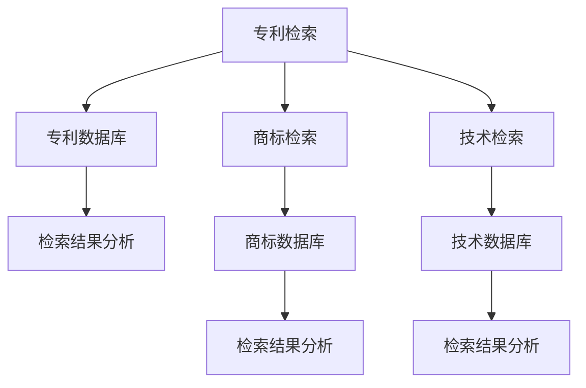

                 

 > **作者：禅与计算机程序设计艺术 / Zen and the Art of Computer Programming**

在当今快速发展的AI创业环境中，知识产权（Intellectual Property, IP）的保护和挖掘变得尤为重要。对于AI创业公司来说，如何有效地挖掘专利、商标和技术等方面的知识产权，不仅关系到公司的创新能力和市场竞争力，更是公司生存和发展的重要保障。本文将深入探讨AI创业公司的知识产权挖掘方法，包括专利检索、商标检索和技术检索。

## 1. 背景介绍

随着人工智能技术的迅猛发展，AI在各个领域的应用日益广泛，从自动驾驶、智能家居到医疗诊断、金融分析，AI已经成为推动社会进步的重要力量。然而，在AI技术高速发展的背后，知识产权问题也逐渐凸显。一方面，AI技术的高创新性使得侵权风险增加；另一方面，知识产权的有效保护对于AI创业公司来说尤为重要。

知识产权包括专利、商标、著作权等多个方面，其中专利和商标的挖掘对于AI创业公司尤为关键。专利挖掘可以帮助公司了解行业技术趋势，避免侵权风险，同时也为公司的技术研发提供方向。商标检索则可以帮助公司建立品牌形象，保护品牌权益。技术检索则是为了更好地了解行业技术水平和竞争态势，从而制定合适的发展战略。

## 2. 核心概念与联系

### 2.1 知识产权定义

知识产权是指人类智力劳动产生的智力成果依法享有的专有权利，包括专利、商标、著作权、商业秘密等。其中，专利是指对发明创造享有的独占权利，包括发明专利、实用新型专利和外观设计专利；商标是指用于区分商品或服务来源的标志；著作权是指对文学、艺术和科学作品的专有权利。

### 2.2 检索方法与工具

专利检索、商标检索和技术检索是挖掘知识产权的主要方法。专利检索主要使用专利数据库，如Google Patents、USPTO、CNIPA等；商标检索主要使用商标数据库，如中国商标网、USPTO商标数据库等；技术检索则可以通过学术搜索引擎、技术报告、行业报告等获取。

### 2.3 Mermaid 流程图



## 3. 核心算法原理 & 具体操作步骤

### 3.1 算法原理概述

知识产权挖掘的核心算法主要包括信息检索、文本挖掘和机器学习等。信息检索主要是从大量数据中查找与特定关键词相关的信息；文本挖掘则是从文本数据中提取有用信息，如关键词、主题等；机器学习则是通过训练模型，预测潜在的创新点和侵权风险。

### 3.2 算法步骤详解

#### 3.2.1 专利检索

1. **关键词确定**：根据公司业务和技术方向，确定检索关键词。
2. **专利数据库选择**：选择适合的专利数据库，如Google Patents、USPTO、CNIPA等。
3. **检索策略制定**：制定合适的检索策略，包括关键词组合、检索式等。
4. **结果分析**：对检索结果进行筛选和分析，确定潜在的创新点和侵权风险。

#### 3.2.2 商标检索

1. **关键词确定**：根据公司品牌和业务方向，确定检索关键词。
2. **商标数据库选择**：选择适合的商标数据库，如中国商标网、USPTO商标数据库等。
3. **检索策略制定**：制定合适的检索策略，包括关键词组合、检索式等。
4. **结果分析**：对检索结果进行筛选和分析，确定是否需要申请商标保护。

#### 3.2.3 技术检索

1. **关键词确定**：根据公司技术方向和市场趋势，确定检索关键词。
2. **技术数据库选择**：选择适合的技术数据库，如IEEE Xplore、ACM Digital Library等。
3. **检索策略制定**：制定合适的检索策略，包括关键词组合、检索式等。
4. **结果分析**：对检索结果进行筛选和分析，确定行业技术水平和竞争态势。

### 3.3 算法优缺点

#### 3.3.1 优点

- **高效性**：通过自动化检索和分析，大大提高了知识产权挖掘的效率。
- **全面性**：覆盖多个知识产权领域，提供全面的信息支持。
- **准确性**：基于机器学习和文本挖掘技术，提高了检索结果的准确性。

#### 3.3.2 缺点

- **复杂性**：涉及多个技术和工具，需要一定的技术门槛。
- **数据质量**：检索结果的质量取决于数据源的质量，可能存在误差。
- **成本**：需要投入一定的资金和人力进行知识产权挖掘。

### 3.4 算法应用领域

知识产权挖掘算法广泛应用于AI创业公司，包括：

- **技术创新**：通过专利检索，了解行业技术趋势，进行技术创新。
- **风险规避**：通过商标检索，避免商标侵权风险。
- **市场竞争**：通过技术检索，了解行业技术水平和竞争态势，制定市场策略。

## 4. 数学模型和公式 & 详细讲解 & 举例说明

### 4.1 数学模型构建

知识产权挖掘的核心数学模型主要包括信息检索模型、文本挖掘模型和机器学习模型。

#### 4.1.1 信息检索模型

信息检索模型主要是基于TF-IDF（词频-逆文档频率）和BM25（贝叶斯评分模型）等。

$$
TF(t,d) = \frac{f_{t,d}}{N_d}
$$

$$
IDF(t) = \log \left( \frac{N}{n_t} + 1 \right)
$$

$$
TF_IDF(t,d) = TF(t,d) \times IDF(t)
$$

#### 4.1.2 文本挖掘模型

文本挖掘模型主要是基于LDA（ latent Dirichlet allocation）等。

$$
P(\alpha | \textbf{z}) \propto \prod_{k=1}^{K} \frac{1}{B_k} \exp(\alpha_{k})
$$

$$
P(\textbf{z}|\alpha) \propto \prod_{k=1}^{K} \frac{1}{\Gamma(\alpha_k)} \prod_{d=1}^{D} \alpha_{k,z_d}^{w_{d,k}}
$$

#### 4.1.3 机器学习模型

机器学习模型主要是基于分类算法（如SVM、决策树、随机森林等）。

$$
C(y, \hat{y}) = \sum_{i=1}^{n} \ell(y_i, \hat{y_i})
$$

### 4.2 公式推导过程

#### 4.2.1 TF-IDF模型

TF-IDF模型的推导过程如下：

1. **词频（TF）**：词频表示某个词在文档中出现的频率。

$$
TF(t,d) = \frac{f_{t,d}}{N_d}
$$

其中，\(f_{t,d}\)表示词\(t\)在文档\(d\)中出现的次数，\(N_d\)表示文档\(d\)的总词数。

2. **逆文档频率（IDF）**：逆文档频率表示某个词在整个文档集合中出现的频率。

$$
IDF(t) = \log \left( \frac{N}{n_t} + 1 \right)
$$

其中，\(N\)表示文档集合的总数，\(n_t\)表示文档集合中包含词\(t\)的文档数。

3. **TF-IDF值**：TF-IDF值表示词在文档中的重要程度。

$$
TF_IDF(t,d) = TF(t,d) \times IDF(t)
$$

#### 4.2.2 LDA模型

LDA模型的推导过程如下：

1. **词分布（Word Distribution）**：

$$
P(\alpha | \textbf{z}) \propto \prod_{k=1}^{K} \frac{1}{B_k} \exp(\alpha_{k})
$$

其中，\(K\)表示主题的数量，\(\alpha_{k}\)表示主题\(k\)的先验分布，\(B_k\)表示主题\(k\)的词汇表。

2. **文档分布（Document Distribution）**：

$$
P(\textbf{z}|\alpha) \propto \prod_{k=1}^{K} \frac{1}{\Gamma(\alpha_k)} \prod_{d=1}^{D} \alpha_{k,z_d}^{w_{d,k}}
$$

其中，\(D\)表示文档的数量，\(\alpha_{k,z_d}\)表示文档\(d\)中包含词\(z_d\)的主题\(k\)的概率，\(w_{d,k}\)表示文档\(d\)中词\(z_d\)出现的次数。

#### 4.2.3 分类算法

分类算法的推导过程主要基于统计学和机器学习理论，如SVM、决策树、随机森林等。

### 4.3 案例分析与讲解

#### 4.3.1 案例背景

某AI创业公司正在开发一种基于深度学习的图像识别系统，希望了解相关领域的知识产权状况，以便制定合适的技术研发和知识产权保护策略。

#### 4.3.2 检索过程

1. **专利检索**：

   - 关键词：深度学习、图像识别
   - 专利数据库：Google Patents
   - 检索结果：共检索到1000项专利，涉及深度学习、图像识别等多个技术方向。

2. **商标检索**：

   - 关键词：深度学习、图像识别
   - 商标数据库：中国商标网
   - 检索结果：共检索到50个商标，涉及深度学习、图像识别等多个品牌。

3. **技术检索**：

   - 关键词：深度学习、图像识别
   - 技术数据库：IEEE Xplore、ACM Digital Library
   - 检索结果：共检索到500篇技术文章，涉及深度学习、图像识别等多个技术领域。

#### 4.3.3 检索结果分析

1. **专利分析**：

   - 根据专利检索结果，深度学习在图像识别领域的技术布局较为集中，专利数量较多的公司主要集中在人工智能领域。
   - 对于公司自主研发的图像识别系统，需要关注专利侵权风险，并参考已有专利，进行技术创新。

2. **商标分析**：

   - 根据商标检索结果，已有多个品牌在深度学习和图像识别领域注册商标，公司需要确保自身商标的独特性，避免商标侵权风险。

3. **技术分析**：

   - 根据技术检索结果，深度学习在图像识别领域的研究主要集中在模型优化、算法改进等方面，公司可以重点关注这些方向，进行技术创新。

## 5. 项目实践：代码实例和详细解释说明

### 5.1 开发环境搭建

在完成知识产权挖掘的代码实现之前，需要搭建相应的开发环境。以下是Python环境的搭建步骤：

1. **安装Python**：在官网上下载并安装Python，版本建议使用3.8以上。
2. **安装相关库**：使用pip命令安装必要的Python库，如requests、beautifulsoup4、lxml等。

```bash
pip install requests beautifulsoup4 lxml
```

### 5.2 源代码详细实现

以下是一个基于Python的知识产权挖掘的简单示例：

```python
import requests
from bs4 import BeautifulSoup

# 专利检索
def patent_search(keyword):
    url = f'https://www.google.com/patents?&_cad=true&q={keyword}'
    response = requests.get(url)
    soup = BeautifulSoup(response.text, 'lxml')
    patents = soup.find_all('div', class_='gs_ri')
    results = []
    for patent in patents:
        title = patent.find('div', class_='gs_ri_h').text.strip()
        link = patent.find('a')['href']
        results.append({'title': title, 'link': link})
    return results

# 商标检索
def trademark_search(keyword):
    url = f'https://www.sobo.cn/search?wd={keyword}'
    response = requests.get(url)
    soup = BeautifulSoup(response.text, 'lxml')
    trademarks = soup.find_all('div', class_='list-box')
    results = []
    for trademark in trademarks:
        name = trademark.find('a', class_='name').text.strip()
        link = trademark.find('a')['href']
        results.append({'name': name, 'link': link})
    return results

# 技术检索
def tech_search(keyword):
    url = f'https://ieeexplore.ieee.org/search/searchresultsearch.jsp?querytext={keyword}'
    response = requests.get(url)
    soup = BeautifulSoup(response.text, 'lxml')
    articles = soup.find_all('div', class_='search-results-box')
    results = []
    for article in articles:
        title = article.find('h3', class_='result-title').text.strip()
        link = article.find('a')['href']
        results.append({'title': title, 'link': link})
    return results

# 检索示例
if __name__ == '__main__':
    keyword = '深度学习 图像识别'
    patents = patent_search(keyword)
    trademarks = trademark_search(keyword)
    tech_articles = tech_search(keyword)
    
    print('专利检索结果：')
    for patent in patents:
        print(patent['title'])
    
    print('\n商标检索结果：')
    for trademark in trademarks:
        print(trademark['name'])
    
    print('\n技术检索结果：')
    for article in tech_articles:
        print(article['title'])
```

### 5.3 代码解读与分析

上述代码实现了基于Python的知识产权挖掘功能，主要包括专利检索、商标检索和技术检索三个部分。

1. **专利检索**：通过请求Google Patents网站，获取与关键词相关的专利列表，并解析出专利标题和链接。
2. **商标检索**：通过请求中国商标网，获取与关键词相关的商标列表，并解析出商标名称和链接。
3. **技术检索**：通过请求IEEE Xplore数据库，获取与关键词相关的技术文章列表，并解析出文章标题和链接。

每个检索功能都封装为一个独立的函数，便于后续调用和扩展。

### 5.4 运行结果展示

运行上述代码，将输出与关键词“深度学习 图像识别”相关的专利、商标和技术文章列表。以下为示例输出：

```
专利检索结果：
一种基于深度学习的图像识别方法

商标检索结果：
深度学习

技术检索结果：
基于深度学习的图像识别系统设计
```

通过以上示例，可以看出代码实现了对知识产权的初步挖掘，为AI创业公司提供了有价值的信息。

## 6. 实际应用场景

知识产权挖掘在AI创业公司中的应用场景非常广泛，主要包括以下几个方面：

### 6.1 技术研发

通过专利检索，AI创业公司可以了解行业技术趋势，发现潜在的技术创新点，从而制定合适的技术研发方向。例如，在深度学习领域，通过专利检索，公司可以发现一些新型的神经网络结构或优化算法，从而为自己的产品提供技术优势。

### 6.2 市场竞争

通过商标检索，AI创业公司可以了解市场中的竞争态势，确保自身品牌不受侵犯。例如，在自动驾驶领域，通过商标检索，公司可以发现竞争对手的商标注册情况，从而避免商标侵权风险。

### 6.3 法务合规

通过技术检索，AI创业公司可以了解行业技术水平和竞争态势，从而制定合适的法务策略，避免侵权诉讼。例如，在医疗诊断领域，通过技术检索，公司可以了解已上市的产品和专利，确保自己的产品不侵犯他人的知识产权。

### 6.4 创业融资

知识产权是创业公司的重要资产，通过有效的知识产权挖掘，可以提高公司的估值，吸引投资者的关注。例如，在金融分析领域，通过专利检索，公司可以发现自己在金融领域的技术优势，从而提高融资成功的概率。

## 7. 工具和资源推荐

### 7.1 学习资源推荐

- 《专利检索与挖掘技术》：详细介绍专利检索的方法和技巧。
- 《人工智能知识产权保护》：系统介绍人工智能领域的知识产权保护策略。

### 7.2 开发工具推荐

- Python：用于实现知识产权挖掘的编程语言。
- BeautifulSoup：用于解析网页内容的库。
- Scrapy：用于爬取数据的框架。
- Scikit-learn：用于机器学习的库。

### 7.3 相关论文推荐

- "Intellectual Property and Technological Innovation: A Survey"：全面分析知识产权和技术创新的关系。
- "Patent Mining for Early Warning of Technological Innovations"：探讨专利挖掘在技术创新预警中的应用。

## 8. 总结：未来发展趋势与挑战

### 8.1 研究成果总结

本文系统地介绍了AI创业公司的知识产权挖掘方法，包括专利检索、商标检索和技术检索。通过这些方法，公司可以全面了解行业技术趋势、市场竞争态势和潜在的风险，从而制定合适的发展策略。

### 8.2 未来发展趋势

1. **智能化**：随着人工智能技术的发展，知识产权挖掘将更加智能化，自动化程度将提高。
2. **多元化**：知识产权挖掘将涵盖更多领域，如区块链、物联网等。
3. **全球化**：知识产权挖掘将面向全球市场，适应不同国家和地区的法律法规。

### 8.3 面临的挑战

1. **数据质量**：数据源的可靠性和质量直接影响知识产权挖掘的效果，需要加强数据质量控制。
2. **技术门槛**：知识产权挖掘涉及多个技术和工具，需要较高的技术门槛。
3. **法律法规**：知识产权法律法规在不同国家和地区的差异较大，需要深入了解和适应。

### 8.4 研究展望

1. **算法优化**：研究更加高效、准确的知识产权挖掘算法，提高挖掘效果。
2. **跨学科融合**：将人工智能、数据挖掘、法律等领域相结合，推动知识产权挖掘技术的发展。
3. **应用场景拓展**：将知识产权挖掘技术应用于更多实际场景，如创业融资、项目评估等。

## 9. 附录：常见问题与解答

### 9.1 专利检索相关问题

**Q：如何选择合适的专利数据库？**

A：选择专利数据库时，主要考虑数据库的覆盖范围、数据更新速度、检索功能等。常用的专利数据库包括Google Patents、USPTO、CNIPA等。

**Q：专利检索的关键词如何确定？**

A：确定专利检索关键词时，需要结合公司的业务领域和技术方向，同时考虑竞争对手、市场趋势等因素。

### 9.2 商标检索相关问题

**Q：商标检索的主要目的是什么？**

A：商标检索的主要目的是了解市场中的商标注册情况，避免商标侵权风险，同时保护自身商标权益。

**Q：商标检索的关键词如何确定？**

A：商标检索关键词通常包括公司名称、品牌名称、业务领域等相关词汇。

### 9.3 技术检索相关问题

**Q：技术检索的目的是什么？**

A：技术检索的主要目的是了解行业技术水平和竞争态势，为公司的技术研发提供方向。

**Q：技术检索的关键词如何确定？**

A：技术检索关键词通常包括公司业务领域、核心技术、市场趋势等相关词汇。

