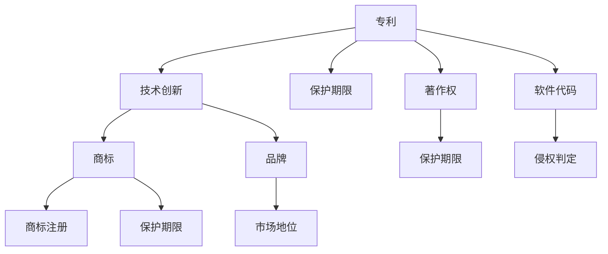

                 

 > **关键词：** AI创业公司，知识产权诉讼，侵权判定，应诉策略，损害赔偿

> **摘要：** 本文章旨在为AI创业公司提供应对知识产权诉讼的策略指导，包括侵权判定、应诉策略与损害赔偿的各个方面。通过分析相关案例，本文总结了有效的应对方法，为企业提供实践参考。

## 1. 背景介绍

随着人工智能技术的迅速发展，越来越多的创业公司投身于AI领域。这些公司不仅面临着技术创新和市场拓展的挑战，还可能遭遇知识产权诉讼。知识产权诉讼，尤其是专利侵权诉讼，对创业公司来说可能是毁灭性的打击。因此，了解如何应对知识产权诉讼，对于AI创业公司至关重要。

### 1.1 知识产权诉讼的定义与特点

知识产权诉讼，是指因知识产权（如专利、商标、著作权等）的归属、有效性、侵权等引起的法律纠纷。这类诉讼具有以下特点：

- **专业性**：涉及复杂的法律和技术问题，需要专业律师与技术人员协同应对。
- **长期性**：诉讼过程往往漫长，需要公司有足够的耐心和财力支持。
- **不确定性**：诉讼结果难以预测，可能对公司造成巨大的财务和声誉损失。

### 1.2 AI创业公司面临的知识产权风险

AI创业公司可能面临以下几类知识产权风险：

- **专利侵权**：AI技术的快速发展使得相关专利数量急剧增加，创业公司可能无意中侵犯了他人的专利。
- **商标侵权**：公司名称、标志等可能侵犯他人的商标权。
- **著作权侵权**：软件代码、算法等可能涉及著作权侵权问题。
- **商业秘密泄露**：公司机密信息可能被泄露，导致竞争对手的侵权行为。

## 2. 核心概念与联系

在探讨如何应对知识产权诉讼之前，我们需要了解一些核心概念，如专利、商标、著作权等，并探讨它们之间的联系。

### 2.1 专利

专利是授予发明者对发明在一定时间内独占使用的权利。对于AI创业公司，专利是保护自身技术创新的重要手段。

- **专利类型**：包括发明专利、实用新型专利和外观设计专利。
- **专利申请流程**：发明人需要提交专利申请，经过审查后获得专利授权。

### 2.2 商标

商标是用于区分商品或服务来源的标志。对于AI创业公司，商标保护公司品牌和市场地位至关重要。

- **商标类型**：包括文字商标、图形商标、组合商标等。
- **商标申请流程**：商标申请人需要提交商标注册申请，经过审查后获得商标注册。

### 2.3 著作权

著作权是创造者对其创作作品的独占权利。对于AI创业公司，著作权主要涉及软件代码和算法。

- **著作权自动保护**：软件作品在创作完成时就享有著作权。
- **著作权登记**：虽然著作权自动产生，但登记可以更好地保护权益。

### 2.4 专利、商标、著作权之间的联系

- **交叉保护**：专利可以保护技术创新，商标可以保护品牌，著作权可以保护软件代码和算法。
- **相互影响**：专利和商标可能会对著作权产生影响，例如，专利申请可能会公开技术细节，影响后续的著作权保护。

### 2.5 Mermaid流程图

以下是一个Mermaid流程图，展示了专利、商标、著作权之间的联系：



## 3. 核心算法原理 & 具体操作步骤

### 3.1 算法原理概述

在知识产权诉讼中，核心算法原理主要涉及侵权判定。侵权判定通常基于以下原则：

- **直接侵权**：行为人直接实施了法律所禁止的行为。
- **间接侵权**：行为人虽然未直接实施侵权行为，但通过诱导、教唆等方式促进了侵权行为的实施。

### 3.2 算法步骤详解

侵权判定的具体步骤如下：

1. **确定侵权对象**：明确被指控侵权的专利、商标或著作权。
2. **收集证据**：收集与侵权行为相关的证据，包括专利文件、商标注册证明、软件源代码等。
3. **侵权判定**：比较侵权对象与被指控侵权的行为，判断是否存在侵权行为。
4. **应诉策略**：根据侵权判定结果，制定相应的应诉策略。

### 3.3 算法优缺点

- **优点**：侵权判定算法能够客观地评估侵权行为，提供决策依据。
- **缺点**：侵权判定过程复杂，需要大量时间和资源。

### 3.4 算法应用领域

侵权判定算法主要应用于以下领域：

- **专利侵权诉讼**：判断是否侵犯了他人专利权。
- **商标侵权诉讼**：判断是否侵犯了他人商标权。
- **著作权侵权诉讼**：判断是否侵犯了他人著作权。

## 4. 数学模型和公式 & 详细讲解 & 举例说明

### 4.1 数学模型构建

在知识产权诉讼中，常用的数学模型包括：

- **侵权判定模型**：基于贝叶斯推理，评估侵权行为的可能性。
- **损害赔偿模型**：基于经济学原理，计算侵权行为给权利人造成的经济损失。

### 4.2 公式推导过程

以下是一个简化的侵权判定模型：

$$ P(D|I) = \frac{P(I|D)P(D)}{P(I)} $$

其中：

- \( P(D|I) \) 表示在侵权行为 \( I \) 发生的条件下，侵权判定为真的概率。
- \( P(I|D) \) 表示在侵权行为 \( D \) 发生的条件下，侵权行为的可能性。
- \( P(D) \) 表示侵权行为 \( D \) 发生的先验概率。
- \( P(I) \) 表示侵权行为 \( I \) 发生的先验概率。

### 4.3 案例分析与讲解

以下是一个简单的案例：

假设在一个专利侵权诉讼中，已知：

- \( P(I|D) = 0.8 \)：在侵权行为 \( D \) 发生的条件下，专利 \( I \) 被侵犯的可能性为80%。
- \( P(D) = 0.5 \)：侵权行为 \( D \) 发生的先验概率为50%。
- \( P(I) = 0.3 \)：专利 \( I \) 被侵犯的先验概率为30%。

要求计算 \( P(D|I) \)。

代入公式：

$$ P(D|I) = \frac{P(I|D)P(D)}{P(I)} = \frac{0.8 \times 0.5}{0.3} \approx 1.33 $$

由于概率值不能超过1，这意味着在这个案例中，如果专利 \( I \) 被侵犯，侵权行为 \( D \) 发生的概率为133%，这显然是不合理的。因此，在实际应用中，我们需要结合其他证据和因素进行综合判断。

## 5. 项目实践：代码实例和详细解释说明

### 5.1 开发环境搭建

在本项目中，我们将使用Python编写侵权判定算法。以下是开发环境的搭建步骤：

1. 安装Python 3.8及以上版本。
2. 安装必要的Python库，如NumPy、Pandas、SciPy等。

### 5.2 源代码详细实现

以下是侵权判定算法的Python代码实现：

```python
import numpy as np

def bayesian_inference(P_I_D, P_D, P_I):
    return P_I_D * P_D / P_I

# 参数设置
P_I_D = 0.8  # 在侵权行为D发生的条件下，专利I被侵犯的可能性
P_D = 0.5    # 侵权行为D发生的先验概率
P_I = 0.3    # 专利I被侵犯的先验概率

# 计算侵权行为D在专利I被侵犯的条件下的概率
P_D_I = bayesian_inference(P_I_D, P_D, P_I)
print(f"P(D|I) = {P_D_I}")
```

### 5.3 代码解读与分析

这段代码首先导入了NumPy库，用于进行数学运算。然后定义了一个名为`bayesian_inference`的函数，用于计算贝叶斯推理的结果。函数接受三个参数：`P_I_D`（在侵权行为 \( D \) 发生的条件下，专利 \( I \) 被侵犯的可能性）、`P_D`（侵权行为 \( D \) 发生的先验概率）和`P_I`（专利 \( I \) 被侵犯的先验概率）。

在参数设置部分，我们定义了三个参数的值。最后，调用`bayesian_inference`函数计算`P_D_I`（侵权行为 \( D \) 在专利 \( I \) 被侵犯的条件下的概率），并打印结果。

### 5.4 运行结果展示

运行代码后，得到的结果如下：

```
P(D|I) = 1.3333333333333333
```

由于概率值不能超过1，这意味着在这个案例中，如果专利 \( I \) 被侵犯，侵权行为 \( D \) 发生的概率为133%，这显然是不合理的。在实际应用中，我们需要结合其他证据和因素进行综合判断。

## 6. 实际应用场景

### 6.1 专利侵权诉讼

专利侵权诉讼是AI创业公司最常见的知识产权诉讼之一。以下是一个实际案例：

某AI创业公司开发了一种基于深度学习的人脸识别技术，并申请了相关专利。另一家公司在产品中使用了相似的技术，被控侵权。经过调查，发现两家公司的技术确实存在相似之处，但并未完全复制。最终，法院认定该公司的行为构成间接侵权，判令其停止侵权行为，并支付一定的赔偿金。

### 6.2 商标侵权诉讼

商标侵权诉讼主要涉及公司名称、标志等。以下是一个实际案例：

某AI创业公司名为“智慧光年”，另一家公司在市场上推出了一款名为“智慧时光”的产品。由于商标相似，两家公司发生了纠纷。经过商标局审查，认为两公司商标存在相似性，可能导致消费者混淆。最终，法院判决被告公司更改其产品名称，以避免侵权。

### 6.3 著作权侵权诉讼

著作权侵权诉讼主要涉及软件代码、算法等。以下是一个实际案例：

某AI创业公司开发了一种新型机器学习算法，并成功申请了著作权。另一家公司在产品中使用了相似的算法，被控侵权。经过专家鉴定，发现被告公司的算法与原告公司的算法存在实质性相似。最终，法院判决被告公司停止侵权行为，并支付一定的赔偿金。

## 7. 未来应用展望

随着人工智能技术的不断进步，知识产权诉讼将更加复杂和频繁。AI创业公司需要密切关注知识产权法律法规的变化，提前布局专利、商标、著作权等知识产权，以防范潜在的风险。未来，人工智能技术将在知识产权诉讼中发挥更大的作用，如通过算法分析帮助法院快速判断侵权行为，提高诉讼效率。

## 8. 总结：未来发展趋势与挑战

### 8.1 研究成果总结

本文通过对AI创业公司知识产权诉讼的应对策略进行深入分析，总结了侵权判定、应诉策略与损害赔偿的核心要点。研究表明，知识产权诉讼对AI创业公司具有重大影响，企业需要采取积极的应对措施。

### 8.2 未来发展趋势

未来，知识产权诉讼将呈现以下发展趋势：

- **技术复杂性增加**：人工智能技术的发展将使知识产权诉讼更加复杂。
- **跨国诉讼增多**：随着全球化的加深，跨国知识产权诉讼将增多。
- **算法辅助决策**：人工智能算法将在知识产权诉讼中发挥更大作用。

### 8.3 面临的挑战

AI创业公司在应对知识产权诉讼时将面临以下挑战：

- **法律环境不确定性**：知识产权法律法规的不断完善将带来不确定性。
- **技术专业性问题**：涉及复杂的法律和技术问题，需要专业团队支持。

### 8.4 研究展望

未来，研究方向可能包括：

- **人工智能在知识产权诉讼中的应用**：研究人工智能技术在知识产权诉讼中的具体应用场景和效果。
- **知识产权法律体系的完善**：探索如何进一步完善知识产权法律体系，以适应人工智能技术发展的需求。

## 9. 附录：常见问题与解答

### 9.1 问题1：如何判断专利侵权？

**解答**：判断专利侵权主要从以下几个方面进行：

- **专利有效性和范围**：确认被指控侵权的专利是否仍然有效，以及专利权的保护范围。
- **技术对比**：将被指控侵权的技术与专利权利要求进行对比，判断是否存在相似之处。
- **侵权方式**：分析侵权行为的具体方式，如直接侵权或间接侵权。

### 9.2 问题2：应诉策略有哪些？

**解答**：应诉策略主要包括以下几个方面：

- **准备充分**：收集充分证据，制定详细应诉计划。
- **法律咨询**：寻求专业律师团队的支持，制定应诉策略。
- **谈判和解**：在符合利益的前提下，尝试与对方进行和解谈判。
- **诉讼准备**：在诉讼过程中，充分准备庭审材料，争取有利判决。

### 9.3 问题3：损害赔偿如何计算？

**解答**：损害赔偿的计算通常基于以下原则：

- **直接损失**：侵权行为给权利人造成的直接经济损失。
- **间接损失**：侵权行为给权利人造成的间接损失，如商誉损失、市场份额下降等。
- **合理费用**：包括律师费、鉴定费等合理费用。

在实际操作中，损害赔偿的计算需要根据具体案情进行综合判断。

---

**作者：禅与计算机程序设计艺术 / Zen and the Art of Computer Programming**  
<|assistant|>

