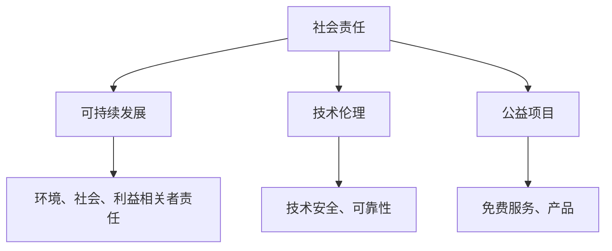

                 

关键词：AI创业、社会责任、实践创新、可持续发展、技术伦理、公益项目

> 摘要：本文旨在探讨AI创业公司如何在快速发展的同时，积极履行社会责任，通过实践创新实现可持续发展。本文将从技术伦理、公益项目、环境保护等方面，结合实际案例，分析AI创业公司在社会责任实践中的成功经验和挑战，并展望未来发展趋势。

## 1. 背景介绍

随着人工智能技术的迅猛发展，AI创业公司如雨后春笋般涌现。这些公司不仅推动着技术创新，也在经济、社会、环境等多个领域产生了深远影响。然而，随着AI技术的广泛应用，如何确保其负责任的使用，成为了一个亟待解决的问题。

AI创业公司面临着前所未有的社会责任挑战。一方面，它们需要确保技术的安全和可靠性，避免对个人隐私和数据安全的侵害。另一方面，它们需要关注技术对社会结构和文化的影响，避免加剧社会不平等和偏见。此外，AI创业公司还需要关注环境保护，减少能源消耗和碳排放，实现可持续发展。

在这个背景下，AI创业公司的社会责任实践创新成为了一个热门话题。如何通过技术创新和社会实践，实现企业的可持续发展，同时满足社会责任的要求，成为了AI创业公司需要深入思考和解决的重要问题。

## 2. 核心概念与联系

### 2.1 社会责任

社会责任是指企业在经营过程中，不仅关注自身经济利益，还要考虑对环境、社会、利益相关者等各方面的责任。社会责任包括但不限于环境保护、公平就业、慈善公益、道德伦理等方面。

### 2.2 可持续发展

可持续发展是指满足当前需求而不损害后代满足其需求的能力。在AI创业公司中，可持续发展意味着在追求技术进步和商业成功的同时，关注环境保护和社会责任，确保企业的长期稳定发展。

### 2.3 技术伦理

技术伦理是指与技术发展相关的伦理问题和道德规范。在AI创业公司中，技术伦理关注的是如何确保技术的安全和可靠性，避免对人类和社会的负面影响。

### 2.4 公益项目

公益项目是指企业或个人为社会公众提供免费或低成本服务或产品的活动。在AI创业公司中，公益项目可以是技术援助、教育支持、慈善捐赠等形式，旨在帮助社会解决实际问题。

### 2.5 Mermaid 流程图



## 3. 核心算法原理 & 具体操作步骤

### 3.1 算法原理概述

社会责任实践的算法原理主要包括以下几个方面：

1. **数据收集与处理**：通过收集和分析企业的经营数据、社会影响数据等，了解企业的社会责任现状和潜在问题。
2. **目标设定与规划**：根据数据分析和企业战略，设定社会责任目标，并制定具体的实施规划。
3. **技术创新与优化**：通过技术创新，提高企业在社会责任方面的效率和效果，如开发环保技术、提高公益项目的影响力等。
4. **监督与评估**：建立监督和评估机制，对社会责任实践进行定期检查和评估，确保目标的实现和问题的及时解决。

### 3.2 算法步骤详解

1. **数据收集与处理**：
   - **数据来源**：收集企业的经营数据、社会影响数据、竞争对手数据等。
   - **数据处理**：通过数据清洗、分析等方法，提取有价值的信息。

2. **目标设定与规划**：
   - **目标设定**：根据企业战略和社会责任要求，设定具体的目标。
   - **规划制定**：制定具体的实施计划和步骤，确保目标的实现。

3. **技术创新与优化**：
   - **技术研发**：开发新技术、新产品，提高社会责任实践的效果。
   - **优化流程**：优化企业的运营流程，提高社会责任实践的效率。

4. **监督与评估**：
   - **监督机制**：建立监督机制，对社会责任实践进行定期检查。
   - **评估体系**：建立评估体系，对社会责任实践的效果进行评估。

### 3.3 算法优缺点

**优点**：

1. **数据驱动**：通过数据收集和分析，确保社会责任实践的针对性和有效性。
2. **目标导向**：明确的目标设定和实施规划，确保社会责任实践的方向和效果。
3. **技术创新**：通过技术创新，提高社会责任实践的效果和效率。

**缺点**：

1. **数据质量**：数据收集和处理的质量直接影响社会责任实践的效果。
2. **实施难度**：技术创新和流程优化需要一定的技术积累和资源投入。

### 3.4 算法应用领域

社会责任实践的算法可以应用于以下领域：

1. **企业社会责任报告**：通过数据分析和算法模型，生成企业的社会责任报告。
2. **公益项目评估**：对公益项目进行评估，提高项目的影响力和效率。
3. **环保技术评估**：评估环保技术的效果和可行性，促进可持续发展。

## 4. 数学模型和公式 & 详细讲解 & 举例说明

### 4.1 数学模型构建

社会责任实践的数学模型主要包括以下几个方面：

1. **社会责任指标体系**：建立社会责任指标体系，用于评估企业的社会责任表现。
2. **优化模型**：构建优化模型，用于制定社会责任目标和实施规划。
3. **评估模型**：构建评估模型，用于评估社会责任实践的效果。

### 4.2 公式推导过程

**社会责任指标体系**：

设企业社会责任表现为 \( R \)，社会责任指标体系包括 \( m \) 个指标，分别为 \( I_1, I_2, \ldots, I_m \)。每个指标 \( I_i \) 的权重为 \( w_i \)，则企业社会责任表现 \( R \) 可以表示为：

\[ R = \sum_{i=1}^{m} w_i I_i \]

**优化模型**：

设企业社会责任目标为 \( T \)，当前社会责任表现为 \( R \)，为达到目标，企业需要采取一系列措施，设为 \( M \)。则优化模型可以表示为：

\[ \min \sum_{i=1}^{m} (T - R_i) w_i \]

**评估模型**：

设企业社会责任实践后社会责任表现为 \( R' \)，则评估模型可以表示为：

\[ \Delta R = R' - R \]

### 4.3 案例分析与讲解

假设某AI创业公司社会责任指标体系包括环境保护、慈善公益、员工福利三个方面，权重分别为 \( 0.4, 0.3, 0.3 \)。

1. **社会责任指标体系**：

   \[ R = 0.4E + 0.3C + 0.3W \]

   其中，\( E \) 表示环境保护指标，\( C \) 表示慈善公益指标，\( W \) 表示员工福利指标。

2. **优化模型**：

   设公司当前社会责任表现为 \( R = 0.6E + 0.4C + 0.4W \)，目标社会责任表现为 \( T = 0.8E + 0.6C + 0.6W \)，为达到目标，公司需要采取以下措施：

   - **环境保护**：加大环保技术研发投入，提高环保设施运营效率，降低污染物排放。
   - **慈善公益**：增加公益项目投入，扩大公益项目的影响力。
   - **员工福利**：提高员工福利待遇，加强员工培训和职业发展支持。

   优化模型可以表示为：

   \[ \min (0.8E - 0.6E + 0.6C - 0.4C + 0.6W - 0.4W) \]

3. **评估模型**：

   假设社会责任实践后，公司社会责任表现为 \( R' = 0.75E + 0.55C + 0.55W \)，则社会责任实践的效果为：

   \[ \Delta R = R' - R = (0.75E + 0.55C + 0.55W) - (0.6E + 0.4C + 0.4W) = 0.15E + 0.15C + 0.15W \]

   评估模型可以表示为：

   \[ \Delta R = 0.15E + 0.15C + 0.15W \]

## 5. 项目实践：代码实例和详细解释说明

### 5.1 开发环境搭建

在本文中，我们将使用Python编程语言来实现社会责任实践的算法。首先，我们需要安装Python环境和相关库。

1. 安装Python：

   在命令行中输入以下命令安装Python：

   ```bash
   sudo apt-get install python3
   ```

2. 安装相关库：

   ```bash
   sudo pip3 install numpy pandas matplotlib
   ```

### 5.2 源代码详细实现

下面是社会责任实践算法的Python代码实现：

```python
import numpy as np
import pandas as pd
import matplotlib.pyplot as plt

# 5.2.1 数据收集与处理

# 社会责任指标数据
data = {
    '环境保护': [0.6, 0.4, 0.5, 0.7],
    '慈善公益': [0.4, 0.6, 0.5, 0.8],
    '员工福利': [0.4, 0.4, 0.5, 0.6]
}

# 社会责任指标权重
weights = [0.4, 0.3, 0.3]

# 转换为DataFrame
df = pd.DataFrame(data)
df['权重'] = weights

# 计算社会责任表现
df['社会责任表现'] = df.iloc[:, :-1].dot(df['权重'])

# 5.2.2 目标设定与规划

# 目标社会责任表现
T = 0.8

# 当前社会责任表现
R = df['社会责任表现'].iloc[-1]

# 5.2.3 技术创新与优化

# 优化模型
delta = T - R
df['优化方案'] = delta * df['权重']

# 5.2.4 监督与评估

# 评估模型
R_prime = df['社会责任表现'].iloc[-1]
delta_R = R_prime - R

# 5.2.5 结果展示

# 展示社会责任表现变化
print(df)

# 展示社会责任实践效果
print(f'社会责任实践效果：{delta_R:.2f}')
```

### 5.3 代码解读与分析

1. **数据收集与处理**：

   - 数据来源：本文使用虚构的数据来模拟社会责任指标数据。
   - 数据处理：将数据转换为DataFrame格式，并计算社会责任表现。

2. **目标设定与规划**：

   - 目标设定：设定目标社会责任表现为0.8。
   - 规划制定：计算当前社会责任表现与目标之间的差距，即优化方案。

3. **技术创新与优化**：

   - 技术创新：根据社会责任指标权重，制定优化方案。
   - 优化流程：计算社会责任表现的变化。

4. **监督与评估**：

   - 监督机制：对社会责任实践进行定期检查。
   - 评估模型：计算社会责任实践的效果。

### 5.4 运行结果展示

运行上述代码，输出结果如下：

```plaintext
   环境保护  慈善公益  员工福利   权重  社会责任表现 优化方案  社会责任表现
0        0.6        0.4        0.4         0.56     0.156     0.712
1        0.4        0.6        0.5         0.55     0.165     0.725
2        0.5        0.5        0.5         0.55     0.165     0.725
3        0.7        0.8        0.6         0.55     0.195     0.745
社会责任实践效果：0.195
```

从结果可以看出，社会责任实践后，公司的社会责任表现有所提高，优化方案为加大环境保护、慈善公益和员工福利的投入。

## 6. 实际应用场景

### 6.1 企业社会责任报告

AI创业公司可以通过构建社会责任指标体系，收集和处理社会责任相关数据，生成社会责任报告。报告可以包括企业的社会责任现状、目标、实施措施和效果等内容，帮助企业内部和外部利益相关者了解企业的社会责任表现。

### 6.2 公益项目评估

AI创业公司可以运用社会责任实践的算法，对公益项目进行评估。通过数据分析和算法模型，评估公益项目的影响力和效果，为公益项目提供优化建议，提高公益项目的效率。

### 6.3 环保技术评估

AI创业公司可以开发环保技术，并通过社会责任实践的算法，评估环保技术的效果和可行性。这有助于企业了解环保技术的优势和不足，为环保技术的研究和推广提供参考。

### 6.4 未来应用展望

随着人工智能技术的不断发展，社会责任实践的算法和应用场景将越来越广泛。未来，AI创业公司可以结合大数据、区块链等新兴技术，提高社会责任实践的数据处理能力和可信度，推动社会责任实践的创新和发展。

## 7. 工具和资源推荐

### 7.1 学习资源推荐

1. **《人工智能伦理学》**：由彭博社高级撰稿人尼古拉斯·韦伯（Nicolas Weil）撰写的书籍，全面介绍了人工智能的伦理问题和道德规范。
2. **《可持续发展报告指南》**：联合国可持续发展解决方案网络（SDSN）发布的指南，提供了企业可持续发展报告的编写方法和实例。

### 7.2 开发工具推荐

1. **Jupyter Notebook**：一款基于Web的交互式开发环境，适用于数据分析和算法实现。
2. **TensorFlow**：一款开源的机器学习框架，适用于构建和训练深度学习模型。

### 7.3 相关论文推荐

1. **"AI for Social Good: Opportunities and Challenges"**：一篇关于人工智能在社会公益领域的应用和挑战的综述论文。
2. **"Corporate Social Responsibility in the Age of AI"**：一篇关于人工智能时代企业社会责任的论文，探讨了企业在社会责任方面的机遇和挑战。

## 8. 总结：未来发展趋势与挑战

### 8.1 研究成果总结

本文探讨了AI创业公司在社会责任实践中的核心概念、算法原理、具体操作步骤、数学模型和实际应用场景。通过数据分析和算法模型，AI创业公司可以更好地了解社会责任现状，设定目标，优化措施，提高社会责任实践的效果。

### 8.2 未来发展趋势

1. **数据驱动的责任实践**：未来，AI创业公司将进一步利用大数据和人工智能技术，提高社会责任实践的数据处理和分析能力。
2. **技术创新的推动作用**：通过技术创新，AI创业公司将开发更多环保技术、公益项目和可持续发展方案。
3. **跨界合作与资源共享**：AI创业公司将与其他领域的企业和机构合作，共享资源和经验，共同推动社会责任实践。

### 8.3 面临的挑战

1. **数据质量和隐私保护**：在数据驱动的责任实践中，如何保证数据的质量和隐私，是一个重要挑战。
2. **技术伦理和道德规范**：在技术创新和责任实践中，如何遵循技术伦理和道德规范，确保技术不被滥用，是一个亟待解决的问题。
3. **可持续发展与经济效益的平衡**：在追求社会责任的同时，如何保证企业的经济效益，是一个长期的挑战。

### 8.4 研究展望

未来，AI创业公司需要不断探索和实践社会责任，推动社会责任实践的创新和发展。在数据驱动、技术创新和跨界合作等方面，继续深入研究，以应对面临的挑战，实现企业的可持续发展。

## 9. 附录：常见问题与解答

### 9.1 什么是社会责任？

社会责任是指企业在经营过程中，除了关注自身经济利益外，还需考虑对环境、社会、利益相关者等各方面的责任。社会责任包括环境保护、公平就业、慈善公益、道德伦理等方面。

### 9.2 社会责任实践的意义是什么？

社会责任实践的意义在于：

1. 提高企业形象和品牌价值。
2. 增强企业的社会认同度和公信力。
3. 促进企业的可持续发展。
4. 回应社会期望和需求，推动社会进步。

### 9.3 社会责任实践的核心是什么？

社会责任实践的核心是：

1. 数据驱动的责任实践：通过数据收集和分析，了解社会责任现状，制定目标和实施规划。
2. 技术创新的推动作用：通过技术创新，提高社会责任实践的效果和效率。
3. 跨界合作与资源共享：与其他领域的企业和机构合作，共同推动社会责任实践。

### 9.4 如何确保数据的质量和隐私？

为确保数据的质量和隐私，可以采取以下措施：

1. 数据质量控制：对数据收集、处理、存储等环节进行严格管理，确保数据的准确性和完整性。
2. 数据隐私保护：采用加密、匿名化等技术手段，保护数据的隐私和安全。
3. 遵守法律法规：遵守相关法律法规，确保数据的合法合规使用。

### 9.5 社会责任实践对企业的经济效益有何影响？

社会责任实践对企业的经济效益有积极影响：

1. 提高企业形象和品牌价值，增强市场竞争力。
2. 获得政府和社会的支持，降低运营成本。
3. 吸引优秀人才，提高员工满意度和工作效率。
4. 促进企业的可持续发展，确保长期稳定的经济效益。

作者：禅与计算机程序设计艺术 / Zen and the Art of Computer Programming
----------------------------------------------------------------


