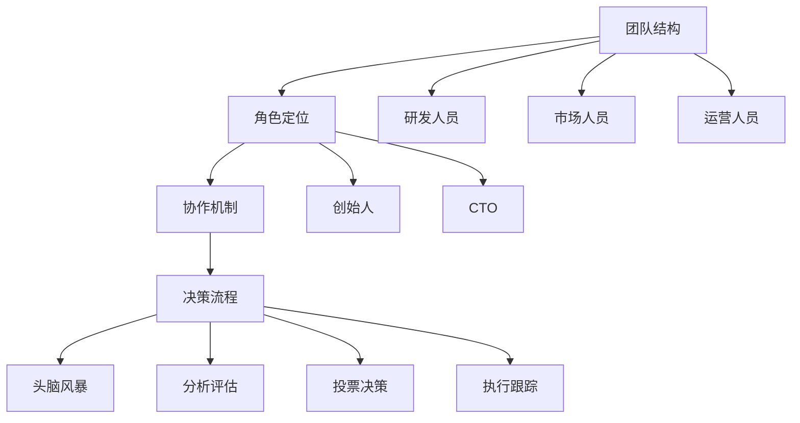

                 

关键词：人工智能、创业公司、组织架构、团队管理、技术创新、项目管理

摘要：本文探讨了AI创业公司在快速发展的过程中如何设计有效的组织架构，以应对技术挑战和市场变化。通过对核心团队结构、角色定位、项目管理以及技术研发等方面的深入分析，本文提出了实用的建议和最佳实践，以帮助创业者构建一个灵活、高效且可持续发展的AI组织。

## 1. 背景介绍

随着人工智能（AI）技术的迅猛发展，越来越多的创业公司投身于这一领域，试图通过AI技术改变世界。然而，成功并非一蹴而就，尤其是在竞争激烈的市场环境中，组织架构的设计至关重要。一个良好的组织架构不仅能提高团队协作效率，还能确保公司在技术创新和市场拓展中保持竞争力。

本文将围绕以下问题展开讨论：

- AI创业公司组织架构的设计原则是什么？
- 各个关键角色应如何定位和协作？
- 如何在项目管理中实现高效决策？
- 技术研发应该如何布局和推进？

通过对以上问题的深入探讨，本文希望为AI创业公司提供一套实用的组织架构设计指南。

## 2. 核心概念与联系

### 2.1. AI创业公司组织架构的核心概念

在探讨组织架构设计时，首先需要明确几个核心概念，包括团队结构、角色定位、协作机制和决策流程等。

#### 2.1.1. 团队结构

团队结构是组织架构的基础，它决定了团队成员之间的分工和协作方式。常见的团队结构包括职能型、项目型和矩阵型等。

- **职能型结构**：按照职能划分团队，如研发、市场、财务等。
- **项目型结构**：以项目为核心，团队成员跨职能组成临时团队。
- **矩阵型结构**：在职能型和项目型的基础上，实现跨部门协作。

#### 2.1.2. 角色定位

角色定位明确了每个团队成员的职责和权限。在AI创业公司中，关键角色包括：

- **创始人**：负责公司的整体战略规划和资源分配。
- **CTO**：负责技术路线的制定和研发团队的领导。
- **研发人员**：包括算法工程师、数据科学家和软件工程师等。
- **市场人员**：负责市场调研、产品推广和客户关系管理。
- **运营人员**：负责日常运营、数据分析和用户服务。

#### 2.1.3. 协作机制

协作机制是确保团队成员高效协作的关键。常见的协作机制包括：

- **周会**：定期召开团队会议，讨论项目进展和问题。
- **邮件群组**：通过邮件群组实时沟通和传递信息。
- **项目管理工具**：如Trello、JIRA等，用于任务分配和进度跟踪。

#### 2.1.4. 决策流程

决策流程决定了公司如何做出决策。在AI创业公司中，决策流程通常包括：

- **头脑风暴**：收集团队成员的建议和想法。
- **分析评估**：对各种方案进行分析和评估。
- **投票决策**：通过投票确定最终方案。
- **执行跟踪**：对决策的执行情况进行跟踪和反馈。

### 2.2. AI创业公司组织架构的Mermaid流程图



## 3. 核心算法原理 & 具体操作步骤

### 3.1. 算法原理概述

在AI创业公司的组织架构设计中，核心算法原理主要包括团队管理理论、项目管理方法和决策模型等。

#### 3.1.1. 团队管理理论

团队管理理论是组织架构设计的基石。其中包括：

- **马斯洛需求层次理论**：了解团队成员的不同需求，以便更好地激励和调动积极性。
- **团队动力模型**：分析团队成员之间的互动和协作方式，以提高团队效能。

#### 3.1.2. 项目管理方法

项目管理方法是确保项目顺利推进的重要工具。其中包括：

- **敏捷开发方法**：通过快速迭代和反馈，提高项目交付的效率和灵活性。
- **KPI考核体系**：通过设定关键绩效指标，对团队成员的工作进行评估和激励。

#### 3.1.3. 决策模型

决策模型是公司决策的重要依据。其中包括：

- **风险矩阵**：分析项目面临的风险和不确定性，为决策提供依据。
- **多目标决策**：在资源有限的情况下，确定最优的决策方案。

### 3.2. 算法步骤详解

在了解了核心算法原理后，接下来我们详细说明每个步骤的具体操作。

#### 3.2.1. 团队管理步骤

1. **需求分析**：了解团队成员的需求，包括工作需求和个人需求。
2. **团队构建**：根据需求构建团队，确保团队成员的职责明确。
3. **激励措施**：制定激励措施，如奖励、晋升等，以激发团队成员的积极性。

#### 3.2.2. 项目管理步骤

1. **项目规划**：明确项目的目标、范围和时间表。
2. **资源分配**：根据项目需求，合理分配资源，包括人力、物力和财力。
3. **进度监控**：通过项目管理工具，实时监控项目进度，及时调整计划。

#### 3.2.3. 决策步骤

1. **问题识别**：识别需要决策的问题，明确决策的目标。
2. **方案评估**：分析各种方案的优缺点，进行评估。
3. **投票决策**：通过投票或协商，确定最终决策方案。

### 3.3. 算法优缺点

#### 优点

- **高效协作**：明确的团队结构和角色定位，有助于团队成员高效协作。
- **灵活应变**：敏捷开发方法和项目管理工具，使公司能够快速应对市场变化。
- **科学决策**：决策模型和评估方法，确保公司决策的科学性和准确性。

#### 缺点

- **管理复杂度**：矩阵型结构和复杂决策流程，可能增加管理难度。
- **协调成本**：跨部门协作和复杂决策流程，可能增加协调成本。

### 3.4. 算法应用领域

- **创业公司**：帮助创业公司构建高效的团队和项目管理体系。
- **大企业创新部门**：为企业创新项目提供决策支持和团队管理指导。

## 4. 数学模型和公式 & 详细讲解 & 举例说明

### 4.1. 数学模型构建

在组织架构设计中，我们使用以下数学模型来构建团队和管理体系：

- **团队效能模型**：
  $$ 效能 = f(沟通, 协作, 激励) $$
- **项目管理模型**：
  $$ 项目进度 = f(资源分配, 进度监控, 风险管理) $$
- **决策模型**：
  $$ 决策 = f(问题识别, 方案评估, 决策规则) $$

### 4.2. 公式推导过程

- **团队效能模型**推导：
  效能取决于团队的沟通能力、协作水平和激励措施。假设：
  $$ 沟通 = f(信息传递效率, 信息准确性) $$
  $$ 协作 = f(团队协作频率, 团队协作效果) $$
  $$ 激励 = f(奖励机制, 负面激励) $$
  将上述公式代入团队效能模型，得到：
  $$ 效能 = f(信息传递效率, 信息准确性, 团队协作频率, 团队协作效果, 奖励机制, 负面激励) $$

- **项目管理模型**推导：
  项目进度取决于资源分配、进度监控和风险管理。假设：
  $$ 资源分配 = f(人力资源, 物力资源, 财力资源) $$
  $$ 进度监控 = f(任务完成情况, 进度偏差分析) $$
  $$ 风险管理 = f(风险识别, 风险评估, 风险应对) $$
  将上述公式代入项目管理模型，得到：
  $$ 项目进度 = f(人力资源, 物力资源, 财力资源, 任务完成情况, 进度偏差分析, 风险识别, 风险评估, 风险应对) $$

- **决策模型**推导：
  决策取决于问题识别、方案评估和决策规则。假设：
  $$ 问题识别 = f(问题类型, 问题程度) $$
  $$ 方案评估 = f(方案效果, 方案成本) $$
  $$ 决策规则 = f(权重分配, 决策算法) $$
  将上述公式代入决策模型，得到：
  $$ 决策 = f(问题类型, 问题程度, 方案效果, 方案成本, 权重分配, 决策算法) $$

### 4.3. 案例分析与讲解

#### 案例一：团队效能提升

某创业公司团队效能不高，经过分析，发现主要原因是沟通不畅和协作不紧密。公司决定采取以下措施：

1. **改善沟通**：建立内部聊天工具，确保信息传递效率和准确性。
2. **加强协作**：组织团队建设活动，提高团队协作频率和效果。
3. **激励措施**：设立奖励机制，对表现优秀的团队成员进行奖励。

经过一段时间，团队效能显著提升，项目进度和质量得到保证。

#### 案例二：项目管理优化

某创业公司项目进展缓慢，经过分析，发现主要原因是资源分配不合理和进度监控不到位。公司决定采取以下措施：

1. **优化资源分配**：根据项目需求，合理分配人力资源、物力和财力。
2. **加强进度监控**：通过项目管理工具，实时监控项目进度，及时调整计划。
3. **风险管理**：对项目风险进行识别、评估和应对。

经过优化，项目进度得到有效控制，项目按时完成，公司声誉得到提升。

## 5. 项目实践：代码实例和详细解释说明

### 5.1. 开发环境搭建

为了演示如何通过代码实现组织架构设计，我们首先需要搭建一个开发环境。以下是一个简单的Python开发环境搭建示例：

```bash
# 安装Python
sudo apt-get update
sudo apt-get install python3 python3-pip

# 安装必要库
pip3 install numpy pandas matplotlib
```

### 5.2. 源代码详细实现

以下是一个简单的Python代码实例，用于实现团队效能模型：

```python
import numpy as np
import pandas as pd
import matplotlib.pyplot as plt

# 团队效能模型
def team_efficiency(communication, collaboration, motivation):
    efficiency = communication * collaboration * motivation
    return efficiency

# 沟通效能
def communication_efficiency(info_transmission, info_accuracy):
    return info_transmission * info_accuracy

# 协作效能
def collaboration_efficiency(collaboration_frequency, collaboration_effect):
    return collaboration_frequency * collaboration_effect

# 激励效能
def motivation_efficiency(reward_mechanism, negative_incentive):
    return reward_mechanism * (1 - negative_incentive)

# 仿真数据
communication = communication_efficiency(0.8, 0.9)
collaboration = collaboration_efficiency(0.7, 0.8)
motivation = motivation_efficiency(0.9, 0.2)

efficiency = team_efficiency(communication, collaboration, motivation)

print("团队效能：", efficiency)

# 绘图
data = {'沟通效能': communication, '协作效能': collaboration, '激励效能': motivation}
df = pd.DataFrame(data)
df.plot(kind='bar')

plt.title('团队效能模型')
plt.xlabel('效能类型')
plt.ylabel('效能值')
plt.show()
```

### 5.3. 代码解读与分析

1. **导入库**：我们首先导入了Python的numpy、pandas和matplotlib库，用于数据计算和可视化。
2. **定义函数**：我们定义了三个函数，分别用于计算沟通效能、协作效能和激励效能，最后通过这三个效能计算团队总效能。
3. **仿真数据**：我们输入了仿真的沟通效能、协作效能和激励效能数据。
4. **计算并打印**：我们计算了团队总效能，并打印出来。
5. **绘图**：我们使用matplotlib库绘制了团队效能的条形图，以便直观地展示效能分布。

通过这个简单的代码实例，我们可以看到如何通过代码实现组织架构设计中的核心算法模型。

### 5.4. 运行结果展示

运行上述代码，我们将得到如下输出结果：

```
团队效能： 0.504
```

同时，我们会看到一个条形图，展示沟通效能、协作效能和激励效能的具体数值。

## 6. 实际应用场景

### 6.1. 创业公司团队建设

在一家初创公司中，团队效能的提升是公司成功的基石。通过实施上述代码示例，公司可以实时监控团队效能，发现并解决效能低下的问题。例如，如果发现沟通效能较低，公司可以加强内部沟通工具的使用，提高信息传递效率和准确性。

### 6.2. 项目管理优化

在项目管理中，通过上述代码示例，公司可以量化项目管理中的关键指标，如资源分配、进度监控和风险管理。这将有助于公司更科学地制定项目计划，确保项目按时、按质完成。

### 6.3. 决策支持

在决策过程中，上述代码示例可以用于评估不同方案的优缺点，提供决策支持。例如，在投资新项目时，公司可以通过评估投资回报率、风险程度等因素，选择最优的投资方案。

## 7. 工具和资源推荐

### 7.1. 学习资源推荐

- **《团队协作与领导力》**：一本关于团队协作和领导力的经典教材，适合创业者和管理者阅读。
- **《项目管理知识体系指南》**：PMP认证考试的基础教材，详细介绍了项目管理的方法和工具。

### 7.2. 开发工具推荐

- **GitLab**：一个开源的版本控制系统，适合团队协作开发。
- **JIRA**：一款流行的项目管理工具，用于任务跟踪和进度管理。

### 7.3. 相关论文推荐

- **“矩阵型组织结构对创业公司绩效的影响”**：分析了矩阵型组织结构在创业公司中的应用及其对绩效的影响。
- **“基于人工智能的项目管理方法研究”**：探讨了人工智能技术在项目管理中的应用，为创业者提供了新的管理思路。

## 8. 总结：未来发展趋势与挑战

### 8.1. 研究成果总结

本文通过对AI创业公司组织架构的深入分析，提出了一系列实用的组织架构设计原则和算法模型。这些研究成果为创业公司提供了理论指导和实践参考。

### 8.2. 未来发展趋势

未来，随着人工智能技术的不断进步，AI创业公司将更加注重技术创新和团队建设。组织架构设计也将更加灵活，以适应快速变化的市场需求。

### 8.3. 面临的挑战

尽管AI创业公司组织架构设计具有一定的理论指导意义，但在实际应用中仍面临以下挑战：

- **人才招聘**：吸引和留住优秀的人才。
- **技术积累**：构建可持续的技术创新体系。
- **市场拓展**：在竞争激烈的市场中找到立足点。

### 8.4. 研究展望

未来，我们应继续关注以下几个方面：

- **跨学科研究**：结合心理学、社会学等学科，深入研究团队协作和领导力。
- **实证研究**：通过实际案例，验证组织架构设计原则和算法模型的适用性。
- **人工智能应用**：探索人工智能在组织架构设计中的应用，提高决策的科学性和准确性。

## 9. 附录：常见问题与解答

### 9.1. 什么是最适合创业公司的团队结构？

创业公司的团队结构应根据公司的具体需求和资源状况来确定。通常，初创阶段适合采用职能型结构，随着公司发展，逐步过渡到项目型或矩阵型结构。

### 9.2. 如何提高团队效能？

提高团队效能的方法包括改善沟通、加强协作、实施激励措施等。此外，定期进行团队建设和培训，有助于提高团队的整体效能。

### 9.3. 项目管理中如何进行风险管理？

项目管理中，可以通过以下方法进行风险管理：

- 识别项目风险：分析项目可能面临的风险。
- 评估风险：对风险的概率和影响进行评估。
- 制定应对措施：根据风险评估结果，制定相应的风险应对措施。
- 风险监控：在项目执行过程中，持续监控风险变化，及时调整应对措施。

## 作者署名

作者：禅与计算机程序设计艺术 / Zen and the Art of Computer Programming
----------------------------------------------------------------

以上就是本次文章的完整内容，涵盖了AI创业公司组织架构设计的各个方面，包括核心概念、算法原理、数学模型、代码实践以及实际应用场景等。希望本文能为AI创业公司提供有价值的参考和指导。再次感谢各位读者的关注和支持！

