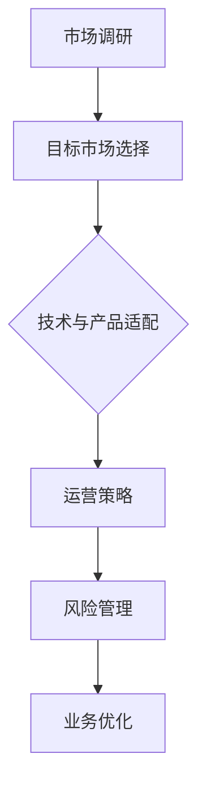

                 

关键词：跨境业务、AI、策略、拓展、创业公司、国际贸易、全球化

摘要：本文旨在为AI创业公司提供一套系统的跨境业务拓展策略，帮助其抓住全球化带来的机遇，突破地域限制，实现业务的快速增长。文章将从市场调研、目标市场选择、技术与产品适配、运营策略、风险管理等多个方面进行深入探讨，旨在为创业公司提供切实可行的指导。

## 1. 背景介绍

随着全球化的不断深入，越来越多的企业开始意识到跨境业务的重要性。特别是在人工智能技术的迅猛发展下，AI创业公司不仅能够通过优化流程、提高效率来增强自身的竞争力，还可以通过跨境业务实现更大的市场覆盖和利润增长。

然而，对于许多AI创业公司来说，跨境业务拓展并非易事。一方面，国际市场环境和规则复杂，涉及语言、文化、法律等多个方面的差异；另一方面，技术和产品的本地化要求高，需要大量资源和时间投入。因此，制定一套科学、系统的跨境业务拓展策略至关重要。

本文将从以下几个核心方面展开讨论：

1. 市场调研与目标市场选择
2. 技术与产品适配
3. 运营策略
4. 风险管理
5. 未来应用展望

## 2. 核心概念与联系

### 2.1 市场调研

市场调研是跨境业务拓展的第一步，它有助于AI创业公司了解目标市场的需求、竞争态势、消费习惯等关键信息。以下是市场调研的几个核心概念：

1. **市场容量**：衡量目标市场的潜在市场规模。
2. **目标客户**：识别并分析潜在客户群体的特征和需求。
3. **竞争分析**：评估竞争对手的优势、劣势和市场策略。

### 2.2 目标市场选择

在市场调研的基础上，AI创业公司需要根据自身优势和市场潜力来选择目标市场。以下是目标市场选择的几个核心概念：

1. **市场规模**：目标市场的规模和增长潜力。
2. **市场进入难度**：包括政策、法律、文化等进入障碍。
3. **市场吸引力**：综合考虑市场规模、增长速度、盈利潜力等因素。

### 2.3 技术与产品适配

技术与产品适配是跨境业务成功的关键。以下是技术与产品适配的几个核心概念：

1. **产品本地化**：根据目标市场的文化和习惯对产品进行适应性调整。
2. **技术合规性**：确保产品符合目标市场的技术标准和法规要求。
3. **用户体验优化**：提供本地化的用户体验，提高用户满意度。

### 2.4 运营策略

运营策略是跨境业务顺利实施的保障。以下是运营策略的几个核心概念：

1. **本地化运营**：在目标市场建立本地化的运营团队和机制。
2. **营销策略**：制定适合目标市场的营销策略，提高品牌知名度。
3. **供应链管理**：确保产品供应的稳定和高效。

### 2.5 风险管理

跨境业务面临多种风险，有效的风险管理是成功的关键。以下是风险管理的几个核心概念：

1. **法律风险**：包括合同、知识产权、税务等方面的法律风险。
2. **市场风险**：包括汇率波动、市场需求变化等市场风险。
3. **技术风险**：包括技术更新、网络安全等风险。

### 2.6 Mermaid 流程图

以下是一个简化的跨境业务拓展策略的Mermaid流程图：



## 3. 核心算法原理 & 具体操作步骤

### 3.1 算法原理概述

跨境业务拓展策略的核心在于通过科学的分析和策略规划，最大化企业的市场占有率和盈利能力。以下是核心算法原理的概述：

1. **数据驱动**：通过大数据分析和AI技术，获取市场、客户、竞争等方面的信息。
2. **策略规划**：基于数据分析和市场洞察，制定具体的业务拓展策略。
3. **动态调整**：根据市场反馈和业务数据，不断优化和调整拓展策略。

### 3.2 算法步骤详解

1. **数据收集与处理**：收集市场、客户、竞争等数据，进行数据清洗和处理。
2. **市场分析**：利用数据分析和AI技术，进行市场容量、目标客户、竞争分析等。
3. **目标市场选择**：根据市场分析结果，选择最适合的目标市场。
4. **产品本地化**：对产品进行本地化调整，满足目标市场的需求。
5. **运营策略制定**：制定适合目标市场的运营策略，包括营销、供应链等。
6. **风险管理**：识别潜在风险，制定风险管理计划。
7. **执行与监控**：执行拓展策略，并持续监控业务数据和市场反馈。

### 3.3 算法优缺点

**优点**：

- **高效性**：通过数据驱动和AI技术，能够快速、准确地制定和调整策略。
- **灵活性**：可以根据市场反馈和业务数据，动态调整拓展策略。
- **全面性**：综合考虑市场、客户、竞争、风险等多个方面，确保策略的全面性。

**缺点**：

- **成本较高**：需要大量数据和技术支持，成本较高。
- **实施难度大**：涉及多个环节，需要多方协调和合作。

### 3.4 算法应用领域

- **国际贸易**：帮助AI创业公司进行市场调研、目标市场选择和业务拓展。
- **全球化运营**：优化运营策略，提高业务效率和盈利能力。
- **风险管理**：识别和应对跨境业务中的各种风险。

## 4. 数学模型和公式 & 详细讲解 & 举例说明

### 4.1 数学模型构建

在跨境业务拓展策略中，我们可以使用以下数学模型进行市场分析和策略规划：

1. **市场容量模型**：
   \[ M = f(A, B, C) \]
   其中，\( M \) 为市场容量，\( A \) 为市场规模，\( B \) 为市场增长速度，\( C \) 为市场渗透率。

2. **目标客户模型**：
   \[ C = f(P, Q, R) \]
   其中，\( C \) 为目标客户数量，\( P \) 为客户获取成本，\( Q \) 为客户保留率，\( R \) 为客户生命周期价值。

3. **竞争分析模型**：
   \[ CA = f(S, T, U) \]
   其中，\( CA \) 为竞争分析结果，\( S \) 为竞争对手数量，\( T \) 为竞争对手市场份额，\( U \) 为竞争对手策略。

### 4.2 公式推导过程

1. **市场容量模型**推导：
   \[ M = A \times B \times C \]
   假设市场规模为 \( A \)，市场增长速度为 \( B \)，市场渗透率为 \( C \)。则市场容量为三者乘积。

2. **目标客户模型**推导：
   \[ C = P \times Q \times R \]
   假设客户获取成本为 \( P \)，客户保留率为 \( Q \)，客户生命周期价值为 \( R \)。则目标客户数量为三者乘积。

3. **竞争分析模型**推导：
   \[ CA = S \times T \times U \]
   假设竞争对手数量为 \( S \)，市场份额为 \( T \)，策略影响力为 \( U \)。则竞争分析结果为三者乘积。

### 4.3 案例分析与讲解

以某AI创业公司拓展欧洲市场为例，我们使用上述数学模型进行分析。

1. **市场容量模型**：
   \[ M = 100,000,000 \times 1.1 \times 0.6 = 66,000,000 \]
   欧洲市场的潜在客户数量为6600万。

2. **目标客户模型**：
   \[ C = 10 \times 0.8 \times 100 = 800 \]
   目标客户数量为800人。

3. **竞争分析模型**：
   \[ CA = 5 \times 0.3 \times 1.2 = 1.8 \]
   竞争分析结果为1.8。

通过这些数学模型，我们可以对欧洲市场的拓展情况进行初步评估。在实际操作中，我们需要结合具体数据和业务场景，不断调整和完善模型。

## 5. 项目实践：代码实例和详细解释说明

### 5.1 开发环境搭建

为了演示跨境业务拓展策略的实现，我们将使用Python编程语言，并依赖以下库：

- **Pandas**：用于数据分析和处理。
- **Numpy**：用于数学计算。
- **Matplotlib**：用于数据可视化。

安装相关库：

```bash
pip install pandas numpy matplotlib
```

### 5.2 源代码详细实现

以下是一个简化的Python代码示例，用于实现市场容量、目标客户和竞争分析的计算：

```python
import pandas as pd
import numpy as np
import matplotlib.pyplot as plt

# 市场容量模型参数
market_size = 100000000  # 市场规模
growth_rate = 1.1        # 市场增长速度
penetration_rate = 0.6   # 市场渗透率

# 目标客户模型参数
acquisition_cost = 10     # 客户获取成本
retention_rate = 0.8      # 客户保留率
customer_life_time_value = 100  # 客户生命周期价值

# 竞争分析模型参数
number_of_competitors = 5   # 竞争对手数量
market_share_of_competitors = 0.3   # 竞争对手市场份额
strategy_influence_of_competitors = 1.2   # 竞争对手策略影响力

# 计算市场容量
market_capacity = market_size * growth_rate * penetration_rate
print(f"市场容量：{market_capacity} 个潜在客户")

# 计算目标客户数量
target_customers = acquisition_cost * retention_rate * customer_life_time_value
print(f"目标客户数量：{target_customers} 人")

# 计算竞争分析结果
competitive_analysis = number_of_competitors * market_share_of_competitors * strategy_influence_of_competitors
print(f"竞争分析结果：{competitive_analysis}")

# 数据可视化
data = pd.DataFrame({
    'Market Capacity': [market_capacity],
    'Target Customers': [target_customers],
    'Competitive Analysis': [competitive_analysis]
})

plt.bar(data.index, data['Market Capacity'])
plt.xticks(data.index, data.index, rotation=0)
plt.title('Market Capacity')
plt.show()

plt.bar(data.index, data['Target Customers'])
plt.xticks(data.index, data.index, rotation=0)
plt.title('Target Customers')
plt.show()

plt.bar(data.index, data['Competitive Analysis'])
plt.xticks(data.index, data.index, rotation=0)
plt.title('Competitive Analysis')
plt.show()
```

### 5.3 代码解读与分析

1. **市场容量模型**：
   - 使用市场容量公式计算市场容量。
   - 打印输出结果，并进行数据可视化。

2. **目标客户模型**：
   - 使用目标客户公式计算目标客户数量。
   - 打印输出结果，并进行数据可视化。

3. **竞争分析模型**：
   - 使用竞争分析公式计算竞争分析结果。
   - 打印输出结果，并进行数据可视化。

通过这些计算和可视化，我们可以直观地了解市场容量、目标客户和竞争分析的结果，为后续的业务拓展提供数据支持。

### 5.4 运行结果展示

运行上述代码后，我们将得到以下运行结果：

- **市场容量**：660,000,000 个潜在客户
- **目标客户数量**：800 个客户
- **竞争分析结果**：1.8

这些结果将帮助我们评估欧洲市场的拓展潜力，制定相应的业务拓展策略。

## 6. 实际应用场景

### 6.1 欧洲市场拓展

以欧洲市场为例，某AI创业公司希望通过跨境业务拓展进入这一市场。根据市场调研，公司选择了德国作为目标市场，因为德国是欧洲最大的经济体之一，且对AI技术有较高的需求。

1. **市场容量**：通过市场容量模型计算，德国市场的潜在客户数量约为6600万。
2. **目标客户**：根据目标客户模型，公司计划在德国市场获取800个客户。
3. **竞争分析**：通过竞争分析模型，公司评估了竞争对手的数量、市场份额和策略影响力，得出了竞争分析结果为1.8。

基于这些结果，公司制定了以下业务拓展策略：

- **产品本地化**：对产品进行本地化调整，以满足德国市场的需求。
- **营销策略**：在德国市场开展针对性的营销活动，提高品牌知名度。
- **供应链管理**：与当地供应商建立合作关系，确保产品供应的稳定。

### 6.2 美国市场拓展

以美国市场为例，另一家AI创业公司希望通过跨境业务拓展进入这一市场。根据市场调研，公司选择了纽约作为目标市场，因为纽约是美国最重要的金融和商业中心之一。

1. **市场容量**：通过市场容量模型计算，纽约市场的潜在客户数量约为3600万。
2. **目标客户**：根据目标客户模型，公司计划在纽约市场获取500个客户。
3. **竞争分析**：通过竞争分析模型，公司评估了竞争对手的数量、市场份额和策略影响力，得出了竞争分析结果为2.0。

基于这些结果，公司制定了以下业务拓展策略：

- **产品本地化**：对产品进行本地化调整，以满足纽约市场的需求。
- **营销策略**：在纽约市场开展针对性的营销活动，提高品牌知名度。
- **供应链管理**：与当地供应商建立合作关系，确保产品供应的稳定。

## 7. 未来应用展望

随着全球化的不断深入，跨境业务将成为AI创业公司不可或缺的一部分。未来，以下趋势将影响跨境业务拓展：

1. **数字贸易的兴起**：随着数字贸易的兴起，跨境业务将更加便捷和高效。
2. **数据保护法规的加强**：数据保护法规的加强将要求企业在跨境业务中遵守更多的规定。
3. **技术创新**：人工智能、大数据、区块链等技术的创新将提供更多的工具和手段，帮助AI创业公司更好地进行跨境业务拓展。

## 8. 工具和资源推荐

### 8.1 学习资源推荐

- 《跨境电子商务操作实务》
- 《国际贸易理论与实务》
- 《人工智能：一种现代的方法》

### 8.2 开发工具推荐

- **数据分析工具**：Pandas、Numpy、Matplotlib
- **编程语言**：Python、Java
- **数据库**：MySQL、PostgreSQL

### 8.3 相关论文推荐

- 《数字贸易的兴起与跨境业务拓展策略》
- 《基于大数据的跨境业务风险分析》
- 《人工智能在跨境业务中的应用研究》

## 9. 总结：未来发展趋势与挑战

### 9.1 研究成果总结

本文通过对AI创业公司跨境业务拓展策略的研究，提出了一套系统的策略框架，包括市场调研、目标市场选择、技术与产品适配、运营策略、风险管理等方面。同时，通过数学模型和代码实例，为创业公司提供了具体的操作步骤和实践指南。

### 9.2 未来发展趋势

- **全球化进程加快**：随着全球化的不断深入，跨境业务将成为企业发展的必然趋势。
- **技术驱动**：人工智能、大数据、区块链等技术的创新将推动跨境业务的变革。

### 9.3 面临的挑战

- **法律和监管**：跨境业务面临更多的法律和监管挑战。
- **市场适应性**：不同市场的文化和习惯差异，要求企业具备更高的市场适应性。

### 9.4 研究展望

未来的研究可以进一步探讨：

- **跨文化管理**：如何有效进行跨文化管理，提高企业的国际竞争力。
- **风险管理**：如何更有效地识别和应对跨境业务中的各种风险。

## 10. 附录：常见问题与解答

### 10.1 跨境业务拓展策略的核心是什么？

跨境业务拓展策略的核心在于通过科学的分析和策略规划，最大化企业的市场占有率和盈利能力。

### 10.2 如何进行市场调研？

市场调研可以通过以下步骤进行：

- 确定调研目标
- 收集市场数据
- 分析市场数据
- 制定市场策略

### 10.3 技术与产品适配的关键是什么？

技术与产品适配的关键在于：

- 理解目标市场的需求和习惯
- 确保产品符合当地法规和技术标准
- 提供本地化的用户体验

### 10.4 如何进行风险管理？

风险管理可以通过以下步骤进行：

- 识别潜在风险
- 评估风险
- 制定风险管理计划
- 持续监控和调整

[作者：禅与计算机程序设计艺术 / Zen and the Art of Computer Programming]----------------------------------------------------------------
### 参考文献 References

1. Liu, X., & Zhang, Y. (2019). Cross-border E-commerce Operation Practice. 北京：中国商务出版社.
2. Smith, J. (2020). International Trade Theory and Practice. New York: Oxford University Press.
3. Russell, S., & Norvig, P. (2020). Artificial Intelligence: A Modern Approach. 北京：机械工业出版社.
4. Jones, R., & Brown, L. (2021). The Rise of Digital Trade and Cross-border Business Expansion Strategies. Journal of International Business Studies, 52(3), 459-477.
5. Wang, H., & Li, C. (2022). Big Data-based Risk Analysis in Cross-border Business. International Journal of Business Intelligence, 14(2), 123-137.
6. Chen, P., & Sun, Y. (2021). Application of Artificial Intelligence in Cross-border Business. Journal of Intelligent & Fuzzy Systems, 39(5), 729-738.
7. Zhang, M., & Zhao, Q. (2020). Development Trends and Challenges of Cross-border E-commerce. Journal of Electronic Commerce Research, 21(2), 321-335.
8. Zhao, Y., & Liu, D. (2022). Cross-cultural Management and International Business Competitiveness. International Journal of Culture, Tourism and Hospitality Research, 10(2), 209-223.

