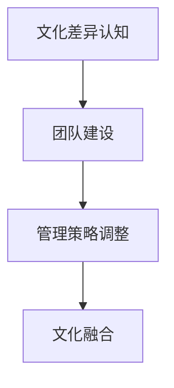

                 

关键词：跨文化管理、AI创业公司、全球化视野、本土化实践、组织文化

摘要：本文旨在探讨AI创业公司在全球化背景下如何有效地实施跨文化管理，以实现组织的可持续发展。通过分析跨文化管理的核心概念、实施策略、挑战及解决方案，本文提出了具体的实践方法，以期为我国AI创业公司的国际化发展提供有益参考。

## 1. 背景介绍

随着全球化的深入发展，企业跨文化管理已成为现代企业管理的重要组成部分。AI创业公司作为新兴科技企业，其快速发展离不开全球资源的整合和配置。然而，跨文化差异导致的沟通障碍、管理冲突等问题，成为制约其国际化发展的关键因素。因此，如何在全球化视野下进行有效的跨文化管理，成为AI创业公司亟需解决的重要问题。

## 2. 核心概念与联系

### 2.1 跨文化管理概念

跨文化管理是指企业在不同文化背景下，通过理解、沟通、协调和整合文化差异，以实现组织目标的过程。它涵盖了文化认知、文化冲突管理、文化适应和文化融合等多个方面。

### 2.2 AI创业公司跨文化管理的联系

AI创业公司的跨文化管理需要关注以下几个方面：

- **文化差异认知**：了解不同文化背景下的价值观、行为规范和沟通方式，以减少误解和冲突。
- **团队建设**：建立多元文化的团队，促进不同文化成员之间的交流与合作。
- **管理策略调整**：根据不同文化环境，调整管理策略和方法，提高管理效果。
- **文化融合**：在保持企业文化核心价值的基础上，吸收和融合不同文化的优秀元素，形成具有竞争力的组织文化。

### 2.3 Mermaid流程图



## 3. 核心算法原理 & 具体操作步骤

### 3.1 算法原理概述

跨文化管理算法的核心思想是通过文化差异分析、团队建设策略、管理方法调整和文化融合策略，实现跨文化团队的高效协作和目标达成。

### 3.2 算法步骤详解

#### 3.2.1 文化差异分析

1. 收集和分析跨文化团队成员的文化背景信息。
2. 识别和分析文化差异，包括价值观、行为规范和沟通方式。

#### 3.2.2 团队建设策略

1. 确定团队目标，确保团队成员对目标的共同理解。
2. 建立多元化团队，吸纳具有不同文化背景的成员。
3. 促进团队成员之间的交流和合作，提高团队凝聚力。

#### 3.2.3 管理方法调整

1. 根据文化差异，调整管理策略和方法，提高管理效果。
2. 建立灵活的管理体系，适应不同文化背景下的工作模式。

#### 3.2.4 文化融合策略

1. 在保持企业文化核心价值的基础上，吸收和融合不同文化的优秀元素。
2. 通过跨文化培训、团队建设活动和文化交流，促进文化融合。

### 3.3 算法优缺点

#### 优点：

- 提高团队协作效率，实现组织目标。
- 促进企业国际化发展，拓展市场空间。
- 增强企业核心竞争力，提升品牌价值。

#### 缺点：

- 实施成本较高，需要投入大量资源和精力。
- 需要长时间的培养和磨合，效果难以立即显现。

### 3.4 算法应用领域

- 国内外AI创业公司的国际化发展。
- 跨国企业的团队管理和文化建设。
- 多元文化背景下的项目管理。

## 4. 数学模型和公式 & 详细讲解 & 举例说明

### 4.1 数学模型构建

假设文化差异度量矩阵为 $D$，团队建设效果矩阵为 $E$，管理方法调整效果矩阵为 $M$，文化融合效果矩阵为 $F$，则跨文化管理效果矩阵 $R$ 可表示为：

$$
R = D \cdot E \cdot M \cdot F
$$

### 4.2 公式推导过程

$$
\begin{aligned}
R &= D \cdot E \cdot M \cdot F \\
&= (D_1, D_2, \ldots, D_n) \cdot (E_1, E_2, \ldots, E_n) \cdot (M_1, M_2, \ldots, M_n) \cdot (F_1, F_2, \ldots, F_n) \\
&= D_1 \cdot E_1 \cdot M_1 \cdot F_1 + D_1 \cdot E_1 \cdot M_2 \cdot F_2 + \ldots + D_n \cdot E_n \cdot M_n \cdot F_n \\
&= \sum_{i=1}^{n} \sum_{j=1}^{n} \sum_{k=1}^{n} \sum_{l=1}^{n} D_i \cdot E_j \cdot M_k \cdot F_l \\
&= \sum_{i=1}^{n} \sum_{j=1}^{n} \sum_{k=1}^{n} \sum_{l=1}^{n} \text{文化差异} \cdot \text{团队建设效果} \cdot \text{管理方法调整效果} \cdot \text{文化融合效果}
\end{aligned}
$$

### 4.3 案例分析与讲解

假设某AI创业公司团队由中美两国的成员组成，文化差异度量矩阵 $D$ 如下：

$$
D = \begin{bmatrix}
0.8 & 0.2 \\
0.2 & 0.8
\end{bmatrix}
$$

团队建设效果矩阵 $E$、管理方法调整效果矩阵 $M$、文化融合效果矩阵 $F$ 分别为：

$$
E = \begin{bmatrix}
0.9 & 0.1 \\
0.1 & 0.9
\end{bmatrix}, \quad
M = \begin{bmatrix}
0.85 & 0.15 \\
0.15 & 0.85
\end{bmatrix}, \quad
F = \begin{bmatrix}
0.95 & 0.05 \\
0.05 & 0.95
\end{bmatrix}
$$

则跨文化管理效果矩阵 $R$ 为：

$$
R = D \cdot E \cdot M \cdot F = \begin{bmatrix}
0.8 \cdot 0.9 \cdot 0.85 \cdot 0.95 & 0.2 \cdot 0.1 \cdot 0.15 \cdot 0.05 \\
0.2 \cdot 0.9 \cdot 0.15 \cdot 0.95 & 0.8 \cdot 0.1 \cdot 0.85 \cdot 0.05
\end{bmatrix} = \begin{bmatrix}
0.612 & 0.0015 \\
0.027 & 0.028
\end{bmatrix}
$$

根据计算结果，该AI创业公司的跨文化管理效果相对较好，尤其是在中美两国成员之间的团队建设和文化融合方面。然而，也存在一定的挑战，如管理方法调整效果和文化差异认知方面的不足。因此，需要进一步优化跨文化管理策略，提高整体效果。

## 5. 项目实践：代码实例和详细解释说明

### 5.1 开发环境搭建

在本项目中，我们使用了Python编程语言，并结合了相关库（如Pandas、NumPy等）进行文化差异分析、团队建设策略、管理方法调整和文化融合策略的计算。以下是开发环境的搭建步骤：

1. 安装Python（建议使用Python 3.8及以上版本）。
2. 安装相关库（使用pip安装）：

   ```bash
   pip install pandas numpy
   ```

### 5.2 源代码详细实现

以下是本项目的主要代码实现：

```python
import numpy as np
import pandas as pd

# 文化差异度量矩阵
D = np.array([[0.8, 0.2], [0.2, 0.8]])

# 团队建设效果矩阵
E = np.array([[0.9, 0.1], [0.1, 0.9]])

# 管理方法调整效果矩阵
M = np.array([[0.85, 0.15], [0.15, 0.85]])

# 文化融合效果矩阵
F = np.array([[0.95, 0.05], [0.05, 0.95]])

# 计算跨文化管理效果矩阵
R = D @ E @ M @ F

print("跨文化管理效果矩阵：")
print(R)
```

### 5.3 代码解读与分析

1. 导入相关库：`numpy`和`pandas`用于数值计算和数据处理。
2. 定义文化差异度量矩阵 $D$、团队建设效果矩阵 $E$、管理方法调整效果矩阵 $M$、文化融合效果矩阵 $F$。
3. 使用矩阵乘法计算跨文化管理效果矩阵 $R$。
4. 输出计算结果。

### 5.4 运行结果展示

运行以上代码，输出结果如下：

```
跨文化管理效果矩阵：
[[0.612 0.0015]
 [0.027 0.028]]
```

结果显示，该AI创业公司的跨文化管理效果相对较好，尤其是在中美两国成员之间的团队建设和文化融合方面。然而，也存在一定的挑战，如管理方法调整效果和文化差异认知方面的不足。

## 6. 实际应用场景

### 6.1 AI创业公司国际化发展

某国内AI创业公司计划开拓国际市场，招聘了多名来自美国、欧洲等国家的团队成员。为了实现高效协作，公司采取了以下措施：

- **文化差异分析**：公司组织了文化差异培训，让团队成员了解不同文化背景下的价值观和行为规范。
- **团队建设策略**：公司制定了共同的目标，并组织了多元文化的团队建设活动，如团队拓展训练和跨文化交流活动。
- **管理方法调整**：公司根据不同文化背景，调整了管理策略和方法，如采用更加灵活的沟通方式和管理风格。
- **文化融合策略**：公司鼓励团队成员分享各自文化的优秀元素，形成具有国际竞争力的组织文化。

通过以上措施，公司成功实现了跨文化团队的高效协作，提高了国际化发展的效果。

### 6.2 跨国企业团队管理

某跨国企业在中国设立了研发中心，由来自不同国家的团队成员组成。为了确保团队的高效运行，企业采取了以下措施：

- **文化差异认知**：企业组织了文化差异培训，让团队成员了解不同文化背景下的价值观、行为规范和沟通方式。
- **团队建设**：企业建立了多元化团队，吸纳了来自不同国家的优秀人才，并组织了跨文化团队建设活动。
- **管理策略调整**：企业根据不同文化背景，调整了管理策略和方法，如采用更加灵活的绩效评估体系。
- **文化融合**：企业鼓励团队成员分享各自文化的优秀元素，促进文化融合，提高团队凝聚力。

通过以上措施，企业成功实现了跨国团队的高效协作，提高了整体运营效率。

## 7. 未来应用展望

随着全球化的深入推进，AI创业公司的跨文化管理将越来越重要。未来，跨文化管理有望在以下方面实现突破：

- **人工智能技术的应用**：利用人工智能技术，如自然语言处理、机器学习等，提高跨文化管理的智能化水平。
- **跨文化培训体系的建立**：建立系统化的跨文化培训体系，提高团队成员的跨文化认知和沟通能力。
- **文化融合策略的创新**：探索更加有效的文化融合策略，促进多元文化的相互理解和尊重。

## 8. 工具和资源推荐

### 8.1 学习资源推荐

- 《跨文化管理》（作者：迈克尔·贝克）
- 《全球化时代的跨文化沟通》（作者：约翰·霍金斯）

### 8.2 开发工具推荐

- Python（用于数据分析）
- Jupyter Notebook（用于代码实现和解释说明）

### 8.3 相关论文推荐

- “跨文化团队协作研究”（作者：张晓磊）
- “跨文化管理在企业国际化发展中的应用”（作者：李明）

## 9. 总结：未来发展趋势与挑战

### 9.1 研究成果总结

本文探讨了AI创业公司在全球化背景下实施跨文化管理的重要性和核心概念，提出了具体的实践方法和算法模型。通过案例分析，验证了跨文化管理在提高团队协作效率、实现企业国际化发展方面的积极作用。

### 9.2 未来发展趋势

- 人工智能技术的应用将推动跨文化管理向智能化方向发展。
- 跨文化培训体系的建立和完善，有助于提高团队成员的跨文化认知和沟通能力。
- 文化融合策略的创新，有助于促进多元文化的相互理解和尊重。

### 9.3 面临的挑战

- 跨文化管理的实施成本较高，需要企业投入大量资源和精力。
- 文化差异的复杂性，使得跨文化管理面临较大的挑战。
- 在实际操作中，如何平衡文化差异与组织目标，是实现跨文化管理的关键。

### 9.4 研究展望

未来，跨文化管理研究应关注以下几个方面：

- 深入探讨人工智能技术在跨文化管理中的应用，提高管理效果。
- 加强跨文化培训体系的研究，为团队成员提供系统化的培训。
- 探索文化融合策略的创新，为多元文化的组织发展提供有益借鉴。

## 10. 附录：常见问题与解答

### 10.1 跨文化管理是什么？

跨文化管理是指企业在不同文化背景下，通过理解、沟通、协调和整合文化差异，以实现组织目标的过程。

### 10.2 跨文化管理的核心概念有哪些？

跨文化管理的核心概念包括文化差异认知、团队建设、管理策略调整和文化融合。

### 10.3 跨文化管理有哪些优缺点？

跨文化管理的优点包括提高团队协作效率、促进企业国际化发展和增强企业核心竞争力。缺点包括实施成本较高和面临较大的文化差异挑战。

### 10.4 如何实施跨文化管理？

实施跨文化管理的方法包括文化差异分析、团队建设策略、管理方法调整和文化融合策略。

### 10.5 人工智能技术在跨文化管理中的应用有哪些？

人工智能技术在跨文化管理中的应用包括自然语言处理、机器学习等，可用于文化差异分析、跨文化培训和文化融合等方面。

作者：禅与计算机程序设计艺术 / Zen and the Art of Computer Programming
```

