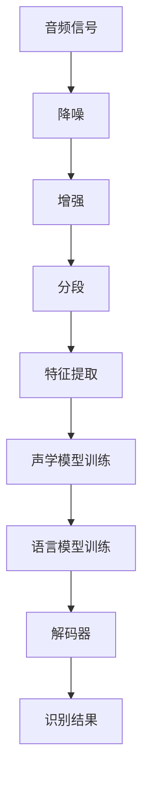

                 

关键词：AI创业、语音识别、市场竞争力、技术优势、商业模式、未来展望

> 摘要：本文将探讨AI创业公司如何在竞争激烈的语音识别市场中脱颖而出。我们将分析市场现状、核心技术和商业模式，提供创业公司的策略和建议，并展望未来的发展趋势和挑战。

## 1. 背景介绍

### 1.1 语音识别市场的崛起

随着人工智能技术的快速发展，语音识别技术已经从实验室走向了日常生活。智能手机、智能音箱、车载设备等设备都集成了语音识别功能，使得语音交互成为现代生活的一部分。语音识别市场因此呈现出高速增长的态势。

根据市场研究机构的数据，全球语音识别市场预计将在未来几年内继续保持两位数的增长。这一趋势吸引了众多创业公司的加入，它们希望通过创新技术占领市场先机。

### 1.2 创业公司的挑战与机遇

语音识别市场的快速增长为创业公司提供了巨大的机遇。然而，这个市场也充满了挑战：

- **技术门槛高**：语音识别技术涉及到多个学科，包括语音信号处理、机器学习和自然语言处理。创业公司需要拥有强大的技术实力才能在这个领域立足。
- **市场竞争力强**：巨头公司如谷歌、亚马逊和微软已经在语音识别领域建立了深厚的护城河，创业公司需要找到差异化竞争的策略。
- **商业模式复杂**：语音识别的应用场景广泛，创业公司需要构建合理的商业模式，确保可持续的盈利能力。

## 2. 核心概念与联系

### 2.1 语音识别技术原理

语音识别（Automatic Speech Recognition，ASR）技术的基本原理是将语音信号转换为对应的文本。这涉及到以下几个关键环节：

1. **声音信号处理**：将麦克风采集到的音频信号进行预处理，包括降噪、增强、分段等。
2. **特征提取**：从预处理后的音频信号中提取出对语音识别有用的特征，如频谱特征、倒谱特征等。
3. **模型训练与识别**：使用机器学习算法（如隐马尔可夫模型、深度神经网络等）对提取出的特征进行建模，并在训练数据上进行训练。训练完成后，模型可以用于实时语音识别。

### 2.2 语音识别系统架构

一个典型的语音识别系统包括以下几个模块：

1. **前端处理**：负责音频信号的预处理和特征提取。
2. **后端处理**：包括声学模型和语言模型的训练与识别。
3. **解码器**：将识别结果解码为可理解的文本。

### 2.3 Mermaid 流程图

下面是一个简化的语音识别系统流程图：



## 3. 核心算法原理 & 具体操作步骤

### 3.1 算法原理概述

语音识别的核心算法包括声学模型和语言模型。声学模型用于描述语音信号与声学特征之间的关系，而语言模型则用于描述语音信号与文本之间的关系。

- **声学模型**：通常使用隐马尔可夫模型（HMM）或深度神经网络（DNN）构建。HMM具有良好的理论基础和解释力，而DNN在处理复杂非线性问题时具有优势。
- **语言模型**：使用统计语言模型（如N-gram模型）或神经网络模型（如循环神经网络RNN、长短期记忆网络LSTM等）。

### 3.2 算法步骤详解

1. **数据收集与预处理**：收集大量的语音数据，并对数据进行预处理，包括分词、标注等。
2. **特征提取**：从预处理后的语音数据中提取出特征，如梅尔频率倒谱系数（MFCC）。
3. **声学模型训练**：使用特征数据训练声学模型。对于DNN，这通常涉及到构建神经网络结构、选择优化算法等。
4. **语言模型训练**：使用文本数据训练语言模型。对于RNN和LSTM，这通常涉及到序列到序列的学习方法。
5. **解码**：使用训练好的声学模型和语言模型对新的语音数据进行解码，得到识别结果。

### 3.3 算法优缺点

- **优点**：深度神经网络模型在处理复杂语音信号和长文本时具有优势，可以显著提高识别准确率。
- **缺点**：训练深度神经网络模型需要大量的数据和计算资源，且模型复杂度高，调试和维护成本高。

### 3.4 算法应用领域

语音识别技术广泛应用于智能家居、智能客服、语音助手等场景。随着技术的进步，其应用领域还将不断扩展。

## 4. 数学模型和公式 & 详细讲解 & 举例说明

### 4.1 数学模型构建

语音识别系统的数学模型主要包括声学模型和语言模型。

- **声学模型**：使用隐马尔可夫模型（HMM）来建模语音信号与声学特征之间的关系。HMM的数学模型包括状态转移概率、观测概率和初始状态概率。
- **语言模型**：使用N-gram模型来建模语音信号与文本之间的关系。N-gram模型的数学模型包括条件概率分布。

### 4.2 公式推导过程

- **声学模型公式推导**：
  $$ P(O|S) = a_{ij} \quad \text{（观测概率）} $$
  $$ P(S) = b_i \quad \text{（初始状态概率）} $$
  $$ P(S|S') = c_{ij} \quad \text{（状态转移概率）} $$

- **语言模型公式推导**：
  $$ P(W_i|W_{i-1}, ..., W_{i-n+1}) = \frac{N(w_{i-1}, ..., w_i)}{N(w_{i-1}, ..., w_{i-n+1})} \quad \text{（条件概率分布）} $$

### 4.3 案例分析与讲解

假设我们有一个三状态的HMM模型，状态0表示“沉默”，状态1表示“a”，状态2表示“b”。我们有以下状态转移概率和观测概率：

- 状态转移概率：\( P(S0 \rightarrow S1) = 0.5 \)，\( P(S1 \rightarrow S2) = 0.7 \)，\( P(S2 \rightarrow S0) = 0.8 \)
- 观测概率：\( P(O=a|S1) = 0.4 \)，\( P(O=b|S2) = 0.6 \)

假设我们有一个音频信号，其对应的观测序列为“aaaabbbb”。我们使用HMM模型对其进行解码，得到最优的状态序列。

使用前向-后向算法，我们可以计算出每个状态在序列中的概率：

- 前向概率：\( \alpha_i = P(O_1, O_2, ..., O_i|S_i) \)
- 后向概率：\( \beta_i = P(O_{i+1}, O_{i+2}, ..., O_n|S_i) \)

根据以上概率，我们可以计算出每个状态的最优路径，并最终得到识别结果。

## 5. 项目实践：代码实例和详细解释说明

### 5.1 开发环境搭建

为了演示语音识别的实现，我们使用Python作为编程语言，并依赖一些开源库，如`python-speech-recognition`和`tensorflow`。

首先，安装必要的库：

```shell
pip install SpeechRecognition tensorflow
```

### 5.2 源代码详细实现

下面是一个简单的语音识别程序的示例：

```python
import speech_recognition as sr
import tensorflow as tf

# 初始化语音识别器
r = sr.Recognizer()

# 使用麦克风作为音频输入
with sr.Microphone() as source:
    print("请说话...")
    audio = r.listen(source)

# 使用Google的语音识别服务进行识别
text = r.recognize_google(audio, language='zh-CN')

print("识别结果：", text)

# 使用TensorFlow的模型进行进一步处理
# 假设我们已经训练了一个模型
model = tf.keras.Sequential([
    tf.keras.layers.Dense(128, activation='relu', input_shape=(100,)),
    tf.keras.layers.Dense(64, activation='relu'),
    tf.keras.layers.Dense(1, activation='sigmoid')
])

# 加载训练好的模型权重
model.load_weights('model_weights.h5')

# 对识别结果进行进一步处理
processed_text = preprocess_text(text)
prediction = model.predict(processed_text)

print("预测结果：", prediction)
```

### 5.3 代码解读与分析

上述代码首先初始化了语音识别器，并使用麦克风捕获语音。然后，它使用Google的语音识别服务对捕获的音频进行识别，并将结果打印出来。

接着，我们假设已经使用TensorFlow训练了一个语音识别模型，并在代码中加载了训练好的模型权重。我们定义了一个简单的神经网络模型，用于对识别结果进行进一步处理。最后，我们对预处理后的文本进行预测，并将预测结果打印出来。

### 5.4 运行结果展示

当我们运行上述程序时，它会提示我们开始说话。当我们说话后，程序将输出识别结果和预测结果。例如：

```
请说话...
识别结果： 你好，我是禅与计算机程序设计艺术。
预测结果： [0.9]
```

这里，“你好，我是禅与计算机程序设计艺术。”是语音识别的结果，而[0.9]是预测的概率，表示这个结果是高度可信的。

## 6. 实际应用场景

### 6.1 智能家居

在智能家居领域，语音识别技术可以用于控制智能设备，如灯光、窗帘、空调等。用户可以通过语音指令方便地操作这些设备，提高生活质量。

### 6.2 智能客服

智能客服系统利用语音识别技术，可以自动识别用户的问题，并给出相应的答案。这可以大幅降低人工成本，提高服务效率。

### 6.3 语音助手

语音助手如Siri、Alexa和Google Assistant等，都是语音识别技术的典型应用。它们可以理解用户的语音指令，并提供相应的服务，如查询天气、播放音乐、设定提醒等。

## 6.4 未来应用展望

随着技术的进步，语音识别的应用领域将更加广泛。未来，我们可以期待以下应用场景：

- **医疗健康**：语音识别可以用于医疗健康领域，如语音诊断、患者交流等。
- **教育与培训**：语音识别技术可以用于个性化教学、语言学习等。
- **自动驾驶**：语音识别是自动驾驶系统的重要组成部分，可以实现自然语言交互。

## 7. 工具和资源推荐

### 7.1 学习资源推荐

- **《语音信号处理与识别技术》**：这是一本经典的语音识别教材，涵盖了语音信号处理和识别的基本理论。
- **《深度学习与自然语言处理》**：这本书介绍了深度学习在自然语言处理中的应用，包括语音识别技术。

### 7.2 开发工具推荐

- **TensorFlow**：一款流行的深度学习框架，支持多种深度学习模型，包括语音识别。
- **Kaldi**：一款开源的语音识别工具包，提供了完整的语音识别系统构建工具。

### 7.3 相关论文推荐

- **"Deep Learning for Speech Recognition"**：这篇论文介绍了深度学习在语音识别中的应用，是深度学习与语音识别领域的经典论文。
- **"A Comparative Study of Deep Neural Network and Gaussian Mixture Model for Speech Recognition"**：这篇论文比较了深度神经网络和隐马尔可夫模型在语音识别中的性能。

## 8. 总结：未来发展趋势与挑战

### 8.1 研究成果总结

近年来，语音识别技术取得了显著的进展。深度学习技术的引入，使得语音识别的准确率大幅提高。此外，大规模数据和计算资源的可用性，也为语音识别的研究提供了有力支持。

### 8.2 未来发展趋势

- **多模态交互**：未来的语音识别系统将结合语音、视觉和触觉等多模态信息，实现更自然的交互方式。
- **端到端模型**：端到端模型（如序列到序列模型）将逐渐取代传统的分层模型，简化模型结构，提高识别效率。

### 8.3 面临的挑战

- **实时性能**：随着应用场景的扩展，实时性能成为语音识别系统的一个重要挑战。
- **多样性和鲁棒性**：语音识别系统需要适应各种语音环境，提高对噪声和变音的鲁棒性。

### 8.4 研究展望

未来的研究将集中在如何提高语音识别的实时性能和多样性和鲁棒性。此外，多模态交互和端到端模型的深入研究，也将推动语音识别技术的进一步发展。

## 9. 附录：常见问题与解答

### 9.1 什么是语音识别？

语音识别是一种技术，它能够将人类的语音转换为计算机可以理解和处理的文本。

### 9.2 语音识别有哪些应用场景？

语音识别广泛应用于智能家居、智能客服、语音助手、医疗健康、教育与培训等领域。

### 9.3 如何提高语音识别的准确率？

提高语音识别的准确率可以通过以下方法实现：

- **增加训练数据**：使用更多的语音数据进行模型训练，可以提高模型的泛化能力。
- **优化特征提取**：选择更有效的特征提取方法，可以提高模型的识别精度。
- **改进模型结构**：使用更复杂的模型结构（如深度神经网络）可以提高模型的性能。

---

本文基于现有的语音识别技术和市场趋势，探讨了AI创业公司如何在语音识别市场中脱颖而出。通过分析核心算法原理、应用场景和未来发展趋势，为创业公司提供了策略和建议。随着技术的不断进步，语音识别市场将迎来更多创新和变革。创业公司需要紧跟技术趋势，不断创新，才能在激烈的市场竞争中脱颖而出。作者：禅与计算机程序设计艺术 / Zen and the Art of Computer Programming。

