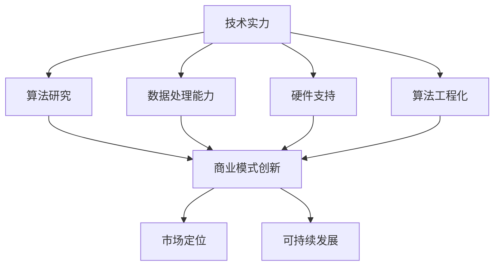

                 

关键词：人工智能、创业投资、技术实力、商业想象力、未来趋势

摘要：随着人工智能技术的不断发展，AI创业领域成为投资热点。本文将深入探讨AI创业投资的新风向，重点分析技术实力和商业想象力在其中的重要作用，并提出未来发展趋势与挑战。

## 1. 背景介绍

人工智能（AI）作为计算机科学的一个重要分支，经过几十年的发展，已经从理论走向实践，从实验室走向了生产一线。从早期的专家系统，到深度学习，再到现在的自然语言处理、计算机视觉、智能推荐等，人工智能技术在各个领域的应用日益广泛。

在投资领域，人工智能创业项目越来越受到资本的青睐。无论是创业公司，还是巨头企业，都在积极布局人工智能，试图通过技术创新来提升竞争力，开拓新的商业模式。AI创业投资市场的火热，不仅反映了人工智能技术的潜力，也预示着未来商业格局的重大变革。

本文旨在探讨AI创业投资的新风向，分析技术实力和商业想象力在其中的重要作用，为投资者、创业者及行业从业者提供有价值的参考。

## 2. 核心概念与联系

### 2.1 技术实力

技术实力是人工智能创业公司的核心竞争力。它包括但不限于以下几个方面：

- **算法研究**：包括机器学习、深度学习、强化学习等算法的创新和优化。
- **数据处理能力**：大数据处理、数据清洗、数据存储等技术。
- **硬件支持**：包括服务器、GPU、TPU等硬件设备的性能和扩展能力。
- **算法工程化**：将研究成果转化为可生产、可部署的工程系统。

### 2.2 商业想象力

商业想象力是创业者对市场机会的敏锐洞察和创造性思维。它包括以下几个方面：

- **商业模式创新**：如何将人工智能技术应用于现有产业，创造新的商业机会。
- **市场定位**：明确目标市场和客户群体，提供具有竞争力的产品和服务。
- **可持续发展**：考虑企业的长期发展，包括技术创新、团队建设、资本运作等方面。

### 2.3 技术实力与商业想象力之间的关系

技术实力和商业想象力是相辅相成的。技术实力为商业想象力提供了实现的可能，而商业想象力则为技术实力指明了方向。两者之间的联系可以用Mermaid流程图来表示：



## 3. 核心算法原理 & 具体操作步骤

### 3.1 算法原理概述

人工智能的核心在于算法，其中深度学习是最为重要的分支之一。深度学习通过模拟人脑的神经网络结构，实现数据的自动特征提取和模式识别。以下是深度学习的一些基本概念：

- **神经网络**：由大量神经元组成的计算模型。
- **激活函数**：用于引入非线性变换。
- **反向传播**：用于训练神经网络的一种优化方法。

### 3.2 算法步骤详解

深度学习的具体步骤如下：

1. **数据预处理**：包括数据的收集、清洗、归一化等。
2. **模型设计**：选择合适的神经网络结构。
3. **训练过程**：通过反向传播算法优化模型参数。
4. **模型评估**：使用验证集或测试集评估模型性能。
5. **模型部署**：将训练好的模型部署到生产环境中。

### 3.3 算法优缺点

- **优点**：
  - **强大的表征能力**：能够自动提取复杂的特征。
  - **广泛的适用性**：可以应用于图像、语音、自然语言处理等多个领域。
  - **高效的性能**：通过并行计算和硬件加速，大大提高了计算速度。

- **缺点**：
  - **需要大量数据**：训练深度学习模型需要大量的标注数据。
  - **计算资源消耗**：训练过程中需要大量的计算资源。
  - **解释性差**：深度学习模型的决策过程往往缺乏解释性。

### 3.4 算法应用领域

深度学习在以下领域有着广泛的应用：

- **计算机视觉**：图像分类、目标检测、人脸识别等。
- **自然语言处理**：机器翻译、文本分类、情感分析等。
- **语音识别**：语音合成、语音识别等。
- **推荐系统**：个性化推荐、广告投放等。

## 4. 数学模型和公式 & 详细讲解 & 举例说明

### 4.1 数学模型构建

深度学习中的数学模型主要包括以下几个方面：

- **线性回归**：用于预测连续值。
- **逻辑回归**：用于预测概率。
- **神经网络**：由多层神经元组成的计算模型。

### 4.2 公式推导过程

以线性回归为例，其目标是最小化预测值与真实值之间的误差。其公式推导如下：

$$
y = \beta_0 + \beta_1 \cdot x
$$

其中，$y$ 为预测值，$x$ 为输入特征，$\beta_0$ 和 $\beta_1$ 为模型参数。

### 4.3 案例分析与讲解

以图像分类任务为例，使用深度学习模型进行训练和预测。具体步骤如下：

1. **数据收集**：收集大量标注好的图像数据。
2. **数据预处理**：对图像进行归一化、裁剪等处理。
3. **模型设计**：设计卷积神经网络（CNN）模型。
4. **模型训练**：使用训练数据训练模型，优化模型参数。
5. **模型评估**：使用验证集评估模型性能。
6. **模型部署**：将训练好的模型部署到生产环境中。

## 5. 项目实践：代码实例和详细解释说明

### 5.1 开发环境搭建

搭建深度学习开发环境，首先需要安装Python和相关的深度学习库，如TensorFlow、PyTorch等。

### 5.2 源代码详细实现

以下是一个简单的线性回归模型的实现代码：

```python
import numpy as np
import tensorflow as tf

# 函数：计算线性回归的损失函数
def linear_regression(x, y, w):
    y_pred = tf.matmul(x, w)
    loss = tf.reduce_mean(tf.square(y_pred - y))
    return loss

# 函数：训练线性回归模型
def train(x, y, learning_rate, num_iterations):
    w = tf.Variable(tf.random_normal([1]))
    optimizer = tf.train.GradientDescentOptimizer(learning_rate)
    for i in range(num_iterations):
        loss = linear_regression(x, y, w)
        optimizer.minimize(loss)
    return w

# 数据集：生成随机数据
x = np.random.rand(100)
y = 2 * x + np.random.randn(100)

# 模型训练
learning_rate = 0.1
num_iterations = 1000
w = train(x, y, learning_rate, num_iterations)

# 模型评估
print("模型的权重：", w.numpy())
print("预测值：", 2 * x + w.numpy())
```

### 5.3 代码解读与分析

上述代码实现了一个简单的线性回归模型。首先，定义了一个计算损失函数的函数`linear_regression`，然后定义了一个训练函数`train`。在训练过程中，使用随机梯度下降（SGD）优化器优化模型参数。最后，使用训练好的模型对数据进行预测。

### 5.4 运行结果展示

运行上述代码，可以得到模型的权重和预测值。通过对比预测值和真实值，可以验证模型的效果。

## 6. 实际应用场景

深度学习在以下实际应用场景中有着广泛的应用：

- **医疗健康**：疾病诊断、药物研发、健康监测等。
- **金融**：风险评估、量化交易、信用评分等。
- **自动驾驶**：环境感知、路径规划、车辆控制等。
- **智能家居**：语音助手、智能安防、家电控制等。

## 7. 未来应用展望

随着人工智能技术的不断发展，未来将在更多领域发挥重要作用。以下是一些可能的应用场景：

- **智能制造**：通过人工智能技术实现生产线的智能化，提高生产效率和产品质量。
- **智慧城市**：利用人工智能技术实现城市管理、交通调度、环境监测等。
- **教育**：通过人工智能技术实现个性化学习、智能评测等。
- **娱乐**：虚拟现实、增强现实、游戏等领域的人工智能应用。

## 8. 总结：未来发展趋势与挑战

### 8.1 研究成果总结

人工智能领域已经取得了显著的成果，特别是在深度学习方面。通过不断的技术创新，人工智能技术已经在计算机视觉、自然语言处理、语音识别等领域取得了突破性进展。

### 8.2 未来发展趋势

随着人工智能技术的不断发展，未来将呈现出以下趋势：

- **硬件加速**：通过专用硬件（如GPU、TPU）实现更快的数据处理速度。
- **算法优化**：通过算法优化提高模型的性能和效率。
- **跨领域融合**：将人工智能技术应用于更多领域，实现跨领域融合。
- **伦理和法规**：关注人工智能的伦理和法规问题，确保人工智能的发展符合社会需求。

### 8.3 面临的挑战

人工智能领域仍然面临着一些挑战：

- **数据隐私**：如何保护用户数据隐私。
- **安全与伦理**：如何确保人工智能系统的安全性和符合伦理规范。
- **技术瓶颈**：如何突破现有技术瓶颈，实现更高效、更智能的人工智能系统。

### 8.4 研究展望

未来人工智能研究将朝着以下几个方向展开：

- **算法创新**：探索新的算法，提高模型的性能和效率。
- **硬件创新**：开发更高效、更节能的人工智能硬件。
- **跨学科研究**：结合不同学科的知识，推动人工智能技术的创新。
- **可持续发展**：关注人工智能的可持续发展，确保其对社会产生积极影响。

## 9. 附录：常见问题与解答

### 9.1 什么是人工智能？

人工智能（Artificial Intelligence，简称AI）是指由人制造出来的系统能够执行通常需要人类智能才能完成的任务，如视觉识别、语言理解、决策和问题解决等。

### 9.2 深度学习与机器学习的区别是什么？

深度学习是机器学习的一个子领域，它使用多层神经网络来学习和表示数据。而机器学习是指通过算法让计算机从数据中学习模式和规律，从而进行预测和决策。

### 9.3 人工智能的未来发展趋势是什么？

人工智能的未来发展趋势包括硬件加速、算法优化、跨领域融合、伦理和法规等方面的创新。同时，人工智能将在智能制造、智慧城市、教育、娱乐等领域发挥重要作用。

### 9.4 人工智能对社会的影响是什么？

人工智能对社会的影响是双面的。一方面，它将带来生产力的提升、生活方式的改变等积极影响；另一方面，也可能带来就业、数据隐私等方面的挑战。

作者：禅与计算机程序设计艺术 / Zen and the Art of Computer Programming
```

