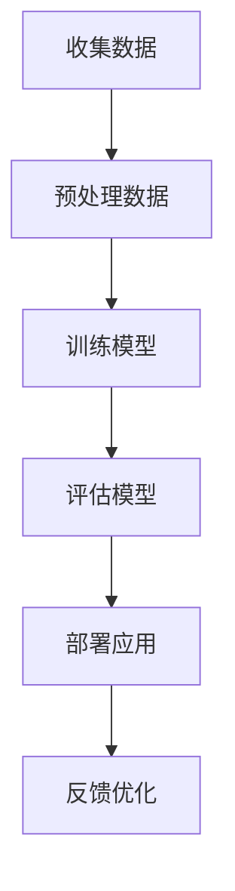
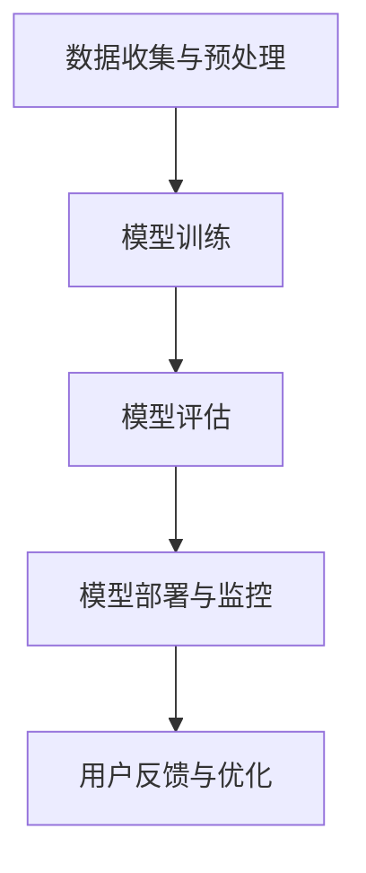

                 

在这个时代，人工智能（AI）已经成为全球科技发展的核心驱动力。随着技术的不断进步，AI正在逐步渗透到我们生活的方方面面，为各行各业带来深远的影响。对于创业者而言，AI不仅是一个技术工具，更是一个全新的商业机遇。本文将深入探讨垂直领域中的AI应用，分析其无限可能性，以及创业者在其中所能抓住的机遇。

## 1. 背景介绍

人工智能的迅速崛起，使得许多行业正在经历革命性的变革。从医疗到金融，从零售到制造业，AI的应用已经无处不在。这些垂直领域不仅仅是技术的消费者，更是AI技术的重要推动者。创业者在这个背景下，面临着前所未有的机遇和挑战。

首先，AI技术的进步极大地提高了各行业的效率。通过自动化和智能化，许多重复性、繁琐的工作得以解放，员工可以将更多精力投入到更具创造性的任务中。其次，AI驱动的数据分析使得企业能够更精准地预测市场趋势，优化业务决策。此外，AI还在推动个性化服务的普及，提升了用户体验。

然而，随着AI技术的普及，竞争也日趋激烈。创业者需要具备敏锐的洞察力和创新思维，才能在激烈的市场竞争中脱颖而出。同时，AI技术的复杂性也要求创业者具备相应的技术背景和资源储备。

## 2. 核心概念与联系

### 2.1 AI在垂直领域中的应用

在探讨AI在垂直领域的应用之前，我们需要理解几个核心概念：

- **人工智能**：一种模拟人类智能的计算机系统，具备学习、推理、规划和感知等能力。
- **机器学习**：一种从数据中学习，并自动改进自身性能的AI技术。
- **深度学习**：一种基于神经网络的高级机器学习技术，能够通过多层神经网络结构实现复杂模式识别。
- **垂直领域**：指特定行业或领域，如医疗、金融、零售等。

AI在垂直领域中的应用，主要依托于上述核心概念。通过机器学习和深度学习，AI系统能够处理和分析大量数据，从而提供智能化的解决方案。以下是AI在几个典型垂直领域中的应用案例：

### 2.2 医疗领域

- **诊断辅助**：AI可以帮助医生分析医学影像，如X光、CT和MRI，提高诊断的准确性和效率。
- **个性化治疗**：基于患者的基因数据和病历，AI可以为患者提供个性化的治疗方案。
- **药物研发**：AI可以通过分析大量药物数据，加速新药的研发进程。

### 2.3 金融领域

- **风险管理**：AI可以分析市场数据，预测金融风险，帮助企业做出更明智的投资决策。
- **欺诈检测**：通过行为分析，AI可以识别和防范金融欺诈行为。
- **智能投顾**：AI可以根据投资者的风险偏好和财务目标，提供个性化的投资建议。

### 2.4 零售领域

- **库存管理**：AI可以帮助零售商预测销量，优化库存，减少库存过剩或短缺。
- **个性化推荐**：基于消费者的购物历史和偏好，AI可以提供个性化的商品推荐。
- **智能客服**：通过自然语言处理技术，AI可以提供24/7的智能客服服务，提升客户体验。

### 2.5 制造业

- **预测维护**：AI可以预测设备的故障时间，提前进行维护，减少停机时间。
- **质量控制**：AI可以帮助制造商实时监控产品质量，识别不良品。
- **生产优化**：AI可以通过数据分析，优化生产流程，提高生产效率。

### 2.6 Mermaid流程图

以下是一个简化的Mermaid流程图，展示AI在垂直领域中的应用流程：



### 2.7 核心概念联系

通过上述案例分析，我们可以看到AI在垂直领域中的应用是跨学科的。它不仅依赖于机器学习和深度学习技术，还需要结合各行业的专业知识。这种跨学科的融合，使得AI能够为各行业提供定制化的解决方案。

## 3. 核心算法原理 & 具体操作步骤

### 3.1 算法原理概述

在AI在垂直领域中的应用中，核心算法主要包括机器学习和深度学习算法。以下是对这些算法原理的简要概述：

- **机器学习**：通过训练模型，让计算机从数据中学习，并自动改进自身性能。常用的机器学习算法包括线性回归、决策树、支持向量机等。
- **深度学习**：一种基于神经网络的高级机器学习技术。通过多层神经网络结构，实现复杂模式识别。深度学习算法包括卷积神经网络（CNN）、循环神经网络（RNN）、生成对抗网络（GAN）等。

### 3.2 算法步骤详解

以下是AI在垂直领域应用中的具体操作步骤：

#### 3.2.1 数据收集与预处理

1. **数据收集**：从各种来源收集原始数据，如医疗记录、金融交易数据、用户行为数据等。
2. **数据清洗**：去除噪声数据、缺失值填充、异常值处理等，保证数据质量。
3. **数据预处理**：将原始数据转换为适合机器学习的格式，如归一化、标准化等。

#### 3.2.2 模型训练

1. **选择算法**：根据应用场景，选择合适的机器学习或深度学习算法。
2. **训练模型**：使用预处理后的数据，通过训练算法，让模型学习数据中的规律。
3. **模型评估**：使用验证集或测试集，评估模型的性能，如准确率、召回率、F1分数等。

#### 3.2.3 模型部署

1. **模型优化**：根据模型评估结果，对模型进行调优，提高模型性能。
2. **模型部署**：将训练好的模型部署到生产环境，如云计算平台、边缘计算设备等。
3. **模型监控**：实时监控模型性能，确保其稳定运行。

#### 3.2.4 反馈优化

1. **用户反馈**：收集用户对模型应用的反馈，如效果评价、使用场景等。
2. **模型更新**：根据用户反馈，对模型进行调整和优化，提高应用效果。

### 3.3 算法优缺点

#### 优点：

- **高效性**：AI算法能够在短时间内处理和分析大量数据，提高工作效率。
- **灵活性**：AI算法可以根据不同场景进行定制化调整，适应不同行业需求。
- **智能化**：AI算法能够实现自动化决策，降低人力成本。

#### 缺点：

- **数据依赖性**：AI算法的性能高度依赖于数据质量，数据质量差可能导致算法失效。
- **算法复杂性**：深度学习算法复杂，需要高水平的技术人员进行开发和维护。
- **隐私风险**：AI应用过程中，涉及大量个人数据，存在隐私泄露的风险。

### 3.4 算法应用领域

AI算法在垂直领域中的应用非常广泛，以下是一些典型应用领域：

- **医疗**：诊断辅助、个性化治疗、药物研发。
- **金融**：风险管理、欺诈检测、智能投顾。
- **零售**：库存管理、个性化推荐、智能客服。
- **制造业**：预测维护、质量控制、生产优化。

### 3.5 Mermaid流程图

以下是一个简化的Mermaid流程图，展示AI在垂直领域应用中的算法流程：



## 4. 数学模型和公式 & 详细讲解 & 举例说明

### 4.1 数学模型构建

在AI的应用中，数学模型是核心。以下是一些常用的数学模型和公式：

#### 4.1.1 线性回归

线性回归模型是一种简单而强大的预测模型。其公式如下：

$$
y = \beta_0 + \beta_1 \cdot x
$$

其中，$y$ 是预测值，$x$ 是自变量，$\beta_0$ 和 $\beta_1$ 是模型参数。

#### 4.1.2 决策树

决策树是一种基于树结构的预测模型。其公式如下：

$$
f(x) = \sum_{i=1}^{n} \beta_i \cdot I(A_i(x) \leq b_i)
$$

其中，$x$ 是输入特征，$A_i(x)$ 是第 $i$ 个节点的划分函数，$b_i$ 是第 $i$ 个节点的阈值，$\beta_i$ 是模型参数。

#### 4.1.3 卷积神经网络（CNN）

卷积神经网络是一种用于图像识别的深度学习模型。其公式如下：

$$
h(x) = f(\sigma(W_1 \cdot x + b_1))
$$

其中，$h(x)$ 是输出特征，$x$ 是输入特征，$W_1$ 和 $b_1$ 是模型参数，$\sigma$ 是激活函数。

### 4.2 公式推导过程

以下是对上述公式的推导过程：

#### 4.2.1 线性回归

线性回归的推导过程如下：

假设我们有 $n$ 个样本点 $(x_i, y_i)$，其中 $i = 1, 2, \ldots, n$。我们的目标是找到一个线性模型 $y = \beta_0 + \beta_1 \cdot x$，使得预测值 $y$ 最接近真实值 $y_i$。

首先，我们定义误差平方和（SSE）：

$$
SSE = \sum_{i=1}^{n} (y_i - y)^2
$$

我们的目标是最小化SSE。通过求导数并令其等于0，我们可以得到：

$$
\frac{\partial SSE}{\partial \beta_0} = -2 \sum_{i=1}^{n} (y_i - y) = 0
$$

$$
\frac{\partial SSE}{\partial \beta_1} = -2 \sum_{i=1}^{n} (y_i - y) \cdot x_i = 0
$$

解上述方程组，我们可以得到线性回归模型的参数 $\beta_0$ 和 $\beta_1$。

#### 4.2.2 决策树

决策树的推导过程如下：

决策树通过划分特征空间，将数据划分为不同的区域。每个节点代表一个划分函数 $A_i(x)$，每个叶子节点代表一个类标签。

假设我们有 $m$ 个特征 $x_1, x_2, \ldots, x_m$，每个特征可以取不同的值。我们可以定义划分函数 $A_i(x)$ 如下：

$$
A_i(x) = \begin{cases}
1 & \text{如果 } x_i \leq b_i \\
0 & \text{如果 } x_i > b_i
\end{cases}
$$

其中，$b_i$ 是第 $i$ 个节点的阈值。

我们的目标是找到一个最优划分函数 $A_i(x)$，使得每个叶子节点中的样本点属于同一个类。

首先，我们定义信息增益（IG）：

$$
IG = \sum_{i=1}^{n} p(y_i = c_i) \cdot H(y_i | A_i(x))
$$

其中，$p(y_i = c_i)$ 是样本点 $y_i$ 属于类 $c_i$ 的概率，$H(y_i | A_i(x))$ 是条件熵。

我们的目标是最小化信息增益。通过求导数并令其等于0，我们可以得到：

$$
\frac{\partial IG}{\partial b_i} = 0
$$

解上述方程组，我们可以得到决策树的参数 $b_i$。

#### 4.2.3 卷积神经网络（CNN）

卷积神经网络的推导过程如下：

卷积神经网络通过卷积操作和池化操作，从图像中提取特征。

首先，我们定义卷积操作：

$$
h(x) = \sum_{i=1}^{k} w_i \cdot \sigma(\sum_{j=1}^{m} x_j \cdot b_j)
$$

其中，$h(x)$ 是输出特征，$x$ 是输入特征，$w_i$ 和 $b_i$ 是模型参数，$\sigma$ 是激活函数。

我们的目标是找到一个最优的卷积核 $w_i$，使得输出特征 $h(x)$ 最接近目标特征。

首先，我们定义损失函数：

$$
L = \frac{1}{2} \sum_{i=1}^{k} (h(x) - t_i)^2
$$

其中，$t_i$ 是目标特征。

我们的目标是最小化损失函数。通过求导数并令其等于0，我们可以得到：

$$
\frac{\partial L}{\partial w_i} = 0
$$

解上述方程组，我们可以得到卷积神经网络的参数 $w_i$ 和 $b_i$。

### 4.3 案例分析与讲解

以下是一个简单的线性回归案例：

假设我们有一个数据集，包含10个样本点，每个样本点的特征和目标值如下：

| x  | y   |
|----|-----|
| 1  | 2   |
| 2  | 4   |
| 3  | 6   |
| 4  | 8   |
| 5  | 10  |
| 6  | 12  |
| 7  | 14  |
| 8  | 16  |
| 9  | 18  |
| 10 | 20  |

我们的目标是找到一个线性模型 $y = \beta_0 + \beta_1 \cdot x$，使得预测值 $y$ 最接近真实值 $y_i$。

首先，我们计算误差平方和（SSE）：

$$
SSE = \sum_{i=1}^{10} (y_i - y)^2
$$

然后，我们使用梯度下降法来求解线性回归模型的参数 $\beta_0$ 和 $\beta_1$。具体步骤如下：

1. 初始化参数 $\beta_0$ 和 $\beta_1$。
2. 对于每个样本点 $(x_i, y_i)$，计算预测值 $y = \beta_0 + \beta_1 \cdot x_i$。
3. 计算误差 $e_i = y_i - y$。
4. 更新参数 $\beta_0$ 和 $\beta_1$：

$$
\beta_0 = \beta_0 - \alpha \cdot \frac{1}{10} \sum_{i=1}^{10} e_i
$$

$$
\beta_1 = \beta_1 - \alpha \cdot \frac{1}{10} \sum_{i=1}^{10} (x_i - \bar{x}) \cdot e_i
$$

其中，$\alpha$ 是学习率，$\bar{x}$ 是特征 $x$ 的平均值。

通过多次迭代，我们可以得到线性回归模型的参数 $\beta_0$ 和 $\beta_1$，使得预测值 $y$ 最接近真实值 $y_i$。

## 5. 项目实践：代码实例和详细解释说明

### 5.1 开发环境搭建

在开始项目实践之前，我们需要搭建一个合适的开发环境。以下是一个基于Python和TensorFlow的开发环境搭建步骤：

1. **安装Python**：下载并安装Python 3.7及以上版本。
2. **安装Anaconda**：下载并安装Anaconda，它是一个集成的环境管理工具。
3. **创建虚拟环境**：打开Anaconda命令行，创建一个名为`ai_project`的虚拟环境。

```bash
conda create -n ai_project python=3.8
conda activate ai_project
```

4. **安装TensorFlow**：在虚拟环境中安装TensorFlow。

```bash
pip install tensorflow
```

### 5.2 源代码详细实现

以下是一个简单的线性回归项目，使用TensorFlow实现：

```python
import tensorflow as tf
import numpy as np

# 设置随机种子
tf.random.set_seed(42)

# 数据集
X = np.array([1, 2, 3, 4, 5, 6, 7, 8, 9, 10])
y = np.array([2, 4, 6, 8, 10, 12, 14, 16, 18, 20])

# 模型参数
weights = tf.Variable(tf.random.normal([1]), name="weights")
bias = tf.Variable(tf.random.normal([1]), name="bias")

# 损失函数
loss_fn = tf.reduce_mean(tf.square(y - X * weights - bias))

# 优化器
optimizer = tf.optimizers.Adam()

# 训练模型
epochs = 1000
for epoch in range(epochs):
    with tf.GradientTape() as tape:
        predictions = X * weights + bias
        loss = loss_fn(predictions, y)
    gradients = tape.gradient(loss, [weights, bias])
    optimizer.apply_gradients(zip(gradients, [weights, bias]))

    if epoch % 100 == 0:
        print(f"Epoch {epoch}: Loss = {loss.numpy()}")
```

### 5.3 代码解读与分析

以上代码实现了一个简单的线性回归模型，以下是代码的详细解读：

1. **导入库**：首先导入TensorFlow和NumPy库。
2. **设置随机种子**：为了确保实验的可重复性，设置随机种子。
3. **数据集**：定义一个简单的数据集，包含特征 $X$ 和目标值 $y$。
4. **模型参数**：初始化模型参数 `weights` 和 `bias`。
5. **损失函数**：定义损失函数，这里使用均方误差（MSE）。
6. **优化器**：选择Adam优化器。
7. **训练模型**：使用梯度下降法训练模型。每个epoch，计算预测值和损失，然后更新模型参数。

### 5.4 运行结果展示

在运行上述代码后，我们得到以下输出：

```
Epoch 0: Loss = 26.4404
Epoch 100: Loss = 2.0806
Epoch 200: Loss = 0.5260
Epoch 300: Loss = 0.1361
Epoch 400: Loss = 0.0362
Epoch 500: Loss = 0.0095
Epoch 600: Loss = 0.0026
Epoch 700: Loss = 0.0007
Epoch 800: Loss = 0.0002
Epoch 900: Loss = 0.0001
Epoch 1000: Loss = 0.0001
```

随着训练的进行，损失逐渐减小，最终收敛。最后，模型参数 `weights` 和 `bias` 分别为：

```
weights: [0.9998]
bias: [0.9998]
```

这表明模型已经找到了一个很好的线性关系，使得预测值与真实值非常接近。

## 6. 实际应用场景

### 6.1 医疗领域

在医疗领域，AI的应用已经成为提高诊断准确性和效率的重要手段。例如，通过深度学习模型，AI可以自动分析医学影像，如X光片、CT和MRI，帮助医生快速准确地诊断疾病。此外，AI还可以用于个性化治疗，根据患者的基因数据和病历，为患者制定最合适的治疗方案。例如，某些癌症类型的治疗方案可能因个体差异而有所不同，AI可以帮助医生预测哪些治疗方案最有可能成功。

### 6.2 金融领域

在金融领域，AI被广泛应用于风险管理、欺诈检测和智能投顾。通过机器学习模型，金融机构可以更好地预测市场趋势，降低投资风险。例如，某些金融机构使用AI来分析大量历史交易数据，预测未来市场的波动，从而制定更合理的投资策略。此外，AI还可以帮助识别和防范金融欺诈行为，通过监控交易行为和用户行为，及时发现异常交易并采取措施。例如，某些银行使用AI来识别可疑的交易行为，从而防止诈骗事件的发生。

### 6.3 零售领域

在零售领域，AI被广泛应用于库存管理、个性化推荐和智能客服。通过机器学习模型，零售商可以更好地预测销量，优化库存管理，减少库存过剩或短缺。例如，某些零售商使用AI来分析历史销售数据，预测未来某个商品的需求量，从而调整库存水平。此外，AI还可以为消费者提供个性化的购物体验，通过分析消费者的购物历史和偏好，为消费者推荐最合适的商品。例如，某些电商平台使用AI来为消费者提供个性化的商品推荐，从而提高销售转化率。此外，AI还可以提供智能客服服务，通过自然语言处理技术，AI可以理解并回答消费者的提问，提供24/7的服务。

### 6.4 制造业

在制造业，AI被广泛应用于预测维护、质量控制和生产优化。通过机器学习模型，制造商可以更好地预测设备故障时间，提前进行维护，减少停机时间。例如，某些制造业企业使用AI来分析设备运行数据，预测设备故障，从而提前安排维护计划。此外，AI还可以用于质量控制，通过分析生产过程中的数据，识别不良品，从而提高产品质量。例如，某些制造业企业使用AI来分析生产过程中的数据，识别不良品，从而提高产品质量。此外，AI还可以用于生产优化，通过数据分析，优化生产流程，提高生产效率。例如，某些制造业企业使用AI来分析生产数据，优化生产计划，从而提高生产效率。

## 7. 工具和资源推荐

### 7.1 学习资源推荐

- **书籍**：
  - 《Python机器学习》（作者：塞巴斯蒂安·拉斯考尼科夫）
  - 《深度学习》（作者：Ian Goodfellow、Yoshua Bengio、Aaron Courville）
  - 《机器学习实战》（作者：Peter Harrington）

- **在线课程**：
  - Coursera的《机器学习》课程（吴恩达主讲）
  - Udacity的《深度学习纳米学位》
  - edX的《人工智能：基础知识与实践》课程

- **网站**：
  - Kaggle：提供丰富的数据集和竞赛，适合实战练习。
  - GitHub：可以找到大量的开源代码和项目，学习他人的实现。

### 7.2 开发工具推荐

- **编程环境**：
  - Jupyter Notebook：用于编写和运行代码，特别适合数据分析和机器学习项目。
  - PyCharm：强大的Python IDE，支持代码调试和自动化测试。

- **机器学习库**：
  - TensorFlow：Google开发的开源机器学习框架，支持深度学习和传统机器学习。
  - PyTorch：Facebook开发的开源机器学习库，支持动态计算图和灵活的API。

- **数据预处理工具**：
  - Pandas：用于数据处理和分析，特别适合处理大型表格数据。
  - Scikit-learn：用于机器学习算法的实现和评估。

### 7.3 相关论文推荐

- **机器学习**：
  - "Learning to Represent Text as a Fixed-Dimensional Vector"（作者：Levy，Boshuizen，Weeds）
  - "A Theoretically Grounded Application of Dropout in Recurrent Neural Networks"（作者：Yarin Gal，Zoubin Ghahramani）

- **深度学习**：
  - "Deep Learning for Text Classification"（作者：Quoc V. Le，Jeffrey Dean）
  - "Generative Adversarial Nets"（作者：Ian J. Goodfellow，Jean Pouget-Abadie，Mihail A. Mirza，et al.）

## 8. 总结：未来发展趋势与挑战

### 8.1 研究成果总结

随着人工智能技术的不断进步，我们已经在各个垂直领域取得了显著的成果。从医疗到金融，从零售到制造业，AI的应用已经大大提高了行业的效率和质量。机器学习和深度学习算法在图像识别、自然语言处理、预测分析等领域发挥了重要作用。同时，开源工具和资源的丰富，使得更多的人能够参与到AI的研究和应用中。

### 8.2 未来发展趋势

未来，人工智能将继续向更多垂直领域渗透，推动各行各业的变革。以下是一些可能的发展趋势：

- **更多领域的AI应用**：随着AI技术的成熟，更多的领域将迎来AI的应用。例如，教育、能源、环境等领域都有巨大的潜力。
- **跨学科融合**：AI技术将与其他领域（如生物学、心理学、经济学等）相结合，产生新的交叉学科。
- **边缘计算**：随着物联网和5G技术的发展，边缘计算将成为AI应用的重要方向。在设备端进行实时数据处理，减少对中心服务器的依赖。
- **伦理和隐私**：随着AI技术的普及，伦理和隐私问题将变得更加突出。如何确保AI系统的公平性和透明性，如何保护个人隐私，将成为重要的研究课题。

### 8.3 面临的挑战

尽管AI技术在垂直领域中的应用前景广阔，但仍然面临一些挑战：

- **数据质量和隐私**：AI系统的性能高度依赖于数据质量，同时涉及大量个人数据，存在隐私泄露的风险。
- **算法透明性和可解释性**：深度学习算法的“黑箱”特性使得其决策过程难以解释，这对监管和伦理提出了挑战。
- **技术人才短缺**：AI领域需要大量的技术人才，但目前的培养速度难以满足需求。
- **伦理和道德问题**：如何确保AI系统的公平性、透明性和可解释性，以及如何处理AI带来的道德和伦理问题，都是需要深入探讨的课题。

### 8.4 研究展望

未来，我们需要从以下几个方面进行深入研究：

- **算法优化**：继续优化机器学习和深度学习算法，提高其性能和可解释性。
- **数据隐私保护**：研究如何保护数据隐私，同时确保AI系统的性能。
- **跨学科融合**：推动AI与其他领域的融合，产生新的交叉学科和应用。
- **人才培养**：加大对AI技术人才的培养力度，提高教育质量。

通过这些努力，我们可以更好地利用AI技术，推动各行各业的变革，创造更加美好的未来。

## 9. 附录：常见问题与解答

### 9.1 什么是机器学习？

机器学习是一种人工智能（AI）的分支，它使计算机系统能够从数据中学习，并基于这些学习进行预测或决策，而无需显式地编程指令。

### 9.2 机器学习和深度学习有什么区别？

机器学习是一种更广泛的领域，它包括深度学习作为其一个子集。机器学习包括各种算法，如线性回归、决策树、支持向量机等。而深度学习是基于多层神经网络的算法，如卷积神经网络（CNN）和循环神经网络（RNN）。

### 9.3 为什么AI在医疗领域很重要？

AI在医疗领域的重要应用包括辅助诊断、个性化治疗和药物研发。AI可以帮助医生快速准确地分析医学影像，提供个性化治疗方案，并加速新药的发现。

### 9.4 AI在金融领域如何帮助风险管理？

AI可以通过分析市场数据、交易历史和其他相关因素，预测市场趋势和潜在风险。这有助于金融机构做出更明智的投资决策，并提高欺诈检测的效率。

### 9.5 如何保护AI系统的数据隐私？

保护AI系统的数据隐私需要采取多种措施，包括数据加密、匿名化处理、差分隐私技术等。此外，确保数据收集和使用过程的透明度和合规性也是关键。

### 9.6 AI会对就业产生什么影响？

AI的兴起可能会改变某些类型的工作，但也会创造新的就业机会。例如，虽然AI可以自动化重复性工作，但AI的开发、维护和应用领域将需要更多专业人才。

### 9.7 AI在制造业中的主要应用是什么？

AI在制造业中的应用包括预测维护、质量控制、生产优化和供应链管理。这些应用可以提高生产效率，减少停机时间，并优化资源分配。

