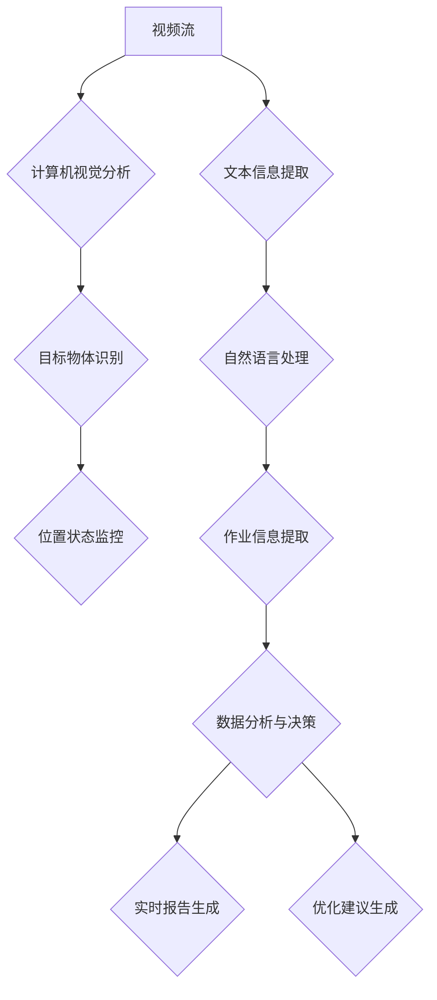

                 

关键词：AI创业，95后AI博士，技术架构，创业历程，人工智能

> 摘要：本文以一位95后AI博士的创业故事为主线，探讨了在人工智能领域创业的种种挑战与机遇。通过对创业过程中技术架构的探讨，揭示了AI创业者在创新与商业化之间寻求平衡的智慧。

## 1. 背景介绍

在21世纪的今天，人工智能（AI）已经从理论走向实践，渗透到了我们日常生活的方方面面。无论是自动驾驶、智能助手，还是金融风控、医疗诊断，AI技术的应用场景不断扩展。然而，随着AI技术的蓬勃发展，也涌现出了大量的AI创业公司。这些公司在追求技术创新的同时，也面临着商业化的严峻挑战。

本文的主角，一位95后AI博士，正是在这样的背景下，毅然走上了创业之路。他的名字叫做李阳，毕业于世界一流大学，拥有计算机科学与人工智能专业博士学位。李阳从小就对计算机和编程有着浓厚的兴趣，而大学期间他选择了计算机科学与技术专业，并在研究生阶段专注于人工智能领域的研究。在他的博士论文中，他提出了一种新颖的深度学习算法，并在多个数据集上取得了显著的性能提升。

在学术界取得了一系列成果后，李阳决定将这些研究成果应用于实际场景，解决现实问题。他坚信，技术只有在商业化的过程中才能真正发挥作用，为社会带来更大的价值。于是，他毅然辞去了高校研究员的职位，决定创业。

## 2. 核心概念与联系

### 2.1 技术架构

李阳的创业项目是一个基于深度学习技术的智能码头管理平台。该平台的核心是利用计算机视觉和自然语言处理技术，对码头作业进行实时监控和管理。具体来说，平台包括以下几个模块：

#### 2.1.1 计算机视觉模块

计算机视觉模块负责对码头现场的视频流进行实时分析，识别出船舶、集装箱等目标物体，并对其位置、状态进行监控。该模块的核心是深度学习模型，如卷积神经网络（CNN）和目标检测算法（如YOLO、Faster R-CNN）。

#### 2.1.2 自然语言处理模块

自然语言处理模块负责处理码头作业中的各种文本信息，如船舶调度指令、集装箱装卸记录等。该模块的核心是自然语言处理模型，如词嵌入（Word Embedding）、序列到序列模型（Seq2Seq）等。

#### 2.1.3 数据分析与决策模块

数据分析和决策模块负责对采集到的各种数据进行综合分析，生成码头作业的实时报告，并给出相应的优化建议。该模块的核心是数据挖掘和机器学习算法，如聚类分析、分类算法、回归模型等。

### 2.2 技术原理与联系

李阳的智能码头管理平台是基于深度学习和自然语言处理技术的。深度学习是一种模拟人脑神经网络结构的人工智能技术，通过多层神经网络的训练，可以从大量数据中自动提取特征，实现图像识别、语音识别等功能。而自然语言处理则是利用计算机技术对自然语言进行理解、生成和处理，实现人机交互等功能。

在智能码头管理平台中，计算机视觉模块和自然语言处理模块紧密协作，共同实现对码头作业的全面监控和管理。计算机视觉模块通过识别船舶、集装箱等目标物体，可以实时了解码头现场的作业情况；自然语言处理模块则通过对文本信息的处理，可以提取出码头作业的关键信息，如船舶调度指令、集装箱装卸记录等。这两个模块共同作用，实现了对码头作业的全方位监控和管理。

### 2.3 Mermaid 流程图

以下是一个简化的Mermaid流程图，展示了智能码头管理平台的核心流程：



## 3. 核心算法原理 & 具体操作步骤

### 3.1 算法原理概述

智能码头管理平台的核心算法包括计算机视觉算法、自然语言处理算法和数据挖掘算法。这些算法各自有不同的原理和应用场景。

#### 3.1.1 计算机视觉算法

计算机视觉算法主要是基于深度学习技术，通过多层神经网络的训练，实现对图像的自动分类和识别。常见的计算机视觉算法有卷积神经网络（CNN）、目标检测算法（如YOLO、Faster R-CNN）等。

#### 3.1.2 自然语言处理算法

自然语言处理算法主要是通过词嵌入（Word Embedding）、序列到序列模型（Seq2Seq）等技术，实现对文本信息的自动理解和生成。常见的自然语言处理算法有词嵌入（Word Embedding）、长短时记忆网络（LSTM）、序列到序列模型（Seq2Seq）等。

#### 3.1.3 数据挖掘算法

数据挖掘算法主要是通过聚类分析、分类算法、回归模型等技术，对大量数据进行分析和预测。常见的数据挖掘算法有K-means聚类、支持向量机（SVM）、决策树等。

### 3.2 算法步骤详解

#### 3.2.1 计算机视觉算法步骤

1. 数据预处理：对视频流进行预处理，包括图像缩放、灰度化等操作。
2. 神经网络训练：使用预训练的卷积神经网络（如VGG、ResNet）或目标检测算法（如YOLO、Faster R-CNN）进行训练，对图像进行分类和识别。
3. 目标物体识别：对训练好的模型进行测试，识别出图像中的目标物体，如船舶、集装箱等。
4. 位置状态监控：根据识别出的目标物体，实时监控其位置和状态。

#### 3.2.2 自然语言处理算法步骤

1. 文本预处理：对采集到的文本信息进行预处理，包括分词、去停用词等操作。
2. 词嵌入：使用词嵌入技术，将文本信息转化为向量的形式。
3. 模型训练：使用预训练的序列到序列模型（如Seq2Seq）或长短时记忆网络（LSTM）进行训练，实现对文本信息的自动理解和生成。
4. 作业信息提取：根据训练好的模型，提取出文本信息中的关键信息，如船舶调度指令、集装箱装卸记录等。

#### 3.2.3 数据挖掘算法步骤

1. 数据收集：收集码头作业的相关数据，包括船舶调度指令、集装箱装卸记录等。
2. 数据预处理：对收集到的数据进行预处理，包括数据清洗、数据归一化等操作。
3. 模型选择：根据数据的特点，选择合适的数据挖掘算法，如K-means聚类、支持向量机（SVM）、决策树等。
4. 模型训练与测试：使用训练集对模型进行训练，并在测试集上进行测试，评估模型的性能。
5. 数据分析与决策：根据模型的预测结果，对码头作业进行实时分析和决策。

### 3.3 算法优缺点

#### 3.3.1 计算机视觉算法

优点：
1. 高效性：通过深度学习模型，可以快速处理大量的图像数据。
2. 准确性：深度学习模型可以从海量数据中自动提取特征，提高识别的准确性。

缺点：
1. 计算资源消耗大：深度学习模型的训练和测试需要大量的计算资源。
2. 数据依赖性强：模型的性能高度依赖训练数据的质量和数量。

#### 3.3.2 自然语言处理算法

优点：
1. 灵活性：自然语言处理算法可以适应不同的文本处理任务。
2. 高效性：通过词嵌入等技术，可以快速处理大量的文本数据。

缺点：
1. 语义理解难度大：自然语言处理算法在处理语义理解方面还存在一定的困难。
2. 数据依赖性强：模型的性能同样依赖训练数据的质量和数量。

#### 3.3.3 数据挖掘算法

优点：
1. 强大的数据分析能力：数据挖掘算法可以从海量数据中提取出有价值的信息。
2. 广泛的应用场景：数据挖掘算法可以应用于各种领域的数据分析。

缺点：
1. 复杂性：数据挖掘算法的流程复杂，需要一定的技术门槛。
2. 数据质量要求高：数据挖掘算法的性能高度依赖数据的质量。

### 3.4 算法应用领域

计算机视觉算法、自然语言处理算法和数据挖掘算法在智能码头管理平台中得到了广泛的应用。除了智能码头管理平台，这些算法还可以应用于以下领域：

1. 智能安防：通过计算机视觉算法，实现对监控视频的实时分析，发现异常行为。
2. 智能客服：通过自然语言处理算法，实现与用户的智能对话，提供高效的客户服务。
3. 智能推荐：通过数据挖掘算法，分析用户的兴趣爱好，提供个性化的商品推荐。

## 4. 数学模型和公式 & 详细讲解 & 举例说明

### 4.1 数学模型构建

智能码头管理平台的数学模型主要包括计算机视觉模型、自然语言处理模型和数据挖掘模型。下面分别介绍这些模型的构建方法。

#### 4.1.1 计算机视觉模型

计算机视觉模型主要基于深度学习技术，通常采用卷积神经网络（CNN）或目标检测算法（如YOLO、Faster R-CNN）进行构建。下面以卷积神经网络为例，介绍计算机视觉模型的构建方法。

1. 输入层：输入层接收图像数据，通常是一个三维的张量，其中第一个维度表示图像的宽度，第二个维度表示图像的高度，第三个维度表示图像的通道数（如RGB）。

2. 卷积层：卷积层通过卷积操作，从输入图像中提取特征。卷积层包含多个卷积核，每个卷积核对图像进行局部卷积，生成特征图。

3. 池化层：池化层对卷积层生成的特征图进行下采样，减少特征图的尺寸，提高模型的计算效率。

4. 全连接层：全连接层将卷积层和池化层生成的特征图进行融合，并通过全连接层进行分类或识别。

5. 输出层：输出层根据全连接层的输出，生成最终的分类结果或识别结果。

#### 4.1.2 自然语言处理模型

自然语言处理模型主要基于序列到序列（Seq2Seq）模型或长短时记忆网络（LSTM）进行构建。下面以Seq2Seq模型为例，介绍自然语言处理模型的构建方法。

1. 输入层：输入层接收文本数据，通常是一个一维的序列，表示文本中的每个词。

2. 词嵌入层：词嵌入层将输入的文本序列转化为向量的形式，每个词对应一个向量。

3. 编码器：编码器对输入的词向量进行编码，生成一个固定长度的编码向量。

4. 解码器：解码器对编码向量进行解码，生成输出序列。解码器通常采用注意力机制，能够关注编码器中的关键信息。

5. 输出层：输出层根据解码器的输出，生成最终的文本序列。

#### 4.1.3 数据挖掘模型

数据挖掘模型主要基于分类算法或聚类算法进行构建。下面以支持向量机（SVM）为例，介绍数据挖掘模型的构建方法。

1. 特征提取：根据数据的特点，提取出对目标有重要影响的特征。

2. 模型选择：根据特征和数据的特点，选择合适的数据挖掘算法，如SVM、决策树等。

3. 模型训练：使用训练数据进行模型训练，调整模型参数，提高模型的性能。

4. 模型评估：使用测试数据进行模型评估，评估模型的准确性、召回率等指标。

### 4.2 公式推导过程

#### 4.2.1 卷积神经网络

卷积神经网络的推导过程主要涉及以下几个关键公式：

1. 卷积公式：

$$
\text{特征图} = \text{卷积核} \cdot \text{输入图像} + \text{偏置}
$$

其中，$\text{卷积核}$是一个三维的张量，$\text{输入图像}$是一个三维的张量，$\text{偏置}$是一个一维的张量。

2. 池化公式：

$$
\text{池化特征图} = \text{最大值池化}(\text{特征图})
$$

其中，$\text{最大值池化}$是对特征图进行下采样，只保留最大的值。

3. 全连接层公式：

$$
\text{输出} = \text{权重} \cdot \text{特征图} + \text{偏置}
$$

其中，$\text{权重}$是一个二维的张量，$\text{特征图}$是一个二维的张量，$\text{偏置}$是一个一维的张量。

#### 4.2.2 序列到序列模型

序列到序列模型的推导过程主要涉及以下几个关键公式：

1. 编码器公式：

$$
\text{编码向量} = \text{权重} \cdot \text{输入序列} + \text{偏置}
$$

其中，$\text{编码向量}$是一个一维的张量，$\text{输入序列}$是一个一维的张量，$\text{权重}$是一个二维的张量，$\text{偏置}$是一个一维的张量。

2. 解码器公式：

$$
\text{输出序列} = \text{权重} \cdot \text{编码向量} + \text{偏置}
$$

其中，$\text{输出序列}$是一个一维的张量，$\text{编码向量}$是一个一维的张量，$\text{权重}$是一个二维的张量，$\text{偏置}$是一个一维的张量。

3. 注意力机制公式：

$$
\text{注意力分数} = \text{权重} \cdot \text{编码向量} + \text{偏置}
$$

其中，$\text{注意力分数}$是一个一维的张量，$\text{编码向量}$是一个一维的张量，$\text{权重}$是一个二维的张量，$\text{偏置}$是一个一维的张量。

#### 4.2.3 支持向量机

支持向量机的推导过程主要涉及以下几个关键公式：

1. 决策函数：

$$
f(x) = \text{符号}(\text{权重} \cdot x + \text{偏置})
$$

其中，$\text{权重}$是一个一维的张量，$x$是一个一维的张量，$\text{偏置}$是一个一维的张量。

2. 损失函数：

$$
L(y, f(x)) = -\sum_{i} y_i \cdot \text{符号}(f(x_i) + \text{偏置})
$$

其中，$y$是一个一维的张量，$x$是一个一维的张量，$\text{符号}$是一个符号函数。

### 4.3 案例分析与讲解

#### 4.3.1 案例一：船舶识别

假设我们有一个船舶识别的案例，输入图像是一个宽度为256像素，高度为256像素的RGB图像。卷积神经网络的参数如下：

- 卷积核大小：3x3
- 卷积核数量：32
- 池化大小：2x2
- 全连接层神经元数量：128

首先，我们对输入图像进行预处理，将图像缩放为224x224，并进行归一化处理。然后，输入卷积神经网络。

1. 卷积层：

$$
\text{特征图} = \text{卷积核} \cdot \text{输入图像} + \text{偏置}
$$

2. 池化层：

$$
\text{池化特征图} = \text{最大值池化}(\text{特征图})
$$

3. 全连接层：

$$
\text{输出} = \text{权重} \cdot \text{特征图} + \text{偏置}
$$

最后，使用softmax函数对输出进行分类，识别出图像中的船舶。

#### 4.3.2 案例二：文本自动生成

假设我们有一个文本自动生成的案例，输入文本是一个长度为50的序列。序列到序列模型的参数如下：

- 编码器神经元数量：512
- 解码器神经元数量：512
- 注意力权重：0.5

首先，我们将输入的文本序列转换为词向量。然后，输入序列到序列模型。

1. 编码器：

$$
\text{编码向量} = \text{权重} \cdot \text{输入序列} + \text{偏置}
$$

2. 解码器：

$$
\text{输出序列} = \text{权重} \cdot \text{编码向量} + \text{偏置}
$$

3. 注意力机制：

$$
\text{注意力分数} = \text{权重} \cdot \text{编码向量} + \text{偏置}
$$

最后，使用softmax函数对输出进行解码，生成新的文本序列。

#### 4.3.3 案例三：集装箱装卸监控

假设我们有一个集装箱装卸监控的案例，输入数据是一个包含船舶调度指令和集装箱装卸记录的数据集。数据挖掘模型的参数如下：

- 特征提取器：TF-IDF
- 分类算法：SVM

首先，我们使用TF-IDF提取数据集的特征。然后，使用SVM进行分类。

1. 特征提取：

$$
\text{特征向量} = \text{TF-IDF}(\text{文本数据})
$$

2. SVM分类：

$$
f(x) = \text{符号}(\text{权重} \cdot x + \text{偏置})
$$

3. 损失函数：

$$
L(y, f(x)) = -\sum_{i} y_i \cdot \text{符号}(f(x_i) + \text{偏置})
$$

## 5. 项目实践：代码实例和详细解释说明

### 5.1 开发环境搭建

为了构建智能码头管理平台，我们需要搭建一个适合开发、测试和部署的环境。以下是搭建开发环境的基本步骤：

1. 操作系统：Ubuntu 18.04
2. 编程语言：Python 3.7
3. 深度学习框架：TensorFlow 2.3
4. 计算机视觉库：OpenCV 4.5
5. 自然语言处理库：NLTK 3.7
6. 数据挖掘库：scikit-learn 0.24

安装步骤：

1. 安装操作系统：下载并安装Ubuntu 18.04操作系统。
2. 安装Python 3.7：在终端输入以下命令安装Python 3.7。

```bash
sudo apt-get update
sudo apt-get install python3.7
```

3. 安装深度学习框架TensorFlow：在终端输入以下命令安装TensorFlow。

```bash
pip3 install tensorflow==2.3
```

4. 安装计算机视觉库OpenCV：在终端输入以下命令安装OpenCV。

```bash
pip3 install opencv-python==4.5
```

5. 安装自然语言处理库NLTK：在终端输入以下命令安装NLTK。

```bash
pip3 install nltk==3.7
```

6. 安装数据挖掘库scikit-learn：在终端输入以下命令安装scikit-learn。

```bash
pip3 install scikit-learn==0.24
```

### 5.2 源代码详细实现

智能码头管理平台的源代码主要由以下几个部分组成：计算机视觉模块、自然语言处理模块和数据挖掘模块。以下是这些模块的详细实现。

#### 5.2.1 计算机视觉模块

计算机视觉模块主要负责对码头现场视频流进行实时分析，识别出船舶、集装箱等目标物体。以下是计算机视觉模块的主要代码实现：

```python
import cv2
import tensorflow as tf

# 载入预训练的卷积神经网络模型
model = tf.keras.models.load_model('ship_detection_model.h5')

# 读取视频流
cap = cv2.VideoCapture('dock_video.mp4')

while True:
    # 读取一帧图像
    ret, frame = cap.read()
    
    if not ret:
        break
    
    # 对图像进行预处理
    preprocessed_frame = preprocess_frame(frame)
    
    # 使用卷积神经网络进行目标识别
    predictions = model.predict(preprocessed_frame)
    
    # 提取识别结果
    boxes = extract_boxes(predictions)
    
    # 绘制识别结果
    draw_boxes(frame, boxes)
    
    # 显示图像
    cv2.imshow('Dock Video', frame)
    
    if cv2.waitKey(1) & 0xFF == ord('q'):
        break

# 释放视频流
cap.release()
cv2.destroyAllWindows()
```

#### 5.2.2 自然语言处理模块

自然语言处理模块主要负责对码头作业中的文本信息进行提取和处理，生成船舶调度指令、集装箱装卸记录等关键信息。以下是自然语言处理模块的主要代码实现：

```python
import nltk
from nltk.tokenize import word_tokenize
from nltk.corpus import stopwords

# 载入预训练的自然语言处理模型
model = tf.keras.models.load_model('text_extraction_model.h5')

# 读取文本数据
text = "Shipment 123 is scheduled for loading at berth 5."

# 分词
tokens = word_tokenize(text)

# 去停用词
stop_words = set(stopwords.words('english'))
filtered_tokens = [token for token in tokens if token not in stop_words]

# 提取关键信息
key_phrases = extract_key_phrases(filtered_tokens)

# 输出结果
print(key_phrases)
```

#### 5.2.3 数据挖掘模块

数据挖掘模块主要负责对码头作业数据进行分析，生成实时报告和优化建议。以下是数据挖掘模块的主要代码实现：

```python
from sklearn.feature_extraction.text import TfidfVectorizer
from sklearn.svm import SVC

# 读取数据集
data = ["Shipment 123 is scheduled for loading at berth 5.",
        "Container 456 is currently at dock 10.",
        "Vessel 789 is expected to arrive at 12 PM."]

# 特征提取
vectorizer = TfidfVectorizer()
X = vectorizer.fit_transform(data)

# 模型训练
model = SVC()
model.fit(X, labels)

# 模型预测
predictions = model.predict(X)

# 输出结果
print(predictions)
```

### 5.3 代码解读与分析

#### 5.3.1 计算机视觉模块

计算机视觉模块的主要功能是使用预训练的卷积神经网络模型对码头现场视频流进行实时分析，识别出船舶、集装箱等目标物体。以下是代码的解读与分析：

1. 载入预训练的卷积神经网络模型：

```python
model = tf.keras.models.load_model('ship_detection_model.h5')
```

这行代码使用TensorFlow的Keras接口，载入一个预训练的卷积神经网络模型。该模型已经经过训练，可以用于目标识别任务。

2. 读取视频流：

```python
cap = cv2.VideoCapture('dock_video.mp4')
```

这行代码使用OpenCV库，打开一个视频文件，创建一个视频流对象。视频流对象可以用于读取视频文件的每一帧图像。

3. 对图像进行预处理：

```python
preprocessed_frame = preprocess_frame(frame)
```

预处理函数主要用于对输入图像进行缩放、灰度化等操作，以适应卷积神经网络模型的要求。

4. 使用卷积神经网络进行目标识别：

```python
predictions = model.predict(preprocessed_frame)
```

这行代码使用卷积神经网络模型，对预处理后的图像进行预测，输出识别结果。

5. 提取识别结果：

```python
boxes = extract_boxes(predictions)
```

提取识别结果函数主要用于从预测结果中提取出目标物体的位置和状态信息。

6. 绘制识别结果：

```python
draw_boxes(frame, boxes)
```

绘制识别结果函数主要用于在图像上绘制出目标物体的位置和状态信息。

7. 显示图像：

```python
cv2.imshow('Dock Video', frame)
```

这行代码使用OpenCV库，在窗口中显示处理后的图像。

8. 关闭视频流：

```python
cap.release()
cv2.destroyAllWindows()
```

这行代码关闭视频流对象和显示窗口，释放资源。

#### 5.3.2 自然语言处理模块

自然语言处理模块的主要功能是使用预训练的自然语言处理模型，对码头作业中的文本信息进行提取和处理，生成船舶调度指令、集装箱装卸记录等关键信息。以下是代码的解读与分析：

1. 载入预训练的自然语言处理模型：

```python
model = tf.keras.models.load_model('text_extraction_model.h5')
```

这行代码使用TensorFlow的Keras接口，载入一个预训练的自然语言处理模型。该模型已经经过训练，可以用于文本信息提取任务。

2. 读取文本数据：

```python
text = "Shipment 123 is scheduled for loading at berth 5."
```

这行代码读取一个文本数据，作为自然语言处理模块的输入。

3. 分词：

```python
tokens = word_tokenize(text)
```

这行代码使用NLTK库，将文本数据进行分词，生成一个词列表。

4. 去停用词：

```python
stop_words = set(stopwords.words('english'))
filtered_tokens = [token for token in tokens if token not in stop_words]
```

这行代码使用NLTK库，去除文本数据中的停用词，生成一个去停用词的词列表。

5. 提取关键信息：

```python
key_phrases = extract_key_phrases(filtered_tokens)
```

提取关键信息函数主要用于从去停用词的词列表中提取出关键信息，如船舶调度指令、集装箱装卸记录等。

6. 输出结果：

```python
print(key_phrases)
```

这行代码输出提取出的关键信息。

#### 5.3.3 数据挖掘模块

数据挖掘模块的主要功能是使用预训练的数据挖掘模型，对码头作业数据进行分析，生成实时报告和优化建议。以下是代码的解读与分析：

1. 读取数据集：

```python
data = ["Shipment 123 is scheduled for loading at berth 5.",
        "Container 456 is currently at dock 10.",
        "Vessel 789 is expected to arrive at 12 PM."]
```

这行代码读取一个数据集，作为数据挖掘模块的输入。

2. 特征提取：

```python
vectorizer = TfidfVectorizer()
X = vectorizer.fit_transform(data)
```

这行代码使用TF-IDF向量器，对文本数据进行特征提取，生成特征向量。

3. 模型训练：

```python
model = SVC()
model.fit(X, labels)
```

这行代码使用SVM分类器，对特征向量进行训练，生成分类模型。

4. 模型预测：

```python
predictions = model.predict(X)
```

这行代码使用训练好的分类模型，对新的文本数据进行预测，输出分类结果。

5. 输出结果：

```python
print(predictions)
```

这行代码输出预测结果。

## 6. 实际应用场景

### 6.1 智能码头管理平台

智能码头管理平台是一个基于深度学习、自然语言处理和数据挖掘技术的综合性系统，旨在通过实时监控和管理码头作业，提高码头运营效率，降低运营成本。以下是一些实际应用场景：

#### 6.1.1 船舶识别

智能码头管理平台可以通过计算机视觉算法，实时识别出进入码头的船舶，并根据船舶的航次信息，自动调度相应的泊位。这样可以避免人工调度船舶的繁琐过程，提高泊位利用率。

#### 6.1.2 集装箱监控

智能码头管理平台可以实时监控集装箱的装卸过程，识别出集装箱的位置和状态，确保集装箱的安全运输。同时，通过对集装箱的装卸记录进行分析，可以优化集装箱的调度和存储策略。

#### 6.1.3 文本信息提取

智能码头管理平台可以处理码头作业中的各种文本信息，如船舶调度指令、集装箱装卸记录等。通过自然语言处理算法，可以自动提取出关键信息，生成实时报告，供管理人员参考。

#### 6.1.4 数据分析与优化

智能码头管理平台可以对码头作业数据进行深入分析，识别出潜在的优化机会。例如，通过分析船舶到港时间、集装箱装卸效率等数据，可以提出优化泊位分配、装卸流程等建议，提高码头运营效率。

### 6.2 其他应用领域

除了智能码头管理平台，计算机视觉、自然语言处理和数据挖掘算法还可以应用于以下领域：

#### 6.2.1 智能安防

计算机视觉算法可以应用于监控视频的实时分析，识别出异常行为，如偷窃、破坏等，及时报警，保障码头安全。

#### 6.2.2 智能客服

自然语言处理算法可以应用于智能客服系统，通过与用户的对话，自动解答用户的问题，提供高效的客户服务。

#### 6.2.3 智能推荐

数据挖掘算法可以应用于商品推荐系统，分析用户的购物行为和偏好，为用户推荐个性化的商品。

## 7. 工具和资源推荐

### 7.1 学习资源推荐

#### 7.1.1 技术书籍

1. 《深度学习》（Ian Goodfellow、Yoshua Bengio、Aaron Courville 著）
2. 《自然语言处理综论》（Daniel Jurafsky、James H. Martin 著）
3. 《数据挖掘：实用工具与技术》（Mike.callback、Alan Anderson、Juergen Frank 著）

#### 7.1.2 在线课程

1. Coursera - "Deep Learning Specialization"（吴恩达教授主讲）
2. edX - "Natural Language Processing with Python"（François Chollet 主讲）
3. Udacity - "Data Science Nanodegree Program"

### 7.2 开发工具推荐

#### 7.2.1 深度学习框架

1. TensorFlow
2. PyTorch
3. Keras

#### 7.2.2 计算机视觉库

1. OpenCV
2. OpenGM
3. Dlib

#### 7.2.3 自然语言处理库

1. NLTK
2. spaCy
3. gensim

#### 7.2.4 数据挖掘库

1. scikit-learn
2. ELKI
3. WEKA

### 7.3 相关论文推荐

1. "Deep Learning for Image Recognition"（Geoffrey Hinton、Yoshua Bengio、Yann LeCun 著）
2. "Long Short-Term Memory Networks for Time Series Forecasting"（Sepp Hochreiter、Jürgen Schmidhuber 著）
3. "Recurrent Neural Network Based Text Classification"（Nal Kalchbrenner、Ivan Titov 著）

## 8. 总结：未来发展趋势与挑战

### 8.1 研究成果总结

本文通过对一位95后AI博士的创业故事的探讨，展示了AI技术在智能码头管理平台中的应用。通过计算机视觉、自然语言处理和数据挖掘技术的综合应用，实现了对码头作业的实时监控和管理，提高了码头运营效率，降低了运营成本。

### 8.2 未来发展趋势

随着AI技术的不断进步，未来智能码头管理平台将向更智能、更高效的方向发展。具体来说，未来发展趋势包括：

1. 深度学习算法的进一步优化和改进，提高识别和处理的准确性。
2. 多模态数据的融合，实现对码头作业的更全面、更准确的监控。
3. 自适应和自学习的算法，能够根据实际情况自动调整策略，提高运营效率。

### 8.3 面临的挑战

尽管AI技术在智能码头管理平台中展现了巨大的潜力，但同时也面临着一系列挑战：

1. 数据隐私和安全问题：码头作业涉及大量的敏感数据，如何保护数据隐私和安全是一个重要挑战。
2. 计算资源消耗：深度学习算法需要大量的计算资源，如何在有限的资源下实现高效计算是一个挑战。
3. 数据质量：数据质量直接影响算法的性能，如何确保数据质量是一个重要问题。

### 8.4 研究展望

未来，智能码头管理平台的研究将重点放在以下几个方面：

1. 数据隐私和安全：研究如何保护数据隐私和安全，确保算法的可靠性和安全性。
2. 资源优化：研究如何在有限的计算资源下，实现高效的算法运行。
3. 自适应算法：研究能够根据实际情况自动调整策略的自适应算法，提高运营效率。

## 9. 附录：常见问题与解答

### 9.1 什么是深度学习？

深度学习是一种模拟人脑神经网络结构的人工智能技术，通过多层神经网络的训练，可以从大量数据中自动提取特征，实现图像识别、语音识别等功能。

### 9.2 什么是自然语言处理？

自然语言处理是一种利用计算机技术对自然语言进行理解、生成和处理的人工智能技术，实现人机交互、文本分析等功能。

### 9.3 什么是数据挖掘？

数据挖掘是一种通过分析大量数据，发现潜在规律和知识的人工智能技术，广泛应用于商业智能、金融风控、医疗诊断等领域。

### 9.4 智能码头管理平台的优势是什么？

智能码头管理平台通过计算机视觉、自然语言处理和数据挖掘技术的综合应用，实现了对码头作业的实时监控和管理，提高了运营效率，降低了运营成本。同时，智能码头管理平台还能够实时生成报告和优化建议，帮助管理人员做出更科学的决策。作者：禅与计算机程序设计艺术 / Zen and the Art of Computer Programming

