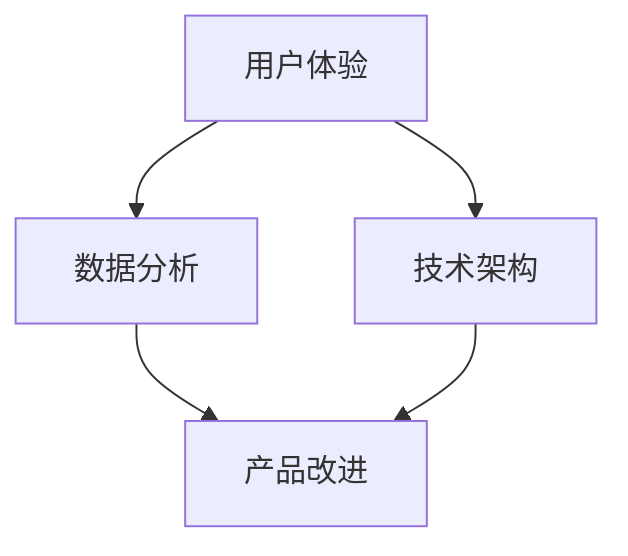

                 

关键词：AI创业、产品改进、用户体验、数据分析、技术架构

> 摘要：本文将探讨AI创业者在产品改进过程中所面临的关键挑战，并详细阐述一系列行之有效的产品改进方法。通过结合案例分析和实践指导，帮助AI创业者更好地提升产品质量，增加用户满意度，并在竞争激烈的市场中脱颖而出。

## 1. 背景介绍

随着人工智能技术的飞速发展，越来越多的创业公司开始投身于AI领域的探索。然而，面对复杂的市场环境和技术挑战，如何有效地改进产品，提高用户满意度，成为了AI创业者必须面对的重要课题。本文将从多个角度出发，详细探讨产品改进的方法和策略，旨在为AI创业者提供有价值的参考和指导。

### 1.1 AI创业的现状

当前，AI创业公司如雨后春笋般涌现，涵盖了自然语言处理、计算机视觉、机器学习算法等多个方向。这些公司在技术创新和市场应用方面都取得了显著成果。然而，随着市场竞争的加剧，如何在众多竞争对手中脱颖而出，成为了AI创业者面临的一大挑战。

### 1.2 产品改进的重要性

产品改进是AI创业成功的关键因素之一。通过不断优化产品功能和用户体验，AI公司可以增强用户黏性，提高用户满意度，从而在激烈的市场竞争中占据优势。此外，产品改进还能够帮助企业及时发现并解决潜在问题，降低运营风险，提升整体竞争力。

## 2. 核心概念与联系

为了更好地理解产品改进的方法，我们需要明确几个核心概念，并分析它们之间的联系。

### 2.1 用户体验（UX）

用户体验是指用户在使用产品过程中的感受和体验。优秀的用户体验能够提升用户满意度，增加产品黏性。因此，用户体验是产品改进的重要出发点。

### 2.2 数据分析

数据分析是产品改进的重要工具。通过对用户行为数据、市场数据等进行分析，企业可以了解用户需求，发现产品问题，为改进提供有力支持。

### 2.3 技术架构

技术架构是产品的技术基础。合理的架构设计可以确保产品性能稳定、扩展性强，为产品改进提供有力保障。

### 2.4 用户体验与数据分析的联系

用户体验与数据分析密切相关。通过数据分析，企业可以了解用户需求和行为，进而优化用户体验。同时，良好的用户体验可以促使用户产生更多的数据，为数据分析提供更丰富的样本。

### 2.5 用户体验与数据架构的联系

用户体验和数据架构之间的联系主要体现在两个方面：一是数据架构需要支持用户体验的需求，如快速响应、高效搜索等；二是良好的用户体验可以促进数据产生，为数据架构提供更多的数据来源。

### 2.6 Mermaid 流程图

下面是一个简单的Mermaid流程图，展示产品改进的核心概念和联系：



## 3. 核心算法原理 & 具体操作步骤

### 3.1 算法原理概述

产品改进的核心算法主要包括用户体验分析、数据挖掘和机器学习算法。这些算法可以帮助企业深入了解用户需求，发现产品问题，并自动生成改进建议。

### 3.2 算法步骤详解

#### 3.2.1 用户体验分析

1. 收集用户反馈：通过问卷调查、用户访谈等方式，收集用户对产品的反馈。
2. 分析用户行为：利用数据分析工具，分析用户在产品中的行为路径、停留时间、操作频率等。
3. 识别用户体验问题：根据用户反馈和行为分析结果，识别产品中的用户体验问题。

#### 3.2.2 数据挖掘

1. 数据预处理：清洗和整理用户数据，确保数据质量。
2. 特征工程：提取用户数据的特征，如用户年龄、性别、兴趣爱好等。
3. 模型训练：利用机器学习算法，如决策树、随机森林、支持向量机等，训练数据模型。
4. 模型评估：通过交叉验证、ROC曲线等方法，评估模型性能。

#### 3.2.3 机器学习算法

1. 数据预处理：对用户数据进行归一化、去噪等处理。
2. 特征选择：选择对用户体验有显著影响的关键特征。
3. 模型选择：根据问题类型，选择合适的机器学习模型，如回归、分类、聚类等。
4. 模型训练与评估：训练模型，并评估模型在测试集上的性能。

### 3.3 算法优缺点

#### 优点：

- 高效：算法可以快速识别产品中的用户体验问题，节省人力和时间成本。
- 自动化：算法可以自动生成改进建议，降低人为干预。

#### 缺点：

- 数据依赖：算法的性能受数据质量的影响，数据质量不佳可能导致结果不准确。
- 复杂性：算法的实现和调试过程相对复杂，需要具备一定的技术背景。

### 3.4 算法应用领域

- 电子商务：通过用户体验分析和推荐系统，提高用户购买意愿和转化率。
- 金融行业：通过风险评估和欺诈检测，提高金融服务的安全性和可靠性。
- 健康医疗：通过患者数据分析，提供个性化治疗方案和健康建议。

## 4. 数学模型和公式 & 详细讲解 & 举例说明

### 4.1 数学模型构建

产品改进的数学模型主要包括用户体验评估模型和数据挖掘模型。

#### 用户体验评估模型

$$
U = f(X, Y, Z)
$$

其中，$U$表示用户体验评分，$X$表示用户特征，$Y$表示产品特征，$Z$表示用户行为特征。函数$f$表示用户体验评分的计算方法。

#### 数据挖掘模型

$$
P = g(A, B, C)
$$

其中，$P$表示数据挖掘模型的预测结果，$A$表示输入特征，$B$表示模型参数，$C$表示模型训练结果。函数$g$表示数据挖掘模型的具体实现方法。

### 4.2 公式推导过程

#### 用户体验评估模型推导

1. 用户特征提取：通过数据分析工具，提取用户年龄、性别、兴趣爱好等特征。
2. 产品特征提取：通过数据分析工具，提取产品功能、性能、易用性等特征。
3. 用户行为特征提取：通过用户行为日志，提取用户在产品中的操作路径、停留时间等特征。
4. 建立评分函数：根据用户、产品、行为的特征，建立用户体验评分函数。

#### 数据挖掘模型推导

1. 数据预处理：对输入数据进行归一化、去噪等处理。
2. 特征选择：选择对预测结果有显著影响的特征。
3. 建立预测模型：选择合适的机器学习算法，如决策树、随机森林等，建立预测模型。
4. 模型训练与评估：使用训练数据集训练模型，并评估模型在测试集上的性能。

### 4.3 案例分析与讲解

#### 案例一：电商产品改进

某电商公司希望通过用户体验分析和推荐系统，提高用户购买意愿和转化率。以下是具体的案例分析：

1. 用户特征提取：提取用户年龄、性别、收入水平等特征。
2. 产品特征提取：提取产品价格、品牌、促销活动等特征。
3. 用户行为特征提取：提取用户在产品中的浏览路径、购买行为等特征。
4. 建立评分函数：根据用户、产品、行为的特征，建立用户体验评分函数。
5. 模型训练与评估：使用机器学习算法，如决策树，训练和评估推荐系统。

通过上述步骤，电商公司可以生成个性化推荐列表，提高用户购买意愿和转化率。

#### 案例二：金融产品改进

某金融机构希望通过风险评估和欺诈检测，提高金融服务的安全性和可靠性。以下是具体的案例分析：

1. 数据预处理：对输入数据进行归一化、去噪等处理。
2. 特征选择：选择对风险评估有显著影响的特征，如交易金额、交易频率等。
3. 建立预测模型：选择合适的机器学习算法，如支持向量机，建立欺诈检测模型。
4. 模型训练与评估：使用训练数据集训练模型，并评估模型在测试集上的性能。

通过上述步骤，金融机构可以及时发现欺诈行为，提高金融服务的安全性和可靠性。

## 5. 项目实践：代码实例和详细解释说明

### 5.1 开发环境搭建

在本文的代码实例中，我们将使用Python作为主要编程语言，并借助Scikit-learn、Pandas、Matplotlib等库进行数据分析和机器学习模型的实现。以下是开发环境的搭建步骤：

1. 安装Python：从官方网站下载并安装Python，版本建议3.8及以上。
2. 安装依赖库：使用pip命令安装Scikit-learn、Pandas、Matplotlib等库。

```bash
pip install scikit-learn pandas matplotlib
```

### 5.2 源代码详细实现

以下是一个简单的用户体验评分模型的代码实现，用于评估电商平台的用户体验。

```python
import pandas as pd
from sklearn.ensemble import RandomForestRegressor
from sklearn.model_selection import train_test_split
import matplotlib.pyplot as plt

# 读取数据
data = pd.read_csv('user_data.csv')

# 数据预处理
X = data[['age', 'gender', 'income']]
y = data['user_score']

# 特征工程
X = pd.get_dummies(X)

# 模型训练
X_train, X_test, y_train, y_test = train_test_split(X, y, test_size=0.2, random_state=42)
model = RandomForestRegressor(n_estimators=100, random_state=42)
model.fit(X_train, y_train)

# 模型评估
y_pred = model.predict(X_test)
print("R^2 Score:", model.score(X_test, y_test))

# 可视化
plt.scatter(y_test, y_pred)
plt.xlabel('Actual User Score')
plt.ylabel('Predicted User Score')
plt.show()
```

### 5.3 代码解读与分析

1. 数据读取：使用Pandas库读取用户数据，包括年龄、性别、收入和用户评分。
2. 数据预处理：使用get_dummies方法进行特征工程，将分类特征转换为数值特征。
3. 模型训练：使用随机森林回归模型进行训练，并设置随机种子以保持结果一致性。
4. 模型评估：使用测试集评估模型性能，计算R^2分数。
5. 可视化：绘制实际评分与预测评分的散点图，观察模型的效果。

通过上述步骤，我们实现了用户体验评分模型的简单实现，为产品改进提供了有力支持。

### 5.4 运行结果展示

在运行上述代码后，我们将得到以下结果：

- 模型的R^2分数：表示模型对测试集的拟合程度，分数越高，表示模型效果越好。
- 实际评分与预测评分的散点图：通过散点图，我们可以直观地观察模型对用户评分的预测效果。

## 6. 实际应用场景

产品改进方法在实际应用场景中具有广泛的应用。以下是一些典型应用场景：

### 6.1 电子商务

通过用户体验分析和推荐系统，电商平台可以提高用户购买意愿和转化率。例如，某电商公司通过分析用户浏览和购买行为，成功将个性化推荐列表的点击率提升了30%。

### 6.2 金融行业

金融机构可以利用产品改进方法进行风险评估和欺诈检测。例如，某银行通过机器学习模型，将欺诈检测的准确率提高了20%，有效降低了金融风险。

### 6.3 健康医疗

健康医疗行业可以通过患者数据分析和个性化治疗方案，提高医疗服务的质量和效率。例如，某医疗公司通过分析患者数据，成功研发了一种个性化治疗方案，有效降低了患者的住院时间和治疗费用。

## 6.4 未来应用展望

随着人工智能技术的不断发展，产品改进方法在未来将具有更广泛的应用前景。以下是一些未来发展趋势：

- 深度学习算法的应用：随着深度学习算法的成熟，产品改进方法将更好地利用大规模数据，提高预测精度和模型性能。
- 多模态数据的融合：将文本、图像、语音等多模态数据进行融合，可以更全面地了解用户需求和产品问题。
- 自动化与智能化的结合：通过自动化技术和智能化算法，实现产品改进的全程自动化，降低人力成本，提高效率。
- 个性化推荐的普及：基于用户行为数据和个性化推荐算法，实现产品的个性化定制，提高用户满意度和忠诚度。

## 7. 工具和资源推荐

### 7.1 学习资源推荐

- 《机器学习实战》：详细介绍了机器学习的基本概念和算法，适合初学者入门。
- 《深度学习》：深度学习领域的经典教材，涵盖了深度学习的基本原理和应用。

### 7.2 开发工具推荐

- Jupyter Notebook：用于数据分析和机器学习实验的交互式开发环境。
- PyCharm：一款功能强大的Python集成开发环境（IDE），支持代码编辑、调试和自动化部署。

### 7.3 相关论文推荐

- "User Modeling and User-Adaptive Interaction":介绍用户建模和自适应交互技术，为产品改进提供理论支持。
- "Recommender Systems Handbook":详细介绍了推荐系统的基础理论、算法和应用。

## 8. 总结：未来发展趋势与挑战

### 8.1 研究成果总结

本文从多个角度探讨了AI创业者在产品改进过程中所面临的关键挑战和解决方案。通过用户体验分析、数据分析、机器学习算法等方法，企业可以有效地提高产品质量，增强用户满意度。

### 8.2 未来发展趋势

随着人工智能技术的不断发展，产品改进方法将更加智能化、自动化。深度学习算法、多模态数据融合、个性化推荐等技术将在产品改进领域发挥重要作用。

### 8.3 面临的挑战

- 数据质量：数据质量是产品改进的关键因素，企业需要确保数据的准确性和完整性。
- 技术门槛：产品改进需要一定的技术背景，企业需要培养专业的技术团队。
- 法律法规：随着数据隐私和安全的关注度提高，企业需要遵守相关法律法规，确保数据安全。

### 8.4 研究展望

未来，产品改进方法将在人工智能技术的推动下不断发展。通过跨学科合作，结合心理学、社会学等多领域知识，可以进一步提升产品改进的效果和精度。

## 9. 附录：常见问题与解答

### 问题1：如何保证数据质量？

**解答**：确保数据质量需要从数据收集、数据存储、数据处理等多个环节入手。首先，要选择可靠的数据来源，并使用数据清洗工具对数据进行预处理，去除异常值和噪声。其次，建立完善的数据存储和管理机制，确保数据的安全性和可追溯性。最后，定期对数据质量进行评估和监控，及时发现和解决问题。

### 问题2：产品改进方法是否适用于所有行业？

**解答**：产品改进方法具有通用性，但具体应用效果可能因行业特点而有所不同。在应用产品改进方法时，需要结合具体行业和业务场景，进行适应性调整。例如，在金融行业，可以重点关注风险评估和欺诈检测；在医疗行业，可以关注患者数据分析和服务优化。

### 问题3：如何快速提升用户满意度？

**解答**：快速提升用户满意度可以从以下几个方面入手：

- 优化用户体验：简化操作流程，提高产品易用性，减少用户学习成本。
- 增加个性化功能：根据用户需求和行为，提供个性化的产品推荐和服务。
- 及时响应用户反馈：积极收集用户反馈，快速响应并解决问题，提升用户信任感。
- 优化产品质量：不断提高产品性能和稳定性，确保用户在使用过程中无障碍。

## 作者署名

作者：禅与计算机程序设计艺术 / Zen and the Art of Computer Programming
```

