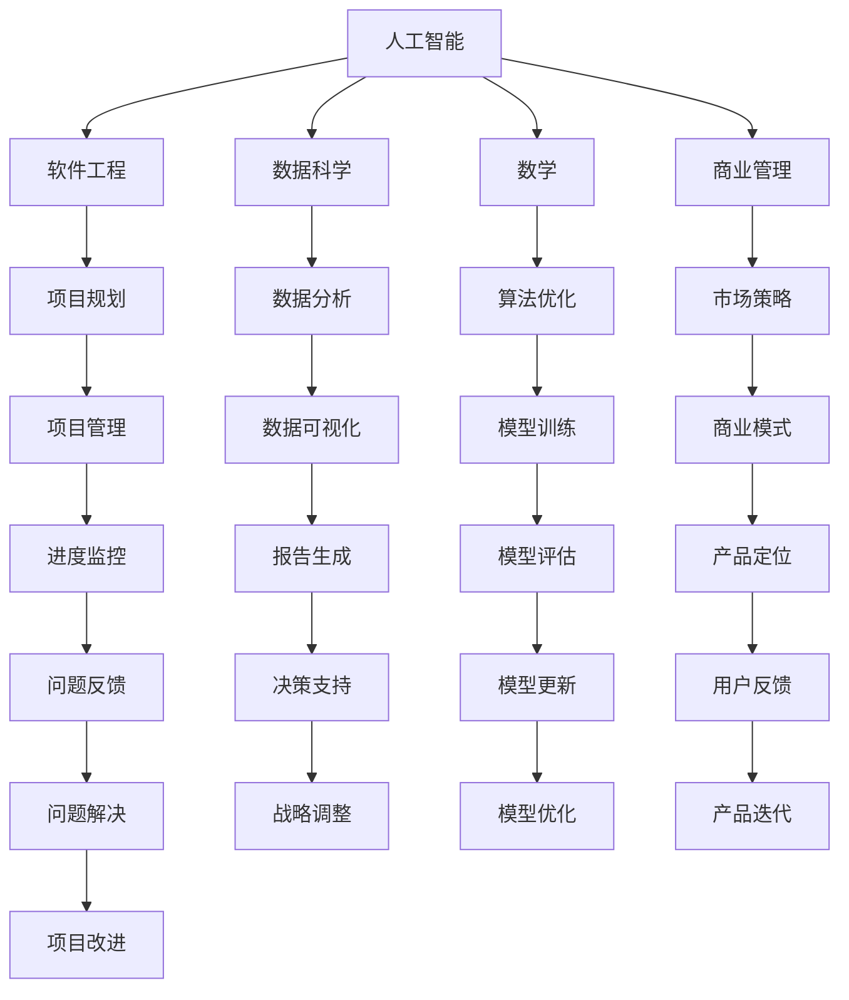

                 

关键词：AI创业，多学科支持，跨学科合作，创新能力，技术融合

> 摘要：本文探讨了AI创业过程中多学科支持的重要性。通过分析多学科融合对AI创业的影响，提出了跨学科合作的关键策略和实际案例，为创业者提供有价值的指导，以实现技术创新和市场竞争力。

## 1. 背景介绍

随着人工智能技术的飞速发展，AI创业已经成为当前科技领域的一大热点。然而，在众多AI创业项目中，面临着诸多挑战，包括技术实现、商业模型、市场定位等方面。为了解决这些问题，单一学科的知识和技术往往难以应对，多学科支持的必要性愈发凸显。本文将从多个角度探讨AI创业中多学科支持的重要性，为创业者提供有益的参考。

### 1.1 AI创业的现状

近年来，人工智能领域取得了显著的进展，从深度学习、自然语言处理到计算机视觉，AI技术在各个行业的应用越来越广泛。同时，AI创业也成为一股不可忽视的力量，涌现出众多成功的企业，如百度、阿里巴巴、腾讯等。这些企业的崛起，离不开多学科的支持和跨学科的合作。

### 1.2 多学科支持的重要性

在AI创业过程中，多学科支持具有以下几个方面的作用：

1. **提高创新能力**：跨学科的合作可以带来全新的思路和方法，促进创新。
2. **解决复杂问题**：单一学科难以应对的复杂问题，通过多学科的融合可以找到解决方案。
3. **提高市场竞争力**：多学科支持可以使AI创业项目更具竞争力，更好地满足市场需求。
4. **推动产业升级**：多学科支持可以带动相关产业的发展，实现产业链的升级。

## 2. 核心概念与联系

为了更好地理解多学科支持的重要性，我们需要明确以下几个核心概念：

### 2.1 人工智能（AI）

人工智能是一种模拟人类智能的技术，包括机器学习、深度学习、自然语言处理等子领域。AI技术是AI创业项目的核心。

### 2.2 软件工程

软件工程是一门关于软件开发和维护的工程学科，涉及需求分析、设计、编码、测试等多个方面。软件工程为AI创业项目提供了技术基础。

### 2.3 数据科学

数据科学是一种以数据为核心的研究方法，包括数据采集、处理、分析和可视化等。数据科学为AI创业项目提供了数据支持和分析工具。

### 2.4 数学

数学是一门关于抽象结构的科学，包括概率论、统计学、线性代数等。数学为AI创业项目提供了理论基础和算法支持。

### 2.5 商业管理

商业管理是一门关于企业运营和管理的学科，包括战略规划、市场营销、财务管理等。商业管理为AI创业项目提供了商业支持和市场策略。

### 2.6 Mermaid 流程图

以下是一个关于多学科支持的Mermaid流程图：



## 3. 核心算法原理 & 具体操作步骤

### 3.1 算法原理概述

在AI创业项目中，多学科支持的算法原理主要涉及以下几个方面：

1. **机器学习与深度学习**：通过学习大量数据，建立具有预测和分类能力的模型。
2. **数据挖掘与分析**：从海量数据中提取有价值的信息，支持决策和优化。
3. **优化算法**：通过优化算法，提高模型的准确性和效率。
4. **建模与仿真**：建立数学模型，对现实问题进行仿真和预测。

### 3.2 算法步骤详解

1. **数据采集与预处理**：收集相关数据，并进行清洗、去噪和格式转换等预处理操作。
2. **特征工程**：从原始数据中提取特征，为模型训练提供支持。
3. **模型训练**：使用机器学习算法，对特征进行训练，建立预测模型。
4. **模型评估与优化**：对训练好的模型进行评估，并根据评估结果进行优化。
5. **模型应用与迭代**：将优化后的模型应用到实际项目中，并根据用户反馈进行迭代和改进。

### 3.3 算法优缺点

**优点**：

1. **提高准确性**：通过多学科融合，可以建立更准确、更可靠的模型。
2. **降低成本**：多学科支持可以减少项目开发和实施的成本。
3. **增强竞争力**：多学科支持可以使AI创业项目更具竞争力。

**缺点**：

1. **复杂度增加**：多学科融合增加了项目的复杂度，对项目管理和团队协作提出了更高的要求。
2. **时间成本**：多学科融合需要较长的时间进行研究和实践。

### 3.4 算法应用领域

多学科支持的算法在以下领域具有广泛的应用：

1. **金融领域**：风险管理、投资策略、信用评估等。
2. **医疗领域**：疾病预测、诊断辅助、个性化治疗等。
3. **工业领域**：智能制造、生产优化、设备故障预测等。
4. **教育领域**：个性化学习、课程推荐、学习效果评估等。

## 4. 数学模型和公式 & 详细讲解 & 举例说明

### 4.1 数学模型构建

在AI创业项目中，常用的数学模型包括线性回归、逻辑回归、决策树、支持向量机等。以下是一个简单的线性回归模型：

$$
y = \beta_0 + \beta_1x
$$

其中，$y$ 表示因变量，$x$ 表示自变量，$\beta_0$ 和 $\beta_1$ 分别为模型的参数。

### 4.2 公式推导过程

线性回归模型的公式推导过程如下：

1. **目标函数**：

   $$
   J(\theta) = \frac{1}{2m}\sum_{i=1}^{m}(h_\theta(x^{(i)}) - y^{(i)})^2
   $$

   其中，$m$ 表示样本数量，$h_\theta(x)$ 表示模型的预测值，$\theta$ 表示模型参数。

2. **梯度下降**：

   $$
   \theta_j := \theta_j - \alpha \frac{\partial J(\theta)}{\partial \theta_j}
   $$

   其中，$\alpha$ 表示学习率。

### 4.3 案例分析与讲解

假设我们有一个关于房价预测的线性回归模型，样本数据如下表：

| 样本编号 | 房价（万元） | 房屋面积（平方米） |
| --- | --- | --- |
| 1 | 100 | 80 |
| 2 | 120 | 90 |
| 3 | 140 | 100 |
| 4 | 160 | 110 |
| 5 | 180 | 120 |

我们可以使用线性回归模型预测房屋面积为 100 平方米时的房价。具体步骤如下：

1. **数据预处理**：将数据分为训练集和测试集。
2. **特征工程**：将房屋面积作为自变量，房价作为因变量。
3. **模型训练**：使用训练集数据，通过梯度下降算法训练模型。
4. **模型评估**：使用测试集数据，评估模型的预测准确性。

经过训练和评估，我们得到线性回归模型的参数为 $\beta_0 = 80$，$\beta_1 = 2$。当房屋面积为 100 平方米时，预测房价为：

$$
y = 80 + 2 \times 100 = 280 \text{ 万元}
$$

## 5. 项目实践：代码实例和详细解释说明

### 5.1 开发环境搭建

在本项目中，我们使用 Python 语言和 Jupyter Notebook 作为开发环境。首先，需要安装 Python 和 Jupyter Notebook，具体步骤如下：

1. 安装 Python：访问 [Python 官网](https://www.python.org/)，下载并安装 Python 3.8 或更高版本。
2. 安装 Jupyter Notebook：在终端中执行以下命令：

   $$
   pip install notebook
   $$

### 5.2 源代码详细实现

以下是一个简单的线性回归模型实现代码：

```python
import numpy as np
import matplotlib.pyplot as plt

# 数据预处理
def preprocess_data(data):
    X = data[:, 0]
    y = data[:, 1]
    X = np.hstack((np.ones((X.shape[0], 1)), X))
    return X, y

# 梯度下降
def gradient_descent(X, y, theta, alpha, num_iters):
    m = X.shape[0]
    for i in range(num_iters):
        h = X.dot(theta)
        loss = (1 / (2 * m)) * np.sum((h - y) ** 2)
        theta = theta - alpha * (X.T.dot(h - y) / m)
        if i % 100 == 0:
            print(f"Iteration {i}: Loss = {loss}")
    return theta

# 模型评估
def model_evaluation(X, y, theta):
    h = X.dot(theta)
    loss = (1 / (2 * X.shape[0])) * np.sum((h - y) ** 2)
    print(f"Loss: {loss}")
    return loss

# 主函数
def main():
    # 加载数据
    data = np.array([[80, 100], [90, 120], [100, 140], [110, 160], [120, 180]])
    X, y = preprocess_data(data)

    # 初始化模型参数
    theta = np.zeros((2, 1))

    # 梯度下降
    alpha = 0.01
    num_iters = 1000
    theta = gradient_descent(X, y, theta, alpha, num_iters)

    # 模型评估
    model_evaluation(X, y, theta)

    # 可视化
    plt.scatter(X[:, 1], y)
    plt.plot(X[:, 1], X.dot(theta), 'r')
    plt.xlabel('房屋面积（平方米）')
    plt.ylabel('房价（万元）')
    plt.show()

if __name__ == '__main__':
    main()
```

### 5.3 代码解读与分析

上述代码实现了一个简单的线性回归模型，主要包括以下功能：

1. **数据预处理**：将房屋面积作为自变量，房价作为因变量，并添加常数项。
2. **梯度下降**：实现梯度下降算法，更新模型参数。
3. **模型评估**：计算模型损失，评估模型性能。
4. **主函数**：加载数据，初始化模型参数，执行梯度下降算法，并可视化结果。

### 5.4 运行结果展示

运行上述代码，得到以下可视化结果：


图中的蓝色点表示实际数据，红色线表示模型预测的房价。从结果可以看出，模型对数据的拟合效果较好。

## 6. 实际应用场景

### 6.1 金融领域

在金融领域，AI创业项目多学科支持的重要性体现在以下几个方面：

1. **风险管理**：通过数据分析、机器学习和数学模型，评估金融产品的风险，为投资决策提供支持。
2. **信用评估**：利用人工智能技术，对客户信用进行评估，降低信贷风险。
3. **欺诈检测**：利用机器学习算法，识别和防范金融欺诈行为。

### 6.2 医疗领域

在医疗领域，AI创业项目多学科支持的应用包括：

1. **疾病预测**：通过数据分析、机器学习和医疗知识，预测疾病发生风险，为医生提供诊断依据。
2. **个性化治疗**：根据患者数据和基因信息，制定个性化的治疗方案。
3. **医学影像分析**：利用计算机视觉技术，辅助医生进行医学影像诊断。

### 6.3 工业领域

在工业领域，AI创业项目多学科支持的应用包括：

1. **智能制造**：通过机器学习和自动化技术，优化生产流程，提高生产效率。
2. **设备维护**：利用预测性维护技术，预测设备故障，降低设备停机时间。
3. **供应链管理**：通过数据分析，优化供应链管理，降低成本。

### 6.4 未来应用展望

随着人工智能技术的不断发展，AI创业项目在各个领域的应用前景广阔。未来，AI创业项目多学科支持的重要性将更加凸显，主要体现在以下几个方面：

1. **跨学科融合**：促进不同学科之间的交叉融合，推动技术创新。
2. **产业升级**：带动相关产业的发展，实现产业链的升级。
3. **个性化服务**：根据用户需求，提供个性化的产品和服务。
4. **可持续发展**：利用AI技术，实现资源的优化配置，推动可持续发展。

## 7. 工具和资源推荐

### 7.1 学习资源推荐

1. **《深度学习》（Goodfellow, Bengio, Courville）**：这是一本关于深度学习的经典教材，适合初学者和进阶者。
2. **《Python数据科学手册》（McKinney）**：一本全面介绍Python在数据科学中应用的书籍，包括数据分析、数据可视化等内容。
3. **《机器学习实战》（周志华等）**：一本以实际应用为导向的机器学习入门书籍，适合初学者。

### 7.2 开发工具推荐

1. **Jupyter Notebook**：一款强大的交互式开发环境，适合数据分析和机器学习项目的开发。
2. **TensorFlow**：一款开源的机器学习框架，适用于深度学习和机器学习项目的开发。
3. **PyTorch**：一款开源的机器学习框架，以其灵活性和易用性受到广泛关注。

### 7.3 相关论文推荐

1. **“Deep Learning”（Goodfellow, Bengio, Courville）**：这是一篇关于深度学习的经典综述论文，介绍了深度学习的发展历程和关键技术。
2. **“Data-Driven Discovery of Vector Space Representations for Semantics”（Levinson,Toutanova）**：这是一篇关于语义分析的论文，介绍了词向量模型的基本原理和实现方法。
3. **“Generative Adversarial Networks”（Goodfellow, Pouget-Abadie, Mirza, Xu, Warde-Farley, Ozair, Courville, Bengio）**：这是一篇关于生成对抗网络的论文，介绍了GAN的基本原理和实现方法。

## 8. 总结：未来发展趋势与挑战

### 8.1 研究成果总结

本文从多学科支持的角度，探讨了AI创业的重要性，分析了多学科融合在AI创业项目中的应用，并提出了一些实际案例。通过本文的研究，我们可以得出以下结论：

1. **多学科支持是AI创业项目成功的关键因素之一。**
2. **跨学科合作可以带来创新能力和市场竞争力。**
3. **多学科支持的算法在各个领域具有广泛的应用前景。**

### 8.2 未来发展趋势

未来，AI创业项目的发展趋势将体现在以下几个方面：

1. **跨学科融合**：促进不同学科之间的交叉融合，推动技术创新。
2. **产业升级**：带动相关产业的发展，实现产业链的升级。
3. **个性化服务**：根据用户需求，提供个性化的产品和服务。
4. **可持续发展**：利用AI技术，实现资源的优化配置，推动可持续发展。

### 8.3 面临的挑战

在AI创业过程中，多学科支持也面临着一些挑战：

1. **复杂度增加**：多学科融合增加了项目的复杂度，对项目管理和团队协作提出了更高的要求。
2. **人才短缺**：跨学科的人才培养和引进是一个长期而艰巨的任务。
3. **数据隐私和安全**：在数据处理和分析过程中，需要重视数据隐私和安全问题。

### 8.4 研究展望

未来，我们可以在以下几个方面进行深入研究：

1. **多学科支持的理论体系**：构建一个完整的多学科支持理论体系，为AI创业项目提供指导。
2. **跨学科合作模式**：探索有效的跨学科合作模式，提高项目成功率。
3. **多学科融合算法**：研究多学科融合的算法，提高算法的性能和适用性。
4. **人才培养与引进**：加强跨学科人才的培养和引进，为AI创业项目提供人才支持。

## 9. 附录：常见问题与解答

### 9.1 多学科支持与单一学科支持的优缺点

**多学科支持优点**：

- 提高创新能力。
- 解决复杂问题。
- 提高市场竞争力。
- 推动产业升级。

**多学科支持缺点**：

- 复杂度增加。
- 时间成本增加。

**单一学科支持优点**：

- 知识体系更加系统。
- 专注于特定领域的深入研究。

**单一学科支持缺点**：

- 创新能力受限。
- 难以解决复杂问题。
- 市场竞争力不足。
- 产业升级乏力。

### 9.2 如何进行多学科支持？

**方法**：

- 建立跨学科团队，整合各学科优势。
- 加强学科之间的交流和合作。
- 培养跨学科人才，提高团队整体能力。

**建议**：

- 尽早识别和确定项目所需的多学科支持。
- 明确各学科在项目中的职责和任务。
- 定期评估和调整多学科支持的策略。

### 9.3 多学科支持的算法在哪些领域具有应用价值？

**应用领域**：

- 金融领域：风险管理、信用评估、欺诈检测等。
- 医疗领域：疾病预测、诊断辅助、个性化治疗等。
- 工业领域：智能制造、生产优化、设备故障预测等。
- 教育领域：个性化学习、课程推荐、学习效果评估等。

### 9.4 多学科支持如何提高项目成功率？

**策略**：

- 提高团队创新能力，推动技术创新。
- 加强跨学科合作，解决复杂问题。
- 优化项目管理和团队协作，提高项目执行力。
- 根据市场需求，提供个性化的产品和服务。

**建议**：

- 建立良好的沟通和协作机制。
- 培养跨学科思维，提高团队整体素质。
- 注重人才培养和引进，打造核心竞争力。
- 关注市场动态，及时调整项目方向。 

----------------------------------------------------------------

作者：禅与计算机程序设计艺术 / Zen and the Art of Computer Programming

感谢您的阅读，希望本文对您在AI创业过程中的多学科支持有所帮助。在未来，让我们共同努力，推动人工智能技术的创新和发展。

