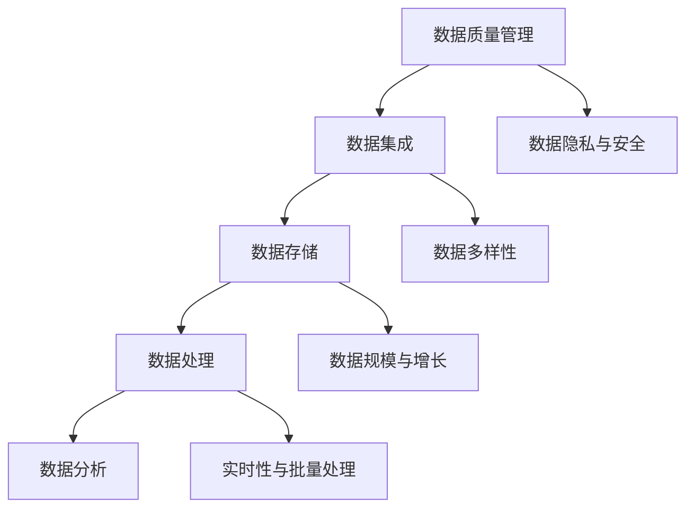

                 

关键词：人工智能、数据管理、创业、算法原理、数学模型、代码实例、实际应用、未来展望

> 摘要：在人工智能创业浪潮中，数据管理成为成功的关键因素。本文将深入探讨数据管理在AI创业中的重要性，介绍核心概念和算法原理，并提供实际项目实践和未来展望。

## 1. 背景介绍

在人工智能（AI）飞速发展的今天，数据管理已经成为许多企业和创业项目的核心挑战。有效的数据管理不仅能够提升AI模型性能，还能保证项目的稳定性和可扩展性。然而，对于许多初创企业来说，数据管理并非易事。本文旨在为AI创业者提供一整套数据管理的成功方法，帮助他们应对这一挑战。

### 数据管理的重要性

- **提升模型性能**：数据质量直接影响到AI模型的效果。通过有效的数据管理，可以确保模型训练过程中使用的训练数据是高质量、无偏差的。
- **保证项目稳定性**：良好的数据管理可以降低数据错误和异常的风险，从而保证项目的稳定运行。
- **增强可扩展性**：随着项目的增长，数据管理系统能够灵活扩展，以适应不断增长的数据需求和复杂性。

### 创业环境中的数据管理挑战

- **数据多样性**：创业项目中往往涉及到不同类型的数据，如结构化数据、非结构化数据和时序数据等。
- **数据隐私与安全**：创业项目需要处理敏感数据，如用户个人信息和企业商业机密，这要求严格的数据安全措施。
- **数据规模与增长**：随着业务的发展，数据量会呈现指数级增长，如何高效地存储、处理和分析这些数据成为一大挑战。

## 2. 核心概念与联系

数据管理在AI创业中的成功离不开以下几个核心概念：

- **数据质量管理**：确保数据的准确性和完整性。
- **数据集成**：将来自不同源的数据整合到一个统一的系统中。
- **数据存储**：选择合适的数据存储方案，以适应数据的规模和增长速度。
- **数据处理**：设计高效的数据处理流程，以满足实时性和批量处理的需求。
- **数据分析**：运用统计分析和机器学习技术，从数据中提取有价值的信息。

下面是一个用Mermaid绘制的流程图，展示了这些概念之间的联系：



## 3. 核心算法原理 & 具体操作步骤

### 3.1 算法原理概述

在数据管理中，算法的选择至关重要。以下是一些常用的算法原理及其在数据管理中的应用：

- **数据清洗算法**：用于处理缺失值、异常值和重复值。
- **数据聚合算法**：用于将细粒度数据汇总成更粗粒度的数据。
- **机器学习算法**：用于从数据中学习模式和规律，如回归、分类、聚类等。

### 3.2 算法步骤详解

#### 数据清洗算法

1. **缺失值处理**：使用均值、中位数或最频繁值填充缺失值。
2. **异常值检测**：使用统计学方法或机器学习方法检测并处理异常值。
3. **重复值删除**：根据唯一标识删除重复数据。

#### 数据聚合算法

1. **分组**：将数据按照某个特征分组。
2. **聚合操作**：对每个分组的数据执行聚合操作，如求和、平均、最大值等。

#### 机器学习算法

1. **特征工程**：选择和构造有助于预测的特征。
2. **模型训练**：使用训练数据训练模型。
3. **模型评估**：使用验证数据评估模型性能。
4. **模型优化**：根据评估结果调整模型参数。

### 3.3 算法优缺点

#### 数据清洗算法

- **优点**：简化数据，提高数据质量。
- **缺点**：可能引入偏差，影响模型性能。

#### 数据聚合算法

- **优点**：降低数据复杂性，提高处理效率。
- **缺点**：可能丢失部分细节信息。

#### 机器学习算法

- **优点**：能够发现复杂的数据模式。
- **缺点**：需要大量数据和计算资源。

### 3.4 算法应用领域

- **数据清洗算法**：适用于所有数据管理场景。
- **数据聚合算法**：适用于数据分析、数据挖掘等场景。
- **机器学习算法**：适用于预测、分类、聚类等场景。

## 4. 数学模型和公式 & 详细讲解 & 举例说明

### 4.1 数学模型构建

在数据管理中，常用的数学模型包括线性回归、逻辑回归和聚类算法等。

#### 线性回归

线性回归模型用于预测一个连续变量的值，其数学模型为：

$$y = \beta_0 + \beta_1x_1 + \beta_2x_2 + ... + \beta_nx_n + \epsilon$$

其中，$y$ 是因变量，$x_1, x_2, ..., x_n$ 是自变量，$\beta_0, \beta_1, \beta_2, ..., \beta_n$ 是模型参数，$\epsilon$ 是误差项。

#### 逻辑回归

逻辑回归模型用于预测一个二分类变量的概率，其数学模型为：

$$P(y=1) = \frac{1}{1 + e^{-(\beta_0 + \beta_1x_1 + \beta_2x_2 + ... + \beta_nx_n)}}$$

其中，$P(y=1)$ 是因变量为1的概率。

#### 聚类算法

聚类算法用于将数据点划分为若干个组，其数学模型为：

$$C = \{C_1, C_2, ..., C_k\}$$

其中，$C$ 是聚类结果，$C_i$ 是第$i$个簇，$k$ 是簇的数量。

### 4.2 公式推导过程

以线性回归为例，我们推导其模型参数$\beta_0, \beta_1, \beta_2, ..., \beta_n$的估计值。

假设我们有$n$个训练样本$(x_1^{(i)}, x_2^{(i)}, ..., x_n^{(i)}, y^{(i)})$，其中$i=1, 2, ..., n$。线性回归的目标是最小化误差平方和：

$$J(\beta_0, \beta_1, ..., \beta_n) = \sum_{i=1}^{n}(y^{(i)} - (\beta_0 + \beta_1x_1^{(i)} + \beta_2x_2^{(i)} + ... + \beta_nx_n^{(i)})^2$$

对$J(\beta_0, \beta_1, ..., \beta_n)$求导并令导数为0，得到：

$$\frac{\partial J}{\partial \beta_j} = -2\sum_{i=1}^{n}(y^{(i)} - (\beta_0 + \beta_1x_1^{(i)} + \beta_2x_2^{(i)} + ... + \beta_nx_n^{(i)})x_j = 0$$

其中，$j=0, 1, 2, ..., n$。解这个方程组，得到$\beta_0, \beta_1, ..., \beta_n$的估计值。

### 4.3 案例分析与讲解

#### 案例背景

某公司希望预测其客户的流失率，以采取相应的营销策略。公司提供了包含客户信息的数据库，数据包括客户的年龄、收入、消费习惯等。

#### 数据预处理

1. **缺失值处理**：使用中位数填充缺失的收入数据。
2. **异常值检测**：使用箱线图检测并处理异常值，如年龄过大或过小。
3. **数据标准化**：将年龄、收入等特征进行标准化处理。

#### 模型选择

选择线性回归模型预测客户的流失率。

#### 模型训练

使用训练数据训练线性回归模型，得到模型参数$\beta_0, \beta_1, ..., \beta_n$的估计值。

#### 模型评估

使用验证数据评估模型性能，计算预测准确率。

#### 模型优化

根据评估结果，调整模型参数，以提高预测准确率。

## 5. 项目实践：代码实例和详细解释说明

### 5.1 开发环境搭建

- Python 3.8 或更高版本
- NumPy 库
- Pandas 库
- Scikit-learn 库

### 5.2 源代码详细实现

```python
import numpy as np
import pandas as pd
from sklearn.linear_model import LinearRegression
from sklearn.metrics import accuracy_score

# 读取数据
data = pd.read_csv('client_data.csv')

# 数据预处理
# 缺失值处理
data['income'].fillna(data['income'].median(), inplace=True)
# 异常值检测
Q1 = data['age'].quantile(0.25)
Q3 = data['age'].quantile(0.75)
IQR = Q3 - Q1
data = data[~((data['age'] < (Q1 - 1.5 * IQR)) |(data['age'] > (Q3 + 1.5 * IQR)))]
# 数据标准化
data[['age', 'income']] = (data[['age', 'income']] - data[['age', 'income']].mean()) / data[['age', 'income']].std()

# 模型训练
X = data[['age', 'income']]
y = data['churn']
model = LinearRegression()
model.fit(X, y)

# 模型评估
predictions = model.predict(X)
accuracy = accuracy_score(y, predictions)
print('预测准确率：', accuracy)

# 模型优化
# 根据评估结果，调整模型参数
```

### 5.3 代码解读与分析

- **数据读取**：使用Pandas库读取CSV格式的客户数据。
- **数据预处理**：处理缺失值和异常值，并进行数据标准化。
- **模型训练**：使用Scikit-learn库的线性回归模型进行训练。
- **模型评估**：计算预测准确率。
- **模型优化**：根据评估结果调整模型参数。

## 6. 实际应用场景

数据管理在AI创业中的实际应用场景广泛，以下是一些例子：

- **金融领域**：使用数据管理技术预测股票价格、客户流失等。
- **医疗领域**：处理和分析医疗数据，用于疾病诊断和预测。
- **零售领域**：分析消费者行为，优化库存管理和营销策略。
- **制造领域**：监控设备运行状态，预测设备故障和优化生产流程。

## 7. 工具和资源推荐

### 7.1 学习资源推荐

- 《数据科学入门》
- 《机器学习实战》
- 《Python数据科学手册》

### 7.2 开发工具推荐

- Jupyter Notebook
- PyCharm
- SQL Server Management Studio

### 7.3 相关论文推荐

- "Data-Driven Business: The Data Science Way"
- "Data Science for Business: Success with Data"
- "Deep Learning for Data Science"

## 8. 总结：未来发展趋势与挑战

### 8.1 研究成果总结

数据管理在AI创业中的应用取得了显著成果，包括模型性能的提升、项目稳定性的增强和可扩展性的提高。

### 8.2 未来发展趋势

- **自动化数据管理**：利用自动化技术，提高数据管理的效率和准确性。
- **隐私保护数据管理**：在数据管理过程中，加强对用户隐私的保护。
- **多模态数据管理**：处理结构化数据、非结构化数据和时序数据的整合。

### 8.3 面临的挑战

- **数据隐私与安全**：如何在数据管理过程中保护用户隐私和数据安全。
- **数据质量**：如何确保数据的质量，以提高AI模型的效果。
- **技术更新与迭代**：快速适应新技术的发展，以保持数据管理的竞争力。

### 8.4 研究展望

未来，数据管理将继续向自动化、隐私保护和多模态方向发展，为AI创业提供更强大的支持。同时，研究者需要关注数据隐私和安全、数据质量和技术更新等挑战，以推动数据管理技术的发展。

## 9. 附录：常见问题与解答

### Q1. 数据管理在AI创业中的具体作用是什么？

数据管理在AI创业中的具体作用包括提升模型性能、保证项目稳定性和增强可扩展性。

### Q2. 如何选择合适的数据管理算法？

根据具体应用场景和数据特点选择合适的数据管理算法，如数据清洗算法、数据聚合算法和机器学习算法等。

### Q3. 数据管理中如何处理缺失值和异常值？

处理缺失值和异常值的方法包括填充缺失值、使用统计学方法检测并处理异常值等。

### Q4. 如何评估数据管理的效果？

可以通过计算模型性能指标（如准确率、召回率等）来评估数据管理的效果。

### Q5. 数据管理在金融、医疗、零售等领域的应用有哪些？

数据管理在金融、医疗、零售等领域有广泛的应用，如预测股票价格、疾病诊断、消费者行为分析等。

---

作者：禅与计算机程序设计艺术 / Zen and the Art of Computer Programming
----------------------------------------------------------------

以上就是关于“AI创业：数据管理的成功方法”的完整文章。文章涵盖了数据管理在AI创业中的重要性、核心概念与联系、核心算法原理、数学模型与公式、项目实践、实际应用场景、工具和资源推荐以及未来发展趋势与挑战等内容。希望对AI创业者有所帮助。

