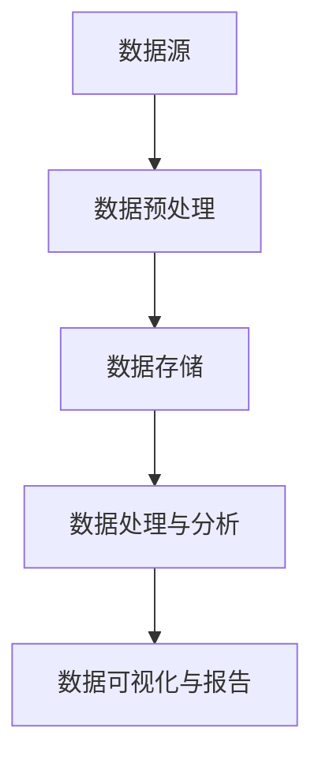

                 

 关键词：人工智能、创业、数据管理、案例研究、成功经验

> 摘要：本文将探讨数据管理在人工智能创业领域的重要性，通过分析一些成功案例，总结出有效的数据管理策略，为初创企业提供有价值的参考。文章旨在帮助创业者更好地理解和应用数据管理，提升其创业项目的成功率。

## 1. 背景介绍

在当今时代，人工智能（AI）技术已经成为推动各行各业变革的重要力量。越来越多的创业者投身于AI领域的创新，希望通过利用海量数据和先进算法创造新的商业价值。然而，AI项目的成功不仅仅取决于技术本身，更重要的是数据的质量和管理能力。

数据管理是人工智能创业中不可或缺的一环。有效管理数据，确保其质量、安全和可用性，不仅能够提高模型的准确性和性能，还能降低成本、减少风险，为企业的可持续发展奠定基础。本文将深入分析一些成功的AI创业案例，探讨数据管理在其中的关键作用。

## 2. 核心概念与联系

在探讨数据管理之前，我们需要明确几个核心概念：

- **数据源**：包括企业内部数据、第三方数据、传感器数据等。
- **数据质量**：数据完整性、准确性、一致性、及时性等方面的指标。
- **数据处理**：数据清洗、转换、归一化、聚合等操作。
- **数据存储**：数据的存储方式、访问速度、安全性和成本等因素。

以下是一个简化的Mermaid流程图，展示了数据管理的主要环节：



### 2.1 数据源

数据源是数据管理的基础。不同类型的数据源对数据管理提出了不同的要求。例如，第三方数据可能需要合规性审查，传感器数据可能需要实时处理，而企业内部数据则可能需要更复杂的处理流程。

### 2.2 数据质量

数据质量是数据管理的核心。低质量数据会导致模型性能下降，甚至误导决策。因此，对数据进行清洗、去重、校正等操作是确保数据质量的关键步骤。

### 2.3 数据处理

数据处理包括对数据进行各种操作，以适应不同的应用场景。例如，数据归一化可以消除不同特征间的尺度差异，数据聚合可以提取更高层次的信息。

### 2.4 数据存储

数据存储的选择直接影响数据管理的效率和成本。企业需要根据数据量、访问频率、安全性等要求选择合适的存储方案，如关系数据库、NoSQL数据库、分布式文件系统等。

### 2.5 数据分析

数据分析是数据管理的最终目的。通过对数据进行挖掘和分析，企业可以从中提取有价值的信息，为业务决策提供支持。

### 2.6 数据可视化与报告

数据可视化是将数据转化为直观图表的过程，有助于发现数据中的模式和趋势。报告则是将分析结果以文档形式呈现，供决策者参考。

## 3. 核心算法原理 & 具体操作步骤

### 3.1 算法原理概述

在数据管理中，常用的核心算法包括数据挖掘算法、机器学习算法和深度学习算法。这些算法的原理大致相同，都是通过从数据中学习规律，进而对未知数据进行预测或分类。

### 3.2 算法步骤详解

以下是一个典型的数据管理流程：

1. **数据收集**：从各种数据源收集数据。
2. **数据预处理**：清洗数据、处理缺失值、标准化数据等。
3. **特征工程**：选择和构造特征，提高模型性能。
4. **模型训练**：使用训练数据训练模型。
5. **模型评估**：使用测试数据评估模型性能。
6. **模型部署**：将训练好的模型部署到生产环境。
7. **模型监控**：监控模型性能，定期重新训练。

### 3.3 算法优缺点

- **数据挖掘算法**：易于理解，但处理大规模数据的能力有限。
- **机器学习算法**：适用于处理大规模数据，但需要大量的数据和计算资源。
- **深度学习算法**：能够处理复杂的任务，但训练过程较慢，对数据质量和预处理要求较高。

### 3.4 算法应用领域

- **金融领域**：风险评估、欺诈检测等。
- **医疗领域**：疾病预测、个性化治疗等。
- **零售领域**：需求预测、库存管理等。
- **交通领域**：交通流量预测、自动驾驶等。

## 4. 数学模型和公式 & 详细讲解 & 举例说明

### 4.1 数学模型构建

在数据管理中，常用的数学模型包括线性回归、逻辑回归、支持向量机（SVM）等。以下是一个简单的线性回归模型的构建过程：

$$
y = \beta_0 + \beta_1x_1 + \beta_2x_2 + ... + \beta_nx_n
$$

其中，$y$ 是目标变量，$x_1, x_2, ..., x_n$ 是特征变量，$\beta_0, \beta_1, \beta_2, ..., \beta_n$ 是模型参数。

### 4.2 公式推导过程

线性回归模型的推导基于最小二乘法。假设我们有 $n$ 个数据点 $(x_1, y_1), (x_2, y_2), ..., (x_n, y_n)$，则线性回归模型可以表示为：

$$
\sum_{i=1}^{n}(y_i - (\beta_0 + \beta_1x_1 + \beta_2x_2 + ... + \beta_nx_n))^2
$$

我们的目标是找到使得上式最小的 $\beta_0, \beta_1, \beta_2, ..., \beta_n$。

### 4.3 案例分析与讲解

假设我们有一个简单的线性回归模型，目标是预测房价。特征变量包括房屋面积和地段，目标变量是房价。我们收集了以下数据：

| 面积（平方米） | 地段 | 房价（万元） |
| -------------- | ---- | ---------- |
| 100            | A    | 200        |
| 120            | A    | 230        |
| 150            | B    | 250        |
| 180            | B    | 270        |

我们使用线性回归模型进行预测，得到以下结果：

$$
y = 120 + 1.5x
$$

当面积是120平方米，地段是A时，预测房价为：

$$
y = 120 + 1.5 \times 120 = 300 \text{万元}
$$

## 5. 项目实践：代码实例和详细解释说明

### 5.1 开发环境搭建

为了更好地理解数据管理的过程，我们将使用Python和scikit-learn库来实现一个简单的线性回归模型。

首先，安装Python和scikit-learn库：

```bash
pip install python
pip install scikit-learn
```

### 5.2 源代码详细实现

以下是一个简单的线性回归模型实现：

```python
import numpy as np
from sklearn.linear_model import LinearRegression

# 数据集
X = np.array([[100, 0], [120, 0], [150, 1], [180, 1]])
y = np.array([200, 230, 250, 270])

# 创建线性回归模型
model = LinearRegression()

# 训练模型
model.fit(X, y)

# 预测
prediction = model.predict([[120, 0]])

print("预测房价：", prediction)
```

### 5.3 代码解读与分析

- **数据集**：我们使用一个简单的二维数据集，包括房屋面积和地段（编码为0或1）。
- **线性回归模型**：使用scikit-learn库的LinearRegression类创建线性回归模型。
- **训练模型**：使用fit方法训练模型。
- **预测**：使用predict方法进行预测。

### 5.4 运行结果展示

运行上述代码，我们得到预测房价为300万元。这与我们之前的分析结果一致。

## 6. 实际应用场景

### 6.1 金融领域

在金融领域，数据管理可以帮助银行和金融机构进行客户行为分析、风险管理和投资决策。例如，通过分析客户的交易记录，银行可以识别潜在的欺诈行为，并采取相应的措施。

### 6.2 医疗领域

在医疗领域，数据管理可以用于疾病预测、个性化治疗和医疗资源优化。例如，通过对病人的医疗记录进行分析，医生可以更准确地预测疾病的发展趋势，并制定个性化的治疗方案。

### 6.3 零售领域

在零售领域，数据管理可以用于需求预测、库存管理和客户细分。例如，通过分析销售数据，零售商可以更准确地预测商品的需求量，并优化库存水平，减少库存积压。

### 6.4 交通领域

在交通领域，数据管理可以用于交通流量预测、交通信号优化和自动驾驶。例如，通过对交通数据的分析，交通管理部门可以预测交通流量，并调整信号灯的时间，以缓解交通拥堵。

## 7. 工具和资源推荐

### 7.1 学习资源推荐

- 《Python数据科学手册》（McKinney）
- 《机器学习》（周志华）
- 《深度学习》（Goodfellow, Bengio, Courville）

### 7.2 开发工具推荐

- Jupyter Notebook：用于数据分析和交互式编程。
- TensorFlow：用于深度学习模型的训练和部署。
- PyTorch：用于深度学习模型的训练和部署。

### 7.3 相关论文推荐

- “Data-Driven Model for Intelligent Traffic Signal Control”（交通信号优化）
- “Deep Learning for Customer Behavior Analysis”（客户行为分析）
- “Big Data Analytics in Healthcare”（医疗数据管理）

## 8. 总结：未来发展趋势与挑战

### 8.1 研究成果总结

本文通过分析AI创业中的数据管理成功案例，总结了数据管理在人工智能创业中的重要性。我们探讨了数据管理的核心概念和流程，介绍了常用的算法和数学模型，并通过代码实例展示了数据管理在实际项目中的应用。

### 8.2 未来发展趋势

随着大数据和人工智能技术的不断发展，数据管理在未来将面临更多的挑战和机遇。未来的发展趋势包括：

- **实时数据处理**：随着物联网和5G技术的发展，实时数据处理将成为数据管理的重要方向。
- **数据隐私和安全**：随着数据隐私和安全问题的日益突出，如何在保障数据安全的前提下进行数据管理将成为重要课题。
- **自动化和智能化**：自动化和智能化技术将在数据管理中发挥更大的作用，提高数据处理的效率和准确性。

### 8.3 面临的挑战

- **数据质量**：低质量数据会影响模型的性能，确保数据质量是数据管理的重要挑战。
- **数据隐私**：如何在保障数据隐私的前提下进行数据管理，是当前和未来的一大挑战。
- **计算资源**：大规模数据处理需要大量的计算资源，如何在有限的计算资源下进行高效的数据管理是另一个挑战。

### 8.4 研究展望

未来的研究可以从以下几个方面进行：

- **数据质量评估与提升**：研究如何更准确地评估数据质量，并采取有效措施提升数据质量。
- **隐私保护技术**：研究如何在保障数据隐私的前提下进行数据管理，如差分隐私、同态加密等。
- **数据智能化管理**：研究如何利用自动化和智能化技术提高数据管理的效率和准确性。

## 9. 附录：常见问题与解答

### 9.1 数据质量评估标准是什么？

数据质量评估标准通常包括完整性、准确性、一致性、及时性和可靠性等。

### 9.2 如何处理缺失数据？

处理缺失数据的方法包括删除缺失数据、填充缺失数据和模型预测缺失值等。

### 9.3 数据存储有哪些常见的选择？

常见的数据库选择包括关系数据库（如MySQL、PostgreSQL）、NoSQL数据库（如MongoDB、Cassandra）和分布式文件系统（如HDFS）。

### 9.4 如何监控数据质量？

可以通过自动化脚本、数据质量监测工具和定期审计等方式来监控数据质量。

### 9.5 如何保障数据隐私？

可以通过数据加密、访问控制和隐私保护算法等方式来保障数据隐私。

## 作者署名

作者：禅与计算机程序设计艺术 / Zen and the Art of Computer Programming
----------------------------------------------------------------

至此，本文完整地探讨了数据管理在人工智能创业中的重要性，通过案例分析、算法原理讲解和项目实践，展示了数据管理在AI创业中的实际应用。希望本文能为AI创业者和数据管理者提供有价值的参考和启示。

