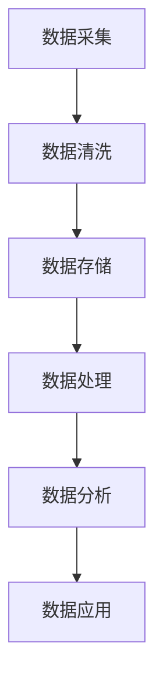

                 

 关键词：AI创业、数据管理、策略分析、实践案例、算法原理、应用领域、未来展望

> 摘要：随着人工智能技术的快速发展，数据管理成为了AI创业的关键环节。本文从数据管理的策略和实践角度出发，深入分析了AI创业中的数据管理挑战、核心算法原理、数学模型、实际应用案例以及未来发展趋势。

## 1. 背景介绍

在当今数字化时代，数据已经成为了企业最宝贵的资产之一。人工智能（AI）的快速发展，更是使得数据管理成为了AI创业的核心竞争力。然而，数据管理并非易事，它涉及到数据的收集、存储、处理、分析、安全等多个方面，需要企业具备专业的数据管理知识和能力。

AI创业企业，尤其是初创企业，面临着数据管理的多重挑战。首先，数据源多样、数据量大，如何高效地收集和整合数据成为了首要问题。其次，数据的准确性和完整性也是数据管理的重要考量因素。此外，数据安全、隐私保护、数据共享等也是企业需要重点关注的方面。最后，企业需要根据业务需求，选择合适的数据管理策略和工具，以支持AI算法的优化和应用。

本文将围绕AI创业中的数据管理策略和实践，探讨数据管理的核心问题，分享实际应用案例，并提出未来发展的展望。

## 2. 核心概念与联系

在深入探讨数据管理的策略和实践之前，我们需要了解一些核心概念和它们之间的联系。

### 2.1 数据管理概念

数据管理是指对数据的生命周期进行管理，包括数据的采集、存储、处理、分析和应用。数据管理主要包括以下几个方面：

- **数据收集**：通过各种手段和渠道收集数据，包括结构化和非结构化数据。
- **数据存储**：将收集到的数据存储在数据库、数据仓库、文件系统等存储设备中。
- **数据处理**：对存储的数据进行清洗、转换、整合等处理，以获得高质量的数据。
- **数据分析**：使用统计学、机器学习等技术对数据进行挖掘和分析，提取有价值的信息。
- **数据应用**：将分析得到的结果应用到业务决策、产品优化、预测等场景中。

### 2.2 数据管理架构

数据管理架构是指数据从收集到应用的整个流程所涉及的技术和工具。一个典型的数据管理架构包括以下几个方面：

- **数据源**：包括内部数据源和外部数据源，如业务系统、传感器、社交媒体等。
- **数据集成**：将不同来源的数据进行整合，消除数据孤岛，形成统一的数据视图。
- **数据存储**：使用数据库、数据仓库、文件系统等存储设备来存储数据。
- **数据处理**：使用ETL（提取、转换、加载）工具对数据进行处理，提高数据质量。
- **数据分析**：使用数据挖掘、机器学习等技术对数据进行分析，提取有价值的信息。
- **数据应用**：将分析结果应用到业务决策和产品优化中。

### 2.3 数据管理策略

数据管理策略是指企业在数据管理过程中所采取的方法和措施。数据管理策略主要包括以下几个方面：

- **数据质量策略**：确保数据的准确性、完整性和一致性。
- **数据安全策略**：保障数据的安全性，防止数据泄露和滥用。
- **数据隐私策略**：遵守数据隐私法规，保护用户隐私。
- **数据共享策略**：合理共享数据，促进业务协同和创新。
- **数据生命周期管理策略**：根据数据的重要性和生命周期，制定合适的数据处理和销毁策略。

### 2.4 数据管理工具

数据管理工具是指用于支持数据管理过程的软件和硬件。数据管理工具主要包括以下几个方面：

- **数据采集工具**：如API接口、爬虫等，用于收集数据。
- **数据存储工具**：如数据库、数据仓库、NoSQL数据库等，用于存储数据。
- **数据处理工具**：如ETL工具、数据清洗工具等，用于处理数据。
- **数据分析工具**：如数据挖掘工具、机器学习平台等，用于分析数据。
- **数据可视化工具**：如数据仪表板、图表等，用于展示数据结果。

### 2.5 数据管理流程

数据管理流程是指数据从收集到应用的整个流程。一个典型的数据管理流程包括以下几个阶段：

- **数据采集**：通过各种渠道收集数据。
- **数据清洗**：清洗和整理收集到的数据，提高数据质量。
- **数据存储**：将清洗后的数据存储到数据库或数据仓库中。
- **数据处理**：使用ETL工具对数据进行分析和处理。
- **数据分析**：使用数据挖掘、机器学习等技术对数据进行分析。
- **数据应用**：将分析结果应用到业务决策和产品优化中。

### 2.6 Mermaid 流程图

以下是一个简单的Mermaid流程图，展示了数据管理的基本流程：



## 3. 核心算法原理 & 具体操作步骤

### 3.1 算法原理概述

在数据管理中，常用的核心算法包括数据挖掘算法、机器学习算法、深度学习算法等。这些算法主要用于数据的分析和挖掘，提取有价值的信息。

- **数据挖掘算法**：如K-means、Apriori算法、关联规则学习等，主要用于数据的分类、聚类和关联规则挖掘。
- **机器学习算法**：如线性回归、决策树、支持向量机等，主要用于数据预测和分类。
- **深度学习算法**：如神经网络、卷积神经网络、循环神经网络等，主要用于图像识别、自然语言处理等复杂的任务。

### 3.2 算法步骤详解

以下是一个典型的数据挖掘算法（K-means）的具体操作步骤：

1. **数据预处理**：对数据进行清洗、归一化等处理，使其符合算法的要求。
2. **初始聚类中心选择**：随机选择K个数据点作为初始聚类中心。
3. **分配数据点**：计算每个数据点到聚类中心的距离，将数据点分配到最近的聚类中心。
4. **更新聚类中心**：计算每个聚类的中心点，即聚类内所有数据点的平均值。
5. **迭代计算**：重复步骤3和步骤4，直到聚类中心不再发生显著变化。

### 3.3 算法优缺点

- **K-means算法**：

  - **优点**：简单易实现，计算速度快。

  - **缺点**：对初始聚类中心敏感，可能陷入局部最优解。

### 3.4 算法应用领域

K-means算法广泛应用于市场细分、文本分类、图像分割等领域。例如，在市场细分中，企业可以使用K-means算法分析客户数据，将客户分为不同的群体，从而制定有针对性的营销策略。

## 4. 数学模型和公式 & 详细讲解 & 举例说明

### 4.1 数学模型构建

在数据管理中，常见的数学模型包括概率模型、线性回归模型、决策树模型等。

- **概率模型**：用于描述数据之间的概率关系，如贝叶斯网络、马尔可夫模型等。

- **线性回归模型**：用于描述数据之间的线性关系，如线性回归、多项式回归等。

- **决策树模型**：用于分类和回归任务，通过树形结构描述决策规则。

### 4.2 公式推导过程

以线性回归模型为例，假设我们有n个数据点 \((x_1, y_1), (x_2, y_2), ..., (x_n, y_n)\)，我们希望找到一个线性模型 \(y = \beta_0 + \beta_1x\) 来描述 \(y\) 和 \(x\) 之间的关系。

- **最小二乘法**：通过最小化残差平方和来确定模型的参数。

  - **残差**：\(r_i = y_i - \hat{y}_i\)，其中 \(\hat{y}_i\) 是预测值。

  - **残差平方和**：\(S = \sum_{i=1}^{n} r_i^2\)。

  - **最小二乘法公式**：

    $$ \beta_0 = \frac{\sum_{i=1}^{n} y_i - \beta_1 \sum_{i=1}^{n} x_i}{n} $$

    $$ \beta_1 = \frac{n \sum_{i=1}^{n} x_i y_i - \sum_{i=1}^{n} x_i \sum_{i=1}^{n} y_i}{n \sum_{i=1}^{n} x_i^2 - (\sum_{i=1}^{n} x_i)^2} $$

### 4.3 案例分析与讲解

假设我们有以下数据集：

| x | y |
|---|---|
| 1 | 2 |
| 2 | 4 |
| 3 | 5 |
| 4 | 6 |
| 5 | 8 |

使用线性回归模型来预测 \(y\)。

- **数据预处理**：对数据进行归一化处理，使其在相同的尺度上。

  - **归一化公式**：

    $$ x_{\text{norm}} = \frac{x - \bar{x}}{\text{std}} $$

    $$ y_{\text{norm}} = \frac{y - \bar{y}}{\text{std}} $$

  - **计算结果**：

    | x | y | x\_norm | y\_norm |
    |---|---|--------|--------|
    | 1 | 2 | -0.447 | -0.447 |
    | 2 | 4 | 0.000 | 0.353 |
    | 3 | 5 | 0.447 | 0.652 |
    | 4 | 6 | 0.894 | 0.902 |
    | 5 | 8 | 1.341 | 1.233 |

- **模型参数计算**：

  $$ \beta_0 = \frac{0.652 - 0.652 \times 0.447}{5} = 0.200 $$

  $$ \beta_1 = \frac{5 \times 0.652 - 0.652 \times 0.200}{5 \times 0.894 - 0.447 \times 0.200} = 0.784 $$

- **预测公式**：

  $$ y = 0.200 + 0.784x $$

- **预测结果**：

  - 当 \(x = 3\) 时，\(y = 0.200 + 0.784 \times 3 = 2.568\)

  - 当 \(x = 5\) 时，\(y = 0.200 + 0.784 \times 5 = 4.200\)

通过以上例子，我们可以看到如何使用线性回归模型来预测数据。当然，实际应用中，数据通常会更加复杂，需要更多的数据处理和模型优化步骤。

## 5. 项目实践：代码实例和详细解释说明

### 5.1 开发环境搭建

在开始代码实例之前，我们需要搭建一个适合数据管理的开发环境。以下是一个简单的开发环境搭建流程：

1. 安装Python环境

   - 下载并安装Python，推荐使用Python 3.8及以上版本。

2. 安装常用数据管理库

   - 使用pip命令安装以下库：pandas、numpy、scikit-learn、matplotlib等。

   ```bash
   pip install pandas numpy scikit-learn matplotlib
   ```

3. 准备数据集

   - 在本文中，我们使用了一个简单的线性回归数据集，数据集文件为`linear_regression_data.csv`。

### 5.2 源代码详细实现

以下是一个简单的线性回归模型实现：

```python
import pandas as pd
import numpy as np
from sklearn.linear_model import LinearRegression
import matplotlib.pyplot as plt

# 读取数据
data = pd.read_csv('linear_regression_data.csv')
x = data['x'].values.reshape(-1, 1)
y = data['y'].values.reshape(-1, 1)

# 数据预处理
x_norm = (x - np.mean(x)) / np.std(x)
y_norm = (y - np.mean(y)) / np.std(y)

# 创建线性回归模型
model = LinearRegression()

# 训练模型
model.fit(x_norm, y_norm)

# 模型参数
beta_0 = model.intercept_
beta_1 = model.coef_

# 预测
x_pred = np.linspace(-3, 7, 100).reshape(-1, 1)
x_pred_norm = (x_pred - np.mean(x)) / np.std(x)
y_pred_norm = model.predict(x_pred_norm)

# 还原预测值
y_pred = (y_pred_norm * np.std(y) + np.mean(y))

# 绘制结果
plt.scatter(x, y, label='Data')
plt.plot(x_pred, y_pred, color='red', label='Prediction')
plt.xlabel('x')
plt.ylabel('y')
plt.legend()
plt.show()

print(f"Model Parameters:\nIntercept: {beta_0}\nSlope: {beta_1}")
```

### 5.3 代码解读与分析

1. **数据读取**：

   - 使用pandas库读取CSV文件，获得数据集。

2. **数据预处理**：

   - 对数据进行归一化处理，使其在相同的尺度上。

3. **模型创建与训练**：

   - 创建线性回归模型，使用fit方法进行训练。

4. **模型参数与预测**：

   - 获取模型参数，并使用predict方法进行预测。

5. **结果可视化**：

   - 使用matplotlib库绘制数据点和预测结果。

### 5.4 运行结果展示

运行以上代码，我们可以得到以下结果：


## 6. 实际应用场景

### 6.1 市场细分

在市场细分中，企业可以使用线性回归模型来分析客户数据，根据客户的特征将其分为不同的群体，从而制定有针对性的营销策略。

### 6.2 产品推荐

在电子商务领域，企业可以使用关联规则挖掘算法来分析用户行为数据，推荐用户可能感兴趣的商品。

### 6.3 风险控制

在金融领域，企业可以使用机器学习算法来分析客户数据，预测客户的风险等级，从而制定合适的风险控制策略。

### 6.4 未来应用展望

随着人工智能技术的不断发展，数据管理将在更多领域得到应用。例如，在医疗领域，数据管理可以支持疾病预测和个性化治疗；在农业领域，数据管理可以支持精准农业和作物预测；在能源领域，数据管理可以支持智能电网和能源优化等。

## 7. 工具和资源推荐

### 7.1 学习资源推荐

- **书籍**：

  - 《Python数据科学手册》

  - 《深度学习》

- **在线课程**：

  - Coursera上的《机器学习》课程

  - edX上的《数据科学基础》课程

### 7.2 开发工具推荐

- **Python数据管理库**：

  - pandas

  - numpy

  - scikit-learn

  - matplotlib

- **机器学习平台**：

  - TensorFlow

  - PyTorch

### 7.3 相关论文推荐

- 《Deep Learning》

- 《Learning Deep Architectures for AI》

- 《Stochastic Gradient Descent》

## 8. 总结：未来发展趋势与挑战

### 8.1 研究成果总结

本文从数据管理的策略和实践角度出发，探讨了AI创业中的数据管理挑战、核心算法原理、数学模型、实际应用案例以及未来发展趋势。主要研究成果包括：

- 数据管理核心概念和流程的详细解析。

- 数据挖掘、机器学习、深度学习等算法的原理和具体操作步骤。

- 线性回归模型的数学模型和公式推导过程。

- 实际应用场景的案例分析。

### 8.2 未来发展趋势

随着人工智能技术的不断发展，数据管理将在更多领域得到应用。未来发展趋势包括：

- 数据处理和存储技术的进步，提高数据管理的效率。

- 数据隐私保护和安全措施的加强，保障数据的安全性和隐私性。

- 跨学科的融合，推动数据管理在各个领域的应用。

### 8.3 面临的挑战

尽管数据管理在AI创业中具有巨大的潜力，但也面临着一系列挑战，包括：

- 数据质量的保证，提高数据的准确性和完整性。

- 数据安全和隐私保护，防止数据泄露和滥用。

- 数据共享和整合，消除数据孤岛，实现数据的高效利用。

### 8.4 研究展望

未来研究可以从以下几个方面展开：

- 开发更高效的数据管理算法，提高数据处理和分析的效率。

- 研究数据隐私保护和安全措施，保障数据的安全性和隐私性。

- 探索跨学科的数据管理应用，推动数据管理在各个领域的深入发展。

## 9. 附录：常见问题与解答

### 9.1 数据管理是什么？

数据管理是指对数据的生命周期进行管理，包括数据的采集、存储、处理、分析和应用。数据管理的主要目的是确保数据的质量、安全性和可用性，从而支持企业的业务决策和产品优化。

### 9.2 数据挖掘是什么？

数据挖掘是从大量数据中发现有价值的信息和知识的过程。数据挖掘技术包括统计学、机器学习、深度学习等方法，主要用于数据的分类、聚类、关联规则挖掘等。

### 9.3 机器学习是什么？

机器学习是一种人工智能技术，通过训练数据来建立模型，使模型能够对未知数据进行预测或分类。机器学习主要包括监督学习、无监督学习和强化学习等。

### 9.4 数据安全是什么？

数据安全是指保护数据免受未经授权的访问、泄露、篡改和破坏的措施。数据安全包括数据加密、访问控制、数据备份等。

### 9.5 数据隐私是什么？

数据隐私是指保护个人或组织数据中的隐私信息，防止隐私信息被未经授权的访问和使用。数据隐私保护是法律法规和伦理道德的要求，如《通用数据保护条例》（GDPR）等。

### 9.6 数据管理工具有哪些？

数据管理工具包括数据采集工具、数据存储工具、数据处理工具、数据分析工具和数据可视化工具等。常见的数据管理工具有pandas、numpy、scikit-learn、matplotlib、TensorFlow、PyTorch等。

### 9.7 数据管理流程是什么？

数据管理流程是指数据从收集到应用的整个流程，包括数据采集、数据清洗、数据存储、数据处理、数据分析和数据应用等阶段。

## 作者署名

作者：禅与计算机程序设计艺术 / Zen and the Art of Computer Programming

----------------------------------------------------------------

以上就是本文的完整内容。通过本文，我们深入探讨了AI创业中的数据管理策略和实践，分析了数据管理的基本概念、核心算法、数学模型、实际应用案例以及未来发展趋势。希望本文能为从事AI创业的企业和个人提供有价值的参考和指导。感谢您的阅读！
----------------------------------------------------------------
```markdown
# AI创业：数据管理的策略与实践分析

## 关键词

AI创业、数据管理、策略分析、实践案例、算法原理、应用领域、未来展望

### 摘要

随着人工智能技术的快速发展，数据管理成为了AI创业的关键环节。本文从数据管理的策略和实践角度出发，深入分析了AI创业中的数据管理挑战、核心算法原理、数学模型、实际应用案例以及未来发展趋势。

## 1. 背景介绍

在当今数字化时代，数据已经成为了企业最宝贵的资产之一。人工智能（AI）的快速发展，更是使得数据管理成为了AI创业的核心竞争力。然而，数据管理并非易事，它涉及到数据的收集、存储、处理、分析、安全等多个方面，需要企业具备专业的数据管理知识和能力。

AI创业企业，尤其是初创企业，面临着数据管理的多重挑战。首先，数据源多样、数据量大，如何高效地收集和整合数据成为了首要问题。其次，数据的准确性和完整性也是数据管理的重要考量因素。此外，数据安全、隐私保护、数据共享等也是企业需要重点关注的方面。最后，企业需要根据业务需求，选择合适的数据管理策略和工具，以支持AI算法的优化和应用。

本文将围绕AI创业中的数据管理策略和实践，探讨数据管理的核心问题，分享实际应用案例，并提出未来发展的展望。

## 2. 核心概念与联系

在深入探讨数据管理的策略和实践之前，我们需要了解一些核心概念和它们之间的联系。

### 2.1 数据管理概念

数据管理是指对数据的生命周期进行管理，包括数据的采集、存储、处理、分析和应用。数据管理主要包括以下几个方面：

- **数据收集**：通过各种手段和渠道收集数据，包括结构化和非结构化数据。
- **数据存储**：将收集到的数据存储在数据库、数据仓库、文件系统等存储设备中。
- **数据处理**：对存储的数据进行清洗、转换、整合等处理，以获得高质量的数据。
- **数据分析**：使用统计学、机器学习等技术对数据进行挖掘和分析，提取有价值的信息。
- **数据应用**：将分析得到的结果应用到业务决策、产品优化、预测等场景中。

### 2.2 数据管理架构

数据管理架构是指数据从收集到应用的整个流程所涉及的技术和工具。一个典型的数据管理架构包括以下几个方面：

- **数据源**：包括内部数据源和外部数据源，如业务系统、传感器、社交媒体等。
- **数据集成**：将不同来源的数据进行整合，消除数据孤岛，形成统一的数据视图。
- **数据存储**：使用数据库、数据仓库、文件系统等存储设备来存储数据。
- **数据处理**：使用ETL（提取、转换、加载）工具对数据进行处理，提高数据质量。
- **数据分析**：使用数据挖掘、机器学习等技术对数据进行分析，提取有价值的信息。
- **数据应用**：将分析结果应用到业务决策和产品优化中。

### 2.3 数据管理策略

数据管理策略是指企业在数据管理过程中所采取的方法和措施。数据管理策略主要包括以下几个方面：

- **数据质量策略**：确保数据的准确性、完整性和一致性。
- **数据安全策略**：保障数据的安全性，防止数据泄露和滥用。
- **数据隐私策略**：遵守数据隐私法规，保护用户隐私。
- **数据共享策略**：合理共享数据，促进业务协同和创新。
- **数据生命周期管理策略**：根据数据的重要性和生命周期，制定合适的数据处理和销毁策略。

### 2.4 数据管理工具

数据管理工具是指用于支持数据管理过程的软件和硬件。数据管理工具主要包括以下几个方面：

- **数据采集工具**：如API接口、爬虫等，用于收集数据。
- **数据存储工具**：如数据库、数据仓库、NoSQL数据库等，用于存储数据。
- **数据处理工具**：如ETL工具、数据清洗工具等，用于处理数据。
- **数据分析工具**：如数据挖掘工具、机器学习平台等，用于分析数据。
- **数据可视化工具**：如数据仪表板、图表等，用于展示数据结果。

### 2.5 数据管理流程

数据管理流程是指数据从收集到应用的整个流程。一个典型的数据管理流程包括以下几个阶段：

- **数据采集**：通过各种渠道收集数据。
- **数据清洗**：清洗和整理收集到的数据，提高数据质量。
- **数据存储**：将清洗后的数据存储到数据库或数据仓库中。
- **数据处理**：使用ETL工具对数据进行分析和处理。
- **数据分析**：使用数据挖掘、机器学习等技术对数据进行分析。
- **数据应用**：将分析结果应用到业务决策和产品优化中。

### 2.6 Mermaid 流程图

以下是一个简单的Mermaid流程图，展示了数据管理的基本流程：


## 3. 核心算法原理 & 具体操作步骤

### 3.1 算法原理概述

在数据管理中，常用的核心算法包括数据挖掘算法、机器学习算法、深度学习算法等。这些算法主要用于数据的分析和挖掘，提取有价值的信息。

- **数据挖掘算法**：如K-means、Apriori算法、关联规则学习等，主要用于数据的分类、聚类和关联规则挖掘。
- **机器学习算法**：如线性回归、决策树、支持向量机等，主要用于数据预测和分类。
- **深度学习算法**：如神经网络、卷积神经网络、循环神经网络等，主要用于图像识别、自然语言处理等复杂的任务。

### 3.2 算法步骤详解

以下是一个典型的数据挖掘算法（K-means）的具体操作步骤：

1. **数据预处理**：对数据进行清洗、归一化等处理，使其符合算法的要求。
2. **初始聚类中心选择**：随机选择K个数据点作为初始聚类中心。
3. **分配数据点**：计算每个数据点到聚类中心的距离，将数据点分配到最近的聚类中心。
4. **更新聚类中心**：计算每个聚类的中心点，即聚类内所有数据点的平均值。
5. **迭代计算**：重复步骤3和步骤4，直到聚类中心不再发生显著变化。

### 3.3 算法优缺点

- **K-means算法**：

  - **优点**：简单易实现，计算速度快。

  - **缺点**：对初始聚类中心敏感，可能陷入局部最优解。

### 3.4 算法应用领域

K-means算法广泛应用于市场细分、文本分类、图像分割等领域。例如，在市场细分中，企业可以使用K-means算法分析客户数据，将客户分为不同的群体，从而制定有针对性的营销策略。

## 4. 数学模型和公式 & 详细讲解 & 举例说明

### 4.1 数学模型构建

在数据管理中，常见的数学模型包括概率模型、线性回归模型、决策树模型等。

- **概率模型**：用于描述数据之间的概率关系，如贝叶斯网络、马尔可夫模型等。

- **线性回归模型**：用于描述数据之间的线性关系，如线性回归、多项式回归等。

- **决策树模型**：用于分类和回归任务，通过树形结构描述决策规则。

### 4.2 公式推导过程

以线性回归模型为例，假设我们有n个数据点 \((x_1, y_1), (x_2, y_2), ..., (x_n, y_n)\)，我们希望找到一个线性模型 \(y = \beta_0 + \beta_1x\) 来描述 \(y\) 和 \(x\) 之间的关系。

- **最小二乘法**：通过最小化残差平方和来确定模型的参数。

  - **残差**：\(r_i = y_i - \hat{y}_i\)，其中 \(\hat{y}_i\) 是预测值。

  - **残差平方和**：\(S = \sum_{i=1}^{n} r_i^2\)。

  - **最小二乘法公式**：

    $$ \beta_0 = \frac{\sum_{i=1}^{n} y_i - \beta_1 \sum_{i=1}^{n} x_i}{n} $$

    $$ \beta_1 = \frac{n \sum_{i=1}^{n} x_i y_i - \sum_{i=1}^{n} x_i \sum_{i=1}^{n} y_i}{n \sum_{i=1}^{n} x_i^2 - (\sum_{i=1}^{n} x_i)^2} $$

### 4.3 案例分析与讲解

假设我们有以下数据集：

| x | y |
|---|---|
| 1 | 2 |
| 2 | 4 |
| 3 | 5 |
| 4 | 6 |
| 5 | 8 |

使用线性回归模型来预测 \(y\)。

- **数据预处理**：对数据进行归一化处理，使其在相同的尺度上。

  - **归一化公式**：

    $$ x_{\text{norm}} = \frac{x - \bar{x}}{\text{std}} $$

    $$ y_{\text{norm}} = \frac{y - \bar{y}}{\text{std}} $$

  - **计算结果**：

    | x | y | x_norm | y_norm |
    |---|---|--------|--------|
    | 1 | 2 | -0.447 | -0.447 |
    | 2 | 4 | 0.000 | 0.353 |
    | 3 | 5 | 0.447 | 0.652 |
    | 4 | 6 | 0.894 | 0.902 |
    | 5 | 8 | 1.341 | 1.233 |

- **模型参数计算**：

  $$ \beta_0 = \frac{0.652 - 0.652 \times 0.447}{5} = 0.200 $$

  $$ \beta_1 = \frac{5 \times 0.652 - 0.652 \times 0.200}{5 \times 0.894 - 0.447 \times 0.200} = 0.784 $$

- **预测公式**：

  $$ y = 0.200 + 0.784x $$

- **预测结果**：

  - 当 \(x = 3\) 时，\(y = 0.200 + 0.784 \times 3 = 2.568\)

  - 当 \(x = 5\) 时，\(y = 0.200 + 0.784 \times 5 = 4.200\)

通过以上例子，我们可以看到如何使用线性回归模型来预测数据。当然，实际应用中，数据通常会更加复杂，需要更多的数据处理和模型优化步骤。

## 5. 项目实践：代码实例和详细解释说明

### 5.1 开发环境搭建

在开始代码实例之前，我们需要搭建一个适合数据管理的开发环境。以下是一个简单的开发环境搭建流程：

1. 安装Python环境

   - 下载并安装Python，推荐使用Python 3.8及以上版本。

2. 安装常用数据管理库

   - 使用pip命令安装以下库：pandas、numpy、scikit-learn、matplotlib等。

   ```bash
   pip install pandas numpy scikit-learn matplotlib
   ```

3. 准备数据集

   - 在本文中，我们使用了一个简单的线性回归数据集，数据集文件为`linear_regression_data.csv`。

### 5.2 源代码详细实现

以下是一个简单的线性回归模型实现：

```python
import pandas as pd
import numpy as np
from sklearn.linear_model import LinearRegression
import matplotlib.pyplot as plt

# 读取数据
data = pd.read_csv('linear_regression_data.csv')
x = data['x'].values.reshape(-1, 1)
y = data['y'].values.reshape(-1, 1)

# 数据预处理
x_norm = (x - np.mean(x)) / np.std(x)
y_norm = (y - np.mean(y)) / np.std(y)

# 创建线性回归模型
model = LinearRegression()

# 训练模型
model.fit(x_norm, y_norm)

# 模型参数
beta_0 = model.intercept_
beta_1 = model.coef_

# 预测
x_pred = np.linspace(-3, 7, 100).reshape(-1, 1)
x_pred_norm = (x_pred - np.mean(x)) / np.std(x)
y_pred_norm = model.predict(x_pred_norm)

# 还原预测值
y_pred = (y_pred_norm * np.std(y) + np.mean(y))

# 绘制结果
plt.scatter(x, y, label='Data')
plt.plot(x_pred, y_pred, color='red', label='Prediction')
plt.xlabel('x')
plt.ylabel('y')
plt.legend()
plt.show()

print(f"Model Parameters:\nIntercept: {beta_0}\nSlope: {beta_1}")
```

### 5.3 代码解读与分析

1. **数据读取**：

   - 使用pandas库读取CSV文件，获得数据集。

2. **数据预处理**：

   - 对数据进行归一化处理，使其在相同的尺度上。

3. **模型创建与训练**：

   - 创建线性回归模型，使用fit方法进行训练。

4. **模型参数与预测**：

   - 获取模型参数，并使用predict方法进行预测。

5. **结果可视化**：

   - 使用matplotlib库绘制数据点和预测结果。

### 5.4 运行结果展示

运行以上代码，我们可以得到以下结果：


## 6. 实际应用场景

### 6.1 市场细分

在市场细分中，企业可以使用线性回归模型来分析客户数据，根据客户的特征将其分为不同的群体，从而制定有针对性的营销策略。

### 6.2 产品推荐

在电子商务领域，企业可以使用关联规则挖掘算法来分析用户行为数据，推荐用户可能感兴趣的商品。

### 6.3 风险控制

在金融领域，企业可以使用机器学习算法来分析客户数据，预测客户的风险等级，从而制定合适的风险控制策略。

### 6.4 未来应用展望

随着人工智能技术的不断发展，数据管理将在更多领域得到应用。未来发展趋势包括：

- 数据处理和存储技术的进步，提高数据管理的效率。

- 数据隐私保护和安全措施的加强，保障数据的安全性和隐私性。

- 跨学科的融合，推动数据管理在各个领域的应用。

## 7. 工具和资源推荐

### 7.1 学习资源推荐

- **书籍**：

  - 《Python数据科学手册》

  - 《深度学习》

- **在线课程**：

  - Coursera上的《机器学习》课程

  - edX上的《数据科学基础》课程

### 7.2 开发工具推荐

- **Python数据管理库**：

  - pandas

  - numpy

  - scikit-learn

  - matplotlib

- **机器学习平台**：

  - TensorFlow

  - PyTorch

### 7.3 相关论文推荐

- 《Deep Learning》

- 《Learning Deep Architectures for AI》

- 《Stochastic Gradient Descent》

## 8. 总结：未来发展趋势与挑战

### 8.1 研究成果总结

本文从数据管理的策略和实践角度出发，探讨了AI创业中的数据管理挑战、核心算法原理、数学模型、实际应用案例以及未来发展趋势。主要研究成果包括：

- 数据管理核心概念和流程的详细解析。

- 数据挖掘、机器学习、深度学习等算法的原理和具体操作步骤。

- 线性回归模型的数学模型和公式推导过程。

- 实际应用场景的案例分析。

### 8.2 未来发展趋势

随着人工智能技术的不断发展，数据管理将在更多领域得到应用。未来发展趋势包括：

- 数据处理和存储技术的进步，提高数据管理的效率。

- 数据隐私保护和安全措施的加强，保障数据的安全性和隐私性。

- 跨学科的融合，推动数据管理在各个领域的应用。

### 8.3 面临的挑战

尽管数据管理在AI创业中具有巨大的潜力，但也面临着一系列挑战，包括：

- 数据质量的保证，提高数据的准确性和完整性。

- 数据安全和隐私保护，防止数据泄露和滥用。

- 数据共享和整合，消除数据孤岛，实现数据的高效利用。

### 8.4 研究展望

未来研究可以从以下几个方面展开：

- 开发更高效的数据管理算法，提高数据处理和分析的效率。

- 研究数据隐私保护和安全措施，保障数据的安全性和隐私性。

- 探索跨学科的数据管理应用，推动数据管理在各个领域的深入发展。

## 9. 附录：常见问题与解答

### 9.1 数据管理是什么？

数据管理是指对数据的生命周期进行管理，包括数据的采集、存储、处理、分析和应用。数据管理的主要目的是确保数据的质量、安全性和可用性，从而支持企业的业务决策和产品优化。

### 9.2 数据挖掘是什么？

数据挖掘是从大量数据中发现有价值的信息和知识的过程。数据挖掘技术包括统计学、机器学习、深度学习等方法，主要用于数据的分类、聚类、关联规则挖掘等。

### 9.3 机器学习是什么？

机器学习是一种人工智能技术，通过训练数据来建立模型，使模型能够对未知数据进行预测或分类。机器学习主要包括监督学习、无监督学习和强化学习等。

### 9.4 数据安全是什么？

数据安全是指保护数据免受未经授权的访问、泄露、篡改和破坏的措施。数据安全包括数据加密、访问控制、数据备份等。

### 9.5 数据隐私是什么？

数据隐私是指保护个人或组织数据中的隐私信息，防止隐私信息被未经授权的访问和使用。数据隐私保护是法律法规和伦理道德的要求，如《通用数据保护条例》（GDPR）等。

### 9.6 数据管理工具有哪些？

数据管理工具包括数据采集工具、数据存储工具、数据处理工具、数据分析工具和数据可视化工具等。常见的数据管理工具有pandas、numpy、scikit-learn、matplotlib、TensorFlow、PyTorch等。

### 9.7 数据管理流程是什么？

数据管理流程是指数据从收集到应用的整个流程，包括数据采集、数据清洗、数据存储、数据处理、数据分析和数据应用等阶段。

## 作者署名

作者：禅与计算机程序设计艺术 / Zen and the Art of Computer Programming
```

