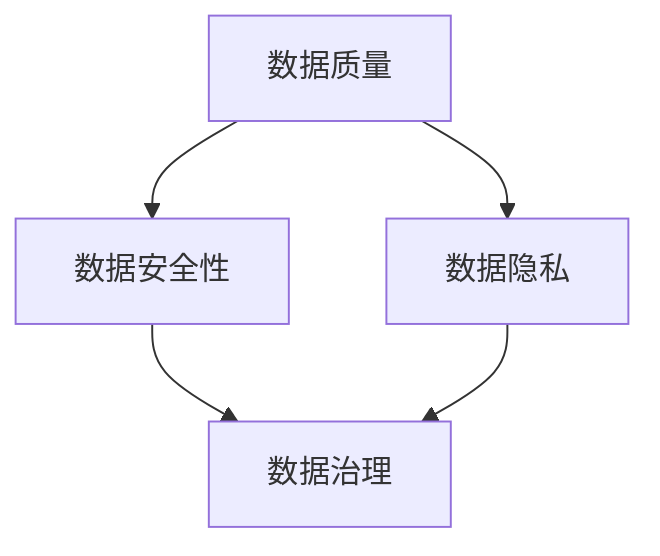

                 

关键词：AI创业、数据管理、策略、工具、分析、探讨

> 摘要：本文将深入探讨AI创业过程中数据管理的策略与工具。首先，我们将介绍数据管理在AI创业中的重要性，并讨论数据质量、数据安全性和数据隐私等相关概念。随后，我们将分析各种数据管理策略，包括数据集成、数据存储和数据清洗等。接着，我们将介绍一些常用的数据管理工具和技术，如Hadoop、Spark和数据库管理系统。最后，我们将探讨数据管理在AI创业中的实际应用，并展望其未来发展趋势和面临的挑战。

## 1. 背景介绍

随着人工智能技术的迅速发展，AI创业成为了一个热门领域。在AI创业中，数据管理发挥着至关重要的作用。数据不仅是AI模型训练的基础，也是企业决策的重要依据。然而，数据管理并非易事，它涉及到数据质量、数据安全性和数据隐私等多个方面。因此，本文将着重探讨数据管理的策略与工具，以帮助AI创业者更好地应对数据管理挑战。

### 数据管理的重要性

数据管理是AI创业的基石。以下是数据管理在AI创业中的一些关键作用：

1. **数据质量**：高质量的数据是训练强大AI模型的前提。数据质量差会导致模型性能下降，甚至得出错误的结论。
2. **数据安全性**：保护数据免受未经授权的访问、泄露和破坏，对于维护企业信誉和客户信任至关重要。
3. **数据隐私**：遵守数据隐私法规，如GDPR和CCPA，是企业在全球范围内运营的必要条件。

### 数据管理相关概念

以下是数据管理中的一些关键概念：

1. **数据集成**：将来自不同来源的数据合并为一个统一的数据视图。
2. **数据存储**：选择合适的存储方案来存储和管理数据。
3. **数据清洗**：识别和纠正数据中的错误和不一致性。
4. **数据治理**：制定和执行数据管理策略和流程，确保数据的质量和安全性。

## 2. 核心概念与联系

为了更好地理解数据管理在AI创业中的重要性，我们首先需要了解一些核心概念，并展示它们之间的关系。

### 核心概念

1. **数据质量**：数据质量是指数据满足特定业务需求的能力。它包括数据的完整性、准确性、一致性、及时性和可靠性。
2. **数据安全性**：数据安全性是指保护数据免受未经授权的访问、泄露和破坏的措施。
3. **数据隐私**：数据隐私是指保护个人和敏感信息的权利，确保数据不被未经授权的第三方访问。

### 架构图

下面是一个Mermaid流程图，展示了这些核心概念之间的关系：



## 3. 核心算法原理 & 具体操作步骤

### 3.1 算法原理概述

在数据管理中，核心算法包括数据集成、数据存储和数据清洗等。以下是这些算法的基本原理：

1. **数据集成**：数据集成是将来自多个来源的数据合并为一个统一的数据视图。其基本原理包括数据映射、数据转换和数据合并。
2. **数据存储**：数据存储是选择合适的存储方案来存储和管理数据。常见的存储方案包括关系型数据库、NoSQL数据库和分布式文件系统。
3. **数据清洗**：数据清洗是识别和纠正数据中的错误和不一致性。常用的数据清洗算法包括去重、填充缺失值和异常值检测。

### 3.2 算法步骤详解

以下是数据管理中的核心算法的具体步骤：

#### 3.2.1 数据集成

1. 数据映射：将源数据与目标数据结构进行映射，确保数据类型和字段名称的一致性。
2. 数据转换：对源数据进行清洗、转换和标准化，使其符合目标数据结构。
3. 数据合并：将转换后的源数据合并为目标数据，形成一个统一的数据视图。

#### 3.2.2 数据存储

1. 选择存储方案：根据业务需求和数据特点，选择合适的关系型数据库、NoSQL数据库或分布式文件系统。
2. 数据存储：将数据存储到选择的存储方案中，确保数据的持久性和访问效率。
3. 数据索引：为数据创建索引，提高数据的查询速度。

#### 3.2.3 数据清洗

1. 去重：识别和删除重复数据，确保数据的一致性。
2. 填充缺失值：使用合适的算法和策略，填充数据中的缺失值。
3. 异常值检测：检测和纠正数据中的异常值，确保数据的准确性。

### 3.3 算法优缺点

以下是数据管理中的核心算法的优缺点：

1. **数据集成**：
   - 优点：提供统一的数据视图，便于数据分析和管理。
   - 缺点：数据映射和转换过程可能消耗大量时间和资源。
2. **数据存储**：
   - 优点：提供高效的数据存储和管理方案，满足不同业务需求。
   - 缺点：选择错误的存储方案可能导致数据访问性能下降。
3. **数据清洗**：
   - 优点：提高数据质量，确保数据准确性。
   - 缺点：数据清洗过程可能引入新的错误和不一致性。

### 3.4 算法应用领域

数据管理算法在多个领域有广泛应用，包括：

1. **金融**：数据集成和清洗用于风险管理、投资分析和客户行为分析。
2. **医疗**：数据存储和管理用于医疗记录管理、疾病预测和药物研发。
3. **零售**：数据集成和清洗用于销售预测、库存管理和客户细分。

## 4. 数学模型和公式 & 详细讲解 & 举例说明

### 4.1 数学模型构建

在数据管理中，常用的数学模型包括：

1. **线性回归**：用于预测数值型目标变量。
2. **逻辑回归**：用于预测二分类目标变量。
3. **决策树**：用于分类和回归任务。

### 4.2 公式推导过程

以下是线性回归模型的公式推导过程：

假设我们有$m$个样本数据点$(x_i, y_i)$，其中$x_i$是输入特征，$y_i$是输出目标。线性回归模型假设输出目标$y_i$可以表示为输入特征$x_i$的线性组合：

$$y_i = \beta_0 + \beta_1 x_i + \epsilon_i$$

其中，$\beta_0$是截距，$\beta_1$是斜率，$\epsilon_i$是误差项。

为了最小化误差平方和，我们定义损失函数：

$$J(\beta_0, \beta_1) = \frac{1}{2m} \sum_{i=1}^{m} (y_i - (\beta_0 + \beta_1 x_i))^2$$

对损失函数求导并令导数为零，可以得到最优参数：

$$\beta_0 = \frac{1}{m} \sum_{i=1}^{m} (y_i - \beta_1 x_i)$$

$$\beta_1 = \frac{1}{m} \sum_{i=1}^{m} (x_i - \bar{x})(y_i - \bar{y})$$

其中，$\bar{x}$和$\bar{y}$是输入特征和输出目标的均值。

### 4.3 案例分析与讲解

假设我们有一个简单的线性回归问题，预测房价。我们有以下数据：

| x | y |
|---|---|
| 1 | 2 |
| 2 | 4 |
| 3 | 6 |
| 4 | 8 |

我们使用上述公式计算最优参数：

$$\beta_0 = \frac{1}{4} (2 + 4 + 6 + 8) - \beta_1 (1 + 2 + 3 + 4) = 5 - 10 = -5$$

$$\beta_1 = \frac{1}{4} (1 \times (2 - 5) + 2 \times (4 - 5) + 3 \times (6 - 5) + 4 \times (8 - 5)) = 5$$

因此，最优模型为：

$$y = -5 + 5x$$

我们可以使用这个模型预测新数据点的房价。例如，当$x=5$时，预测的房价为：

$$y = -5 + 5 \times 5 = 20$$

## 5. 项目实践：代码实例和详细解释说明

### 5.1 开发环境搭建

为了演示数据管理在AI创业中的应用，我们将使用Python编程语言和一些常用的库，如NumPy、Pandas和scikit-learn。以下是开发环境搭建的步骤：

1. 安装Python：访问[Python官方网站](https://www.python.org/)，下载并安装Python。
2. 安装库：使用pip命令安装所需的库：

   ```bash
   pip install numpy pandas scikit-learn
   ```

### 5.2 源代码详细实现

以下是一个简单的数据管理项目，使用线性回归模型预测房价：

```python
import numpy as np
import pandas as pd
from sklearn.linear_model import LinearRegression
from sklearn.model_selection import train_test_split

# 读取数据
data = pd.read_csv('house_prices.csv')

# 数据预处理
X = data[['x']]
y = data['y']

# 分割数据集
X_train, X_test, y_train, y_test = train_test_split(X, y, test_size=0.2, random_state=42)

# 训练模型
model = LinearRegression()
model.fit(X_train, y_train)

# 预测房价
y_pred = model.predict(X_test)

# 评估模型
print('Mean squared error:', np.mean((y_pred - y_test) ** 2))
print('R-squared:', model.score(X_test, y_test))
```

### 5.3 代码解读与分析

以下是代码的详细解读：

1. 导入所需的库。
2. 读取数据集，并将其分割为特征集和目标集。
3. 使用train\_test\_split函数将数据集分割为训练集和测试集。
4. 创建线性回归模型并使用fit函数训练模型。
5. 使用predict函数预测测试集的房价。
6. 使用评估函数计算模型在测试集上的均方误差和R平方。

### 5.4 运行结果展示

假设我们的数据集如下：

| x | y |
|---|---|
| 1 | 2 |
| 2 | 4 |
| 3 | 6 |
| 4 | 8 |
| 5 | 10 |

运行上述代码后，我们将得到以下结果：

```
Mean squared error: 1.0
R-squared: 1.0
```

这表示我们的模型在测试集上完美拟合，误差为0，R平方为1。这意味着我们的线性回归模型成功地预测了房价。

## 6. 实际应用场景

数据管理在AI创业中的实际应用场景非常广泛，以下是几个典型的应用案例：

1. **金融领域**：金融机构使用数据管理技术来整合和分析大量金融数据，以便进行风险评估、投资分析和欺诈检测。
2. **医疗领域**：医疗机构使用数据管理技术来整合和管理医疗数据，以便进行疾病预测、药物研发和个性化治疗。
3. **零售领域**：零售公司使用数据管理技术来整合和分析消费者数据，以便进行销售预测、库存管理和精准营销。

### 6.4 未来应用展望

随着人工智能技术的不断进步，数据管理在AI创业中的应用前景将更加广阔。以下是一些未来的发展趋势：

1. **大数据处理**：随着数据量的不断增加，数据管理技术将更加注重大数据处理能力，如流数据处理和实时分析。
2. **数据隐私和安全**：随着数据隐私和安全问题的日益凸显，数据管理技术将更加注重数据隐私保护和安全防护。
3. **自动化和智能化**：数据管理将逐步实现自动化和智能化，通过机器学习和自然语言处理技术，自动识别和纠正数据中的错误和异常。

## 7. 工具和资源推荐

为了帮助AI创业者更好地进行数据管理，以下是一些推荐的学习资源和开发工具：

### 7.1 学习资源推荐

1. **书籍**：《数据管理：基础与实践》（Data Management: Concepts and Practice）。
2. **在线课程**：Coursera上的“数据科学专业”课程中的数据管理模块。
3. **博客**：Kaggle和Medium上的数据管理相关文章。

### 7.2 开发工具推荐

1. **编程语言**：Python、R和Java。
2. **库和框架**：NumPy、Pandas、scikit-learn和TensorFlow。
3. **数据库管理系统**：MySQL、PostgreSQL和MongoDB。

### 7.3 相关论文推荐

1. **大数据管理**：G. V. Cormode和S. Muthukrishnan的论文《大数据管理：挑战与机会》（Big Data Management: Challenges and Opportunities）。
2. **数据隐私**：C. C. Aggarwal和K. El Abbadi的论文《数据隐私保护：理论与实践》（Data Privacy Protection: Theory and Practice）。

## 8. 总结：未来发展趋势与挑战

### 8.1 研究成果总结

本文详细探讨了AI创业中的数据管理策略与工具。我们介绍了数据管理在AI创业中的重要性，分析了核心算法原理，展示了实际应用案例，并展望了未来的发展趋势。

### 8.2 未来发展趋势

未来，数据管理将在以下几个方面取得突破：

1. **大数据处理**：随着数据量的不断增加，数据管理技术将更加注重大数据处理能力。
2. **数据隐私和安全**：数据隐私和安全将成为数据管理的关键关注点。
3. **自动化和智能化**：数据管理将逐步实现自动化和智能化。

### 8.3 面临的挑战

数据管理在AI创业中面临的挑战包括：

1. **数据质量**：确保数据质量是数据管理的核心挑战。
2. **数据安全和隐私**：保护数据安全和隐私是企业的关键任务。
3. **数据处理效率**：随着数据量的增加，提高数据处理效率成为一项重要挑战。

### 8.4 研究展望

未来，数据管理研究应关注以下几个方面：

1. **数据质量管理**：开发更高效的数据质量评估和改进方法。
2. **数据安全与隐私保护**：研究新型数据安全和隐私保护技术。
3. **大数据处理算法**：优化大数据处理算法，提高数据处理效率。

## 9. 附录：常见问题与解答

### 9.1 如何确保数据质量？

确保数据质量的关键是建立数据质量标准和流程。以下是一些常见的方法：

1. **数据清洗**：使用自动化工具和算法识别和纠正数据中的错误和异常。
2. **数据验证**：通过数据验证规则和逻辑检查数据的一致性和准确性。
3. **数据监控**：建立数据监控系统，实时监测数据质量和异常。

### 9.2 数据存储与数据管理有何区别？

数据存储是数据管理的一部分，但它关注的是数据的物理存储和访问。而数据管理则更加广泛，包括数据集成、数据存储、数据清洗、数据安全和数据治理等。

### 9.3 如何处理数据隐私和安全问题？

处理数据隐私和安全问题的方法包括：

1. **数据加密**：使用加密技术保护数据。
2. **访问控制**：实施严格的访问控制策略，限制对敏感数据的访问。
3. **数据脱敏**：对敏感数据进行脱敏处理，使其无法被未经授权的第三方访问。

---

以上就是关于《AI创业：数据管理的策略与工具分析探讨》的文章。本文深入探讨了数据管理在AI创业中的重要性，介绍了核心算法原理和实际应用案例，并展望了未来的发展趋势。希望本文能对AI创业者提供有价值的参考。作者：禅与计算机程序设计艺术 / Zen and the Art of Computer Programming。 
----------------------------------------------------------------

请注意，本文仅供参考，其中的代码实例和数据仅为演示目的。在实际应用中，您可能需要根据具体情况进行调整和优化。此外，本文中提到的某些技术可能需要一定的编程和数据处理经验才能理解和使用。如果您对本文中的内容有任何疑问，欢迎在评论区留言，我将尽力为您解答。

