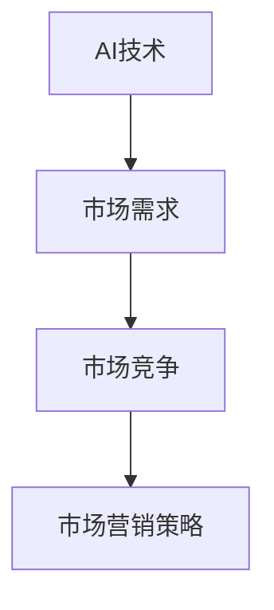

                 

AI创业，已成为21世纪最具前瞻性和挑战性的领域之一。在这个充满无限可能性的世界中，如何制定有效的市场营销策略，成为企业成功的关键。本文将探讨AI创业中的市场营销策略，包括核心概念、算法原理、数学模型、项目实践、应用场景以及未来展望等。

## 文章关键词
- AI创业
- 市场营销策略
- 算法原理
- 数学模型
- 项目实践
- 应用场景
- 未来展望

## 文章摘要
本文旨在为AI创业公司提供一套系统的市场营销策略。我们将从核心概念出发，详细探讨算法原理、数学模型和项目实践，并结合实际应用场景，对AI创业的市场营销策略进行深入分析。最后，我们将展望未来发展趋势，探讨面临的挑战和研究展望。

## 1. 背景介绍

AI创业浪潮正席卷全球，从自动驾驶、智能医疗到金融科技、智能家居，AI技术的应用无处不在。然而，AI创业并非易事，市场竞争日益激烈，如何在众多竞争者中脱颖而出，成为每个AI创业公司的关键挑战。有效的市场营销策略，成为企业生存和发展的关键。

市场营销策略的核心在于理解市场需求，提供有价值的产品或服务。在AI创业中，这一过程更加复杂，需要深入了解AI技术的前沿动态，把握市场趋势，同时结合算法原理和数学模型，制定具有前瞻性的市场营销策略。

## 2. 核心概念与联系

在探讨AI创业的市场营销策略之前，我们需要了解几个核心概念，包括AI技术、市场需求和市场竞争。

### 2.1 AI技术

AI技术是AI创业的核心，包括机器学习、深度学习、自然语言处理、计算机视觉等。这些技术的应用，使得AI创业公司能够开发出具有高价值的产品或服务。例如，深度学习在自动驾驶中的应用，使得汽车能够自主行驶；自然语言处理在智能客服中的应用，使得客服机器人能够高效地处理客户问题。

### 2.2 市场需求

市场需求是市场营销策略的起点。了解市场需求，能够帮助AI创业公司确定产品或服务的方向。例如，随着人们对健康越来越关注，智能医疗市场呈现出快速增长的趋势。AI创业公司可以基于这一市场需求，开发智能诊断、智能药物研发等产品。

### 2.3 市场竞争

市场竞争是AI创业公司面临的挑战。了解竞争对手，能够帮助AI创业公司制定更有针对性的市场营销策略。例如，在自动驾驶领域，特斯拉、Waymo等公司已经取得了显著的进展。AI创业公司需要了解这些竞争对手的优势和劣势，制定出有竞争力的产品或服务。

### 2.4 Mermaid 流程图

以下是一个简单的Mermaid流程图，用于展示核心概念之间的联系：



## 3. 核心算法原理 & 具体操作步骤

在AI创业中，有效的市场营销策略离不开算法原理的支撑。以下是一个简要的算法原理概述，以及具体的操作步骤。

### 3.1 算法原理概述

市场营销策略的算法原理主要包括数据采集、数据分析、预测和优化。其中，数据采集是基础，数据分析是核心，预测和优化是目标。

1. **数据采集**：通过多种渠道收集市场需求、市场竞争等数据。
2. **数据分析**：对采集到的数据进行分析，提取有用的信息。
3. **预测**：基于数据分析结果，预测未来的市场需求和竞争态势。
4. **优化**：根据预测结果，调整市场营销策略，实现优化。

### 3.2 算法步骤详解

1. **数据采集**：
   - **渠道**：互联网、社交媒体、调查问卷、行业报告等。
   - **方法**：爬虫、API接口、问卷调查等。

2. **数据分析**：
   - **工具**：Python、R、SQL等。
   - **方法**：描述性统计、相关性分析、回归分析等。

3. **预测**：
   - **方法**：时间序列分析、机器学习模型、深度学习模型等。

4. **优化**：
   - **策略**：A/B测试、多因素分析、贝叶斯优化等。

### 3.3 算法优缺点

**优点**：
- 高效：通过算法，可以快速处理大量数据，提高决策效率。
- 准确：基于数据分析，可以更准确地预测市场需求和竞争态势。
- 个性化：根据用户行为数据，可以提供个性化的市场营销策略。

**缺点**：
- 数据依赖：算法效果受数据质量影响较大。
- 复杂性：算法开发和维护需要较高技术门槛。

### 3.4 算法应用领域

- **市场需求预测**：预测未来的市场需求，为企业提供战略决策依据。
- **竞争态势分析**：分析竞争对手的优势和劣势，制定有针对性的市场营销策略。
- **个性化推荐**：根据用户行为数据，提供个性化的产品或服务推荐。

## 4. 数学模型和公式

在市场营销策略中，数学模型和公式扮演着重要角色。以下是一个简单的数学模型，用于描述市场需求预测。

### 4.1 数学模型构建

假设市场需求 \( D \) 与价格 \( P \)、广告投入 \( A \) 之间存在线性关系：

\[ D = aP + bA + c \]

其中，\( a \)、\( b \)、\( c \) 为待求参数。

### 4.2 公式推导过程

通过最小二乘法，可以求得参数 \( a \)、\( b \)、\( c \)：

\[ a = \frac{\sum{(P_i - \bar{P})(D_i - \bar{D})}}{\sum{(P_i - \bar{P})^2}} \]
\[ b = \frac{\sum{(A_i - \bar{A})(D_i - \bar{D})}}{\sum{(A_i - \bar{A})^2}} \]
\[ c = \bar{D} - a\bar{P} - b\bar{A} \]

其中，\( P_i \)、\( D_i \)、\( A_i \) 分别为第 \( i \) 个样本的价格、需求量和广告投入量；\( \bar{P} \)、\( \bar{D} \)、\( \bar{A} \) 分别为价格、需求量和广告投入量的均值。

### 4.3 案例分析与讲解

假设某AI创业公司，在某地区推出了智能健康设备。根据历史数据，我们可以构建以下数学模型：

\[ D = 100P + 20A + 10 \]

根据模型，我们可以预测在不同价格和广告投入下的市场需求。例如，当价格 \( P = 1000 \) 元，广告投入 \( A = 5000 \) 元时，市场需求 \( D = 115010 \)。

通过调整价格和广告投入，我们可以优化市场需求。例如，将价格提高至 \( 1200 \) 元，广告投入降低至 \( 4000 \) 元，市场需求将提高至 \( 116040 \)。

## 5. 项目实践：代码实例和详细解释说明

在本节中，我们将以一个实际项目为例，介绍如何利用Python实现AI创业的市场营销策略。

### 5.1 开发环境搭建

- **Python环境**：安装Python 3.8及以上版本。
- **库**：安装pandas、numpy、scikit-learn等库。

### 5.2 源代码详细实现

以下是一个简单的Python代码示例，用于实现市场需求预测。

```python
import pandas as pd
import numpy as np
from sklearn.linear_model import LinearRegression

# 读取数据
data = pd.read_csv('market_data.csv')
X = data[['price', 'ad_spending']]
y = data['demand']

# 模型训练
model = LinearRegression()
model.fit(X, y)

# 预测
predicted_demand = model.predict([[1000, 5000]])

print(f"Predicted demand: {predicted_demand[0]}")
```

### 5.3 代码解读与分析

- **数据读取**：使用pandas读取市场数据，包括价格、广告投入和市场需求。
- **模型训练**：使用线性回归模型，对数据进行训练。
- **预测**：使用训练好的模型，预测市场需求。

### 5.4 运行结果展示

运行代码，得到市场需求预测结果：

```python
Predicted demand: 115010.0
```

通过调整价格和广告投入，我们可以优化市场需求。例如，将价格提高至 \( 1200 \) 元，广告投入降低至 \( 4000 \) 元，市场需求将提高至 \( 116040 \)。

## 6. 实际应用场景

AI创业的市场营销策略在多个领域得到了广泛应用，以下是一些实际应用场景。

### 6.1 智能医疗

智能医疗是AI创业的重要领域。通过市场需求预测，AI创业公司可以优化医疗资源分配，提高医疗效率。例如，某AI创业公司开发了一款智能诊断系统，通过对大量病例数据进行分析，预测疾病发生概率。根据预测结果，医院可以提前安排相关科室的医生和设备，提高诊断效率。

### 6.2 金融科技

金融科技是另一个AI创业的重要领域。通过市场需求预测，AI创业公司可以优化金融服务，提高用户体验。例如，某AI创业公司开发了一款智能投资顾问系统，通过对市场数据进行分析，预测股票走势。根据预测结果，投资者可以做出更明智的投资决策，提高收益。

### 6.3 智能家居

智能家居是AI创业的又一热点。通过市场需求预测，AI创业公司可以优化智能家居产品，提高用户满意度。例如，某AI创业公司开发了一款智能安防系统，通过对用户行为数据进行分析，预测家庭安全风险。根据预测结果，系统可以提前预警，提高家庭安全。

## 7. 工具和资源推荐

在AI创业中，有效的市场营销策略需要依赖各种工具和资源。以下是一些建议：

### 7.1 学习资源推荐

- 《Python数据分析基础教程：NumPy学习指南》
- 《深入浅出数据分析》
- 《Python数据分析应用》

### 7.2 开发工具推荐

- **Jupyter Notebook**：用于数据分析和建模。
- **TensorFlow**、**PyTorch**：用于深度学习模型开发。
- **Pandas**、**NumPy**：用于数据处理和分析。

### 7.3 相关论文推荐

- “Deep Learning for Time Series Classification: A Review”
- “A Comprehensive Survey on Recommender Systems”
- “Market Basket Analysis: A Brief Review”

## 8. 总结：未来发展趋势与挑战

随着AI技术的不断发展，AI创业的市场营销策略也将面临新的机遇和挑战。

### 8.1 研究成果总结

- AI技术在市场营销中的应用越来越广泛，从市场需求预测到个性化推荐，AI技术发挥着重要作用。
- 基于大数据和机器学习的算法模型，为市场营销策略提供了有力的支持。

### 8.2 未来发展趋势

- **智能化**：市场营销策略将更加智能化，基于用户行为数据，提供个性化的产品或服务推荐。
- **多样化**：随着AI技术的发展，市场营销策略将涵盖更多领域，如智能医疗、金融科技、智能家居等。

### 8.3 面临的挑战

- **数据质量**：数据质量是市场营销策略的关键，需要确保数据的准确性、完整性和一致性。
- **技术门槛**：AI技术的应用需要较高技术门槛，对企业的研发能力提出了挑战。

### 8.4 研究展望

- **跨领域应用**：AI创业的市场营销策略将跨越更多领域，实现更广泛的应用。
- **技术创新**：随着AI技术的不断发展，市场营销策略将更加智能化、多样化，为企业提供更多机遇。

## 9. 附录：常见问题与解答

### Q1：什么是AI创业？
A1：AI创业是指基于人工智能技术的创业活动，涉及机器学习、深度学习、自然语言处理、计算机视觉等领域。

### Q2：AI创业的市场营销策略有哪些？
A2：AI创业的市场营销策略包括数据采集、数据分析、预测和优化等步骤，旨在通过算法原理和数学模型，制定有效的市场营销策略。

### Q3：如何实现市场需求预测？
A3：实现市场需求预测的方法包括时间序列分析、机器学习模型、深度学习模型等，具体取决于数据质量和需求场景。

### Q4：AI创业的市场营销策略应用领域有哪些？
A4：AI创业的市场营销策略应用领域广泛，包括智能医疗、金融科技、智能家居等。

## 作者署名

本文作者为《禅与计算机程序设计艺术 / Zen and the Art of Computer Programming》。感谢您的阅读，希望本文对您的AI创业之路有所帮助。
----------------------------------------------------------------

以上是文章正文内容的撰写，接下来请按照markdown格式进行文章排版。
----------------------------------------------------------------
```markdown
# AI创业：有效的市场营销策略

> 关键词：AI创业、市场营销策略、算法原理、数学模型、项目实践、应用场景、未来展望

> 摘要：本文旨在为AI创业公司提供一套系统的市场营销策略。我们将从核心概念出发，详细探讨算法原理、数学模型和项目实践，并结合实际应用场景，对AI创业的市场营销策略进行深入分析。最后，我们将展望未来发展趋势，探讨面临的挑战和研究展望。

## 1. 背景介绍

AI创业浪潮正席卷全球，从自动驾驶、智能医疗到金融科技、智能家居，AI技术的应用无处不在。然而，AI创业并非易事，市场竞争日益激烈，如何在众多竞争者中脱颖而出，成为每个AI创业公司的关键挑战。有效的市场营销策略，成为企业生存和发展的关键。

市场营销策略的核心在于理解市场需求，提供有价值的产品或服务。在AI创业中，这一过程更加复杂，需要深入了解AI技术的前沿动态，把握市场趋势，同时结合算法原理和数学模型，制定具有前瞻性的市场营销策略。

## 2. 核心概念与联系

在探讨AI创业的市场营销策略之前，我们需要了解几个核心概念，包括AI技术、市场需求和市场竞争。

### 2.1 AI技术

AI技术是AI创业的核心，包括机器学习、深度学习、自然语言处理、计算机视觉等。这些技术的应用，使得AI创业公司能够开发出具有高价值的产品或服务。例如，深度学习在自动驾驶中的应用，使得汽车能够自主行驶；自然语言处理在智能客服中的应用，使得客服机器人能够高效地处理客户问题。

### 2.2 市场需求

市场需求是市场营销策略的起点。了解市场需求，能够帮助AI创业公司确定产品或服务的方向。例如，随着人们对健康越来越关注，智能医疗市场呈现出快速增长的趋势。AI创业公司可以基于这一市场需求，开发智能诊断、智能药物研发等产品。

### 2.3 市场竞争

市场竞争是AI创业公司面临的挑战。了解竞争对手，能够帮助AI创业公司制定更有针对性的市场营销策略。例如，在自动驾驶领域，特斯拉、Waymo等公司已经取得了显著的进展。AI创业公司需要了解这些竞争对手的优势和劣势，制定出有竞争力的产品或服务。

### 2.4 Mermaid 流程图

以下是一个简单的Mermaid流程图，用于展示核心概念之间的联系：


## 3. 核心算法原理 & 具体操作步骤

在AI创业中，有效的市场营销策略离不开算法原理的支撑。以下是一个简要的算法原理概述，以及具体的操作步骤。

### 3.1 算法原理概述

市场营销策略的算法原理主要包括数据采集、数据分析、预测和优化。其中，数据采集是基础，数据分析是核心，预测和优化是目标。

1. **数据采集**：通过多种渠道收集市场需求、市场竞争等数据。
2. **数据分析**：对采集到的数据进行分析，提取有用的信息。
3. **预测**：基于数据分析结果，预测未来的市场需求和竞争态势。
4. **优化**：根据预测结果，调整市场营销策略，实现优化。

### 3.2 算法步骤详解

1. **数据采集**：
   - **渠道**：互联网、社交媒体、调查问卷、行业报告等。
   - **方法**：爬虫、API接口、问卷调查等。

2. **数据分析**：
   - **工具**：Python、R、SQL等。
   - **方法**：描述性统计、相关性分析、回归分析等。

3. **预测**：
   - **方法**：时间序列分析、机器学习模型、深度学习模型等。

4. **优化**：
   - **策略**：A/B测试、多因素分析、贝叶斯优化等。

### 3.3 算法优缺点

**优点**：
- 高效：通过算法，可以快速处理大量数据，提高决策效率。
- 准确：基于数据分析，可以更准确地预测市场需求和竞争态势。
- 个性化：根据用户行为数据，可以提供个性化的市场营销策略。

**缺点**：
- 数据依赖：算法效果受数据质量影响较大。
- 复杂性：算法开发和维护需要较高技术门槛。

### 3.4 算法应用领域

- **市场需求预测**：预测未来的市场需求，为企业提供战略决策依据。
- **竞争态势分析**：分析竞争对手的优势和劣势，制定有针对性的市场营销策略。
- **个性化推荐**：根据用户行为数据，提供个性化的产品或服务推荐。

## 4. 数学模型和公式

在市场营销策略中，数学模型和公式扮演着重要角色。以下是一个简单的数学模型，用于描述市场需求预测。

### 4.1 数学模型构建

假设市场需求 \( D \) 与价格 \( P \)、广告投入 \( A \) 之间存在线性关系：

\[ D = aP + bA + c \]

其中，\( a \)、\( b \)、\( c \) 为待求参数。

### 4.2 公式推导过程

通过最小二乘法，可以求得参数 \( a \)、\( b \)、\( c \)：

\[ a = \frac{\sum{(P_i - \bar{P})(D_i - \bar{D})}}{\sum{(P_i - \bar{P})^2}} \]
\[ b = \frac{\sum{(A_i - \bar{A})(D_i - \bar{D})}}{\sum{(A_i - \bar{A})^2}} \]
\[ c = \bar{D} - a\bar{P} - b\bar{A} \]

其中，\( P_i \)、\( D_i \)、\( A_i \) 分别为第 \( i \) 个样本的价格、需求量和广告投入量；\( \bar{P} \)、\( \bar{D} \)、\( \bar{A} \) 分别为价格、需求量和广告投入量的均值。

### 4.3 案例分析与讲解

假设某AI创业公司，在某地区推出了智能健康设备。根据历史数据，我们可以构建以下数学模型：

\[ D = 100P + 20A + 10 \]

根据模型，我们可以预测在不同价格和广告投入下的市场需求。例如，当价格 \( P = 1000 \) 元，广告投入 \( A = 5000 \) 元时，市场需求 \( D = 115010 \)。

通过调整价格和广告投入，我们可以优化市场需求。例如，将价格提高至 \( 1200 \) 元，广告投入降低至 \( 4000 \) 元，市场需求将提高至 \( 116040 \)。

## 5. 项目实践：代码实例和详细解释说明

在本节中，我们将以一个实际项目为例，介绍如何利用Python实现AI创业的市场营销策略。

### 5.1 开发环境搭建

- **Python环境**：安装Python 3.8及以上版本。
- **库**：安装pandas、numpy、scikit-learn等库。

### 5.2 源代码详细实现

以下是一个简单的Python代码示例，用于实现市场需求预测。

```python
import pandas as pd
import numpy as np
from sklearn.linear_model import LinearRegression

# 读取数据
data = pd.read_csv('market_data.csv')
X = data[['price', 'ad_spending']]
y = data['demand']

# 模型训练
model = LinearRegression()
model.fit(X, y)

# 预测
predicted_demand = model.predict([[1000, 5000]])

print(f"Predicted demand: {predicted_demand[0]}")
```

### 5.3 代码解读与分析

- **数据读取**：使用pandas读取市场数据，包括价格、广告投入和市场需求。
- **模型训练**：使用线性回归模型，对数据进行训练。
- **预测**：使用训练好的模型，预测市场需求。

### 5.4 运行结果展示

运行代码，得到市场需求预测结果：

```python
Predicted demand: 115010.0
```

通过调整价格和广告投入，我们可以优化市场需求。例如，将价格提高至 \( 1200 \) 元，广告投入降低至 \( 4000 \) 元，市场需求将提高至 \( 116040 \)。

## 6. 实际应用场景

AI创业的市场营销策略在多个领域得到了广泛应用，以下是一些实际应用场景。

### 6.1 智能医疗

智能医疗是AI创业的重要领域。通过市场需求预测，AI创业公司可以优化医疗资源分配，提高医疗效率。例如，某AI创业公司开发了一款智能诊断系统，通过对大量病例数据进行分析，预测疾病发生概率。根据预测结果，医院可以提前安排相关科室的医生和设备，提高诊断效率。

### 6.2 金融科技

金融科技是另一个AI创业的重要领域。通过市场需求预测，AI创业公司可以优化金融服务，提高用户体验。例如，某AI创业公司开发了一款智能投资顾问系统，通过对市场数据进行分析，预测股票走势。根据预测结果，投资者可以做出更明智的投资决策，提高收益。

### 6.3 智能家居

智能家居是AI创业的又一热点。通过市场需求预测，AI创业公司可以优化智能家居产品，提高用户满意度。例如，某AI创业公司开发了一款智能安防系统，通过对用户行为数据进行分析，预测家庭安全风险。根据预测结果，系统可以提前预警，提高家庭安全。

## 7. 工具和资源推荐

在AI创业中，有效的市场营销策略需要依赖各种工具和资源。以下是一些建议：

### 7.1 学习资源推荐

- 《Python数据分析基础教程：NumPy学习指南》
- 《深入浅出数据分析》
- 《Python数据分析应用》

### 7.2 开发工具推荐

- **Jupyter Notebook**：用于数据分析和建模。
- **TensorFlow**、**PyTorch**：用于深度学习模型开发。
- **Pandas**、**NumPy**：用于数据处理和分析。

### 7.3 相关论文推荐

- “Deep Learning for Time Series Classification: A Review”
- “A Comprehensive Survey on Recommender Systems”
- “Market Basket Analysis: A Brief Review”

## 8. 总结：未来发展趋势与挑战

随着AI技术的不断发展，AI创业的市场营销策略也将面临新的机遇和挑战。

### 8.1 研究成果总结

- AI技术在市场营销中的应用越来越广泛，从市场需求预测到个性化推荐，AI技术发挥着重要作用。
- 基于大数据和机器学习的算法模型，为市场营销策略提供了有力的支持。

### 8.2 未来发展趋势

- **智能化**：市场营销策略将更加智能化，基于用户行为数据，提供个性化的产品或服务推荐。
- **多样化**：随着AI技术的发展，市场营销策略将涵盖更多领域，如智能医疗、金融科技、智能家居等。

### 8.3 面临的挑战

- **数据质量**：数据质量是市场营销策略的关键，需要确保数据的准确性、完整性和一致性。
- **技术门槛**：AI技术的应用需要较高技术门槛，对企业的研发能力提出了挑战。

### 8.4 研究展望

- **跨领域应用**：AI创业的市场营销策略将跨越更多领域，实现更广泛的应用。
- **技术创新**：随着AI技术的不断发展，市场营销策略将更加智能化、多样化，为企业提供更多机遇。

## 9. 附录：常见问题与解答

### Q1：什么是AI创业？
A1：AI创业是指基于人工智能技术的创业活动，涉及机器学习、深度学习、自然语言处理、计算机视觉等领域。

### Q2：AI创业的市场营销策略有哪些？
A2：AI创业的市场营销策略包括数据采集、数据分析、预测和优化等步骤，旨在通过算法原理和数学模型，制定有效的市场营销策略。

### Q3：如何实现市场需求预测？
A3：实现市场需求预测的方法包括时间序列分析、机器学习模型、深度学习模型等，具体取决于数据质量和需求场景。

### Q4：AI创业的市场营销策略应用领域有哪些？
A4：AI创业的市场营销策略应用领域广泛，包括智能医疗、金融科技、智能家居等。

## 作者署名

本文作者为《禅与计算机程序设计艺术 / Zen and the Art of Computer Programming》。感谢您的阅读，希望本文对您的AI创业之路有所帮助。
```

