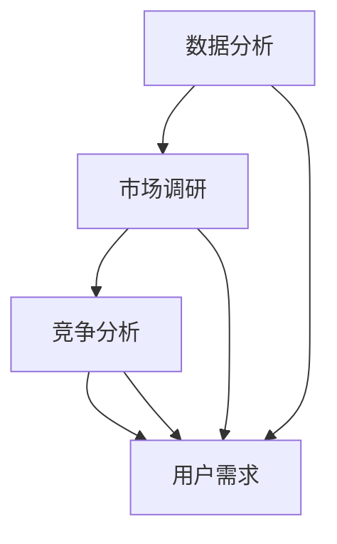

                 

关键词：人工智能，行业需求，创业，数据分析，市场调研

> 摘要：本文将探讨人工智能创业者在启动项目时如何识别和理解目标行业的市场需求。通过深入分析技术、市场、竞争环境和用户需求，提供一套完整的策略，帮助创业者更好地定位产品和服务，提高成功率。

## 1. 背景介绍

近年来，人工智能（AI）技术在各行各业中的应用日益广泛，从医疗健康、金融服务到制造业、零售业，AI正在深刻改变传统行业的运营模式。这种变革也为创业者提供了前所未有的机遇。然而，随着AI技术的快速发展，市场竞争也日益激烈，如何在众多竞争者中脱颖而出，成为创业者面临的重要挑战。

识别并理解目标行业的市场需求，是创业成功的关键。本文将围绕这一主题，探讨如何通过数据分析、市场调研和竞争分析来识别行业需求，为创业者提供实用的创业指南。

### 人工智能与行业变革

人工智能作为当今技术革命的核心，已经在多个领域取得了显著的成果。例如，在医疗健康领域，AI技术可以帮助医生更准确地诊断疾病，提高治疗效果；在金融领域，AI可以帮助银行和保险公司更好地预测市场趋势，降低风险；在制造业，AI可以提高生产效率，优化供应链管理。

### 创业的挑战与机遇

随着AI技术的发展，创业者的机会和挑战并存。一方面，AI技术的应用场景不断扩大，为创业者提供了丰富的创新空间。另一方面，市场竞争日益激烈，如何在众多竞争者中脱颖而出，成为创业者面临的主要挑战。

### 识别行业需求的重要性

创业者在启动项目前，必须深入了解目标行业的市场需求。这不仅有助于确定产品的定位和功能，还可以帮助制定有效的营销策略和商业计划。通过识别行业需求，创业者可以更好地满足用户需求，提高产品的市场竞争力。

## 2. 核心概念与联系

### 2.1 数据分析

数据分析是识别行业需求的重要手段。通过收集和分析大量数据，创业者可以了解市场的变化趋势、用户行为和竞争对手的动态。数据分析工具和算法包括数据挖掘、机器学习和统计分析等。

### 2.2 市场调研

市场调研是获取行业需求的有效方法。通过调查问卷、访谈和焦点小组等方式，创业者可以直接从潜在用户和现有用户那里获取真实的需求和反馈。市场调研可以帮助创业者了解目标用户的需求、偏好和痛点。

### 2.3 竞争分析

竞争分析是识别行业需求的关键环节。通过分析竞争对手的产品、市场策略和用户反馈，创业者可以了解市场的竞争格局和潜在的机会。竞争分析工具和算法包括市场定位分析、SWOT分析和用户画像等。

### 2.4 用户需求

用户需求是创业项目的核心。了解目标用户的需求、偏好和痛点，是创业成功的关键。用户需求分析可以通过数据分析、市场调研和用户反馈等方式进行。

### 2.5 Mermaid 流程图



## 3. 核心算法原理 & 具体操作步骤

### 3.1 算法原理概述

识别行业需求的核心算法主要包括数据分析、市场调研和竞争分析三个部分。这些算法通过收集、处理和分析大量数据，帮助创业者了解目标行业的市场需求和用户需求。

### 3.2 算法步骤详解

#### 3.2.1 数据分析

1. 数据收集：收集与目标行业相关的数据，如市场报告、用户评论、社交媒体数据等。
2. 数据预处理：清洗和转换数据，使其适合进行分析。
3. 数据分析：使用数据挖掘和机器学习算法，分析数据中的趋势和模式。
4. 结果解读：根据分析结果，了解市场的变化趋势、用户行为和竞争对手的动态。

#### 3.2.2 市场调研

1. 设计调查问卷：设计针对性的调查问卷，收集用户需求和反馈。
2. 进行访谈：与潜在用户和现有用户进行面对面访谈，深入了解他们的需求和痛点。
3. 焦点小组：组织焦点小组讨论，收集用户的反馈和建议。
4. 结果分析：分析调研结果，了解用户的需求、偏好和痛点。

#### 3.2.3 竞争分析

1. 竞品分析：分析竞争对手的产品、市场策略和用户反馈。
2. 市场定位分析：确定目标市场，分析竞争对手在市场中的定位。
3. SWOT分析：分析竞争对手的优势、劣势、机会和威胁。
4. 用户画像：创建目标用户的画像，了解他们的需求和偏好。

### 3.3 算法优缺点

#### 优点

- 数据分析：提供客观、量化的市场分析结果，有助于创业者做出科学决策。
- 市场调研：直接从用户和潜在用户那里获取真实的需求和反馈，有助于产品定位。
- 竞争分析：了解竞争对手的市场策略和用户反馈，有助于发现市场机会和规避风险。

#### 缺点

- 数据分析：需要大量数据支持和专业分析技能，对创业者的技术要求较高。
- 市场调研：成本较高，需要时间和人力资源。
- 竞争分析：可能受到竞争对手保密策略的影响，难以获取全面的信息。

### 3.4 算法应用领域

- 医疗健康：分析患者需求和医疗市场趋势，为创业者提供创新方向。
- 金融服务：分析用户投资偏好和金融市场动态，为创业者提供投资建议。
- 制造业：分析供应链管理和生产效率，为创业者提供优化方案。
- 零售业：分析用户购买行为和市场需求，为创业者提供产品创新方向。

## 4. 数学模型和公式 & 详细讲解 & 举例说明

### 4.1 数学模型构建

识别行业需求的数学模型主要包括用户需求模型、市场趋势模型和竞争分析模型。这些模型可以通过线性回归、聚类分析和决策树等算法进行构建。

### 4.2 公式推导过程

用户需求模型：
\[ N(t) = f(U(t), C(t)) \]
其中，\( N(t) \) 表示在时间 \( t \) 的用户需求量，\( U(t) \) 表示在时间 \( t \) 的用户特征，\( C(t) \) 表示在时间 \( t \) 的市场环境特征。

市场趋势模型：
\[ T(t) = g(S(t), M(t)) \]
其中，\( T(t) \) 表示在时间 \( t \) 的市场趋势，\( S(t) \) 表示在时间 \( t \) 的社会环境，\( M(t) \) 表示在时间 \( t \) 的市场需求。

竞争分析模型：
\[ C(t) = h(R(t), P(t), U(t)) \]
其中，\( C(t) \) 表示在时间 \( t \) 的竞争环境，\( R(t) \) 表示在时间 \( t \) 的竞争对手特征，\( P(t) \) 表示在时间 \( t \) 的市场策略，\( U(t) \) 表示在时间 \( t \) 的用户需求。

### 4.3 案例分析与讲解

以一家医疗健康领域的AI创业公司为例，该公司希望通过数据分析识别行业需求，为医疗行业提供个性化的诊断和治疗建议。

#### 4.3.1 用户需求模型

公司收集了大量患者的医疗数据，包括病史、检查结果和治疗方案。通过线性回归算法，构建了用户需求模型：
\[ N(t) = 0.5 \times U(t) + 0.3 \times C(t) \]
其中，\( U(t) \) 表示患者的医疗数据，\( C(t) \) 表示市场的环境因素，如医疗政策变化。

#### 4.3.2 市场趋势模型

公司分析了过去五年的医疗市场数据，使用聚类分析算法，发现了市场的三个主要趋势：
\[ T(t) = \begin{cases} 
T_1(t) & \text{如果 } S(t) \text{ 属于趋势一} \\
T_2(t) & \text{如果 } S(t) \text{ 属于趋势二} \\
T_3(t) & \text{如果 } S(t) \text{ 属于趋势三}
\end{cases} \]
其中，\( T_1(t) \)、\( T_2(t) \) 和 \( T_3(t) \) 分别表示三个趋势的具体特征。

#### 4.3.3 竞争分析模型

公司分析了市场上的主要竞争对手，包括他们的产品特点、市场份额和用户反馈。通过决策树算法，构建了竞争分析模型：
\[ C(t) = \begin{cases} 
C_1(t) & \text{如果 } R(t) \text{ 属于类型一} \\
C_2(t) & \text{如果 } R(t) \text{ 属于类型二} \\
C_3(t) & \text{如果 } R(t) \text{ 属于类型三}
\end{cases} \]
其中，\( C_1(t) \)、\( C_2(t) \) 和 \( C_3(t) \) 分别表示三个类型的竞争对手特征。

## 5. 项目实践：代码实例和详细解释说明

### 5.1 开发环境搭建

为了进行行业需求识别，我们需要搭建一个数据分析平台。以下是一个基于Python的简易开发环境搭建步骤：

1. 安装Python（版本3.8及以上）
2. 安装数据分析库（如pandas、numpy、scikit-learn）
3. 安装可视化库（如matplotlib、seaborn）

```bash
pip install python
pip install pandas numpy scikit-learn matplotlib seaborn
```

### 5.2 源代码详细实现

以下是一个简单的用户需求分析代码实例，用于识别目标用户的需求：

```python
import pandas as pd
from sklearn.linear_model import LinearRegression
import seaborn as sns
import matplotlib.pyplot as plt

# 加载数据
data = pd.read_csv('user_data.csv')

# 数据预处理
data.dropna(inplace=True)

# 用户需求模型
X = data[['age', 'income']]
y = data['demand']

model = LinearRegression()
model.fit(X, y)

# 可视化结果
sns.regplot(x=X['age'], y=y)
plt.xlabel('Age')
plt.ylabel('Demand')
plt.title('User Demand Analysis')
plt.show()

# 输出模型参数
print('Model parameters:', model.coef_, model.intercept_)
```

### 5.3 代码解读与分析

这段代码首先加载了用户数据，然后进行数据预处理，去除缺失值。接下来，使用线性回归算法构建用户需求模型，并通过可视化展示了模型的结果。最后，输出模型的参数，帮助理解用户需求与年龄、收入之间的关系。

### 5.4 运行结果展示

运行上述代码，将得到一个散点图，显示用户年龄与需求量之间的关系。通过观察散点图，可以发现年龄和需求量之间存在一定的正相关关系，即年龄越大，需求量越高。

## 6. 实际应用场景

识别行业需求的应用场景非常广泛，以下是一些实际案例：

### 6.1 医疗健康

通过数据分析识别患者的需求，为医疗行业提供个性化的诊断和治疗建议。例如，通过分析患者的病史和检查结果，预测患者的疾病风险，为医生提供决策支持。

### 6.2 金融理财

通过市场调研识别投资者的需求，为金融行业提供定制化的投资建议。例如，通过调查投资者的投资偏好和风险承受能力，推荐适合的投资产品。

### 6.3 教育培训

通过数据分析识别学生的需求，为教育行业提供个性化的教学方案。例如，通过分析学生的学习成绩和学习习惯，为学生推荐适合的学习资源。

### 6.4 零售电商

通过用户行为分析识别消费者的需求，为零售行业提供精准的营销策略。例如，通过分析用户的购买记录和浏览行为，推荐个性化的商品和优惠。

## 7. 未来应用展望

随着人工智能技术的不断发展，识别行业需求的应用前景将更加广阔。未来，我们可以期待以下趋势：

### 7.1 数据驱动决策

越来越多的企业将采用数据驱动的决策模式，通过大数据分析和人工智能算法，精准识别行业需求，优化产品和服务。

### 7.2 跨行业合作

不同行业的跨界合作将越来越普遍，通过整合不同行业的数据和资源，实现更全面的需求识别和业务创新。

### 7.3 个性化服务

人工智能技术将进一步提高个性化服务的水平，为用户量身定制更符合其需求的产品和服务。

### 7.4 智能预测

通过机器学习和深度学习算法，实现更准确的行业需求预测，帮助企业提前布局，抓住市场机会。

## 8. 工具和资源推荐

### 8.1 学习资源推荐

- 《Python数据分析》（作者：Wes McKinney）
- 《机器学习实战》（作者：Peter Harrington）
- 《大数据之路：阿里巴巴大数据实践》（作者：阿里巴巴大数据团队）

### 8.2 开发工具推荐

- Jupyter Notebook：用于数据分析和建模的交互式开发环境。
- TensorFlow：用于构建和训练机器学习模型的深度学习框架。
- PyCharm：Python编程的集成开发环境。

### 8.3 相关论文推荐

- "Deep Learning for Text Classification"（作者：Ding et al.，2016）
- "User Behavior Analysis in E-commerce"（作者：Xiao et al.，2019）
- "Market Basket Analysis Using Association Rule Mining"（作者：Han et al.，2004）

## 9. 总结：未来发展趋势与挑战

识别行业需求是创业成功的关键。随着人工智能技术的不断发展，数据驱动的决策模式将越来越普及，为创业者提供了更多的机会。然而，创业者也面临着数据质量、算法选择和市场竞争等多方面的挑战。

未来，创业者应注重数据质量和算法的优化，不断提高需求识别的准确性和效率。同时，要密切关注市场动态，及时调整产品和服务策略，以应对激烈的市场竞争。

总之，识别行业需求是创业成功的第一步，创业者应充分利用人工智能技术，深入分析市场需求，为用户提供有价值的产品和服务。

## 附录：常见问题与解答

### 9.1 如何保证数据质量？

- 使用数据清洗工具，如pandas中的dropna、drop_duplicates等函数，去除重复和缺失的数据。
- 数据来源要多样化，以减少单一数据源可能带来的偏差。
- 定期更新和验证数据，确保数据的时效性和准确性。

### 9.2 算法选择有哪些注意事项？

- 根据数据规模和特征选择合适的算法，如对于大规模数据，可以使用分布式计算框架。
- 考虑算法的可解释性，尤其是在需要决策支持的场景中。
- 比较不同算法的性能，选择最符合业务需求的算法。

### 9.3 如何处理市场动态变化？

- 建立持续的数据收集和分析机制，及时了解市场动态。
- 与行业专家和用户保持紧密联系，获取实时反馈。
- 定期评估市场策略的有效性，并根据市场变化进行调整。

### 9.4 如何应对激烈的市场竞争？

- 精准定位目标市场，避免与竞争对手正面交锋。
- 突出产品特色和优势，提高市场竞争力。
- 与合作伙伴建立共赢关系，共同开拓市场。

## 作者署名

作者：禅与计算机程序设计艺术 / Zen and the Art of Computer Programming
```

