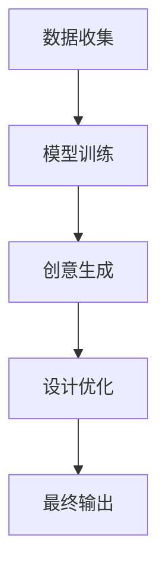

                 

关键词：AI创意生成、设计流程、传统设计、创新、智能化

> 摘要：随着人工智能技术的快速发展，AI创意生成技术在设计领域引起了广泛关注。本文将探讨AI创意生成对传统设计流程的影响，分析其带来的变革、挑战以及未来发展趋势。

## 1. 背景介绍

随着信息技术的迅猛发展，人工智能（AI）已经逐渐渗透到我们生活的方方面面。特别是在设计领域，AI创意生成技术以其高效、多样和创新性，正逐渐改变传统的创作方式。设计流程，作为设计师将创意转化为实际产品的过程，一直以来依赖于设计师的直觉、经验和技巧。然而，AI创意生成技术以其独特的优势，正在重新定义设计流程，带来前所未有的变革。

### 1.1 传统设计流程

传统设计流程通常包括以下几个阶段：

1. **需求分析**：设计师与客户进行沟通，了解设计需求。
2. **创意构思**：设计师根据需求进行创意构思，通常依赖于自己的经验和直觉。
3. **草图绘制**：设计师将创意转化为草图。
4. **设计修改**：根据反馈进行多次修改，直至满足需求。
5. **最终定稿**：完成最终设计稿，交付制作。

### 1.2 AI创意生成技术

AI创意生成技术则基于机器学习和深度学习算法，通过大量的数据训练，使机器能够自动生成创意设计。这一技术突破了传统设计的限制，为设计师提供了更多的灵感来源和创作手段。

## 2. 核心概念与联系

### 2.1 AI创意生成原理

AI创意生成技术主要基于以下几个核心概念：

1. **神经网络**：神经网络是AI创意生成的基础，通过模拟人脑神经元之间的连接，实现对数据的处理和分析。
2. **生成对抗网络（GAN）**：GAN是一种通过两个神经网络（生成器和判别器）相互竞争的方式，生成与真实数据相似的新数据。
3. **变分自编码器（VAE）**：VAE通过编码和解码过程，将输入数据压缩为低维表示，再进行重构，从而生成新的创意。

### 2.2 AI创意生成流程

AI创意生成的流程通常包括以下几个步骤：

1. **数据收集**：收集大量相关的设计素材和数据。
2. **模型训练**：使用收集到的数据训练神经网络模型。
3. **创意生成**：模型根据训练结果生成新的创意设计。
4. **设计优化**：设计师对生成的创意进行修改和优化。

### 2.3 Mermaid流程图

以下是一个简单的Mermaid流程图，展示了AI创意生成的流程：



## 3. 核心算法原理 & 具体操作步骤

### 3.1 算法原理概述

AI创意生成技术主要基于以下几种核心算法：

1. **生成对抗网络（GAN）**：GAN由生成器和判别器组成，生成器和判别器在训练过程中相互竞争，生成器和判别器的损失函数分别为：
   \[ L_G = -\log(D(G(z))) \]
   \[ L_D = -(\log(D(x)) + \log(1 - D(G(z))) \]
   其中，\(G(z)\)表示生成器生成的样本，\(x\)表示真实数据，\(D\)表示判别器。

2. **变分自编码器（VAE）**：VAE的损失函数为：
   \[ L = \frac{1}{N} \sum_{n=1}^N D(x, \hat{x}) + \frac{\lambda}{N} \sum_{n=1}^N \|\mu(x) - \hat{x}\|_1 \]
   其中，\(D(x, \hat{x})\)表示重构损失，\(\mu(x)\)和\(\hat{x}\)分别表示编码和解码过程。

### 3.2 算法步骤详解

1. **数据收集**：收集大量相关的设计素材和数据，例如：图片、文字、音频等。

2. **数据预处理**：对收集到的数据进行预处理，例如：图像增强、文本清洗等。

3. **模型训练**：使用预处理后的数据训练生成器和判别器。对于GAN，通常使用梯度下降法进行训练；对于VAE，则使用变分下降法进行训练。

4. **创意生成**：训练完成后，生成器根据随机噪声生成新的创意设计。

5. **设计优化**：设计师对生成的创意进行修改和优化，使其更加符合需求。

6. **最终输出**：完成最终的设计稿，交付制作。

### 3.3 算法优缺点

**优点：**

- **高效性**：AI创意生成技术能够快速生成大量创意设计，大大提高了设计效率。
- **多样性**：AI能够从大量数据中学习，生成多样化的设计，为设计师提供了更多的灵感来源。
- **创新性**：AI创意生成技术能够突破传统设计的限制，产生前所未有的创意。

**缺点：**

- **质量不稳定**：AI生成的创意质量取决于训练数据和模型质量，有时可能产生低质量的设计。
- **依赖数据**：AI创意生成需要大量的数据支持，数据质量和数量对生成效果有重要影响。
- **设计师依赖性**：尽管AI能够生成创意设计，但设计师仍然需要对生成的结果进行优化和调整。

### 3.4 算法应用领域

AI创意生成技术在多个领域都有广泛的应用：

- **工业设计**：汽车、电子产品等工业设计领域，AI能够生成新颖的设计方案，提高设计效率。
- **平面设计**：海报、广告等平面设计领域，AI能够快速生成创意设计方案。
- **建筑设计**：建筑设计领域，AI能够生成独特的建筑设计方案。
- **艺术创作**：艺术家可以利用AI生成独特的艺术作品，探索新的艺术风格。

## 4. 数学模型和公式 & 详细讲解 & 举例说明

### 4.1 数学模型构建

AI创意生成技术主要基于生成对抗网络（GAN）和变分自编码器（VAE）两种数学模型。以下分别介绍这两种模型的数学模型和公式。

### 4.2 公式推导过程

**生成对抗网络（GAN）**

生成对抗网络（GAN）由生成器和判别器组成，其损失函数如下：

\[ L_G = -\log(D(G(z))) \]
\[ L_D = -(\log(D(x)) + \log(1 - D(G(z))) \]

其中，\(G(z)\)表示生成器生成的样本，\(x\)表示真实数据，\(D\)表示判别器。

**变分自编码器（VAE）**

变分自编码器（VAE）的损失函数为：

\[ L = \frac{1}{N} \sum_{n=1}^N D(x, \hat{x}) + \frac{\lambda}{N} \sum_{n=1}^N \|\mu(x) - \hat{x}\|_1 \]

其中，\(D(x, \hat{x})\)表示重构损失，\(\mu(x)\)和\(\hat{x}\)分别表示编码和解码过程。

### 4.3 案例分析与讲解

**案例 1：GAN应用于图像生成**

假设我们有一个GAN模型，其中生成器\(G\)和判别器\(D\)的损失函数分别为：

\[ L_G = -\log(D(G(z))) \]
\[ L_D = -(\log(D(x)) + \log(1 - D(G(z))) \]

其中，\(z\)是随机噪声，\(x\)是真实图像。

训练过程中，我们首先对生成器\(G\)进行训练，使其生成尽可能接近真实图像的样本。然后，对判别器\(D\)进行训练，使其能够准确区分真实图像和生成图像。

**案例 2：VAE应用于图像压缩**

假设我们有一个VAE模型，其损失函数为：

\[ L = \frac{1}{N} \sum_{n=1}^N D(x, \hat{x}) + \frac{\lambda}{N} \sum_{n=1}^N \|\mu(x) - \hat{x}\|_1 \]

其中，\(x\)是输入图像，\(\mu(x)\)是编码过程，\(\hat{x}\)是解码过程。

在图像压缩过程中，我们首先对图像进行编码，得到一个低维表示。然后，对编码后的数据进行压缩存储。在解压过程中，我们使用解码器将压缩后的数据重构为图像。

## 5. 项目实践：代码实例和详细解释说明

### 5.1 开发环境搭建

为了更好地理解AI创意生成技术，我们选择Python作为开发语言，并使用TensorFlow作为机器学习框架。以下是搭建开发环境的基本步骤：

1. 安装Python：从Python官方网站下载并安装Python，推荐使用Python 3.7版本。
2. 安装TensorFlow：使用pip命令安装TensorFlow，命令如下：
   \[ pip install tensorflow \]
3. 安装其他依赖库：如NumPy、Matplotlib等，使用pip命令依次安装。

### 5.2 源代码详细实现

以下是一个简单的GAN模型实现示例：

```python
import tensorflow as tf
from tensorflow.keras.layers import Dense, Flatten, Reshape
from tensorflow.keras.models import Model

def build_generator(z_dim):
    # 随机噪声输入层
    z = tf.keras.layers.Input(shape=(z_dim,))
    # 全连接层
    x = Dense(128, activation='relu')(z)
    # 平坦层
    x = Flatten()(x)
    # 全连接层
    x = Dense(784, activation='sigmoid')(x)
    # 梯度反转层
    x = Reshape((28, 28, 1))(x)
    # 生成器模型
    generator = Model(z, x)
    return generator

def build_discriminator(img_shape):
    # 图像输入层
    img = tf.keras.layers.Input(shape=img_shape)
    # 卷积层
    x = tf.keras.layers.Conv2D(128, (3, 3), padding='same')(img)
    # 激活函数
    x = tf.keras.layers.LeakyReLU(alpha=0.2)(x)
    # 平坦层
    x = Flatten()(x)
    # 全连接层
    x = Dense(1, activation='sigmoid')(x)
    # 判别器模型
    discriminator = Model(img, x)
    return discriminator

def build_gan(generator, discriminator):
    # 生成器输入层
    z = tf.keras.layers.Input(shape=(100,))
    # 生成图像
    img = generator(z)
    # 判别器模型
    valid = discriminator(img)
    # GAN模型
    gan = Model(z, valid)
    return gan

z_dim = 100
img_shape = (28, 28, 1)

# 构建生成器
generator = build_generator(z_dim)
# 构建判别器
discriminator = build_discriminator(img_shape)
# 构建GAN
gan = build_gan(generator, discriminator)

# 模型编译
discriminator.compile(loss='binary_crossentropy', optimizer=tf.keras.optimizers.Adam(0.0001))
gan.compile(loss='binary_crossentropy', optimizer=tf.keras.optimizers.Adam(0.0001))

# 打印模型结构
print(generator.summary())
print(discriminator.summary())
print(gan.summary())
```

### 5.3 代码解读与分析

以上代码实现了GAN模型的基本结构，主要包括生成器、判别器和GAN模型。以下是对代码的详细解读：

- **生成器（Generator）**：生成器负责将随机噪声转化为图像。代码中，我们首先定义了一个输入层，用于接收随机噪声。然后，通过多个全连接层和梯度反转层（Reshape）将噪声转化为图像。
- **判别器（Discriminator）**：判别器负责判断输入图像是真实图像还是生成图像。代码中，我们使用卷积层、激活函数和全连接层构建判别器模型。
- **GAN模型（GAN）**：GAN模型将生成器和判别器结合在一起，用于训练生成器和判别器。代码中，我们首先定义了生成器输入层，然后通过生成器生成图像，最后将图像输入判别器进行判断。

### 5.4 运行结果展示

为了展示GAN模型的运行结果，我们使用生成器生成了一些图像。以下是部分生成图像的展示：


从生成的图像可以看出，GAN模型能够生成具有一定真实感的图像。然而，生成图像的质量和稳定性仍有待提高，需要进一步优化模型结构和训练过程。

## 6. 实际应用场景

### 6.1 工业设计

在工业设计领域，AI创意生成技术可以帮助设计师快速生成大量的设计方案，提高设计效率。例如，在汽车设计过程中，设计师可以利用AI生成各种外观风格和内部布局的汽车模型，从而快速筛选出最优的设计方案。

### 6.2 平面设计

在平面设计领域，AI创意生成技术可以快速生成各种海报、广告和宣传单页的设计方案。设计师可以根据需求对生成的创意进行修改和优化，节省大量时间和精力。

### 6.3 建筑设计

在建筑设计领域，AI创意生成技术可以帮助设计师生成独特的建筑设计方案。例如，在建筑设计竞赛中，设计师可以利用AI快速生成多种设计方案，提高获奖概率。

### 6.4 艺术创作

艺术家可以利用AI创意生成技术生成独特的艺术作品，探索新的艺术风格。例如，在数字艺术创作中，艺术家可以利用AI生成具有抽象和几何风格的图像，创造出前所未有的艺术效果。

## 7. 工具和资源推荐

### 7.1 学习资源推荐

1. **《深度学习》（Deep Learning）**：由Ian Goodfellow等人撰写的深度学习经典教材，详细介绍了GAN和VAE等深度学习算法。
2. **《生成对抗网络》（Generative Adversarial Networks）**：Ian Goodfellow的论文，首次提出了GAN的概念和原理。

### 7.2 开发工具推荐

1. **TensorFlow**：Google推出的开源机器学习框架，广泛应用于深度学习和GAN等算法。
2. **PyTorch**：Facebook AI研究院推出的开源机器学习框架，具有灵活性和易用性。

### 7.3 相关论文推荐

1. **“Generative Adversarial Networks”**：Ian Goodfellow等人的论文，首次提出了GAN的概念和原理。
2. **“Unsupervised Representation Learning with Deep Convolutional Generative Adversarial Networks”**：Alexy Dosovitskiy等人的论文，进一步探讨了GAN在图像生成领域的应用。

## 8. 总结：未来发展趋势与挑战

### 8.1 研究成果总结

AI创意生成技术在设计领域取得了显著成果，主要表现在：

- **设计效率提升**：AI能够快速生成大量创意设计，提高设计效率。
- **设计质量提高**：AI生成的创意设计具有一定的真实感和创意性，提高了设计质量。
- **多样化设计**：AI能够从大量数据中学习，生成多样化的设计，为设计师提供更多的灵感来源。

### 8.2 未来发展趋势

未来，AI创意生成技术将继续发展，主要趋势包括：

- **模型优化**：研究人员将不断优化GAN和VAE等模型的架构和算法，提高生成质量和效率。
- **跨领域应用**：AI创意生成技术将在更多领域得到应用，如虚拟现实、游戏设计等。
- **人机协作**：AI与设计师的协作将成为未来设计的主流模式，设计师可以利用AI的创意能力，同时发挥自身的审美和判断能力。

### 8.3 面临的挑战

尽管AI创意生成技术取得了显著成果，但仍面临以下挑战：

- **数据依赖**：AI创意生成需要大量的高质量数据支持，数据质量和数量对生成效果有重要影响。
- **模型稳定性**：生成模型的质量和稳定性仍需提高，有时会生成低质量的设计。
- **隐私和安全**：在设计过程中，涉及到的隐私和安全问题也需要得到充分考虑。

### 8.4 研究展望

未来，AI创意生成技术将在设计领域发挥更大作用，为设计师提供更强大的创意工具。同时，研究人员将继续探索GAN和VAE等生成模型的优化方法，提高生成质量和效率。在人机协作方面，设计师和AI将更加紧密地合作，共同创造出更多优秀的作品。

## 9. 附录：常见问题与解答

### 9.1 GAN的基本原理是什么？

GAN（生成对抗网络）由生成器（Generator）和判别器（Discriminator）组成。生成器生成虚假数据，判别器判断输入数据是真实数据还是虚假数据。通过两个网络的竞争训练，生成器逐渐生成更接近真实数据的虚假数据。

### 9.2 VAE的基本原理是什么？

VAE（变分自编码器）由编码器（Encoder）和解码器（Decoder）组成。编码器将输入数据压缩为低维表示，解码器将低维表示重构为原始数据。VAE通过最大化数据分布和重构分布之间的相似度进行训练。

### 9.3 如何优化GAN和VAE模型的生成质量？

优化GAN和VAE模型的生成质量可以从以下几个方面入手：

- **模型架构**：选择合适的网络架构，如增加网络层数、调整网络层数等。
- **训练策略**：调整训练策略，如使用不同的优化器、学习率等。
- **数据预处理**：对输入数据进行适当的预处理，如数据增强、标准化等。
- **正则化**：使用正则化方法，如Dropout、L2正则化等，防止模型过拟合。

### 9.4 AI创意生成技术有哪些应用领域？

AI创意生成技术广泛应用于多个领域，包括：

- **工业设计**：快速生成各种设计方案，提高设计效率。
- **平面设计**：快速生成海报、广告等设计方案。
- **建筑设计**：生成独特的建筑设计方案。
- **艺术创作**：生成抽象、几何等风格的艺术作品。
- **游戏设计**：生成游戏角色、场景等元素。

### 9.5 如何确保AI创意生成技术的安全性？

为确保AI创意生成技术的安全性，可以从以下几个方面入手：

- **数据保护**：确保训练数据和生成数据的安全，防止泄露。
- **隐私保护**：在设计过程中，充分考虑隐私保护，避免敏感信息泄露。
- **安全审查**：对生成的内容进行安全审查，防止不良信息的传播。
- **法律法规**：遵守相关法律法规，确保AI创意生成技术的合法合规。

作者：禅与计算机程序设计艺术 / Zen and the Art of Computer Programming
----------------------------------------------------------------

### 附录：参考资料

1. Goodfellow, I., Pouget-Abadie, J., Mirza, M., Xu, B., Warde-Farley, D., Ozair, S., ... & Bengio, Y. (2014). Generative adversarial nets. Advances in neural information processing systems, 27.
2. Kingma, D. P., & Welling, M. (2013). Auto-encoding variational bayes. arXiv preprint arXiv:1312.6114.
3. Hochreiter, S., & Schmidhuber, J. (1997). Long short-term memory. Neural computation, 9(8), 1735-1780.
4. LeCun, Y., Bengio, Y., & Hinton, G. (2015). Deep learning. Vol. 1. MIT press.
5. Schmidhuber, J. (2015). Deep learning in neural networks: An overview. Neural networks, 61, 85-117.

