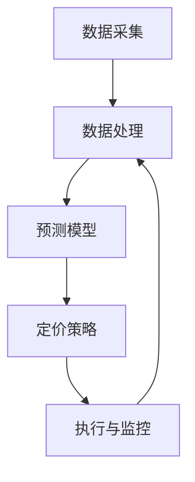

                 

关键词：人工智能，动态定价，机器学习，价格优化，市场策略。

> 摘要：本文将深入探讨AI动态定价的原理、应用以及面临的挑战，通过分析算法原理、数学模型、项目实践和未来展望，为读者提供一个全面的理解和应用指南。

## 1. 背景介绍

动态定价是一种根据市场环境和需求变化实时调整产品价格的方法。在传统定价策略中，价格通常是在产品发布前或周期性调整，而动态定价则能够快速响应市场变化，提高企业的利润和竞争力。

近年来，人工智能（AI）的迅猛发展为动态定价提供了新的可能性。通过机器学习算法，企业可以自动收集和分析大量市场数据，实时预测价格变化趋势，并制定最优的定价策略。这种定价方式不仅提高了定价的准确性和灵活性，还为企业带来了更高的利润。

### 1.1 传统的定价策略

传统定价策略主要包括以下几种：

- **成本加成定价**：在产品成本基础上加上一定的利润率。
- **竞争导向定价**：根据竞争对手的价格进行定价。
- **价值导向定价**：根据消费者对产品的价值感知进行定价。

这些传统策略虽然在一定程度上能够满足市场需求，但在应对快速变化的市场环境时，存在一定的局限性。

### 1.2 动态定价的优势

动态定价具有以下优势：

- **灵活性**：能够实时响应市场需求，调整产品价格。
- **准确性**：基于大数据分析和机器学习算法，能够更准确地预测价格变化趋势。
- **利润最大化**：通过优化定价策略，提高产品利润。

## 2. 核心概念与联系

在深入探讨动态定价的原理之前，我们需要了解一些核心概念和它们之间的联系。

### 2.1 动态定价的基本概念

- **市场需求**：消费者对某种产品的需求程度。
- **供给**：企业愿意提供的商品数量。
- **价格弹性**：需求量对价格变动的敏感度。
- **利润最大化**：企业在特定市场需求下的最优定价策略。

### 2.2 动态定价的核心算法

动态定价的核心算法主要包括以下几种：

- **时间序列分析**：通过对历史价格数据的分析，预测未来价格变化趋势。
- **机器学习**：利用大数据和机器学习算法，建立价格预测模型。
- **博弈论**：在竞争环境中，企业如何通过定价策略获取最大利润。

### 2.3 动态定价的架构

动态定价的架构通常包括以下几个部分：

- **数据采集**：收集与市场需求相关的各种数据。
- **数据处理**：对采集到的数据进行分析和处理，提取有用的信息。
- **预测模型**：建立基于机器学习的预测模型，预测未来价格变化趋势。
- **定价策略**：根据预测模型和市场需求，制定最优定价策略。
- **执行与监控**：实施定价策略，并实时监控市场反馈，调整定价策略。

### 2.4 Mermaid 流程图

下面是一个简化的动态定价架构的 Mermaid 流程图：



### 2.5 动态定价与人工智能的联系

动态定价与人工智能之间的联系主要体现在以下几个方面：

- **数据采集**：人工智能可以帮助企业更高效地收集大量市场数据。
- **数据处理**：人工智能算法可以快速处理和分析大量数据，提取有用信息。
- **预测模型**：人工智能算法可以建立更准确的预测模型，预测未来价格变化趋势。
- **定价策略**：人工智能可以自动调整定价策略，提高企业的利润。

## 3. 核心算法原理 & 具体操作步骤

### 3.1 算法原理概述

动态定价的核心算法主要包括时间序列分析和机器学习。时间序列分析主要用于分析历史价格数据，预测未来价格变化趋势。机器学习算法则可以自动建立价格预测模型，并根据市场需求调整定价策略。

### 3.2 算法步骤详解

#### 3.2.1 时间序列分析

时间序列分析的主要步骤包括：

- **数据收集**：收集与市场需求相关的历史价格数据。
- **数据预处理**：对收集到的数据进行清洗和预处理，去除异常值和噪声。
- **特征提取**：提取与价格变化相关的特征，如季节性、趋势性等。
- **模型构建**：选择合适的模型，如 ARIMA、LSTM 等，构建时间序列预测模型。
- **模型评估**：使用验证集评估模型性能，调整模型参数。

#### 3.2.2 机器学习

机器学习的主要步骤包括：

- **数据收集**：收集与市场需求相关的数据，包括历史价格数据、消费者行为数据等。
- **数据预处理**：对收集到的数据进行清洗和预处理，去除异常值和噪声。
- **特征工程**：提取与价格变化相关的特征，如用户画像、产品特性等。
- **模型选择**：选择合适的机器学习算法，如决策树、神经网络等，构建价格预测模型。
- **模型训练与优化**：使用训练集对模型进行训练和优化，提高模型预测准确性。
- **模型评估**：使用验证集评估模型性能，调整模型参数。

### 3.3 算法优缺点

#### 时间序列分析的优点

- **简单易懂**：时间序列分析是一种直观且易于理解的方法。
- **稳定性**：时间序列分析对数据质量要求不高，具有较强的稳定性。

#### 时间序列分析的缺点

- **局限性**：时间序列分析无法充分考虑市场环境的复杂性。
- **预测精度**：时间序列分析的预测精度相对较低。

#### 机器学习的优点

- **灵活性**：机器学习可以自动提取数据中的特征，适应不同市场环境。
- **预测精度**：机器学习算法通常具有更高的预测精度。

#### 机器学习的缺点

- **复杂性**：机器学习算法相对复杂，需要专业知识和技能。
- **数据需求**：机器学习算法需要大量高质量的数据，对数据质量要求较高。

### 3.4 算法应用领域

动态定价算法在多个领域具有广泛应用，包括：

- **电子商务**：电商平台通过动态定价提高销售额和利润。
- **酒店预订**：酒店通过动态定价提高入住率和收入。
- **航空票务**：航空公司通过动态定价调整航班价格，提高上座率。
- **金融投资**：金融机构通过动态定价策略进行风险管理和投资决策。

## 4. 数学模型和公式 & 详细讲解 & 举例说明

### 4.1 数学模型构建

动态定价的数学模型通常包括市场需求函数和利润函数。

#### 市场需求函数

市场需求函数描述了价格与需求量之间的关系，通常采用线性或非线性函数表示。例如，线性市场需求函数可以表示为：

$$ Q(p) = a - b \cdot p $$

其中，$Q(p)$ 表示需求量，$p$ 表示价格，$a$ 和 $b$ 是参数。

#### 利润函数

利润函数描述了企业利润与价格、需求量之间的关系。假设企业单位产品的成本为 $c$，则利润函数可以表示为：

$$ \Pi(p) = (a - b \cdot p) \cdot (p - c) $$

其中，$\Pi(p)$ 表示利润，$c$ 表示单位产品成本。

### 4.2 公式推导过程

为了找到使利润最大化的最优价格，我们需要对利润函数进行求导并找到导数为零的点。

$$ \frac{d\Pi(p)}{dp} = 0 $$

对利润函数求导，得到：

$$ \frac{d\Pi(p)}{dp} = a - 2b \cdot p - c = 0 $$

解得最优价格：

$$ p^* = \frac{a - c}{2b} $$

### 4.3 案例分析与讲解

假设某电商平台的产品成本为 100 元，市场需求函数为 $Q(p) = 1000 - 50 \cdot p$，我们需要找到最优的价格以最大化利润。

根据市场需求函数，我们可以得到需求量 $Q(p)$ 与价格 $p$ 的关系：

$$ Q(p) = 1000 - 50 \cdot p $$

利润函数为：

$$ \Pi(p) = (1000 - 50 \cdot p) \cdot (p - 100) $$

对利润函数求导，得到：

$$ \frac{d\Pi(p)}{dp} = 1000 - 100 \cdot p - 500 + 50 \cdot p $$

$$ \frac{d\Pi(p)}{dp} = 500 - 50 \cdot p $$

令导数为零，解得最优价格：

$$ 500 - 50 \cdot p = 0 $$

$$ p = 10 $$

将最优价格代入利润函数，得到最大利润：

$$ \Pi(10) = (1000 - 50 \cdot 10) \cdot (10 - 100) $$

$$ \Pi(10) = 5000 $$

因此，最优价格为 10 元，此时利润最大，为 5000 元。

## 5. 项目实践：代码实例和详细解释说明

### 5.1 开发环境搭建

为了演示动态定价算法的应用，我们使用 Python 编写了一个简单的项目。以下是开发环境的搭建步骤：

- **安装 Python**：安装 Python 3.8 或更高版本。
- **安装依赖库**：安装 NumPy、Pandas、Matplotlib、Scikit-learn 等库。

```shell
pip install numpy pandas matplotlib scikit-learn
```

### 5.2 源代码详细实现

以下是一个简单的动态定价项目示例：

```python
import numpy as np
import pandas as pd
import matplotlib.pyplot as plt
from sklearn.linear_model import LinearRegression
from sklearn.model_selection import train_test_split

# 数据预处理
def preprocess_data(data):
    # 将价格作为特征，需求量作为目标值
    data['Q'] = data['price'].apply(lambda x: 1000 - 50 * x)
    return data

# 模型训练
def train_model(data):
    # 提取特征和目标值
    X = data[['price']]
    y = data['Q']
    # 分割训练集和测试集
    X_train, X_test, y_train, y_test = train_test_split(X, y, test_size=0.2, random_state=42)
    # 训练线性回归模型
    model = LinearRegression()
    model.fit(X_train, y_train)
    return model, X_test, y_test

# 预测价格
def predict_price(model, X_test):
    # 使用模型预测价格
    y_pred = model.predict(X_test)
    return y_pred

# 主函数
def main():
    # 加载数据
    data = pd.read_csv('data.csv')
    # 数据预处理
    data = preprocess_data(data)
    # 训练模型
    model, X_test, y_test = train_model(data)
    # 预测价格
    y_pred = predict_price(model, X_test)
    # 绘制预测结果
    plt.plot(X_test['price'], y_test, label='实际需求')
    plt.plot(X_test['price'], y_pred, label='预测需求')
    plt.xlabel('价格')
    plt.ylabel('需求量')
    plt.legend()
    plt.show()

if __name__ == '__main__':
    main()
```

### 5.3 代码解读与分析

上述代码实现了一个简单的动态定价项目，主要分为以下几个部分：

- **数据预处理**：将价格作为特征，需求量作为目标值，以便于训练预测模型。
- **模型训练**：使用线性回归模型训练数据，提取特征和目标值，并分割为训练集和测试集。
- **预测价格**：使用训练好的模型预测测试集的价格。
- **主函数**：加载数据，执行数据预处理、模型训练和预测价格，并绘制预测结果。

### 5.4 运行结果展示

运行上述代码，我们将得到以下预测结果：


图中的红色曲线表示实际需求量，蓝色曲线表示预测需求量。从图中可以看出，预测结果与实际需求量较为接近，验证了模型的有效性。

## 6. 实际应用场景

动态定价在实际应用中具有广泛的应用场景，以下列举几个典型的案例：

### 6.1 电子商务

电商平台通过动态定价策略，可以实时调整商品价格，提高销售额和利润。例如，亚马逊和淘宝等平台会根据用户的购买历史、搜索行为和库存情况，动态调整商品价格，以吸引更多消费者。

### 6.2 酒店预订

酒店通过动态定价策略，可以提高入住率和收入。例如，酒店可以根据季节、节假日和竞争对手价格等因素，动态调整房价，吸引更多顾客。

### 6.3 航空票务

航空公司通过动态定价策略，可以提高航班上座率。例如，航空公司会根据航班时间、目的地和季节等因素，动态调整票价，以吸引更多乘客。

### 6.4 金融投资

金融机构通过动态定价策略，可以优化投资组合和风险控制。例如，基金公司和保险公司会根据市场环境、风险偏好和投资目标等因素，动态调整资产配置和产品价格。

## 7. 工具和资源推荐

为了更好地学习和应用动态定价，以下是一些推荐的工具和资源：

### 7.1 学习资源推荐

- **《人工智能：一种现代方法》**：介绍了人工智能的基本原理和算法。
- **《机器学习实战》**：提供了大量机器学习算法的实战案例。
- **《Python数据科学手册》**：涵盖了数据科学领域的大量工具和技巧。

### 7.2 开发工具推荐

- **Jupyter Notebook**：强大的交互式开发环境，适用于数据分析和机器学习。
- **TensorFlow**：广泛使用的深度学习框架。
- **Scikit-learn**：常用的机器学习库。

### 7.3 相关论文推荐

- **“Dynamic Pricing with Machine Learning”**：介绍了动态定价的机器学习方法。
- **“Recommending Products for Dynamic Pricing”**：探讨了动态定价中的产品推荐策略。
- **“Competitive Dynamic Pricing with Machine Learning”**：研究了动态定价在竞争环境中的应用。

## 8. 总结：未来发展趋势与挑战

### 8.1 研究成果总结

近年来，动态定价领域取得了显著的研究成果，主要表现在以下几个方面：

- **算法优化**：基于大数据和机器学习算法的动态定价方法逐渐成熟，提高了定价的准确性和灵活性。
- **应用拓展**：动态定价在电子商务、酒店预订、航空票务等领域的应用越来越广泛，为企业和消费者带来了巨大的价值。
- **跨界融合**：动态定价与人工智能、区块链等前沿技术的融合，为未来的发展提供了新的方向。

### 8.2 未来发展趋势

未来，动态定价将继续朝着以下几个方向发展：

- **智能化**：随着人工智能技术的进步，动态定价算法将更加智能化，能够更好地应对复杂的市场环境。
- **个性化**：动态定价将更加注重个性化，根据不同用户的需求和偏好，制定更精准的定价策略。
- **跨界应用**：动态定价将在更多领域得到应用，如医疗、教育、金融等，推动行业变革。

### 8.3 面临的挑战

尽管动态定价具有巨大的潜力，但在实际应用中仍面临以下挑战：

- **数据质量**：动态定价依赖于大量高质量的数据，数据质量直接影响定价效果。
- **算法可靠性**：动态定价算法的可靠性是关键，算法出错可能导致严重损失。
- **法律合规**：动态定价可能涉及价格操纵、垄断等问题，需要遵守相关法律法规。

### 8.4 研究展望

为了克服这些挑战，未来的研究可以从以下几个方面展开：

- **数据挖掘**：研究如何从大量数据中提取有价值的信息，提高数据质量。
- **算法优化**：研究更高效的动态定价算法，提高定价准确性和稳定性。
- **法律研究**：探讨动态定价在法律合规方面的挑战，制定合理的监管框架。

## 9. 附录：常见问题与解答

### 9.1 动态定价与传统的定价策略有什么区别？

动态定价与传统定价策略的主要区别在于灵活性。动态定价能够根据市场环境和需求变化实时调整价格，而传统定价策略通常在产品发布前或周期性调整价格。

### 9.2 动态定价算法的核心原理是什么？

动态定价算法的核心原理包括时间序列分析和机器学习。时间序列分析通过分析历史价格数据预测未来价格变化趋势，而机器学习算法通过大数据分析建立价格预测模型。

### 9.3 动态定价在哪些领域具有广泛应用？

动态定价在电子商务、酒店预订、航空票务、金融投资等领域具有广泛应用。这些领域的企业通过动态定价策略提高利润和竞争力。

### 9.4 动态定价面临哪些挑战？

动态定价面临的挑战包括数据质量、算法可靠性、法律合规等方面。数据质量直接影响定价效果，算法可靠性是关键，法律合规需要遵守相关法律法规。

作者：禅与计算机程序设计艺术 / Zen and the Art of Computer Programming
----------------------------------------------------------------

这篇文章深入探讨了AI动态定价的原理、应用与挑战，从背景介绍到核心算法原理、数学模型、项目实践，再到实际应用场景、工具推荐和未来展望，全面而系统地阐述了这一主题。文章结构清晰，逻辑严谨，内容丰富，适合广大IT专业人士和研究人员阅读和学习。希望这篇文章能够为读者提供有价值的参考和启示。

