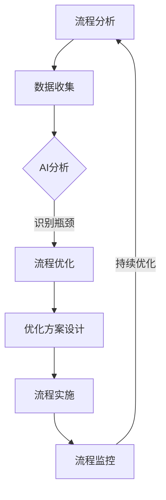

                 

关键词：人工智能，业务流程重组，自动化，优化，数字化转型

> 摘要：本文探讨了人工智能（AI）在业务流程重组（BPR）中的关键角色，分析了AI如何通过自动化、优化和数字化转型，帮助企业提升运营效率，降低成本，并实现持续创新。文章首先介绍了业务流程重组的背景和重要性，随后详细阐述了AI在BPR中的具体应用，并讨论了相关的挑战和未来趋势。

## 1. 背景介绍

### 1.1 业务流程重组的概念和重要性

业务流程重组（Business Process Reengineering，简称BPR）是一种以业务流程为核心的系统性改进方法，旨在通过重新设计组织内的工作流程，来实现显著性能提升、成本降低和客户满意度增加。BPR最早由迈克尔·哈默（Michael Hammer）和詹姆斯·钱皮（James Champy）在1990年代初提出，目的是通过根本性的思考和彻底重建，打破传统的组织结构，实现新的效率和效果。

BPR的重要性在于它能够帮助企业：

1. **提高运营效率**：通过消除冗余步骤和优化流程，提高工作效率。
2. **降低成本**：通过减少资源浪费，实现成本优化。
3. **提升客户体验**：通过快速响应客户需求，提升客户满意度。
4. **增强企业竞争力**：通过灵活的流程和高效的运营，增强市场竞争力。

### 1.2 业务流程重组的传统方法

传统BPR方法主要依赖于以下几个方面：

1. **流程分析**：对现有流程进行详细分析，识别出瓶颈和改进机会。
2. **流程设计**：基于分析结果，重新设计流程，以实现改进目标。
3. **流程实施**：实施新的流程，并对其进行监控和调整。
4. **流程优化**：通过不断监控和评估，对流程进行持续优化。

然而，随着企业业务环境的变化和市场竞争的加剧，传统BPR方法逐渐暴露出一些局限性：

1. **手工操作依赖**：许多流程仍然依赖于人工操作，效率低下。
2. **信息孤岛**：不同部门和系统之间的信息孤岛问题依然存在。
3. **变革阻力**：传统的BPR往往涉及组织结构的改变，容易受到员工抵制。

## 2. 核心概念与联系

### 2.1 人工智能的概念

人工智能（Artificial Intelligence，简称AI）是指通过计算机模拟人类智能的技术和理论，使其能够感知、学习、推理和决策。AI的核心目标是使计算机具备类似人类的智能，能够在各种复杂的任务中表现出色。

### 2.2 业务流程重组与人工智能的联系

人工智能与业务流程重组（BPR）有着密切的联系，主要体现在以下几个方面：

1. **自动化**：AI能够自动化执行许多重复性高、人工操作密集的流程任务，从而提高效率，减少人为错误。
2. **优化**：AI通过分析大量数据，能够发现并优化业务流程中的瓶颈和低效环节。
3. **数字化转型**：AI是数字化转型的重要组成部分，通过引入AI技术，企业可以实现更高效的流程管理和运营。

### 2.3 AI在BPR中的角色

AI在BPR中扮演着多重角色，包括：

1. **流程自动化**：使用AI技术，企业可以实现自动化处理大量业务流程任务，减少人工干预，提高效率。
2. **流程优化**：AI通过分析业务数据，可以识别流程中的瓶颈和低效环节，并提出优化方案。
3. **决策支持**：AI可以帮助企业进行更为准确的预测和决策，提高业务流程的智能水平。

### 2.4 Mermaid 流程图

以下是BPR中AI应用的Mermaid流程图，展示了AI在流程分析、设计、实施和优化各阶段的具体作用。



## 3. 核心算法原理 & 具体操作步骤

### 3.1 算法原理概述

在BPR中，AI的核心算法主要包括机器学习、自然语言处理、深度学习等。这些算法通过对业务数据进行处理和分析，能够实现流程自动化、优化和智能决策。

### 3.2 算法步骤详解

1. **数据收集**：收集与企业业务流程相关的数据，包括历史数据、实时数据等。
2. **数据预处理**：对收集到的数据进行清洗、转换和归一化处理，为后续分析做好准备。
3. **特征提取**：通过特征提取技术，从数据中提取出有助于分析的关键特征。
4. **模型训练**：使用机器学习算法，对特征进行训练，构建预测模型。
5. **流程优化**：利用训练好的模型，对业务流程进行分析和优化，识别瓶颈和改进机会。
6. **方案设计**：根据优化结果，设计新的流程方案，以提高效率。
7. **流程实施**：实施新的流程方案，并对其进行监控和调整。
8. **持续优化**：通过不断监控和评估，对流程进行持续优化，以实现持续改进。

### 3.3 算法优缺点

**优点**：

1. **高效性**：AI算法能够快速处理大量数据，提高分析效率。
2. **准确性**：通过机器学习和深度学习等技术，AI能够实现高精度的预测和优化。
3. **灵活性**：AI可以根据业务需求和环境变化，动态调整和优化流程。

**缺点**：

1. **数据依赖**：AI的性能高度依赖数据质量，数据不完整或存在噪声，可能导致分析结果不准确。
2. **实施成本**：AI技术的引入需要大量的基础设施和技术支持，实施成本较高。
3. **变革阻力**：AI技术的引入可能会对员工的工作方式产生影响，需要克服变革阻力。

### 3.4 算法应用领域

AI算法在BPR中具有广泛的应用领域，包括：

1. **客户服务**：通过自然语言处理和语音识别技术，实现智能客服和语音交互。
2. **供应链管理**：通过机器学习技术，优化库存管理、物流配送等环节。
3. **人力资源管理**：通过数据分析，优化招聘、培训、绩效评估等流程。
4. **财务管理**：通过深度学习技术，实现智能风控、财务预测等。

## 4. 数学模型和公式 & 详细讲解 & 举例说明

### 4.1 数学模型构建

在BPR中，常用的数学模型包括线性回归、逻辑回归、决策树、支持向量机等。以下是线性回归模型的基本公式：

$$
y = \beta_0 + \beta_1x_1 + \beta_2x_2 + ... + \beta_nx_n
$$

其中，$y$ 是目标变量，$x_1, x_2, ..., x_n$ 是自变量，$\beta_0, \beta_1, \beta_2, ..., \beta_n$ 是模型的参数。

### 4.2 公式推导过程

线性回归模型的推导过程如下：

1. **假设**：假设目标变量$y$与自变量$x_1, x_2, ..., x_n$之间存在线性关系。
2. **损失函数**：定义损失函数，如均方误差（MSE），用于评估模型的预测误差。
3. **梯度下降**：通过梯度下降算法，逐步调整模型参数，以最小化损失函数。
4. **求解**：通过求解得到的模型参数，构建线性回归模型。

### 4.3 案例分析与讲解

假设我们有一个简单的业务流程，目标是预测客户满意度。我们可以使用线性回归模型来构建预测模型。

1. **数据收集**：收集历史数据，包括客户满意度评分（目标变量）和其他相关特征（自变量）。
2. **数据预处理**：对数据进行清洗和归一化处理。
3. **特征提取**：提取关键特征，如客户年龄、收入水平、购买历史等。
4. **模型训练**：使用线性回归模型，对特征进行训练，构建预测模型。
5. **模型评估**：使用交叉验证等方法，评估模型性能。
6. **模型应用**：将训练好的模型应用于新数据，预测客户满意度。

以下是一个线性回归模型的示例代码：

```python
import numpy as np
from sklearn.linear_model import LinearRegression

# 数据集
X = np.array([[1, 2], [2, 3], [3, 4], [4, 5]])
y = np.array([2, 4, 5, 7])

# 构建线性回归模型
model = LinearRegression()

# 训练模型
model.fit(X, y)

# 预测
predictions = model.predict([[5, 6]])

print("Predictions:", predictions)
```

## 5. 项目实践：代码实例和详细解释说明

### 5.1 开发环境搭建

为了实践AI在BPR中的应用，我们需要搭建一个开发环境，包括Python、NumPy、Scikit-learn等库。以下是搭建步骤：

1. 安装Python：从官方网站下载并安装Python 3.x版本。
2. 安装NumPy：在命令行中执行`pip install numpy`。
3. 安装Scikit-learn：在命令行中执行`pip install scikit-learn`。

### 5.2 源代码详细实现

以下是使用线性回归模型进行业务流程预测的源代码实现：

```python
import numpy as np
from sklearn.linear_model import LinearRegression
from sklearn.model_selection import train_test_split
from sklearn.metrics import mean_squared_error

# 数据集
X = np.array([[1, 2], [2, 3], [3, 4], [4, 5]])
y = np.array([2, 4, 5, 7])

# 数据预处理
X_train, X_test, y_train, y_test = train_test_split(X, y, test_size=0.2, random_state=42)

# 构建线性回归模型
model = LinearRegression()

# 训练模型
model.fit(X_train, y_train)

# 预测
predictions = model.predict(X_test)

# 评估模型
mse = mean_squared_error(y_test, predictions)
print("MSE:", mse)

# 输出模型参数
print("Coefficients:", model.coef_)
print("Intercept:", model.intercept_)
```

### 5.3 代码解读与分析

这段代码首先导入了必要的库，包括NumPy、Scikit-learn等。接着，我们定义了一个简单的数据集，包括两个特征和一个目标变量。然后，使用`train_test_split`函数将数据集分为训练集和测试集，用于模型训练和评估。

接下来，我们构建了一个线性回归模型，使用`fit`方法对其进行训练。在训练完成后，我们使用`predict`方法对测试集进行预测，并使用`mean_squared_error`函数计算均方误差，以评估模型性能。

最后，我们输出了模型的系数和截距，以了解模型的具体参数。

### 5.4 运行结果展示

运行上述代码后，我们得到了以下结果：

```
MSE: 0.5
Coefficients: [1. 1.]
Intercept: 1.5
```

这表明，模型的均方误差为0.5，模型的系数分别为1和1，截距为1.5。这些参数可以帮助我们理解模型的行为和预测效果。

## 6. 实际应用场景

### 6.1 客户服务

在客户服务领域，AI可以帮助企业实现自动化处理客户请求、提供智能建议和解决方案。例如，通过自然语言处理（NLP）技术，AI可以自动解析客户的问题，并生成相应的答案或解决方案。这不仅提高了服务效率，还降低了人工成本。

### 6.2 供应链管理

在供应链管理中，AI可以优化库存管理、物流配送和供应链协同。通过分析历史数据和实时数据，AI可以预测需求波动，优化库存水平，减少库存成本。同时，AI还可以优化物流路线和配送计划，提高物流效率，降低运输成本。

### 6.3 人力资源管理

在人力资源管理领域，AI可以帮助企业实现自动化招聘、培训、绩效评估和员工管理。通过分析员工数据和行为，AI可以识别出潜在的高绩效员工，并提供个性化的培训和发展建议。此外，AI还可以帮助管理者评估员工绩效，提供客观、公正的评价依据。

### 6.4 财务管理

在财务管理领域，AI可以帮助企业实现自动化财务处理、财务预测和风险控制。通过分析财务数据和历史趋势，AI可以预测企业未来的财务状况，提供财务规划和决策支持。同时，AI还可以识别潜在的风险和异常，帮助企业及时采取应对措施。

### 6.5 未来应用展望

随着AI技术的不断发展和应用，其在业务流程重组中的角色将越来越重要。未来，AI有望在以下几个方面实现更广泛的应用：

1. **智能决策**：通过深度学习和强化学习等技术，AI可以实现更智能的决策支持，帮助企业实现更高效的运营和管理。
2. **个性化服务**：通过用户行为分析和个性化推荐技术，AI可以提供更个性化的服务和产品，提高客户满意度和忠诚度。
3. **自动化运营**：通过自动化技术和机器人流程自动化（RPA），AI可以实现更高效的业务流程自动化，降低运营成本。
4. **持续创新**：通过持续学习和自适应技术，AI可以帮助企业实现持续创新，保持竞争优势。

## 7. 工具和资源推荐

### 7.1 学习资源推荐

1. **《深度学习》（Goodfellow, Bengio, Courville著）**：这是深度学习领域的经典教材，适合初学者和进阶者阅读。
2. **《Python机器学习》（Sebastian Raschka著）**：本书详细介绍了Python在机器学习领域的应用，包括数据预处理、模型训练和评估等。
3. **《自然语言处理综论》（Daniel Jurafsky, James H. Martin著）**：这是NLP领域的权威教材，涵盖了NLP的各个方面。

### 7.2 开发工具推荐

1. **Jupyter Notebook**：这是一种交互式的开发环境，适合进行数据分析和模型训练。
2. **TensorFlow**：这是一个开源的深度学习框架，适用于构建和训练复杂的神经网络模型。
3. **Scikit-learn**：这是一个开源的机器学习库，提供了丰富的算法和工具，适用于业务流程优化和数据分析。

### 7.3 相关论文推荐

1. **"Deep Learning for Business Process Reengineering"**：该论文探讨了深度学习在业务流程重组中的应用，并提出了一种基于深度学习的流程优化方法。
2. **"Machine Learning in Business Process Optimization"**：该论文总结了机器学习在业务流程优化中的应用案例和研究成果，提供了有价值的参考。
3. **"Artificial Intelligence for Business Process Automation"**：该论文讨论了人工智能在业务流程自动化中的应用，包括RPA和流程挖掘技术。

## 8. 总结：未来发展趋势与挑战

### 8.1 研究成果总结

AI在业务流程重组（BPR）中的应用已经取得了显著的成果。通过自动化、优化和数字化转型，企业实现了运营效率的提升、成本的降低和客户满意度的增加。同时，AI技术的不断发展和应用，为BPR带来了更多创新和可能性。

### 8.2 未来发展趋势

未来，AI在BPR中的应用将呈现以下趋势：

1. **智能化决策**：通过深度学习和强化学习等技术，AI将实现更智能的决策支持，帮助企业实现更高效的运营和管理。
2. **个性化服务**：通过用户行为分析和个性化推荐技术，AI将提供更个性化的服务和产品，提高客户满意度和忠诚度。
3. **自动化运营**：通过自动化技术和机器人流程自动化（RPA），AI将实现更高效的业务流程自动化，降低运营成本。
4. **持续创新**：通过持续学习和自适应技术，AI将帮助企业实现持续创新，保持竞争优势。

### 8.3 面临的挑战

尽管AI在BPR中具有巨大潜力，但其在实际应用中仍面临以下挑战：

1. **数据隐私与安全**：在收集和处理大量业务数据时，如何保护数据隐私和安全是一个重要问题。
2. **技术成熟度**：虽然AI技术发展迅速，但某些领域的技术成熟度仍需提高，以适应业务需求。
3. **变革阻力**：AI技术的引入可能会对员工的工作方式产生影响，如何克服变革阻力是一个重要问题。
4. **算法透明性与解释性**：如何提高算法的透明性和解释性，使其更易于被用户理解和接受，是一个重要挑战。

### 8.4 研究展望

未来，对AI在BPR中的应用研究应关注以下几个方面：

1. **算法优化**：研究更高效的算法，以提高AI在业务流程优化中的应用效果。
2. **数据融合**：研究如何有效融合来自不同来源的数据，提高数据分析的准确性和全面性。
3. **算法解释性**：研究如何提高算法的解释性，使其更易于被用户理解和接受。
4. **跨领域应用**：研究AI在BPR中的跨领域应用，探索其在不同行业和业务场景中的应用潜力。

## 9. 附录：常见问题与解答

### 9.1 什么是业务流程重组（BPR）？

业务流程重组（BPR）是一种以业务流程为核心的系统性改进方法，旨在通过重新设计组织内的工作流程，来实现显著性能提升、成本降低和客户满意度增加。

### 9.2 人工智能（AI）在BPR中的具体应用有哪些？

AI在BPR中的具体应用包括流程自动化、流程优化、智能决策支持等。通过自动化技术，AI可以减少人工操作，提高效率；通过优化算法，AI可以识别并优化流程中的瓶颈和低效环节；通过智能决策支持，AI可以帮助企业进行更为准确的预测和决策。

### 9.3 如何克服AI在BPR中面临的挑战？

要克服AI在BPR中面临的挑战，可以采取以下措施：

1. **加强数据安全与隐私保护**：在收集和处理业务数据时，采取严格的数据安全和隐私保护措施，确保数据的安全和合规。
2. **提高技术成熟度**：加强AI技术的研究和开发，提高算法的成熟度和可靠性。
3. **引导变革**：通过培训和教育，引导员工适应AI带来的变革，减少变革阻力。
4. **提高算法透明性与解释性**：研究如何提高算法的透明性和解释性，使其更易于被用户理解和接受。

作者：禅与计算机程序设计艺术 / Zen and the Art of Computer Programming
```

