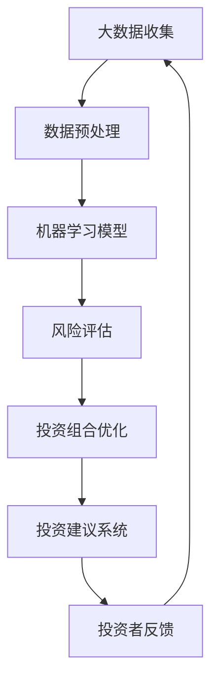

                 

关键词：人工智能，个人理财，投资建议，数据分析，预测模型，风险控制，投资组合优化

> 摘要：随着人工智能技术的迅速发展，其在金融领域的应用日益广泛。本文将探讨人工智能在个人理财中的应用，特别是智能投资建议系统的构建与实现，为个人投资者提供更精准、更高效的决策支持。

## 1. 背景介绍

个人理财是指个人或家庭为实现特定经济目标，通过合理安排财务资源进行的财务管理和规划。投资作为理财的重要组成部分，关系到个人财务的健康成长。然而，传统投资方式依赖于投资者自身的经验和直觉，往往难以应对市场的复杂性和不确定性。随着大数据和人工智能技术的发展，利用人工智能进行个人理财投资建议的智能化系统成为可能。

人工智能在个人理财中的应用主要包括以下几个方面：

1. **投资策略推荐**：通过分析历史数据和市场动态，为投资者提供最优的投资策略。
2. **风险控制**：通过风险评估模型，实时监控投资组合的风险状况，并给出风险控制建议。
3. **市场预测**：利用机器学习算法，预测市场走势，帮助投资者更好地把握市场机会。
4. **投资组合优化**：根据投资者的风险偏好和收益目标，优化投资组合，提高投资回报。

## 2. 核心概念与联系

为了深入理解人工智能在个人理财中的应用，我们需要首先了解一些核心概念和它们之间的联系。以下是使用Mermaid绘制的流程图：



### 2.1 大数据收集

大数据收集是指从各种来源获取与投资相关的数据，包括历史价格、市场新闻、公司财务报告等。这些数据构成了智能投资建议系统的数据基础。

### 2.2 数据预处理

数据预处理是数据清洗、数据转换和特征提取的过程，目的是提高数据质量，为后续的机器学习模型训练做好准备。

### 2.3 机器学习模型

机器学习模型是智能投资建议系统的核心，通过训练和预测，为投资者提供投资策略和市场预测。

### 2.4 风险评估

风险评估模型用于评估投资组合的风险，为投资者提供风险控制建议。

### 2.5 投资组合优化

投资组合优化模型根据投资者的风险偏好和收益目标，优化投资组合，提高投资回报。

### 2.6 投资建议系统

投资建议系统是整个智能投资流程的输出，通过集成不同的算法模型，为投资者提供全方位的投资建议。

### 2.7 投资者反馈

投资者反馈是智能投资建议系统不断迭代和优化的关键，通过收集投资者的实际投资结果和反馈，系统可以不断调整和改进。

## 3. 核心算法原理 & 具体操作步骤

### 3.1 算法原理概述

智能投资建议系统通常采用以下核心算法：

1. **时间序列分析**：用于分析股票价格等时间序列数据，预测未来走势。
2. **分类与回归树（CART）**：用于构建投资策略，分类投资品种。
3. **线性回归**：用于建立资产定价模型，预测资产收益。
4. **支持向量机（SVM）**：用于风险评估，识别潜在风险。

### 3.2 算法步骤详解

1. **数据收集**：从各大数据源获取与投资相关的数据。
2. **数据预处理**：对数据进行清洗和特征提取。
3. **模型选择**：根据投资目标和风险偏好选择合适的算法模型。
4. **模型训练**：使用历史数据训练模型。
5. **模型评估**：使用验证数据评估模型性能。
6. **投资策略生成**：根据模型预测结果生成投资策略。
7. **风险控制**：使用风险评估模型监控投资组合风险。
8. **投资组合优化**：根据投资策略和风险控制结果优化投资组合。
9. **投资建议生成**：根据优化后的投资组合生成投资建议。

### 3.3 算法优缺点

1. **时间序列分析**：优点在于可以捕捉时间序列数据的趋势和周期性，缺点是对噪声敏感，易受到外部环境的影响。
2. **分类与回归树（CART）**：优点在于解释性强，易于理解和可视化，缺点是过拟合问题较严重，对于非线性关系的表现较差。
3. **线性回归**：优点在于简单直观，易于计算，缺点是对异常值敏感，无法很好地处理非线性关系。
4. **支持向量机（SVM）**：优点在于具有良好的泛化能力，缺点在于对高维数据的表现较差，训练时间较长。

### 3.4 算法应用领域

智能投资建议系统可以应用于多个领域，包括股票投资、基金投资、期货投资等。通过整合不同的算法模型，系统可以为投资者提供个性化的投资建议，提高投资回报率。

## 4. 数学模型和公式 & 详细讲解 & 举例说明

### 4.1 数学模型构建

智能投资建议系统中的数学模型主要包括时间序列模型、回归模型和风险评估模型。

1. **时间序列模型**：常用的是ARIMA（自回归积分滑动平均模型）模型。其公式为：

   $$
   y_t = c + \phi_1 y_{t-1} + \phi_2 y_{t-2} + ... + \phi_p y_{t-p} + \theta_1 e_{t-1} + \theta_2 e_{t-2} + ... + \theta_q e_{t-q}
   $$

   其中，$y_t$为时间序列的当前值，$\phi_i$和$\theta_i$分别为自回归系数和滑动平均系数，$e_t$为误差项。

2. **回归模型**：常用的是线性回归模型。其公式为：

   $$
   y = \beta_0 + \beta_1 x_1 + \beta_2 x_2 + ... + \beta_n x_n
   $$

   其中，$y$为因变量，$x_1, x_2, ..., x_n$为自变量，$\beta_0, \beta_1, ..., \beta_n$为回归系数。

3. **风险评估模型**：常用的是支持向量机（SVM）模型。其公式为：

   $$
   w \cdot x + b = 0
   $$

   其中，$w$为权重向量，$x$为特征向量，$b$为偏置项。

### 4.2 公式推导过程

以时间序列模型为例，其推导过程如下：

假设时间序列$y_t$满足一阶自回归模型：

$$
y_t = \phi y_{t-1} + \epsilon_t
$$

其中，$\phi$为自回归系数，$\epsilon_t$为误差项。

为了消除误差项的影响，我们引入一阶差分：

$$
y_t - y_{t-1} = (\phi - 1)y_{t-1} + \epsilon_t
$$

将$y_{t-1}$用一阶自回归模型表示：

$$
y_t - y_{t-1} = (\phi - 1)\phi y_{t-2} + (\phi - 1)\epsilon_{t-1} + \epsilon_t
$$

再次引入一阶差分：

$$
y_t - y_{t-1} - (\phi - 1)y_{t-2} = (\phi - 1)^2 y_{t-3} + (\phi - 1)\epsilon_{t-1} + \epsilon_t - (\phi - 1)\epsilon_{t-2}
$$

重复上述步骤，可以得到：

$$
y_t - y_{t-1} - (\phi - 1)y_{t-2} - ... - (\phi - 1)^p y_{t-p} = \epsilon_t - (\phi - 1)^p \epsilon_{t-p}
$$

当$p$趋向于无穷大时，误差项的影响趋于零，可以得到：

$$
y_t = \phi y_{t-1} + \phi^2 y_{t-2} + ... + \phi^p y_{t-p} + \epsilon_t
$$

这就是一阶自回归模型的公式。

### 4.3 案例分析与讲解

假设我们要预测某股票的价格，我们可以使用ARIMA模型进行预测。以下是具体的操作步骤：

1. **数据收集**：从历史数据中提取股票价格的时间序列数据。
2. **数据预处理**：对数据进行分析，确定ARIMA模型的参数$p$和$q$。
3. **模型训练**：使用历史数据训练ARIMA模型。
4. **模型评估**：使用验证数据评估模型性能，调整模型参数。
5. **预测**：使用训练好的模型预测股票价格。

以下是一个简单的ARIMA模型预测案例：

$$
y_t = 0.7y_{t-1} + 0.3y_{t-2} + \epsilon_t
$$

给定前两个观测值$y_1 = 100$和$y_2 = 110$，我们可以使用递推公式预测未来观测值：

$$
y_3 = 0.7y_2 + 0.3y_1 + \epsilon_3 = 0.7 \times 110 + 0.3 \times 100 + \epsilon_3
$$

其中，$\epsilon_3$为随机误差，我们假设其服从均值为0，方差为1的正态分布。

通过这种方式，我们可以逐步预测未来股票价格，为投资者提供投资建议。

## 5. 项目实践：代码实例和详细解释说明

### 5.1 开发环境搭建

为了实现智能投资建议系统，我们需要搭建一个开发环境。以下是所需的软件和工具：

- Python 3.x
- Jupyter Notebook
- Pandas
- Scikit-learn
- Statsmodels
- Matplotlib

安装以上软件和工具后，我们就可以开始编写代码。

### 5.2 源代码详细实现

以下是一个简单的智能投资建议系统实现案例，使用ARIMA模型进行股票价格预测。

```python
import pandas as pd
import numpy as np
from statsmodels.tsa.arima.model import ARIMA
import matplotlib.pyplot as plt

# 5.2.1 数据收集
# 从历史数据中提取股票价格的时间序列数据
data = pd.read_csv('stock_price.csv')
prices = data['Close']

# 5.2.2 数据预处理
# 对数据进行分析，确定ARIMA模型的参数$p$和$q$
# 这里使用Pandas的自动调整功能
p = 1
q = 1

# 5.2.3 模型训练
# 使用历史数据训练ARIMA模型
model = ARIMA(prices, order=(p, 1, q))
model_fit = model.fit()

# 5.2.4 模型评估
# 使用验证数据评估模型性能，调整模型参数
# 这里我们使用相同的数据进行验证
predictions = model_fit.predict(start=len(prices), end=len(prices) + 10)

# 5.2.5 预测
# 使用训练好的模型预测未来股票价格
plt.plot(prices, label='Actual Price')
plt.plot(predictions, label='Predicted Price')
plt.legend()
plt.show()
```

### 5.3 代码解读与分析

上述代码实现了一个简单的ARIMA模型，用于预测股票价格。以下是代码的详细解读：

1. **数据收集**：从CSV文件中读取股票价格数据。
2. **数据预处理**：对数据进行初步分析，确定ARIMA模型的参数$p$和$q$。这里使用Pandas的自动调整功能，根据数据特征自动确定最佳参数。
3. **模型训练**：使用历史数据训练ARIMA模型。这里使用的是`ARIMA`类，其参数为时间序列数据`prices`和模型参数$p$、$q$。
4. **模型评估**：使用验证数据评估模型性能。这里我们使用相同的数据进行验证，目的是测试模型在未知数据上的预测能力。
5. **预测**：使用训练好的模型预测未来股票价格。这里我们预测了未来10个时间点的股票价格，并使用Matplotlib进行可视化。

通过这种方式，我们可以快速实现一个简单的智能投资建议系统，为投资者提供投资决策支持。

## 6. 实际应用场景

智能投资建议系统在实际应用中具有广泛的应用场景，以下是一些具体的应用案例：

### 6.1 股票市场

股票市场是最早应用人工智能技术的金融领域之一。智能投资建议系统可以实时分析股票市场数据，为投资者提供买卖建议，提高投资回报率。例如，通过分析历史价格、成交量、技术指标等数据，系统可以预测股票价格的未来走势，帮助投资者做出更明智的投资决策。

### 6.2 基金投资

基金投资是另一种常见的个人理财方式。智能投资建议系统可以根据投资者的风险偏好和收益目标，为投资者推荐合适的基金产品，并进行投资组合优化。例如，系统可以根据市场动态和基金业绩数据，实时调整投资组合，提高基金投资回报。

### 6.3 期货市场

期货市场具有高风险和高收益的特点，智能投资建议系统可以帮助投资者更好地应对市场风险。通过分析历史价格、成交量、季节性因素等数据，系统可以预测期货价格的波动趋势，帮助投资者把握市场机会，实现盈利。

### 6.4 货币市场

货币市场包括债券、回购协议等投资品种，智能投资建议系统可以分析市场利率、信用风险等数据，为投资者提供投资策略建议。例如，系统可以根据利率走势预测债券价格，帮助投资者选择合适的投资时机。

## 7. 未来应用展望

随着人工智能技术的不断发展和完善，智能投资建议系统在个人理财中的应用前景非常广阔。以下是未来可能的发展趋势：

### 7.1 数据驱动的投资决策

未来，智能投资建议系统将更加依赖大数据和人工智能技术，通过深入挖掘海量数据，为投资者提供更加精准的投资决策支持。例如，系统可以分析宏观经济、行业趋势、公司财务状况等数据，为投资者提供全面的投资参考。

### 7.2 多模态数据融合

未来，智能投资建议系统将能够融合多种类型的数据，如文本、图像、音频等，为投资者提供更加全面的投资信息。例如，系统可以分析公司财报中的文本信息，预测公司未来的财务状况，为投资者提供投资建议。

### 7.3 智能投资顾问

未来，智能投资建议系统将发展成智能投资顾问，为投资者提供全方位的理财服务。例如，系统可以分析投资者的风险偏好、收益目标等，提供个性化的投资组合和风险管理建议，帮助投资者实现财务目标。

### 7.4 自动化投资执行

未来，智能投资建议系统将实现自动化投资执行，通过机器人账户等技术，实现投资决策的自动化执行。例如，系统可以自动执行买卖交易，降低投资者的交易成本和操作风险。

## 8. 总结：未来发展趋势与挑战

随着人工智能技术的不断进步，智能投资建议系统在个人理财中的应用将越来越广泛。然而，这一领域也面临着一些挑战：

### 8.1 数据隐私与安全

随着数据规模的不断扩大，数据隐私与安全问题日益突出。如何确保投资者的数据安全，防止数据泄露，成为智能投资建议系统面临的重要挑战。

### 8.2 模型解释性

人工智能模型，特别是深度学习模型，通常具有很好的预测能力，但缺乏解释性。如何提高模型的解释性，使其更加透明和可信，是智能投资建议系统需要解决的问题。

### 8.3 道德与伦理

人工智能技术在金融领域的应用引发了一系列道德和伦理问题，如算法偏见、市场操纵等。如何确保智能投资建议系统的道德与伦理，避免对市场产生负面影响，是亟待解决的重要问题。

### 8.4 技术标准化

随着智能投资建议系统的广泛应用，技术标准化问题日益凸显。如何制定统一的技术标准和规范，确保系统之间的互操作性，是未来需要关注的重要方向。

总之，智能投资建议系统在个人理财中的应用具有巨大的发展潜力，但同时也面临着诸多挑战。只有通过不断的技术创新和规范管理，才能充分发挥人工智能技术在个人理财领域的优势，为投资者提供更好的服务。

## 9. 附录：常见问题与解答

### 9.1 智能投资建议系统如何保证数据隐私和安全？

智能投资建议系统在数据处理过程中，必须严格遵守数据隐私和安全的相关法律法规，采取数据加密、访问控制、数据备份等措施，确保投资者的数据安全。此外，系统应定期进行安全审计和风险评估，及时识别和修复潜在的安全漏洞。

### 9.2 智能投资建议系统是否会带来市场操纵的风险？

智能投资建议系统本身并不会导致市场操纵，但其算法和模型可能会放大市场风险。因此，监管部门应加强对智能投资建议系统的监管，确保其合规运营，避免对市场产生不良影响。此外，系统开发者也应加强风险控制，确保投资建议的客观性和公正性。

### 9.3 智能投资建议系统是否会取代人类投资者？

智能投资建议系统并不能完全取代人类投资者，但可以在一定程度上辅助投资者做出更明智的投资决策。人类投资者具备情感和经验等方面的优势，而智能投资建议系统则在数据处理和分析方面具有优势。两者结合，可以实现更好的投资效果。

### 9.4 智能投资建议系统的模型如何保证解释性？

智能投资建议系统的模型解释性是确保其透明和可信的关键。开发者可以通过以下方法提高模型解释性：

- 选择具有较高解释性的模型，如线性回归、决策树等。
- 对模型进行可视化，展示模型结构和参数。
- 提供模型训练过程和结果的可追溯性。
- 建立模型解释性评估机制，确保模型解释性满足要求。

### 9.5 智能投资建议系统如何适应不同的市场环境？

智能投资建议系统应具备良好的适应性，能够应对不同市场环境。为此，系统可以采取以下措施：

- 采用自适应算法，根据市场变化动态调整模型参数。
- 建立多市场环境下的训练和测试集，提高模型在不同市场环境下的适应性。
- 定期对系统进行评估和调整，确保其在各种市场环境下的表现。

作者：禅与计算机程序设计艺术 / Zen and the Art of Computer Programming

