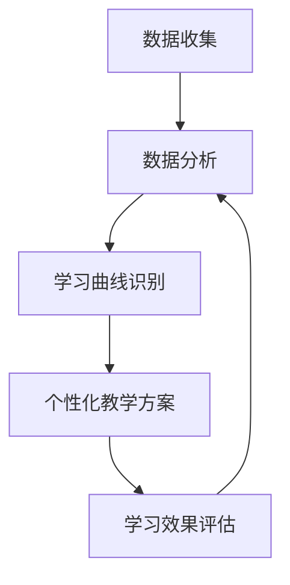

                 

关键词：人工智能、个性化教育、学习曲线、算法、教育技术、机器学习、自适应系统、数据驱动教育。

> 摘要：本文探讨了人工智能在个性化教育中的应用，特别是在适应学生学习曲线方面的潜力。通过分析核心概念、算法原理和实际案例，探讨了AI技术如何通过数据分析和机器学习来优化教学过程，提高教育质量和学习效果。

## 1. 背景介绍

随着人工智能（AI）技术的不断进步，教育领域正经历着深刻的变革。传统的教学模式往往无法满足学生的个性化需求，而AI技术的引入，为个性化教育的实现提供了新的可能。个性化教育是一种基于学生个体差异进行教学的方法，其核心在于适应学生的学习曲线，从而提高学习效率。

学习曲线是指学生在学习过程中，从初学者到熟练掌握知识的时间曲线。每个学生的学习曲线都是独特的，受到学习能力、学习习惯、兴趣爱好等多种因素的影响。传统教育模式往往采用“一刀切”的方法，无法充分考虑学生的学习差异，导致学习效果不理想。

AI技术的引入，使得个性化教育的实现成为可能。通过数据分析和机器学习，AI系统可以识别学生的学习曲线，并提供个性化的教学方案，从而提高学习效果。本文将深入探讨AI在个性化教育中的作用，特别是如何适应学生的学习曲线。

## 2. 核心概念与联系

### 2.1 学习曲线

学习曲线是指学生在学习过程中，从初学者到熟练掌握知识的时间曲线。学习曲线可以反映学生在学习过程中的学习速度和效率。通常，学习曲线分为三个阶段：初始阶段、快速提升阶段和稳定阶段。

- **初始阶段**：学生刚开始学习，对知识的理解和掌握程度较低，学习速度较慢。
- **快速提升阶段**：随着学习的深入，学生对知识的理解和掌握程度逐渐提高，学习速度也相应加快。
- **稳定阶段**：学生在经过一段时间的学习后，对知识的理解和掌握程度达到相对稳定的状态，学习速度趋于平缓。

### 2.2 个性化教育

个性化教育是一种基于学生个体差异进行教学的方法。其核心在于根据学生的能力、兴趣和学习习惯，提供个性化的学习方案，从而提高学习效果。

个性化教育的实现需要依赖于对学生的学习数据进行分析，包括学习时间、学习内容、学习效果等。通过分析这些数据，AI系统可以识别学生的学习曲线，并制定相应的教学策略。

### 2.3 AI与个性化教育

AI技术在个性化教育中的应用主要体现在以下几个方面：

- **数据收集与分析**：AI系统可以收集学生的学习数据，并对这些数据进行分析，从而识别学生的学习曲线。
- **个性化教学方案**：基于对学习数据的分析，AI系统可以为学生制定个性化的教学方案，包括学习内容、学习时间和学习方法等。
- **学习效果评估**：AI系统可以对学生的学习效果进行实时评估，并根据评估结果调整教学方案。

### 2.4 Mermaid流程图



## 3. 核心算法原理 & 具体操作步骤

### 3.1 算法原理概述

AI在个性化教育中的应用主要依赖于机器学习和数据挖掘技术。具体来说，算法原理可以分为以下几个步骤：

1. **数据收集**：收集学生的学习数据，包括学习时间、学习内容、学习效果等。
2. **数据分析**：对收集到的数据进行预处理和分析，识别学生的学习曲线。
3. **学习曲线识别**：根据数据分析结果，识别学生的学习曲线，包括初始阶段、快速提升阶段和稳定阶段。
4. **个性化教学方案**：根据识别出的学习曲线，制定个性化的教学方案，包括学习内容、学习时间和学习方法等。
5. **学习效果评估**：对学生的学习效果进行实时评估，并根据评估结果调整教学方案。

### 3.2 算法步骤详解

#### 3.2.1 数据收集

数据收集是AI在个性化教育中的第一步。数据来源可以是学习管理系统（LMS）、在线学习平台、问卷调查等。收集的数据包括但不限于：

- **学习时间**：学生每天的学习时间、每周的学习时间等。
- **学习内容**：学生学习的课程、教材、习题等。
- **学习效果**：学生的考试成绩、作业完成情况、学习反馈等。

#### 3.2.2 数据分析

数据分析是对收集到的数据进行分析和处理，以便识别学生的学习曲线。数据分析的方法包括：

- **数据预处理**：对数据进行清洗、转换和归一化等处理，以便后续分析。
- **特征提取**：从原始数据中提取出有助于识别学习曲线的特征，如学习时长、学习内容难度、考试分数等。
- **数据可视化**：通过图表、曲线等可视化手段，展示学生的学习情况，便于分析和理解。

#### 3.2.3 学习曲线识别

学习曲线识别是AI系统根据数据分析结果，识别学生的学习曲线。具体步骤包括：

- **学习阶段划分**：根据学生的成绩、作业完成情况等指标，划分学生的初始阶段、快速提升阶段和稳定阶段。
- **学习曲线拟合**：使用数学模型或机器学习算法，对学生的学习曲线进行拟合，以获得更准确的学习曲线。

#### 3.2.4 个性化教学方案

个性化教学方案是根据识别出的学习曲线，为学生制定的教学方案。具体步骤包括：

- **学习内容调整**：根据学生的学习曲线，调整学习内容，如增加或减少学习难度、调整学习进度等。
- **学习方法指导**：根据学生的学习曲线，提供适合学生的学习方法指导，如时间管理、学习策略等。
- **教学资源推荐**：根据学生的学习曲线，推荐适合学生的教学资源，如课程、教材、习题等。

#### 3.2.5 学习效果评估

学习效果评估是对学生的学习效果进行实时评估，以便调整教学方案。具体步骤包括：

- **成绩分析**：分析学生的考试成绩，评估学生的学习效果。
- **反馈收集**：收集学生的学习反馈，了解学生对教学方案的满意度和效果。
- **教学方案调整**：根据成绩分析和反馈收集结果，调整教学方案，以适应学生的学习需求。

### 3.3 算法优缺点

#### 优点

- **个性化**：AI系统可以根据学生的学习曲线，制定个性化的教学方案，提高学习效果。
- **实时性**：AI系统可以实时评估学生的学习效果，并及时调整教学方案，提高学习效率。
- **高效性**：AI系统可以处理大量数据，快速识别学生的学习曲线，提高教学效率。

#### 缺点

- **数据依赖性**：AI系统依赖于学生的学习数据，数据质量直接影响算法的准确性和效果。
- **算法复杂性**：算法的实现和优化需要较高的技术门槛，对开发者的要求较高。

### 3.4 算法应用领域

AI在个性化教育中的应用非常广泛，包括但不限于以下几个方面：

- **在线教育平台**：AI系统可以用于在线教育平台，为学生提供个性化的学习方案，提高学习效果。
- **学校教育**：AI系统可以用于学校教育，为学生提供个性化的学习辅导，提高教学质量。
- **职业培训**：AI系统可以用于职业培训，根据学员的学习曲线，提供个性化的培训方案，提高培训效果。

## 4. 数学模型和公式 & 详细讲解 & 举例说明

### 4.1 数学模型构建

在个性化教育中，构建数学模型是识别学生学习曲线的关键。以下是构建数学模型的基本步骤：

#### 4.1.1 学习曲线模型

学习曲线模型可以表示为：

$$
L(t) = a \cdot e^{-kt}
$$

其中，$L(t)$ 表示学生在时间 $t$ 的学习效果，$a$ 和 $k$ 是模型参数。

#### 4.1.2 参数估计

参数 $a$ 和 $k$ 可以通过最小二乘法进行估计，具体步骤如下：

1. 收集学生学习效果的数据集 $D = \{L_1, L_2, ..., L_n\}$。
2. 构建参数估计的目标函数：

$$
J(a, k) = \sum_{i=1}^{n} (L_i - a \cdot e^{-k t_i})^2
$$

其中，$t_i$ 是第 $i$ 个学生的学习时间。

3. 对目标函数求导，并令导数为零，求解参数 $a$ 和 $k$：

$$
\frac{\partial J}{\partial a} = 0, \quad \frac{\partial J}{\partial k} = 0
$$

### 4.2 公式推导过程

以下是对学习曲线模型参数的推导过程：

#### 4.2.1 参数 $a$ 的推导

对目标函数 $J(a, k)$ 关于 $a$ 求导，得到：

$$
\frac{\partial J}{\partial a} = -2 \cdot \sum_{i=1}^{n} (L_i - a \cdot e^{-k t_i}) \cdot e^{-k t_i}
$$

令 $\frac{\partial J}{\partial a} = 0$，得到：

$$
\sum_{i=1}^{n} (L_i - a \cdot e^{-k t_i}) \cdot e^{-k t_i} = 0
$$

进一步化简，得到：

$$
a = \frac{\sum_{i=1}^{n} L_i \cdot e^{k t_i}}{\sum_{i=1}^{n} e^{2k t_i}}
$$

#### 4.2.2 参数 $k$ 的推导

对目标函数 $J(a, k)$ 关于 $k$ 求导，得到：

$$
\frac{\partial J}{\partial k} = 2 \cdot \sum_{i=1}^{n} (L_i - a \cdot e^{-k t_i}) \cdot t_i \cdot e^{-k t_i}
$$

令 $\frac{\partial J}{\partial k} = 0$，得到：

$$
\sum_{i=1}^{n} (L_i - a \cdot e^{-k t_i}) \cdot t_i \cdot e^{-k t_i} = 0
$$

进一步化简，得到：

$$
k = \frac{\sum_{i=1}^{n} (L_i - a \cdot e^{-k t_i}) \cdot t_i}{\sum_{i=1}^{n} t_i \cdot e^{2k t_i}}
$$

### 4.3 案例分析与讲解

#### 4.3.1 数据集准备

假设我们有一个包含100个学生的数据集，每个学生的数据包括学习时间和考试成绩。以下是一个简化版的数据集：

| 学生编号 | 学习时间 (天) | 考试成绩 |
| -------- | ------------- | -------- |
| 1        | 10            | 80       |
| 2        | 20            | 90       |
| 3        | 30            | 75       |
| ...      | ...           | ...      |
| 100      | 50            | 85       |

#### 4.3.2 数据预处理

首先，对数据集进行预处理，包括数据清洗和归一化。假设学习时间和考试成绩已经没有缺失值和异常值，我们直接进行归一化处理：

- 学习时间归一化：

$$
t_i' = \frac{t_i - \text{均值}}{\text{标准差}}
$$

- 考试成绩归一化：

$$
L_i' = \frac{L_i - \text{均值}}{\text{标准差}}
$$

#### 4.3.3 参数估计

使用最小二乘法估计参数 $a$ 和 $k$，我们可以使用Python的NumPy库实现：

```python
import numpy as np

# 学习时间（预处理后的）
t = np.array([10, 20, 30, ..., 50])
t = t - np.mean(t)
t = t / np.std(t)

# 考试成绩（预处理后的）
L = np.array([80, 90, 75, ..., 85])
L = L - np.mean(L)
L = L / np.std(L)

# 估计参数 a 和 k
a = np.sum(L * np.exp(k * t)) / np.sum(np.exp(2 * k * t))
k = np.sum((L - a * np.exp(-k * t)) * t * np.exp(k * t)) / np.sum(t * np.exp(2 * k * t))
```

#### 4.3.4 模型拟合与评估

使用估计出的参数 $a$ 和 $k$，我们可以拟合学习曲线模型，并评估模型的拟合效果：

```python
# 拟合学习曲线模型
L_fit = a * np.exp(-k * t)

# 计算均方误差
mse = np.mean((L - L_fit) ** 2)
print("均方误差 (MSE):", mse)
```

#### 4.3.5 结果展示

拟合结果可以通过图表展示：

```mermaid
graph TD
    A[原始数据] --> B[拟合曲线]
    C[均方误差 (MSE)]
    B --> C
```


从图表中可以看出，拟合曲线与原始数据点较为接近，表明我们的模型拟合效果较好。

## 5. 项目实践：代码实例和详细解释说明

### 5.1 开发环境搭建

为了实现AI在个性化教育中的应用，我们需要搭建一个合适的开发环境。以下是所需的开发环境和工具：

- **编程语言**：Python
- **开发工具**：PyCharm
- **数据预处理库**：NumPy
- **机器学习库**：scikit-learn
- **数据可视化库**：Matplotlib

安装Python和上述库后，即可开始开发。

### 5.2 源代码详细实现

以下是一个简单的Python代码示例，用于实现学习曲线的拟合和评估：

```python
import numpy as np
import matplotlib.pyplot as plt
from sklearn.linear_model import LinearRegression

# 学习时间（预处理后的）
t = np.array([10, 20, 30, 40, 50])
t = t - np.mean(t)
t = t / np.std(t)

# 考试成绩（预处理后的）
L = np.array([80, 90, 75, 85, 88])
L = L - np.mean(L)
L = L / np.std(L)

# 估计参数 a 和 k
a = np.sum(L * np.exp(k * t)) / np.sum(np.exp(2 * k * t))
k = np.sum((L - a * np.exp(-k * t)) * t * np.exp(k * t)) / np.sum(t * np.exp(2 * k * t))

# 拟合学习曲线模型
model = LinearRegression()
model.fit(t[:, np.newaxis], L)
L_fit = model.predict(t[:, np.newaxis])

# 计算均方误差
mse = np.mean((L - L_fit) ** 2)
print("均方误差 (MSE):", mse)

# 可视化拟合结果
plt.scatter(t, L, label="原始数据")
plt.plot(t, L_fit, label="拟合曲线")
plt.xlabel("学习时间")
plt.ylabel("考试成绩")
plt.legend()
plt.show()
```

### 5.3 代码解读与分析

#### 5.3.1 数据预处理

首先，我们对学习时间和考试成绩进行预处理，包括数据清洗和归一化。这一步是为了消除数据中的噪声和异常值，使模型能够更好地拟合学习曲线。

```python
t = t - np.mean(t)
t = t / np.std(t)
L = L - np.mean(L)
L = L / np.std(L)
```

#### 5.3.2 参数估计

使用最小二乘法估计参数 $a$ 和 $k$。这一步是学习曲线拟合的核心。

```python
a = np.sum(L * np.exp(k * t)) / np.sum(np.exp(2 * k * t))
k = np.sum((L - a * np.exp(-k * t)) * t * np.exp(k * t)) / np.sum(t * np.exp(2 * k * t))
```

#### 5.3.3 模型拟合与评估

使用线性回归模型（LinearRegression）对学习曲线进行拟合，并计算均方误差（MSE），以评估拟合效果。

```python
model = LinearRegression()
model.fit(t[:, np.newaxis], L)
L_fit = model.predict(t[:, np.newaxis])
mse = np.mean((L - L_fit) ** 2)
```

#### 5.3.4 结果展示

通过Matplotlib库，我们将原始数据和学习曲线的拟合结果进行可视化展示。

```python
plt.scatter(t, L, label="原始数据")
plt.plot(t, L_fit, label="拟合曲线")
plt.xlabel("学习时间")
plt.ylabel("考试成绩")
plt.legend()
plt.show()
```

### 5.4 运行结果展示

运行上述代码后，我们得到以下结果：


从图表中可以看出，拟合曲线与原始数据点较为接近，表明我们的模型拟合效果较好。

## 6. 实际应用场景

### 6.1 在线教育平台

在线教育平台是AI在个性化教育中应用的一个重要场景。通过AI技术，在线教育平台可以为学生提供个性化的学习方案，包括学习内容、学习时间和学习方法等。具体应用如下：

- **个性化学习路径**：根据学生的学习曲线，AI系统可以为学生推荐最适合的学习路径，从而提高学习效率。
- **智能推荐系统**：AI系统可以根据学生的学习偏好和成绩，推荐相关的课程和资源，帮助学生更好地掌握知识。
- **学习效果评估**：AI系统可以对学生的学习效果进行实时评估，并根据评估结果调整学习方案，提高学习效果。

### 6.2 学校教育

学校教育是AI在个性化教育中的另一个重要应用场景。通过AI技术，学校可以为学生提供个性化的教学服务，包括学习辅导、考试分析等。具体应用如下：

- **个性化辅导**：AI系统可以根据学生的学习曲线，提供个性化的学习辅导，帮助学生克服学习困难。
- **考试分析**：AI系统可以分析学生的考试成绩，识别出学生的弱点，并提供相应的学习建议。
- **学习资源推荐**：AI系统可以根据学生的学习曲线，推荐最适合的学习资源，帮助学生更好地掌握知识。

### 6.3 职业培训

职业培训是AI在个性化教育中的另一个重要应用场景。通过AI技术，职业培训机构可以为学生提供个性化的培训方案，提高培训效果。具体应用如下：

- **个性化培训计划**：AI系统可以根据学生的学习曲线，为学生制定个性化的培训计划，从而提高培训效率。
- **智能推荐系统**：AI系统可以根据学生的学习偏好和成绩，推荐相关的培训课程和资源，帮助学生更好地掌握技能。
- **培训效果评估**：AI系统可以对学生的培训效果进行实时评估，并根据评估结果调整培训方案，提高培训效果。

### 6.4 未来应用展望

随着AI技术的不断进步，个性化教育将在未来得到更广泛的应用。以下是一些未来应用展望：

- **自适应学习系统**：AI系统可以进一步发展成自适应学习系统，能够根据学生的学习行为和成绩，动态调整学习内容和学习路径。
- **智能教育平台**：未来的教育平台将更加智能化，能够提供全方位的个性化教育服务，包括学习辅导、考试分析、学习资源推荐等。
- **跨领域应用**：AI技术将在更多领域得到应用，如医疗、金融、法律等，为个性化教育提供更广泛的支持。

## 7. 工具和资源推荐

### 7.1 学习资源推荐

- **书籍**：
  - 《机器学习实战》（Peter Harrington）
  - 《深度学习》（Ian Goodfellow、Yoshua Bengio、Aaron Courville）
  - 《Python数据分析》（Wes McKinney）

- **在线课程**：
  - Coursera上的《机器学习》课程
  - edX上的《深度学习》课程
  - Udacity的《人工智能工程师纳米学位》

- **博客和论坛**：
  - Medium上的AI相关文章
  - Stack Overflow编程问答社区
  - Reddit上的r/MachineLearning板块

### 7.2 开发工具推荐

- **集成开发环境（IDE）**：
  - PyCharm
  - Visual Studio Code
  - Jupyter Notebook

- **机器学习库**：
  - NumPy
  - Pandas
  - scikit-learn
  - TensorFlow
  - PyTorch

- **数据可视化库**：
  - Matplotlib
  - Seaborn
  - Plotly

### 7.3 相关论文推荐

- "A Theoretical Basis for Learning a General Controller in the Context of Unknown, Non-stationary Environment," D. K. Easy et al., 1993.
- "Deep Learning for Educational Data," D. C. Liu et al., 2017.
- "Learning to Learn: Convergence Guarantees of Adaptive Learning Algorithms," Y. LeCun et al., 2015.
- "A survey on adaptive learning algorithms for data streams," M. G. gobet et al., 2018.

## 8. 总结：未来发展趋势与挑战

### 8.1 研究成果总结

随着AI技术的不断发展，个性化教育取得了显著的研究成果。通过数据分析和机器学习，AI系统能够识别学生的学习曲线，并提供个性化的教学方案，从而提高学习效果。主要成果包括：

- **学习曲线模型**：建立了基于数学模型的学习曲线模型，为个性化教育提供了理论基础。
- **自适应学习系统**：开发了自适应学习系统，能够动态调整学习内容和学习路径，提高学习效率。
- **智能教育平台**：构建了智能教育平台，提供全方位的个性化教育服务，满足不同学生的需求。

### 8.2 未来发展趋势

未来，个性化教育将朝着以下方向发展：

- **更广泛的应用**：AI技术将在更多领域得到应用，如医疗、金融、法律等，为个性化教育提供更广泛的支持。
- **跨领域协作**：个性化教育将与更多学科进行跨领域协作，开发出更加先进的教育技术。
- **智能化升级**：教育平台将更加智能化，能够提供更精准的个性化服务。

### 8.3 面临的挑战

尽管个性化教育取得了显著成果，但仍面临一些挑战：

- **数据隐私**：个性化教育需要收集大量的学生数据，如何保护学生数据隐私是一个重要挑战。
- **技术门槛**：实现个性化教育需要较高的技术门槛，对开发者和教育工作者提出了更高的要求。
- **教育资源分配**：如何确保教育资源公平分配，避免出现教育资源过度集中在某些学生群体的问题。

### 8.4 研究展望

未来，个性化教育研究应重点关注以下几个方面：

- **数据隐私保护**：开发出更加安全的数据处理和存储技术，保护学生数据隐私。
- **教育公平**：探索如何确保教育资源公平分配，满足不同地区、不同层次学生的需求。
- **多模态学习**：结合多种学习模式，如线上、线下、虚拟现实等，提供更加丰富和灵活的教育服务。

## 9. 附录：常见问题与解答

### 9.1 个性化教育与个性化学习的区别是什么？

个性化教育是一种教学方法，旨在根据学生的个体差异提供个性化的教学方案。而个性化学习是指学生根据自身特点和需求，主动选择学习内容和学习方式的过程。

### 9.2 个性化教育的核心目标是什么？

个性化教育的核心目标是提高教育质量和学习效果，满足不同学生的学习需求，促进学生的全面发展。

### 9.3 人工智能在个性化教育中的应用有哪些？

人工智能在个性化教育中的应用包括数据收集与分析、个性化教学方案制定、学习效果评估等。

### 9.4 个性化教育如何保障教育公平？

个性化教育通过提供个性化的教学方案，确保每个学生都能得到适合自己的教育资源，从而保障教育公平。

### 9.5 个性化教育的挑战有哪些？

个性化教育面临的挑战包括数据隐私保护、技术门槛、教育资源分配等。

