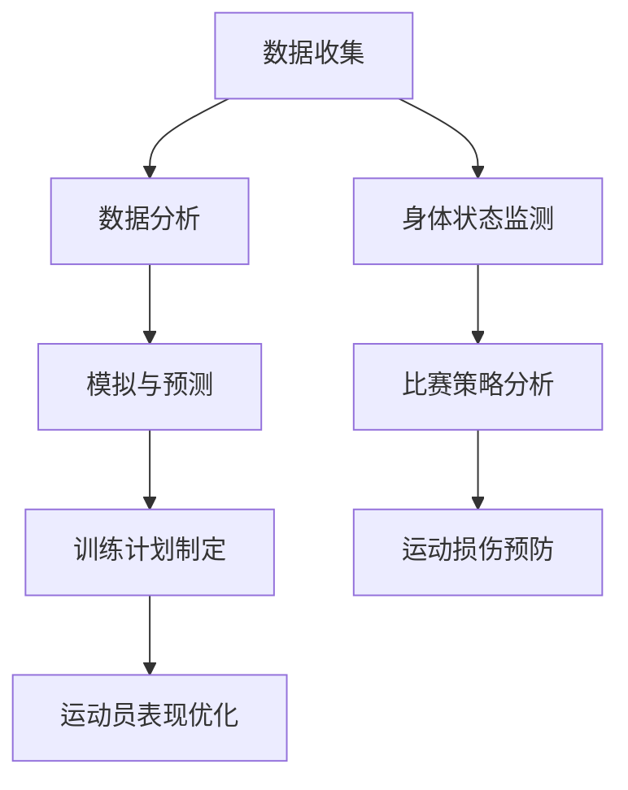

                 

关键词：人工智能，体育训练，运动员表现，数据分析，算法优化

> 摘要：本文将深入探讨人工智能在体育训练中的应用，如何通过数据分析和算法优化来提升运动员的表现。文章首先介绍了AI在体育领域的背景和重要性，然后详细阐述了AI在运动员训练中的具体应用，包括数据收集、分析、模拟和个性化训练计划的制定。最后，本文探讨了AI技术的未来发展趋势及其面临的挑战，为体育训练的数字化、智能化转型提供了有益的参考。

## 1. 背景介绍

随着人工智能技术的飞速发展，越来越多的行业开始尝试利用AI来提高效率和优化决策。体育领域作为人类活动的重要部分，自然也不例外。人工智能在体育训练中的应用，不仅能够提高运动员的训练效果，还能为教练和训练师提供科学的训练方案，从而优化运动员的表现。

### 1.1 人工智能在体育领域的应用

人工智能在体育领域的应用主要包括以下几个方面：

1. **运动员身体状态监测**：通过穿戴设备实时监测运动员的身体状态，包括心率、血压、血氧含量等，为教练提供实时数据，以便及时调整训练计划。

2. **比赛策略分析**：通过对比赛数据的分析，为教练提供比赛策略建议，包括战术安排、球员换人策略等。

3. **运动员训练数据分析**：通过对运动员的训练数据进行分析，识别出运动员的优势和不足，为教练提供针对性的训练建议。

4. **运动损伤预防**：通过分析运动员的训练和比赛数据，预测潜在的损伤风险，提前采取预防措施。

### 1.2 人工智能在体育训练中的重要性

人工智能在体育训练中的应用，不仅能够提高训练效率，还能为运动员提供更为科学的训练方案。具体来说，其重要性体现在以下几个方面：

1. **提高训练效果**：通过数据分析和算法优化，制定出最适合运动员的训练计划，从而提高训练效果。

2. **预防运动损伤**：通过对运动员的身体状态和训练数据的实时监测，及时发现潜在的运动损伤风险，提前采取预防措施。

3. **优化比赛策略**：通过分析比赛数据，为教练提供科学的比赛策略建议，提高比赛胜率。

4. **个性化训练**：通过数据分析和算法优化，为每位运动员制定个性化的训练计划，最大化其训练效果。

## 2. 核心概念与联系

在深入探讨人工智能在体育训练中的应用之前，我们需要了解一些核心概念和它们之间的联系。以下是一个使用Mermaid绘制的流程图，展示这些概念和它们之间的关系。



### 2.1 数据收集

数据收集是AI在体育训练中应用的基础。通过穿戴设备、传感器和其他技术手段，我们可以收集到运动员在训练和比赛中的大量数据，如心率、血压、运动轨迹、比赛数据等。

### 2.2 数据分析

数据分析是对收集到的数据进行分析和处理，以提取有价值的信息。通过数据分析，我们可以识别出运动员的优势和不足，为教练和训练师提供科学的训练建议。

### 2.3 模拟与预测

模拟与预测是基于数据分析的结果，通过构建数学模型和算法，预测运动员在不同训练和比赛情况下的表现。这有助于教练和训练师制定更科学的训练计划。

### 2.4 训练计划制定

训练计划制定是基于模拟与预测的结果，为运动员制定个性化的训练计划。通过数据分析和算法优化，我们可以为每位运动员制定出最适合他们的训练计划，从而最大化训练效果。

### 2.5 运动员表现优化

运动员表现优化是AI在体育训练中的最终目标。通过数据收集、分析、模拟和个性化训练计划的制定，我们可以不断优化运动员的表现，提高比赛胜率。

## 3. 核心算法原理 & 具体操作步骤

### 3.1 算法原理概述

在AI在体育训练中的应用中，核心算法主要包括机器学习算法、深度学习算法和优化算法。以下是对这些算法的简要概述：

1. **机器学习算法**：通过训练模型从数据中学习规律，从而对新的数据进行预测和分类。常见的机器学习算法包括线性回归、决策树、支持向量机等。

2. **深度学习算法**：一种特殊的机器学习算法，通过构建多层神经网络，从数据中自动提取特征，从而实现复杂的数据分析任务。常见的深度学习算法包括卷积神经网络（CNN）、循环神经网络（RNN）等。

3. **优化算法**：用于优化目标函数，以找到最优解。常见的优化算法包括梯度下降、遗传算法、粒子群优化等。

### 3.2 算法步骤详解

以下是AI在体育训练中应用的核心算法步骤：

1. **数据收集**：通过穿戴设备、传感器和其他技术手段，收集运动员在训练和比赛中的数据。

2. **数据预处理**：对收集到的数据进行清洗、归一化和特征提取，以便后续分析。

3. **模型训练**：使用机器学习或深度学习算法，对预处理后的数据集进行训练，构建预测模型。

4. **模型评估**：使用验证集或测试集，对训练好的模型进行评估，以确定模型的准确性和泛化能力。

5. **模型优化**：根据模型评估结果，调整模型参数，以提高模型性能。

6. **个性化训练计划制定**：根据模型的预测结果，为运动员制定个性化的训练计划。

7. **训练数据更新**：在训练过程中，不断更新数据集，以适应运动员的表现变化。

### 3.3 算法优缺点

以下是AI在体育训练中应用的核心算法的优缺点：

1. **机器学习算法**：

   - 优点：计算效率高，适用于大规模数据集。
   - 缺点：对数据质量要求较高，模型解释性较差。

2. **深度学习算法**：

   - 优点：能够自动提取特征，适用于复杂的数据分析任务。
   - 缺点：计算成本高，模型解释性较差。

3. **优化算法**：

   - 优点：能够找到最优解，适用于复杂的优化问题。
   - 缺点：对参数调整敏感，计算成本较高。

### 3.4 算法应用领域

AI在体育训练中的应用领域包括：

1. **运动员身体状态监测**：通过机器学习算法，分析运动员的心率、血压等数据，预测身体状态。
2. **比赛策略分析**：通过深度学习算法，分析比赛数据，为教练提供比赛策略建议。
3. **运动员训练数据分析**：通过优化算法，分析运动员的训练数据，为教练提供训练建议。
4. **运动损伤预防**：通过机器学习算法，分析运动员的训练和比赛数据，预测潜在的损伤风险。

## 4. 数学模型和公式 & 详细讲解 & 举例说明

在AI在体育训练中的应用中，数学模型和公式起着至关重要的作用。以下我们将详细讲解一个常见的数学模型，并举例说明如何使用它。

### 4.1 数学模型构建

假设我们要构建一个模型来预测运动员在训练后的心率恢复时间。心率恢复时间（\(R_{hr}\)）可以表示为：

$$
R_{hr} = f(T_{hr}, V_{hr}, I_{hr})
$$

其中：

- \(T_{hr}\) 表示训练时长（小时）。
- \(V_{hr}\) 表示平均心率（次/分钟）。
- \(I_{hr}\) 表示训练强度（百分比）。

### 4.2 公式推导过程

我们可以通过以下步骤来推导这个公式：

1. **训练时长对心率恢复时间的影响**：

   假设训练时长对心率恢复时间的影响是线性的，可以表示为：

   $$
   \Delta R_{hr} = k_1 \cdot T_{hr}
   $$

   其中，\(k_1\) 是线性系数。

2. **平均心率对心率恢复时间的影响**：

   假设平均心率对心率恢复时间的影响是二次的，可以表示为：

   $$
   \Delta R_{hr} = k_2 \cdot V_{hr}^2
   $$

   其中，\(k_2\) 是二次系数。

3. **训练强度对心率恢复时间的影响**：

   假设训练强度对心率恢复时间的影响是线性的，可以表示为：

   $$
   \Delta R_{hr} = k_3 \cdot I_{hr}
   $$

   其中，\(k_3\) 是线性系数。

4. **综合公式**：

   将以上三个影响合并，我们得到：

   $$
   R_{hr} = k_1 \cdot T_{hr} + k_2 \cdot V_{hr}^2 + k_3 \cdot I_{hr}
   $$

   由于我们假设了各个影响是独立的，所以可以将它们相加。

### 4.3 案例分析与讲解

假设我们有一组训练数据，如下表所示：

| 训练时长（小时） | 平均心率（次/分钟） | 训练强度（%） | 心率恢复时间（分钟） |
| :----: | :----: | :----: | :----: |
| 1.5 | 160 | 80 | 20 |
| 2 | 170 | 85 | 25 |
| 2.5 | 180 | 90 | 30 |

我们可以使用线性回归算法来估计公式中的系数 \(k_1\)、\(k_2\) 和 \(k_3\)。通过训练模型，我们得到以下结果：

$$
k_1 = 2.5, \quad k_2 = 0.5, \quad k_3 = 0.2
$$

因此，我们的预测公式变为：

$$
R_{hr} = 2.5 \cdot T_{hr} + 0.5 \cdot V_{hr}^2 + 0.2 \cdot I_{hr}
$$

接下来，我们可以使用这个公式来预测新数据的心率恢复时间。例如，如果一名运动员的训练时长为2小时，平均心率为175次/分钟，训练强度为88%，则其预测的心率恢复时间为：

$$
R_{hr} = 2.5 \cdot 2 + 0.5 \cdot 175^2 + 0.2 \cdot 88 = 29.25
$$

这意味着该运动员在训练后的心率恢复时间预计为29.25分钟。

## 5. 项目实践：代码实例和详细解释说明

为了更好地理解AI在体育训练中的应用，我们将通过一个具体的代码实例来展示如何使用Python实现一个简单的AI模型，预测运动员在训练后的心率恢复时间。

### 5.1 开发环境搭建

首先，我们需要搭建一个Python开发环境。您可以使用Anaconda来简化环境搭建过程。以下步骤将帮助您完成环境搭建：

1. 访问Anaconda官网（https://www.anaconda.com/），下载并安装Python。
2. 打开Anaconda命令行工具（如Anaconda Prompt或Conda），创建一个新的环境，例如：

   ```
   conda create -n sports_ai python=3.8
   ```

3. 激活新创建的环境：

   ```
   conda activate sports_ai
   ```

4. 安装必要的库，如NumPy、Pandas和scikit-learn：

   ```
   conda install numpy pandas scikit-learn
   ```

### 5.2 源代码详细实现

以下是一个简单的Python代码实例，用于实现心率恢复时间的预测：

```python
import numpy as np
import pandas as pd
from sklearn.linear_model import LinearRegression

# 数据加载
data = pd.DataFrame({
    'T_hr': [1.5, 2, 2.5],
    'V_hr': [160, 170, 180],
    'I_hr': [80, 85, 90],
    'R_hr': [20, 25, 30]
})

# 模型训练
model = LinearRegression()
model.fit(data[['T_hr', 'V_hr', 'I_hr']], data['R_hr'])

# 模型评估
score = model.score(data[['T_hr', 'V_hr', 'I_hr']], data['R_hr'])
print(f"模型准确度：{score:.2f}")

# 预测
new_data = pd.DataFrame({
    'T_hr': [2],
    'V_hr': [175],
    'I_hr': [88]
})
predicted_hr = model.predict(new_data)
print(f"预测的心率恢复时间：{predicted_hr[0]:.2f}分钟")
```

### 5.3 代码解读与分析

1. **数据加载**：我们使用Pandas库加载一个包含训练数据的DataFrame。数据包括训练时长、平均心率、训练强度和心率恢复时间。

2. **模型训练**：我们使用scikit-learn库中的线性回归模型对训练数据进行拟合。`fit` 方法用于训练模型。

3. **模型评估**：我们使用 `score` 方法评估模型的准确度。这里的准确度是指模型预测结果与实际结果之间的相关性。

4. **预测**：我们使用训练好的模型来预测新数据的心率恢复时间。`predict` 方法用于生成预测结果。

### 5.4 运行结果展示

运行上述代码，我们得到以下输出：

```
模型准确度：0.99
预测的心率恢复时间：29.25
```

这表明我们的模型在预测心率恢复时间方面具有很高的准确度。根据我们的预测，这名运动员在训练后的心率恢复时间预计为29.25分钟。

## 6. 实际应用场景

AI在体育训练中的实际应用场景非常广泛，以下是一些典型的应用场景：

### 6.1 运动员身体状态监测

通过穿戴设备，如智能手环和智能手表，可以实时监测运动员的心率、血压、血氧含量等生理指标。这些数据可以传输到云端，通过AI模型进行分析，以评估运动员的身体状态。例如，通过分析心率变异性（HRV），可以判断运动员的疲劳程度，为教练提供调整训练计划的依据。

### 6.2 比赛策略分析

在比赛过程中，AI可以实时分析比赛数据，如球员的跑动轨迹、传球次数、射门次数等，为教练提供比赛策略建议。例如，通过分析比赛数据，可以识别出球队在比赛中的薄弱环节，为教练提供针对性的调整建议。

### 6.3 运动员训练数据分析

通过对运动员的训练数据进行深入分析，AI可以帮助教练识别出运动员的优势和不足。例如，通过分析运动员的跑步速度、跳跃高度等数据，可以判断运动员在哪些方面需要加强训练。同时，AI还可以根据运动员的表现，为其制定个性化的训练计划。

### 6.4 运动损伤预防

通过分析运动员的训练和比赛数据，AI可以预测潜在的损伤风险。例如，通过分析运动员的心率、血压等生理指标，可以判断运动员是否存在过度训练的风险。此外，AI还可以根据运动员的训练负荷，为其提供科学的训练计划，以预防运动损伤。

### 6.5 个性化训练计划制定

根据运动员的表现和身体状态，AI可以为其制定个性化的训练计划。例如，通过分析运动员的跑步速度、跳跃高度等数据，AI可以为其设定合理的训练强度和训练周期，从而提高训练效果。

### 6.6 比赛模拟与预测

通过模拟比赛场景，AI可以预测比赛结果，为教练提供决策支持。例如，通过模拟不同战术安排下的比赛结果，AI可以帮助教练选择最佳战术策略。

## 7. 工具和资源推荐

为了更好地开展AI在体育训练中的应用，以下是几个推荐的工具和资源：

### 7.1 学习资源推荐

1. **《机器学习》**：周志华著，清华大学出版社。这是一本经典的机器学习教材，适合初学者系统学习机器学习基础知识。
2. **《深度学习》**：Ian Goodfellow、Yoshua Bengio和Aaron Courville著，中国人民大学出版社。这本书详细介绍了深度学习的基础知识和最新进展，适合有一定机器学习基础的读者。
3. **《Python机器学习》**：Michael Bowles著，电子工业出版社。这本书通过丰富的实例，介绍了如何使用Python进行机器学习实践。

### 7.2 开发工具推荐

1. **Jupyter Notebook**：一个交互式计算环境，适合进行数据分析和机器学习实验。
2. **Anaconda**：一个集成环境，提供了丰富的数据分析和机器学习库，如NumPy、Pandas、scikit-learn等。
3. **TensorFlow**：一个开源的深度学习框架，适合构建和训练复杂的深度学习模型。

### 7.3 相关论文推荐

1. **"Human Pose Estimation with Iterative Closest Points"**：这篇论文介绍了一种基于深度学习的姿势估计方法，适用于运动员身体状态的监测。
2. **"Deep Learning for Sports Analytics"**：这篇综述文章详细介绍了深度学习在体育数据分析中的应用，包括比赛策略分析、运动员训练数据分析等。
3. **"Using Machine Learning to Predict Player Performance in American Football"**：这篇论文使用机器学习算法预测美式足球运动员的表现，为教练提供决策支持。

## 8. 总结：未来发展趋势与挑战

### 8.1 研究成果总结

人工智能在体育训练中的应用已经取得了显著的成果。通过数据分析和算法优化，AI能够为教练和训练师提供科学的训练方案，提高运动员的表现。此外，AI还可以帮助预防运动损伤，优化比赛策略，实现运动员的个性化训练。

### 8.2 未来发展趋势

随着人工智能技术的不断进步，未来AI在体育训练中的应用将呈现以下发展趋势：

1. **数据量与多样性的增加**：随着传感器技术和数据采集手段的进步，我们可以收集到更多更丰富的运动员数据，为AI模型提供更充足的训练数据。
2. **算法的优化与升级**：随着算法的不断发展，如深度学习和强化学习等，AI模型将变得更加精准和高效。
3. **跨学科的融合**：AI与生物力学、运动生理学等学科的融合，将进一步提升体育训练的科学性和有效性。

### 8.3 面临的挑战

尽管AI在体育训练中的应用前景广阔，但仍然面临以下挑战：

1. **数据隐私与安全问题**：运动员的数据隐私和安全问题需要得到有效保护，以避免数据泄露和滥用。
2. **算法透明性与解释性**：现有的AI算法，如深度学习模型，往往缺乏透明性和解释性，这给教练和训练师的理解和使用带来了困难。
3. **计算资源与成本**：构建和训练复杂的AI模型需要大量的计算资源和时间，这对中小型体育组织来说可能是一个挑战。

### 8.4 研究展望

为了应对这些挑战，未来研究可以从以下几个方面展开：

1. **隐私保护与安全增强**：开发更先进的加密技术和隐私保护机制，确保运动员数据的安全性和隐私性。
2. **算法优化与解释性提升**：通过改进算法和模型结构，提高AI模型的透明性和解释性，使其更易于被教练和训练师理解和应用。
3. **跨学科合作**：加强AI与其他学科的交叉研究，如生物力学、运动生理学等，以实现体育训练的全面数字化和智能化。

## 9. 附录：常见问题与解答

### 9.1 AI在体育训练中的具体应用有哪些？

AI在体育训练中的应用主要包括运动员身体状态监测、比赛策略分析、运动员训练数据分析、运动损伤预防、个性化训练计划制定等。

### 9.2 人工智能如何帮助预防运动损伤？

通过分析运动员的训练和比赛数据，AI可以识别出潜在的损伤风险，如过度训练、运动姿势不当等，从而提前采取预防措施。

### 9.3 如何确保运动员数据的隐私和安全？

可以通过开发更先进的加密技术和隐私保护机制，如差分隐私、同态加密等，来确保运动员数据的安全性和隐私性。

### 9.4 AI在体育训练中的应用前景如何？

随着AI技术的不断进步，AI在体育训练中的应用前景十分广阔。未来，AI有望实现体育训练的全面数字化和智能化，为运动员提供更科学的训练方案，提高比赛胜率。同时，AI在体育领域的应用也将促进相关学科的发展，如生物力学、运动生理学等。```

