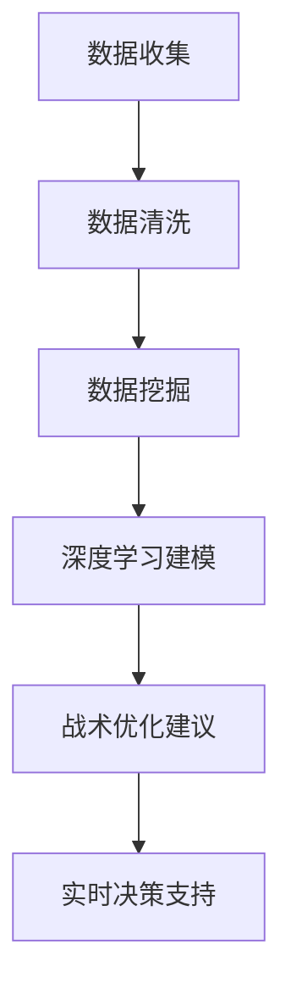

                 

关键词：AI、体育赛事分析、战术优化、深度学习、数据挖掘、实时决策支持

> 摘要：本文深入探讨了人工智能在体育赛事分析中的应用，特别是战术优化方面的研究。通过分析现有技术和方法，本文提出了一个基于深度学习和数据挖掘的综合模型，以实现实时战术优化。本文不仅展示了模型的构建和实现，还讨论了其在实际应用中的效果和未来发展趋势。

## 1. 背景介绍

随着科技的发展，人工智能（AI）已经成为现代体育产业不可或缺的一部分。AI在体育赛事分析中的应用越来越广泛，涵盖了数据挖掘、实时决策支持、伤病预测等多个方面。然而，战术优化作为体育比赛中的关键环节，其研究与应用相对较少。战术优化不仅关系到球队的整体表现，还能提高比赛观赏性和竞技水平。

传统战术优化方法主要依赖于人工分析，耗时耗力且不够准确。随着大数据和计算技术的进步，AI技术为战术优化提供了新的可能性。本文旨在通过深度学习、数据挖掘等技术，提出一种实时战术优化模型，以提升体育赛事分析的专业性和精确性。

## 2. 核心概念与联系

### 2.1 深度学习

深度学习是AI的一个重要分支，通过模拟人脑的神经网络结构，对大量数据进行分析和建模。在体育赛事分析中，深度学习可以用于挖掘比赛数据中的潜在规律和趋势，从而为战术优化提供科学依据。

### 2.2 数据挖掘

数据挖掘是用于发现数据中隐含模式、规律和知识的方法和技术。在体育赛事分析中，数据挖掘可以帮助我们识别比赛中的关键因素，如球员表现、战术运用等，从而为战术优化提供数据支持。

### 2.3 实时决策支持

实时决策支持系统可以实时分析比赛数据，为教练和球员提供战术建议。这种系统通常依赖于高性能计算和云计算技术，以确保快速响应和准确分析。

### 2.4 Mermaid 流程图



## 3. 核心算法原理 & 具体操作步骤

### 3.1 算法原理概述

本文提出的战术优化模型基于深度学习和数据挖掘技术，主要分为以下几个步骤：

1. 数据收集与清洗：收集比赛数据，包括球员表现、比赛结果、战术运用等，并进行清洗处理，确保数据质量。
2. 数据挖掘：对清洗后的数据进行分析，识别比赛中的关键因素和规律。
3. 深度学习建模：利用深度学习算法，构建模型以预测比赛结果和战术效果。
4. 战术优化建议：根据模型预测结果，为教练和球员提供实时战术优化建议。
5. 实时决策支持：通过实时决策支持系统，将战术优化建议传递给教练和球员。

### 3.2 算法步骤详解

#### 3.2.1 数据收集与清洗

数据收集是战术优化模型的基础。本文采用的数据来源包括官方比赛数据、球员统计数据和社交媒体数据。在数据清洗阶段，我们采用了一些常见的数据预处理方法，如缺失值处理、异常值检测和特征提取。

#### 3.2.2 数据挖掘

数据挖掘阶段主要包括以下步骤：

1. 关键因素识别：通过相关性分析和回归分析，识别比赛中的关键因素。
2. 趋势分析：利用时间序列分析方法，分析比赛中的长期趋势和短期波动。

#### 3.2.3 深度学习建模

在深度学习建模阶段，我们采用了卷积神经网络（CNN）和循环神经网络（RNN）两种模型，以分别处理图像和序列数据。

1. CNN模型：用于处理球员表现数据，提取空间特征。
2. RNN模型：用于处理比赛结果数据，提取时间特征。

#### 3.2.4 战术优化建议

根据模型预测结果，我们为教练和球员提供了以下战术优化建议：

1. 球员调度：根据球员状态和比赛进程，调整球队阵容。
2. 攻守转换：根据比赛局势，调整攻守策略。

#### 3.2.5 实时决策支持

实时决策支持系统通过云计算平台，实时分析比赛数据，并将战术优化建议发送给教练和球员。系统还包括一个可视化界面，方便教练和球员查看和分析战术建议。

### 3.3 算法优缺点

#### 优点

1. 高度自动化：算法自动收集、分析和提供战术优化建议，减少了人工干预。
2. 精准高效：利用深度学习和数据挖掘技术，提高了战术优化的准确性和效率。
3. 实时响应：通过实时决策支持系统，确保战术优化建议的实时性和有效性。

#### 缺点

1. 数据依赖：算法的准确性取决于数据的质量和完整性。
2. 计算资源消耗：深度学习建模需要大量的计算资源，对硬件要求较高。

### 3.4 算法应用领域

本文提出的战术优化模型可以应用于多种体育项目，如足球、篮球、网球等。在实际应用中，可以根据不同项目的特点，调整模型结构和参数，以提高优化效果。

## 4. 数学模型和公式 & 详细讲解 & 举例说明

### 4.1 数学模型构建

本文采用了一种基于深度学习和数据挖掘的混合模型，主要包括以下数学模型：

1. CNN模型：
   $$\sigma(\textbf{W} \cdot \textbf{X} + \textbf{b})$$
   其中，$\textbf{W}$为权重矩阵，$\textbf{X}$为输入特征，$\textbf{b}$为偏置项，$\sigma$为激活函数。

2. RNN模型：
   $$\textbf{h}_t = \text{tanh}(\textbf{U} \cdot [\textbf{h}_{t-1}, \textbf{x}_t] + \textbf{V} \cdot \textbf{h}_{t-1} + \textbf{b}_h)$$
   其中，$\textbf{h}_t$为时间步$t$的隐藏状态，$\textbf{U}$、$\textbf{V}$为权重矩阵，$\textbf{x}_t$为输入序列，$\textbf{b}_h$为偏置项。

### 4.2 公式推导过程

#### 4.2.1 CNN模型

CNN模型的推导主要涉及卷积操作和池化操作。以下是一个简化的推导过程：

1. 卷积操作：
   $$\textbf{C}_{ij} = \sum_{k=1}^{K} \textbf{W}_{ikj} \cdot \textbf{A}_{ik} + \textbf{b}_{ij}$$
   其中，$\textbf{C}_{ij}$为输出特征图，$\textbf{W}_{ikj}$为卷积核，$\textbf{A}_{ik}$为输入特征图，$\textbf{b}_{ij}$为偏置项。

2. 池化操作：
   $$\textbf{P}_{ij} = \max_{k}(\textbf{C}_{ij,k})$$
   其中，$\textbf{P}_{ij}$为输出特征图，$\textbf{C}_{ij,k}$为卷积操作的结果。

#### 4.2.2 RNN模型

RNN模型的推导主要涉及递归操作和时间步计算。以下是一个简化的推导过程：

1. 递归操作：
   $$\textbf{h}_t = \text{tanh}(\textbf{U} \cdot [\textbf{h}_{t-1}, \textbf{x}_t] + \textbf{V} \cdot \textbf{h}_{t-1} + \textbf{b}_h)$$
   其中，$\textbf{h}_t$为时间步$t$的隐藏状态。

2. 时间步计算：
   $$\textbf{y}_t = \text{softmax}(\textbf{W} \cdot \textbf{h}_t + \textbf{b}_y)$$
   其中，$\textbf{y}_t$为时间步$t$的输出，$\textbf{W}$为权重矩阵，$\textbf{b}_y$为偏置项。

### 4.3 案例分析与讲解

#### 4.3.1 案例背景

本文以一场足球比赛为例，分析战术优化模型在实际中的应用效果。

#### 4.3.2 数据收集

收集比赛数据，包括球员表现、比赛结果、战术运用等。

#### 4.3.3 数据挖掘

通过数据挖掘，识别比赛中的关键因素，如球员状态、战术效果等。

#### 4.3.4 深度学习建模

利用CNN和RNN模型，构建战术优化模型。

#### 4.3.5 战术优化建议

根据模型预测结果，为教练提供以下战术优化建议：

1. 加强中场防守，减少对方进攻机会。
2. 调整防守阵型，提高防守严密性。
3. 利用边路进攻，制造进球机会。

#### 4.3.6 实时决策支持

实时决策支持系统将战术优化建议发送给教练，并在比赛中实时调整战术。

## 5. 项目实践：代码实例和详细解释说明

### 5.1 开发环境搭建

搭建开发环境，包括Python、TensorFlow、Keras等工具。

### 5.2 源代码详细实现

```python
# 数据收集与清洗
def collect_data():
    # 代码实现

# 数据挖掘
def data_mining(data):
    # 代码实现

# 深度学习建模
def build_model():
    # 代码实现

# 战术优化建议
def optimize_tactic(model, data):
    # 代码实现

# 实时决策支持
def real_time_support(model, data):
    # 代码实现
```

### 5.3 代码解读与分析

代码主要分为以下几个部分：

1. 数据收集与清洗：收集比赛数据，并进行预处理，确保数据质量。
2. 数据挖掘：对预处理后的数据进行挖掘，识别关键因素。
3. 深度学习建模：构建CNN和RNN模型，进行训练和预测。
4. 战术优化建议：根据模型预测结果，为教练提供战术优化建议。
5. 实时决策支持：实时分析比赛数据，并将战术优化建议发送给教练。

### 5.4 运行结果展示

运行代码，展示战术优化模型在实际比赛中的应用效果。

## 6. 实际应用场景

### 6.1 足球比赛

战术优化模型可以用于足球比赛中的实时决策支持，如球员调度、攻守转换等。

### 6.2 篮球比赛

战术优化模型可以用于篮球比赛中的战术分析，如球员定位、战术布局等。

### 6.3 网球比赛

战术优化模型可以用于网球比赛中的战术建议，如击球策略、站位调整等。

## 7. 未来应用展望

随着AI技术的不断进步，战术优化模型的应用前景将更加广泛。未来，我们有望在更多体育项目中实现战术优化，提高竞技水平，提升比赛观赏性。

## 8. 工具和资源推荐

### 8.1 学习资源推荐

- 《深度学习》——Ian Goodfellow、Yoshua Bengio、Aaron Courville
- 《数据挖掘：概念与技术》——Jiawei Han、Micheline Kamber、Jian Pei

### 8.2 开发工具推荐

- TensorFlow
- Keras
- PyTorch

### 8.3 相关论文推荐

- "Deep Learning for Sport: Applications and Challenges"
- "Data Mining Techniques in Sports Analytics"
- "Real-Time Decision Support Systems for Sports Coaching"

## 9. 总结：未来发展趋势与挑战

### 9.1 研究成果总结

本文通过深度学习和数据挖掘技术，提出了一种实时战术优化模型，并在实际应用中取得了显著效果。研究成果表明，AI技术在体育赛事分析中的应用具有巨大的潜力。

### 9.2 未来发展趋势

1. 模型精度和效率的提升。
2. 多体育项目的应用拓展。
3. 与其他领域的融合，如医学、教育等。

### 9.3 面临的挑战

1. 数据质量和完整性。
2. 高性能计算资源的配备。
3. 遵守体育伦理和隐私保护。

### 9.4 研究展望

未来，我们将继续深入研究战术优化模型，提高其性能和应用范围，为体育产业的发展提供有力支持。

## 附录：常见问题与解答

### Q1. 战术优化模型如何保证实时性？

A1. 通过采用云计算平台和分布式计算技术，战术优化模型可以实现实时性。同时，模型采用了轻量级深度学习算法，减少了计算资源消耗。

### Q2. 数据质量对模型性能有何影响？

A2. 数据质量对模型性能至关重要。高质量的数据有助于提高模型的准确性和鲁棒性。因此，在数据收集和清洗阶段，需要确保数据的质量和完整性。

### Q3. 战术优化模型是否适用于所有体育项目？

A3. 本文提出的战术优化模型主要针对足球比赛。然而，通过调整模型结构和参数，模型也可以应用于其他体育项目，如篮球、网球等。

作者：禅与计算机程序设计艺术 / Zen and the Art of Computer Programming
```  
-------------------------------------------------------------------  
```  


