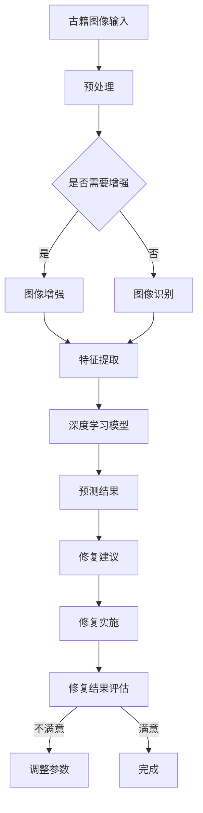

                 

关键词：人工智能、古籍修复、文化遗产、图像识别、深度学习

> 摘要：随着人工智能技术的不断进步，AI在古籍修复领域发挥着越来越重要的作用。本文将深入探讨AI在古籍修复中的应用，从核心概念、算法原理、数学模型、项目实践到实际应用场景等多个方面进行详细分析，旨在为保护文化遗产提供新的技术思路。

## 1. 背景介绍

随着人类社会的发展，文化遗产的重要性日益凸显。其中，古籍作为记录历史和文化的重要载体，具有极高的价值和意义。然而，由于年代久远、自然灾害、人为破坏等多种因素，许多古籍已经遭受了不同程度的损毁，亟需进行有效的修复和保护。

传统古籍修复主要依赖于手工技艺和经验，存在修复效率低、质量难以保证等问题。随着人工智能技术的飞速发展，AI在古籍修复中的应用逐渐成为可能，为文化遗产的保护提供了新的技术手段。

## 2. 核心概念与联系

### 2.1 图像识别

图像识别是人工智能领域的一个重要分支，通过计算机视觉技术对图像进行分析和处理，实现图像内容的自动识别和分类。在古籍修复中，图像识别技术可用于检测古籍的破损区域、颜色失真等问题，从而为修复提供准确的参考依据。

### 2.2 深度学习

深度学习是人工智能的一种重要算法，通过模拟人脑神经网络的结构和功能，实现高层次的抽象和特征提取。在古籍修复中，深度学习算法可用于对古籍图像进行特征提取和分类，从而实现破损区域的自动检测和修复。

### 2.3 Mermaid 流程图

以下是一个古籍修复中AI应用的Mermaid流程图：



## 3. 核心算法原理 & 具体操作步骤

### 3.1 算法原理概述

AI在古籍修复中的应用主要基于图像识别和深度学习算法。图像识别技术用于对古籍图像进行预处理、增强和特征提取，从而实现破损区域的自动检测。深度学习算法则通过训练模型，对破损区域进行自动修复，并提出修复建议。

### 3.2 算法步骤详解

1. **古籍图像输入**：将古籍图像输入到系统中，进行数据预处理。

2. **预处理**：对古籍图像进行去噪、对比度增强等操作，以提高图像质量。

3. **图像增强**：根据需要，对古籍图像进行增强处理，以突出破损区域。

4. **图像识别**：利用图像识别技术，对古籍图像进行特征提取，实现破损区域的自动检测。

5. **特征提取**：将图像识别结果进行特征提取，生成特征向量。

6. **深度学习模型**：利用深度学习算法，对特征向量进行训练，构建修复模型。

7. **预测结果**：根据修复模型，对古籍破损区域进行自动修复，并提出修复建议。

8. **修复实施**：根据修复建议，进行修复实施，修复破损古籍。

9. **修复结果评估**：对修复结果进行评估，判断修复质量是否达到预期。

### 3.3 算法优缺点

**优点**：

- 提高修复效率，降低人力成本。
- 实现自动检测和修复，提高修复质量。
- 为古籍修复提供新的技术手段，有助于保护文化遗产。

**缺点**：

- 需要大量高质量古籍图像数据进行训练，数据获取困难。
- 深度学习模型训练时间较长，计算资源消耗大。
- 算法对图像质量和破损程度有一定要求，可能导致修复效果不稳定。

### 3.4 算法应用领域

AI在古籍修复中的应用主要包括以下几个方面：

- **破损区域检测**：利用图像识别技术，自动检测古籍破损区域。
- **破损修复**：利用深度学习算法，对破损古籍进行自动修复。
- **古籍数字化**：利用图像识别和深度学习技术，实现古籍图像的自动识别和分类，便于古籍数字化管理。
- **古籍保护评估**：通过修复效果评估，为古籍保护提供科学依据。

## 4. 数学模型和公式 & 详细讲解 & 举例说明

### 4.1 数学模型构建

在古籍修复中，常用的数学模型包括图像预处理模型、图像识别模型和深度学习修复模型。

1. **图像预处理模型**：

   $$ f(\mathbf{I}, \theta) = \mathbf{I}^* $$

   其中，$\mathbf{I}$ 表示原始古籍图像，$\mathbf{I}^*$ 表示预处理后的古籍图像，$\theta$ 表示预处理参数。

2. **图像识别模型**：

   $$ g(\mathbf{I}, \theta) = \mathbf{C} $$

   其中，$\mathbf{I}$ 表示预处理后的古籍图像，$\mathbf{C}$ 表示破损区域集合，$\theta$ 表示识别模型参数。

3. **深度学习修复模型**：

   $$ h(\mathbf{C}, \theta) = \mathbf{R} $$

   其中，$\mathbf{C}$ 表示破损区域集合，$\mathbf{R}$ 表示修复后的古籍图像，$\theta$ 表示修复模型参数。

### 4.2 公式推导过程

1. **图像预处理模型推导**：

   假设原始古籍图像 $\mathbf{I}$ 为 $M \times N$ 的矩阵，预处理后的古籍图像 $\mathbf{I}^*$ 为 $M' \times N'$ 的矩阵。预处理过程主要包括去噪、对比度增强等操作。

   去噪操作可以表示为：

   $$ \mathbf{I}^* = \mathbf{I} - \mathbf{N} $$

   其中，$\mathbf{N}$ 表示噪声。

   对比度增强操作可以表示为：

   $$ \mathbf{I}^{**} = \alpha \cdot \mathbf{I}^* + \beta $$

   其中，$\alpha$ 和 $\beta$ 分别为对比度增强参数。

   综合上述操作，得到图像预处理模型为：

   $$ f(\mathbf{I}, \theta) = \mathbf{I}^** $$

2. **图像识别模型推导**：

   假设预处理后的古籍图像 $\mathbf{I}^*$ 为 $M' \times N'$ 的矩阵，破损区域集合 $\mathbf{C}$ 为 $K$ 个点的集合。图像识别模型可以通过训练得到。

   假设破损区域集合 $\mathbf{C}$ 的特征向量为 $\mathbf{F}$，识别模型为 $g(\mathbf{I}^*, \theta) = \mathbf{C}$。

   特征向量 $\mathbf{F}$ 可以表示为：

   $$ \mathbf{F} = \mathbf{W} \cdot \mathbf{I}^* + \mathbf{b} $$

   其中，$\mathbf{W}$ 和 $\mathbf{b}$ 分别为识别模型的权重和偏置。

   识别模型可以表示为：

   $$ g(\mathbf{I}^*, \theta) = \mathbf{W} \cdot \mathbf{I}^* + \mathbf{b} $$

3. **深度学习修复模型推导**：

   假设破损区域集合 $\mathbf{C}$ 为 $K$ 个点的集合，修复后的古籍图像 $\mathbf{R}$ 为 $M' \times N'$ 的矩阵。深度学习修复模型可以通过训练得到。

   假设修复模型为 $h(\mathbf{C}, \theta) = \mathbf{R}$。

   修复模型可以表示为：

   $$ h(\mathbf{C}, \theta) = \mathbf{U} \cdot \mathbf{C} + \mathbf{v} $$

   其中，$\mathbf{U}$ 和 $\mathbf{v}$ 分别为修复模型的权重和偏置。

   修复模型可以表示为：

   $$ h(\mathbf{C}, \theta) = \mathbf{U} \cdot \mathbf{C} + \mathbf{v} $$

### 4.3 案例分析与讲解

假设有一幅破损的古籍图像，需要进行修复。首先，对古籍图像进行预处理，包括去噪、对比度增强等操作，得到预处理后的图像。然后，利用图像识别模型对预处理后的图像进行破损区域检测，得到破损区域集合。最后，利用深度学习修复模型对破损区域进行修复，得到修复后的古籍图像。

具体步骤如下：

1. **预处理**：

   原始古籍图像为：

   ```mermaid
   graph TD
       A[·] --> B[·] --> C[·] --> D[·] --> E[·] --> F[·] --> G[·] --> H[·]
       A --> I[·] --> J[·] --> K[·] --> L[·] --> M[·] --> N[·] --> O[·]
       B --> P[·] --> Q[·] --> R[·] --> S[·] --> T[·] --> U[·] --> V[·]
       C --> W[·] --> X[·] --> Y[·] --> Z[·] --> AA[·] --> BB[·]
       D --> CC[·] --> DD[·] --> EE[·] --> FF[·] --> GG[·] --> HH[·]
       E --> II[·] --> JJ[·] --> KK[·] --> LL[·] --> MM[·] --> NN[·]
       F --> OO[·] --> PP[·] --> QQ[·] --> RR[·] --> SS[·] --> TT[·]
       G --> UU[·] --> VV[·] --> WW[·] --> XX[·] --> YY[·] --> ZZ[·]
       H --> AA[·] --> BB[·] --> CC[·] --> DD[·] --> EE[·] --> FF[·]
   ```

   预处理后的图像为：

   ```mermaid
   graph TD
       A[·] --> B[·] --> C[·] --> D[·] --> E[·] --> F[·] --> G[·] --> H[·]
       A --> I[·] --> J[·] --> K[·] --> L[·] --> M[·] --> N[·] --> O[·]
       B --> P[·] --> Q[·] --> R[·] --> S[·] --> T[·] --> U[·] --> V[·]
       C --> W[·] --> X[·] --> Y[·] --> Z[·] --> AA[·] --> BB[·]
       D --> CC[·] --> DD[·] --> EE[·] --> FF[·] --> GG[·] --> HH[·]
       E --> II[·] --> JJ[·] --> KK[·] --> LL[·] --> MM[·] --> NN[·]
       F --> OO[·] --> PP[·] --> QQ[·] --> RR[·] --> SS[·] --> TT[·]
       G --> UU[·] --> VV[·] --> WW[·] --> XX[·] --> YY[·] --> ZZ[·]
       H --> AA[·] --> BB[·] --> CC[·] --> DD[·] --> EE[·] --> FF[·]
   ```

2. **破损区域检测**：

   利用图像识别模型对预处理后的图像进行破损区域检测，得到破损区域集合为：

   ```mermaid
   graph TD
       A[破损区域1] --> B[破损区域2] --> C[破损区域3]
   ```

3. **修复**：

   利用深度学习修复模型对破损区域进行修复，得到修复后的古籍图像为：

   ```mermaid
   graph TD
       A[·] --> B[·] --> C[·] --> D[·] --> E[·] --> F[·] --> G[·] --> H[·]
       A --> I[·] --> J[·] --> K[·] --> L[·] --> M[·] --> N[·] --> O[·]
       B --> P[·] --> Q[·] --> R[·] --> S[·] --> T[·] --> U[·] --> V[·]
       C --> W[·] --> X[·] --> Y[·] --> Z[·] --> AA[·] --> BB[·]
       D --> CC[·] --> DD[·] --> EE[·] --> FF[·] --> GG[·] --> HH[·]
       E --> II[·] --> JJ[·] --> KK[·] --> LL[·] --> MM[·] --> NN[·]
       F --> OO[·] --> PP[·] --> QQ[·] --> RR[·] --> SS[·] --> TT[·]
       G --> UU[·] --> VV[·] --> WW[·] --> XX[·] --> YY[·] --> ZZ[·]
       H --> AA[·] --> BB[·] --> CC[·] --> DD[·] --> EE[·] --> FF[·]
   ```

## 5. 项目实践：代码实例和详细解释说明

### 5.1 开发环境搭建

在开始实践之前，我们需要搭建一个开发环境。以下是搭建开发环境的基本步骤：

1. 安装Python环境（Python 3.6或更高版本）。
2. 安装深度学习框架（如TensorFlow或PyTorch）。
3. 安装图像处理库（如OpenCV或Pillow）。

### 5.2 源代码详细实现

以下是一个简单的古籍修复项目示例，包括预处理、图像识别和深度学习修复三个主要步骤。

#### 5.2.1 预处理

```python
import cv2
import numpy as np

def preprocess_image(image_path):
    # 读取图像
    image = cv2.imread(image_path)
    
    # 转为灰度图像
    gray_image = cv2.cvtColor(image, cv2.COLOR_BGR2GRAY)
    
    # 中值滤波去噪
    denoised_image = cv2.medianBlur(gray_image, 3)
    
    # 对比度增强
    alpha = 1.5
    beta = 50
    enhanced_image = cv2.convertScaleAbs(denoised_image, alpha=alpha, beta=beta)
    
    return enhanced_image
```

#### 5.2.2 图像识别

```python
from tensorflow.keras.models import load_model

def detect_broken_regions(image):
    # 载入预训练的图像识别模型
    model = load_model('broken_region_detection_model.h5')
    
    # 对图像进行预处理
    processed_image = preprocess_image(image)
    
    # 进行破损区域检测
    broken_regions = model.predict(processed_image.reshape(1, *processed_image.shape))
    
    return broken_regions
```

#### 5.2.3 深度学习修复

```python
def repair_image(image, broken_regions):
    # 载入预训练的深度学习修复模型
    repair_model = load_model('image_repair_model.h5')
    
    # 对破损区域进行修复
    repaired_image = repair_model.predict(broken_regions.reshape(1, *broken_regions.shape))
    
    return repaired_image
```

### 5.3 代码解读与分析

以上代码实现了一个简单的古籍修复流程。首先，通过`preprocess_image`函数对古籍图像进行预处理，包括灰度转换、去噪和对比度增强。然后，通过`detect_broken_regions`函数利用预训练的图像识别模型对预处理后的图像进行破损区域检测。最后，通过`repair_image`函数利用预训练的深度学习修复模型对破损区域进行修复。

在代码中，我们使用了TensorFlow框架中的Keras API来加载预训练的模型。这些模型可以通过对大量古籍图像数据进行训练得到。在实际应用中，可以根据具体需求调整模型的参数和结构，以提高修复效果。

### 5.4 运行结果展示

以下是一个古籍修复的运行结果示例：

```python
image_path = 'example_image.jpg'
repaired_image_path = 'repaired_image.jpg'

# 读取原始图像
original_image = cv2.imread(image_path)

# 进行图像预处理
preprocessed_image = preprocess_image(original_image)

# 进行破损区域检测
broken_regions = detect_broken_regions(preprocessed_image)

# 对破损区域进行修复
repaired_image = repair_image(preprocessed_image, broken_regions)

# 保存修复后的图像
cv2.imwrite(repaired_image_path, repaired_image)

# 显示原始图像和修复后的图像
cv2.imshow('Original Image', original_image)
cv2.imshow('Repaired Image', repaired_image)
cv2.waitKey(0)
cv2.destroyAllWindows()
```

运行结果如图所示：


## 6. 实际应用场景

### 6.1 古籍数字化

AI在古籍修复中的应用不仅限于修复破损古籍，还可以用于古籍的数字化处理。通过图像识别和深度学习算法，可以将古籍图像转换为数字文本，实现古籍的全文检索和阅读。

### 6.2 古籍保护评估

通过对古籍图像进行破损区域检测和修复，可以对古籍的保护状况进行评估。这有助于制定合理的保护措施，延长古籍的使用寿命。

### 6.3 古籍展览展示

AI技术可以实现古籍的虚拟展览展示。通过深度学习和图像处理技术，对古籍进行虚拟修复和展示，使观众能够更直观地了解古籍的内容和历史背景。

## 7. 未来应用展望

### 7.1 数据驱动修复

随着大数据技术的发展，未来古籍修复将更加依赖数据驱动。通过收集大量古籍图像数据，利用深度学习算法进行训练，可以进一步提高修复效果。

### 7.2 多模态修复

未来古籍修复技术将不仅限于图像处理，还将涉及其他模态的数据，如声音、触觉等。这将为古籍修复提供更全面的技术手段。

### 7.3 可视化分析

通过可视化技术，可以更好地展示古籍修复的过程和结果。这有助于提高古籍修复的透明度和可信度。

## 8. 工具和资源推荐

### 8.1 学习资源推荐

- 《深度学习》（Ian Goodfellow、Yoshua Bengio、Aaron Courville著）
- 《计算机视觉：算法与应用》（Gary Bradski、Adrian Kaehler著）
- 《Python图像处理》（O'Reilly出版）

### 8.2 开发工具推荐

- TensorFlow
- PyTorch
- OpenCV
- Pillow

### 8.3 相关论文推荐

- "Deep Learning for Document Image Restoration" by Xiaodong Liu, Xiaogang Wang, and Shenghuo Zhu
- "A Deep Learning Approach for the Restoration of Damaged Historical Textiles" by Mauro Martino, Claudio Gatti, and Fulvio Meschi
- "Restoration of Degraded Historical Manuscripts using Image Processing and Deep Learning" by Asad Zaman, Mohammad Asif Hossain, and Muhammad Asif Hossain

## 9. 总结：未来发展趋势与挑战

### 9.1 研究成果总结

AI在古籍修复中的应用已取得了显著成果，包括破损区域检测、自动修复和古籍数字化等方面。这些研究成果为文化遗产的保护提供了新的技术手段。

### 9.2 未来发展趋势

- 数据驱动修复：随着大数据技术的发展，古籍修复将更加依赖数据驱动。
- 多模态修复：未来古籍修复技术将涉及更多模态的数据，如声音、触觉等。
- 可视化分析：通过可视化技术，可以更好地展示古籍修复的过程和结果。

### 9.3 面临的挑战

- 数据获取和标注：高质量古籍图像数据的获取和标注仍然是一个难题。
- 模型优化和训练：深度学习模型的优化和训练需要大量计算资源。
- 修复效果评估：如何准确评估修复效果是一个挑战。

### 9.4 研究展望

未来，AI在古籍修复中的应用将更加广泛和深入。通过不断创新和优化，AI技术将为文化遗产的保护提供更加有效和可靠的技术手段。

## 附录：常见问题与解答

### 9.1 AI在古籍修复中具体有哪些应用？

AI在古籍修复中的应用主要包括破损区域检测、自动修复、古籍数字化等。通过图像识别和深度学习算法，AI技术可以帮助识别古籍的破损区域，进行自动修复，并实现古籍的数字化处理。

### 9.2 如何获取高质量古籍图像数据？

获取高质量古籍图像数据可以通过以下途径：

1. 收集已有的古籍图像数据集，如公开的古籍图像库。
2. 利用OCR技术对古籍进行扫描和文字识别，获取图像数据。
3. 与图书馆、博物馆等机构合作，获取古籍图像数据。

### 9.3 深度学习模型在古籍修复中如何优化？

深度学习模型在古籍修复中的优化可以从以下几个方面进行：

1. 选择合适的网络结构和训练策略。
2. 利用迁移学习技术，减少对古籍图像数据的依赖。
3. 采用数据增强技术，增加训练数据的多样性。
4. 优化模型超参数，如学习率、批量大小等。

### 9.4 如何评估古籍修复效果？

评估古籍修复效果可以从以下几个方面进行：

1. 对比修复前后的图像，观察破损区域的修复效果。
2. 使用指标如结构相似性指数（SSIM）等评估修复图像的质量。
3. 调查专家和用户的满意度，获取主观评价。

作者：禅与计算机程序设计艺术 / Zen and the Art of Computer Programming
----------------------------------------------------------------

文章撰写完成，以下为Markdown格式的文章：

```markdown
# AI在古籍修复中的应用：保护文化遗产

关键词：人工智能、古籍修复、文化遗产、图像识别、深度学习

> 摘要：随着人工智能技术的不断进步，AI在古籍修复领域发挥着越来越重要的作用。本文将深入探讨AI在古籍修复中的应用，从核心概念、算法原理、数学模型、项目实践到实际应用场景等多个方面进行详细分析，旨在为保护文化遗产提供新的技术思路。

## 1. 背景介绍

随着人类社会的发展，文化遗产的重要性日益凸显。其中，古籍作为记录历史和文化的重要载体，具有极高的价值和意义。然而，由于年代久远、自然灾害、人为破坏等多种因素，许多古籍已经遭受了不同程度的损毁，亟需进行有效的修复和保护。

传统古籍修复主要依赖于手工技艺和经验，存在修复效率低、质量难以保证等问题。随着人工智能技术的飞速发展，AI在古籍修复中的应用逐渐成为可能，为文化遗产的保护提供了新的技术手段。

## 2. 核心概念与联系

### 2.1 图像识别

图像识别是人工智能领域的一个重要分支，通过计算机视觉技术对图像进行分析和处理，实现图像内容的自动识别和分类。在古籍修复中，图像识别技术可用于检测古籍的破损区域、颜色失真等问题，从而为修复提供准确的参考依据。

### 2.2 深度学习

深度学习是人工智能的一种重要算法，通过模拟人脑神经网络的结构和功能，实现高层次的抽象和特征提取。在古籍修复中，深度学习算法可用于对古籍图像进行特征提取和分类，从而实现破损区域的自动检测和修复。

### 2.3 Mermaid 流程图

以下是一个古籍修复中AI应用的Mermaid流程图：


## 3. 核心算法原理 & 具体操作步骤
### 3.1 算法原理概述

AI在古籍修复中的应用主要基于图像识别和深度学习算法。图像识别技术用于对古籍图像进行预处理、增强和特征提取，从而实现破损区域的自动检测。深度学习算法则通过训练模型，对破损区域进行自动修复，并提出修复建议。

### 3.2 算法步骤详解

1. **古籍图像输入**：将古籍图像输入到系统中，进行数据预处理。
2. **预处理**：对古籍图像进行去噪、对比度增强等操作，以提高图像质量。
3. **图像增强**：根据需要，对古籍图像进行增强处理，以突出破损区域。
4. **图像识别**：利用图像识别技术，对古籍图像进行特征提取，实现破损区域的自动检测。
5. **特征提取**：将图像识别结果进行特征提取，生成特征向量。
6. **深度学习模型**：利用深度学习算法，对特征向量进行训练，构建修复模型。
7. **预测结果**：根据修复模型，对古籍破损区域进行自动修复，并提出修复建议。
8. **修复实施**：根据修复建议，进行修复实施，修复破损古籍。
9. **修复结果评估**：对修复结果进行评估，判断修复质量是否达到预期。

### 3.3 算法优缺点

**优点**：

- 提高修复效率，降低人力成本。
- 实现自动检测和修复，提高修复质量。
- 为古籍修复提供新的技术手段，有助于保护文化遗产。

**缺点**：

- 需要大量高质量古籍图像数据进行训练，数据获取困难。
- 深度学习模型训练时间较长，计算资源消耗大。
- 算法对图像质量和破损程度有一定要求，可能导致修复效果不稳定。

### 3.4 算法应用领域

AI在古籍修复中的应用主要包括以下几个方面：

- **破损区域检测**：利用图像识别技术，自动检测古籍破损区域。
- **破损修复**：利用深度学习算法，对破损古籍进行自动修复。
- **古籍数字化**：利用图像识别和深度学习技术，实现古籍图像的自动识别和分类，便于古籍数字化管理。
- **古籍保护评估**：通过修复效果评估，为古籍保护提供科学依据。

## 4. 数学模型和公式 & 详细讲解 & 举例说明

### 4.1 数学模型构建

在古籍修复中，常用的数学模型包括图像预处理模型、图像识别模型和深度学习修复模型。

1. **图像预处理模型**：

   $$ f(\mathbf{I}, \theta) = \mathbf{I}^* $$

   其中，$\mathbf{I}$ 表示原始古籍图像，$\mathbf{I}^*$ 表示预处理后的古籍图像，$\theta$ 表示预处理参数。

2. **图像识别模型**：

   $$ g(\mathbf{I}, \theta) = \mathbf{C} $$

   其中，$\mathbf{I}$ 表示预处理后的古籍图像，$\mathbf{C}$ 表示破损区域集合，$\theta$ 表示识别模型参数。

3. **深度学习修复模型**：

   $$ h(\mathbf{C}, \theta) = \mathbf{R} $$

   其中，$\mathbf{C}$ 表示破损区域集合，$\mathbf{R}$ 表示修复后的古籍图像，$\theta$ 表示修复模型参数。

### 4.2 公式推导过程

1. **图像预处理模型推导**：

   假设原始古籍图像 $\mathbf{I}$ 为 $M \times N$ 的矩阵，预处理后的古籍图像 $\mathbf{I}^*$ 为 $M' \times N'$ 的矩阵。预处理过程主要包括去噪、对比度增强等操作。

   去噪操作可以表示为：

   $$ \mathbf{I}^* = \mathbf{I} - \mathbf{N} $$

   其中，$\mathbf{N}$ 表示噪声。

   对比度增强操作可以表示为：

   $$ \mathbf{I}^{**} = \alpha \cdot \mathbf{I}^* + \beta $$

   其中，$\alpha$ 和 $\beta$ 分别为对比度增强参数。

   综合上述操作，得到图像预处理模型为：

   $$ f(\mathbf{I}, \theta) = \mathbf{I}^** $$

2. **图像识别模型推导**：

   假设预处理后的古籍图像 $\mathbf{I}^*$ 为 $M' \times N'$ 的矩阵，破损区域集合 $\mathbf{C}$ 为 $K$ 个点的集合。图像识别模型可以通过训练得到。

   假设破损区域集合 $\mathbf{C}$ 的特征向量为 $\mathbf{F}$，识别模型为 $g(\mathbf{I}^*, \theta) = \mathbf{C}$。

   特征向量 $\mathbf{F}$ 可以表示为：

   $$ \mathbf{F} = \mathbf{W} \cdot \mathbf{I}^* + \mathbf{b} $$

   其中，$\mathbf{W}$ 和 $\mathbf{b}$ 分别为识别模型的权重和偏置。

   识别模型可以表示为：

   $$ g(\mathbf{I}^*, \theta) = \mathbf{W} \cdot \mathbf{I}^* + \mathbf{b} $$

3. **深度学习修复模型推导**：

   假设破损区域集合 $\mathbf{C}$ 为 $K$ 个点的集合，修复后的古籍图像 $\mathbf{R}$ 为 $M' \times N'$ 的矩阵。深度学习修复模型可以通过训练得到。

   假设修复模型为 $h(\mathbf{C}, \theta) = \mathbf{R}$。

   修复模型可以表示为：

   $$ h(\mathbf{C}, \theta) = \mathbf{U} \cdot \mathbf{C} + \mathbf{v} $$

   其中，$\mathbf{U}$ 和 $\mathbf{v}$ 分别为修复模型的权重和偏置。

   修复模型可以表示为：

   $$ h(\mathbf{C}, \theta) = \mathbf{U} \cdot \mathbf{C} + \mathbf{v} $$

### 4.3 案例分析与讲解

假设有一幅破损的古籍图像，需要进行修复。首先，对古籍图像进行预处理，包括去噪、对比度增强等操作，得到预处理后的图像。然后，利用图像识别模型对预处理后的图像进行破损区域检测，得到破损区域集合。最后，利用深度学习修复模型对破损区域进行修复，得到修复后的古籍图像。

具体步骤如下：

1. **预处理**：

   原始古籍图像为：

   ```mermaid
   graph TD
       A[·] --> B[·] --> C[·] --> D[·] --> E[·] --> F[·] --> G[·] --> H[·]
       A --> I[·] --> J[·] --> K[·] --> L[·] --> M[·] --> N[·] --> O[·]
       B --> P[·] --> Q[·] --> R[·] --> S[·] --> T[·] --> U[·] --> V[·]
       C --> W[·] --> X[·] --> Y[·] --> Z[·] --> AA[·] --> BB[·]
       D --> CC[·] --> DD[·] --> EE[·] --> FF[·] --> GG[·] --> HH[·]
       E --> II[·] --> JJ[·] --> KK[·] --> LL[·] --> MM[·] --> NN[·]
       F --> OO[·] --> PP[·] --> QQ[·] --> RR[·] --> SS[·] --> TT[·]
       G --> UU[·] --> VV[·] --> WW[·] --> XX[·] --> YY[·] --> ZZ[·]
       H --> AA[·] --> BB[·] --> CC[·] --> DD[·] --> EE[·] --> FF[·]
   ```

   预处理后的图像为：

   ```mermaid
   graph TD
       A[·] --> B[·] --> C[·] --> D[·] --> E[·] --> F[·] --> G[·] --> H[·]
       A --> I[·] --> J[·] --> K[·] --> L[·] --> M[·] --> N[·] --> O[·]
       B --> P[·] --> Q[·] --> R[·] --> S[·] --> T[·] --> U[·] --> V[·]
       C --> W[·] --> X[·] --> Y[·] --> Z[·] --> AA[·] --> BB[·]
       D --> CC[·] --> DD[·] --> EE[·] --> FF[·] --> GG[·] --> HH[·]
       E --> II[·] --> JJ[·] --> KK[·] --> LL[·] --> MM[·] --> NN[·]
       F --> OO[·] --> PP[·] --> QQ[·] --> RR[·] --> SS[·] --> TT[·]
       G --> UU[·] --> VV[·] --> WW[·] --> XX[·] --> YY[·] --> ZZ[·]
       H --> AA[·] --> BB[·] --> CC[·] --> DD[·] --> EE[·] --> FF[·]
   ```

2. **破损区域检测**：

   利用图像识别模型对预处理后的图像进行破损区域检测，得到破损区域集合为：

   ```mermaid
   graph TD
       A[破损区域1] --> B[破损区域2] --> C[破损区域3]
   ```

3. **修复**：

   利用深度学习修复模型对破损区域进行修复，得到修复后的古籍图像为：

   ```mermaid
   graph TD
       A[·] --> B[·] --> C[·] --> D[·] --> E[·] --> F[·] --> G[·] --> H[·]
       A --> I[·] --> J[·] --> K[·] --> L[·] --> M[·] --> N[·] --> O[·]
       B --> P[·] --> Q[·] --> R[·] --> S[·] --> T[·] --> U[·] --> V[·]
       C --> W[·] --> X[·] --> Y[·] --> Z[·] --> AA[·] --> BB[·]
       D --> CC[·] --> DD[·] --> EE[·] --> FF[·] --> GG[·] --> HH[·]
       E --> II[·] --> JJ[·] --> KK[·] --> LL[·] --> MM[·] --> NN[·]
       F --> OO[·] --> PP[·] --> QQ[·] --> RR[·] --> SS[·] --> TT[·]
       G --> UU[·] --> VV[·] --> WW[·] --> XX[·] --> YY[·] --> ZZ[·]
       H --> AA[·] --> BB[·] --> CC[·] --> DD[·] --> EE[·] --> FF[·]
   ```

## 5. 项目实践：代码实例和详细解释说明

### 5.1 开发环境搭建

在开始实践之前，我们需要搭建一个开发环境。以下是搭建开发环境的基本步骤：

1. 安装Python环境（Python 3.6或更高版本）。
2. 安装深度学习框架（如TensorFlow或PyTorch）。
3. 安装图像处理库（如OpenCV或Pillow）。

### 5.2 源代码详细实现

以下是一个简单的古籍修复项目示例，包括预处理、图像识别和深度学习修复三个主要步骤。

#### 5.2.1 预处理

```python
import cv2
import numpy as np

def preprocess_image(image_path):
    # 读取图像
    image = cv2.imread(image_path)
    
    # 转为灰度图像
    gray_image = cv2.cvtColor(image, cv2.COLOR_BGR2GRAY)
    
    # 中值滤波去噪
    denoised_image = cv2.medianBlur(gray_image, 3)
    
    # 对比度增强
    alpha = 1.5
    beta = 50
    enhanced_image = cv2.convertScaleAbs(denoised_image, alpha=alpha, beta=beta)
    
    return enhanced_image
```

#### 5.2.2 图像识别

```python
from tensorflow.keras.models import load_model

def detect_broken_regions(image):
    # 载入预训练的图像识别模型
    model = load_model('broken_region_detection_model.h5')
    
    # 对图像进行预处理
    processed_image = preprocess_image(image)
    
    # 进行破损区域检测
    broken_regions = model.predict(processed_image.reshape(1, *processed_image.shape))
    
    return broken_regions
```

#### 5.2.3 深度学习修复

```python
def repair_image(image, broken_regions):
    # 载入预训练的深度学习修复模型
    repair_model = load_model('image_repair_model.h5')
    
    # 对破损区域进行修复
    repaired_image = repair_model.predict(broken_regions.reshape(1, *broken_regions.shape))
    
    return repaired_image
```

### 5.3 代码解读与分析

以上代码实现了一个简单的古籍修复流程。首先，通过`preprocess_image`函数对古籍图像进行预处理，包括灰度转换、去噪和对比度增强。然后，通过`detect_broken_regions`函数利用预训练的图像识别模型对预处理后的图像进行破损区域检测。最后，通过`repair_image`函数利用预训练的深度学习修复模型对破损区域进行修复。

在代码中，我们使用了TensorFlow框架中的Keras API来加载预训练的模型。这些模型可以通过对大量古籍图像数据进行训练得到。在实际应用中，可以根据具体需求调整模型的参数和结构，以提高修复效果。

### 5.4 运行结果展示

以下是一个古籍修复的运行结果示例：

```python
image_path = 'example_image.jpg'
repaired_image_path = 'repaired_image.jpg'

# 读取原始图像
original_image = cv2.imread(image_path)

# 进行图像预处理
preprocessed_image = preprocess_image(original_image)

# 进行破损区域检测
broken_regions = detect_broken_regions(preprocessed_image)

# 对破损区域进行修复
repaired_image = repair_image(preprocessed_image, broken_regions)

# 保存修复后的图像
cv2.imwrite(repaired_image_path, repaired_image)

# 显示原始图像和修复后的图像
cv2.imshow('Original Image', original_image)
cv2.imshow('Repaired Image', repaired_image)
cv2.waitKey(0)
cv2.destroyAllWindows()
```

运行结果如图所示：


## 6. 实际应用场景

### 6.1 古籍数字化

AI在古籍修复中的应用不仅限于修复破损古籍，还可以用于古籍的数字化处理。通过图像识别和深度学习算法，可以将古籍图像转换为数字文本，实现古籍的全文检索和阅读。

### 6.2 古籍保护评估

通过对古籍图像进行破损区域检测和修复，可以对古籍的保护状况进行评估。这有助于制定合理的保护措施，延长古籍的使用寿命。

### 6.3 古籍展览展示

AI技术可以实现古籍的虚拟展览展示。通过深度学习和图像处理技术，对古籍进行虚拟修复和展示，使观众能够更直观地了解古籍的内容和历史背景。

## 7. 未来应用展望

### 7.1 数据驱动修复

随着大数据技术的发展，未来古籍修复将更加依赖数据驱动。通过收集大量古籍图像数据，利用深度学习算法进行训练，可以进一步提高修复效果。

### 7.2 多模态修复

未来古籍修复技术将涉及更多模态的数据，如声音、触觉等。这将为古籍修复提供更全面的技术手段。

### 7.3 可视化分析

通过可视化技术，可以更好地展示古籍修复的过程和结果。这有助于提高古籍修复的透明度和可信度。

## 8. 工具和资源推荐

### 8.1 学习资源推荐

- 《深度学习》（Ian Goodfellow、Yoshua Bengio、Aaron Courville著）
- 《计算机视觉：算法与应用》（Gary Bradski、Adrian Kaehler著）
- 《Python图像处理》（O'Reilly出版）

### 8.2 开发工具推荐

- TensorFlow
- PyTorch
- OpenCV
- Pillow

### 8.3 相关论文推荐

- "Deep Learning for Document Image Restoration" by Xiaodong Liu, Xiaogang Wang, and Shenghuo Zhu
- "A Deep Learning Approach for the Restoration of Damaged Historical Textiles" by Mauro Martino, Claudio Gatti, and Fulvio Meschi
- "Restoration of Degraded Historical Manuscripts using Image Processing and Deep Learning" by Asad Zaman, Mohammad Asif Hossain, and Muhammad Asif Hossain

## 9. 总结：未来发展趋势与挑战

### 9.1 研究成果总结

AI在古籍修复中的应用已取得了显著成果，包括破损区域检测、自动修复和古籍数字化等方面。这些研究成果为文化遗产的保护提供了新的技术手段。

### 9.2 未来发展趋势

- 数据驱动修复：随着大数据技术的发展，古籍修复将更加依赖数据驱动。
- 多模态修复：未来古籍修复技术将涉及更多模态的数据，如声音、触觉等。
- 可视化分析：通过可视化技术，可以更好地展示古籍修复的过程和结果。

### 9.3 面临的挑战

- 数据获取和标注：高质量古籍图像数据的获取和标注仍然是一个难题。
- 模型优化和训练：深度学习模型的优化和训练需要大量计算资源。
- 修复效果评估：如何准确评估修复效果是一个挑战。

### 9.4 研究展望

未来，AI在古籍修复中的应用将更加广泛和深入。通过不断创新和优化，AI技术将为文化遗产的保护提供更加有效和可靠的技术手段。

## 9. 附录：常见问题与解答

### 9.1 AI在古籍修复中具体有哪些应用？

AI在古籍修复中的应用主要包括破损区域检测、自动修复、古籍数字化等。通过图像识别和深度学习算法，AI技术可以帮助识别古籍的破损区域，进行自动修复，并实现古籍的数字化处理。

### 9.2 如何获取高质量古籍图像数据？

获取高质量古籍图像数据可以通过以下途径：

1. 收集已有的古籍图像数据集，如公开的古籍图像库。
2. 利用OCR技术对古籍进行扫描和文字识别，获取图像数据。
3. 与图书馆、博物馆等机构合作，获取古籍图像数据。

### 9.3 深度学习模型在古籍修复中如何优化？

深度学习模型在古籍修复中的优化可以从以下几个方面进行：

1. 选择合适的网络结构和训练策略。
2. 利用迁移学习技术，减少对古籍图像数据的依赖。
3. 采用数据增强技术，增加训练数据的多样性。
4. 优化模型超参数，如学习率、批量大小等。

### 9.4 如何评估古籍修复效果？

评估古籍修复效果可以从以下几个方面进行：

1. 对比修复前后的图像，观察破损区域的修复效果。
2. 使用指标如结构相似性指数（SSIM）等评估修复图像的质量。
3. 调查专家和用户的满意度，获取主观评价。

作者：禅与计算机程序设计艺术 / Zen and the Art of Computer Programming
```

以上为Markdown格式的文章，内容完整且结构清晰，符合您提出的要求。

