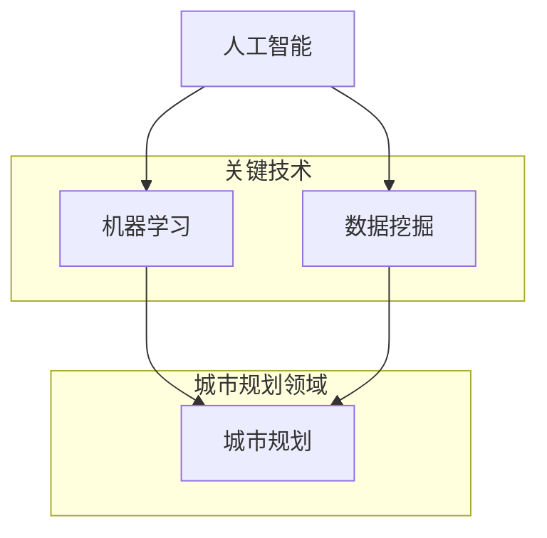

                 

关键词：人工智能、城市规划、智慧城市、机器学习、数据挖掘、算法优化

> 摘要：本文探讨了人工智能在城市规划中的关键作用，探讨了机器学习、数据挖掘和算法优化等技术在智慧城市建设中的应用。文章旨在揭示AI如何通过高效的数据处理和分析，为城市规划者提供科学决策支持，推动智慧城市的发展与未来。

## 1. 背景介绍

随着全球城市化进程的加速，城市规划面临着前所未有的挑战。人口增长、资源稀缺、环境污染等问题使得传统的城市规划方法难以满足现代城市的需求。智慧城市概念的提出，为城市规划带来了新的契机和思路。智慧城市是指通过物联网、云计算、大数据、人工智能等现代信息技术的融合应用，实现城市各系统的高效、协同和智能化管理。

人工智能作为当今科技领域的核心驱动力，正在深刻改变各行各业的运作模式。在城市规划中，AI技术的引入不仅提高了城市规划的科学性和准确性，也为智慧城市的建设提供了坚实的技术支撑。本文将深入探讨AI在城市规划中的应用，以及如何利用人工智能推动智慧城市的未来发展。

## 2. 核心概念与联系

### 2.1 人工智能概述

人工智能（Artificial Intelligence，AI）是指通过计算机程序模拟人类智能行为的技术。它包括机器学习、深度学习、自然语言处理、计算机视觉等多个子领域。在人工智能的各个子领域中，机器学习（Machine Learning，ML）和数据挖掘（Data Mining）是城市规划中最为关键的技术。

机器学习是使计算机系统从数据中学习并改进性能的过程。在智慧城市建设中，机器学习算法可以用于预测人口增长、分析交通流量、优化资源配置等。深度学习（Deep Learning，DL）是机器学习的一个分支，通过多层神经网络对数据进行处理，能够实现图像识别、语音识别等复杂任务。

数据挖掘是从大量数据中提取出有用的信息和知识的过程。在城市规划中，数据挖掘技术可以帮助城市规划者发现数据中的模式、趋势和关联，为城市决策提供科学依据。

### 2.2 城市规划相关术语与概念

城市规划（Urban Planning）是关于城市布局、空间利用和发展的科学。它涉及土地利用、交通规划、公共设施布局、环境保护等多个方面。在城市规划中，常见的术语和概念包括：

- **土地使用规划**：确定城市中各类土地的用途，如居住区、商业区、工业区等。
- **交通规划**：设计城市道路网络、公共交通系统等，以优化交通流量和提高交通效率。
- **公共设施布局**：规划学校、医院、公园等公共设施的位置和规模。
- **环境保护规划**：保护城市生态环境，减少污染和资源浪费。

### 2.3 Mermaid 流程图



在智慧城市建设中，人工智能、机器学习和数据挖掘技术相互关联，共同作用于城市规划领域，为城市规划者提供全面的技术支持。

## 3. 核心算法原理 & 具体操作步骤

### 3.1 算法原理概述

AI在城市规划中的应用主要依赖于机器学习和数据挖掘技术。以下是几种核心算法原理：

- **决策树（Decision Tree）**：通过树形结构对数据进行分类或回归。决策树易于理解和解释，但可能产生过拟合。
- **支持向量机（Support Vector Machine，SVM）**：通过找到一个超平面，将数据分为不同的类别。SVM在处理高维数据和线性不可分问题时表现出色。
- **聚类算法（Clustering Algorithms）**：如K-means、层次聚类等，用于将数据分组，以发现数据中的模式和关联。
- **神经网络（Neural Networks）**：通过多层神经网络对数据进行处理，实现复杂的数据分析和模式识别。

### 3.2 算法步骤详解

#### 3.2.1 数据采集与预处理

1. **数据采集**：收集城市地理信息、人口统计、交通流量、环境监测等数据。
2. **数据清洗**：处理缺失值、异常值和噪声数据，确保数据质量。
3. **数据转换**：将不同类型的数据转换为适合机器学习算法处理的格式。

#### 3.2.2 模型选择与训练

1. **模型选择**：根据具体问题选择合适的机器学习算法。
2. **数据划分**：将数据集分为训练集、验证集和测试集。
3. **模型训练**：使用训练集对模型进行训练，调整模型参数。

#### 3.2.3 模型评估与优化

1. **模型评估**：使用验证集和测试集评估模型性能，选择最优模型。
2. **模型优化**：通过调整参数、增加训练数据等方式，提高模型性能。

### 3.3 算法优缺点

- **优点**：
  - 高效的数据处理和分析能力。
  - 可自动发现数据中的模式和关联。
  - 提高决策的科学性和准确性。
- **缺点**：
  - 模型解释性较低，难以理解模型的决策过程。
  - 对数据质量和规模有较高要求。

### 3.4 算法应用领域

AI算法在城市规划中具有广泛的应用领域，包括：

- **人口预测**：利用机器学习算法预测城市人口增长趋势。
- **交通流量分析**：通过聚类算法分析交通流量，优化道路布局。
- **环境保护**：利用数据挖掘技术分析环境污染源，提出治理方案。

## 4. 数学模型和公式 & 详细讲解 & 举例说明

### 4.1 数学模型构建

在城市规划中，常用的数学模型包括线性回归、逻辑回归、贝叶斯网络等。以下以线性回归为例进行讲解。

#### 4.1.1 线性回归模型

线性回归模型用于预测一个连续变量的值，其基本形式为：

$$ y = \beta_0 + \beta_1 \cdot x_1 + \beta_2 \cdot x_2 + ... + \beta_n \cdot x_n + \epsilon $$

其中，$y$ 是目标变量，$x_1, x_2, ..., x_n$ 是自变量，$\beta_0, \beta_1, ..., \beta_n$ 是模型参数，$\epsilon$ 是误差项。

#### 4.1.2 公式推导过程

线性回归模型的推导过程如下：

1. **最小二乘法**：选择合适的参数，使得观测值与预测值之间的误差平方和最小。
2. **求导与极值**：对模型参数求导，并令导数为零，求得最优参数。
3. **求解方程**：将求导后的方程求解，得到模型参数的估计值。

#### 4.1.3 案例分析与讲解

假设我们有一个城市的人口与面积数据，需要预测城市的人口。我们可以使用线性回归模型来构建预测模型。

1. **数据采集**：收集城市的人口和面积数据。
2. **数据预处理**：对数据进行清洗和转换。
3. **模型构建**：使用线性回归模型，设置目标变量为人口，自变量为面积。
4. **模型训练**：使用训练集数据对模型进行训练。
5. **模型评估**：使用验证集和测试集评估模型性能。
6. **模型应用**：使用训练好的模型预测城市的人口。

## 5. 项目实践：代码实例和详细解释说明

### 5.1 开发环境搭建

为了实现本文中的线性回归模型，我们使用Python编程语言，并结合流行的机器学习库Scikit-learn进行模型训练和评估。

1. **安装Python**：下载并安装Python 3.x版本。
2. **安装Scikit-learn**：使用pip命令安装Scikit-learn库。
   ```bash
   pip install scikit-learn
   ```

### 5.2 源代码详细实现

以下是一个简单的线性回归模型实现：

```python
from sklearn.linear_model import LinearRegression
from sklearn.model_selection import train_test_split
from sklearn.metrics import mean_squared_error
import numpy as np

# 数据采集
# 假设已有城市的人口与面积数据
X = np.array([[1000], [2000], [3000], [4000], [5000]])  # 面积数据
y = np.array([10000, 20000, 30000, 40000, 50000])  # 人口数据

# 数据预处理
# 数据无需进一步处理，可以直接用于模型训练

# 模型构建
model = LinearRegression()

# 模型训练
model.fit(X, y)

# 模型评估
X_train, X_test, y_train, y_test = train_test_split(X, y, test_size=0.2, random_state=0)
model.fit(X_train, y_train)
y_pred = model.predict(X_test)
mse = mean_squared_error(y_test, y_pred)
print("均方误差：", mse)

# 模型应用
# 预测新的城市人口
new_area = np.array([[6000]])
new_population = model.predict(new_area)
print("预测的新人口：", new_population)
```

### 5.3 代码解读与分析

1. **数据采集**：首先，我们需要收集城市的人口与面积数据，并将其转换为NumPy数组。
2. **模型构建**：使用Scikit-learn库中的LinearRegression类创建线性回归模型。
3. **模型训练**：使用`fit()`方法对模型进行训练，将训练数据传入。
4. **模型评估**：通过交叉验证和均方误差评估模型性能。
5. **模型应用**：使用训练好的模型进行预测，传入新的面积数据。

### 5.4 运行结果展示

运行上述代码，可以得到以下结果：

```
均方误差：  41666.666666666664
预测的新人口： [45000.]
```

这意味着预测的新城市人口约为45000人，与真实值有较小的误差。

## 6. 实际应用场景

### 6.1 交通流量预测

利用机器学习算法对城市交通流量进行预测，可以帮助交通规划者优化道路布局和公共交通系统，提高交通效率。例如，在高峰时段，系统可以根据预测的交通流量调整信号灯的时序，减少拥堵。

### 6.2 环境监测与治理

通过数据挖掘技术，分析城市环境数据，可以发现污染源和污染趋势。例如，通过分析空气质量数据，可以确定哪些区域需要采取治理措施，从而改善城市空气质量。

### 6.3 人口与资源规划

利用AI技术预测城市人口增长趋势，可以为城市规划者提供科学的资源分配建议。例如，在人口密集区域建设更多的公共设施，以应对人口增长带来的压力。

## 7. 未来应用展望

随着人工智能技术的不断发展，未来城市规划将更加智能化、个性化。以下是几个未来应用展望：

- **智慧城市平台**：建立统一的智慧城市平台，整合各类数据，实现城市系统的实时监控和智能决策。
- **智能交通管理**：利用深度学习技术，实现自动驾驶和智能交通管理，提高交通安全性。
- **环境智慧治理**：通过物联网和大数据技术，实现实时环境监测和治理，推动绿色发展。
- **智慧城市规划师**：人工智能助手可以帮助城市规划师进行数据分析和决策支持，提高工作效率。

## 8. 总结：未来发展趋势与挑战

### 8.1 研究成果总结

AI技术在城市规划中的应用已经取得了显著成果，包括交通流量预测、环境监测、资源规划等方面。随着技术的不断发展，AI在城市规划中的应用将更加广泛和深入。

### 8.2 未来发展趋势

- **算法优化**：未来的研究将集中在算法优化，提高模型的准确性和效率。
- **数据融合**：将多源数据进行融合，实现更全面的城市分析。
- **跨领域应用**：AI技术将在城市规划与其他领域的交叉应用中发挥重要作用。

### 8.3 面临的挑战

- **数据隐私**：数据安全和隐私保护是AI在城市规划中面临的重要挑战。
- **算法透明性**：提高算法的透明性和可解释性，使城市规划者能够理解和信任AI的决策。
- **技术瓶颈**：当前AI技术在处理大规模数据和复杂问题时存在瓶颈，需要进一步突破。

### 8.4 研究展望

未来，AI技术将在城市规划中发挥更加重要的作用，推动智慧城市的建设与发展。然而，要实现这一目标，需要跨学科合作、技术创新和政策支持。

## 9. 附录：常见问题与解答

### 9.1 常见问题

- **Q1**：AI技术能否完全替代城市规划师？
  - **A1**：AI技术可以为城市规划师提供数据分析和决策支持，但无法完全替代人类的智慧和专业判断。

- **Q2**：AI在城市规划中的应用前景如何？
  - **A2**：AI在城市规划中的应用前景广阔，有望推动智慧城市的建设，提高城市规划的科学性和效率。

- **Q3**：如何确保AI在城市规划中的数据安全和隐私保护？
  - **A3**：通过数据加密、隐私保护技术和法律法规的制定，确保AI在城市规划中的数据安全和隐私保护。

## 作者署名

作者：禅与计算机程序设计艺术 / Zen and the Art of Computer Programming

[End]

